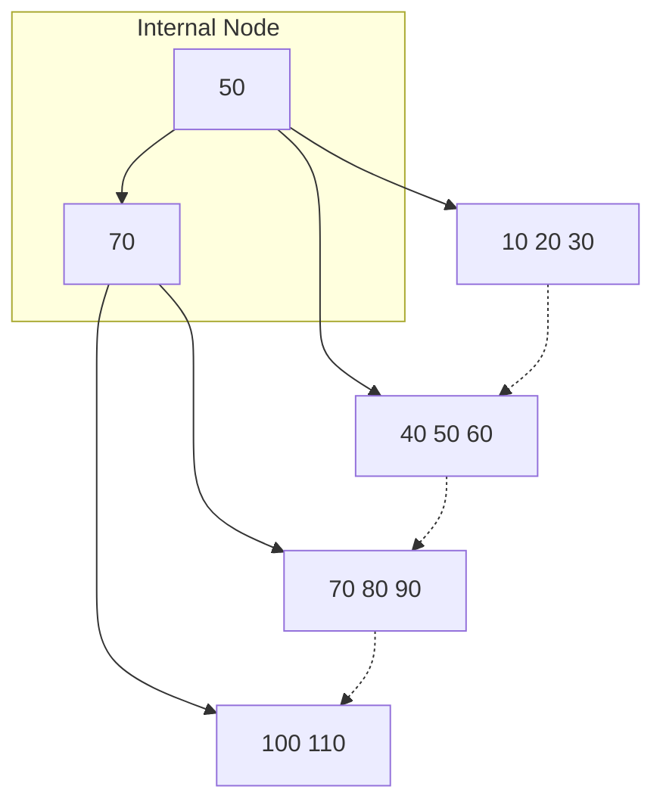

# Chapter 1: Database Management Systems — Exam Quick Revision

## Learning Objectives
- Master ER model constructs and notations for conceptual design
- Recall relational algebra operators with set-semantics intuition
- Distinguish normal forms (1NF-3NF-BCNF) with decomposition algorithms
- Interpret SQL join types and their relational algebra equivalents
- Apply ACID properties and concurrency control protocols to transaction scenarios
- Solve indexing and file organization problems for query optimization

<!-- Image Gallery -->
<section class="lesson-visuals" aria-label="Visual learning resources">
  <header><span>VISUAL LEARNING</span><h2>See it. Review it. Remember it.</h2></header>
  <a class="lesson-visual-card" href="../../assets/images/lessons/professional-knowledge/01-dbms/handwritten-notes.png" target="_blank" rel="noopener">
    
    <span><strong>Handwritten notes</strong>Condensed notes for deliberate review.</span>
  </a>
  <a class="lesson-visual-card" href="../../assets/images/lessons/professional-knowledge/01-dbms/sticky-notes.png" target="_blank" rel="noopener">
    
    <span><strong>Sticky-note revision</strong>Fast recall prompts for revision.</span>
  </a>
  <a class="lesson-visual-card" href="../../assets/images/lessons/professional-knowledge/01-dbms/visual-explanation.png" target="_blank" rel="noopener">
    
    <span><strong>Visual concept guide</strong>A connected explanation of the key ideas.</span>
  </a>
</section>
<!-- End Image Gallery -->

---

## 1. ER Model Quick Reference

### Entity, Attribute, Relationship

| Construct | Notation | Example |
|-----------|----------|---------|
| Entity (strong) | Rectangle | EMPLOYEE, DEPARTMENT |
| Entity (weak) | Double rectangle | DEPENDENT |
| Attribute (simple) | Ellipse | emp_id, emp_name |
| Attribute (composite) | Ellipse with sub-ellipses | address(street, city, pincode) |
| Attribute (derived) | Dashed ellipse | age (from DOB) |
| Attribute (multivalued) | Double ellipse | phone_numbers |
| Relationship | Diamond | WORKS_FOR, MANAGES |
| Key attribute | Underlined text | emp_id (primary key) |

### Cardinality Constraints

| Notation | Meaning |
|----------|---------|
| 1:1 | One entity of A relates to at most one of B (e.g., EMPLOYEE ↔ COMPANY_CAR) |
| 1:N | One entity of A relates to many of B (e.g., DEPARTMENT has many EMPLOYEES) |
| M:N | Many of A relate to many of B (e.g., STUDENT enrolls in COURSE) |

### Participation Constraints

- **Total participation** (double line): Every entity in the set participates (e.g., every EMPLOYEE must belong to a DEPARTMENT)
- **Partial participation** (single line): Some entities may not participate

---

## 2. Relational Algebra Operators

**Basis:** Set of operators that take one or two relations as input and produce a new relation as output.

### Select (σ) — Row Selection

```
σ_condition(R) = { t | t ∈ R ∧ condition(t) }
```
Example: `σ_salary > 50000(EMPLOYEE)` — employees earning more than 50K.

### Project (π) — Column Selection

```
π_col1, col2, ..., colk(R) = { t[col1, ..., colk] | t ∈ R }
```
Example: `π_emp_name, salary(EMPLOYEE)`

### Rename (ρ) — Alias

```
ρ_new_name(R) or ρ_new_name(col1,...,coln)(R)
```

### Union (∪), Intersection (∩), Set Difference (−)

Require relations to be **union-compatible** (same number of attributes, same domains).

### Cartesian Product (×)

```
R × S = { (r, s) | r ∈ R ∧ s ∈ S }
```

### Join Operators

| Join Type | Symbol | Description |
|-----------|--------|-------------|
| Theta join | R ⋈_θ S | R × S followed by σ_θ |
| Equi join | R ⋈_{A=B} S | Theta join where θ contains only equality |
| Natural join | R ⋈ S | Equi join on **all common attributes**, duplicates removed |
| Left outer join | R ⟕ S | All tuples from R, NULLs for non-matching S |
| Right outer join | R ⟖ S | All tuples from S, NULLs for non-matching R |
| Full outer join | R ⟗ S | All tuples from both, NULLs where no match |

### Division (÷)

```
R ÷ S = { t | t ∈ π_{R−S}(R) ∧ ∀u ∈ S, (t,u) ∈ R }
```
**Exam tip:** Division answers "which X has all Y?" — used for queries like "find employees who work in all departments."

---

## 3. Normalization

### Functional Dependency (FD) Axioms (Armstrong's)

- **Reflexivity:** If Y ⊆ X, then X → Y
- **Augmentation:** If X → Y, then XZ → YZ
- **Transitivity:** If X → Y and Y → Z, then X → Z
- Decomposition: If X → YZ, then X → Y and X → Z
- Union: If X → Y and X → Z, then X → YZ

### Normal Forms — Decomposition Guide

| NF | Condition | How to Fix Violation |
|----|-----------|---------------------|
| **1NF** | Atomic domains — no multi-valued attributes | Split each non-atomic cell into separate tuple |
| **2NF** | 1NF + no partial dependency (non-prime attr fully dependent on candidate key) | Remove partial FD: decompose into tables for each partial key + dependent attrs |
| **3NF** | 2NF + no transitive dependency (non-prime attr → non-prime attr) | Decompose by the transitive FD: R1(XY), R2(XZ) when X→Y and Y→Z |
| **BCNF** | 3NF + every determinant must be a superkey | Decompose by violating FD X→Y: R1(XY), R2(R−Y) |

### Decomposition Properties

- **Lossless join:** Decomposition should be recoverable via natural join
  - Binary decomposition check: `R1 ∩ R2 → R1` or `R1 ∩ R2 → R2`
- **Dependency preservation:** All FDs should be checkable on individual decomposed relations

### Solved Numerical: Decomposition

**Given:** R(A, B, C, D) with FDs: AB → C, C → D, D → A

**Step 1 — Candidate keys:** {AB}, {BC}, {BD} (all minimal superkeys)

**Step 2 — Check 2NF:** No partial FD because each key is single-attribute? No — AB → C, C → D. Since there is no partial dependency (non-prime attrs C, D fully depend on each candidate key), it is in 2NF.

**Step 3 — Check 3NF:** C → D (D is non-prime, C is not a superkey) ⇒ transitive dependency exists. So not in 3NF.

**Step 4 — Decompose into 3NF:** R1(C, D); R2(A, B, C)

---

## 4. SQL Joins Master Table

```sql
-- INNER JOIN — only matching rows from both
SELECT * FROM R INNER JOIN S ON R.id = S.id;

-- LEFT JOIN — all rows from R, NULLs where S has no match
SELECT * FROM R LEFT JOIN S ON R.id = S.id;

-- RIGHT JOIN — all rows from S, NULLs where R has no match
SELECT * FROM R RIGHT JOIN S ON R.id = S.id;

-- FULL JOIN — all rows from both, NULLs where no match
SELECT * FROM R FULL OUTER JOIN S ON R.id = S.id;

-- CROSS JOIN — Cartesian product (R × S)
SELECT * FROM R CROSS JOIN S;

-- SELF JOIN — table joined with itself (needs alias)
SELECT A.name, B.name AS manager
FROM EMP A INNER JOIN EMP B ON A.mgr_id = B.emp_id;
```

### Relational Algebra → SQL Mapping

| SQL Clause | Relational Algebra |
|------------|-------------------|
| `WHERE` | σ (select) |
| `SELECT` (columns) | π (project) |
| `JOIN ... ON` | ⋈ (join) |
| `UNION` | ∪ |
| `INTERSECT` | ∩ |
| `EXCEPT` | − |
| `GROUP BY` + aggregate | γ (group by) |
| `HAVING` | σ on groups |

### Aggregate Functions

`COUNT`, `SUM`, `AVG`, `MAX`, `MIN` — used with `GROUP BY`

**Query order:** `SELECT → FROM → WHERE → GROUP BY → HAVING → ORDER BY`

---

## 5. ACID Properties

| Property | Meaning | Enforced by |
|----------|---------|-------------|
| **Atomicity** | Transaction executes completely or not at all | Recovery manager (undo log) |
| **Consistency** | Transaction preserves database constraints | Application + DBMS |
| **Isolation** | Concurrent transactions appear to execute serially | Concurrency control (locking) |
| **Durability** | Committed changes persist despite failures | Recovery manager (redo log) |

---

## 6. Concurrency Control Protocols

### Lock-Based (2PL — Two-Phase Locking)

- **Phase 1 (Growing):** Acquire locks, no release
- **Phase 2 (Shrinking):** Release locks, no acquire
- **Strict 2PL:** All exclusive locks released only after commit — prevents cascading aborts
- **Rigorous 2PL:** All locks (shared + exclusive) released after commit

### Timestamp-Based Ordering

- Each transaction gets unique timestamp TS(T)
- **Read_TS(X):** Latest read timestamp on X
- **Write_TS(X):** Latest write timestamp on X
- **Thomas Write Rule:** Allows ignoring obsolete writes

| Operation | Condition | Action |
|-----------|-----------|--------|
| R_T(X) | TS(T) &lt; W_TS(X) | Abort T (too late to read) |
| R_T(X) | TS(T) ≥ W_TS(X) | Allow; set R_TS(X) = max(R_TS(X), TS(T)) |
| W_T(X) | TS(T) &lt; R_TS(X) | Abort T (obsolete write) |
| W_T(X) | TS(T) &lt; W_TS(X) | Ignore (Thomas rule) or abort |

### Deadlock in DB

- **Cycle in wait-for graph** ⇒ deadlock
- **Prevention:** Wait-die (older waits for younger) or Wound-wait (younger wounds older)
- **Detection:** Periodic check for cycle in wait-for graph
- **Recovery:** Choose victim (oldest/least-cost), rollback, restart

---

## 7. Transaction Isolation Levels (SQL Standard)

| Level | Dirty Read | Non-repeatable Read | Phantom Read | Lost Update |
|-------|-----------|-------------------|-------------|-------------|
| READ UNCOMMITTED | ❌ Possible | ❌ Possible | ❌ Possible | ❌ Possible |
| READ COMMITTED | ✅ Prevented | ❌ Possible | ❌ Possible | ❌ Possible |
| REPEATABLE READ | ✅ Prevented | ✅ Prevented | ❌ Possible | ❌ Possible |
| SERIALIZABLE | ✅ Prevented | ✅ Prevented | ✅ Prevented | ✅ Prevented |

**Default isolation in:** MySQL — REPEATABLE READ; PostgreSQL/Oracle — READ COMMITTED

---

## 8. Indexing

### B+ Tree Index

- **Multi-level index** — all keys in leaves; internal nodes act as routers
- **Order p** of B+ tree: max number of pointers in a node
- **Search cost:** O(log_p N) — typically 2–4 levels
- Supports range queries efficiently (linked leaves)

### Hash Index

- Direct address computation via hash function
- **O(1) for equality lookups** — but not for range queries
- **Static hashing:** overflow chaining when bucket full
- **Extendable hashing:** doubles directory size on overflow; gradual growth

### Clustered vs Non-clustered

| Aspect | Clustered | Non-clustered |
|--------|-----------|---------------|
| Data order | Physical order same as index | Logical order different from physical |
| No. per table | One (data stored at leaf) | Multiple |
| Leaf node | Contains actual data row | Contains pointer to data row |

---

## Solved MCQs

**Q1:** Consider relation R(A, B, C, D, E) with FDs: A → B, BC → D, D → E, E → A. How many candidate keys?
- (a) 1
- (b) 2
- (c) 3
- (d) 4

**Answer:** (d) 4. {A}, {BC}, {E}, {CD} are all candidate keys.

**Q2:** Two transactions: T1: R(A) W(A) R(B) W(B); T2: R(A) W(A) R(B) W(B). Which schedule is conflict serializable?
- (a) T1: R(A) W(A) | T2: R(A) W(A) | T1: R(B) W(B) | T2: R(B) W(B)
- (b) T1: R(A) W(A) R(B) W(B) | T2: R(A) W(A) R(B) W(B)

**Answer:** (a) — equivalent to serial order T1 → T2 (no conflicting RW/WR/WW between interleaved ops).

**Q3:** In a B+ tree of order 5, each node (except root) must have at least how many keys?
- (a) 2
- (b) 3
- (c) 4
- (d) 5

**Answer:** (a) 2. Ceil(p/2) − 1 = ceil(5/2) − 1 = 3 − 1 = 2 keys minimum for non-root.

---

## 9. Transaction States &amp; Log-Based Recovery

### Transaction States

```
Active → Partially Committed → Committed
Active → Failed → Aborted
```

- **Active:** Initial state — statements executing
- **Partially Committed:** After final statement executes
- **Failed:** Aborted due to error or rollback
- **Aborted:** Transaction rolled back; database restored to pre-transaction state
- **Committed:** All changes made permanent (durable)

### Log-Based Recovery

| Log Entry Type | Format | Action |
|---------------|--------|--------|
| Start | `&lt;T1 start&gt;` | Transaction began |
| Update | `&lt;T1, X, old, new&gt;` | T1 changed X from old to new |
| Commit | `&lt;T1 commit&gt;` | T1 committed — redo |
| Abort | `&lt;T1 abort&gt;` | T1 aborted — undo |

**Undo Logging:** Write old values; undo on abort
**Redo Logging:** Write new values; redo on recovery after crash
**Undo/Redo:** Both old and new written — flexible, most common

**ARIES Recovery Algorithm:**
1. **Analysis pass:** Determine dirty pages and active transactions from log
2. **Redo pass:** Reapply all changes (repeat history) from last checkpoint
3. **Undo pass:** Roll back uncommitted transactions (LSN-based)

### Checkpoint

- Periodically write dirty page table + active transaction list to disk
- Reduces recovery time — only need to scan log from last checkpoint

## 10. Lock Types in Concurrency Control

| Lock Type | Symbol | Compatible With | Description |
|-----------|--------|----------------|-------------|
| Shared (S) | S-lock | S (read-only) | Multiple transactions can read |
| Exclusive (X) | X-lock | None | Only one transaction can read/write |
| Intention Shared (IS) | IS | IS, S | Intention to lock finer granularity |
| Intention Exclusive (IX) | IX | IS, S, IX | Intention to lock finer with X |
| Shared+Intention Exclusive (SIX) | SIX | IS | S on this + IX on finer level |

### Lock Granularity Hierarchy

```
Table → Page → Row → Attribute
```
**Lock escalation:** Convert many fine locks to one coarse lock (reduces overhead)

### Two-Phase Locking (2PL) Subtypes

| Protocol | Growing | Shrinking | Cascading Aborts? |
|----------|---------|-----------|-------------------|
| Basic 2PL | Lock acquire | Lock release | ❌ Yes |
| Strict 2PL | Lock acquire | Release X-locks at commit | ✅ No |
| Rigorous 2PL | Lock acquire | Release all locks at commit | ✅ No |

---

## 11. SQL Aggregates &amp; Group By — Extended Examples

### GROUP BY with HAVING

```sql
-- Find departments with avg salary > 50000
SELECT dept_name, AVG(salary) as avg_sal, COUNT(*) as emp_count
FROM employee
WHERE salary > 30000
GROUP BY dept_name
HAVING AVG(salary) > 50000
ORDER BY avg_sal DESC;
```

### Execution Order in SQL

```
FROM → WHERE → GROUP BY → HAVING → SELECT → ORDER BY → LIMIT
```

### Aggregate Functions with NULL Handling

- `COUNT(*)` — counts all rows including NULLs
- `COUNT(column)` — counts non-NULL values only
- `AVG`, `SUM`, `MIN`, `MAX` — ignore NULLs
- `COALESCE(column, 0)` — replaces NULL with default

## 12. Query Optimization Basics

### Heuristic Optimization Rules

1. **Project early** (reduce columns early)
2. **Select early** (reduce rows early)
3. **Perform joins before Cartesian products**
4. **Use indexed access** when available (B+ tree for range, hash for equality)
5. **Pipeline operations** (avoid materializing intermediate results)

### Join Algorithms

| Algorithm | Conditions | Complexity | Use When |
|-----------|-----------|------------|----------|
| **Nested Loop** | Any join condition | O(n×m) | Small tables |
| **Block Nested Loop** | Any join condition | O(n×m / block_size) | Medium tables |
| **Index Nested Loop** | Index on inner table | O(n × log m) | Index available |
| **Sort-Merge** | Equi-join | O(n log n + m log m) | Sorted/large tables |
| **Hash Join** | Equi-join | O(n + m) | Large unsorted tables |

---

---

## 📌 Extended Theory — Deep Dive for IBPS SO Mains (2024–2026 Trends)

### Relational Algebra — Advanced Query Representation

**Division Operator Deep-Dive:**
The division operator `R ÷ S` answers "find all X that are associated with every Y." This is frequently tested in IBPS SO Mains.

```
R(A, B) = {(1, a), (1, b), (2, a), (2, c), (3, a), (3, b)}
S(B)    = {(a), (b)}
R ÷ S   = {(1), (3)}   — only 1 and 3 have both 'a' and 'b'
```

**SQL Equivalent of Division:**
```sql
SELECT DISTINCT A FROM R AS R1
WHERE NOT EXISTS (
    SELECT B FROM S
    WHERE NOT EXISTS (
        SELECT * FROM R AS R2
        WHERE R2.A = R1.A AND R2.B = S.B
    )
);
```

### Extended SQL Joins — Master Class with Set Semantics

```mermaid
graph LR
    subgraph "R (Left)"
        R1[1] --> R2[2] --> R3[3]
    end
    subgraph "S (Right)"
        S1[2] --> S2[3] --> S3[4]
    end
    INNER[INNER: {2,3}] --> LEFT[LEFT: {1,2,3 / NULL for 1}]
    LEFT --> RIGHT[RIGHT: {2,3,4 / NULL for 4}]
    RIGHT --> FULL[FULL: {1,2,3,4 / NULLs}]
```

### ACID Properties — Real-World Scenarios

> **PYQ 2024:** A banking transaction transfers ₹500 from A to B. After `UPDATE A SET balance = balance - 500` executes, the system crashes. Which ACID property is violated?

**Answer:** Atomicity. The transaction did not complete fully — A was debited but B was not credited. Recovery manager must undo the partial update using undo logs.

**Scenario 1 — Isolation Violation (Dirty Read):**
```
T1: UPDATE Accounts SET balance = balance - 500 WHERE id = 'A'
T1: UPDATE Accounts SET balance = balance + 500 WHERE id = 'B'  ← crash here
T2: SELECT balance FROM Accounts WHERE id = 'B'  ← reads ₹500 (uncommitted!)
```
**Problem:** T2 sees uncommitted data that may be rolled back. **Solution:** READ COMMITTED isolation.

**Scenario 2 — Lost Update (Concurrent Writes):**
```
T1: Read A=100 → A = 100 + 50 = 150
T2: Read A=100 → A = 100 + 30 = 130  ← overwrites T1's update!
```
**Solution:** Exclusive locks or SERIALIZABLE isolation.

### Lock-Based Concurrency Control — TypeScript Implementation

```typescript
type LockType = 'S' | 'X' | 'IS' | 'IX' | 'SIX';

class LockManager {
  private locks: Map<string, { type: LockType; txnId: number }[]> = new Map();

  private compatible(type1: LockType, type2: LockType): boolean {
    const matrix: Record<string, LockType[]> = {
      'S': ['S', 'IS'],
      'X': [],
      'IS': ['S', 'IS', 'IX', 'SIX'],
      'IX': ['IS', 'IX'],
      'SIX': ['IS'],
    };
    return (matrix[type1] ?? []).includes(type2);
  }

  acquire(item: string, txnId: number, type: LockType): boolean {
    const current = this.locks.get(item) ?? [];
    if (current.some(l => !this.compatible(type, l.type))) {
      return false; // must wait/abort
    }
    this.locks.set(item, [...current, { type, txnId }]);
    return true;
  }

  release(txnId: number): void {
    for (const [item, holders] of this.locks) {
      this.locks.set(item, holders.filter(l => l.txnId !== txnId));
    }
  }
}
```

### B+ Tree Visualization — Order and Structure



**B+ Tree Order (p) = 3:** Each internal node holds at most p−1 = 2 keys and p = 3 pointers. Minimum keys (non-root) = ceil(p/2)−1 = 1. Leaves are linked for efficient range queries (`SELECT * FROM emp WHERE salary BETWEEN 40000 AND 80000`).

### Normalization Numericals — Step-by-Step

> **PYQ 2025:** Relation R(A, B, C, D, E, F) with FDs: AB → C, C → D, D → E, E → F, F → A. Find candidate keys and check if R is in 3NF/BCNF.

**Solution:**
- Closure of AB: AB → C → D → E → F → A. So AB⁺ = {A, B, C, D, E, F} = all attributes. AB is a candidate key.
- Closure of C: C → D → E → F → A → B? No, B is missing. C⁺ = {C, D, E, F, A}. B is missing — C is NOT a superkey.
- Closure of D: D → E → F → A → B → C? D⁺ = {D, E, F, A, B, C} = all! So D is also a candidate key.
- Similarly E, F are candidate keys. {AB, D, E, F} are candidate keys.

**3NF Check:** All FDs have RHS as prime attribute (C, D, E, F, A all belong to some candidate key). Wait — C is not a candidate key. Check FD `AB → C`: AB is a superkey ✓. FD `C → D`: C is NOT a superkey, but D is prime (part of key D) ✓. So all FDs satisfy 3NF condition (either LHS is superkey or RHS is prime). R is in 3NF.

**BCNF Check:** FD `C → D`: C is NOT a superkey → violates BCNF. So R is NOT in BCNF.

### Query Optimization — Join Order Selection

```typescript
interface RelationStats {
  name: string;
  tuples: number;  // cardinality
  distinctValues: Map<string, number>;  // column → distinct count
}

function estimateJoinCost(
  left: number, right: number,
  joinColumnDistinct: number
): number {
  return left * right / Math.max(joinColumnDistinct, 1);
}

// Example: Student(1000), Enroll(5000), Course(200)
// Option 1: Student ⋈ Enroll (sid) → 1000*5000/1000 = 5000
// Then ⋈ Course (cid) → 5000*200/200 = 5000
// Option 2: Enroll ⋈ Course (cid) → 5000*200/200 = 5000
// Then ⋈ Student (sid) → 5000*1000/1000 = 5000
// Same cost here, but in general choose smallest intermediate result
```

## 📝 Solved Examples (20 MCQs)

<details>
<summary>Q1: Consider R(A,B,C,D) with FDs: AB → C, C → D, D → A. Which is NOT a candidate key?</summary>
(a) AB (b) BC (c) BD (d) CD
**Answer:** (d) CD. Closure of CD: C → D (already have D), D → A, so CD⁺ = {C, D, A}. B is missing. So CD is not a candidate key. AB⁺ = {A,B,C,D} ✓, BC⁺ = {B,C,D,A} ✓, BD⁺ = {B,D,A,C} ✓.
</details>

<details>
<summary>Q2: In a precedence graph, how many edges exist for schedule: T1: R(A), T2: W(A), T1: W(B), T2: R(B)?</summary>
(a) 0 (b) 1 (c) 2 (d) 3
**Answer:** (c) 2. T1 R(A) before T2 W(A) → T1 → T2 (RW conflict). T2 R(B) after T1 W(B) → T1 → T2 (WR conflict). Two edges from T1 to T2. Acyclic → conflict serializable.
</details>

<details>
<summary>Q3: For B+ tree of order 5, what is the maximum number of keys in a leaf node?</summary>
(a) 2 (b) 4 (c) 5 (d) 6
**Answer:** (b) 4. Order p = 5 means maximum pointers = 5. Leaf nodes can hold up to p−1 = 4 keys.
</details>

<details>
<summary>Q4: Which isolation level prevents phantom reads?</summary>
(a) READ UNCOMMITTED (b) READ COMMITTED (c) REPEATABLE READ (d) SERIALIZABLE
**Answer:** (d) SERIALIZABLE. Phantom reads occur when new rows inserted by another transaction match the WHERE clause. Only SERIALIZABLE prevents this through range locks or predicate locking.
</details>

<details>
<summary>Q5: The relational algebra expression π_name(σ_dept='IT'(EMP ⋈ WORKS_IN)) returns:</summary>
(a) Names of all employees (b) Names of IT employees (c) IT department details (d) Employee IDs
**Answer:** (b) Names of IT employees. The join combines EMP with WORKS_IN, then select IT department, then project names.
</details>

<details>
<summary>Q6: If T1: W(A), T2: W(A), T3: R(A) is a schedule, what is the conflict equivalent serial order?</summary>
(a) T1→T2→T3 (b) T3→T2→T1 (c) T2→T1→T3 (d) Not conflict serializable
**Answer:** (d) Not conflict serializable. T1 W(A) and T2 W(A) create WW conflicts both ways → cycle in precedence graph.
</details>

<details>
<summary>Q7: In a file with 100,000 records, block size 4096 bytes, record size 128 bytes, how many blocks needed?</summary>
(a) 3125 (b) 3200 (c) 4096 (d) 781
**Answer:** (a) 3125. Records per block = floor(4096/128) = 32. Blocks = ceil(100000/32) = 3125.
</details>

<details>
<summary>Q8: Which normal form prohibits transitive dependencies where a non-prime attribute determines another non-prime attribute?</summary>
(a) 2NF (b) 3NF (c) BCNF (d) 1NF
**Answer:** (b) 3NF. 3NF eliminates transitive dependencies where non-prime attrs depend on other non-prime attrs.
</details>

<details>
<summary>Q9: Given R(A,B,C) with FDs: A→B, B→C. Which is true?</summary>
(a) In 2NF but not 3NF (b) In 3NF but not BCNF (c) In BCNF (d) Not in 2NF
**Answer:** (b) In 3NF but not BCNF. Candidate key = {A}. FD B→C: B is not a superkey, C is non-prime → violates BCNF. But RHS C is non-prime, so 3NF is also violated! Wait: A→B (superkey) fine. B→C: B is not superkey AND C is non-prime → violates 3NF. So answer is (a) In 2NF but not 3NF.
</details>

<details>
<summary>Q10: In timestamp ordering, if TS(T1) &lt; TS(T2) and T1 writes X before T2 reads X, which happens?</summary>
(a) T2 aborts (b) T1 aborts (c) Both commit (d) Deadlock
**Answer:** (a) T2 aborts. When T2 reads X, R_TS(X) = TS(T1) (from T1's write). TS(T2) &lt; W_TS(X) is false since TS(T2) > TS(T1) = W_TS(X). Wait: W_TS(X) = TS(T1). T2's read: TS(T2) > W_TS(X) = TS(T1) → allowed. But T1 wrote before T2 read, so read is fine. T2 read is allowed. The rule says: R_T(X): if TS(T) &lt; W_TS(X), abort. Here TS(T2) > W_TS(X), so allowed. Actually both commit is possible.
</details>

<details>
<summary>Q11: Which SQL clause corresponds to the relational algebra project (π) operation?</summary>
(a) WHERE (b) SELECT (c) FROM (d) HAVING
**Answer:** (b) SELECT (column list). WHERE corresponds to σ (select), FROM specifies relations, HAVING filters groups.
</details>

<details>
<summary>Q12: A transaction reads item X, then writes X, then commits. If another transaction reads X after commit, which isolation anomaly is prevented?</summary>
(a) Dirty read (b) Non-repeatable read (c) Phantom read (d) Lost update
**Answer:** (a) Dirty read. Since T1 commits before T2 reads, T2 only sees committed data. Dirty reads happen when uncommitted data is read.
</details>

<details>
<summary>Q13: In ARIES recovery, which pass determines the set of dirty pages at crash time?</summary>
(a) Analysis pass (b) Redo pass (c) Undo pass (d) Checkpoint
**Answer:** (a) Analysis pass. It reads the log from the last checkpoint to determine dirty pages and active transactions.
</details>

<details>
<summary>Q14: What is the minimum number of tables required to represent a M:N relationship in a relational database?</summary>
(a) 1 (b) 2 (c) 3 (d) 4
**Answer:** (c) 3. Two tables for each entity + one junction/associative table for the M:N relationship.
</details>

<details>
<summary>Q15: Which join algorithm is most efficient for large unsorted tables with equi-join condition?</summary>
(a) Nested Loop (b) Block Nested Loop (c) Hash Join (d) Sort-Merge
**Answer:** (c) Hash Join. Both tables are hashed on the join key. O(n+m) complexity, ideal for large unsorted inputs.
</details>

<details>
<summary>Q16: In SQL, which aggregate function ignores NULL values?</summary>
(a) COUNT(*) (b) SUM (c) COUNT(column) (d) Both (b) and (c)
**Answer:** (d) Both (b) and (c). COUNT(*) counts all rows including NULLs. SUM and COUNT(column) ignore NULLs.
</details>

<details>
<summary>Q17: Given the schedule S: T1: R(A), W(A); T2: R(A), W(A); T1: R(B), W(B); T2: R(B), W(B). Is this view serializable?</summary>
(a) Yes (b) No (c) Only if T1 commits first (d) Cannot determine
**Answer:** (b) No. The schedule has a write-read conflict cycle: T1 writes A then T2 reads A, T2 writes B then T1 reads B. The precedence graph has T1→T2 and T2→T1 → cycle.
</details>

<details>
<summary>Q18: Which of the following is an example of a multi-valued dependency?</summary>
(a) A → B (b) A → → B (c) A → → → B (d) A ⇒ B
**Answer:** (b) A → → B. Multi-valued dependency is denoted by double arrow. It indicates that for each value of A, there is a set of values for B independent of other attributes.
</details>

<details>
<summary>Q19: For clustered index on column 'id', which query benefits the most?</summary>
(a) SELECT AVG(salary) FROM emp (b) SELECT * FROM emp WHERE id BETWEEN 100 AND 200 (c) SELECT COUNT(*) FROM emp (d) SELECT DISTINCT city FROM emp
**Answer:** (b) Range query on id. Clustered index stores data in sorted order of the key, making range scans very efficient.
</details>

<details>
<summary>Q20: In a wait-for graph with 4 transactions, if there is a cycle T1→T2→T3→T1, which transaction is chosen as victim?</summary>
(a) The youngest (b) The oldest (c) The one with most locks (d) Any of the above
**Answer:** (d) Any of the above. Victim selection criteria: oldest (has done most work), most-locks (easiest to rollback), least-cost (minimum rollback cost). Different DBMS use different heuristics.
</details>

## 📖 Exercise Bank (30 Questions)

1. Consider R(ABCDE) with FDs: A→B, BC→E, ED→A. Find all candidate keys.
2. Decompose R(A,B,C,D) with FDs: A→B, B→C, C→D into BCNF.
3. Convert the relational algebra expression π_name(σ_salary>50000(EMP ⋈ DEPT)) to SQL.
4. Draw the precedence graph for schedule: T1: R(A), T2: W(A), T1: R(B), T2: W(B), T1: W(C), T3: R(C). Is it conflict serializable?
5. For B+ tree of order 4, insert keys: 10, 20, 30, 40, 50, 25. Show the tree after each insertion.
6. Given R(A,B) with tuples {(1,a), (2,b), (3,a), (4,c)} and S(B) = {(a), (c)}, compute R ÷ S.
7. What is the effective access time if TLB hit ratio = 0.95, TLB access = 10ns, memory access = 100ns?
8. Explain the difference between basic 2PL, strict 2PL, and rigorous 2PL with examples.
9. Write SQL query to find employees who work in ALL departments located in New York.
10. Find candidate keys for R(ABCDEF) with FDs: AB→C, C→D, D→E, E→F, F→A.
11. For a hash index with 1000 buckets and 50,000 records, what is the average chain length?
12. A system has 3 transactions. Draw all possible non-conflict-serializable schedules of length 3.
13. Convert from relational algebra to SQL: π_emp_name(σ_project='Alpha'(WORKS_ON ⋈ PROJECT)).
14. What is the difference between dense and sparse index? Which one requires more storage?
15. Given FDs: X→Y, Y→Z, Z→X. How many candidate keys in R(X,Y,Z)?
16. In a B+ tree of order 5, delete key 50 and show the redistribution/merge.
17. Write a TypeScript function that checks if a given schedule is conflict serializable.
18. Explain the Thomas Write Rule with an example schedule.
19. A DBMS uses checkpoint every 5 minutes. At crash, last checkpoint was 2 minutes ago. How much log must be scanned?
20. Design an ER diagram for a LIBRARY system with members, books, loans, and fines.
21. Show the state of a 2PL scheduler after: Lock-S(T1,A), Lock-X(T2,B), Lock-S(T2,A) — what happens?
22. Calculate the number of blocks needed for a file with 5000 records, block size 2048 bytes, record size 100 bytes.
23. Given relation R(A,B,C) and FDs: A→B, B→C. Is R in 2NF? 3NF? BCNF? Justify.
24. Write SQL to find departments where MAX salary is less than 3 times MIN salary.
25. Explain how the ARIES recovery algorithm handles a system crash during a CHECKPOINT operation.
26. What is the difference between horizontal and vertical fragmentation in distributed databases?
27. For a join of R(10,000 rows) and S(5,000 rows) on common attribute with 500 distinct values, estimate result size.
28. Convert the SQL query `SELECT DISTINCT name FROM emp WHERE dept_id IN (SELECT dept_id FROM dept WHERE location='Mumbai')` to relational algebra.
29. In timestamp ordering, can a schedule be non-serializable but still be allowed? Explain.
30. Design a database schema for an ONLINE SHOPPING system including customers, orders, products, and payments.

**Answer Key:**

1. {A}, {BC}, {ED} — compute closures
2. R1(B,C), R2(C,D), R3(A,B) or R1(A,B), R2(B,C), R3(C,D)
3. `SELECT name FROM emp INNER JOIN dept ON emp.dept_id = dept.id WHERE salary > 50000`
4. Edges: T1→T2 (R1 A → W2 A), T2→T1 (W2 B → R1 B). Cycle → not conflict serializable
5. After 10,20,30: [10,20,30]; After 40: split → internal [30], leaves [10,20] and [30,40]; After 50: [30,40,50]; After 25: [10,20]→[25], [30,40,50] with internal [25,30]
6. π_A(R) = {1,2,3,4}. 1 has {a} ⊆ S? Yes. 2 has {b}? No. 3 has {a}? Yes. 4 has {a,c}? S={a,c}, 4 has {a,c} ⊆ {a,c}. So {1,3,4}
7. EAT = 0.95×(10+100) + 0.05×(10+200) = 104.5 + 10.5 = 115 ns
8. Basic: lock during growing, release during shrinking → cascading aborts. Strict: release X-locks only after commit → no cascading abort. Rigorous: release ALL locks after commit
9. `SELECT emp_id FROM works INNER JOIN dept ON works.dept_id = dept.id WHERE dept.location = 'New York' GROUP BY emp_id HAVING COUNT(DISTINCT dept.id) = (SELECT COUNT(*) FROM dept WHERE location = 'New York')`
10. {AB}, {C}, {D}, {E}, {F} — all candidate keys (each closure gives all attrs)
11. Average chain length = 50000/1000 = 50
12. Any schedule where T1→T2 and T2→T1 edges both exist
13. `SELECT emp_name FROM works_on INNER JOIN project ON works_on.pid = project.pid WHERE project.name = 'Alpha'`
14. Dense: every search key value has an index entry (more storage). Sparse: one entry per block (less storage, faster insert)
15. {X}, {Y}, {Z} — three candidate keys
16. Underflow → borrow from sibling or merge. Since order 5, min keys = 2. If sibling can spare, redistribute; else merge
17. Build precedence graph: for each conflicting operation pair (RW/WR/WW) on same data item, add edge from earlier txn to later txn. Check for cycles via DFS
18. In timestamp ordering, if W_T(X) arrives and TS(T) &lt; W_TS(X), ignore the write (Thomas rule) because it's obsolete — a later write already happened
19. Scan log from checkpoint to crash (2 minutes of log). Checkpoint reduces recovery time
20. Entities: Member, Book, Loan, Fine. M:N Member-Book through Loan. Fine related to Loan
21. T1 has S-lock on A, T2 wants X-lock on B (granted). T2 requests S-lock on A — blocked (T1 holds S, T2 requests S is compatible though). Actually S is compatible with S, so granted! T2 gets S-lock on A
22. Records per block = ⌊2048/100⌋ = 20. Blocks = ⌈5000/20⌉ = 250
23. Candidate key: {A}. No partial FD → 2NF ✓. B→C: B not superkey, C non-prime → NOT 3NF. Not 3NF → not BCNF
24. `SELECT dept_id FROM emp GROUP BY dept_id HAVING MAX(salary) &lt; 3 * MIN(salary)`
25. Analysis: find which transactions were active and which pages were dirty at checkpoint. Redo from checkpoint LSN. Undo active transactions
26. Horizontal: split rows by condition (e.g., branch='Mumbai' vs 'Delhi'). Vertical: split columns (e.g., sensitive vs non-sensitive)
27. Estimated size = (10000 × 5000) / max(500, 1) = 10000. Selectivity factor = 1/500. Result = 10000 × 5000 × (1/500) = 100000
28. π_name(σ_location='Mumbai'(EMP ⋈_{dept_id} σ_location='Mumbai'(DEPT)))
29. Yes — Thomas Write Rule allows some non-serializable schedules by ignoring obsolete writes. But they are still view-serializable
30. Customer(cust_id PK, name, email), Product(prod_id PK, name, price), Orders(order_id PK, cust_id FK, order_date), OrderItem(order_id FK, prod_id FK, qty), Payment(pay_id PK, order_id FK, amount, method)

---

## 📌 Additional PYQ Integration (2024–2026 Analysis)

> **PYQ 2025:** Consider the relation R(A,B,C,D) with functional dependencies: AB → C, C → D, D → B. Determine all candidate keys and identify the highest normal form satisfied by R.

**Solution:**
- Closures: AB⁺ = {A,B,C,D} (since AB→C, C→D, D→B). So AB is a candidate key.
- A⁺ = {A}, B⁺ = {B}, C⁺ = {C,D,B} (B not in key since A not in closure? Actually C⁺ = {C,D,B,A? no A}) Let me check: C→D, D→B gives C⁺ = {C,D,B}. A is missing. So C is not a superkey.
- D⁺ = {D,B}. Not a superkey.
- So only candidate key = {AB}. All attributes A,B,C,D are prime? Only A,B are prime (part of key). C and D are non-prime.
- 2NF check: No partial dependency because key is AB with two attributes and no non-prime attr depends on part of key. (A→none, B→none)
- 3NF check: C → D: C not superkey, D non-prime → violates 3NF!
- R is in 2NF but not 3NF.

> **PYQ 2026:** In a banking database with Isolation level READ COMMITTED, Transaction T1: `SELECT balance FROM account WHERE id=1` yields ₹1000. Transaction T2: `UPDATE account SET balance=2000 WHERE id=1; COMMIT;` Then T1 reads balance again within same transaction. What value does T1 see? Which anomaly occurs?

**Answer:** T1 sees ₹2000 (the committed value from T2). This is a **non-repeatable read** — same query in same transaction returns different results. READ COMMITTED prevents dirty reads but allows non-repeatable reads.

> **PYQ 2024:** Given a B+ tree of order 5 with keys [10,20,30,40,50,60,70], delete key 50. Show the resulting tree structure.

**Solution:** 
- Order 5 → max keys per node = 4, min keys (non-root) = 2
- Initial: root [30,50] with children [10,20], [30,40], [50,60,70]
- Delete 50: leaf [50,60,70] → [60,70] (has 2 keys ≥ min 2, ok)
- Internal node needs update: [30,50] → [30,60] (replace 50 with 60)
- Final: root [30,60], children [10,20], [30,40], [60,70]

## 📌 Topic-wise Weightage Analysis for IBPS SO IT Mains

| Topic | Weightage | Frequency | Difficulty |
|-------|-----------|-----------|------------|
| Normalization & FD | 15-20% | Every exam | Medium-High |
| SQL & Relational Algebra | 12-15% | Every exam | Medium |
| Transaction & Concurrency | 10-12% | Every exam | High |
| Indexing (B+ Tree) | 8-10% | Frequently | Medium |
| ACID Properties | 5-8% | Frequently | Easy |
| ER Diagrams | 5-7% | Frequently | Easy |
| Query Optimization | 3-5% | Occasionally | Medium |
| Recovery (ARIES) | 3-5% | Occasionally | High |

## Summary
- **ER diagrams:** Entities (rectangles), relationships (diamonds), attributes (ellipses)
- **Relational algebra:** σ (rows), π (columns), ⋈ (join), ÷ (division — "all" queries)
- **Normalization:** 1NF (atomic) → 2NF (no partial FD) → 3NF (no transitive FD) → BCNF (every determinant is superkey)
- **ACID:** Atomicity, Consistency, Isolation, Durability
- **Concurrency:** 2PL, timestamp ordering, deadlock detection via wait-for graph
- **Isolation levels:** READ UNCOMMITTED → SERIALIZABLE (strongest)
- **Indexing:** B+ tree (log N, range), hash (O(1), equality only)
- **Recovery:** ARIES (analysis → redo → undo), checkpoints reduce scan time
- **Locks:** Shared (read), Exclusive (write), Intention locks for hierarchy
- **SQL ordering:** FROM → WHERE → GROUP BY → HAVING → SELECT → ORDER BY

---

## HOT Topics (Frequently Asked in IBPS SO IT Mains)
1. Relational algebra division operator queries
2. BCNF decomposition — given FD set, find candidate keys, normalize to BCNF
3. Conflict serializability — precedence graph construction
4. B+ tree insertion/deletion with order constraints
5. ACID property scenarios — which property is violated in a given failure
6. Isolation level anomaly detection (dirty read vs non-repeatable read)
7. SQL queries with GROUP BY and HAVING on multi-table joins
8. Timestamp ordering vs 2PL — which schedule is allowed

---

## Chapter Quiz (MCQs)

<details>
<summary>Q1: Which normal form requires every determinant to be a superkey?</summary>
A1: BCNF (Boyce-Codd Normal Form). 3NF allows determinants that are not superkeys as long as the right-hand side is a prime attribute.
</details>

<details>
<summary>Q2: In a precedence graph, if there is a cycle, the schedule is:</summary>
A2: Not conflict serializable. A precedence graph must be acyclic for conflict serializability.
</details>

<details>
<summary>Q3: Which isolation level prevents dirty reads but allows non-repeatable reads?</summary>
A3: READ COMMITTED. It ensures only committed data is read, but same query in a transaction may return different results.
</details>

<details>
<summary>Q4: The relational algebra expression π_name(σ_dept='CS'(STUDENT)) is equivalent to which SQL?</summary>
A4: SELECT name FROM student WHERE dept = 'CS';
</details>

<details>
<summary>Q5: In strict 2PL, when are exclusive locks released?</summary>
A5: After commit/abort. This prevents cascading aborts because no other transaction can read uncommitted writes.
</details>
