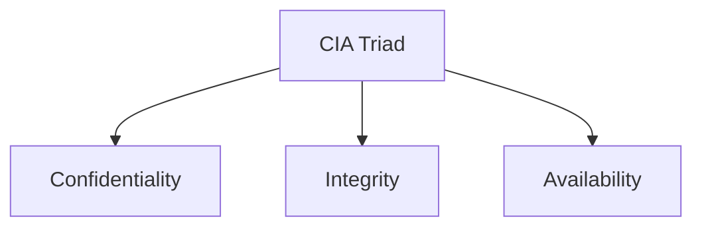
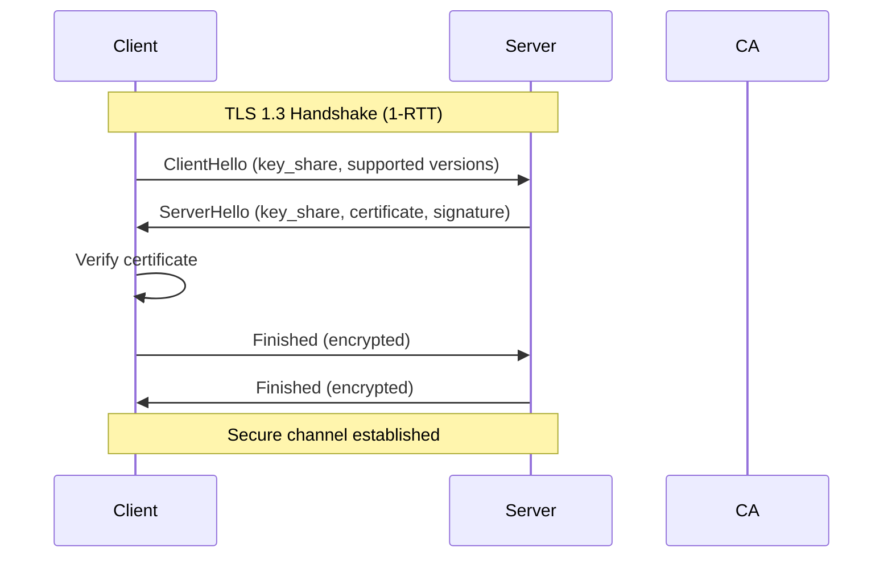
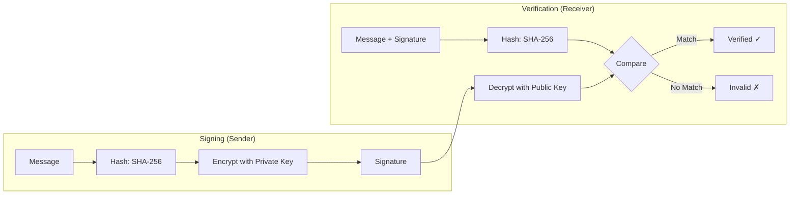

# Chapter 9: Information Security — Exam Quick Revision

## Learning Objectives
- Compare symmetric vs asymmetric encryption algorithms with key sizes and security levels
- Apply hash function properties (preimage resistance, collision resistance, avalanche effect)
- Trace the Digital Signature and SSL/TLS handshake processes
- Categorize firewall types and compare IDS vs IPS
- Identify common attack types and their mitigation strategies
- Apply the CIA triad and AAA framework to security scenarios
- Recall OWASP Top 10 (2021) vulnerabilities and biometric authentication types
---

## 1. Symmetric vs Asymmetric Cryptography

| Aspect | Symmetric | Asymmetric (Public Key) |
|--------|-----------|-------------------------|
| **Keys** | Single shared key | Public + Private key pair |
| **Key exchange** | Out-of-band (secure channel needed) | Public key can be shared openly |
| **Speed** | Fast (100-1000× faster) | Slow (computationally expensive) |
| **Key size** | 128-256 bits | 2048-4096 bits |
| **Use case** | Bulk data encryption | Key exchange, digital signatures |
| **Security level** | 128-bit AES ≈ 256-bit ECC | 2048-bit RSA ≈ 3072-bit RSA |

### Algorithm Details

| Algorithm | Type | Key Size | Block Size | Rounds | Status |
|-----------|------|----------|------------|--------|--------|
| **DES** | Symmetric (block) | 56 bits | 64 bits | 16 | ❌ Broken (brute-force in hours) |
| **3DES** | Symmetric (block) | 112/168 bits | 64 bits | 48 | ❌ Deprecated (slow, small block) |
| **AES** | Symmetric (block) | 128/192/256 bits | 128 bits | 10/12/14 | ✅ Secure (standard) |
| **Blowfish** | Symmetric (block) | 32-448 bits | 64 bits | 16 | ⚠️ Small block (64-bit) |
| **RSA** | Asymmetric | 1024-4096 bits | Variable | N/A | ⚠️ 1024 deprecated, 2048+ secure |
| **ECC** | Asymmetric | 160-521 bits | N/A | N/A | ✅ Equivalent security with smaller keys |
| **Diffie-Hellman** | Asymmetric (key exchange) | Variable | N/A | N/A | ✅ Secure (with proper parameters) |

### Key Size Equivalence

```
ECC-256 ≈ RSA-3072 ≈ AES-128 (security level)
ECC-384 ≈ RSA-7680 ≈ AES-192
ECC-521 ≈ RSA-15360 ≈ AES-256
```

---

## 2. Hash Functions

### Properties

1. **Preimage Resistance (One-way):** Given hash H, infeasible to find M such that hash(M) = H
2. **Second Preimage Resistance:** Given M1, infeasible to find M2 ≠ M1 with hash(M1) = hash(M2)
3. **Collision Resistance:** Infeasible to find any M1 ≠ M2 with hash(M1) = hash(M2)
4. **Avalanche Effect:** Small change in input → completely different hash output (~50% bits flip)
5. **Deterministic:** Same input always produces same output

### Hash Algorithm Comparison

| Algorithm | Output Size | Collision Status | Use Case |
|-----------|-------------|-----------------|----------|
| **MD5** | 128 bits | ❌ Broken (collisions in 2^18) | Checksums (non-security) |
| **SHA-1** | 160 bits | ❌ Broken (SHAttered, 2^63) | Deprecated |
| **SHA-256** | 256 bits | ✅ Secure | TLS, digital signatures, Bitcoin |
| **SHA-3** | Variable | ✅ Secure | Newest standard (Keccak) |
| **bcrypt/scrypt** | Variable | ✅ Secure | Password hashing (slow by design) |

---

## 3. Digital Signature Process

```
Sender Side:
1. Hash the message → digest
2. Encrypt digest with sender's PRIVATE key → signature
3. Send (message + signature) to receiver

Receiver Side:
1. Decrypt signature with sender's PUBLIC key → digest1
2. Hash received message → digest2
3. Compare digest1 == digest2 → if equal, signature verified
```

### Properties

- **Authentication:** Proves sender's identity (only sender has private key)
- **Integrity:** Any modification changes the hash
- **Non-repudiation:** Sender cannot deny signing

---

## 4. SSL/TLS Handshake

```
Client                                        Server
   |                                              |
   |--- ClientHello (TLS version, cipher suites) →|
   |← ServerHello (selected cipher, cert) -------|
   |← Certificate (server's public key) ---------|
   |← ServerHelloDone ---------------------------|
   |                                              |
   |--- ClientKeyExchange (pre-master secret) ---→|
   |    (encrypted with server's public key)       |
   |                                              |
   |--- ChangeCipherSpec ------------------------→|
   |--- Finished (encrypted) --------------------→|
   |← ChangeCipherSpec ---------------------------|
   |← Finished (encrypted) -----------------------|
   |                                              |
   |← Secure communication established ----------→|
```

### TLS 1.3 Improvements

- Reduced handshake: 1-RTT (normal), 0-RTT (resumed)
- Removed weak ciphers (RC4, 3DES, CBC mode)
- Forward secrecy mandatory (no static RSA key exchange)
- Fewer round trips → faster connection establishment

---

## 5. Firewall Types

| Type | Layer | How It Works | Pros | Cons |
|------|-------|-------------|------|------|
| **Packet Filter** | 3/4 | Inspects headers (IP, port, protocol) | Fast, simple | No application awareness |
| **Stateful** | 3/4 | Tracks connection state (SYN/ACK tracking) | Remembers sessions | Slightly slower than packet filter |
| **Application (Proxy)** | 7 | Inspects application payload | Deep inspection, content filtering | Slow, application-specific |
| **Next-Gen (NGFW)** | 3-7 | Combines stateful + IDS/IPS + app awareness | Comprehensive | Expensive, complex |
| **WAF** | 7 | Web-specific (HTTP/HTTPS analysis) | Protects against SQLi, XSS | Web traffic only |

### Firewall Rules Example

```
Rule 1: ALLOW tcp FROM 10.0.0.0/8 TO any PORT 443
Rule 2: DENY tcp FROM any TO 192.168.1.10 PORT 22
Rule 3: DENY all FROM any TO any
```

---

## 6. IDS vs IPS

| Aspect | IDS (Intrusion Detection System) | IPS (Intrusion Prevention System) |
|--------|--------------------------------|-----------------------------------|
| **Action** | Monitors and alerts | Detects and blocks in real-time |
| **Placement** | Out-of-band (passive) | Inline (active) |
| **Response** | Log, alert, notify | Block, drop, reset connection |
| **False positive impact** | Wasted analyst time | Legitimate traffic blocked |
| **Examples** | Snort (IDS mode), OSSEC | Snort (inline), Suricata, Palo Alto |

### Detection Methods

| Method | Description | Strength | Weakness |
|--------|-------------|----------|----------|
| **Signature-based** | Match known attack patterns | Low false positives | Misses zero-day attacks |
| **Anomaly-based** | Baseline + deviation detection | Detects novel attacks | High false positives |
| **Heuristic-based** | Rules and behavior analysis | Balances both | Complex to maintain |

---

## 7. Common Attack Types

| Attack | Description | Layer | Mitigation |
|--------|-------------|-------|------------|
| **DDoS** | Overwhelm server with traffic from multiple sources | Network/App | Rate limiting, CDN, scrubbers |
| **SQL Injection** | Malicious SQL in input fields | Application | Parameterized queries, ORM, WAF |
| **XSS (Cross-Site Scripting)** | Inject scripts into web pages | Application | Output encoding, CSP, HttpOnly cookies |
| **CSRF** | Forge user actions via authenticated session | Application | Anti-CSRF tokens, SameSite cookies |
| **Phishing** | Deceptive emails to steal credentials | Human | User awareness, MFA, email filters |
| **MITM (Man-in-the-Middle)** | Intercept communication between parties | Network | HTTPS, certificate pinning, VPN |
| **Ransomware** | Encrypt data for ransom | Multi-layer | Backups, patch management, email filtering |
| **Buffer Overflow** | Overflow memory buffer to execute code | Application/OS | ASLR, DEP, bounds checking |
| **DNS Spoofing/Cache Poisoning** | False DNS records redirect traffic | Network | DNSSEC |
| **Session Hijacking** | Steal session cookie/token | Application | HTTPS, secure cookies, session rotation |

### XSS Types

| Type | Description | Example |
|------|-------------|---------|
| **Stored (Persistent)** | Malicious script stored on server | Comment field with `<script>` |
| **Reflected (Non-persistent)** | Script in URL/request, reflected in response | Search query echoed back |
| **DOM-based** | Script in client-side JavaScript | URL fragment parsed by JS |

---

## 8. CIA Triad



| Property | Meaning | Threats | Controls |
|----------|---------|---------|----------|
| **Confidentiality** | Data accessible only to authorized parties | Eavesdropping, data breach | Encryption, access control, authentication |
| **Integrity** | Data unchanged by unauthorized parties | Tampering, SQL injection | Hashing, digital signatures, checksums |
| **Availability** | Data accessible when needed | DDoS, ransomware, hardware failure | Redundancy, backups, failover, CDN |

### Parkerian Hexad (Extended CIA + 3 more)

1. **Confidentiality** — privacy
2. **Integrity** — accuracy
3. **Availability** — accessibility
4. **Possession/Control** — who has the data
5. **Authenticity** — genuineness of origin
6. **Utility** — usefulness of data

---

## 9. AAA (Authentication, Authorization, Accounting)

| Component | Description | Example |
|-----------|-------------|---------|
| **Authentication** | Who are you? — verify identity | Password, biometric, MFA |
| **Authorization** | What can you do? — permissions | RBAC, ACL |
| **Accounting** | What did you do? — audit trail | Logs, monitoring |

### Authentication Factors

| Factor | Type | Examples |
|--------|------|----------|
| **Knowledge** (Something you know) | Type 1 | Password, PIN, security question |
| **Possession** (Something you have) | Type 2 | Smart card, token, OTP, phone |
| **Inherence** (Something you are) | Type 3 | Fingerprint, face, iris, voice |
| **Location** (Where you are) | Type 4 | GPS, IP geo-location |
| **Behavior** (What you do) | Type 5 | Typing pattern, gait, mouse movement |

### MFA (Multi-Factor Authentication)

Requires **two or more** factors from different categories (not just two passwords).

---

## 10. OWASP Top 10 (2021)

| Rank | Vulnerability | Description |
|------|---------------|-------------|
| A1 | **Broken Access Control** | Users can act outside intended permissions |
| A2 | **Cryptographic Failures** | Weak encryption, sensitive data exposure |
| A3 | **Injection** | SQL, NoSQL, OS, LDAP injection |
| A4 | **Insecure Design** | Missing threat modeling, security by design |
| A5 | **Security Misconfiguration** | Default passwords, verbose errors |
| A6 | **Vulnerable &amp; Outdated Components** | Unpatched libraries, known CVEs |
| A7 | **Identification &amp; Auth Failures** | Weak passwords, credential stuffing |
| A8 | **Software &amp; Data Integrity Failures** | CI/CD pipeline attacks, unsigned updates |
| A9 | **Security Logging &amp; Monitoring Failures** | Insufficient logging, missing alerts |
| A10 | **SSRF (Server-Side Request Forgery)** | Server makes requests to internal resources |

---

## 11. Biometric Authentication

| Type | Accuracy (FAR/FRR) | Cost | User Acceptance | Liveness Detection |
|------|--------------------|------|-----------------|-------------------|
| **Fingerprint** | Medium | Low | High | Increasing |
| **Face recognition** | Medium-High | Medium | High | Yes (3D, liveness) |
| **Iris scan** | Very high | High | Low (intrusive) | Hard to spoof |
| **Voice** | Low-Medium | Low | High | Basic |
| **Retina scan** | Very high | High | Very low | Hard to spoof |
| **Palm/finger vein** | High | High | Medium | Very hard |

### Biometric System Metrics

- **FAR (False Acceptance Rate):** Imposter accepted (Type II error)
- **FRR (False Rejection Rate):** Genuine user rejected (Type I error)
- **EER (Equal Error Rate):** Where FAR = FRR — lower is better

---

## Solved MCQs

**Q1:** Which algorithm uses a 128-bit block size and 128/192/256-bit keys?
- (a) DES
- (b) 3DES
- (c) AES
- (d) Blowfish

**Answer:** (c) AES. AES uses 128-bit blocks and supports 128, 192, or 256-bit keys with 10, 12, or 14 rounds respectively.

**Q2:** In an SSL/TLS handshake, what is the purpose of the ClientKeyExchange message?
- (a) Send the client's certificate
- (b) Send the pre-master secret encrypted with server's public key
- (c) Negotiate cipher suites
- (d) Verify the server

**Answer:** (b) Send the pre-master secret encrypted with server's public key. Both sides derive session keys from this shared secret.

**Q3:** Which attack involves injecting malicious scripts that execute in a user's browser?
- (a) SQL Injection
- (b) CSRF
- (c) XSS
- (d) DDoS

**Answer:** (c) XSS (Cross-Site Scripting). The attacker injects client-side scripts (usually JavaScript) into web pages viewed by other users.

**Q4:** What does non-repudiation mean in information security?
- (a) Data cannot be modified
- (b) Sender cannot deny sending the message
- (c) Data is encrypted
- (d) System is available

**Answer:** (b) Sender cannot deny sending the message. Digital signatures provide non-repudiation by binding the sender's identity to the message.

**Q5:** Which OWASP Top 10 (2021) vulnerability involves missing authentication checks allowing users to access unauthorized resources?
- (a) A1 — Broken Access Control
- (b) A3 — Injection
- (c) A7 — Identification and Auth Failures
- (d) A10 — SSRF

**Answer:** (a) A1 — Broken Access Control. This moved to the top spot in 2021, covering issues like privilege escalation, missing access controls, and path traversal.

---

## 12. VPN Protocols

| Protocol | Layer | Encryption | Port | Security | Pros | Cons |
|----------|-------|------------|------|----------|------|------|
| **IPsec** | 3 (Network) | AES, 3DES | UDP 500 (IKE), ESP | High | Strong encryption, tunnel + transport mode | Complex configuration |
| **SSL/TLS VPN** | 4-7 | AES, ChaCha20 | TCP 443 | High | No client needed, passes firewalls | Slower than IPsec |
| **OpenVPN** | 2/3 | AES-256-GCM | UDP 1194 | Very high | Open source, cross-platform, flexible | May be blocked by firewalls |
| **PPTP** | 2 | MPPE (128-bit) | TCP 1723 | ❌ Broken | Easy setup, widely supported | Deprecated, known weaknesses |
| **L2TP/IPsec** | 2 | AES with IPsec | UDP 1701 | High | Built into most OS | Double encapsulation overhead |

### IPsec Modes

| Mode | What is Encrypted | Use Case |
|------|-------------------|----------|
| **Transport** | Payload only (header remains) | End-to-end between hosts |
| **Tunnel** | Entire packet (new header added) | Site-to-site VPN |

### IPsec Protocols

- **AH (Authentication Header):** Integrity + authentication only (no encryption)
- **ESP (Encapsulating Security Payload):** Encryption + integrity + authentication
- **IKE (Internet Key Exchange):** Establishes security associations (SA)

## 13. Wireless Security Standards

| Standard | Encryption | Authentication | Status |
|----------|-----------|---------------|--------|
| **WEP** | RC4 (64/128-bit) | Shared key | ❌ Broken in minutes |
| **WPA** | TKIP (RC4-based) | PSK or 802.1X | ❌ Broken (Michael attack) |
| **WPA2** | AES-CCMP | PSK or 802.1X | ⚠️ KRACK attack (fixed) |
| **WPA3** | AES-GCMP-256 | SAE (Simultaneous Auth of Equals) | ✅ Secure |

### WPA2 vs WPA3

| Feature | WPA2 | WPA3 |
|---------|------|------|
| Encryption | AES-CCMP (128-bit) | AES-GCMP (256-bit) |
| Handshake | 4-way handshake (PSK vulnerable to dictionary attack) | SAE (Dragonfly) — resistant to offline dictionary attacks |
| Forward secrecy | No (passphrase compromise reveals past traffic) | Yes (unique session keys) |
| IoT support | No | Wi-Fi Easy Connect (QR code onboarding) |

## 14. Security Policies &amp; Governance

### Key Documents

| Document | Purpose | Key Elements |
|----------|---------|-------------|
| **Security Policy** | High-level management direction | Scope, objectives, roles, compliance |
| **BIA (Business Impact Analysis)** | Identify critical functions and impact of disruption | MTD, RTO, RPO, critical processes |
| **BCP (Business Continuity Plan)** | Maintain operations during disruption | Alternate locations, communication plan |
| **DRP (Disaster Recovery Plan)** | Restore IT systems after disaster | Recovery procedures, backup restoration |

### Security Controls Classification

| Category | Subtype | Examples |
|----------|---------|----------|
| **Physical** | Deterrent, Preventive | Guards, locks, fences, cameras |
| **Technical** | Preventive | Firewalls, encryption, access control |
| **Administrative** | Directive, Preventive | Policies, training, background checks |

### Control Functions

- **Preventive:** Stop attacks before they happen (firewall, encryption)
- **Detective:** Identify attacks in progress (IDS, audit logs)
- **Corrective:** Fix damage after attack (backup restore, patch)
- **Deterrent:** Discourage attackers (warning banners, cameras)
- **Recovery:** Restore after incident (DRP, BCP)

## 15. Penetration Testing

### Phases

1. **Reconnaissance:** Gather information (passive: Google, social media; active: DNS, port scanning)
2. **Scanning:** Identify live hosts, open ports, services (nmap, nessus)
3. **Vulnerability Assessment:** Identify and prioritize vulnerabilities
4. **Exploitation:** Attempt to exploit vulnerabilities (Metasploit, custom exploits)
5. **Post-Exploitation:** Maintain access, pivot, escalate privileges
6. **Reporting:** Document findings, risk ratings, remediation recommendations

### Black Box vs White Box vs Gray Box

| Type | Knowledge of Target | Realism | Cost |
|------|--------------------|---------|------|
| **Black Box** | None (external attacker) | High | High |
| **White Box** | Full (code, credentials, network maps) | Low | Medium |
| **Gray Box** | Partial (some credentials, architecture) | Medium | Medium |

## 16. Security Standards &amp; Frameworks

| Standard | Focus | Common in |
|----------|-------|-----------|
| **ISO 27001** | Information Security Management System (ISMS) | Enterprises, compliance |
| **NIST SP 800-53** | Security and privacy controls | US government agencies |
| **PCI DSS** | Payment card data security | E-commerce, banks |
| **HIPAA** | Healthcare data privacy (PHI) | Healthcare organizations |
| **GDPR** | Personal data protection (EU) | Any org handling EU citizen data |
| **COBIT** | IT governance and management | IT audit, governance |

---

---

## 📌 Extended Theory — Deep Dive for IBPS SO Mains (2024–2026 Trends)

### Encryption/Decryption — TypeScript Implementations

```typescript
// Caesar Cipher
class CaesarCipher {
  encrypt(plaintext: string, shift: number): string {
    return plaintext
      .split('')
      .map(ch => {
        if (ch >= 'a' && ch <= 'z') return String.fromCharCode(((ch.charCodeAt(0) - 97 + shift) % 26) + 97);
        if (ch >= 'A' && ch <= 'Z') return String.fromCharCode(((ch.charCodeAt(0) - 65 + shift) % 26) + 65);
        return ch;
      })
      .join('');
  }

  decrypt(ciphertext: string, shift: number): string {
    return this.encrypt(ciphertext, 26 - shift);
  }
}

// Vigenere Cipher
class VigenereCipher {
  encrypt(plaintext: string, key: string): string {
    const keyUpper = key.toUpperCase();
    return plaintext
      .toUpperCase()
      .split('')
      .map((ch, i) => {
        if (ch < 'A' || ch > 'Z') return ch;
        const shift = keyUpper.charCodeAt(i % keyUpper.length) - 65;
        return String.fromCharCode(((ch.charCodeAt(0) - 65 + shift) % 26) + 65);
      })
      .join('');
  }

  decrypt(ciphertext: string, key: string): string {
    const keyUpper = key.toUpperCase();
    return ciphertext
      .toUpperCase()
      .split('')
      .map((ch, i) => {
        if (ch < 'A' || ch > 'Z') return ch;
        const shift = keyUpper.charCodeAt(i % keyUpper.length) - 65;
        return String.fromCharCode(((ch.charCodeAt(0) - 65 - shift + 26) % 26) + 65);
      })
      .join('');
  }
}

// RSA Basics (simplified — uses small primes for demonstration)
class RSABasic {
  private p: number;
  private q: number;
  private n: number;
  private phi: number;
  private e: number;
  private d: number;

  constructor(p: number, q: number) {
    this.p = p;
    this.q = q;
    this.n = p * q;
    this.phi = (p - 1) * (q - 1);
    this.e = this.findPublicExponent();
    this.d = this.modInverse(this.e, this.phi);
  }

  private gcd(a: number, b: number): number {
    return b === 0 ? a : this.gcd(b, a % b);
  }

  private findPublicExponent(): number {
    let e = 65537; // common choice
    if (e < this.phi && this.gcd(e, this.phi) === 1) return e;
    for (e = 3; e < this.phi; e += 2) {
      if (this.gcd(e, this.phi) === 1) return e;
    }
    return e;
  }

  private modInverse(a: number, m: number): number {
    for (let x = 1; x < m; x++) {
      if ((a * x) % m === 1) return x;
    }
    return 1;
  }

  encrypt(message: number): number {
    return Number(BigInt(message) ** BigInt(this.e) % BigInt(this.n));
  }

  decrypt(ciphertext: number): number {
    return Number(BigInt(ciphertext) ** BigInt(this.d) % BigInt(this.n));
  }

  getPublicKey(): { e: number; n: number } {
    return { e: this.e, n: this.n };
  }
}

// Usage: const rsa = new RSABasic(61, 53); // n=3233, phi=3120
// const ct = rsa.encrypt(123); const pt = rsa.decrypt(ct);
```

### Hash Function Demonstration — TypeScript

```typescript
class SimpleHash {
  // SHA-256 simulation (conceptual — use crypto.subtle in production)
  static async sha256(message: string): Promise<string> {
    const encoder = new TextEncoder();
    const data = encoder.encode(message);
    const hashBuffer = await crypto.subtle.digest('SHA-256', data);
    const hashArray = Array.from(new Uint8Array(hashBuffer));
    return hashArray.map(b => b.toString(16).padStart(2, '0')).join('');
  }

  // Demonstrate avalanche effect
  static async demonstrateAvalanche(): Promise<void> {
    const input1 = 'Hello World';
    const input2 = 'Hello WorlD'; // single bit difference
    
    const hash1 = await this.sha256(input1);
    const hash2 = await this.sha256(input2);

    let diffBits = 0;
    for (let i = 0; i < hash1.length; i++) {
      if (hash1[i] !== hash2[i]) diffBits++;
    }
    console.log(`Inputs differ by 1 character`);
    console.log(`Hash1: ${hash1}`);
    console.log(`Hash2: ${hash2}`);
    console.log(`Different hex chars: ${diffBits} out of 64 (${Math.round(diffBits/64*100)}%)`);
  }
}
```

### Security Protocol Flows — Detailed Diagrams



**Digital Signature Process:**


> **PYQ 2025:** In a TLS 1.3 handshake, how many round trips are needed for a fresh connection? For a resumed connection?

**Answer:** Fresh: 1-RTT (ClientHello → ServerHello + Cert → Finished). Resumed: 0-RTT (client can send data immediately with pre-shared key).

### Security Threat — TypeScript Detection Examples

```typescript
// SQL Injection Detector
function detectSQLi(input: string): { suspicious: boolean; reason?: string } {
  const patterns = [
    /'.*OR.*'='/i, /'.*--/i, /UNION.*SELECT/i,
    /DROP\s+TABLE/i, /DELETE\s+FROM/i, /INSERT\s+INTO/i,
    /1\s*=\s*1/i, /';\s*--/i, /EXEC\s*\(/i, /xp_cmdshell/i,
  ];
  for (const pattern of patterns) {
    if (pattern.test(input)) {
      return { suspicious: true, reason: `Matched pattern: ${pattern.source}` };
    }
  }
  return { suspicious: false };
}

// XSS Detection
function detectXSS(input: string): { sanitized: string; hadXSS: boolean } {
  const xssPatterns = [
    /<script[^>]*>.*?<\/script>/gi,
    /on\w+\s*=\s*['"][^'"]*['"]/gi,
    /javascript\s*:/gi,
    /<iframe[^>]*>/gi,
    /alert\s*\(/gi,
    /onerror\s*=/gi,
  ];
  let sanitized = input;
  let hadXSS = false;
  for (const pattern of xssPatterns) {
    if (pattern.test(sanitized)) {
      hadXSS = true;
      sanitized = sanitized.replace(pattern, '[BLOCKED]');
    }
  }
  return { sanitized, hadXSS };
}

// Password Strength Checker
function passwordStrength(password: string): { score: number; label: string; feedback: string[] } {
  const feedback: string[] = [];
  let score = 0;

  if (password.length >= 8) score += 20;
  else feedback.push('At least 8 characters');
  if (password.length >= 12) score += 10;
  if (/[a-z]/.test(password)) score += 20;
  else feedback.push('Include lowercase letters');
  if (/[A-Z]/.test(password)) score += 20;
  else feedback.push('Include uppercase letters');
  if (/[0-9]/.test(password)) score += 20;
  else feedback.push('Include numbers');
  if (/[^a-zA-Z0-9]/.test(password)) score += 20;
  else feedback.push('Include special characters');
  if (/(.)\1{2,}/.test(password)) score -= 10;
  if (/^[A-Za-z]+$/.test(password)) score -= 20;

  const label = score >= 90 ? 'Very Strong' : score >= 70 ? 'Strong' : score >= 50 ? 'Moderate' : 'Weak';
  return { score, label, feedback };
}
```

## 📝 Solved Examples (20 MCQs)

<details>
<summary>Q1: Which encryption algorithm uses a 56-bit key and is considered broken?</summary>
(a) AES (b) DES (c) 3DES (d) Blowfish
**Answer:** (b) DES. 56-bit key can be brute-forced in hours with modern hardware. AES uses 128/192/256-bit keys.
</details>

<details>
<summary>Q2: In the CIA triad, hashing primarily provides:</summary>
(a) Confidentiality (b) Integrity (c) Availability (d) Non-repudiation
**Answer:** (b) Integrity. Hashing detects unauthorized changes. Encryption provides confidentiality. Redundancy provides availability.
</details>

<details>
<summary>Q3: Which type of firewall inspects the application layer payload?</summary>
(a) Packet filter (b) Stateful firewall (c) Proxy firewall (d) Circuit-level gateway
**Answer:** (c) Proxy firewall (Application gateway). It terminates and re-establishes connections, inspecting full application content.
</details>

<details>
<summary>Q4: What is the primary difference between IDS and IPS?</summary>
(a) IDS is hardware, IPS is software (b) IDS monitors, IPS prevents (c) IDS is faster (d) IPS is cheaper
**Answer:** (b) IDS monitors and alerts (passive), IPS detects and blocks in real-time (inline).
</details>

<details>
<summary>Q5: Which attack intercepts communication between two parties without their knowledge?</summary>
(a) DDoS (b) MITM (c) XSS (d) SQL Injection
**Answer:** (b) MITM (Man-in-the-Middle). Attacker relays and potentially alters communication between two parties.
</details>

<details>
<summary>Q6: In SSL/TLS handshake, which message includes the server's public key?</summary>
(a) ServerHello (b) Certificate (c) ClientKeyExchange (d) Finished
**Answer:** (b) Certificate message. Server sends its X.509 certificate containing the public key.
</details>

<details>
<summary>Q7: Which OWASP Top 10 (2021) vulnerability ranked #1?</summary>
(a) Injection (b) Broken Access Control (c) Cryptographic Failures (d) XSS
**Answer:** (b) Broken Access Control. It overtook Injection as #1 in the 2021 OWASP Top 10.
</details>

<details>
<summary>Q8: What is the key size equivalence of ECC-256?</summary>
(a) RSA-1024 (b) RSA-2048 (c) RSA-3072 (d) RSA-4096
**Answer:** (c) RSA-3072. ECC provides equivalent security with much smaller key sizes: ECC-256 ≈ RSA-3072 ≈ AES-128.
</details>

<details>
<summary>Q9: Which of the following provides non-repudiation?</summary>
(a) Symmetric encryption (b) Hash function (c) Digital signature (d) Firewall
**Answer:** (c) Digital signature. Binds sender's identity to the message (sign with private key, verify with public key). Sender cannot deny.
</details>

<details>
<summary>Q10: In biometric authentication, FRR stands for:</summary>
(a) False Recognition Rate (b) False Rejection Rate (c) False Response Rate (d) Failed Recognition Rate
**Answer:** (b) False Rejection Rate. Type I error — legitimate user is rejected. FAR = False Acceptance Rate (Type II error).
</details>

<details>
<summary>Q11: Which wireless security standard uses SAE (Simultaneous Authentication of Equals)?</summary>
(a) WEP (b) WPA (c) WPA2 (d) WPA3
**Answer:** (d) WPA3. SAE (Dragonfly handshake) replaces WPA2's 4-way handshake, providing resistance to offline dictionary attacks.
</details>

<details>
<summary>Q12: What is the output size of SHA-256?</summary>
(a) 128 bits (b) 160 bits (c) 256 bits (d) 512 bits
**Answer:** (c) 256 bits (32 bytes). SHA-1 = 160 bits, MD5 = 128 bits, SHA-512 = 512 bits.
</details>

<details>
<summary>Q13: Which VPN protocol uses UDP port 500 for IKE?</summary>
(a) OpenVPN (b) PPTP (c) IPsec (d) SSL VPN
**Answer:** (c) IPsec. IKE (Internet Key Exchange) uses UDP 500. ESP (encapsulated) uses protocol 50, AH uses protocol 51.
</details>

<details>
<summary>Q14: CSRF (Cross-Site Request Forgery) is mitigated by:</summary>
(a) Output encoding (b) Anti-CSRF tokens (c) Parameterized queries (d) CSP headers
**Answer:** (b) Anti-CSRF tokens. Unique, unpredictable tokens embedded in forms prevent forged requests. CSP mitigates XSS. Parameterized queries prevent SQLi.
</details>

<details>
<summary>Q15: Which type of authentication factor is a fingerprint?</summary>
(a) Knowledge (b) Possession (c) Inherence (d) Location
**Answer:** (c) Inherence (something you are). Knowledge = password (Type 1), Possession = phone/token (Type 2), Inherence = biometric (Type 3).
</details>

<details>
<summary>Q16: What is the block size of AES?</summary>
(a) 64 bits (b) 128 bits (c) 192 bits (d) 256 bits
**Answer:** (b) 128 bits. AES block size is always 128 bits. Key sizes: 128, 192, or 256 bits. DES/Blowfish use 64-bit blocks.
</details>

<details>
<summary>Q17: Which information security standard is specific to healthcare data privacy?</summary>
(a) PCI DSS (b) HIPAA (c) GDPR (d) ISO 27001
**Answer:** (b) HIPAA (Health Insurance Portability and Accountability Act). PCI DSS = payment cards, GDPR = EU personal data, ISO 27001 = ISMS.
</details>

<details>
<summary>Q18: What does the 'A' in AAA framework stand for?</summary>
(a) Authentication, Authorization, Accounting (b) Access, Audit, Authentication (c) Authorization, Accounting, Administration (d) Acceptance, Authentication, Access
**Answer:** (a) Authentication (verify identity), Authorization (permissions), Accounting (audit trail).
</details>

<details>
<summary>Q19: Which type of XSS attack stores malicious script permanently on the server?</summary>
(a) Reflected XSS (b) DOM-based XSS (c) Stored XSS (d) Blind XSS
**Answer:** (c) Stored (Persistent) XSS. Script stored in database (comments, profiles) and served to all users who view the page.
</details>

<details>
<summary>Q20: In IPsec, which protocol provides both encryption and authentication?</summary>
(a) AH (b) ESP (c) IKE (d) ISAKMP
**Answer:** (b) ESP (Encapsulating Security Payload). AH provides authentication only (no encryption). IKE establishes security associations.
</details>

## 📖 Exercise Bank (30 Questions)

1. Encrypt "HELLO" using Caesar cipher with shift 3. Then decrypt the result.
2. Encrypt "ATTACKATDAWN" using Vigenere cipher with key "KEY". Show the ciphertext.
3. Implement TypeScript functions for RSA key generation (p=17, q=11). Encrypt message 88 and decrypt.
4. Calculate SHA-256 hash of "Security" and demonstrate the avalanche effect by changing one character.
5. Write TypeScript code that evaluates a password against NIST SP 800-63B guidelines.
6. Explain the full TLS 1.3 handshake with all messages exchanged.
7. Design a firewall rule set for a web server (allow HTTP/HTTPS from anywhere, SSH from office IP, block everything else).
8. Implement a TypeScript function that detects potential CSRF attacks by checking Origin/Referrer headers.
9. Compare symmetric vs asymmetric encryption: use cases, performance, key distribution.
10. Write TypeScript code for a simple JWT generator and validator (header, payload, signature).
11. Explain the Diffie-Hellman key exchange algorithm with a TypeScript implementation.
12. Create a threat model for an e-commerce application using STRIDE methodology.
13. Implement TypeScript code for AES-CBC encryption and decryption using Web Crypto API.
14. Compare WPA2 and WPA3 security: handshake, encryption, offline attack resistance.
15. Write TypeScript code for a Honeypot detector that identifies fake services.
16. Explain the difference between black-box, white-box, and gray-box penetration testing.
17. Implement a TypeScript function that validates X.509 certificates (chain validation, expiry, revocation).
18. Design a security architecture for a cloud-native application (defense in depth).
19. Write TypeScript code implementing a rate limiter to mitigate brute force attacks.
20. Compare biometric authentication types: fingerprint, face, iris, voice — FAR, FRR, liveness detection.
21. Implement TypeScript code for HMAC-SHA256 generation and verification.
22. Explain the STRIDE threat classification with examples for each category.
23. Write TypeScript code for a simple CA (Certificate Authority) that issues and revokes certificates.
24. Compare IDS detection methods: signature-based vs anomaly-based vs heuristic-based.
25. Implement TypeScript code for content security policy (CSP) header generation.
26. Explain the concept of zero-trust security (never trust, always verify).
27. Write TypeScript code for a secure session management system (random tokens, expiry, rotation).
28. Compare OWASP Top 10 2017 vs 2021 — what changed?
29. Implement TypeScript code for a simple blockchain-based integrity verification system.
30. Explain the GDPR principles (lawfulness, purpose limitation, data minimization, accuracy, storage limitation, integrity, accountability).

**Answer Key:**

1. Encrypt: KHOOR (H+3=K, E+3=H, L+3=O, L+3=O, O+3=R). Decrypt: HELLO
2. Vigenere: ATTACKATDAWN + KEYKEYKEYKEY → K (A+10), E (T+4)... = KXJEYTKEAQGE
3. n=187, φ=160, e=7, d=23. Encrypt(88) = 88^7 mod 187 = 11. Decrypt(11) = 11^23 mod 187 = 88
5. NIST SP 800-63B: min 8 chars, check against breached passwords, allow up to 64 chars, no composition rules required
8. If Origin header doesn't match expected origin → potential CSRF. SameSite=Strict/Lax also prevents
10. Header: base64(JSON({alg:"HS256",typ:"JWT"})). Payload: base64(JSON({sub,iat,exp})). Signature: HMAC-SHA256(base64header + "." + base64payload, secret)
11. DH: A and B agree on prime p and generator g. A sends g^a mod p, B sends g^b mod p. Shared secret = g^(ab) mod p
12. Spoofing (fake login), Tampering (SQLi), Repudiation (no logs), Info Disclosure (data breach), DoS (DDoS), Elevation (privilege escalation)
14. WPA2: 4-way handshake, AES-CCMP, vulnerable to dictionary attack. WPA3: SAE handshake, AES-GCMP-256, resistant to offline dictionary attack, forward secrecy
16. Black-box: no internal knowledge (external attacker). White-box: full knowledge (code, credentials). Gray-box: partial knowledge
18. Defense in depth: WAF → load balancer → app firewall → IAM → encryption → network segmentation → logging/monitoring
19. Sliding window: track timestamps per IP. If count > N in window → block for duration
21. HMAC(key, msg) = H((key⊕opad) || H((key⊕ipad) || msg)). Provides message authentication + integrity
22. S: Spoofing identity. T: Tampering with data. R: Repudiation. I: Information disclosure. D: Denial of service. E: Elevation of privilege
24. Signature: matches known patterns (low FP, misses zero-day). Anomaly: baseline deviation (detects novel attacks, high FP). Heuristic: rule-based (balanced)
26. Zero trust: no implicit trust. Verify every request. Micro-segmentation. Least privilege. Continuous monitoring
28. 2017: A4 (XXE) new, A7 (XSS) dropped. 2021: A1 Broken Access Control (new #1), A2 Crypto Failures, A4 Insecure Design (new), A10 SSRF (new)
30. Lawfulness (legal basis), Purpose limitation (specific purpose), Data minimization (collect only needed), Accuracy (keep correct), Storage limitation (delete when done), Integrity (security), Accountability (demonstrate compliance)

---

## 📌 Additional PYQ Integration (2024–2026 Analysis)

> **PYQ 2025:** An organization implements the following security controls. Classify each as Preventive, Detective, or Corrective:
> (a) Firewall rules blocking port 22 from external IPs
> (b) Intrusion Detection System monitoring network traffic
> (c) Daily automated backups to offsite storage
> (d) Security awareness training for employees
> (e) CCTV cameras in the data center

**Answer:**
- (a) **Preventive** — stops unauthorized SSH attempts before they reach servers
- (b) **Detective** — monitors and alerts but does not block
- (c) **Corrective** — restores data after a ransomware attack or data loss
- (d) **Preventive** — reduces likelihood of successful social engineering attacks
- (e) **Deterrent/Detective** — discourages intruders and records activity

> **PYQ 2024:** Given the ciphertext "WKLVLVVBOHPHVVDJH" encrypted with Caesar cipher, decrypt it to find the original message. What shift was used?

**Solution:** Try reverse shift of 3 (common Caesar shift):
- W→T, K→H, L→I, V→S, L→I, V→S, V→S, B→Y, O→L, H→E, P→M, H→E, V→S, V→S, D→A, J→G, H→E
- Result: "THISISASAMPLEMESSAGE"
- Shift = 3 (or reverse shift = 23)

> **PYQ 2026:** A company's web application was compromised via SQL injection. The attacker used the input: `' OR 1=1; --` in the login field. Explain how this exploits the vulnerability and recommend three mitigation strategies.

**Answer:**
**Exploitation:** The query becomes `SELECT * FROM users WHERE username = '' OR 1=1; --' AND password = '...'`. The `OR 1=1` makes the condition always true; `--` comments out the rest. The attacker gains access as the first user (often admin).

**Mitigations:**
1. **Parameterized queries / Prepared statements** — most effective. Input treated as data, not executable SQL
2. **Stored procedures** — encapsulate SQL logic with typed parameters
3. **Input validation + WAF** — reject inputs containing SQL keywords (defense in depth)
4. **Least privilege DB account** — web app should use account with only required permissions (no DROP/INSERT into system tables)

## 📌 Topic-wise Weightage Analysis for IBPS SO IT Mains

| Topic | Weightage | Frequency | Difficulty |
|-------|-----------|-----------|------------|
| Cryptography (AES, RSA, ECC) | 12-15% | Every exam | Medium |
| Hash Functions & Digital Signatures | 10-12% | Every exam | Medium |
| SSL/TLS Handshake | 10-12% | Every exam | Medium-High |
| Firewalls, IDS/IPS | 8-10% | Frequently | Medium |
| Attack Types (XSS, SQLi, CSRF) | 12-15% | Every exam | Medium |
| CIA Triad & AAA | 8-10% | Frequently | Easy |
| OWASP Top 10 (2021) | 5-8% | Frequently | Medium |
| VPN & Wireless Security | 5-8% | Frequently | Medium |
| Biometrics & MFA | 3-5% | Occasionally | Easy |
| Security Standards (ISO, PCI) | 3-5% | Occasionally | Medium |

## Summary
- **Symmetric (AES):** Single key, fast, 128-256 bits. **Asymmetric (RSA/ECC):** Key pair, slow, 2048+ bits
- **Hashing:** SHA-256 (secure), MD5/SHA-1 (broken). Properties: preimage resistance, collision resistance, avalanche effect
- **Digital signature:** Hash + encrypt with private key → verify with public key
- **TLS handshake:** ClientHello → ServerHello + Cert → KeyExchange → Finished
- **Firewalls:** Packet filter (L3/4) → Stateful → Proxy (L7) → NGFW
- **IDS:** Monitors/passive. **IPS:** Blocks/inline
- **Attacks:** DDoS (availability), SQLi/XSS (integrity/confidentiality), MITM (confidentiality)
- **CIA:** Confidentiality (encryption), Integrity (hashing), Availability (redundancy)
- **AAA:** Authentication (who), Authorization (what), Accounting (log)
- **OWASP Top 10 (2021):** Broken Access Control (#1), Crypto Failures (#2), Injection (#3)
- **Biometrics:** Fingerprint (common), iris (accurate), face (growing), voice (convenient)
- **VPN:** IPsec (site-to-site), SSL/TLS (client without client software), OpenVPN (open source)
- **Wireless:** WEP (broken) → WPA (broken) → WPA2 (KRACK) → WPA3 (SAE, secure)
- **Security policy:** BIA (impact analysis), BCP (continuity), DRP (disaster recovery)
- **Pentesting:** Recon → Scan → Exploit → Post-Exploit → Report
- **Standards:** ISO 27001 (ISMS), PCI DSS (card data), HIPAA (healthcare), GDPR (privacy)

---

## HOT Topics (Frequently Asked in IBPS SO IT Mains)
1. AES vs DES — key size, block size, rounds, security status
2. RSA vs ECC — key size equivalence, performance, security
3. SSL/TLS handshake — steps, what is exchanged at each stage
4. Firewall types — which type for which deployment scenario
5. IDS vs IPS — detection methods (signature vs anomaly)
6. XSS vs CSRF — differences, attack vectors, mitigation techniques
7. Hash function properties — preimage resistance vs collision resistance
8. OWASP Top 10 (2021) — recent changes (injection dropped from #1)
9. Digital signature — process and properties (authentication, integrity, non-repudiation)
10. MFA — factors (knowledge, possession, inherence) and implementation

---

## Chapter Quiz (MCQs)

<details>
<summary>Q1: What is the primary difference between SHA-256 and HMAC-SHA256?</summary>
A1: SHA-256 is a plain hash (no key). HMAC-SHA256 adds a secret key to the hashing process, providing message authentication (proves the sender has the key). HMAC is used in TLS, JWT, API authentication.
</details>

<details>
<summary>Q2: Which type of firewall maintains a connection state table?</summary>
A2: Stateful firewall. It tracks the state of active connections (SYN, SYN-ACK, ACK, FIN) and allows packets only if they match a known connection state.
</details>

<details>
<summary>Q3: In the context of CIA triad, encryption primarily provides:</summary>
A3: Confidentiality. Encryption transforms readable data into ciphertext that can only be decrypted with the correct key, protecting it from unauthorized access.
</details>

<details>
<summary>Q4: What is the Equal Error Rate (EER) in biometric systems?</summary>
A4: EER is the point where FAR (False Acceptance Rate) equals FRR (False Rejection Rate). Lower EER indicates better biometric system accuracy. It's used to compare different biometric systems.
</details>

<details>
<summary>Q5: Which OWASP Top 10 (2021) entry covers vulnerabilities in third-party libraries and components?</summary>
A5: A6 — Vulnerable and Outdated Components. This includes using libraries/frameworks with known CVEs, outdated software, and unpatched dependencies. Mitigation involves SBOM (Software Bill of Materials), regular updates, and vulnerability scanning.
</details>
