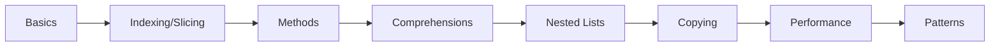

# Chapter 6: Lists


> **Previous:** [Strings](./05-strings.md) | **Next:** [Tuples and Sets](./07-tuples-sets.md)
## Learning Objectives

By the end of this chapter, students will be able to:
- Create and manipulate lists using all available methods
- Index, slice, and traverse lists idiomatically
- Use list comprehensions to create lists declaratively
- Work with nested lists and multidimensional structures
- Distinguish shallow and deep copying and select the appropriate copy strategy


## Chapter at a Glance

| Section | Topic | Key Concept |
|---------|-------|-------------|
| 6.1 | List Basics | Ordered, mutable, heterogeneous |
| 6.2 | Indexing and Slicing | Slice assignment, insertion, shrinking |
| 6.3 | List Methods | append, extend, remove, pop, sort |
| 6.4 | List Comprehensions | Declarative list construction |
| 6.5 | Nested Lists | Matrix representation, transpose |
| 6.6 | Shallow vs Deep Copy | copy() vs deepcopy() |
| 6.7 | Performance | O(1) append, O(n) insert(0) |
| 6.8 | Common Patterns | Find all indices, dedup, partition |


## Chapter Roadmap



## 6.1 List Basics

> **One-Sentence Takeaway:** Lists are ordered, mutable collections that can hold mixed types.

A list is an ordered, mutable collection of objects. Lists can contain mixed types and are resizable:

```python
empty = []
numbers = [1, 2, 3, 4, 5]
mixed = [1, "hello", 3.14, True, None]
nested = [[1, 2], [3, 4], [5, 6]]

print(type(empty))          # <class 'list'>
print(len(numbers))         # 5
```

Lists are created with square brackets or the `list()` constructor:

```python
from_range = list(range(5))       # [0, 1, 2, 3, 4]
from_string = list("hello")       # ['h', 'e', 'l', 'l', 'o']
from_tuple = list((1, 2, 3))      # [1, 2, 3]
```

### TypeScript Parallel

```typescript
// TypeScript: arrays (the list equivalent)
const empty: number[] = [];
const numbers: number[] = [1, 2, 3, 4, 5];
const mixed: (number | string | boolean)[] = [1, "hello", 3.14, true];
const nested: number[][] = [[1, 2], [3, 4], [5, 6]];

console.log(Array.isArray(numbers));  // true
console.log(numbers.length);          // 5

// TypeScript uses Array() constructor:
const fromArray = Array.from({ length: 5 }, (_, i) => i);  // [0, 1, 2, 3, 4]
const fromString = Array.from("hello");  // ['h', 'e', 'l', 'l', 'o']
```

```mermaid
flowchart TD
    subgraph Python[Python List]
        P1[List: mutable, typed elements] --> P2[append\(\) / extend\(\)]
        P2 --> P3[Supports mixed types]
        P3 --> P4[list comprehension syntax]
    end

    subgraph TS[TypeScript Array]
        T1[Array: mutable, typed elements] --> T2[push\(\) / concat\(\)]
        T2 --> T3[Type-safe: number\[\] only numbers]
        T3 --> T4[map\(\) / filter\(\) / reduce\(\)]
    end
```

## 6.2 Indexing and Slicing

> **One-Sentence Takeaway:** Slice assignment can replace, shrink, or insert elements of different lengths.

Indexing follows the same semantics as strings:

```python
a = [10, 20, 30, 40, 50]
print(a[0])      # 10
print(a[-1])     # 50
print(a[1:4])    # [20, 30, 40]
print(a[:3])     # [10, 20, 30]
print(a[::2])    # [10, 30, 50]
print(a[::-1])   # [50, 40, 30, 20, 10]
```

Assignment to a slice replaces that portion:

```python
a[1:3] = [25, 35]
print(a)            # [10, 25, 35, 40, 50]

a[1:3] = [100]     # shrinking
print(a)            # [10, 100, 40, 50]

a[1:1] = [20, 30]  # inserting
print(a)            # [10, 20, 30, 100, 40, 50]
```

### TypeScript Parallel

```typescript
// TypeScript: identical indexing and slicing via splice
const a: number[] = [10, 20, 30, 40, 50];
console.log(a[0]);        // 10
console.log(a.at(-1));    // 50  (Python-style negative index)
console.log(a.slice(1, 4));   // [20, 30, 40]  (like Python slice)
console.log(a.slice(0, 3));   // [10, 20, 30]
console.log(a.slice(-1)[0]);  // 50

// Slice assignment in TypeScript: use splice()
const b: number[] = [10, 20, 30, 40, 50];
b.splice(1, 2, 25, 35);       // replace indices 1-2 with [25, 35]
console.log(b);                // [10, 25, 35, 40, 50]

b.splice(1, 2, 100);          // shrink
console.log(b);                // [10, 100, 40, 50]

b.splice(1, 0, 20, 30);       // insert (delete 0 elements)
console.log(b);                // [10, 20, 30, 100, 40, 50]
```

| Operation | Python | TypeScript |
|-----------|--------|------------|
| Index | `a[i]` | `a[i]` or `a.at(i)` |
| Slice | `a[start:stop]` | `a.slice(start, stop)` |
| Negative index | `a[-1]` | `a.at(-1)` (ES2022+) |
| Slice assignment | `a[1:3] = [...]` | `a.splice(1, 2, ...)` |
| Step/stride | `a[::2]` | Manual filter |
| Reverse | `a[::-1]` | `[...a].reverse()` |

## 6.3 List Methods

> **One-Sentence Takeaway:** append() is O(1); insert(0) is O(n) -- use deque for fast left-side operations.

### 6.3.1 Adding Elements


```python
items = [1, 2, 3]
items.append(4)            # [1, 2, 3, 4]
items.extend([5, 6])       # [1, 2, 3, 4, 5, 6]
items.insert(0, 0)         # [0, 1, 2, 3, 4, 5, 6]
items.insert(3, 2.5)       # [0, 1, 2, 2.5, 3, 4, 5, 6]
print(items)
```

### TypeScript Parallel

```typescript
// TypeScript: push / concat / splice
const items: number[] = [1, 2, 3];
items.push(4);                 // [1, 2, 3, 4]  (like append)
items.push(5, 6);              // [1, 2, 3, 4, 5, 6]  (like extend)
items.splice(0, 0, 0);         // [0, 1, 2, 3, 4, 5, 6]  (like insert(0,0))
items.splice(3, 0, 2.5);       // [0, 1, 2, 2.5, 3, 4, 5, 6]

// Unshift for left-side insert:
items.unshift(-1);             // [-1, 0, 1, 2, 2.5, ...]  (O(n) like Python)
```

### 6.3.2 Removing Elements


```python
items = [10, 20, 30, 20, 40]
items.remove(20)           # removes first occurrence: [10, 30, 20, 40]
popped = items.pop()       # removes and returns last: 40, items = [10, 30, 20]
popped_first = items.pop(0)  # removes and returns index 0: 10, items = [30, 20]
items.clear()              # []
```

### TypeScript Parallel

```typescript
// TypeScript: splice / pop / shift / filter for remove-by-value
let items: number[] = [10, 20, 30, 20, 40];
const index = items.indexOf(20);
if (index > -1) items.splice(index, 1);  // remove first 20

const popped = items.pop();      // removes and returns last (like Python pop())
const shifted = items.shift();   // removes and returns first (like pop(0))
items.length = 0;                // clear (fastest)

// Alternative remove-by-value with filter (creates new array):
items = [10, 20, 30, 20, 40];
items = items.filter(x => x !== 20);  // removes ALL 20s
```

### 6.3.3 Searching and Counting


```python
a = [1, 2, 3, 2, 4, 2, 5]
print(a.index(2))          # 1 (first index)
print(a.index(2, 2))       # 3 (start search at index 2)
print(a.count(2))          # 3
print(2 in a)              # True
```

### TypeScript Parallel

```typescript
// TypeScript: indexOf / lastIndexOf / includes / filter
const a: number[] = [1, 2, 3, 2, 4, 2, 5];
console.log(a.indexOf(2));       // 1 (like index)
console.log(a.indexOf(2, 2));    // 3 (start at index 2)
console.log(a.lastIndexOf(2));   // 5 (like rfind)

// count equivalent:
console.log(a.filter(x => x === 2).length);  // 3

// includes (like Python 'in'):
console.log(a.includes(2));  // true
console.log(a.includes(6));  // false
```

### 6.3.4 Sorting and Reversing


```python
nums = [3, 1, 4, 1, 5, 9, 2]
nums.sort()                # in-place sort: [1, 1, 2, 3, 4, 5, 9]
nums.sort(reverse=True)    # [9, 5, 4, 3, 2, 1, 1]
nums.reverse()             # in-place reversal

words = ["banana", "apple", "cherry", "date"]
words.sort(key=len)        # ['date', 'apple', 'banana', 'cherry']

# sorted() returns a new list
original = [3, 1, 2]
sorted_copy = sorted(original)
```

### TypeScript Parallel

```typescript
// TypeScript: sort() - mutates in place
let nums: number[] = [3, 1, 4, 1, 5, 9, 2];
nums.sort((a, b) => a - b);          // ascending
nums.sort((a, b) => b - a);          // descending
nums.reverse();                       // in-place reversal

// Custom key (by length):
const words: string[] = ["banana", "apple", "cherry", "date"];
words.sort((a, b) => a.length - b.length);
console.log(words);  // ['date', 'apple', 'banana', 'cherry']

// Non-mutating sort (toSorted, ES2023+):
const original: number[] = [3, 1, 2];
const sortedCopy = original.toSorted((a, b) => a - b);
console.log(original, sortedCopy);  // [3, 1, 2] [1, 2, 3]
```

### 6.3.5 Copying


```python
a = [1, 2, 3]
b = a.copy()               # shallow copy (equivalent to a[:])
b.append(4)
print(a)  # [1, 2, 3]  (unchanged)
print(b)  # [1, 2, 3, 4]
```

### TypeScript Parallel

```typescript
// TypeScript: spread operator for shallow copy
const a: number[] = [1, 2, 3];
const b = [...a];  // shallow copy (like a.copy())
b.push(4);
console.log(a);  // [1, 2, 3]
console.log(b);  // [1, 2, 3, 4]

// Alternative: slice() or Array.from()
const c = a.slice();  // also shallow copy
const d = Array.from(a);
```

## 6.4 List Comprehensions

> **One-Sentence Takeaway:** List comprehensions are faster and more readable than manual for+append loops.

### TypeScript Parallel

```typescript
// TypeScript: .map() + .filter() for the same effect
// Python: [x**2 for x in range(10)]
const squares: number[] = Array.from({ length: 10 }, (_, x) => x ** 2);
console.log(squares);  // [0, 1, 4, 9, 16, 25, 36, 49, 64, 81]

// Python: [x for x in range(20) if x % 2 == 0]
const evens: number[] = Array.from({ length: 20 }, (_, x) => x)
    .filter(x => x % 2 === 0);
console.log(evens);  // [0, 2, 4, 6, 8, 10, 12, 14, 16, 18]

// Python: [(x, y) for x in range(3) for y in range(3)]
const pairs: [number, number][] = [];
for (let x = 0; x < 3; x++) {
    for (let y = 0; y < 3; y++) {
        pairs.push([x, y]);
    }
}

// Python: ["even" if x % 2 == 0 else "odd" for x in range(5)]
const labels: string[] = Array.from({ length: 5 }, (_, x) =>
    x % 2 === 0 ? "even" : "odd"
);
console.log(labels);  // ['even', 'odd', 'even', 'odd', 'even']

// Flatten matrix (Python's [elem for row in matrix for elem in row])
const matrix: number[][] = [[1, 2, 3], [4, 5, 6], [7, 8, 9]];
const flat: number[] = matrix.flat();
console.log(flat);  // [1, 2, 3, 4, 5, 6, 7, 8, 9]
```

| Feature | Python | TypeScript |
|---------|--------|------------|
| Basic | `[x**2 for x in range(n)]` | `Array.from({length:n}, (_,x)=>x**2)` |
| With filter | `[x for x in items if cond]` | `items.filter(cond).map(x => x)` |
| Nested loops | `[(x,y) for x in a for y in b]` | Nested for loops |
| Ternary | `[a if cond else b for x in items]` | `items.map(x => cond ? a : b)` |
| Flatten | `[e for row in m for e in row]` | `m.flat()` |

## 6.5 Nested Lists and Matrices

> **One-Sentence Takeaway:** Use [[0]*3 for _ in range(3)] not [[0]*3]*3 to avoid shared row references.

```python
matrix = [
    [1, 2, 3],
    [4, 5, 6],
    [7, 8, 9]
]

print(matrix[1][2])   # 6

# Transpose
transpose = [[row[i] for row in matrix] for i in range(3)]
```

### TypeScript Parallel

```typescript
// TypeScript: nested arrays (identical concept)
const matrix: number[][] = [
    [1, 2, 3],
    [4, 5, 6],
    [7, 8, 9]
];
console.log(matrix[1][2]);  // 6

// Transpose:
const transpose: number[][] = matrix[0].map((_, i) =>
    matrix.map(row => row[i])
);
console.log(transpose);  // [[1, 4, 7], [2, 5, 8], [3, 6, 9]]
```

## 6.6 Shallow vs Deep Copy

> **One-Sentence Takeaway:** Shallow copies share nested objects; copy.deepcopy() creates fully independent copies.

```python
import copy
original = [[1, 2], [3, 4]]
shallow = original.copy()
shallow[0][0] = 99
print(original[0][0])  # 99  (shared inner list)

deep = copy.deepcopy(original)
deep[0][0] = 99
print(original[0][0])   # 1  (independent)
```

### TypeScript Parallel

```typescript
// TypeScript: structuredClone() for deep copy (ES2023+)
const original: number[][] = [[1, 2], [3, 4]];
const shallow = [...original];  // spread is shallow only
shallow[0][0] = 99;
console.log(original[0][0]);  // 99 (shared inner list)

// Deep copy with structuredClone:
const deep = structuredClone(original);
deep[0][0] = 999;
console.log(original[0][0]);  // 1 (independent)
```

## 6.7 List Operations and Performance

| Operation | Complexity |
|-----------|-----------|
| Index/assignment | O(1) |
| Append | O(1) amortised |
| Pop (last) | O(1) |
| Pop (first) | O(n) |
| Insert/remove (middle) | O(n) |
| Search (`in`) | O(n) |
| Slice | O(k) for k elements |
| Sort | O(n log n) |

For frequent insertions at the beginning, consider `collections.deque` (Python) or implementing a linked list.

## 6.8 Common Patterns

> **One-Sentence Takeaway:** Combine enumerate() with comprehensions for index-based operations.

```python
# Find all indices of a value
def find_all(lst, value):
    return [i for i, v in enumerate(lst) if v == value]

print(find_all([1, 2, 3, 2, 4, 2], 2))  # [1, 3, 5]

# Remove duplicates while preserving order
def unique(seq):
    seen = set()
    return [x for x in seq if not (x in seen or seen.add(x))]

print(unique([3, 1, 2, 1, 3, 4, 2]))  # [3, 1, 2, 4]

# Partition list by condition
values = [1, 2, 3, 4, 5, 6]
evens = [x for x in values if x % 2 == 0]
odds = [x for x in values if x % 2 == 1]
```

### TypeScript Parallel

```typescript
// Find all indices:
function findAll<T>(lst: T[], value: T): number[] {
    return lst.reduce<number[]>((indices, v, i) => {
        if (v === value) indices.push(i);
        return indices;
    }, []);
}
console.log(findAll([1, 2, 3, 2, 4, 2], 2));  // [1, 3, 5]

// Unique:
const unique = [...new Set([3, 1, 2, 1, 3, 4, 2])];
console.log(unique);  // [3, 1, 2, 4]

// Partition (filter twice or reduce):
const values: number[] = [1, 2, 3, 4, 5, 6];
const evens = values.filter(x => x % 2 === 0);
const odds = values.filter(x => x % 2 !== 0);
```

## Practical Takeaways

| Concept | Key Point | Common Mistake |
|---------|-----------|----------------|
| List creation | `[0]*n` creates n references to same 0 (OK for immutables) | `[[0]*3]*3` creates shared rows |
| Shallow copy | `.copy()` or `[:]` for top-level copy | Using `=` instead of copy |
| Comprehension | `[expr for x in items if cond]` replaces map+filter | Overly complex comprehensions |
| Performance | `append()` is O(1), `insert(0)` is O(n) | Using `insert(0)` in loops |
| Python vs TS | TS uses `.push()/.splice()/.map()/.filter()` | Using Python methods in TS code |

## Concept Comparison Table

| Operation | List | Tuple | deque |
|---|---|---|---|
| Mutability | Mutable | Immutable | Mutable |
| Indexing | O(1) | O(1) | O(1) |
| Append right | O(1) amort | N/A | O(1) |
| Append left | O(n) | N/A | O(1) |
| Pop right | O(1) | N/A | O(1) |
| Pop left | O(n) | N/A | O(1) |


## Quick Reference

```python
# Create
empty = []
nums = [1, 2, 3]
from_range = list(range(5))

# Methods
items.append(x)
items.extend(iterable)
items.insert(i, x)
items.remove(x)
items.pop()
items.sort()
items.reverse()
items.copy()

# Comprehensions
[x**2 for x in range(10)]
[x for x in items if x > 0]

# Copy
shallow = items.copy()
deep = copy.deepcopy(items)
```


## Cross-Application Matrix

| Area | Application | Relevant Section |
|------|-------------|------------------|
| Algorithms | Matrix ops with nested lists | 6.5 |
| Data Processing | Filter with comprehensions | 6.4 |
| Game Dev | Board as 2D lists | 6.5 |
| Web Scraping | Storing parsed results | 6.3 |


## Chapter Quiz

**Q1.** Time complexity of list.insert(0, x)?
- A) O(1)
- B) O(log n)
- C) O(n) **<-- Correct**
- D) O(n^2)

**Q2.** What does `[[0]*3 for _ in range(3)]` create?
- A) Shared rows
- B) Independent rows **<-- Correct**
- C) Flat list
- D) Syntax error

**Q3.** Which method removes and returns last element?
- A) remove()
- B) pop() **<-- Correct**
- C) delete()
- D) clear()

**Q4.** Output of `[x*2 for x in range(5) if x%2==0]`?
- A) [0,4,8,12,16]
- B) [2,6,10,14,18]
- C) [0,4,8] **<-- Correct**
- D) [0,2,4,6,8]

**Q5.** Which import for deepcopy()?
- A) import deepcopy
- B) import copy **<-- Correct**
- C) from sys import deepcopy
- D) import collections


```typescript
// Chapter 6: TypeScript Array Equivalents (Python lists)
// Python: lst = [1, 2, 3]
const numbers: number[] = [1, 2, 3];
// or: const numbers: Array<number> = [1, 2, 3];

// Python: lst.append(x) → TypeScript: .push()
numbers.push(4);  // [1, 2, 3, 4]

// Python: lst.pop() → TypeScript: .pop()
const last: number | undefined = numbers.pop();  // 4

// Python: lst.insert(i, x) → TypeScript: .splice()
numbers.splice(0, 0, 0);  // [0, 1, 2, 3]  (insert at index 0)

// Python: lst.remove(x) → TypeScript: indexOf + splice
const idx: number = numbers.indexOf(2);
if (idx !== -1) numbers.splice(idx, 1);  // [0, 1, 3]

// Python: slicing (lst[1:3]) → TypeScript: .slice()
const sliced: number[] = numbers.slice(1, 3);

// Python: list comprehension [x*2 for x in range(5)]
const doubled: number[] = [0, 1, 2, 3, 4].map((x) => x * 2);
// Equivalent: [0, 2, 4, 6, 8]

// Python: filtered list [x for x in lst if x > 2]
const filtered: number[] = numbers.filter((x) => x > 2);

// Python: sorted(lst) → TypeScript: .toSorted() (ES2023+)
const sorted: number[] = [3, 1, 2].toSorted((a, b) => a - b);

// Python: lst.sort() → TypeScript: .sort()
const mutable: number[] = [3, 1, 2];
mutable.sort((a, b) => a - b);  // mutates in place

// Python: copy.deepcopy() → TypeScript: structuredClone()
const nested: number[][] = [[1, 2], [3, 4]];
const deepCopy: number[][] = structuredClone(nested);
deepCopy[0][0] = 99;
console.log(nested[0][0]);  // 1 (original unchanged)

// Python: len(lst) → TypeScript: .length
console.log(numbers.length);
```

### More TypeScript Array Patterns


```typescript
// Python: 2D list (matrix) → TypeScript: nested arrays
const matrix: number[][] = [
  [1, 2, 3],
  [4, 5, 6],
  [7, 8, 9],
];
// Python: matrix[1][2] → TypeScript: matrix[1][2]
console.log(matrix[1][2]);  // 6

// Python: list flattening → TypeScript: flat()
const nested: number[][] = [[1, 2], [3, 4], [5]];
console.log(nested.flat());  // [1, 2, 3, 4, 5]
// Python: [item for sublist in nested for item in sublist]

// Python: any() / all() → TypeScript: .some() / .every()
const nums: number[] = [1, 2, 3, 4, 5];
console.log(nums.some((x) => x > 4));   // true (Python: any(x > 4 for x in nums))
console.log(nums.every((x) => x > 0));  // true (Python: all(x > 0 for x in nums))

// Python: enumerate with start → TypeScript: entries + map
for (const [i, val] of ["a", "b", "c"].entries()) {
  console.log(`${i}: ${val}`);  // 0: a, 1: b, 2: c
}

// Python: reversed list → TypeScript: toReversed() (ES2023+)
console.log([1, 2, 3].toReversed());  // [3, 2, 1]

// Python: list.find() → TypeScript: .find()
const found = nums.find((x) => x > 3);  // 4 (first match)
console.log(found);

// Python: in operator for list → TypeScript: .includes()
console.log(nums.includes(3));  // true (Python: 3 in nums)

// Python: slice assignment → TypeScript: splice
const arr: number[] = [1, 2, 3, 4, 5];
arr.splice(1, 2, 99, 100);  // replaces 2 elements starting at index 1
console.log(arr);  // [1, 99, 100, 4, 5]
// Python: arr[1:3] = [99, 100]
```

### TypeScript Sorting & Searching Patterns

```typescript
// Python: sorted with reverse → TypeScript: sort with comparator
const unsorted = [3, 1, 4, 1, 5, 9, 2, 6];
unsorted.sort((a, b) => a - b);    // ascending [1, 1, 2, 3, 4, 5, 6, 9]
unsorted.sort((a, b) => b - a);    // descending [9, 6, 5, 4, 3, 2, 1, 1]

// Python: sorted with key=str.lower → TypeScript: sort with transform
const mixed = ["Banana", "apple", "Cherry"];
mixed.sort((a, b) => a.localeCompare(b, undefined, { sensitivity: "base" }));
console.log(mixed);  // ["apple", "Banana", "Cherry"]

// Python: binary search (bisect) → TypeScript: manual implementation
function binarySearch<T>(sorted: T[], target: T): number {
  let left = 0, right = sorted.length - 1;
  while (left <= right) {
    const mid = Math.floor((left + right) / 2);
    if (sorted[mid] === target) return mid;
    if (sorted[mid] < target) left = mid + 1;
    else right = mid - 1;
  }
  return -1;  // not found
}
const sorted2 = [1, 3, 5, 7, 9, 11];
console.log(binarySearch(sorted2, 7));   // 3
console.log(binarySearch(sorted2, 4));   // -1

// Python: list as stack → TypeScript: push/pop
const stack: number[] = [];
stack.push(1); stack.push(2); stack.push(3);
console.log(stack.pop());  // 3 (LIFO)
console.log(stack.pop());  // 2

// Python: list as queue (deque preferred) → TypeScript: push/shift
const queue2: number[] = [];
queue2.push(1); queue2.push(2); queue2.push(3);
console.log(queue2.shift());  // 1 (FIFO)

// Python: random.shuffle → TypeScript: Fisher-Yates
function shuffle<T>(arr: T[]): T[] {
  const result = [...arr];
  for (let i = result.length - 1; i > 0; i--) {
    const j = Math.floor(Math.random() * (i + 1));
    [result[i], result[j]] = [result[j], result[i]];
  }
  return result;
}
```

### TypeScript Utilities

```typescript
// === List Operation Stats Tracker ===
class ListStats<T> {
  private pushes = 0; private pops = 0; private shifts = 0; private unshifts = 0;
  push(...items: T[]): number {
    this.pushes += items.length;
    return items.length;
  }
  pop(): T | undefined { this.pops++; return undefined; }
  shift(): T | undefined { this.shifts++; return undefined; }
  unshift(...items: T[]): number { this.unshifts += items.length; return items.length; }
  report(): Record<string, number> {
    return { pushes: this.pushes, pops: this.pops, shifts: this.shifts, unshifts: this.unshifts };
  }
}
const tracker = new ListStats<number>();
tracker.push(1, 2, 3);
tracker.pop();
console.log(tracker.report());

// === Sort Comparator Generator ===
type CompareFn<T> = (a: T, b: T) => number;
function byField<T>(field: keyof T, desc = false): CompareFn<T> {
  return (a, b) => (a[field] < b[field] ? -1 : a[field] > b[field] ? 1 : 0) * (desc ? -1 : 1);
}
function byMultiple<T>(...fns: CompareFn<T>[]): CompareFn<T> {
  return (a, b) => { for (const fn of fns) { const r = fn(a, b); if (r !== 0) return r; } return 0; };
}
const users = [{ name: "Alice", age: 30 }, { name: "Bob", age: 25 }, { name: "Alice", age: 20 }];
users.sort(byMultiple(byField("name"), byField("age")));
console.log(users);

// === Chunk / Partition ===
function chunk<T>(arr: T[], size: number): T[][] {
  const result: T[][] = [];
  for (let i = 0; i < arr.length; i += size) result.push(arr.slice(i, i + size));
  return result;
}
function partition<T>(arr: T[], pred: (x: T) => boolean): [T[], T[]] {
  return arr.reduce(([a, b], x) => (pred(x) ? [a.concat(x), b] : [a, b.concat(x)]), [[] as T[], [] as T[]]);
}
console.log(chunk([1, 2, 3, 4, 5], 2));
console.log(partition([1, 2, 3, 4, 5], (x) => x % 2 === 0));

// === Deduplicate ===
function unique<T>(arr: T[]): T[] {
  return [...new Set(arr)];
}
console.log(unique([1, 2, 2, 3, 1, 4]));

// === Flatten (Python list flatten) ===
function flatten<T>(arr: (T | T[])[]): T[] {
  return arr.reduce<T[]>((acc, x) => acc.concat(Array.isArray(x) ? flatten(x) : x), []);
}
console.log(flatten([1, [2, [3, 4]], 5]));
```

### TypeScript Advanced Array Patterns

```typescript
// === Immutable List Operations ===
function push<T>(arr: readonly T[], item: T): T[] { return [...arr, item]; }
function pop<T>(arr: readonly T[]): { item: T | undefined; rest: T[] } {
  return { item: arr[arr.length - 1], rest: arr.slice(0, -1) };
}
function removeAt<T>(arr: readonly T[], idx: number): T[] {
  return [...arr.slice(0, idx), ...arr.slice(idx + 1)];
}
function updateAt<T>(arr: readonly T[], idx: number, val: T): T[] {
  return idx < 0 || idx >= arr.length ? [...arr] : Object.assign([...arr], { [idx]: val });
}
const base = [1, 2, 3, 4, 5];
console.log(push(base, 6));      // [1,2,3,4,5,6]
console.log(pop(base));           // { item: 5, rest: [1,2,3,4] }
console.log(removeAt(base, 2));   // [1,2,4,5]
console.log(base);                // [1,2,3,4,5] (unchanged)

// === Python-style Slice ===
function slice<T>(arr: T[], start = 0, end = arr.length, step = 1): T[] {
  const result: T[] = [];
  if (step > 0) {
    for (let i = start; i < end && i < arr.length; i += step) result.push(arr[i]);
  } else {
    for (let i = start; i > end && i >= 0; i += step) result.push(arr[i]);
  }
  return result;
}
const items = [0, 1, 2, 3, 4, 5, 6, 7, 8, 9];
console.log(slice(items, 2, 7));       // [2,3,4,5,6]
console.log(slice(items, 0, 10, 2));   // [0,2,4,6,8]

// === Python-style Array Methods ===
function enumerate<T>(arr: T[]): [number, T][] { return arr.map((v, i) => [i, v]); }
function zip<T, U>(a: T[], b: U[]): [T, U][] { return a.slice(0, Math.min(a.length, b.length)).map((v, i) => [v, b[i]]); }
function chunk<T>(arr: T[], size: number): T[][] {
  const result: T[][] = [];
  for (let i = 0; i < arr.length; i += size) result.push(arr.slice(i, i + size));
  return result;
}
console.log(enumerate(["a","b","c"]));
console.log(chunk([1,2,3,4,5,6,7], 3));

// === Binary Search ===
function binarySearch<T>(arr: T[], target: T): number {
  let lo = 0, hi = arr.length - 1;
  while (lo <= hi) {
    const mid = (lo + hi) >>> 1;
    if (arr[mid] === target) return mid;
    if (arr[mid] < target) lo = mid + 1;
    else hi = mid - 1;
  }
  return -lo - 1;
}
console.log(binarySearch([1, 3, 5, 7, 9], 5));

// === Performance Benchmark ===
function benchListOps(size = 50000): Record<string, number> {
  const arr: number[] = [];
  const t1 = performance.now();
  for (let i = 0; i < size; i++) arr.push(i);
  const t2 = performance.now();
  for (let i = 0; i < size; i++) arr[i] = i * 2;
  const t3 = performance.now();
  let sum = 0;
  for (let i = 0; i < arr.length; i++) sum += arr[i];
  const t4 = performance.now();
  let sum2 = 0;
  for (const v of arr) sum2 += v;
  const t5 = performance.now();
  return { pushMs: +(t2-t1).toFixed(2), indexLoopMs: +(t4-t3).toFixed(2), forOfMs: +(t5-t4).toFixed(2) };
}
console.log(benchListOps());
```

### TypeScript Array Transform & Pipeline Patterns

```typescript
// === Array Monad (flatMap/bind) ===
class ArrayMonad<T> {
  constructor(private items: T[]) {}
  map<R>(fn: (x: T) => R): ArrayMonad<R> { return new ArrayMonad(this.items.map(fn)); }
  flatMap<R>(fn: (x: T) => R[]): ArrayMonad<R> { return new ArrayMonad(this.items.flatMap(fn)); }
  filter(pred: (x: T) => boolean): ArrayMonad<T> { return new ArrayMonad(this.items.filter(pred)); }
  reduce<R>(fn: (acc: R, x: T) => R, init: R): R { return this.items.reduce(fn, init); }
  toArray(): T[] { return [...this.items]; }
  static of<T>(...items: T[]): ArrayMonad<T> { return new ArrayMonad(items); }
}
const pipeResult = ArrayMonad.of(1, 2, 3, 4, 5)
  .filter(x => x % 2 === 0)
  .flatMap(x => [x, x * 10])
  .map(x => `#${x}`);
console.log(pipeResult.toArray()); // ["#2", "#20", "#4", "#40"]

// === Partition & Group By ===
function partition<T>(arr: T[], pred: (x: T) => boolean): [T[], T[]] {
  const pass: T[] = [], fail: T[] = [];
  for (const item of arr) (pred(item) ? pass : fail).push(item);
  return [pass, fail];
}
function groupBy<T, K>(arr: T[], keyFn: (x: T) => K): Map<K, T[]> {
  const map = new Map<K, T[]>();
  for (const item of arr) {
    const key = keyFn(item);
    if (!map.has(key)) map.set(key, []);
    map.get(key)!.push(item);
  }
  return map;
}

// === Window/Sliding Operations ===
function slidingWindow<T>(arr: T[], windowSize: number): T[][] {
  const result: T[][] = [];
  for (let i = 0; i <= arr.length - windowSize; i++) result.push(arr.slice(i, i + windowSize));
  return result;
}
function movingAverage(data: number[], window: number): number[] {
  return slidingWindow(data, window).map(w => w.reduce((a, b) => a + b, 0) / window);
}

// === Zip & Unzip ===
function zip2<A, B>(a: A[], b: B[]): [A, B][] { return a.map((x, i) => [x, b[i]]); }
function zip3<A, B, C>(a: A[], b: B[], c: C[]): [A, B, C][] { return a.map((x, i) => [x, b[i], c[i]]); }
function unzip<A, B>(pairs: [A, B][]): [A[], B[]] { return pairs.reduce(([a, b], [x, y]) => [a.concat(x), b.concat(y)], [[] as A[], [] as B[]]); }

// === List Rotation ===
function rotateLeft<T>(arr: T[], n: number): T[] { const i = n % arr.length; return [...arr.slice(i), ...arr.slice(0, i)]; }
function rotateRight<T>(arr: T[], n: number): T[] { return rotateLeft(arr, arr.length - (n % arr.length)); }

console.log(partition([1, 2, 3, 4, 5], x => x > 3)); // [[4, 5], [1, 2, 3]]
console.log(movingAverage([1, 2, 3, 4, 5], 3)); // [2, 3, 4]
console.log(rotateLeft([1, 2, 3, 4, 5], 2)); // [3, 4, 5, 1, 2]
console.log(zip2(["a", "b", "c"], [1, 2, 3])); // [["a", 1], ["b", 2], ["c", 3]]
```

## Summary

- Lists are ordered, mutable, and heterogeneous.
- Indexing, slicing, and slice assignment are flexible.
- Methods: `append()`, `extend()`, `insert()`, `remove()`, `pop()`, `sort()`, `reverse()`, `copy()`.
- List comprehensions are preferred over manual `for`+`append` loops.
- Nested lists require careful creation to avoid shared references.
- `copy.deepcopy()` creates fully independent copies of nested structures.
- TypeScript uses `.push()`, `.pop()`, `.splice()`, `.map()`, `.filter()` for equivalent operations.
- TypeScript's `structuredClone()` is the equivalent of Python's `copy.deepcopy()`.

## Exercises

### Review Questions

1. What is the difference between `append()` and `extend()`?
2. Why does `[[0] * 3] * 3` produce a matrix where changing one row affects all rows?
3. When should you use `sorted(x)` vs `x.sort()`?
4. What is the time complexity of `list.insert(0, x)` and why?
5. How does a shallow copy differ from a deep copy?
6. How does Python's list comprehension differ from TypeScript's `.map()` + `.filter()`?
7. What is the TypeScript equivalent of Python's `list.copy()`?

### Application Problems

1. Write a function `rotate(lst, k)` that rotates a list to the right by `k` positions using slicing: `rotate([1, 2, 3, 4, 5], 2)` -> `[4, 5, 1, 2, 3]`.
2. Use a list comprehension to generate the first 20 Fibonacci numbers. Then filter to keep only odd numbers.
3. Write a Tic-Tac-Toe board as a 3x3 list of strings. Write functions to print the board, check if a player has won, and check if the board is full.
4. Write a function `chunk(lst, n)` that splits a list into sublists of size n. Example: `chunk([1,2,3,4,5], 2)` -> `[[1,2],[3,4],[5]]`.
5. Write a function `running_sum(lst)` that returns a new list where each element at index i is the sum of all elements from index 0 to i.

### Challenge Problem

Implement a sparse matrix as a list of lists, but optimise it using a dictionary mapping `(row, col)` indices to values (default 0). Support addition of two sparse matrices. Use `copy.deepcopy` to ensure operations do not mutate operands. Compare memory usage for a 1000x1000 matrix with 100 non-zero entries against a full 1000x1000 list-of-lists representation.

### TypeScript Challenge

Rewrite the `rotate` function from Application Problem 1 in TypeScript. Then write a TypeScript version of the sparse matrix challenge, using `structuredClone()` for deep copying. Compare the performance of Python's list comprehension vs TypeScript's `.map()` for the Fibonacci number generation.
