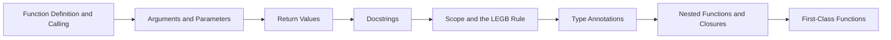

# Chapter 9: Functions


> **Previous:** [Dictionaries](./08-dictionaries.md) | **Next:** [Lambda and Functional Programming](./10-lambda.md)
## Learning Objectives

By the end of this chapter, students will be able to:
- Define and call functions with various parameter types
- Use positional, keyword, default, `*args`, and `**kwargs` parameters
- Understand and apply the LEGB scope resolution rule
- Write docstrings and type annotations
- Create nested functions and closures
- Predict the behaviour of mutable default arguments

<!-- Image Gallery -->
<section class="lesson-visuals" aria-label="Visual learning resources">
  <header><span>VISUAL LEARNING</span><h2>See it. Review it. Remember it.</h2></header>
  <a class="lesson-visual-card" href="../../assets/images/lessons/python-programming/09-functions/handwritten-notes.png" target="_blank" rel="noopener">
    
    <span><strong>Handwritten notes</strong>Condensed notes for deliberate review.</span>
  </a>
  <a class="lesson-visual-card" href="../../assets/images/lessons/python-programming/09-functions/sticky-notes.png" target="_blank" rel="noopener">
    
    <span><strong>Sticky-note revision</strong>Fast recall prompts for revision.</span>
  </a>
  <a class="lesson-visual-card" href="../../assets/images/lessons/python-programming/09-functions/visual-explanation.png" target="_blank" rel="noopener">
    
    <span><strong>Visual concept guide</strong>A connected explanation of the key ideas.</span>
  </a>
</section>
<!-- End Image Gallery -->


## Chapter at a Glance

| Section | Topic | Key Concept |
|---------|-------|-------------|
|9.1 Function Definition and Calling||Functions are defined with `def`; calling a function creates a local scope.|
|9.2 Arguments and Parameters||Use `*args` for variable positional args, `**kwargs` for keyword args, and `None` for mutable defaults.|
|9.3 Return Values||LEGB rule: Local → Enclosing → Global → Built-in resolves variable names.|
|9.4 Docstrings||Closures capture enclosing variables by reference — watch out for late-binding in loops.|
|9.5 Scope and the LEGB Rule||Type annotations document expected types; mypy checks them statically.|
|9.6 Type Annotations||undefined|
|9.7 Nested Functions and Closures||undefined|
|9.8 First-Class Functions||undefined|


## Chapter Roadmap


## 9.1 Function Definition and Calling

> **One-Sentence Takeaway:** Functions are defined with `def`; calling a function creates a local scope.


Functions are defined with `def` and called with parentheses:

```python
def greet(name):
    """Return a greeting string."""
    return f"Hello, {name}!"

print(greet("Alice"))  # Hello, Alice!
```

Functions without an explicit `return` return `None`:

```python
def say_hello(name):
    print(f"Hello, {name}!")

result = say_hello("Bob")   # Hello, Bob!
print(result)                # None
```

## 9.2 Arguments and Parameters

> **One-Sentence Takeaway:** Use `*args` for variable positional args, `**kwargs` for keyword args, and `None` for mutable defaults.
> **Warning:** Mutable default arguments are evaluated once at definition time — use `None` and create a new object each call.


### 9.2.1 Positional Arguments


Arguments are matched to parameters by position:

```python
def add(a, b, c):
    return a + b + c

print(add(1, 2, 3))  # 6
```

### 9.2.2 Keyword Arguments


Arguments can be specified by parameter name:

```python
print(add(b=2, a=1, c=3))  # 6
print(add(1, c=3, b=2))    # 6  (positional before keyword)
```

Positional arguments must precede keyword arguments:

```python
add(a=1, 2, 3)   # SyntaxError: positional argument follows keyword argument
```

### 9.2.3 Default Parameter Values


```python
def power(base, exponent=2):
    return base ** exponent

print(power(5))       # 25  (default exponent)
print(power(5, 3))    # 125
```

Default arguments are evaluated once at definition time, not at call time:

```python
def append_to(element, target=[]):
    target.append(element)
    return target

print(append_to(1))   # [1]
print(append_to(2))   # [1, 2]  → the default list is shared!

# CORRECT pattern
def append_to(element, target=None):
    if target is None:
        target = []
    target.append(element)
    return target

print(append_to(1))   # [1]
print(append_to(2))   # [2]
```

### 9.2.4 *args → Variable Positional Arguments


`*args` captures extra positional arguments as a tuple:

```python
def sum_all(*numbers):
    print(type(numbers))  # <class 'tuple'>
    return sum(numbers)

print(sum_all(1, 2, 3, 4, 5))  # 15

def log(level, *messages):
    for msg in messages:
        print(f"[{level}] {msg}")

log("INFO", "Starting", "Processing", "Done")
# [INFO] Starting
# [INFO] Processing
# [INFO] Done
```

### 9.2.5 **kwargs → Variable Keyword Arguments


`**kwargs` captures extra keyword arguments as a dictionary:

```python
def create_profile(name, **details):
    print(f"Name: {name}")
    for key, value in details.items():
        print(f"  {key}: {value}")

create_profile("Alice", age=30, city="NYC", occupation="Engineer")
# Name: Alice
#   age: 30
#   city: NYC
#   occupation: Engineer
```

### 9.2.6 Argument Unpacking


`*` unpacks iterables; `**` unpacks dictionaries:

```python
def point(x, y, z):
    return f"({x}, {y}, {z})"

coords = [10, 20, 30]
print(point(*coords))   # (10, 20, 30)

params = {"x": 5, "y": 15, "z": 25}
print(point(**params))  # (5, 15, 25)

# Combined
values = [1, 2]
print(point(*values, z=3))  # (1, 2, 3)
```

### 9.2.7 Parameter Ordering


The complete parameter order is:

```python
def func(pos1, pos2, /, pos_or_kwd, *, kwd1, kwd2):
    pass
```

- `/` separates positional-only (left) from positional-or-keyword (right).
- `*` separates positional-or-keyword (left) from keyword-only (right).

```python
def divide(a, b, /):
    """a and b are positional-only."""
    return a / b

print(divide(10, 3))   # 3.333...
# divide(a=10, b=3)     # TypeError

def greet(*, name, greeting="Hello"):
    """name and greeting are keyword-only."""
    return f"{greeting}, {name}!"

print(greet(name="Alice"))  # Hello, Alice!
# greet("Alice")              # TypeError

def process(a, b, /, c, d, *, e, f):
    return a + b + c + d + e + f

print(process(1, 2, 3, 4, e=5, f=6))  # 21
```

## 9.3 Return Values

> **One-Sentence Takeaway:** LEGB rule: Local → Enclosing → Global → Built-in resolves variable names.


Functions can return multiple values as a tuple:

```python
def stats(numbers):
    return min(numbers), max(numbers), sum(numbers) / len(numbers)

minimum, maximum, average = stats([1, 2, 3, 4, 5])
print(minimum, maximum, average)  # 1 5 3.0
```

Type annotation for return value (`->`):

```python
def factorial(n: int) -> int:
    if n <= 1:
        return 1
    return n * factorial(n - 1)
```

## 9.4 Docstrings

> **One-Sentence Takeaway:** Closures capture enclosing variables by reference — watch out for late-binding in loops.


Docstrings document the function's purpose, parameters, and return value:

```python
def fibonacci(n: int) -> int:
    """Return the nth Fibonacci number.
    
    Args:
        n: A non-negative integer.
        
    Returns:
        The nth Fibonacci number where F(0)=0, F(1)=1.
        
    Raises:
        ValueError: If n is negative.
    """
    if n < 0:
        raise ValueError("n must be non-negative")
    if n <= 1:
        return n
    a, b = 0, 1
    for _ in range(2, n + 1):
        a, b = b, a + b
    return b

help(fibonacci)  # prints the docstring
```

## 9.5 Scope and the LEGB Rule

> **One-Sentence Takeaway:** Type annotations document expected types; mypy checks them statically.


Python resolves variable names following the LEGB order:

1. **L**ocal → function scope
2. **E**nclosing → outer function scope (for nested functions)
3. **G**lobal → module level
4. **B**uilt-in → Python's built-in namespace

```python
x = "global"         # G

def outer():
    x = "enclosing"  # E
    
    def inner():
        x = "local"  # L
        print(x)
    
    inner()
    print(x)

outer()
print(x)
# local
# enclosing
# global
```

The `global` and `nonlocal` keywords modify variables in outer scopes:

```python
counter = 0

def increment():
    global counter
    counter += 1

increment()
print(counter)  # 1

def make_counter():
    count = 0
    
    def increment():
        nonlocal count
        count += 1
        return count
    
    return increment

c = make_counter()
print(c())  # 1
print(c())  # 2
```

Without `nonlocal`, assignment in `inner` creates a new local variable rather than modifying the enclosing scope's variable.

## 9.6 Type Annotations

> **One-Sentence Takeaway:** undefined
> **Remember:** Type annotations are not enforced at runtime — use mypy or pyright for static type checking.


Type hints document expected types (not enforced at runtime):

```python
def process(name: str, age: int = 0, *, verbose: bool = False) -> str:
    if verbose:
        print(f"Processing {name}, age {age}")
    return f"Hello, {name}"

# Union types
from typing import Union, Optional, List, Dict, Tuple, Any

def parse(value: Union[int, str]) -> Optional[int]:
    if isinstance(value, int):
        return value
    if value.isdigit():
        return int(value)
    return None

# Python 3.10+ syntax
def parse_310(value: int | str) -> int | None:
    if isinstance(value, int):
        return value
    if value.isdigit():
        return int(value)
    return None

# Collections
def total(values: list[int]) -> int:
    return sum(values)

def lookup(data: dict[str, int]) -> tuple[str, int] | None:
    for k, v in data.items():
        if v > 10:
            return k, v
    return None
```

Type checking is performed by external tools like `mypy` or `pyright`, not by the Python interpreter.

## 9.7 Nested Functions and Closures

> **One-Sentence Takeaway:** undefined


A closure is a function that captures variables from its enclosing scope:

```python
def make_multiplier(factor: float):
    """Return a function that multiplies its argument by factor."""
    def multiplier(x: float) -> float:
        return x * factor
    return multiplier

double = make_multiplier(2)
triple = make_multiplier(3)

print(double(5))    # 10
print(triple(5))    # 15
print(double(3.5))  # 7.0
```

Closures capture variables, not values. Late binding:

```python
def make_functions():
    funcs = []
    for i in range(5):
        funcs.append(lambda: i)  # captures i by reference
    return funcs

for f in make_functions():
    print(f(), end=" ")   # 4 4 4 4 4  → all see i=4

# Fix: capture the current value
def make_functions_fixed():
    funcs = []
    for i in range(5):
        funcs.append(lambda i=i: i)  # default arg captures value
    return funcs

for f in make_functions_fixed():
    print(f(), end=" ")   # 0 1 2 3 4
```

## 9.8 First-Class Functions

> **One-Sentence Takeaway:** undefined


Functions are first-class objects → they can be assigned, passed, and returned:

```python
def square(x):
    return x ** 2

f = square         # assign
print(f(5))        # call via reference: 25

def apply(func, value):
    return func(value)

print(apply(square, 4))  # 16

def get_operation(op):
    if op == "square":
        return square
    elif op == "cube":
        return lambda x: x ** 3
    
g = get_operation("cube")
print(g(3))  # 27
```


## Concept Comparison Table

| Concept | def | lambda |
|---|---|---|
| Name | Required | Anonymous |
| Statements | Multiple allowed | Single expression only |
| When to use | Complex/reusable logic | Simple one-off operations |
| Return | Explicit or None | Expression result |


## Quick Reference

```python
def greet(name):
    return f"Hello, {name}"

def log(level, *messages, **opts):
    for m in messages:
        print(f"[{level}] {m}")

# LEGB demo
x = "global"
def outer():
    x = "enclosing"
```

## Cross-Application Matrix

| Area | Application | Relevant Section |
|------|-------------|------------------|
|Web Dev|Route handler functions in FastAPI|9.1|
|Data Science|Custom aggregation functions|9.3|
|DevOps|Config loading with *args/**kwargs|9.2|
|Automation|Closure-based retry wrappers|9.7|


## Chapter Quiz

**Q1.** What is the LEGB order of scope resolution?
- Local, Enclosing, Global, Built-in **<-- Correct**
- Local, Global, Enclosing, Built-in
- Built-in, Global, Enclosing, Local
- Global, Local, Enclosing, Built-in

**Q2.** What does `*args` capture?
- keyword-only args
- positional args as tuple **<-- Correct**
- default args
- nothing

**Q3.** Why avoid mutable default arguments?
- they are slow
- they are evaluated once and shared **<-- Correct**
- they raise SyntaxError
- they cannot be type-annotated

**Q4.** What does `nonlocal` do?
- creates a global variable
- modifies enclosing scope variable **<-- Correct**
- creates a local variable
- deletes a variable

**Q5.** What is a closure?
- a function with type annotations
- a function capturing enclosing variables **<-- Correct**
- a lambda expression
- a class method


## TypeScript Parallel

TypeScript functions share many concepts with Python but differ in syntax:

```typescript
// Parameters: required, optional, default, rest
function greet(
  name: string,
  greeting: string = "Hello",       // default parameter
  title?: string,                    // optional parameter
  ...tags: string[]                  // rest parameter (like *args)
): string {
  const prefix = title ? `${title} ` : "";
  return `${greeting}, ${prefix}${name}!`;
}
console.log(greet("Alice"));                   // Hello, Alice!
console.log(greet("Bob", "Hi", "Dr."));        // Hi, Dr. Bob!
console.log(greet("Charlie", "Hey", "Mr.", "guest", "vip"));
// Hey, Mr. Charlie!

// Arrow functions (like lambdas)
const square = (x: number): number => x * x;
const add = (a: number, b: number): number => a + b;

// TypeScript scope: similar to LEGB
let globalVar = "global";
function outer(): void {
  let outerVar = "outer";
  function inner(): void {
    let innerVar = "inner";
    console.log(globalVar);  // accesses global
    console.log(outerVar);   // closure over outer
  }
  inner();
}

// Closures in TypeScript
function makeCounter(start: number = 0): () => number {
  let count = start;
  return () => count++;  // captures count by reference
}
const counter = makeCounter(10);
console.log(counter());  // 10
console.log(counter());  // 11
```

### Python vs TypeScript Functions


| Feature | Python | TypeScript |
|---------|--------|------------|
| Default args | `def f(x=5)` | `function f(x: number = 5)` |
| Variable args | `*args` (tuple) | `...args: T[]` (array) |
| Keyword args | `**kwargs` (dict) | Destructured object param |
| Lambda | `lambda x: expr` | `x => expr` |
| Type hints | Optional annotations | Required types (strict) |
| Doc in body | Docstring `"""..."""` | JSDoc `/** ... */` |
| Anonymous | `lambda` or `def` | `() => {}` arrow function |

### TypeScript Function Overloads & Advanced Patterns

```typescript
// Python has *args → TypeScript: rest parameters
function sumAll(...numbers: number[]): number {
  return numbers.reduce((a, b) => a + b, 0);
}
console.log(sumAll(1, 2, 3, 4));  // 10

// Python: **kwargs → TypeScript: destructured object parameter
function createUser(name: string, options: { age?: number; email?: string }): string {
  const age = options.age ?? "unknown";
  const email = options.email ?? "no email";
  return `${name} (${age}) - ${email}`;
}
console.log(createUser("Alice", { age: 30, email: "alice@x.com" }));

// Python: positional-only (/) and keyword-only (*) → TypeScript
function divide(dividend: number, divisor: number): number {
  // No positional-only distinction in TypeScript
  return dividend / divisor;
}
// Python: def divide(dividend, divisor, /):

// Python: default argument evaluation (beware mutable defaults)
// TypeScript: same issue with default objects
function addItem(item: string, list: string[] = []): string[] {
  list.push(item);
  return list;
}
// Each call without list creates a new default array (same as Python with None)

// Python: nonlocal → TypeScript: closures work the same
function makeMultiplier(factor: number): (x: number) => number {
  return (x: number) => x * factor;  // captures factor
}

// Python: recursion with type hints
function factorial(n: number): number {
  if (n <= 1) return 1;
  return n * factorial(n - 1);
}

// Python: function annotations → TypeScript: compulsory types
function process(value: string | number): string {
  if (typeof value === "string") return value.toUpperCase();
  return value.toFixed(2);  // TypeScript narrows type in each branch
}
```

### TypeScript Callback & Async Function Patterns

```typescript
// Python: function as argument → TypeScript: callback
function processArray<T, U>(
  items: T[],
  callback: (item: T, index: number) => U
): U[] {
  return items.map(callback);
}
const doubled3 = processArray([1, 2, 3], (x) => x * 2);

// Python: generator vs TypeScript: callback pattern
function asyncSequence<T>(
  items: T[],
  delay: number,
  callback: (item: T, idx: number) => void
): void {
  items.forEach((item, i) => {
    setTimeout(() => callback(item, i), delay * i);
  });
}

// Python: nested functions → TypeScript: closures
function createLogger(prefix: string) {
  return {
    info: (msg: string) => console.log(`[${prefix} INFO] ${msg}`),
    error: (msg: string) => console.error(`[${prefix} ERROR] ${msg}`),
  };
}
const logger = createLogger("App");
logger.info("Started");  // [App INFO] Started
logger.error("Failed");  // [App ERROR] Failed

// Python: function attributes → TypeScript: function properties
function greet3(name: string): string {
  return `${greet3.prefix} ${name}!`;
}
greet3.prefix = "Hello";
console.log(greet3("World"));  // Hello World!

// Python: singledispatch → TypeScript: function overloads
function format(input: string): string;
function format(input: number): string;
function format(input: boolean): string;
function format(input: string | number | boolean): string {
  if (typeof input === "string") return `"${input}"`;
  if (typeof input === "number") return input.toFixed(2);
  return input ? "true" : "false";
}
console.log(format(42));       // "42.00"
console.log(format("hello"));  // '"hello"'

// Python: recursive function with type hints
function deepCount(obj: Record<string, any>): number {
  let count = 0;
  for (const val of Object.values(obj)) {
    if (typeof val === "object" && val !== null) {
      count += deepCount(val);
    }
    count++;
  }
  return count;
}
```

### TypeScript Utilities

```typescript
// === Overload Resolver ===
type OverloadFn = (...args: unknown[]) => unknown;
interface OverloadSignature { args: string[]; returnType: string; }
function resolveOverload(fn: OverloadFn, signatures: OverloadSignature[], args: unknown[]): string {
  for (const sig of signatures) {
    if (sig.args.length !== args.length) continue;
    const match = sig.args.every((type, i) => {
      if (type === "number") return typeof args[i] === "number";
      if (type === "string") return typeof args[i] === "string";
      if (type === "boolean") return typeof args[i] === "boolean";
      return true;
    });
    if (match) return `Matches: (${sig.args.join(", ")}) => ${sig.returnType}`;
  }
  return "No matching overload";
}
const sigs: OverloadSignature[] = [
  { args: ["string"], returnType: "number" },
  { args: ["number", "number"], returnType: "number" },
];
console.log(resolveOverload(() => {}, sigs, ["hello"]));  // Matches (string) => number
console.log(resolveOverload(() => {}, sigs, [1, 2]));      // Matches (number, number) => number

// === Default Param Analyzer ===
interface ParamConfig { name: string; hasDefault: boolean; defaultVal?: unknown; isRest: boolean }
function analyzeParams(fn: (...args: unknown[]) => unknown): ParamConfig[] {
  const src = fn.toString();
  const params = src.match(/\(([^)]*)\)/)?.[1] ?? "";
  return params.split(",").filter(Boolean).map((p) => {
    const trimmed = p.trim();
    return {
      name: trimmed.replace(/[=?].*/, "").replace(/^\.\.\./, "").trim(),
      hasDefault: trimmed.includes("="),
      defaultVal: trimmed.includes("=") ? trimmed.split("=")[1]?.trim() : undefined,
      isRest: trimmed.startsWith("..."),
    };
  });
}
function example(a: string, b = 10, ...rest: number[]) { return a; }
console.log(analyzeParams(example));

// === Rest / Spread Helper ===
function mergeArrays<T>(...arrays: T[][]): T[] {
  return arrays.reduce((acc, arr) => [...acc, ...arr], []);
}
function pickProps<T extends Record<string, unknown>>(obj: T, ...keys: (keyof T)[]): Partial<T> {
  return keys.reduce((acc, k) => ({ ...acc, [k]: obj[k] }), {} as Partial<T>);
}
console.log(mergeArrays([1, 2], [3, 4], [5]));
console.log(pickProps({ a: 1, b: 2, c: 3 }, "a", "c"));

// === Partial Application (Python functools.partial equivalent) ===
function partial<T extends unknown[], R>(fn: (...args: T) => R, ...bound: Partial<T>): (...rest: T) => R {
  return (...rest: T) => fn(...bound, ...rest) as R;
}
const add = (a: number, b: number, c: number) => a + b + c;
const add5 = partial(add, 5);
console.log(add5(10, 3)); // 18

// === Currying Helper ===
function curry<T extends unknown[], R>(fn: (...args: T) => R): (...args: Partial<T>) => unknown {
  return (...args: Partial<T>) => args.length >= fn.length ? fn(...args as T) : curry(fn.bind(null, ...args));
}
const curriedAdd = curry((a: number, b: number, c: number) => a + b + c);
console.log(curriedAdd(1)(2)(3)); // 6
```

### TypeScript Advanced Patterns

```typescript
// === Generic Function Constraints ===
function getProperty<T, K extends keyof T>(obj: T, key: K): T[K] {
  return obj[key];
}
const person = { name: "Alice", age: 30, city: "Paris" };
console.log(getProperty(person, "name")); // Alice
// getProperty(person, "zip"); // TypeScript error

// === Function Composition Pipeline ===
type Unary<T, R> = (x: T) => R;
function pipe<T, R>(...fns: Unary<any, any>[]): Unary<T, R> {
  return (x: T) => fns.reduce((acc, fn) => fn(acc), x) as R;
}
const trim = (s: string) => s.trim();
const upper = (s: string) => s.toUpperCase();
const excerpt = (s: string) => s.length > 10 ? s.slice(0, 10) + "..." : s;
const processTitle = pipe(trim, upper, excerpt);
console.log(processTitle("  hello world example  ")); // "HELLO WOR..."

// === Memoization (Python: functools.lru_cache) ===
function memoize<T, R>(fn: (arg: T) => R): (arg: T) => R {
  const cache = new Map<T, R>();
  return (arg: T): R => {
    if (cache.has(arg)) {
      console.log(`[cache hit] ${arg}`);
      return cache.get(arg)!;
    }
    const result = fn(arg);
    cache.set(arg, result);
    return result;
  };
}
const fib = memoize((n: number): number => {
  if (n < 2) return n;
  return fib(n - 1) + fib(n - 2);
});
console.log(fib(40)); // Fast due to memoization

// === Type Guards (Python: isinstance checks) ===
interface Cat { type: "cat"; meow(): void }
interface Dog { type: "dog"; bark(): void }
type Animal = Cat | Dog;
function isCat(animal: Animal): animal is Cat {
  return animal.type === "cat";
}
function handleAnimal(animal: Animal): void {
  if (isCat(animal)) animal.meow();
  else animal.bark();
}

// === Callback to Promise Wrapper ===
function promisify<T>(fn: (cb: (err: Error | null, result?: T) => void) => void): () => Promise<T> {
  return () => new Promise<T>((resolve, reject) => {
    fn((err, result) => err ? reject(err) : resolve(result!));
  });
}

// === Async Function Pattern ===
async function fetchWithTimeout<T>(url: string, timeoutMs = 5000): Promise<T> {
  const controller = new AbortController();
  const timer = setTimeout(() => controller.abort(), timeoutMs);
  try {
    const response = await fetch(url, { signal: controller.signal });
    return await response.json() as T;
  } finally {
    clearTimeout(timer);
  }
}

// === Partial Application with Types ===
function partialApply<T extends unknown[], R>(fn: (...args: T) => R, ...args: Partial<T>): (...rest: T) => R {
  return (...rest: T) => fn(...args, ...rest) as R;
}
const multiply = (a: number, b: number, c: number) => a * b * c;
const double = partialApply(multiply, 2);
console.log(double(3, 4)); // 24 (2 * 3 * 4)

// === Variadic Function Overloads ===
function sum(...args: number[]): number;
function sum(...args: string[]): string;
function sum(...args: (number | string)[]): number | string {
  if (typeof args[0] === "number") return (args as number[]).reduce((a, b) => a + b, 0);
  return (args as string[]).join("");
}
console.log(sum(1, 2, 3));    // 6
console.log(sum("a", "b")); // "ab"

// === Python-style decorator via higher-order function ===
function logCalls<T extends (...args: unknown[]) => unknown>(fn: T): T {
  return ((...args: Parameters<T>) => {
    console.log(`Called ${fn.name}(${args.map(a => JSON.stringify(a)).join(", ")})`);
    const result = fn(...args);
    console.log(`Returned ${JSON.stringify(result)}`);
    return result;
  }) as T;
}
const loggedAdd = logCalls((a: number, b: number) => a + b);
loggedAdd(3, 4); // logs: Called (3, 4) → 7
```

### TypeScript Function Composition & Pipeline

```typescript
// === Pipe Operator (Python: function composition) ===
const pipe = <T>(...fns: Array<(arg: T) => T>) => (value: T): T => fns.reduce((acc, fn) => fn(acc), value);
const compose = <T>(...fns: Array<(arg: T) => T>) => (value: T): T => fns.reduceRight((acc, fn) => fn(acc), value);

// === Throttle & Debounce ===
function debounce<T extends unknown[]>(fn: (...args: T) => void, delay: number) {
  let timer: ReturnType<typeof setTimeout>;
  return (...args: T) => {
    clearTimeout(timer);
    timer = setTimeout(() => fn(...args), delay);
  };
}
function throttle<T extends unknown[]>(fn: (...args: T) => void, limit: number) {
  let inThrottle = false;
  return (...args: T) => {
    if (!inThrottle) { fn(...args); inThrottle = true; setTimeout(() => { inThrottle = false; }, limit); }
  };
}

// === Once (Python: functools.cache with no args) ===
function once<T extends unknown[], R>(fn: (...args: T) => R): (...args: T) => R {
  let called = false, result: R;
  return (...args: T) => { if (!called) { called = true; result = fn(...args); } return result; };
}

// === Function Wrapping (Python: @wraps equivalent) ===
function wrap<T extends unknown[], R>(fn: (...args: T) => R) {
  const wrapped = (...args: T) => fn(...args);
  Object.defineProperty(wrapped, 'name', { value: `wrapped_${fn.name}` });
  return wrapped;
}

// === Async Pipe ===
async function asyncPipe<T>(initial: T, ...fns: Array<(x: any) => Promise<any>>): Promise<T> {
  let result = initial as any;
  for (const fn of fns) result = await fn(result);
  return result;
}

// === Curried Function Builder ===
function curryN<T, R>(fn: (...args: T[]) => R, arity = fn.length): (...args: T[]) => R | ((...args: T[]) => R) {
  return (...args: T[]) => {
    if (args.length >= arity) return fn(...args);
    return curryN((...more: T[]) => fn(...args, ...more) as R, arity - args.length) as any;
  };
}

// === Function Identity & Tap ===
const identityFn = <T>(x: T): T => x;
function tap<T>(fn: (x: T) => void): (x: T) => T { return (x: T) => { fn(x); return x; }; }

// === Pipeline with Validation ===
const pipelineResult = pipe(
  (x: number) => x * 2,
  tap(x => console.log(`After double: ${x}`)),
  (x: number) => x + 1,
)(5);
console.log(pipelineResult); // 11

// === Strategy Pattern via Functions ===
type Strategy = (a: number, b: number) => number;
const strategies: Record<string, Strategy> = {
  add: (a, b) => a + b,
  multiply: (a, b) => a * b,
  max: (a, b) => Math.max(a, b),
  power: (a, b) => a ** b,
};
function executeStrategy(name: string, a: number, b: number): number {
  return strategies[name]?.(a, b) ?? (() => { throw new Error(`Unknown strategy: ${name}`); })();
}
console.log(executeStrategy("add", 5, 3)); // 8
console.log(executeStrategy("power", 2, 10)); // 1024
```

## Summary

- Parameters: positional, keyword, default, `*args`, `**kwargs`, positional-only (`/`), keyword-only (`*`).
- Default arguments are evaluated once â€" use `None` for mutable defaults.
- LEGB scope: Local, Enclosing, Global, Built-in.
- `global` and `nonlocal` modify variables in outer scopes.
- Docstrings and annotations document the function contract.
- Closures capture enclosing variables by reference.

## Exercises

### Review Questions

1. What problem arises with mutable default arguments and how do you fix it?
2. How does the LEGB rule resolve variable names?
3. What is the difference between `*args` and `**kwargs`?
4. When would you use positional-only (`/`) parameters?
5. How do closures capture variables and what is the late-binding issue?

### Application Problems

1. Write a function `create_calculator(operation)` that returns a function performing addition, subtraction, multiplication, or division based on the `operation` string. Use closures.
2. Write a recursive `factorial(n)` function with type annotations, a docstring, and error handling for negative inputs.
3. Implement a function `timer(f)` that accepts another function and returns a new function with the same behaviour. For now, just return a wrapper that prints "called" before each invocation (we will generalise this in Chapter 15).

### Challenge Problem

Build a simple function registry and pipeline system. Define a decorator `@register(name)` that stores functions in a global registry dict. Then implement `pipeline(data, *stage_names)` that applies the registered functions in sequence, passing the output of each as the input to the next. Support error handling at each stage. Use `**kwargs` to pass configuration to individual stages.
