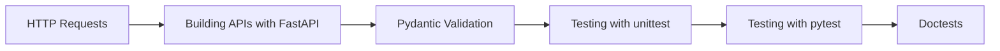

# Chapter 19: APIs and Testing


> **Previous:** [The Python Standard Library](./18-stdlib.md) | **Next:** [NumPy and pandas](./20-numpy-pandas.md)
## Learning Objectives

By the end of this chapter, students will be able to:
- Make HTTP requests with requests and httpx
- Build REST APIs with FastAPI
- Validate data with Pydantic models
- Write unit tests with unittest and pytest
- Use fixtures, parametrize, and mocking in pytest
- Write doctests embedded in documentation
- Measure and improve test coverage

<!-- Image Gallery -->
<section class="lesson-visuals" aria-label="Visual learning resources">
  <header><span>VISUAL LEARNING</span><h2>See it. Review it. Remember it.</h2></header>
  <a class="lesson-visual-card" href="../../assets/images/lessons/python-programming/19-apis-testing/handwritten-notes.png" target="_blank" rel="noopener">
    
    <span><strong>Handwritten notes</strong>Condensed notes for deliberate review.</span>
  </a>
  <a class="lesson-visual-card" href="../../assets/images/lessons/python-programming/19-apis-testing/sticky-notes.png" target="_blank" rel="noopener">
    
    <span><strong>Sticky-note revision</strong>Fast recall prompts for revision.</span>
  </a>
  <a class="lesson-visual-card" href="../../assets/images/lessons/python-programming/19-apis-testing/visual-explanation.png" target="_blank" rel="noopener">
    
    <span><strong>Visual concept guide</strong>A connected explanation of the key ideas.</span>
  </a>
</section>
<!-- End Image Gallery -->


## Chapter at a Glance

| Section | Topic | Key Concept |
|---------|-------|-------------|
|19.1 HTTP Requests||`requests` makes HTTP calls simple; use `Session` for connection reuse across requests.|
|19.2 Building APIs with FastAPI||FastAPI builds type-validated APIs with automatic OpenAPI docs and interactive Swagger UI.|
|19.3 Pydantic Validation||Pydantic validates data at runtime using Python type annotations — define schemas with classes.|
|19.4 Testing with unittest||pytest fixtures provide reusable setup/teardown; parametrize tests with `@pytest.mark.parametrize`.|
|19.5 Testing with pytest||Mocking isolates code from external dependencies; use `unittest.mock` or `pytest-mock`.|
|19.6 Doctests||undefined|


## Chapter Roadmap


## 19.1 HTTP Requests

> **One-Sentence Takeaway:** `requests` makes HTTP calls simple; use `Session` for connection reuse across requests.
> **Remember:** Always handle HTTP errors — check `response.status_code` or use `response.raise_for_status()`.


### 19.1.1 The requests Library


```python
import requests

# GET request
response = requests.get("https://api.github.com")
print(response.status_code)     # 200
print(response.ok)               # True
print(response.headers["Content-Type"])

# JSON response
data = response.json()
print(data["current_user_url"])

# Query parameters
params = {"q": "python", "sort": "stars"}
response = requests.get("https://api.github.com/search/repositories", params=params)
print(f"Found {response.json()['total_count']} repositories")

# POST request
payload = {"title": "New Issue", "body": "This is a test"}
headers = {"Authorization": "token YOUR_TOKEN"}
response = requests.post(
    "https://api.github.com/repos/owner/repo/issues",
    json=payload,
    headers=headers,
)
print(response.status_code)

# Error handling
response = requests.get("https://api.github.com/nonexistent")
if response.status_code == 404:
    print("Not found")
else:
    response.raise_for_status()  # raises HTTPError for 4xx/5xx

# Timeouts
try:
    response = requests.get("https://example.com", timeout=5)
except requests.Timeout:
    print("Request timed out")
```

### 19.1.2 Sessions


```python
# Sessions reuse TCP connections and persist cookies
with requests.Session() as session:
    session.headers.update({"Authorization": "token TOKEN"})
    for repo in ["repo1", "repo2", "repo3"]:
        response = session.get(f"https://api.github.com/repos/owner/{repo}")
        print(response.json()["description"])
```

### 19.1.3 httpx → Async HTTP


```python
import httpx
import asyncio

# Synchronous
with httpx.Client() as client:
    response = client.get("https://api.github.com")
    print(response.json())

# Asynchronous
async def fetch_all():
    async with httpx.AsyncClient() as client:
        tasks = [
            client.get("https://api.github.com"),
            client.get("https://api.github.com/repos/python/cpython"),
        ]
        responses = await asyncio.gather(*tasks)
        for resp in responses:
            print(resp.status_code, resp.url)

asyncio.run(fetch_all())
```

## 19.2 Building APIs with FastAPI

> **One-Sentence Takeaway:** FastAPI builds type-validated APIs with automatic OpenAPI docs and interactive Swagger UI.


```python
from fastapi import FastAPI, HTTPException, Query
from pydantic import BaseModel
from typing import Optional

app = FastAPI(title="Task Manager API", version="1.0.0")

# In-memory database
tasks_db: dict[int, dict] = {}
next_id = 1

# Pydantic models (covered in next section)
class TaskCreate(BaseModel):
    title: str
    description: Optional[str] = None
    completed: bool = False

class Task(TaskCreate):
    id: int

class TaskUpdate(BaseModel):
    title: Optional[str] = None
    description: Optional[str] = None
    completed: Optional[bool] = None

# Routes
@app.get("/")
def root():
    return {"message": "Task Manager API"}

@app.get("/tasks", response_model=list[Task])
def list_tasks(
    skip: int = Query(0, ge=0),
    limit: int = Query(10, ge=1, le=100),
):
    return list(tasks_db.values())[skip : skip + limit]

@app.post("/tasks", response_model=Task, status_code=201)
def create_task(task: TaskCreate):
    global next_id
    task_id = next_id
    next_id += 1
    tasks_db[task_id] = {"id": task_id, **task.model_dump()}
    return tasks_db[task_id]

@app.get("/tasks/{task_id}", response_model=Task)
def get_task(task_id: int):
    if task_id not in tasks_db:
        raise HTTPException(status_code=404, detail="Task not found")
    return tasks_db[task_id]

@app.put("/tasks/{task_id}", response_model=Task)
def update_task(task_id: int, task: TaskUpdate):
    if task_id not in tasks_db:
        raise HTTPException(status_code=404, detail="Task not found")
    current = tasks_db[task_id]
    updates = task.model_dump(exclude_unset=True)
    current.update(updates)
    return current

@app.delete("/tasks/{task_id}", status_code=204)
def delete_task(task_id: int):
    if task_id not in tasks_db:
        raise HTTPException(status_code=404, detail="Task not found")
    del tasks_db[task_id]
```

Save as `main.py` and run with `uvicorn main:app --reload`. Visit `http://localhost:8000/docs` for interactive documentation.

## 19.3 Pydantic Validation

> **One-Sentence Takeaway:** Pydantic validates data at runtime using Python type annotations — define schemas with classes.


Pydantic enforces type constraints on data models at runtime:

```python
from pydantic import BaseModel, Field, EmailStr, field_validator
from datetime import datetime

class User(BaseModel):
    name: str = Field(..., min_length=1, max_length=100)
    email: EmailStr
    age: int = Field(..., ge=0, le=150)
    created_at: datetime = Field(default_factory=datetime.now)
    tags: list[str] = []

    @field_validator("name")
    @classmethod
    def name_must_be_meaningful(cls, v: str) -> str:
        if v.strip() == "":
            raise ValueError("Name cannot be blank")
        return v.strip()

class Order(BaseModel):
    user_id: int
    items: list[str] = Field(..., min_length=1)
    total: float = Field(..., gt=0)

# Valid data
user = User(name="Alice", email="alice@example.com", age=30)
print(user.model_dump())

# Invalid data
try:
    User(name="", email="not-an-email", age=200)
except Exception as e:
    print(e)
    # 3 validation errors: name (blank), email (invalid), age (too large)
```

Pydantic integrates seamlessly with FastAPI → route parameters are automatically validated and documented in OpenAPI/Swagger.

## 19.4 Testing with unittest

> **One-Sentence Takeaway:** pytest fixtures provide reusable setup/teardown; parametrize tests with `@pytest.mark.parametrize`.


```python
import unittest

def factorial(n: int) -> int:
    if n < 0:
        raise ValueError("Negative input")
    if n == 0:
        return 1
    return n * factorial(n - 1)

class TestFactorial(unittest.TestCase):
    def test_zero(self):
        self.assertEqual(factorial(0), 1)
    
    def test_positive(self):
        self.assertEqual(factorial(5), 120)
    
    def test_negative(self):
        with self.assertRaises(ValueError):
            factorial(-1)
    
    def test_large(self):
        self.assertEqual(factorial(10), 3628800)

# setUp and tearDown
class TestDatabase(unittest.TestCase):
    def setUp(self):
        self.data = [1, 2, 3]
    
    def tearDown(self):
        self.data.clear()
    
    def test_length(self):
        self.assertEqual(len(self.data), 3)
    
    def test_contains(self):
        self.assertIn(2, self.data)

if __name__ == "__main__":
    unittest.main()
```

## 19.5 Testing with pytest

> **One-Sentence Takeaway:** Mocking isolates code from external dependencies; use `unittest.mock` or `pytest-mock`.


pytest is the modern standard for Python testing:

```python
# test_math.py
import pytest

def add(a: int, b: int) -> int:
    return a + b

def test_add():
    assert add(2, 3) == 5
    assert add(-1, 1) == 0
    assert add(0, 0) == 0
```

### 19.5.1 Assertions


pytest uses plain `assert` → no need for `self.assertEqual`:

```python
def test_strings():
    assert "hello".upper() == "HELLO"
    assert "hello".startswith("he")
    assert "hello" in "hello world"

def test_lists():
    result = [1, 2, 3]
    assert result == [1, 2, 3]
    assert 2 in result
    assert len(result) == 3
```

### 19.5.2 Fixtures


Fixtures provide reusable test setup:

```python
import pytest

@pytest.fixture
def sample_data():
    return {"name": "Alice", "scores": [85, 92, 78]}

@pytest.fixture
def db_connection():
    conn = {"connected": True}
    yield conn  # setup
    conn["connected"] = False  # teardown

def test_average(sample_data):
    scores = sample_data["scores"]
    assert sum(scores) / len(scores) == 85.0

def test_connection_active(db_connection):
    assert db_connection["connected"] is True
```

### 19.5.3 Fixture Scope


```python
@pytest.fixture(scope="module")
def expensive_resource():
    # Created once per module
    return {"data": [i ** 2 for i in range(1000)]}

@pytest.fixture(scope="session")
def global_config():
    # Created once per test session
    return {"base_url": "https://api.example.com"}
```

### 19.5.4 Parametrization


```python
@pytest.mark.parametrize("a,b,expected", [
    (1, 2, 3),
    (0, 0, 0),
    (-1, 1, 0),
    (100, 200, 300),
])
def test_add(a, b, expected):
    assert add(a, b) == expected

@pytest.mark.parametrize("n,expected", [
    (0, 1),
    (1, 1),
    (5, 120),
    (10, 3628800),
])
def test_factorial(n, expected):
    assert factorial(n) == expected
```

### 19.5.5 Mocking


```python
from unittest.mock import Mock, patch
import pytest
import requests

def get_user_name(user_id: int) -> str:
    response = requests.get(f"https://api.example.com/users/{user_id}")
    return response.json()["name"]

@patch("requests.get")
def test_get_user_name(mock_get):
    # Configure the mock
    mock_response = Mock()
    mock_response.json.return_value = {"name": "Alice"}
    mock_get.return_value = mock_response
    
    result = get_user_name(1)
    assert result == "Alice"
    mock_get.assert_called_once_with("https://api.example.com/users/1")

# Using pytest-mock fixture
def test_external_call(mocker):
    mock_response = mocker.Mock()
    mock_response.json.return_value = {"status": "ok"}
    mocker.patch("requests.post", return_value=mock_response)
    
    # Test code here
```

### 19.5.6 Testing Exceptions


```python
def test_negative_input():
    with pytest.raises(ValueError, match="Negative"):
        factorial(-1)

def test_multiple_exceptions():
    with pytest.raises((ValueError, TypeError)):
        factorial("abc")
```

### 19.5.7 Conftest


Shared fixtures go in `conftest.py` at the test directory root:

```python
# conftest.py
import pytest
from typing import Generator

@pytest.fixture
def api_client() -> Generator:
    from fastapi.testclient import TestClient
    from main import app
    client = TestClient(app)
    yield client

# test_api.py
def test_create_task(api_client):
    response = api_client.post("/tasks", json={
        "title": "Write tests",
        "description": "Write pytest tests",
    })
    assert response.status_code == 201
    data = response.json()
    assert data["title"] == "Write tests"
    assert data["id"] == 1

def test_list_tasks(api_client):
    response = api_client.get("/tasks")
    assert response.status_code == 200
    assert len(response.json()) > 0
```

## 19.6 Doctests

> **One-Sentence Takeaway:** undefined


Doctests embed executable examples in docstrings:

```python
def fibonacci(n: int) -> int:
    """Return the nth Fibonacci number.
    
    Examples:
        >>> fibonacci(0)
        0
        >>> fibonacci(1)
        1
        >>> fibonacci(10)
        55
        >>> fibonacci(20)
        6765
    
    Args:
        n: Non-negative index
    
    Returns:
        The nth Fibonacci number
    
    Raises:
        ValueError: If n is negative
    """
    if n < 0:
        raise ValueError("n must be non-negative")
    if n <= 1:
        return n
    a, b = 0, 1
    for _ in range(n - 1):
        a, b = b, a + b
    return b

# Run doctests
if __name__ == "__main__":
    import doctest
    doctest.testmod(verbose=True)
```

Run with `python -m doctest module.py` or `pytest --doctest-modules`.


## Concept Comparison Table

| Tool | Purpose | Key Feature |
|---|---|---|
| requests | HTTP client | Session, .json(), raise_for_status |
| FastAPI | Web framework | Type validation, auto docs |
| pytest | Testing | Fixtures, parametrize, fixture scopes |
| unittest.mock | Mocking | patch, Mock, MagicMock |
| doctest | Doc testing | Checks code in docstrings |


## Quick Reference

```python
import requests
resp = requests.get("https://api.github.com")
print(resp.status_code, resp.json())

from fastapi import FastAPI
app = FastAPI()
@app.get("/")
def root():
    return {"hello": "world"}

# pytest
def test_example():
    assert 2 + 2 == 4
```

## Cross-Application Matrix

| Area | Application | Relevant Section |
|------|-------------|------------------|
|Web Dev|REST API with FastAPI|19.2|
|Data Science|Testing data pipelines with pytest|19.5|
|DevOps|API health check monitoring|19.1|
|Automation|Mock external services in tests|19.5|


## Chapter Quiz

**Q1.** What does requests.Session provide?
- connection reuse **<-- Correct**
- async support
- data validation
- automatic retry

**Q2.** What does FastAPI auto-generate?
- SQL queries
- OpenAPI docs **<-- Correct**
- CSS styles
- test cases

**Q3.** What does Pydantic validate?
- runtime data with type annotations **<-- Correct**
- static types only
- SQL queries
- HTTP headers

**Q4.** What is a pytest fixture?
- a test case
- a reusable setup function **<-- Correct**
- a mock object
- a test marker

**Q5.** What does mocker.patch replace?
- a test case
- a real object with a mock **<-- Correct**
- a fixture
- a fixture scope

```typescript
// Chapter 19: TypeScript API & Testing Equivalents
// Python: requests.get() → TypeScript: fetch()
async function fetchData(url: string): Promise<unknown> {
  const response = await fetch(url);
  if (!response.ok) {
    throw new Error(`HTTP ${response.status}: ${response.statusText}`);
  }
  return response.json();
}
// Python equivalent: requests.get(url).json()

// Python: FastAPI → TypeScript: Express / Hono / Elysia
import { Hono } from "hono";
const app = new Hono();

// Type-safe route with validation
interface Book {
  id: number;
  title: string;
  author: string;
}

let books: Book[] = [
  { id: 1, title: "1984", author: "George Orwell" },
];

app.get("/books", (c) => c.json(books));
app.get("/books/:id", (c) => {
  const id = Number(c.req.param("id"));
  const book = books.find((b) => b.id === id);
  return book ? c.json(book) : c.json({ error: "Not found" }, 404);
});
// Python equivalent: FastAPI with Pydantic models

// Python: pytest → TypeScript: vitest
import { describe, it, expect } from "vitest";

function add(a: number, b: number): number {
  return a + b;
}

describe("add", () => {
  it("adds two numbers", () => {
    expect(add(2, 3)).toBe(5);
  });

  it("handles negative numbers", () => {
    expect(add(-1, 1)).toBe(0);
  });
});
// Python equivalent: def test_add(): assert add(2, 3) == 5

// Python: unittest.mock → TypeScript: vi.mock()
// vi.mock("./database");
// Python: mocker.patch("module.function")
```

### TypeScript API Client & Mock Testing Patterns

```typescript
// Python: requests.Session() → TypeScript: fetch with headers
async function createApiClient(baseUrl: string) {
  const headers = new Headers({ "Content-Type": "application/json" });
  return {
    get: async <T>(path: string): Promise<T> => {
      const res = await fetch(`${baseUrl}${path}`, { headers });
      if (!res.ok) throw new Error(`GET ${path}: ${res.status}`);
      return res.json() as Promise<T>;
    },
    post: async <T>(path: string, body: unknown): Promise<T> => {
      const res = await fetch(`${baseUrl}${path}`, {
        method: "POST",
        headers,
        body: JSON.stringify(body),
      });
      return res.json() as Promise<T>;
    },
  };
}

// Python: pytest fixtures → TypeScript: vi.setupFiles / beforeAll
// vitest.config.ts
import { defineConfig } from "vitest/config";
export default defineConfig({
  test: {
    globals: true,
    setupFiles: ["./src/test/setup.ts"],
  },
});

// Python: unittest.mock → TypeScript: vi.mock
// __mocks__/database.ts
export const db = {
  findUser: vi.fn().mockResolvedValue({ id: 1, name: "Alice" }),
  saveUser: vi.fn().mockResolvedValue(true),
};

// Python: parametrize → TypeScript: test.each
// Equivalent Python: @pytest.mark.parametrize("a,b,expected", [(1,2,3), (-1,1,0)])
const cases = [
  { a: 1, b: 2, expected: 3 },
  { a: -1, b: 1, expected: 0 },
  { a: 0, b: 0, expected: 0 },
];
for (const { a, b, expected } of cases) {
  describe(`add(${a}, ${b})`, () => {
    it(`returns ${expected}`, () => expect(a + b).toBe(expected));
  });
}

// Python: httpx async → TypeScript: fetch async
async function concurrentRequests(): Promise<void> {
  const urls = ["/api/users", "/api/products", "/api/orders"];
  const results = await Promise.all(urls.map((u) => api.get(u)));
  console.log(results);
}
```

### TypeScript Utilities

```typescript
// === Fetch Wrapper with Retry ===
interface FetchOptions extends RequestInit { retries?: number; retryDelay?: number }
async function fetchWithRetry(url: string, options: FetchOptions = {}): Promise<Response> {
  const { retries = 3, retryDelay = 1000, ...fetchOpts } = options;
  for (let i = 0; i <= retries; i++) {
    try {
      const res = await fetch(url, fetchOpts);
      if (res.ok) return res;
      if (res.status >= 400 && res.status < 500 && res.status !== 429) throw new Error(`HTTP ${res.status}`);
    } catch (err) {
      if (i === retries) throw err;
      await new Promise((r) => setTimeout(r, retryDelay * Math.pow(2, i)));
    }
  }
  throw new Error("Unreachable");
}
// await fetchWithRetry("https://api.example.com/data");

// === Rate-Limited Client ===
class RateLimitedClient {
  private queue: Array<() => Promise<unknown>> = [];
  private running = 0;
  private lastRequest = 0;
  constructor(private maxRequests: number, private perMs: number) {}
  async request<T>(fn: () => Promise<T>): Promise<T> {
    return new Promise((resolve, reject) => {
      this.queue.push(async () => { try { resolve(await fn()); } catch (e) { reject(e); } });
      this.processQueue();
    });
  }
  private async processQueue(): Promise<void> {
    if (this.running >= this.maxRequests) return;
    const elapsed = Date.now() - this.lastRequest;
    if (elapsed < this.perMs / this.maxRequests) await new Promise((r) => setTimeout(r, this.perMs / this.maxRequests - elapsed));
    const task = this.queue.shift();
    if (!task) return;
    this.running++;
    this.lastRequest = Date.now();
    try { await task(); } finally { this.running--; this.processQueue(); }
  }
}
const client = new RateLimitedClient(5, 1000);
// client.request(() => fetch("/api/data"));

// === API Response Validator (Pydantic equivalent) ===
class SchemaValidator {
  static validate<T>(data: unknown, schema: Record<keyof T, string>): { valid: boolean; errors: string[] } {
    const errors: string[] = [];
    for (const [field, type] of Object.entries(schema)) {
      const val = (data as Record<string, unknown>)[field];
      if (type === "string" && typeof val !== "string") errors.push(`${field}: expected string, got ${typeof val}`);
      if (type === "number" && typeof val !== "number") errors.push(`${field}: expected number, got ${typeof val}`);
      if (type === "boolean" && typeof val !== "boolean") errors.push(`${field}: expected boolean, got ${typeof val}`);
    }
    return { valid: errors.length === 0, errors };
  }
}
const userSchema = { name: "string", age: "number", active: "boolean" } as const;
console.log(SchemaValidator.validate({ name: "Alice", age: 30, active: true }, userSchema));
console.log(SchemaValidator.validate({ name: 42, age: "30", active: 1 }, userSchema));

// === Mock HTTP Server for Testing ===
async function mockHandler(url: string, method: string): Promise<{ status: number; body: unknown }> {
  const routes: Array<{ pattern: RegExp; method: string; handler: () => unknown }> = [
    { pattern: /^\/api\/users$/, method: "GET", handler: () => [{ id: 1, name: "Alice" }] },
    { pattern: /^\/api\/users\/\d+$/, method: "GET", handler: () => ({ id: 1, name: "Alice" }) },
  ];
  for (const route of routes) {
    if (route.method === method && route.pattern.test(url)) return { status: 200, body: route.handler() };
  }
  return { status: 404, body: { error: "Not found" } };
}
console.log(await mockHandler("/api/users", "GET"));
```

### TypeScript API & Testing Patterns

```typescript
// === Fetch API (Python: requests) ===
interface ApiResponse<T> { data?: T; error?: string; status: number; }
async function get<T>(url: string, headers?: Record<string, string>): Promise<ApiResponse<T>> {
  try {
    const res = await fetch(url, { headers: { "Content-Type": "application/json", ...headers } });
    if (!res.ok) return { status: res.status, error: `HTTP ${res.status}: ${res.statusText}` };
    return { status: res.status, data: await res.json() as T };
  } catch (err) { return { status: 0, error: (err as Error).message }; }
}

async function post<T>(url: string, body: unknown, headers?: Record<string, string>): Promise<ApiResponse<T>> {
  try {
    const res = await fetch(url, {
      method: "POST",
      headers: { "Content-Type": "application/json", ...headers },
      body: JSON.stringify(body),
    });
    return { status: res.status, data: await res.json() as T };
  } catch (err) { return { status: 0, error: (err as Error).message }; }
}

// === REST Client Builder (Python: requests Session) ===
class ApiClient {
  private baseHeaders: Record<string, string> = {};
  constructor(private baseUrl: string) {}
  setHeader(key: string, value: string): this { this.baseHeaders[key] = value; return this; }
  setAuth(token: string): this { return this.setHeader("Authorization", `Bearer ${token}`); }
  async get<T>(path: string): Promise<ApiResponse<T>> { return get(`${this.baseUrl}${path}`, this.baseHeaders); }
  async post<T>(path: string, body: unknown): Promise<ApiResponse<T>> { return post(`${this.baseUrl}${path}`, body, this.baseHeaders); }
  async put<T>(path: string, body: unknown): Promise<ApiResponse<T>> {
    const res = await fetch(`${this.baseUrl}${path}`, { method: "PUT", headers: this.baseHeaders, body: JSON.stringify(body) });
    return { status: res.status, data: await res.json() as T };
  }
  async delete<T>(path: string): Promise<ApiResponse<T>> {
    const res = await fetch(`${this.baseUrl}${path}`, { method: "DELETE", headers: this.baseHeaders });
    return { status: res.status, data: await res.json() as T };
  }
}
const api = new ApiClient("https://api.example.com").setAuth("token-123");
// await api.get("/users");

// === Response Validation ===
function validateResponse<T>(data: unknown, schema: Record<string, string>): data is T {
  if (typeof data !== "object" || data === null) return false;
  for (const [key, type] of Object.entries(schema)) {
    const val = (data as Record<string, unknown>)[key];
    if (val === undefined || typeof val !== type) return false;
  }
  return true;
}

// === Retry with Exponential Backoff ===
async function fetchWithRetry<T>(url: string, maxRetries = 3): Promise<T> {
  for (let attempt = 0; attempt < maxRetries; attempt++) {
    try {
      const res = await fetch(url);
      if (res.ok) return await res.json() as T;
      if (res.status < 500) throw new Error(`HTTP ${res.status}`);
    } catch (err) {
      if (attempt === maxRetries - 1) throw err;
      await new Promise(r => setTimeout(r, 1000 * Math.pow(2, attempt)));
    }
  }
  throw new Error("Max retries exceeded");
}

// === Assertion Utilities (Python: assert) ===
function assertEqual<T>(actual: T, expected: T, msg = ""): void {
  if (actual !== expected) throw new Error(`Assertion failed: ${msg || `${actual} !== ${expected}`}`);
}
function assertThrows(fn: () => void, expectedMsg?: string): void {
  let threw = false;
  try { fn(); } catch (err) {
    threw = true;
    if (expectedMsg && !(err as Error).message.includes(expectedMsg)) {
      throw new Error(`Expected error containing "${expectedMsg}", got "${(err as Error).message}"`);
    }
  }
  if (!threw) throw new Error("Expected function to throw");
}
assertEqual(2 + 2, 4, "basic math");
assertThrows(() => { throw new Error("fail"); }, "fail");
```

### TypeScript API Patterns & Testing

```typescript
// === API Client Builder ===
interface ApiConfig { baseUrl: string; timeout: number; headers: Record<string, string>; }
class ApiClient {
  constructor(private config: ApiConfig) {}
  private async request<T>(method: string, path: string, body?: unknown): Promise<T> {
    const controller = new AbortController();
    const timer = setTimeout(() => controller.abort(), this.config.timeout);
    try {
      const res = await fetch(`${this.config.baseUrl}${path}`, {
        method, headers: this.config.headers, body: body ? JSON.stringify(body) : undefined,
        signal: controller.signal,
      });
      if (!res.ok) throw new Error(`HTTP ${res.status}: ${res.statusText}`);
      return res.json();
    } finally { clearTimeout(timer); }
  }
  get<T>(path: string): Promise<T> { return this.request("GET", path); }
  post<T>(path: string, body: unknown): Promise<T> { return this.request("POST", path, body); }
  put<T>(path: string, body: unknown): Promise<T> { return this.request("PUT", path, body); }
  delete<T>(path: string): Promise<T> { return this.request("DELETE", path); }
}

// === Mock Server (Python: unittest.mock / responses) ===
interface MockEndpoint { method: string; path: string; status: number; body: unknown; }
class MockServer {
  private endpoints: MockEndpoint[] = [];
  on(method: string, path: string, status = 200, body: unknown = {}): this {
    this.endpoints.push({ method: method.toUpperCase(), path, status, body });
    return this;
  }
  private async simulateRequest(method: string, path: string): Promise<Response> {
    const ep = this.endpoints.find(e => e.method === method.toUpperCase() && e.path === path);
    if (!ep) return new Response(null, { status: 404 });
    return new Response(JSON.stringify(ep.body), { status: ep.status, headers: { "Content-Type": "application/json" } });
  }
  getClient(): ApiClient { return new ApiClient({ baseUrl: "http://mock", timeout: 1000, headers: {} }); }
}

// === Retry with Circuit Breaker ===
class CircuitBreaker {
  private failures = 0;
  private lastFailure = 0;
  constructor(private maxFailures = 5, private resetTimeoutMs = 30000) {}
  async call<T>(fn: () => Promise<T>): Promise<T> {
    if (this.failures >= this.maxFailures) {
      if (Date.now() - this.lastFailure > this.resetTimeoutMs) this.failures = 0;
      else throw new Error("Circuit breaker open");
    }
    try {
      const result = await fn();
      this.failures = 0;
      return result;
    } catch (e) {
      this.failures++;
      this.lastFailure = Date.now();
      throw e;
    }
  }
  get state(): "closed" | "open" | "half-open" {
    if (this.failures === 0) return "closed";
    if (this.failures >= this.maxFailures) return "open";
    return "half-open";
  }
}

// === Test Suite Runner (Python: unittest) ===
interface TestCase { name: string; run(): Promise<void> | void; }
class TestSuite {
  private tests: TestCase[] = [];
  private results = { passed: 0, failed: 0, errors: [] as Array<{ name: string; error: string }> };
  add(test: TestCase): void { this.tests.push(test); }
  async run(): Promise<void> {
    for (const test of this.tests) {
      try { await test.run(); this.results.passed++; } catch (e) { this.results.failed++; this.results.errors.push({ name: test.name, error: (e as Error).message }); }
    }
    console.log(`Passed: ${this.results.passed}, Failed: ${this.results.failed}`);
  }
}

// === GraphQL Client ===
class GraphQLClient {
  constructor(private endpoint: string, private headers: Record<string, string> = {}) {}
  async query<T>(query: string, variables?: Record<string, unknown>): Promise<T> {
    const res = await fetch(this.endpoint, {
      method: "POST",
      headers: { ...this.headers, "Content-Type": "application/json" },
      body: JSON.stringify({ query, variables }),
    });
    const data = await res.json();
    if (data.errors) throw new Error(data.errors[0]?.message ?? "GraphQL error");
    return data.data;
  }
}

const client = new GraphQLClient("https://api.example.com/graphql");
// const result = await client.query("{ users { id name } }");
const circuit = new CircuitBreaker();
console.log(circuit.state); // "closed"
```

## Summary

- `requests` and `httpx` make HTTP requests; `httpx` supports async.
- FastAPI builds type-validated APIs with automatic OpenAPI docs.
- Pydantic validates data at runtime with Python type annotations.
- `unittest` is the built-in testing framework; pytest is more powerful.
- pytest fixtures provide reusable setup; parametrization tests multiple cases.
- Mocking isolates code from external dependencies.
- Doctests verify code examples in docstrings.

## Exercises

### Review Questions

1. What is the advantage of using `requests.Session` over individual requests?
2. How does FastAPI generate interactive API documentation automatically?
3. What is the difference between `scope="function"` and `scope="session"` in pytest fixtures?
4. When would you use `mocker.patch` over `unittest.mock.patch`?
5. What is the main limitation of doctests compared to pytest tests?

### Application Problems

1. Write a FastAPI application that manages a library of books. Each book has a title, author, ISBN, publication year, and status (available/checked out). Implement CRUD endpoints with proper error handling. Add a search endpoint that filters by title or author. Use Pydantic for validation.
2. Write pytest tests for the library API using TestClient. Include tests for creating books, retrieving by ID, handling 404 errors, searching, and checking out a book. Use parametrization to test multiple book creation scenarios. Mock the database layer.
3. Create a command-line weather tool using `argparse` and `requests` that fetches data from OpenWeatherMap or a similar free API. Include flags for city name, units (metric/imperial), and output format (text/json). Handle network errors and invalid city names gracefully.

### Challenge Problem

Build a comprehensive testing suite for the Task Manager API from this chapter. Include:
- Unit tests for all CRUD operations
- Parametrized tests for edge cases (empty title, negative IDs, etc.)
- Tests that verify the API's pagination with `skip` and `limit`
- Mock tests that simulate database failures
- A conftest.py with reusable fixtures
- Doctests for any utility functions
- Run coverage (`pytest --cov --cov-report=html`) and achieve at least 90% coverage
