# Chapter 20: NumPy and pandas


> **Previous:** [APIs and Testing](./19-apis-testing.md) | **Next:** [Concurrency, Multiprocessing & Parallelism](./21-concurrency-multiprocessing.md)
## Learning Objectives

By the end of this chapter, students will be able to:
- Create and manipulate NumPy arrays
- Perform vectorised computations and broadcasting
- Apply linear algebra operations with NumPy
- Create and manipulate pandas Series and DataFrames
- Read and write data from CSV, Excel, and other formats
- Filter, group, aggregate, and merge datasets
- Create basic visualisations with matplotlib and seaborn

<!-- Image Gallery -->
<section class="lesson-visuals" aria-label="Visual learning resources">
  <header><span>VISUAL LEARNING</span><h2>See it. Review it. Remember it.</h2></header>
  <a class="lesson-visual-card" href="../../assets/images/lessons/python-programming/20-numpy-pandas/handwritten-notes.png" target="_blank" rel="noopener">
    
    <span><strong>Handwritten notes</strong>Condensed notes for deliberate review.</span>
  </a>
  <a class="lesson-visual-card" href="../../assets/images/lessons/python-programming/20-numpy-pandas/sticky-notes.png" target="_blank" rel="noopener">
    
    <span><strong>Sticky-note revision</strong>Fast recall prompts for revision.</span>
  </a>
  <a class="lesson-visual-card" href="../../assets/images/lessons/python-programming/20-numpy-pandas/visual-explanation.png" target="_blank" rel="noopener">
    
    <span><strong>Visual concept guide</strong>A connected explanation of the key ideas.</span>
  </a>
</section>
<!-- End Image Gallery -->


## Chapter at a Glance

| Section | Topic | Key Concept |
|---------|-------|-------------|
|20.1 NumPy Arrays||NumPy arrays enable vectorised computation — operations apply to all elements without explicit loops.|
|20.2 Indexing and Slicing||Broadcasting performs operations on arrays of different shapes by stretching size-1 dimensions.|
|20.3 Vectorised Operations||Boolean indexing and fancy indexing select rows/columns based on conditions or index arrays.|
|20.4 Broadcasting||pandas Series and DataFrame provide labelled, columnar data with `groupby`, `merge`, and `pivot`.|
|20.5 Reshaping and Transposing||Data cleaning with `fillna`, `dropna`, and `apply` is essential before analysis or modelling.|
|20.6 Linear Algebra||undefined|
|20.7 pandas Series||undefined|
|20.8 pandas DataFrames||undefined|
|20.9 Data Cleaning||undefined|
|20.10 GroupBy and Aggregation||undefined|
|20.11 Merging and Joining||undefined|
|20.12 Time Series||undefined|
|20.13 Basic Visualisation||undefined|


## Chapter Roadmap

```mermaid
flowchart LR
    S0[NumPy Arrays]
    S1[Indexing and Slicing]
    S2[Vectorised Operations]
    S3[Broadcasting]
    S4[Reshaping and Transposing]
    S5[Linear Algebra]
    S6[pandas Series]
    S7[pandas DataFrames]
    S8[Data Cleaning]
    S9[GroupBy and Aggregation]
    S10[Merging and Joining]
    S11[Time Series]
    S12[Basic Visualisation]
    S0 --> S1
    S1 --> S2
    S2 --> S3
    S3 --> S4
    S4 --> S5
    S5 --> S6
    S6 --> S7
    S7 --> S8
    S8 --> S9
    S9 --> S10
    S10 --> S11
    S11 --> S12
```


## 20.1 NumPy Arrays

> **One-Sentence Takeaway:** NumPy arrays enable vectorised computation — operations apply to all elements without explicit loops.


### 20.1.1 Creating Arrays


```python
import numpy as np

# From lists
arr = np.array([1, 2, 3, 4, 5])
print(arr)          # [1 2 3 4 5]
print(arr.shape)    # (5,)
print(arr.dtype)    # int64

# Multi-dimensional
matrix = np.array([[1, 2, 3], [4, 5, 6]])
print(matrix.shape)  # (2, 3)
print(matrix.ndim)   # 2

# Special arrays
zeros = np.zeros((3, 4))
ones = np.ones((2, 3))
full = np.full((2, 2), 7)
eye = np.eye(3)            # identity matrix
empty = np.empty((2, 2))   # uninitialized (fast)

# Sequences
linear = np.linspace(0, 1, 5)   # [0.   0.25 0.5  0.75 1.  ]
arange = np.arange(0, 10, 2)    # [0 2 4 6 8]

# Random
rand = np.random.random((3, 3))         # uniform [0, 1)
normal = np.random.normal(0, 1, (3, 3)) # standard normal
randint = np.random.randint(0, 100, 10) # random integers
seed = np.random.seed(42)               # reproducibility
```

### 20.1.2 Array Attributes


```python
arr = np.array([[1, 2, 3], [4, 5, 6]])
print(arr.shape)      # (2, 3)
print(arr.size)       # 6 (total elements)
print(arr.ndim)       # 2 (dimensions)
print(arr.dtype)      # int64
print(arr.itemsize)   # 8 (bytes per element)
print(arr.nbytes)     # 48 (total bytes)
```

## 20.2 Indexing and Slicing

> **One-Sentence Takeaway:** Broadcasting performs operations on arrays of different shapes by stretching size-1 dimensions.


```python
arr = np.array([10, 20, 30, 40, 50])

# Basic indexing
print(arr[0])     # 10
print(arr[-1])    # 50

# Slicing (returns view, not copy)
print(arr[1:4])   # [20 30 40]
print(arr[:3])    # [10 20 30]
print(arr[::2])   # [10 30 50]

# 2D indexing
matrix = np.array([[1, 2, 3], [4, 5, 6], [7, 8, 9]])
print(matrix[0, 1])      # 2
print(matrix[1, :])      # row 1: [4 5 6]
print(matrix[:, -1])     # last column: [3 6 9]
print(matrix[0:2, 1:3])  # submatrix: [[2 3] [5 6]]

# Boolean indexing
arr = np.array([1, 2, 3, 4, 5, 6])
mask = arr > 3
print(mask)           # [False False False  True  True  True]
print(arr[mask])      # [4 5 6]
print(arr[arr % 2 == 0])  # [2 4 6]

# Fancy indexing (integer arrays)
arr = np.array([10, 20, 30, 40, 50])
indices = np.array([0, 2, 4])
print(arr[indices])   # [10 30 50]
```

## 20.3 Vectorised Operations

> **One-Sentence Takeaway:** Boolean indexing and fancy indexing select rows/columns based on conditions or index arrays.
> **Remember:** Vectorised NumPy operations are 10-100x faster than Python for-loops — avoid iterating when possible.


Vectorised operations apply to every element without explicit loops:

```python
arr = np.array([1, 2, 3, 4, 5])

# Arithmetic
print(arr + 10)    # [11 12 13 14 15]
print(arr * 2)     # [ 2  4  6  8 10]
print(arr ** 2)    # [ 1  4  9 16 25]

# Universal functions (ufuncs)
print(np.sqrt(arr))    # [1.    1.414 1.732 2.    2.236]
print(np.exp(arr))     # [  2.718   7.389  20.086  54.598 148.413]
print(np.log(arr))     # [0.    0.693 1.099 1.386 1.609]
print(np.sin(arr))     # [ 0.841  0.909  0.141 -0.757 -0.959]

# Aggregation
print(np.sum(arr))      # 15
print(np.mean(arr))     # 3.0
print(np.std(arr))      # 1.414...
print(np.min(arr))      # 1
print(np.max(arr))      # 5
print(np.argmax(arr))   # 4 (index of max)
print(np.cumsum(arr))   # [ 1  3  6 10 15]

# Along axes
matrix = np.array([[1, 2, 3], [4, 5, 6]])
print(np.sum(matrix, axis=0))  # [5 7 9]   column sums
print(np.sum(matrix, axis=1))  # [6 15]    row sums
```

## 20.4 Broadcasting

> **One-Sentence Takeaway:** pandas Series and DataFrame provide labelled, columnar data with `groupby`, `merge`, and `pivot`.


Broadcasting performs operations on arrays of different shapes:

```python
# Scalar broadcasting
arr = np.array([1, 2, 3])
print(arr * 10)  # [10 20 30] → scalar stretched to match shape

# Vector broadcasting
matrix = np.array([[1, 2, 3], [4, 5, 6]])
row = np.array([10, 20, 30])
print(matrix + row)
# [[11 22 33]
#  [24 35 36]]

# Column broadcasting
col = np.array([[10], [20]])
print(matrix + col)
# [[11 12 13]
#  [24 25 26]]

# Broadcasting rules:
# 1. If shapes differ, prepend 1s to the shorter shape
# 2. Arrays are compatible if dimensions are equal or one is 1
# 3. Size-1 dimensions are stretched to match
```

## 20.5 Reshaping and Transposing

> **One-Sentence Takeaway:** Data cleaning with `fillna`, `dropna`, and `apply` is essential before analysis or modelling.


```python
arr = np.arange(12)

# Reshape
matrix = arr.reshape(3, 4)
print(matrix.shape)  # (3, 4)
print(matrix)
# [[ 0  1  2  3]
#  [ 4  5  6  7]
#  [ 8  9 10 11]]

# Flatten
flat = matrix.flatten()  # returns copy
flat2 = matrix.ravel()   # returns view (if possible)

# Transpose
print(matrix.T)
# [[ 0  4  8]
#  [ 1  5  9]
#  [ 2  6 10]
#  [ 3  7 11]]

# Resize (modifies in-place)
arr = np.array([1, 2, 3, 4, 5, 6])
arr.resize(2, 3)

# New axis
arr = np.array([1, 2, 3])
col = arr[:, np.newaxis]  # (3, 1)
row = arr[np.newaxis, :]  # (1, 3)
```

## 20.6 Linear Algebra

> **One-Sentence Takeaway:** undefined


```python
import numpy as np

a = np.array([[1, 2], [3, 4]])
b = np.array([[5, 6], [7, 8]])

# Matrix multiplication (use @ or dot)
print(a @ b)
# [[19 22]
#  [43 50]]
print(np.dot(a, b))  # same

# Element-wise multiplication
print(a * b)
# [[ 5 12]
#  [21 32]]

# Determinant
print(np.linalg.det(a))  # -2.0

# Inverse
print(np.linalg.inv(a))
# [[-2.   1. ]
#  [ 1.5 -0.5]]

# Eigenvalues and eigenvectors
eigvals, eigvecs = np.linalg.eig(a)

# Solving linear systems Ax = b
A = np.array([[3, 1], [1, 2]])
b = np.array([9, 8])
x = np.linalg.solve(A, b)
print(x)  # [2. 3.] → solution to 3x + y = 9, x + 2y = 8

# Norms
vector = np.array([3, 4])
print(np.linalg.norm(vector))          # 5.0 (L2 norm)
print(np.linalg.norm(vector, ord=1))   # 7.0 (L1 norm)
```

## 20.7 pandas Series

> **One-Sentence Takeaway:** undefined


```python
import pandas as pd

# Creating a Series
s = pd.Series([10, 20, 30, 40, 50])
print(s)

# With custom index
s = pd.Series([10, 20, 30], index=["a", "b", "c"])
print(s["b"])       # 20
print(s[["a", "c"]])  # a    10, c    30

# From dictionary
data = {"Alice": 85, "Bob": 92, "Charlie": 78}
s = pd.Series(data)
print(s)

# Series attributes
print(s.values)  # numpy array
print(s.index)
print(s.dtype)   # int64
print(s.shape)   # (3,)

# Vectorised operations
print(s + 5)
print(s.mean())   # 85.0
print(s.std())    # 7.0
print(s.min())    # 78
print(s.max())    # 92

# Filtering
print(s[s > 80])  # Alice 85, Bob 92
```

## 20.8 pandas DataFrames

> **One-Sentence Takeaway:** undefined


```python
import pandas as pd

# Creating from dictionary
data = {
    "Name": ["Alice", "Bob", "Charlie", "Diana"],
    "Age": [25, 30, 35, 28],
    "Salary": [60000, 75000, 90000, 65000],
    "Department": ["Engineering", "Sales", "Engineering", "HR"],
}
df = pd.DataFrame(data)
print(df)

# From list of dictionaries
records = [
    {"Name": "Alice", "Age": 25},
    {"Name": "Bob", "Age": 30},
]
df2 = pd.DataFrame(records)

# Reading from CSV
df = pd.read_csv("employees.csv")

# Writing to CSV
df.to_csv("output.csv", index=False)

# Reading common formats
df_excel = pd.read_excel("data.xlsx", sheet_name="Sheet1")
df_json = pd.read_json("data.json")
df_html = pd.read_html("page.html")  # returns list of DataFrames
```

### 20.8.1 DataFrame Inspection


```python
print(df.head(3))       # first 3 rows
print(df.tail(2))       # last 2 rows
print(df.info())        # column types, non-null count
print(df.describe())    # summary statistics (numeric columns only)
print(df.shape)         # (4, 4)
print(df.columns)       # Index(['Name', 'Age', 'Salary', 'Department'], dtype='object')
print(df.dtypes)        # column data types
```

### 20.8.2 Selecting Data


```python
# Column selection
print(df["Name"])        # Series
print(df[["Name", "Age"]])  # DataFrame

# Row selection by label (.loc)
print(df.loc[1])         # row with index label 1
print(df.loc[0:2])       # rows 0 through 2 (inclusive)

# Row selection by position (.iloc)
print(df.iloc[0])        # first row
print(df.iloc[0:2])      # rows 0, 1
print(df.iloc[:, 0:2])   # first 2 columns

# Conditional filtering
engineers = df[df["Department"] == "Engineering"]
high_earners = df[df["Salary"] > 70000]
combined = df[(df["Age"] > 25) & (df["Salary"] < 80000)]

# Query method
result = df.query("Age > 25 and Department == 'Engineering'")
```

### 20.8.3 Adding and Removing Columns


```python
# New column
df["Bonus"] = df["Salary"] * 0.1
df["Total"] = df["Salary"] + df["Bonus"]

# Column based on condition
df["Level"] = df["Salary"].apply(lambda x: "Senior" if x > 70000 else "Junior")

# Renaming
df = df.rename(columns={"Name": "Employee Name", "Salary": "Base Salary"})

# Dropping
df = df.drop(columns=["Bonus", "Total"])
df = df.drop(index=[2])  # drop row with index 2
```

## 20.9 Data Cleaning

> **One-Sentence Takeaway:** undefined


```python
import numpy as np

# Detecting missing values
df = pd.DataFrame({
    "A": [1, 2, np.nan, 4],
    "B": [5, np.nan, np.nan, 8],
    "C": [9, 10, 11, 12],
})
print(df.isnull())
print(df.isnull().sum())

# Dropping missing values
df_clean = df.dropna()              # drop any row with NaN
df_clean = df.dropna(axis=1)        # drop any column with NaN
df_clean = df.dropna(thresh=2)      # keep rows with at least 2 non-NaN values

# Filling missing values
df_filled = df.fillna(0)
df_filled = df.fillna(df.mean())    # fill with column mean
df_filled = df.fillna(method="ffill")  # forward fill
df_filled = df.fillna(method="bfill")  # backward fill

# Duplicates
df = pd.DataFrame({"A": [1, 2, 2, 3, 3, 3]})
print(df.duplicated())     # boolean mask
df_unique = df.drop_duplicates()
```

## 20.10 GroupBy and Aggregation

> **One-Sentence Takeaway:** undefined


```python
df = pd.DataFrame({
    "Department": ["Engineering", "Sales", "Engineering", "HR", "Sales"],
    "Employee": ["Alice", "Bob", "Charlie", "Diana", "Eve"],
    "Salary": [90000, 75000, 95000, 65000, 80000],
    "Experience": [5, 3, 7, 2, 4],
})

# Group by single column
dept_group = df.groupby("Department")
print(dept_group["Salary"].mean())
# Department
# Engineering    92500
# HR             65000
# Sales          77500

# Multiple aggregations
print(dept_group["Salary"].agg(["mean", "std", "min", "max", "count"]))

# Multiple columns
print(dept_group[["Salary", "Experience"]].mean())

# Named aggregations (pandas 0.25+)
print(df.groupby("Department").agg(
    avg_salary=("Salary", "mean"),
    max_salary=("Salary", "max"),
    avg_exp=("Experience", "mean"),
    count=("Employee", "count"),
))

# Applying custom functions
print(dept_group["Salary"].apply(lambda x: x.max() - x.min()))

# Grouping by multiple columns
df["Year"] = [2023, 2023, 2024, 2023, 2024]
print(df.groupby(["Department", "Year"])["Salary"].mean())
```

## 20.11 Merging and Joining

> **One-Sentence Takeaway:** undefined


```python
employees = pd.DataFrame({
    "emp_id": [1, 2, 3, 4],
    "name": ["Alice", "Bob", "Charlie", "Diana"],
    "dept_id": [101, 102, 101, 103],
})

departments = pd.DataFrame({
    "dept_id": [101, 102, 103],
    "dept_name": ["Engineering", "Sales", "HR"],
})

# Inner join
merged = pd.merge(employees, departments, on="dept_id")
print(merged)
#    emp_id     name  dept_id    dept_name
# 0       1    Alice      101  Engineering
# 1       3  Charlie      101  Engineering
# 2       2      Bob      102        Sales
# 3       4    Diana      103           HR

# Other join types
left_join = pd.merge(employees, departments, on="dept_id", how="left")
right_join = pd.merge(employees, departments, on="dept_id", how="right")
outer_join = pd.merge(employees, departments, on="dept_id", how="outer")

# Joining on index
df1 = pd.DataFrame({"A": [1, 2]}, index=["a", "b"])
df2 = pd.DataFrame({"B": [3, 4]}, index=["a", "c"])
print(df1.join(df2, how="inner"))

# Concatenation
df_a = pd.DataFrame({"A": [1, 2]})  # index [0, 1]
df_b = pd.DataFrame({"A": [3, 4]})  # index [0, 1]
concat_rows = pd.concat([df_a, df_b], axis=0)     # vertical stack
concat_cols = pd.concat([df_a, df_b], axis=1)     # horizontal stack
```

## 20.12 Time Series

> **One-Sentence Takeaway:** undefined


```python
# Creating date ranges
dates = pd.date_range("2025-01-01", periods=5, freq="D")
print(dates)

# Using dates as index
ts = pd.Series([100, 110, 105, 120, 115], index=dates)
print(ts)

# Resampling
ts_daily = pd.Series(
    [1, 2, 3, 4, 5, 6, 7],
    index=pd.date_range("2025-01-01", periods=7, freq="D"),
)
print(ts_daily.resample("W").mean())  # weekly average

# Rolling windows
print(ts_daily.rolling(window=3).mean())
# 2025-01-01    NaN
# 2025-01-02    NaN
# 2025-01-03    2.0
# 2025-01-04    3.0
# ...
```

## 20.13 Basic Visualisation

> **One-Sentence Takeaway:** undefined


### 20.13.1 matplotlib


```python
import matplotlib.pyplot as plt

# Line plot
x = [1, 2, 3, 4, 5]
y = [2, 4, 6, 8, 10]
plt.plot(x, y, marker="o", linestyle="--", color="b", label="y = 2x")
plt.xlabel("X Axis")
plt.ylabel("Y Axis")
plt.title("Line Plot")
plt.legend()
plt.grid(True)
plt.show()

# Bar plot
categories = ["A", "B", "C", "D"]
values = [5, 7, 3, 8]
plt.bar(categories, values, color="skyblue")
plt.title("Bar Chart")
plt.show()

# Scatter plot
x = np.random.randn(100)
y = 2 * x + np.random.randn(100)
plt.scatter(x, y, alpha=0.5)
plt.title("Scatter Plot")
plt.xlabel("X")
plt.ylabel("Y")
plt.show()

# Histogram
data = np.random.randn(1000)
plt.hist(data, bins=30, alpha=0.7, edgecolor="black")
plt.title("Histogram")
plt.show()

# Subplots
fig, axes = plt.subplots(2, 2, figsize=(10, 8))
axes[0, 0].plot(x, y)
axes[0, 1].hist(data, bins=30)
axes[1, 0].scatter(x, y)
axes[1, 1].bar(categories, values)
plt.tight_layout()
plt.show()

# Saving
plt.savefig("plot.png", dpi=300, bbox_inches="tight")
```

### 20.13.2 seaborn


```python
import seaborn as sns

# Built-in datasets
tips = sns.load_dataset("tips")
print(tips.head())

# Statistical plots
sns.scatterplot(data=tips, x="total_bill", y="tip", hue="time")
plt.title("Tips by Time of Day")
plt.show()

sns.boxplot(data=tips, x="day", y="total_bill")
plt.show()

sns.barplot(data=tips, x="day", y="tip", estimator="mean")
plt.show()

# Pair plot
sns.pairplot(tips, hue="sex")
plt.show()

# Heatmap (correlation)
numeric_cols = tips.select_dtypes(include=[np.number])
sns.heatmap(numeric_cols.corr(), annot=True, cmap="coolwarm")
plt.title("Correlation Heatmap")
plt.show()
```


## Concept Comparison Table

| Library | Primary Object | Strengths |
|---|---|---|
| NumPy | ndarray | Speed, broadcasting, linear algebra |
| pandas | Series/DataFrame | Labels, missing data, I/O, groupby |
| matplotlib | Figure/Axes | Every plot type, fine-grained control |
| seaborn | Axes-level functions | Statistical plots, built-in themes |


## Quick Reference

```python
import numpy as np
arr = np.array([1, 2, 3, 4, 5])
print(arr * 2)  # [2 4 6 8 10]
print(arr[arr > 2])  # [3 4 5]

import pandas as pd
df = pd.DataFrame({"Name": ["A","B"], "Age": [25,30]})
print(df.groupby("Age").mean())
```

## Cross-Application Matrix

| Area | Application | Relevant Section |
|------|-------------|------------------|
|Data Science|Core data manipulation tool|All sections|
|Web Dev|Not primary use|N/A|
|DevOps|Log analysis with pandas|20.8|
|Automation|Data pipeline transformations|20.10|


## Chapter Quiz

**Q1.** What is broadcasting in NumPy?
- sending data over network
- operating on different-shaped arrays **<-- Correct**
- converting to boolean
- sorting arrays

**Q2.** What is the difference between iloc and loc?
- iloc uses labels, loc uses position
- iloc uses position, loc uses labels **<-- Correct**
- no difference
- both use position

**Q3.** What does groupby().agg() return?
- a DataFrame
- a Series or DataFrame with aggregated values **<-- Correct**
- a list of groups
- a dict of groups

**Q4.** Which method fills missing values?
- dropna
- fillna **<-- Correct**
- isnull
- astype

**Q5.** What does pd.merge do?
- concatenates rows
- combines DataFrames on a key column **<-- Correct**
- reshapes data
- plots data

```typescript
// Chapter 20: TypeScript Numerical Computing Equivalents
// Python: numpy.array() → TypeScript: Typed arrays
const arr: Float64Array = new Float64Array([1, 2, 3, 4, 5]);

// Element-wise operations (Python: arr * 2)
const doubled = arr.map((x) => x * 2);
console.log(Array.from(doubled));  // [2, 4, 6, 8, 10]

// Python: np.mean(), np.std()
const values: number[] = [1, 2, 3, 4, 5];
const mean = values.reduce((a, b) => a + b) / values.length;
const std = Math.sqrt(
  values.reduce((acc, v) => acc + (v - mean) ** 2, 0) / values.length
);
console.log(`Mean: ${mean}, Std: ${std}`);

// Python: pandas DataFrame → TypeScript: array of objects
interface Row {
  name: string;
  age: number;
  salary: number;
}

const df: Row[] = [
  { name: "Alice", age: 30, salary: 70000 },
  { name: "Bob", age: 25, salary: 55000 },
  { name: "Charlie", age: 35, salary: 90000 },
];

// Python: df.groupby().mean() → TypeScript: reduce
const avgSalary = df.reduce((acc, row) => acc + row.salary, 0) / df.length;
console.log(`Average salary: ${avgSalary}`);

// Python: df[df.age > 30] → TypeScript: filter
const filtered = df.filter((row) => row.age > 30);
console.log(filtered);  // [{ name: "Charlie", age: 35, salary: 90000 }]

// Python: df.sort_values(by="salary") → TypeScript: sort
df.sort((a, b) => b.salary - a.salary);
console.log(df);  // Charlie, Alice, Bob (by salary descending)

// Python: np.dot() / @ → TypeScript: manual
function dot(a: number[], b: number[]): number {
  return a.reduce((sum, val, i) => sum + val * b[i], 0);
}
console.log(dot([1, 2, 3], [4, 5, 6]));  // 32
```

### More TypeScript Data Processing Patterns


```typescript
// Python: pandas groupby + agg → TypeScript: reduce with grouping
interface Sale {
  product: string; region: string; amount: number;
}
const sales: Sale[] = [
  { product: "A", region: "US", amount: 100 },
  { product: "B", region: "EU", amount: 200 },
  { product: "A", region: "EU", amount: 150 },
  { product: "B", region: "US", amount: 250 },
];

// Group by region, sum amounts
const byRegion: Record<string, number> = sales.reduce((acc, s) => {
  acc[s.region] = (acc[s.region] ?? 0) + s.amount;
  return acc;
}, {} as Record<string, number>);
console.log(byRegion);  // { US: 350, EU: 350 }

// Python: df.sort_values() → TypeScript: sort
const sorted = [...sales].sort((a, b) => b.amount - a.amount);

// Python: df.head(n) → TypeScript: slice
const top2 = sorted.slice(0, 2);

// Python: rolling window → TypeScript: map with window
function rollingAverage(data: number[], window: number): number[] {
  const result: number[] = [];
  for (let i = window - 1; i < data.length; i++) {
    const sum = data.slice(i - window + 1, i + 1).reduce((a, b) => a + b, 0);
    result.push(sum / window);
  }
  return result;
}
const temps = [20, 22, 21, 25, 28, 26, 23];
console.log(rollingAverage(temps, 3));  // [21, 22.67, 24.67, 26.33, 25.67]

// Python: np.where → TypeScript: ternary map
const threshold = 25;
const flags = temps.map((t) => (t > threshold ? "Hot" : "Normal"));

// Python: pd.merge → TypeScript: Map join
type Employee = { empId: number; name: string; deptId: number };
type Dept = { deptId: number; name: string };
const deptMap = new Map(depts.map((d) => [d.deptId, d.name]));
const enriched = employees.map((e) => ({
  ...e,
  deptName: deptMap.get(e.deptId) ?? "Unknown",
}));
```

### TypeScript Utilities

```typescript
// === TypedArray Operations (NumPy ndarray equivalent) ===
class TypedArrayOps {
  static zeros(n: number): Float64Array { return new Float64Array(n); }
  static ones(n: number): Float64Array { const a = new Float64Array(n); a.fill(1); return a; }
  static arange(start: number, end: number, step = 1): Float64Array {
    const len = Math.ceil((end - start) / step);
    const a = new Float64Array(len);
    for (let i = 0; i < len; i++) a[i] = start + i * step;
    return a;
  }
  static add(a: Float64Array, b: Float64Array): Float64Array {
    const r = new Float64Array(a.length);
    for (let i = 0; i < a.length; i++) r[i] = a[i] + b[i];
    return r;
  }
  static multiply(a: Float64Array, b: Float64Array): Float64Array {
    const r = new Float64Array(a.length);
    for (let i = 0; i < a.length; i++) r[i] = a[i] * b[i];
    return r;
  }
  static sum(a: Float64Array): number { return Array.from(a).reduce((s, v) => s + v, 0); }
  static mean(a: Float64Array): number { return TypedArrayOps.sum(a) / a.length; }
  static max(a: Float64Array): number { return Math.max(...a); }
  static min(a: Float64Array): number { return Math.min(...a); }
}
const arr1 = TypedArrayOps.arange(0, 5);
const arr2 = TypedArrayOps.ones(5);
console.log([...TypedArrayOps.add(arr1, arr2)]); // [1,2,3,4,5]

// === Matrix Operations ===
class MatrixOps {
  static dot(a: number[][], b: number[][]): number[][] {
    const result: number[][] = Array.from({ length: a.length }, () => Array(b[0].length).fill(0));
    for (let i = 0; i < a.length; i++)
      for (let j = 0; j < b[0].length; j++)
        for (let k = 0; k < b.length; k++)
          result[i][j] += a[i][k] * b[k][j];
    return result;
  }
  static transpose(m: number[][]): number[][] {
    return m[0].map((_, i) => m.map((r) => r[i]));
  }
  static identity(n: number): number[][] {
    return Array.from({ length: n }, (_, i) => Array.from({ length: n }, (_, j) => i === j ? 1 : 0));
  }
}
const m1 = [[1, 2], [3, 4]];
const m2 = [[5, 6], [7, 8]];
console.log(MatrixOps.dot(m1, m2)); // [[19,22],[43,50]]
console.log(MatrixOps.transpose(m1)); // [[1,3],[2,4]]

// === Statistics Helper ===
class StatsHelper {
  static mean(arr: number[]): number { return arr.reduce((s, v) => s + v, 0) / arr.length; }
  static median(arr: number[]): number {
    const sorted = [...arr].sort((a, b) => a - b);
    const mid = Math.floor(sorted.length / 2);
    return sorted.length % 2 === 0 ? (sorted[mid - 1] + sorted[mid]) / 2 : sorted[mid];
  }
  static std(arr: number[]): number {
    const m = StatsHelper.mean(arr);
    return Math.sqrt(arr.reduce((s, v) => s + (v - m) ** 2, 0) / arr.length);
  }
  static percentile(arr: number[], p: number): number {
    const sorted = [...arr].sort((a, b) => a - b);
    const idx = (p / 100) * (sorted.length - 1);
    const lo = Math.floor(idx);
    const hi = Math.ceil(idx);
    return lo === hi ? sorted[lo] : sorted[lo] + (sorted[hi] - sorted[lo]) * (idx - lo);
  }
}
console.log(StatsHelper.mean([1, 2, 3, 4, 5]));  // 3
console.log(StatsHelper.median([1, 2, 3, 4, 5])); // 3
console.log(StatsHelper.percentile([1, 2, 3, 4, 5], 90)); // 4.6
```

### TypeScript Data Processing Patterns

```typescript
// === Python NumPy array operations in TypeScript ===
interface TypedArray { data: number[]; shape: number[]; }
function array(data: number[], shape?: number[]): TypedArray {
  return { data, shape: shape ?? [data.length] };
}
function reshape(arr: TypedArray, ...shape: number[]): TypedArray {
  const total = shape.reduce((a, b) => a * b, 1);
  if (total !== arr.data.length) throw new Error("Shape mismatch");
  return { data: [...arr.data], shape };
}
function zeros(...shape: number[]): TypedArray {
  const total = shape.reduce((a, b) => a * b, 1);
  return { data: Array(total).fill(0), shape };
}
function ones(...shape: number[]): TypedArray {
  const total = shape.reduce((a, b) => a * b, 1);
  return { data: Array(total).fill(1), shape };
}
function arange(stop: number): TypedArray {
  return { data: Array.from({ length: stop }, (_, i) => i), shape: [stop] };
}
function add(a: TypedArray, b: TypedArray): TypedArray {
  return { data: a.data.map((v, i) => v + b.data[i % b.data.length]), shape: a.shape };
}
function mult(a: TypedArray, b: TypedArray): TypedArray {
  return { data: a.data.map((v, i) => v * b.data[i % b.data.length]), shape: a.shape };
}
const a = arange(12);
const b = ones(2, 6);
console.log(a.data);
console.log(mult(a, array([2, 3])));

// === DataFrame Operations (Python: pandas) ===
interface DataFrame { columns: string[]; rows: Record<string, unknown>[]; }
function DataFrame(columns: string[], data: unknown[][]): DataFrame {
  return { columns, rows: data.map(row => Object.fromEntries(columns.map((c, i) => [c, row[i]]))) };
}
function head(df: DataFrame, n = 5): DataFrame {
  return { columns: df.columns, rows: df.rows.slice(0, n) };
}
function filterRows(df: DataFrame, pred: (row: Record<string, unknown>) => boolean): DataFrame {
  return { columns: df.columns, rows: df.rows.filter(pred) };
}
function select(df: DataFrame, ...cols: string[]): DataFrame {
  return { columns: cols, rows: df.rows.map(r => Object.fromEntries(cols.map(c => [c, r[c]]))) };
}
function sortBy(df: DataFrame, col: string, desc = false): DataFrame {
  return { columns: df.columns, rows: [...df.rows].sort((a, b) => {
    const ca = a[col] as number, cb = b[col] as number;
    return desc ? cb - ca : ca - cb;
  })};
}
function groupBy(df: DataFrame, col: string): Map<string, DataFrame> {
  const groups = new Map<string, typeof df.rows>();
  for (const row of df.rows) {
    const key = String(row[col]);
    if (!groups.has(key)) groups.set(key, []);
    groups.get(key)!.push(row);
  }
  const result = new Map<string, DataFrame>();
  for (const [key, rows] of groups) result.set(key, { columns: df.columns, rows });
  return result;
}
const df = DataFrame(["name", "age", "city"], [
  ["Alice", 30, "NYC"], ["Bob", 25, "London"], ["Carol", 35, "Tokyo"], ["Dave", 28, "NYC"]
]);
console.log(filterRows(df, r => (r.age as number) > 28));
console.log(select(df, "name", "city"));

// === Statistics helpers ===
function mean(arr: number[]): number { return arr.reduce((s, v) => s + v, 0) / arr.length; }
function std(arr: number[]): number {
  const m = mean(arr);
  return Math.sqrt(arr.reduce((s, v) => s + (v - m) ** 2, 0) / arr.length);
}
const nums = [1, 2, 3, 4, 5, 6, 7, 8, 9, 10];
console.log({ mean: mean(nums), std: std(nums) });
```

## Summary

- NumPy arrays enable efficient vectorised computation with broadcasting.
- Universal functions (ufuncs) apply element-wise operations without loops.
- `reshape`, `flatten`, `T`, and `@` handle shape manipulation and linear algebra.
- pandas Series and DataFrame provide labelled, columnar data structures.
- `groupby`, `merge`, `fillna`, and `apply` are core data-wrangling operations.
- matplotlib and seaborn provide basic and statistical visualisation.

## Exercises

### Review Questions

1. What is broadcasting and when would it fail?
2. What is the difference between `iloc` and `loc` in pandas?
3. Why is vectorised NumPy faster than Python for loops?
4. How does `groupby().agg()` differ from `groupby().apply()`?
5. When would you use `pd.merge` vs `pd.concat`?

### Application Problems

1. Load the Iris dataset from seaborn (`sns.load_dataset("iris")`). Compute the mean, standard deviation, and 25th/75th percentiles for each species. Create a scatter plot matrix coloured by species. Save the summary statistics to a CSV file.

2. Create a NumPy array of daily temperatures (365 random normal values with mean 20, std 5). Compute a 7-day rolling average. Find the hottest and coldest 3-day streaks. Normalise the data to zero mean and unit variance. Plot the original data and the rolling average.

3. Merge the following two DataFrames: employees (emp_id, name, dept_id, salary) and departments (dept_id, dept_name). Find the highest-paid employee in each department. Compute the salary difference between each employee and their department average. Flag employees earning less than 80% of their department average as "Underpaid".

### Challenge Problem

Build a sales analysis pipeline:
1. Generate synthetic sales data for one year (1000+ transactions) with columns: date, product, category, quantity, unit_price, region, salesperson.
2. Load into a DataFrame and clean missing values.
3. Compute monthly revenue by category and region.
4. Find the top 5 products by revenue and the bottom 3.
5. Identify salespeople who met/exceeded a monthly quota of $10,000.
6. Detect seasonal trends (month-over-month growth rates).
7. Export results to an Excel workbook with multiple sheets: "Monthly Summary", "Top Products", "Salesperson Performance". Format with appropriate number formatting.
8. Create a dashboard-style figure with 4 subplots: monthly revenue line, top products bar, revenue by region pie, and a correlation heatmap.
