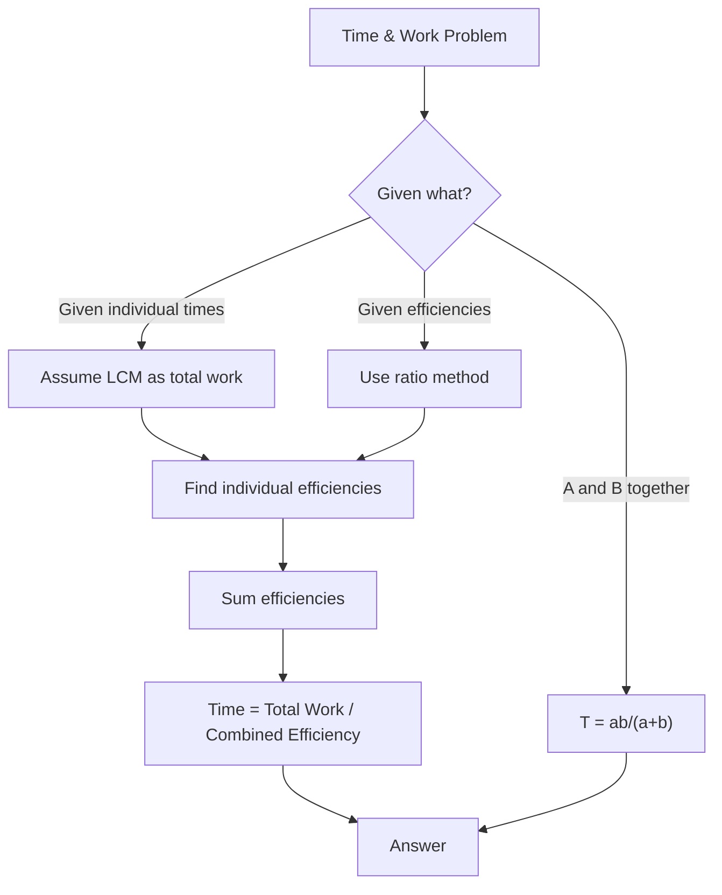
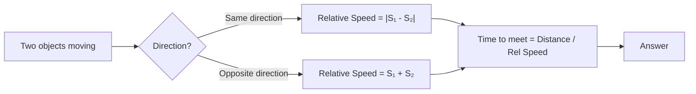
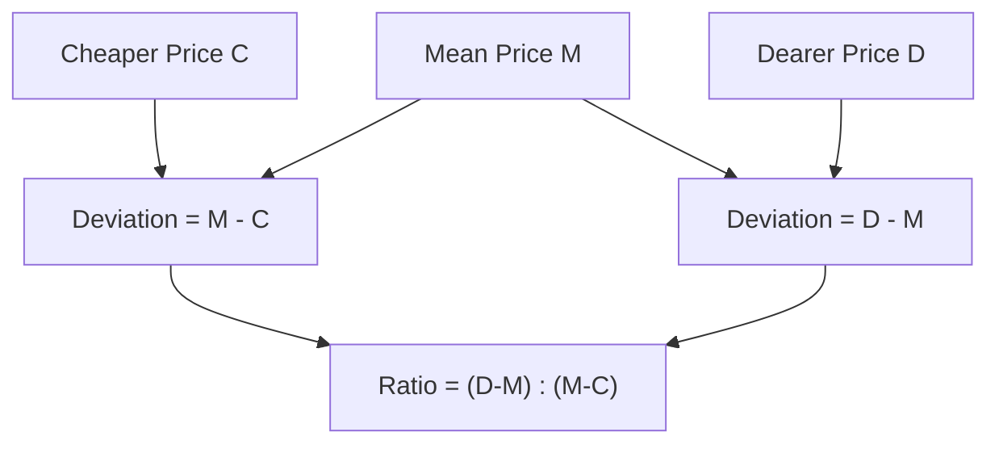
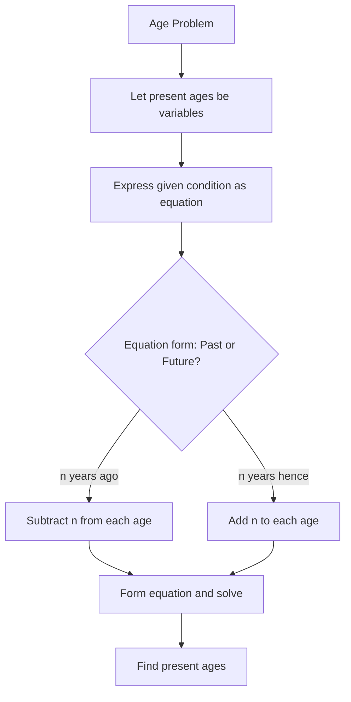
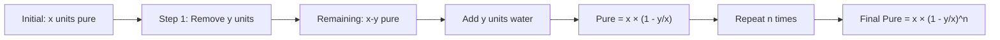
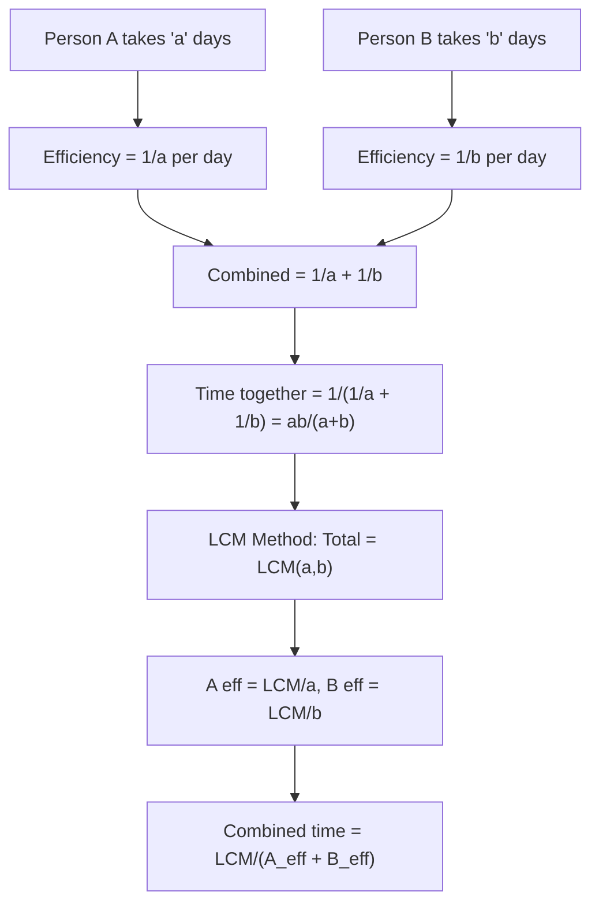
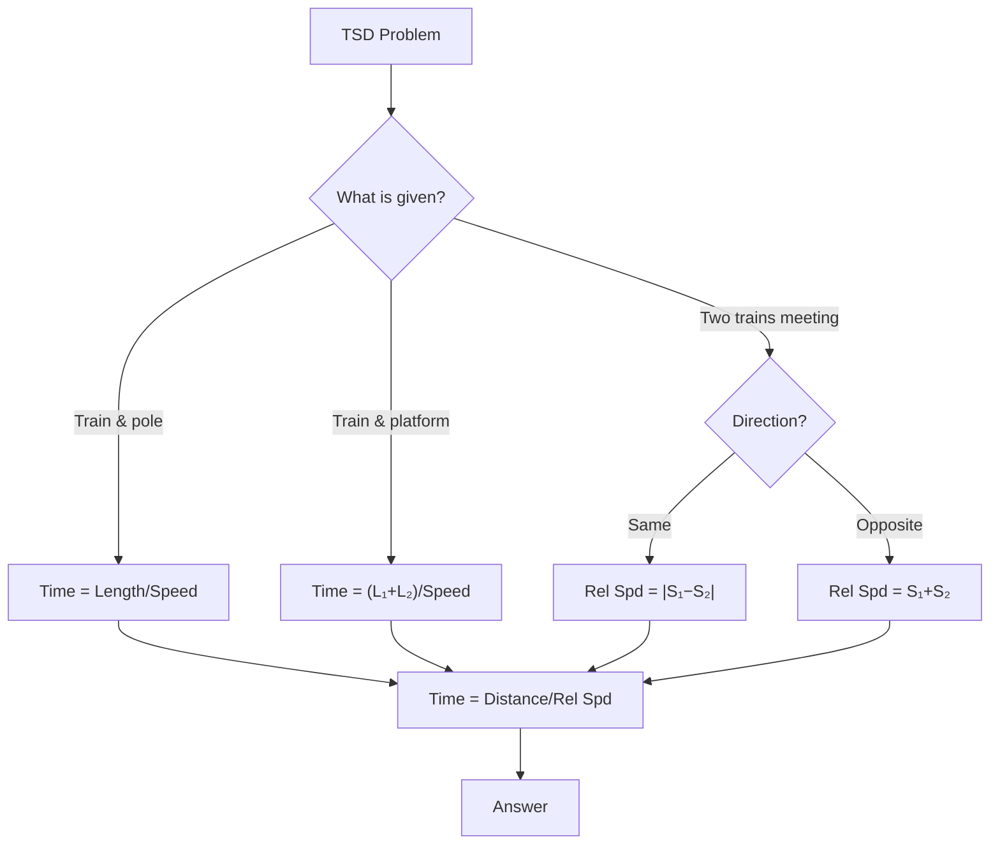
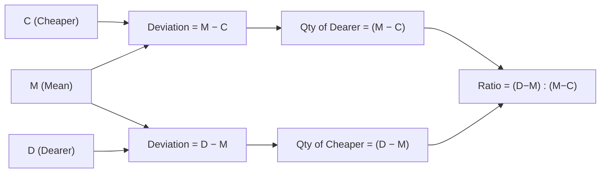
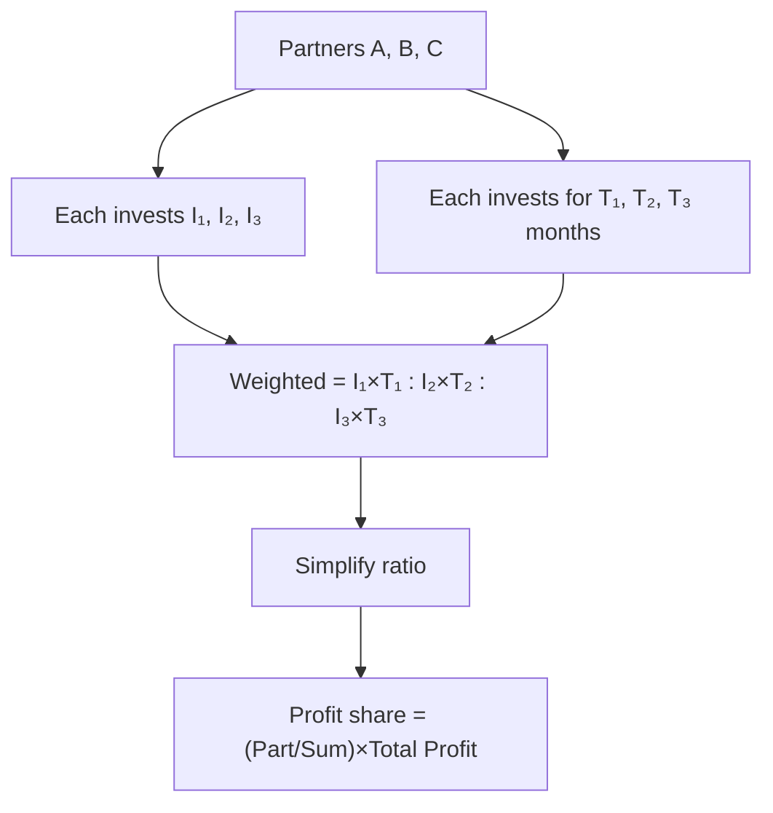
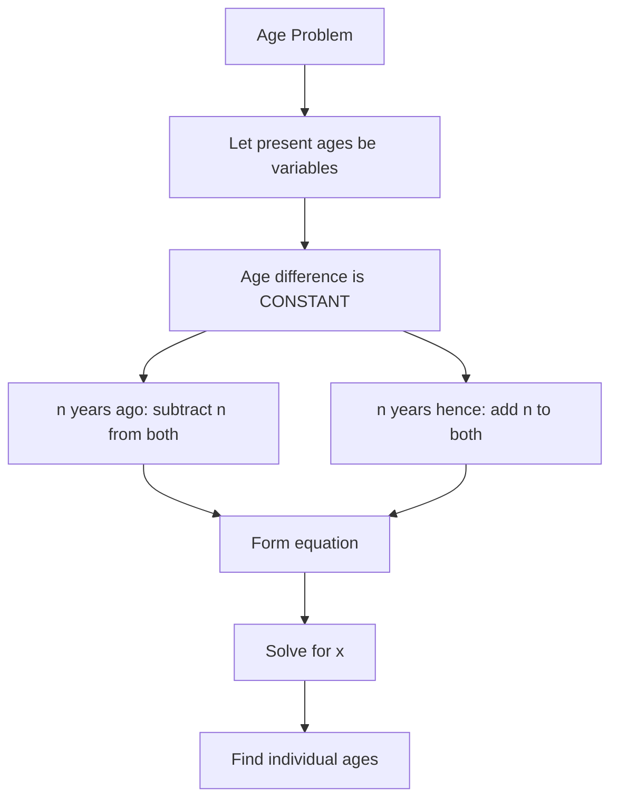

# Chapter 2: Advanced Arithmetic — Time & Work, Time-Speed-Distance, Mixtures & Alligations, Partnership, Ages

## Learning Objectives

By the end of this chapter, you will be able to:
- Solve time & work problems using efficiency and LCM approaches
- Calculate time, speed, and distance including relative speed and train problems
- Apply the alligation rule to solve mixture and concentration problems
- Distribute profit based on investment and time in partnership problems
- Solve age-related problems using linear equation techniques
- Use shortcut formulas to solve IBPS SO-level problems efficiently

<!-- Image Gallery -->
<section class="lesson-visuals" aria-label="Visual learning resources">
  <header><span>VISUAL LEARNING</span><h2>See it. Review it. Remember it.</h2></header>
  <a class="lesson-visual-card" href="../../assets/images/lessons/quantitative-aptitude/02-advanced-arithmetic/handwritten-notes.png" target="_blank" rel="noopener">
    
    <span><strong>Handwritten notes</strong>Condensed notes for deliberate review.</span>
  </a>
  <a class="lesson-visual-card" href="../../assets/images/lessons/quantitative-aptitude/02-advanced-arithmetic/sticky-notes.png" target="_blank" rel="noopener">
    
    <span><strong>Sticky-note revision</strong>Fast recall prompts for revision.</span>
  </a>
  <a class="lesson-visual-card" href="../../assets/images/lessons/quantitative-aptitude/02-advanced-arithmetic/visual-explanation.png" target="_blank" rel="noopener">
    
    <span><strong>Visual concept guide</strong>A connected explanation of the key ideas.</span>
  </a>
</section>
<!-- End Image Gallery -->

## Theory

### 1. Time & Work

**Basic Formula:**

If a person can do a piece of work in `n` days, then the person's 1 day's work = `1/n`

**Combined Work:**

If A can do work in `a` days and B can do it in `b` days:
- Work done by A and B together in 1 day = `1/a + 1/b`
- Time taken by A and B together = `1 / (1/a + 1/b) = ab / (a + b)`

**Work & Wages:**

Wages are distributed in the ratio of work done or in the ratio of efficiencies, provided the number of days worked is the same.

**Efficiency:**

Efficiency is inversely proportional to time taken.
- If A is twice as efficient as B, A takes half the time B takes.

**Formula using LCM Method:**

```
Total Work = LCM of individual times
Individual Efficiency = Total Work / Individual Time
Combined Efficiency = Sum of individual efficiencies
Time = Total Work / Combined Efficiency
```

**Pipe & Cistern (Extension):**

- Inlet pipe fills a tank; Outlet pipe empties a tank
- If an inlet pipe fills in `m` hours, its work per hour = `1/m`
- If an outlet pipe empties in `n` hours, its work per hour = `-1/n`
- Combined work per hour = `1/m - 1/n` (if fill) or `1/m + 1/n` (if both outlets)

### 2. Time, Speed & Distance

**Basic Formula:**

```
Speed = Distance / Time
Distance = Speed × Time
Time = Distance / Speed
```

**Unit Conversions:**
- km/h to m/s: multiply by `5/18`
- m/s to km/h: multiply by `18/5`

**Average Speed:**

For a journey with two equal distances:
```
Average Speed = 2ab / (a + b)
```

For a journey with two equal time intervals:
```
Average Speed = (a + b) / 2
```

**Relative Speed:**

- When two objects move in **same direction**: Relative Speed = |S₁ - S₂|
- When two objects move in **opposite direction**: Relative Speed = S₁ + S₂

**Train Problems:**

- Time to cross a pole/standing man = Length of Train / Speed
- Time to cross a platform = (Length of Train + Length of Platform) / Speed
- Time to cross another train = (Sum of Lengths) / (Relative Speed)

**Boats & Streams:**

- Speed of boat in still water = `b`
- Speed of stream = `s`
- Downstream speed = `b + s`
- Upstream speed = `b - s`
- Speed of boat = `(Downstream + Upstream) / 2`
- Speed of stream = `(Downstream - Upstream) / 2`

### 3. Mixtures & Alligations

**Alligation Rule:**

When two ingredients at different prices are mixed, the ratio of their quantities is:

```
Quantity of Cheaper / Quantity of Dearer = (Price of Dearer - Mean Price) / (Mean Price - Price of Cheaper)
```

In terms of deviations:

```
Required Ratio = (Mean - Cheaper) / (Dearer - Mean)
```

**Mean Price formula:**

```
Mean Price = (C₁Q₁ + C₂Q₂) / (Q₁ + Q₂)
```

**Replacement Formula:**

If a container contains `x` units of pure substance, and `y` units are replaced with water `n` times:

```
Quantity of Pure after n replacements = x × (1 - y/x)^n
```

**Important Rule for Mixtures:**

When mixing two liquids A and B, if we mix `a%` and `b%` concentrations to get `c%` concentration:

```
Ratio of A to B = (c - b) / (a - c)
```

### 4. Partnership

**Simple Partnership:**

When investments are made for the same time period:
Profit is shared in the ratio of investments.

**Compound Partnership:**

When investments are made for different time periods:
Profit is shared in the ratio of `(Investment × Time)`.

**Working Partner vs Sleeping Partner:**

A working partner may receive a salary/commission before the remaining profit is distributed.

**Formula:**

If A invests `₹x` for `m` months and B invests `₹y` for `n` months:

```
A's Profit : B's Profit = x × m : y × n
```

### 5. Problems on Ages

**Basic Approach:**

Age problems are best solved using linear equations with a single variable.

**Key Pointers:**
- Represent present ages as variables
- Use "n years ago" or "n years hence" to form equations
- Ratios of ages change over time, but the difference between ages remains constant

**Important Fact:**

The difference between any two persons' ages is always constant over time. This is the most useful fact for solving age problems quickly.

## Mermaid Diagram: Time & Work Problem-Solving Flow



## Mermaid Diagram: Relative Speed Scenarios



## Mermaid Diagram: Alligation Rule Visualisation



## Examples

### Example 1: Time & Work

**Question:** A can do a piece of work in 12 days. B can do the same work in 18 days. A and B work together for 4 days, then A leaves. How many more days will B take to finish the remaining work?

**Solution:**

A's 1 day work = 1/12
B's 1 day work = 1/18
(A + B)'s 1 day work = 1/12 + 1/18 = (3 + 2)/36 = 5/36

Work done in 4 days = 4 × 5/36 = 20/36 = 5/9
Remaining work = 1 - 5/9 = 4/9

Time taken by B to complete remaining work = (4/9) / (1/18)
= (4/9) × 18
= 8 days

**LCM Method:**
Total Work = LCM(12, 18) = 36 units
A's efficiency = 36/12 = 3 units/day
B's efficiency = 36/18 = 2 units/day
Combined efficiency = 5 units/day
Work done in 4 days = 5 × 4 = 20 units
Remaining = 36 - 20 = 16 units
Time for B = 16/2 = 8 days

### Example 2: Time-Speed-Distance

**Question:** A train 250 metres long passes a pole in 20 seconds. Find the speed of the train in km/h.

**Solution:**

Speed = Distance / Time = 250 / 20 = 12.5 m/s
Convert to km/h: 12.5 × 18/5 = 12.5 × 3.6 = 45 km/h

### Example 3: Relative Speed (Train crossing)

**Question:** Two trains of lengths 200 m and 300 m are running on parallel tracks at 60 km/h and 40 km/h in opposite directions. How long will they take to cross each other?

**Solution:**

Relative speed = 60 + 40 = 100 km/h
Convert to m/s: 100 × 5/18 = 500/18 = 250/9 m/s
Total length = 200 + 300 = 500 m
Time = 500 / (250/9) = 500 × 9/250 = 18 seconds

### Example 4: Mixture & Alligation

**Question:** In what ratio should rice costing ₹40/kg and ₹55/kg be mixed to get a mixture worth ₹48/kg?

**Solution:**

Using alligation rule:

| Type | Price | Deviation from Mean |
|------|-------|---------------------|
| Cheaper | 40 | 48 - 40 = 8 |
| Mean | 48 | |
| Dearer | 55 | 55 - 48 = 7 |

Ratio = Dearer Deviation : Cheaper Deviation = 7 : 8

So, they should be mixed in the ratio 7:8 (cheaper:dearer) or 8:7 (dearer:cheaper as per formula).

### Example 5: Partnership

**Question:** A starts a business with ₹60,000. After 4 months, B joins with ₹80,000. After 2 more months, C joins with ₹1,00,000. At the end of 2 years, the total profit is ₹1,50,000. Find each person's share.

**Solution:**

Time periods (in months):
A: 24 months
B: 20 months (joined after 4 months)
C: 18 months (joined after 6 months)

Ratio of investments × time:
A : B : C = (60000 × 24) : (80000 × 20) : (100000 × 18)
= 1440000 : 1600000 : 1800000
= 144 : 160 : 180
= 36 : 40 : 45

Sum of ratios = 36 + 40 + 45 = 121

A's share = (36/121) × 150000 = ₹44,628
B's share = (40/121) × 150000 = ₹49,587
C's share = (45/121) × 150000 = ₹55,785

### Example 6: Problem on Ages

**Question:** The age of a father is three times the age of his son. 5 years ago, the father's age was 4 times the son's age. Find their present ages.

**Solution:**

Let son's present age = x
Father's present age = 3x

5 years ago:
Son's age = x - 5
Father's age = 3x - 5

Given: 3x - 5 = 4(x - 5)
3x - 5 = 4x - 20
3x - 4x = -20 + 5
-x = -15
x = 15

Son's present age = 15 years
Father's present age = 45 years

### Example 7: Pipe & Cistern

**Question:** Pipe A can fill a tank in 6 hours, Pipe B can fill it in 8 hours, and Pipe C can empty it in 12 hours. If all pipes are opened together, how long will it take to fill the tank?

**Solution:**

A's work in 1 hour = 1/6
B's work in 1 hour = 1/8
C's work in 1 hour = -1/12

Combined work in 1 hour = 1/6 + 1/8 - 1/12
= (4 + 3 - 2)/24
= 5/24

Time taken = 24/5 = 4.8 hours = 4 hours 48 minutes

### Example 8: Average Speed (Equal Distances)

**Question:** A man travels from city A to city B at 40 km/h and returns at 60 km/h. Find his average speed.

**Solution:**

Average Speed = 2ab / (a + b)
= (2 × 40 × 60) / (40 + 60)
= 4800 / 100
= 48 km/h

### Example 9: Boats & Streams

**Question:** A boat can travel 15 km upstream in 3 hours and 24 km downstream in 2 hours. Find the speed of the boat in still water and the speed of the stream.

**Solution:**

Upstream speed = 15/3 = 5 km/h
Downstream speed = 24/2 = 12 km/h

Speed of boat in still water = (12 + 5)/2 = 17/2 = 8.5 km/h
Speed of stream = (12 - 5)/2 = 7/2 = 3.5 km/h

### Example 10: Replacement in Mixtures

**Question:** From a container containing 40 litres of pure milk, 8 litres are drawn and replaced with water. This process is repeated 3 times. Find the quantity of milk remaining.

**Solution:**

Quantity remaining = x × (1 - y/x)^n
= 40 × (1 - 8/40)^3
= 40 × (1 - 1/5)^3
= 40 × (4/5)^3
= 40 × 64/125
= 2560/125
= 20.48 litres

## Shortcut Methods

### Shortcut 1: LCM Method for Time & Work

Always use LCM of individual times as the total work. This avoids fractions and speeds up calculations.

### Shortcut 2: Time & Work Combined Formula

If A takes `a` days and B takes `b` days, together they take `ab/(a+b)` days.
For three persons: `abc/(ab+bc+ca)`

### Shortcut 3: Distance Problems

For two trains/persons starting at the same time:
- Time to meet = Distance / Relative Speed
- Distance covered by each = Speed × Time

### Shortcut 4: Alligation Shortcut

For mixing two items to get a mean value:
```
Required Ratio = (Dearer Value - Mean Value) : (Mean Value - Cheaper Value)
```

Always subtract the smaller from the larger.

### Shortcut 5: Ages Constant Difference

The difference between ages never changes. This is the single most powerful fact for age problems.

### Shortcut 6: Partnership Quick Ratio

For compound partnership, simply multiply investment by time and simplify the ratio.

### Shortcut 7: Replacement Formula

Use the formula directly. For IBPS SO, this is a direct formula application question.

### Shortcut 8: Average Speed

For equal distances: `2ab/(a+b)` — this is faster than the full calculation.

### Shortcut 9: Boats & Streams

Speed of boat = (Downstream + Upstream)/2
Speed of stream = (Downstream - Upstream)/2

### Shortcut 10: Pipe Efficiency

For pipes filling a tank in different times, use LCM method with negative efficiency for emptying pipes.

## Mermaid Diagram: Age Problem-Solving Strategy



## Mermaid Diagram: Mixture Replacement Process



## TypeScript Implementation: Advanced Arithmetic Calculator

```typescript
// advanced-arithmetic.ts — Calculator for Chapter 2

class TimeWorkCalculator {
  static lcmMethod(times: number[]): {
    totalWork: number;
    efficiencies: number[];
    combinedEfficiency: number;
  } {
    const gcd = (a: number, b: number): number => (b === 0 ? a : gcd(b, a % b));
    const lcm = (a: number, b: number): number => (a * b) / gcd(a, b);
    const totalWork = times.reduce((acc, t) => lcm(acc, t), 1);
    const efficiencies = times.map((t) => totalWork / t);
    const combinedEfficiency = efficiencies.reduce((a, b) => a + b, 0);
    return { totalWork, efficiencies, combinedEfficiency };
  }

  static combinedTime(a: number, b: number): number {
    return (a * b) / (a + b);
  }

  static timeWithThree(a: number, b: number, c: number): number {
    return (a * b * c) / (a * b + b * c + c * a);
  }

  static workDone(persons: { time: number; days: number }[]): number {
    // Each person has a time to complete full work and days worked
    let totalFraction = 0;
    for (const p of persons) {
      totalFraction += p.days / p.time;
    }
    return totalFraction;
  }

  static wagesShare(
    wages: number,
    efficiencies: number[],
    days: number[]
  ): number[] {
    const effective = efficiencies.map((e, i) => e * days[i]);
    const total = effective.reduce((a, b) => a + b, 0);
    return effective.map((e) => (e / total) * wages);
  }
}

class TSDCalculator {
  static speed(distance: number, time: number): number {
    return distance / time;
  }

  static distance(speed: number, time: number): number {
    return speed * time;
  }

  static time(distance: number, speed: number): number {
    return distance / speed;
  }

  static kmhToMs(kmh: number): number {
    return kmh * (5 / 18);
  }

  static msToKmh(ms: number): number {
    return ms * (18 / 5);
  }

  static avgSpeedEqualDistances(a: number, b: number): number {
    return (2 * a * b) / (a + b);
  }

  static trainCrossPole(length: number, speed: number): number {
    return length / speed;
  }

  static trainCrossPlatform(
    trainLength: number,
    platformLength: number,
    speed: number
  ): number {
    return (trainLength + platformLength) / speed;
  }

  static relativeSpeedSame(s1: number, s2: number): number {
    return Math.abs(s1 - s2);
  }

  static relativeSpeedOpposite(s1: number, s2: number): number {
    return s1 + s2;
  }

  static timeToMeet(
    distance: number,
    s1: number,
    s2: number,
    sameDirection: boolean
  ): number {
    const relSpeed = sameDirection
      ? this.relativeSpeedSame(s1, s2)
      : this.relativeSpeedOpposite(s1, s2);
    return distance / relSpeed;
  }

  static boatStillWater(downstream: number, upstream: number): number {
    return (downstream + upstream) / 2;
  }

  static streamSpeed(downstream: number, upstream: number): number {
    return (downstream - upstream) / 2;
  }
}

class AlligationCalculator {
  static mixRatio(
    cheaperPrice: number,
    dearerPrice: number,
    meanPrice: number
  ): [number, number] {
    const cheaperQty = dearerPrice - meanPrice;
    const dearerQty = meanPrice - cheaperPrice;
    return [cheaperQty, dearerQty];
  }

  static replacementFormula(
    initial: number,
    replacePerStep: number,
    steps: number
  ): number {
    return initial * Math.pow(1 - replacePerStep / initial, steps);
  }

  static concentrationAfterMixing(
    concA: number,
    qtyA: number,
    concB: number,
    qtyB: number
  ): number {
    return (concA * qtyA + concB * qtyB) / (qtyA + qtyB);
  }
}

class PartnershipCalculator {
  static profitShare(
    investments: { amount: number; months: number }[],
    totalProfit: number
  ): number[] {
    const weighted = investments.map((i) => i.amount * i.months);
    const totalWeight = weighted.reduce((a, b) => a + b, 0);
    return weighted.map((w) => (w / totalWeight) * totalProfit);
  }

  static workingPartnerShare(
    investments: { amount: number; months: number }[],
    totalProfit: number,
    workingPartnerIndex: number,
    salaryPercent: number
  ): number[] {
    const salary = (salaryPercent / 100) * totalProfit;
    const remainingProfit = totalProfit - salary;
    const shares = this.profitShare(investments, remainingProfit);
    shares[workingPartnerIndex] += salary;
    return shares;
  }
}

class AgeCalculator {
  static fromRatio(
    currentRatio: [number, number],
    futureRatio: [number, number],
    yearsAhead: number
  ): [number, number] {
    // Let current ages be ax, bx. After yearsAhead: (ax+y)/(bx+y) = c/d
    const [a, b] = currentRatio;
    const [c, d] = futureRatio;
    const x = (yearsAhead * (d - c)) / (a * d - b * c);
    return [a * x, b * x];
  }

  static ageDifference(present: number, past: number): number {
    return Math.abs(present - past);
  }
}

// Example usage
const tw = TimeWorkCalculator.lcmMethod([12, 18]);
console.log(`Total work: ${tw.totalWork} units`);
console.log(`Combined efficiency: ${tw.combinedEfficiency} units/day`);

const tsd = new TSDCalculator();
console.log(`45 km/h in m/s: ${tsd.kmhToMs(45).toFixed(2)}`);

const alligation = AlligationCalculator.mixRatio(40, 55, 48);
console.log(`Mix ratio: ${alligation[0]}:${alligation[1]}`);

const replaced = AlligationCalculator.replacementFormula(40, 8, 3);
console.log(`After 3 replacements: ${replaced.toFixed(2)}L milk`);
```

## 📝 Solved Examples (20 MCQs)

### Set 1: Time & Work (Questions 1–5)

**Question 1:** A can complete a work in 20 days and B in 30 days. They work together for 5 days, then A leaves. How many more days will B take to finish the remaining work?

<details>
<summary>Answer & Solution</summary>
**Formula:** 1 day work = 1/time; Remaining work fraction / 1 day work of B = days

A's 1 day = 1/20, B's 1 day = 1/30
(A+B)'s 1 day = 1/20 + 1/30 = 5/60 = 1/12
Work in 5 days = 5/12
Remaining = 1 − 5/12 = 7/12
Time for B = (7/12) ÷ (1/30) = (7/12) × 30 = 210/12 = 17.5 days

**Answer:** 17.5 days
</details>

**Question 2:** If 8 men can do a work in 15 days, in how many days will 12 men do the same work?

<details>
<summary>Answer & Solution</summary>
**Formula:** M₁ × D₁ = M₂ × D₂ (total work = men × days)

Total work = 8 × 15 = 120 man-days
Days for 12 men = 120 / 12 = 10 days

**Answer:** 10 days
</details>

**Question 3:** A and B can do a work in 12 days. B and C can do it in 15 days. C and A can do it in 20 days. Find the time taken by all three working together.

<details>
<summary>Answer & Solution</summary>
**Formula:** 2(A+B+C)'s 1 day = (A+B)+(B+C)+(C+A)'s 1 day

(A+B)'s 1 day = 1/12
(B+C)'s 1 day = 1/15
(C+A)'s 1 day = 1/20
2(A+B+C)'s 1 day = 1/12 + 1/15 + 1/20 = (5+4+3)/60 = 12/60 = 1/5
(A+B+C)'s 1 day = 1/10
All three together take 10 days.

**Answer:** 10 days
</details>

**Question 4:** A pipe can fill a tank in 15 hours. Another pipe can empty it in 20 hours. If both are opened simultaneously, how long will it take to fill the tank?

<details>
<summary>Answer & Solution</summary>
**Formula:** Combined = 1/fill − 1/empty

Fill rate = 1/15 per hour
Empty rate = 1/20 per hour
Net fill rate = 1/15 − 1/20 = (4−3)/60 = 1/60
Time = 60 hours

**Answer:** 60 hours
</details>

**Question 5:** 4 men and 6 women can complete a work in 8 days. 3 men and 7 women can complete it in 10 days. Find the time taken by 10 women alone.

<details>
<summary>Answer & Solution</summary>
**Formula:** Form equations from given conditions, solve for man and woman efficiencies.

Let 1 man's 1 day work = m, 1 woman's 1 day work = w
4m + 6w = 1/8 ...(i)
3m + 7w = 1/10 ...(ii)
Multiply (i) by 3, (ii) by 4:
12m + 18w = 3/8
12m + 28w = 4/10 = 2/5
Subtract: 10w = 2/5 − 3/8 = (16−15)/40 = 1/40
w = 1/400
10 women's 1 day = 10/400 = 1/40
Time = 40 days

**Answer:** 40 days
</details>

### Set 2: Time-Speed-Distance (Questions 6–10)

**Question 6:** A train 300 metres long passes a platform 500 metres long in 40 seconds. Find the speed of the train in km/h.

<details>
<summary>Answer & Solution</summary>
**Formula:** Speed = (Train length + Platform length) / Time; Convert m/s to km/h × 18/5

Total distance = 300 + 500 = 800 m
Speed = 800/40 = 20 m/s
In km/h = 20 × 18/5 = 72 km/h

**Answer:** 72 km/h
</details>

**Question 7:** Two trains of lengths 250 m and 350 m run on parallel tracks at 72 km/h and 54 km/h in opposite directions. How long will they take to cross each other?

<details>
<summary>Answer & Solution</summary>
**Formula:** Time = Sum of lengths / Relative speed (opposite = sum of speeds)

Speed₁ = 72 × 5/18 = 20 m/s
Speed₂ = 54 × 5/18 = 15 m/s
Relative speed = 20 + 15 = 35 m/s
Total length = 250 + 350 = 600 m
Time = 600/35 = 17.14 seconds

**Answer:** 17.14 seconds
</details>

**Question 8:** A man travels from A to B at 30 km/h and returns at 50 km/h. Find the average speed.

<details>
<summary>Answer & Solution</summary>
**Formula:** Average Speed = 2ab/(a+b) for equal distances

Avg speed = (2 × 30 × 50)/(30 + 50) = 3000/80 = 37.5 km/h

**Answer:** 37.5 km/h
</details>

**Question 9:** A boat goes 30 km upstream in 5 hours and 60 km downstream in 4 hours. Find the speed of the boat in still water.

<details>
<summary>Answer & Solution</summary>
**Formula:** Still water speed = (Downstream + Upstream)/2

Upstream speed = 30/5 = 6 km/h
Downstream speed = 60/4 = 15 km/h
Speed in still water = (15 + 6)/2 = 10.5 km/h

**Answer:** 10.5 km/h
</details>

**Question 10:** A thief is spotted by a policeman 200 metres away. The thief runs at 10 km/h and the policeman at 12 km/h. How long will the policeman take to catch the thief?

<details>
<summary>Answer & Solution</summary>
**Formula:** Time = Distance / Relative speed (same direction)

Relative speed = 12 − 10 = 2 km/h = 2 × 5/18 = 10/18 = 5/9 m/s
Time = 200 / (5/9) = 200 × 9/5 = 360 seconds = 6 minutes

**Answer:** 6 minutes
</details>

### Set 3: Mixtures & Alligations (Questions 11–14)

**Question 11:** In what ratio should rice costing ₹30/kg and ₹42/kg be mixed to get a mixture worth ₹36/kg?

<details>
<summary>Answer & Solution</summary>
**Formula:** Ratio = (Dearer − Mean) : (Mean − Cheaper)

Cheaper = 30, Dearer = 42, Mean = 36
Ratio = (42−36) : (36−30) = 6:6 = 1:1

**Answer:** 1:1
</details>

**Question 12:** A vessel contains 60 litres of pure milk. 12 litres are drawn and replaced with water. This is done twice. Find the quantity of milk remaining.

<details>
<summary>Answer & Solution</summary>
**Formula:** Remaining = x(1 − y/x)^n

x = 60, y = 12, n = 2
Remaining = 60 × (1 − 12/60)² = 60 × (4/5)² = 60 × 16/25 = 38.4 litres

**Answer:** 38.4 litres
</details>

**Question 13:** A mixture of 40 litres contains milk and water in the ratio 3:1. How much water should be added to make the ratio 2:1?

<details>
<summary>Answer & Solution</summary>
**Formula:** Quantity of milk remains unchanged. New total = milk/(new milk ratio)

Milk = (3/4) × 40 = 30 litres
Water = 10 litres
After adding water: milk:water = 2:1
30/(10 + x) = 2/1
30 = 20 + 2x
x = 5 litres

**Answer:** 5 litres
</details>

**Question 14:** In what ratio must water (free) be mixed with milk costing ₹50 per litre to obtain a mixture worth ₹40 per litre?

<details>
<summary>Answer & Solution</summary>
**Formula:** Ratio = (Dearer − Mean) : (Mean − Cheaper)

Cost of water = 0, cost of milk = 50, mean = 40
Ratio = (50−40) : (40−0) = 10:40 = 1:4
Water:Milk = 1:4

**Answer:** 1:4
</details>

### Set 4: Partnership (Questions 15–17)

**Question 15:** A and B invest ₹40,000 and ₹60,000 in a business. At the end of the year, the profit is ₹75,000. Find each partner's share.

<details>
<summary>Answer & Solution</summary>
**Formula:** Profit ratio = Investment ratio (for same time period)

Ratio = 40000:60000 = 2:3
Sum = 5
A's share = (2/5) × 75000 = ₹30,000
B's share = (3/5) × 75000 = ₹45,000

**Answer:** A = ₹30,000, B = ₹45,000
</details>

**Question 16:** A starts a business with ₹50,000. After 6 months, B joins with ₹80,000. After 1 year, the profit is ₹84,000. Find B's share.

<details>
<summary>Answer & Solution</summary>
**Formula:** Profit ratio = I₁T₁ : I₂T₂

A's investment period = 12 months
B's investment period = 6 months
Ratio = (50000×12) : (80000×6) = 600000:480000 = 5:4
Sum = 9
B's share = (4/9) × 84000 = ₹37,333.33

**Answer:** ₹37,333.33
</details>

**Question 17:** A and B invest in a business in ratio 3:2. A is a working partner and gets 15% of profit as salary. If total profit is ₹55,000, find B's share.

<details>
<summary>Answer & Solution</summary>
**Formula:** Working partner gets salary first, remaining profit shared in investment ratio.

A's salary = 15% of 55000 = ₹8,250
Remaining profit = 55,000 − 8,250 = ₹46,750
Investment ratio = 3:2, sum = 5
B's share = (2/5) × 46750 = ₹18,700

**Answer:** ₹18,700
</details>

### Set 5: Ages (Questions 18–20)

**Question 18:** The ratio of A's age to B's age is 3:4. After 8 years, the ratio becomes 5:6. Find the present age of A.

<details>
<summary>Answer & Solution</summary>
**Formula:** Form equation from given condition: (3x+8)/(4x+8) = 5/6

Let A = 3x, B = 4x
(3x+8)/(4x+8) = 5/6
6(3x+8) = 5(4x+8)
18x + 48 = 20x + 40
2x = 8, x = 4
A = 12 years

**Answer:** 12 years
</details>

**Question 19:** A father is three times as old as his son. 5 years ago, the father's age was 4 times the son's age. Find the son's present age.

<details>
<summary>Answer & Solution</summary>
**Formula:** Constant difference equation; let son = x, father = 3x

Son = x, Father = 3x
5 years ago: 3x − 5 = 4(x − 5)
3x − 5 = 4x − 20
x = 15
Son = 15 years

**Answer:** 15 years
</details>

**Question 20:** The sum of the ages of a mother and daughter is 50 years. 5 years ago, the mother was 3 times as old as the daughter. Find the daughter's present age.

<details>
<summary>Answer & Solution</summary>
**Formula:** Two equations: M + D = 50, (M−5) = 3(D−5)

M + D = 50 ...(i)
M − 5 = 3(D − 5) → M − 5 = 3D − 15 → M = 3D − 10 ...(ii)
Substitute (ii) in (i): 3D − 10 + D = 50 → 4D = 60 → D = 15

**Answer:** 15 years
</details>

## 📖 Exercise Bank (30 Questions)

**1.** A can do a work in 24 days. B is 20% more efficient than A. How many days will B take alone?

**2.** 6 men can complete a work in 12 days. How many additional men are needed to complete the work in 8 days?

**3.** A and B can do a work in 18 days. B and C can do it in 24 days. A and C can do it in 36 days. In how many days will A, B, C together complete the work?

**4.** A tank can be filled by pipe A in 5 hours and by pipe B in 10 hours. An outlet pipe C can empty it in 15 hours. If all three are opened together, find the time to fill the tank.

**5.** 2 men and 3 women can complete a work in 10 days. 3 men and 2 women can complete it in 8 days. Find the time taken by 1 man and 1 woman together.

**6.** A train 200 m long crosses a bridge 400 m long in 30 seconds. Find the speed in km/h.

**7.** Two trains of lengths 180 m and 240 m run at 60 km/h and 48 km/h in the same direction. How long will they take to cross each other?

**8.** A man rows 20 km downstream in 2 hours and 14 km upstream in 2 hours. Find the speed of the stream.

**9.** A car covers a distance of 600 km at a uniform speed. If the speed had been 10 km/h more, it would have taken 2 hours less. Find the original speed.

**10.** A person walks at 5 km/h from A to B and reaches at 2 PM. If he walks at 7 km/h, he reaches at 12 noon. Find the distance AB.

**11.** In what ratio should tea costing ₹180/kg and ₹220/kg be mixed so that the mixture sold at ₹210/kg yields no profit no loss?

**12.** A can contains 30 litres of pure milk. 10 litres are drawn and replaced with water. This is repeated once. Find the quantity of milk remaining.

**13.** A mixture of 60 litres contains alcohol and water in ratio 2:1. How much water must be added to make the ratio 1:1?

**14.** Gold is 18 times as heavy as water and copper is 9 times as heavy as water. In what ratio should they be mixed to get an alloy 15 times as heavy as water?

**15.** A, B, C invest ₹20,000, ₹30,000, ₹40,000 in a partnership. C leaves after 8 months. At the end of 2 years, the profit is ₹1,80,000. Find each share.

**16.** A and B start a business with ₹10,000 and ₹15,000. After 4 months, A withdraws ₹4,000. After another 4 months, B invests ₹5,000 more. Find the profit share ratio at the end of 2 years.

**17.** A working partner gets 10% of profit as salary and the rest is shared in the ratio of investments. If A and B invest ₹30,000 and ₹50,000, and total profit is ₹80,000, find A's total share.

**18.** The ratio of ages of A and B is 4:7. After 5 years, the ratio will be 3:5. Find their present ages.

**19.** The sum of ages of a father and son is 45 years. 5 years hence, the father's age will be 4 times the son's age. Find their present ages.

**20.** Rohan's age is 4 times his son's age. 8 years from now, Rohan will be 3 times his son's age. Find their present ages.

**21.** A can do a work in 15 days and B in 25 days. They work together for 5 days, then C joins them. If the work is finished in 2 more days, in how many days can C alone do the work?

**22.** Two pipes A and B can fill a tank in 20 and 30 minutes respectively. If both are opened together, but A is closed after 8 minutes, find the total time taken to fill the tank.

**23.** A train crosses a 400 m platform in 30 seconds and a 600 m bridge in 40 seconds. Find the length and speed of the train.

**24.** A man covers half the distance at 20 km/h and the other half at 30 km/h. Find the average speed.

**25.** A motorboat covers a distance downstream in 6 hours and upstream in 8 hours. Find the time taken by a raft to cover the same distance.

**26.** Alcohol and water are in a vessel in ratio 4:1. 15 litres of mixture is drawn and replaced with water. If the ratio becomes 3:2, find the initial quantity.

**27.** A, B, C started a business. A invested ₹20,000 for 6 months, B ₹30,000 for 8 months, C ₹40,000 for 10 months. Find their profit share ratio.

**28.** The average age of a family of 5 members is 25 years. If the youngest member is 5 years old, what was the average 5 years ago?

**29.** The age of A is 25 years more than B's age. 15 years hence, A's age will be twice B's age. Find their present ages.

**30.** A man can row at 8 km/h in still water. He takes 3 hours to row 15 km downstream. Find the time to row the same distance upstream.

**Answer Key:**

1. 20 days
2. 3 men
3. 16 days
4. 30/7 = 4.29 hours
5. 40/7 ≈ 5.71 days
6. 72 km/h
7. 126 seconds
8. 1.5 km/h
9. 50 km/h
10. 35 km
11. 1:2
12. 13.33 litres
13. 20 litres
14. 2:1
15. A=₹48,000, B=₹72,000, C=₹60,000
16. 14:23
17. ₹36,250
18. A=20, B=35
19. F=35, S=10
20. R=64, S=16
21. 200/7 ≈ 28.57 days
22. 18 minutes
23. L=200m, S=72 km/h
24. 24 km/h
25. 48 hours
26. 75 litres
27. 6:12:20 = 3:6:10
28. 25 years
29. A=35, B=10
30. 5 hours

## Mermaid Diagram: Work — Efficiency vs Time



## Mermaid Diagram: Time-Speed-Distance Decision Tree



## Mermaid Diagram: Alligation — Cross Method Visual



## Mermaid Diagram: Partnership — Time-Adjusted Shares



## Mermaid Diagram: Age Problem — Constant Difference Principle



## Summary

- **Time & Work** is best solved using the LCM method — convert to units of work per day
- **Time-Speed-Distance** requires careful attention to units (m/s vs km/h) and relative speed concepts
- **Mixtures & Alligations** follows a deviation-based approach; the alligation rule is the core tool
- **Partnership** problems involve profit sharing in the ratio of investment × time
- **Ages** are solved using the constant difference property — the age gap between two people never changes
- Boats & streams problems are a subset of TSD with upstream/downstream speed formulas
- Pipe & cistern problems are identical to time & work but with the concept of emptying (negative work)
- Replacement problems have a direct formula that can be applied in one step

## Practical Takeaways

| Topic | Key Formula | Common Mistake |
|-------|-------------|----------------|
| Time & Work | LCM method for total work | Not converting to 1 day's work |
| TSD | Speed = Distance/Time | Forgetting unit conversion (5/18) |
| Relative Speed | Same: |S₁-S₂|, Opposite: S₁+S₂ | Adding speeds when they should subtract |
| Alligation | Ratio = (D-M):(M-C) | Reversing the ratio |
| Partnership | Ratio = I₁T₁ : I₂T₂ | Using only investment, ignoring time |
| Ages | Difference is constant | Forgetting to add/subtract years correctly |
| Boats & Streams | b = (D+U)/2, s = (D-U)/2 | Confusing upstream and downstream |
| Replacement | x(1-y/x)^n | Not raising to power n |

## Chapter Quiz

### Question 1

A can do a work in 10 days and B can do the same work in 15 days. How many days will they take together?

<details>
<summary>Answer</summary>
Time = (10 × 15) / (10 + 15) = 150/25 = 6 days
</details>

### Question 2

A train 300 m long passes a platform 700 m long in 50 seconds. Find the speed of the train in km/h.

<details>
<summary>Answer</summary>
Total distance = 300 + 700 = 1000 m
Speed = 1000/50 = 20 m/s = 20 × 18/5 = 72 km/h
</details>

### Question 3

In what ratio must water be mixed with milk costing ₹60 per litre to obtain a mixture worth ₹50 per litre?

<details>
<summary>Answer</summary>
Using alligation:
Water cost = ₹0, Milk cost = ₹60
Mean = ₹50
Ratio = (60-50):(50-0) = 10:50 = 1:5
Water:Milk = 1:5
</details>

### Question 4

A and B invest ₹50,000 and ₹75,000 in a business. A is a working partner and gets 20% of the profit as salary. The remaining profit is shared in the ratio of their investments. If total profit is ₹60,000, find A's total share.

<details>
<summary>Answer</summary>
A's salary = 20% of 60000 = ₹12,000
Remaining profit = ₹48,000
Investment ratio = 50000:75000 = 2:3
A's share of remaining = (2/5) × 48000 = ₹19,200
A's total = 12000 + 19200 = ₹31,200
</details>

### Question 5

The ratio of the ages of A and B is 3:2. Six years hence, the ratio will be 4:3. Find the present age of B.

<details>
<summary>Answer</summary>
Let A = 3x, B = 2x.
Six years hence: (3x+6)/(2x+6) = 4/3
3(3x+6) = 4(2x+6)
9x+18 = 8x+24
x = 6
B's present age = 2×6 = 12 years
</details>

## Exercises

### Exercise 1 (Beginner)

A can do a work in 8 days, B can do it in 12 days. They work together for 3 days and then A leaves. How many more days will B take to finish the work?

### Exercise 2 (Beginner)

A train 180 m long crosses a pole in 12 seconds. Find the speed of the train in km/h.

### Exercise 3 (Beginner)

A man rows downstream 18 km in 2 hours and upstream 12 km in 3 hours. Find the speed of the stream.

### Exercise 4 (Intermediate)

A starts a business with ₹40,000. After 6 months, B joins with ₹60,000. At the end of 2 years, the profit is ₹1,32,000. Find the share of each.

### Exercise 5 (Intermediate)

The present age of a father is 3 times that of his son. After 10 years, the father's age will be twice the son's age. Find their present ages.

### Exercise 6 (Intermediate)

A tank can be filled by pipe A in 4 hours and by pipe B in 6 hours. An outlet pipe C empties the tank in 8 hours. If all three pipes are opened together, how long will it take to fill the tank?

### Exercise 7 (Advanced)

In what ratio should coffee costing ₹250/kg and ₹350/kg be mixed so that the mixture sold at ₹324/kg yields a profit of 20%?

### Exercise 8 (Advanced)

A man travels 60 km at 30 km/h and the next 60 km at 20 km/h. Find his average speed.

### Exercise 9 (IBPS SO Level)

From a vessel containing 75 litres of pure milk, 15 litres are drawn and replaced with water. This process is repeated twice. Find the quantity of milk remaining.

### Exercise 10 (IBPS SO Level)

A train passes two persons walking at 3 km/h and 5 km/h in the same direction in 10 seconds and 12 seconds respectively. Find the length and speed of the train.

---

**Answer Key (Exercises):**
1. 7.5 days
2. 54 km/h
3. 1.5 km/h
4. A = ₹60,000, B = ₹72,000
5. Son = 10 years, Father = 30 years
6. 24/7 = 3.43 hours ≈ 3 hours 26 minutes
7. 5:3
8. 24 km/h
9. 48 litres
10. Length = 50 m, Speed = 25 m/s = 90 km/h
