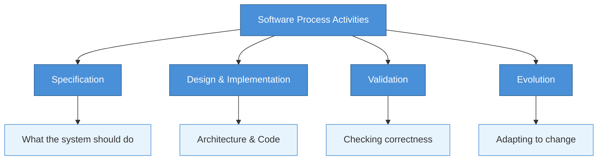
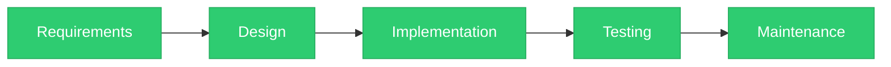
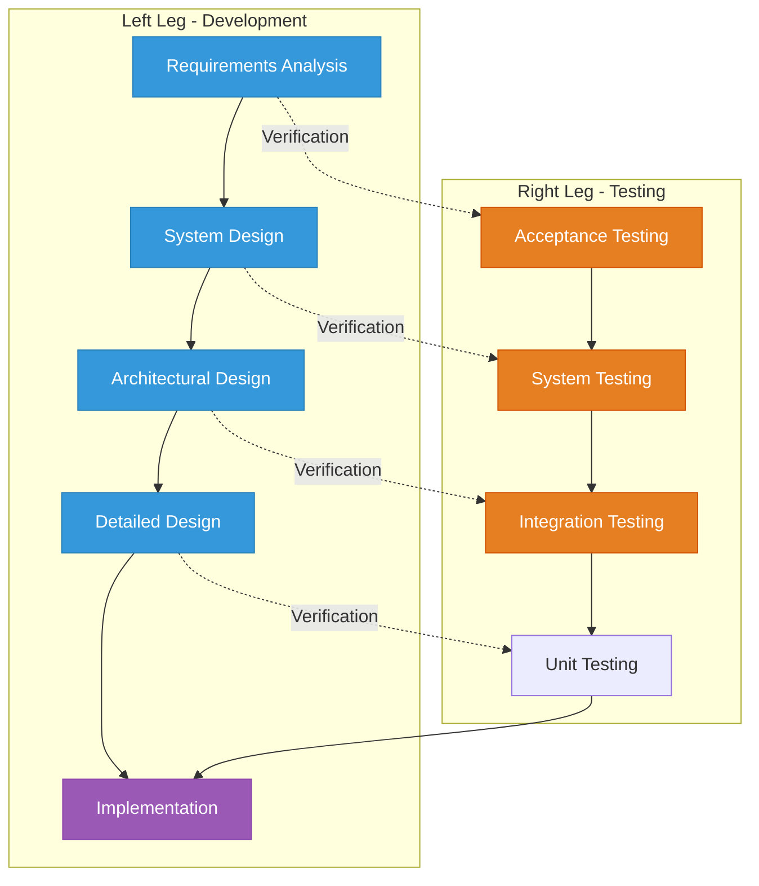
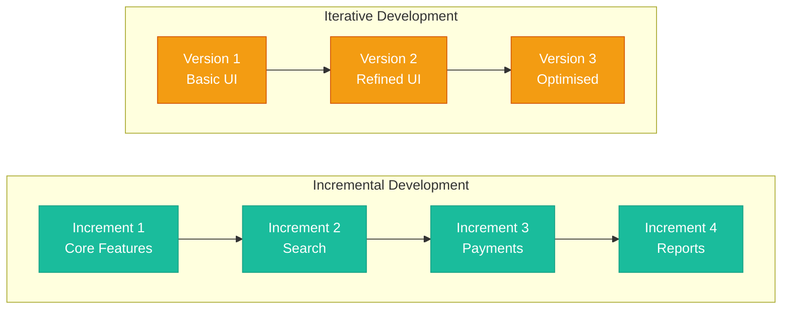
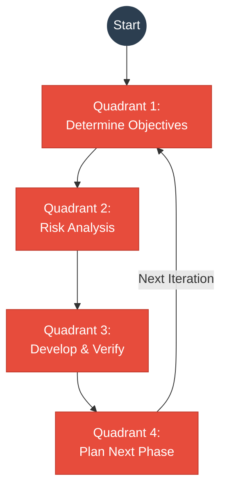
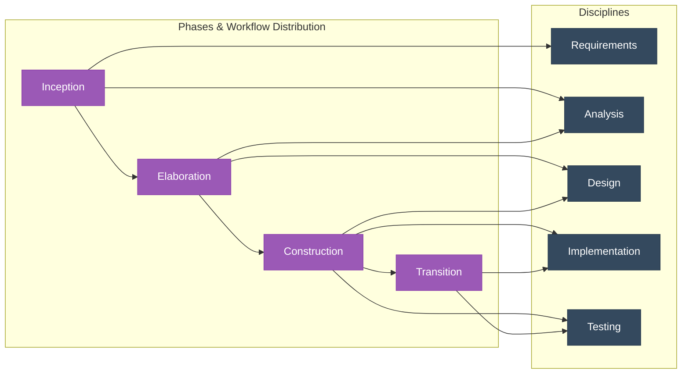
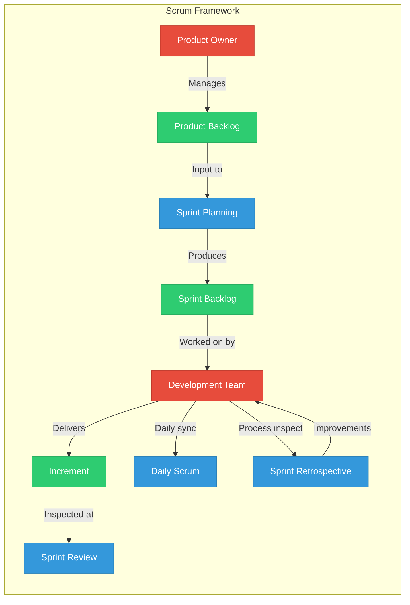
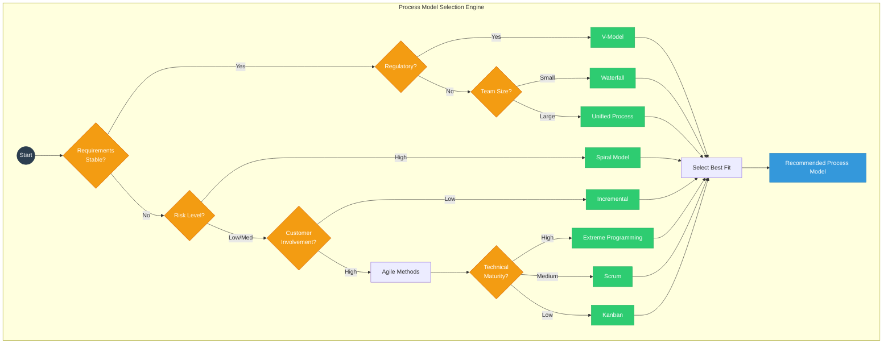

# Software Process Models

## Learning Objectives

> ✅ After completing this chapter, the student will be able to:
> - Differentiate between a software process and a process model
> - Describe the activities common to all software processes
> - Explain the Waterfall model and identify its limitations
> - Contrast the V-model with the Waterfall approach
> - Describe incremental and iterative development
> - Explain the risk-driven nature of the Spiral model
> - Describe the four phases of the Unified Process
> - Articulate the principles of the Agile Manifesto
> - Explain the practices of Extreme Programming
> - Describe the Scrum framework including roles, events, and artefacts
> - Compare and contrast plan-driven vs agile methodologies across multiple dimensions
> - Analyse risk in the context of process model selection
> - Select an appropriate process model for a given project context using weighted criteria
> - Implement process model simulations and decision engines in TypeScript
> - Evaluate hybrid and custom process models for real-world projects

<!-- Image Gallery -->
<section class="lesson-visuals" aria-label="Visual learning resources">
  <header><span>VISUAL LEARNING</span><h2>See it. Review it. Remember it.</h2></header>
  <a class="lesson-visual-card" href="../../assets/images/lessons/software-engineering/01-process-models/handwritten-notes.png" target="_blank" rel="noopener">
    
    <span><strong>Handwritten notes</strong>Condensed notes for deliberate review.</span>
  </a>
  <a class="lesson-visual-card" href="../../assets/images/lessons/software-engineering/01-process-models/sticky-notes.png" target="_blank" rel="noopener">
    
    <span><strong>Sticky-note revision</strong>Fast recall prompts for revision.</span>
  </a>
  <a class="lesson-visual-card" href="../../assets/images/lessons/software-engineering/01-process-models/visual-explanation.png" target="_blank" rel="noopener">
    
    <span><strong>Visual concept guide</strong>A connected explanation of the key ideas.</span>
  </a>
</section>
<!-- End Image Gallery -->

## Theory

### The Software Process

A software process is a structured set of activities required to develop a software system. These activities typically include:

- **Specification** — defining what the system should do
- **Design and implementation** — defining the system architecture and writing code
- **Validation** — checking that the system does what the customer requires
- **Evolution** — modifying the system in response to changing needs

A **software process model** is an abstract representation of a process that describes how these activities are organised and enacted. Process models range from highly structured, plan-driven approaches to flexible, iterative approaches. The choice of process model depends on project characteristics including size, complexity, requirements stability, team expertise, and organisational culture.



### The Waterfall Model

The Waterfall model, first described by Royce in 1970, presents software development as a sequence of phases: requirements definition, system and software design, implementation and unit testing, integration and system testing, and operation and maintenance. Each phase must be completed before the next begins, with formal documents produced at each stage.



**Advantages:**
- Simplicity and clarity of milestones
- Enforces discipline through documented deliverables
- Works well when requirements are well understood and unlikely to change
- Clear phase gates for management control
- Easy to track progress against a fixed schedule

**Disadvantages:**
- No mechanism for iteration or feedback between phases
- Working software is not produced until late in the process
- Cannot accommodate changing requirements
- Assumes all requirements can be specified completely at the outset
- Customers cannot see progress until the very end

**When to use:** Projects with stable requirements, simple systems, small teams, or when regulatory documentation requirements are stringent.

### Waterfall vs Agile — Detailed Comparison

| Dimension | Waterfall | Agile |
|-----------|-----------|-------|
| Requirements | Fully specified upfront | Continuously refined backlog |
| Delivery | Single final release | Frequent small releases (every 1-4 weeks) |
| Customer involvement | At milestones only | Continuous collaboration |
| Team size | Can be large (20+) | Small (3-9 preferred) |
| Team structure | Hierarchical, role-based | Self-organising, cross-functional |
| Documentation | Comprehensive formal docs | Minimal, just-in-time |
| Quality approach | Late-phase testing | Continuous testing (TDD/CI) |
| Risk management | Implicit via planning | Explicit via adaptation |
| Change cost | High (late changes expensive) | Low (evolutionary design) |
| Project visibility | At phase gates only | Continuous via demos |
| Management style | Command-and-control | Servant leadership |
| Success metric | On-time, on-budget delivery | Customer value, working software |
| Contract model | Fixed-price, fixed-scope | Time-and-materials or agile contracts |

### The V-Model

The V-model is an extension of the Waterfall model that emphasises the relationship between development phases and testing phases. The left leg of the V represents the decomposition of requirements into design specifications, while the right leg represents the integration and testing activities that verify each level of specification.



The V-model is particularly prevalent in safety-critical and regulated domains where traceability from requirements to tests is mandatory. Standards such as IEC 61508 (functional safety) and DO-178C (avionics) effectively mandate the V-model approach.

### Incremental and Iterative Development

**Incremental development** delivers the system in small, usable increments. Each increment adds a subset of the required functionality. Customers receive working software early and can provide feedback that influences subsequent increments.

**Iterative development** revisits the same components repeatedly, refining them with each pass. Unlike incremental development, which adds new features, iterative development improves existing features.



Many modern processes combine both approaches: the system is built incrementally, and each increment is developed iteratively.

### The Spiral Model

The Spiral model, proposed by Boehm in 1988, is a **risk-driven** process model that combines elements of prototyping and the Waterfall model. The process is represented as a spiral, each loop representing one phase of development.



Each loop has four quadrants:
1. **Determining objectives, alternatives, and constraints**
2. **Evaluating alternatives and resolving risks** — prototyping and simulation
3. **Developing and verifying the product** — design, code, test
4. **Planning the next phase** — review and commitment

**Risk analysis** is the distinguishing feature. Major risks are identified and analysed in each loop. Risk-driven prototyping resolves high-risk issues before committing to full-scale development.

**Risk Analysis Example:** Consider a drone navigation system using the Spiral model:
- **Loop 1 (Concept):** Risk — GPS accuracy in urban canyons. Mitigation — prototype with sensor fusion (GPS + IMU + vision).
- **Loop 2 (Requirements):** Risk — real-time performance constraints. Mitigation — timing analysis simulation.
- **Loop 3 (Design):** Risk — fault tolerance under motor failure. Mitigation — implement redundancy and test with fault injection.
- **Loop 4 (Implementation):** Risk — integration with legacy ground station. Mitigation — staged integration with mock interfaces.

**When to use:** Large, complex systems where risk management is critical. The model relies on skilled risk assessment and may be impractical for small projects.

### The Unified Process

The Unified Process is an iterative and incremental framework developed by Jacobson, Booch, and Rumbaugh. It organises development into four phases:



- **Inception:** Project vision, business case, scope definition
- **Elaboration:** System architecture, major risks mitigated, detailed plan
- **Construction:** Bulk of implementation through a series of iterations
- **Transition:** Deployment to user community, beta testing, training

Each phase consists of iterations, and each iteration encompasses activities from multiple disciplines: requirements, analysis, design, implementation, and testing. The Rational Unified Process (RUP) is a commercial elaboration with detailed guidance.

### The Agile Manifesto

In 2001, seventeen software practitioners published the Agile Manifesto with four values:

1. **Individuals and interactions** over processes and tools
2. **Working software** over comprehensive documentation
3. **Customer collaboration** over contract negotiation
4. **Responding to change** over following a plan

The accompanying **twelve principles** emphasise:
- Customer satisfaction through early and continuous delivery
- Welcoming changing requirements (even late in development)
- Frequent delivery of working software (every 2 weeks to 2 months)
- Business people and developers working together daily
- Motivated individuals with trust and support
- Face-to-face conversation as the most efficient communication
- Working software as the primary measure of progress
- Sustainable development pace
- Technical excellence and good design
- Simplicity — maximising work not done
- Self-organising teams produce the best architectures
- Regular reflection and adjustment

### Extreme Programming

Extreme Programming (XP), developed by Beck, is an agile methodology that takes programming practices to extreme levels:

| Practice | Extreme Version |
|----------|----------------|
| Code reviews | Continuous pair programming |
| Testing | Tests written before code (TDD) |
| Design | Continuous refactoring |
| Integration | Continuous integration |
| Documentation | Code as documentation |

**Five values:** Communication, Simplicity, Feedback, Courage, Respect

**Primary practices:**
- Planning game
- Small releases
- System metaphor
- Simple design
- Test-driven development
- Refactoring
- Pair programming
- Collective code ownership
- Continuous integration
- 40-hour work week
- On-site customer
- Coding standards

### Scrum

Scrum is an agile framework for managing complex projects founded on transparency, inspection, and adaptation.



**Three Roles:**
- **Product Owner:** Maximises value, manages Product Backlog, single point of accountability
- **Development Team:** Self-organising, cross-functional, 3-9 members
- **Scrum Master:** Ensures Scrum is understood and enacted, removes impediments

**Five Events:**
- **Sprint:** Time-boxed (1-4 weeks), produces usable increment
- **Sprint Planning:** Select backlog items, define Sprint Goal
- **Daily Scrum:** 15-minute synchronisation, plan next 24 hours
- **Sprint Review:** Inspect increment, adapt backlog
- **Sprint Retrospective:** Inspect team process, plan improvements

**Three Artefacts:**
- **Product Backlog:** Ordered list of everything needed
- **Sprint Backlog:** Selected items + delivery plan
- **Increment:** Sum of all completed backlog items (potentially releasable)

### The Hybrid Model: Water-Scrum-Fall

Many real-world organisations adopt a **Water-Scrum-Fall** hybrid: upfront Waterfall-style requirements and architecture, Scrum-based development sprints, and a formal Waterfall-style deployment and maintenance phase.

**Case Study — Financial Regulatory Platform:**
- **Phase 1 (Waterfall — 3 months):** Requirements specification, regulatory compliance analysis, architecture design. Deliverable: 200-page SRS, architecture document.
- **Phase 2 (Scrum — 8 months):** 4-week sprints. Backlog of 300+ stories. Team of 12 developers, 2 testers, 1 PO, 1 Scrum Master. Velocity stabilised at 25 SP/sprint.
- **Phase 3 (Waterfall — 2 months):** System integration testing, security audit, deployment, knowledge transfer.
- **Result:** On-time delivery (13 months), 85% of requirements met in first release, remaining 15% as deferred scope.

### Kanban

Kanban is a flow-based method that focuses on visualising work, limiting work in progress (WIP), and managing flow. Unlike Scrum, Kanban does not prescribe time-boxed iterations. Changes can be deployed continuously as soon as they are ready.

**Kanban Practices:**
- **Visualise the workflow** — typically with a column-based board (To Do, In Progress, Review, Done)
- **Limit WIP** — cap the number of items in each column to expose bottlenecks
- **Manage flow** — track lead time and cycle time
- **Make policies explicit** — define when items move between columns
- **Improve collaboratively** — retrospectives and metrics-driven improvements

### DevSecOps

DevSecOps extends DevOps by integrating security practices throughout the software delivery lifecycle. Security is not a separate phase but is embedded in every stage:

- **Plan:** Threat modelling, security backlog items
- **Code:** Static analysis (SAST), dependency scanning
- **Build:** Software composition analysis, signed artefacts
- **Test:** Dynamic analysis (DAST), penetration testing
- **Deploy:** Infrastructure scanning, policy-as-code
- **Operate:** Runtime monitoring, incident response
- **Monitor:** Security information and event management (SIEM)

### Process Model Selection Decision Flow



### Process Model Selection Matrix

| Criterion | Waterfall | V-Model | Incremental | Spiral | Unified Process | Scrum | XP | Kanban |
|-----------|-----------|---------|-------------|--------|-----------------|-------|-----|--------|
| Requirements clarity | High | High | Low | Variable | Medium | Low | Low | Low |
| Project size | Small | Med-Large | Med-Large | Large | Large | Small-Med | Small | Any |
| Risk level | Low | Low | Low-Med | High | Medium | Low-Med | Low-Med | Low-Med |
| Customer involvement | Low | Low | Medium | Medium | Medium | High | High | High |
| Documentation need | High | High | Medium | High | High | Low | Low | Medium |
| Team skill required | Low | Medium | Medium | High | High | Medium | High | Medium |
| Regulatory suit. | Medium | High | Low | Medium | Medium | Low | Low | Low |
| Delivery cadence | Single | Single | Incremental | Incremental | Iterative | Continuous | Continuous | Continuous |
| Change tolerance | None | Low | Medium | Medium | Medium | High | High | High |

## Examples

### Example 1: TypeScript Process State Machine

```typescript
type ProcessPhase = 'requirements' | 'design' | 'implementation' | 'testing' | 'deployment' | 'maintenance';
type ProcessModel = 'waterfall' | 'vmodel' | 'incremental' | 'spiral' | 'unified' | 'scrum' | 'xp' | 'kanban';

interface ProcessTransition {
  from: ProcessPhase;
  to: ProcessPhase;
  condition: string;
}

class ProcessModelEngine {
  private currentPhase: ProcessPhase;
  private readonly model: ProcessModel;
  private readonly transitions: ProcessTransition[];

  constructor(model: ProcessModel) {
    this.model = model;
    this.currentPhase = 'requirements';
    this.transitions = this.defineTransitions();
  }

  private defineTransitions(): ProcessTransition[] {
    switch (this.model) {
      case 'waterfall':
        return [
          { from: 'requirements', to: 'design', condition: 'SRS approved' },
          { from: 'design', to: 'implementation', condition: 'Design document approved' },
          { from: 'implementation', to: 'testing', condition: 'Code complete' },
          { from: 'testing', to: 'deployment', condition: 'All tests pass' },
          { from: 'deployment', to: 'maintenance', condition: 'System deployed' },
        ];
      case 'scrum':
        return [
          { from: 'requirements', to: 'implementation', condition: 'Sprint planned' },
          { from: 'implementation', to: 'testing', condition: 'Increment complete' },
          { from: 'testing', to: 'deployment', condition: 'Sprint review approved' },
          { from: 'deployment', to: 'requirements', condition: 'Next Sprint starts' },
        ];
      case 'vmodel':
        return [
          { from: 'requirements', to: 'design', condition: 'SRS approved' },
          { from: 'design', to: 'implementation', condition: 'Design verified' },
          { from: 'implementation', to: 'testing', condition: 'Unit tests pass' },
          { from: 'testing', to: 'deployment', condition: 'Acceptance tests pass' },
        ];
      case 'kanban':
        return [
          { from: 'requirements', to: 'implementation', condition: 'WIP limit permits' },
          { from: 'implementation', to: 'testing', condition: 'Dev complete' },
          { from: 'testing', to: 'deployment', condition: 'QA approved' },
          { from: 'deployment', to: 'requirements', condition: 'Continuous flow' },
        ];
      default:
        return [];
    }
  }

  public canTransitionTo(nextPhase: ProcessPhase): boolean {
    return this.transitions.some(
      (t) => t.from === this.currentPhase && t.to === nextPhase
    );
  }

  public transitionTo(nextPhase: ProcessPhase, condition: string): boolean {
    const transition = this.transitions.find(
      (t) => t.from === this.currentPhase && t.to === nextPhase
    );
    if (!transition) {
      throw new Error(`No transition from ${this.currentPhase} to ${nextPhase}`);
    }
    if (condition !== transition.condition) {
      throw new Error(`Condition not met: expected "${transition.condition}", got "${condition}"`);
    }
    this.currentPhase = nextPhase;
    return true;
  }

  public getCurrentPhase(): ProcessPhase {
    return this.currentPhase;
  }

  public getTransitions(): ProcessTransition[] {
    return [...this.transitions];
  }

  public simulate(phasesToSimulate: number): ProcessPhase[] {
    const path: ProcessPhase[] = [this.currentPhase];
    let phase = this.currentPhase;
    for (let i = 0; i < phasesToSimulate; i++) {
      const next = this.transitions.find(t => t.from === phase);
      if (!next) break;
      phase = next.to;
      path.push(phase);
    }
    return path;
  }
}

// Usage
const waterfall = new ProcessModelEngine('waterfall');
console.log(waterfall.canTransitionTo('design')); // true
waterfall.transitionTo('design', 'SRS approved');
console.log(waterfall.getCurrentPhase()); // 'design'
console.log(waterfall.simulate(3)); // ['design', 'implementation', 'testing']
```

### Example 2: Agile Estimation Calculator

```typescript
interface SprintMetrics {
  plannedPoints: number;
  completedPoints: number;
  sprintNumber: number;
  startDate: Date;
  endDate: Date;
}

class VelocityTracker {
  private sprints: SprintMetrics[] = [];

  public recordSprint(metrics: SprintMetrics): void {
    this.sprints.push(metrics);
  }

  public getAverageVelocity(): number {
    if (this.sprints.length === 0) return 0;
    const total = this.sprints.reduce((sum, s) => sum + s.completedPoints, 0);
    return total / this.sprints.length;
  }

  public getWeightedVelocity(): number {
    if (this.sprints.length === 0) return 0;
    const weights = this.sprints.map((_, i) => i + 1);
    const weightSum = weights.reduce((a, b) => a + b, 0);
    const weighted = this.sprints.reduce(
      (sum, s, i) => sum + s.completedPoints * weights[i], 0
    );
    return weighted / weightSum;
  }

  public predictSprintsRequired(remainingPoints: number): {
    weighted: number;
    average: number;
    optimistic: number;
    pessimistic: number;
  } {
    const avg = this.getAverageVelocity();
    const wgt = this.getWeightedVelocity();
    const values = this.sprints.map(s => s.completedPoints);
    const sorted = [...values].sort((a, b) => a - b);
    const median = sorted[Math.floor(sorted.length / 2)];
    return {
      weighted: avg === 0 ? Infinity : Math.ceil(remainingPoints / wgt),
      average: avg === 0 ? Infinity : Math.ceil(remainingPoints / avg),
      optimistic: remainingPoints <= 0 ? 0 : Math.ceil(remainingPoints / sorted[sorted.length - 1]),
      pessimistic: remainingPoints <= 0 ? 0 : Math.ceil(remainingPoints / sorted[0]),
    };
  }

  public getVelocityTrend(): { trend: 'increasing' | 'decreasing' | 'stable'; data: number[] } {
    const data = this.sprints.map((s) => s.completedPoints);
    if (data.length < 2) return { trend: 'stable', data };
    const recent = data.slice(-3);
    const mid = Math.floor(recent.length / 2);
    const firstHalf = recent.slice(0, mid).reduce((a, b) => a + b, 0);
    const secondHalf = recent.slice(mid).reduce((a, b) => a + b, 0);
    const trend = secondHalf > firstHalf ? 'increasing' : secondHalf < firstHalf ? 'decreasing' : 'stable';
    return { trend, data };
  }
}

// Usage
const tracker = new VelocityTracker();
tracker.recordSprint({ plannedPoints: 30, completedPoints: 28, sprintNumber: 1, startDate: new Date('2025-01-01'), endDate: new Date('2025-01-14') });
tracker.recordSprint({ plannedPoints: 30, completedPoints: 32, sprintNumber: 2, startDate: new Date('2025-01-15'), endDate: new Date('2025-01-28') });
tracker.recordSprint({ plannedPoints: 30, completedPoints: 27, sprintNumber: 3, startDate: new Date('2025-01-29'), endDate: new Date('2025-02-11') });
console.log(tracker.predictSprintsRequired(100));
console.log(tracker.getVelocityTrend());
```

### Example 3: COCOMO Time Estimation Tool

```typescript
// Constructive Cost Model (COCOMO) — Basic
type ProjectMode = 'organic' | 'semi-detached' | 'embedded';

interface COCOMOResult {
  personMonths: number;
  developmentTime: number; // months
  averageStaff: number;
  productivity: number; // KLOC per PM
}

class COCMOEstimator {
  private readonly modes: Record<ProjectMode, { a: number; b: number; c: number; d: number }> = {
    organic: { a: 2.4, b: 1.05, c: 2.5, d: 0.38 },
    'semi-detached': { a: 3.0, b: 1.12, c: 2.5, d: 0.35 },
    embedded: { a: 3.6, b: 1.2, c: 2.5, d: 0.32 },
  };

  public estimate(kiloLinesOfCode: number, mode: ProjectMode): COCOMOResult {
    const params = this.modes[mode];
    const personMonths = params.a * Math.pow(kiloLinesOfCode, params.b);
    const developmentTime = params.c * Math.pow(personMonths, params.d);
    return {
      personMonths: Math.round(personMonths * 100) / 100,
      developmentTime: Math.round(developmentTime * 100) / 100,
      averageStaff: Math.round(personMonths / developmentTime),
      productivity: Math.round((kiloLinesOfCode / personMonths) * 100) / 100,
    };
  }

  public estimateWithConfidence(kiloLinesOfCode: number, options: {
    low?: ProjectMode;
    high?: ProjectMode;
  } = {}): { optimistic: COCOMOResult; likely: COCOMOResult; pessimistic: COCOMOResult } {
    return {
      optimistic: this.estimate(kiloLinesOfCode, options.low ?? 'organic'),
      likely: this.estimate(kiloLinesOfCode, 'semi-detached'),
      pessimistic: this.estimate(kiloLinesOfCode, options.high ?? 'embedded'),
    };
  }

  public recommendMode(teamSize: number, experience: 'low' | 'medium' | 'high', reqStability: 'stable' | 'moderate' | 'volatile'): ProjectMode {
    if (teamSize <= 5 && experience === 'high' && reqStability === 'stable') return 'organic';
    if (teamSize >= 15 || experience === 'low' || reqStability === 'volatile') return 'embedded';
    return 'semi-detached';
  }
}

// Usage
const cocomo = new COCMOEstimator();
const projectKLOC = 50; // 50,000 lines
const mode = cocomo.recommendMode(8, 'medium', 'moderate');
console.log(`Recommended mode: ${mode}`);
console.log(cocomo.estimate(projectKLOC, mode));
console.log(cocomo.estimateWithConfidence(projectKLOC));
```

### Example 4: ProcessModelSelector — Decision Engine

```typescript
interface ProjectProfile {
  requirementsClarity: 'high' | 'medium' | 'low';
  projectSize: 'small' | 'medium' | 'large';
  riskLevel: 'low' | 'medium' | 'high';
  customerInvolvement: 'low' | 'medium' | 'high';
  documentationNeed: 'low' | 'medium' | 'high';
  teamSkill: 'low' | 'medium' | 'high';
  regulatorySuitability: 'low' | 'medium' | 'high';
  teamSize: number;
  timelineMonths: number;
  budgetMillions: number;
  deliveryCadence: 'single' | 'incremental' | 'continuous';
}

interface ModelScore {
  model: string;
  score: number;
  maxScore: number;
  percentage: number;
  strengths: string[];
  risks: string[];
  recommendation: 'highly-recommended' | 'suitable' | 'not-recommended';
}

class ProcessModelSelector {
  private readonly weights = {
    requirementsClarity: 0.2,
    projectSize: 0.1,
    riskLevel: 0.15,
    customerInvolvement: 0.1,
    documentationNeed: 0.1,
    teamSkill: 0.1,
    regulatorySuitability: 0.15,
    timelineUrgency: 0.1,
  };

  public recommend(project: ProjectProfile): ModelScore[] {
    const candidates = [
      this.evaluateWaterfall(project),
      this.evaluateVModel(project),
      this.evaluateIncremental(project),
      this.evaluateSpiral(project),
      this.evaluateUnified(project),
      this.evaluateScrum(project),
      this.evaluateXP(project),
      this.evaluateKanban(project),
    ];
    const maxScore = Math.max(...candidates.map(c => c.score));
    return candidates
      .map(c => ({
        ...c,
        maxScore,
        percentage: Math.round((c.score / maxScore) * 100),
        recommendation: c.percentage >= 80 ? 'highly-recommended' : c.percentage >= 50 ? 'suitable' : 'not-recommended',
      } as ModelScore))
      .sort((a, b) => b.score - a.score);
  }

  private scoreValue(value: string): number {
    const map: Record<string, number> = { high: 3, medium: 2, low: 1 };
    return map[value] ?? 1;
  }

  private evaluateWaterfall(p: ProjectProfile): ModelScore {
    const clarityScore = this.scoreValue(p.requirementsClarity) === 3 ? 10 : 2;
    const docScore = this.scoreValue(p.documentationNeed) === 3 ? 10 : 2;
    const riskScore = this.scoreValue(p.riskLevel) <= 2 ? 10 : 2;
    const customerPenalty = this.scoreValue(p.customerInvolvement) >= 2 ? -3 : 0;
    const sizePenalty = p.projectSize === 'large' ? -2 : 0;
    const total = Math.max(0, clarityScore + docScore + riskScore + customerPenalty + sizePenalty);
    return {
      model: 'Waterfall', score: total, maxScore: 30, percentage: 0,
      strengths: ['Clear milestones', 'Strong documentation', 'Predictable timeline', 'Simple management'],
      risks: ['No iteration', 'Late working software', 'Cannot accommodate changes', 'High change cost'],
      recommendation: 'suitable',
    };
  }

  private evaluateVModel(p: ProjectProfile): ModelScore {
    const regScore = this.scoreValue(p.regulatorySuitability) === 3 ? 12 : 2;
    const clarityScore = this.scoreValue(p.requirementsClarity) >= 2 ? 10 : 2;
    const total = Math.max(0, regScore + clarityScore + (p.teamSize > 20 ? 3 : 0));
    return {
      model: 'V-Model', score: total, maxScore: 25, percentage: 0,
      strengths: ['Full traceability', 'Test-design linkage', 'Regulatory compliance', 'Early defect detection'],
      risks: ['Heavy documentation', 'Slow to change', 'Expensive overhead', 'Requires experienced QA'],
      recommendation: 'suitable',
    };
  }

  private evaluateIncremental(p: ProjectProfile): ModelScore {
    const changeScore = this.scoreValue(p.requirementsClarity) <= 2 ? 10 : 2;
    const sizeScore = p.projectSize === 'large' ? 8 : 3;
    const customerScore = this.scoreValue(p.customerInvolvement);
    const total = Math.max(0, changeScore + sizeScore + customerScore);
    return {
      model: 'Incremental', score: total, maxScore: 21, percentage: 0,
      strengths: ['Early value delivery', 'Flexible scope', 'User feedback', 'Progress visibility'],
      risks: ['Integration complexity', 'Refactoring needed', 'Architecture drift', 'Requires good architecture'],
      recommendation: 'suitable',
    };
  }

  private evaluateSpiral(p: ProjectProfile): ModelScore {
    const riskScore = this.scoreValue(p.riskLevel) === 3 ? 12 : 2;
    const skillScore = this.scoreValue(p.teamSkill) === 3 ? 8 : 2;
    const sizeScore = p.projectSize === 'large' ? 5 : 0;
    const total = Math.max(0, riskScore + skillScore + sizeScore);
    return {
      model: 'Spiral', score: total, maxScore: 25, percentage: 0,
      strengths: ['Risk mitigation', 'Handles complexity', 'Adaptive planning', 'Early prototype feedback'],
      risks: ['Requires expert risk managers', 'Expensive', 'Hard to sell to clients', 'Overhead for small projects'],
      recommendation: 'suitable',
    };
  }

  private evaluateUnified(p: ProjectProfile): ModelScore {
    const sizeScore = p.projectSize === 'large' ? 10 : 2;
    const skillScore = this.scoreValue(p.teamSkill) >= 2 ? 8 : 2;
    const docScore = this.scoreValue(p.documentationNeed);
    const total = Math.max(0, sizeScore + skillScore + docScore * 2);
    return {
      model: 'Unified Process', score: total, maxScore: 26, percentage: 0,
      strengths: ['Architecture focus', 'Iterative', 'Risk mitigation', 'Disciplined approach'],
      risks: ['Process overhead', 'Complex tooling', 'Steep learning curve', 'Can be too heavy for small teams'],
      recommendation: 'suitable',
    };
  }

  private evaluateScrum(p: ProjectProfile): ModelScore {
    const customerScore = this.scoreValue(p.customerInvolvement) === 3 ? 10 : 2;
    const changeScore = this.scoreValue(p.requirementsClarity) <= 2 ? 8 : 2;
    const sizeScore = p.projectSize !== 'large' ? 5 : 0;
    const deliveryBonus = p.deliveryCadence === 'continuous' ? 3 : 0;
    const total = Math.max(0, customerScore + changeScore + sizeScore + deliveryBonus);
    return {
      model: 'Scrum', score: total, maxScore: 26, percentage: 0,
      strengths: ['Adapts to change', 'Customer collaboration', 'Fast feedback', 'Self-organising teams'],
      risks: ['Scope creep', 'Requires committed PO', 'Less documentation', 'Downward trend difficult'],
      recommendation: 'suitable',
    };
  }

  private evaluateXP(p: ProjectProfile): ModelScore {
    const changeScore = this.scoreValue(p.requirementsClarity) <= 2 ? 8 : 2;
    const skillScore = this.scoreValue(p.teamSkill) === 3 ? 8 : 2;
    const sizeScore = p.teamSize <= 10 ? 5 : -3;
    const total = Math.max(0, changeScore + skillScore + sizeScore);
    return {
      model: 'XP', score: total, maxScore: 21, percentage: 0,
      strengths: ['Technical excellence', 'Continuous testing', 'Collective ownership', 'Customer onsite'],
      risks: ['Pair programming fatigue', 'Requires discipline', 'Scales poorly', 'Customer availability hard'],
      recommendation: 'suitable',
    };
  }

  private evaluateKanban(p: ProjectProfile): ModelScore {
    const flowScore = p.deliveryCadence === 'continuous' ? 10 : 2;
    const changeScore = this.scoreValue(p.requirementsClarity) <= 2 ? 6 : 2;
    const sizeScore = p.teamSize <= 15 ? 3 : 0;
    const docScore = this.scoreValue(p.documentationNeed) === 1 ? 3 : 0;
    const total = Math.max(0, flowScore + changeScore + sizeScore + docScore);
    return {
      model: 'Kanban', score: total, maxScore: 22, percentage: 0,
      strengths: ['Flexible flow', 'WIP limits reduce waste', 'Continuous delivery', 'Easy to start'],
      risks: ['No time-boxing', 'Can lack urgency', 'Less suited for complex dependencies', 'Needs metrics discipline'],
      recommendation: 'suitable',
    };
  }
}

function simulateProcessSelection(): void {
  const selector = new ProcessModelSelector();
  const startupProject: ProjectProfile = {
    requirementsClarity: 'low', projectSize: 'small', riskLevel: 'medium',
    customerInvolvement: 'high', documentationNeed: 'low', teamSkill: 'medium',
    regulatorySuitability: 'low', teamSize: 6, timelineMonths: 6,
    budgetMillions: 0.5, deliveryCadence: 'incremental',
  };
  const results = selector.recommend(startupProject);
  console.log('=== Process Model Recommendation ===');
  for (const r of results.slice(0, 4)) {
    console.log(`${r.model}: ${r.percentage}% (${r.recommendation})`);
    console.log(`  Strengths: ${r.strengths.join(', ')}`);
    console.log(`  Risks: ${r.risks.join(', ')}`);
  }
}

simulateProcessSelection();
```

### Example 5: Enhanced Process Simulator (Waterfall / Agile / Hybrid)

```typescript
interface Phase {
  name: string;
  duration: number;
  predecessors: string[];
  completed: boolean;
}

interface SimulationMode {
  type: 'waterfall' | 'agile' | 'hybrid';
  sprintLengthDays?: number;
  riskGates?: boolean;
}

interface PhaseSchedule {
  name: string;
  start: number;
  end: number;
}

class EnhancedProcessSimulator {
  private phases: Phase[] = [];
  private time = 0;
  private mode: SimulationMode;

  constructor(mode: SimulationMode) {
    this.mode = mode;
  }

  addPhase(name: string, duration: number, predecessors: string[] = []): void {
    this.phases.push({ name, duration, predecessors, completed: false });
  }

  getEarliestStart(name: string): number {
    const phase = this.phases.find(p => p.name === name);
    if (!phase || phase.predecessors.length === 0) return 0;
    return Math.max(...phase.predecessors.map(p => {
      const pred = this.phases.find(ph => ph.name === p);
      return pred ? pred.duration : 0;
    }));
  }

  getCriticalPath(): string[] {
    const dp = new Map<string, { duration: number; path: string[] }>();
    const topo: string[] = [];
    const visited = new Set<string>();
    const dfs = (name: string): void => {
      if (visited.has(name)) return;
      visited.add(name);
      const phase = this.phases.find(p => p.name === name);
      if (phase) for (const pred of phase.predecessors) dfs(pred);
      topo.push(name);
    };
    for (const p of this.phases) dfs(p.name);
    for (const name of topo) {
      const phase = this.phases.find(p => p.name === name)!;
      let maxPred = 0;
      let bestPath: string[] = [];
      for (const pred of phase.predecessors) {
        const prev = dp.get(pred);
        if (prev && prev.duration > maxPred) {
          maxPred = prev.duration;
          bestPath = prev.path;
        }
      }
      dp.set(name, { duration: maxPred + phase.duration, path: [...bestPath, name] });
    }
    return [...dp.values()].reduce((a, b) => a.duration > b.duration ? a : b).path;
  }

  simulate(): {
    totalTime: number;
    criticalPath: string[];
    phaseSchedule: PhaseSchedule[];
    iterations?: number;
    riskGatesPassed?: number;
  } {
    const criticalPath = this.getCriticalPath();
    const phaseSchedule = this.phases.map(p => {
      const start = this.getEarliestStart(p.name);
      return { name: p.name, start, end: start + p.duration };
    });

    const result: any = {
      totalTime: Math.max(...phaseSchedule.map(p => p.end)),
      criticalPath,
      phaseSchedule,
    };

    if (this.mode.type === 'agile') {
      const sprintCount = Math.ceil(result.totalTime / (this.mode.sprintLengthDays ?? 14));
      result.iterations = sprintCount;
      result.totalTime = sprintCount * (this.mode.sprintLengthDays ?? 14);
    }
    if (this.mode.type === 'hybrid') {
      result.iterations = Math.ceil(result.totalTime / 30);
      result.riskGatesPassed = this.mode.riskGates ? Math.floor(result.totalTime / 30) : 0;
    }
    return result;
  }
}

// Waterfall simulation
const waterfallSim = new EnhancedProcessSimulator({ type: 'waterfall' });
waterfallSim.addPhase("Requirements", 10);
waterfallSim.addPhase("Design", 15, ["Requirements"]);
waterfallSim.addPhase("Implementation", 30, ["Design"]);
waterfallSim.addPhase("Testing", 15, ["Implementation"]);
waterfallSim.addPhase("Deployment", 5, ["Testing"]);
console.log("Waterfall:", waterfallSim.simulate());

// Agile simulation
const agileSim = new EnhancedProcessSimulator({ type: 'agile', sprintLengthDays: 14 });
const agilePhases = ["Backlog Refinement", "Sprint 1", "Sprint 2", "Sprint 3", "Sprint 4", "Release"];
for (let i = 0; i < agilePhases.length; i++) {
  agileSim.addPhase(agilePhases[i], 10, i > 0 ? [agilePhases[i - 1]] : []);
}
console.log("Agile:", agileSim.simulate());

// Hybrid simulation
const hybridSim = new EnhancedProcessSimulator({ type: 'hybrid', riskGates: true });
hybridSim.addPhase("Requirements & Architecture", 20);
hybridSim.addPhase("Sprint Cycle 1", 30, ["Requirements & Architecture"]);
hybridSim.addPhase("Sprint Cycle 2", 30, ["Sprint Cycle 1"]);
hybridSim.addPhase("Sprint Cycle 3", 30, ["Sprint Cycle 2"]);
hybridSim.addPhase("System Integration", 20, ["Sprint Cycle 3"]);
hybridSim.addPhase("Deployment", 10, ["System Integration"]);
console.log("Hybrid:", hybridSim.simulate());
```

### Case Study: Waterfall in Government Systems

A government agency contracted the development of a tax processing system. The requirements were specified in a 500-page document and were not expected to change. The Waterfall model was chosen because the fixed-price contract required firm specifications, and the regulatory environment demanded extensive documentation. The project completed on schedule but revealed significant usability problems during acceptance testing. Lessons learned: even stable requirements benefit from iterative user interface prototyping.

### Case Study: Spiral Model in Aerospace

An aerospace company developing flight control software adopted the Spiral model. Each spiral loop addressed specific technical risks, including sensor fusion accuracy, real-time performance guarantees, and fault tolerance. The project delivered a high-quality system but required experienced risk managers. The first loop took 4 months for risk analysis alone, demonstrating that Spiral requires significant up-front investment.

### Case Study: Scrum at a Fintech Startup

A fintech startup developing a mobile payments app adopted Scrum with 2-week Sprints. The Product Owner maintained a prioritised backlog. The team of 6 developers achieved a velocity of 35 story points per Sprint. After 8 Sprints, they released a minimum viable product with core payment functionality. After 12 Sprints, they had processed $10M in transactions. Key success factors: dedicated PO, automated CI/CD pipeline, and daily stand-ups with real impediment removal.

### Case Study: Water-Scrum-Fall at a Bank

A large retail bank replaced its core banking system using a Water-Scrum-Fall hybrid. The 18-month project had 3 months of upfront requirements and architecture (Waterfall), 12 months of Scrum development (15 teams, 120 developers, 2-week sprints), and 3 months of system integration and regulatory testing (Waterfall). Of 2,500 requirements, 92% were delivered in the first release. The project was delivered 2 months late but within budget due to careful scope management.

## Summary

Software process models provide structure and guidance for development activities, but no single model is appropriate for all projects. The Waterfall model offers simplicity but lacks flexibility. The V-model emphasises verification and traceability, making it essential in safety-critical domains. Incremental and iterative approaches deliver early value and accommodate change. The Spiral model incorporates explicit risk management, making it suitable for high-risk, complex systems. The Unified Process provides an iterative, architecture-centric framework with disciplined phases. Agile methods — Scrum, XP, and Kanban — prioritise people, working software, and responsiveness to change over rigid processes.

In practice, many organisations adopt hybrid models that blend plan-driven and agile elements. The Water-Scrum-Fall model is increasingly common: upfront architecture design, agile development sprints, and formal release management. Process selection should be a deliberate, criteria-driven decision based on requirements stability, risk profile, regulatory constraints, team capability, and organisational context. The most important lesson is that process is a tool, not a goal — any model can and should be adapted to the specific needs of the project and team.

## Practical Takeaways

1. **No single model fits all projects** — evaluate requirements stability, risk profile, and team size before choosing
2. **Hybrid models are the norm** — most real projects blend plan-driven and agile elements (e.g., Water-Scrum-Fall)
3. **Risk-driven selection** — high-risk projects need more iterative feedback loops and explicit risk management
4. **Regulatory constraints matter** — safety-critical domains often mandate V-model or strict documentation practices
5. **Start agile, add ceremony as needed** — begin with Scrum/XP, introduce formal documentation only where justified
6. **Process is a tool, not a goal** — any model must be adapted to context, not followed blindly
7. **Use data to calibrate** — track velocity, cycle time, defect rates to continuously improve the process
8. **Don't forget the people** — the best process model will fail without motivated, skilled, and well-supported teams

### Real-World Scenario: Choosing a Model for a Government Healthcare Portal

A government health agency needed a nationwide patient portal allowing citizens to book appointments, access medical records, and communicate with providers. The project had firm regulatory deadlines (24 months), mandated security certifications (HIPAA, SOC2), and involved 15 contractors across 3 time zones. Requirements were initially vague ("something like MyChart") but progressively refined through 4 months of stakeholder workshops.

**Analysis:**
- **Regulatory pressure** → needed traceability and documentation → V-model or Waterfall appealing
- **Vague requirements** → needed iterative feedback → agile appealing
- **Distributed teams** → Scrum with daily stand-ups worked across time zones
- **Fixed deadline** → time-boxed sprints for predictable progress

**Decision:** Hybrid model — 4-month Waterfall inception (requirements, architecture, security blueprint), followed by 16 months of Scrum (2-week sprints, 5 teams of 6), finishing with 4 months of Waterfall-style system integration testing and certification. The hybrid approach allowed upfront regulatory planning while maintaining development agility.

### Lean Software Development

Lean Software Development, adapted from Toyota's Lean manufacturing principles by Mary and Tom Poppendieck, focuses on eliminating waste and optimising the value stream. The seven principles are:

1. **Eliminate waste** — anything that doesn't add customer value (unnecessary features, waiting, handoffs, defects)
2. **Amplify learning** — short iterations, frequent feedback, early testing
3. **Decide as late as possible** — defer irreversible decisions, keep options open
4. **Deliver as fast as possible** — shorter cycles increase feedback and reduce risk
5. **Empower the team** — respect people, let teams make technical decisions
6. **Build integrity in** — automated testing, continuous integration, clean code
7. **See the whole** — optimise the entire value stream, not just individual steps

Lean provides a philosophical foundation that underlies both Kanban (flow-based) and Scrum (iteration-based) approaches.

### Feature-Driven Development (FDD)

Feature-Driven Development (FDD) is a model-driven, short-iteration process organised around features — small, client-valued functions that can be implemented in 2-10 days. FDD has five processes:

1. **Develop an overall model** — domain walkthrough, create class diagrams
2. **Build a features list** — decompose domain into features
3. **Plan by feature** — assign features to classes and owners
4. **Design by feature** — detailed sequence diagrams for each feature
5. **Build by feature** — implement, test, and promote

FDD emphasises regular builds (every 2 hours), feature teams (class owners), and milestones (25% of features designed, 25% built, 50% built, etc.). It scales well to larger teams (50+ developers) where pure Scrum may struggle with coordination.

### Process Improvement: CMMI and Maturity Models

The Capability Maturity Model Integration (CMMI) provides a framework for assessing and improving software processes across five maturity levels:

| Level | Name | Characteristics |
|-------|------|-----------------|
| 1 | Initial | Ad-hoc, chaotic, success depends on individual heroics |
| 2 | Managed | Project-level planning, tracking, and basic process discipline |
| 3 | Defined | Organisation-wide standard processes, tailored per project |
| 4 | Quantitatively Managed | Statistical process control, quantitative quality goals |
| 5 | Optimising | Continuous process improvement through data-driven feedback |

CMMI is not a process model itself but a framework for evaluating and improving whatever process model an organisation uses. An organisation using Scrum can be assessed at CMMI Level 3 if it standardises Scrum practices across the organisation, maintains defined artefacts, and consistently executes the framework.

## Chapter Quiz

| Question | Answer | Explanation |
|----------|--------|-------------|
| Q1 | B | The Waterfall model requires each phase to complete before the next begins, with no mechanism for iteration. |
| Q2 | B | Risk analysis is the defining characteristic of the Spiral model, with each loop identifying and resolving major risks. |
| Q3 | C | The Product Owner is accountable for maximising product value through backlog management and prioritisation. |
| Q4 | B | XP values communication, simplicity, feedback, courage, and respect. Comprehensive documentation is de-emphasised. |
| Q5 | B | The V-model's explicit links between development and testing phases make it ideal for regulated domains. |

**Q1: Which process model is characterised by formal phase gates and no iteration between phases?**
- A) Spiral Model
- B) Waterfall Model
- C) Unified Process
- D) Scrum

**Q2: What is the distinguishing feature of the Spiral model?**
- A) Fixed-length iterations
- B) Explicit risk analysis in each loop
- C) Pair programming
- D) Use case-driven development

**Q3: In Scrum, who is responsible for maximising the value of the product?**
- A) Scrum Master
- B) Development Team
- C) Product Owner
- D) Project Manager

**Q4: Which of the following is NOT a value of Extreme Programming?**
- A) Communication
- B) Documentation
- C) Simplicity
- D) Courage

**Q5: The V-model is particularly well-suited for:**
- A) Startups with rapidly changing requirements
- B) Safety-critical systems requiring full traceability
- C) Small experimental projects
- D) Open-source community projects

## Exercises

### Exercise 1: Process Model Comparison
<details>
<summary>Click for solution</summary>

Create a detailed comparison table evaluating Waterfall, Scrum, Spiral, and Kanban across these dimensions: requirements handling, delivery cadence, customer involvement, risk management, documentation approach, and team structure. For each dimension, provide a concrete example of how the model addresses it.

**Solution:**
| Dimension | Waterfall | Scrum | Spiral | Kanban |
|-----------|-----------|-------|--------|--------|
| Requirements handling | Fixed SRS document | Prioritised backlog, refined each sprint | Refined each loop based on risk | Continuous flow, prioritised queue |
| Delivery cadence | Single release | Every 2-4 weeks | Prototype per loop | Continuous on-demand |
| Customer involvement | At milestones | Daily collaboration, sprint reviews | Risk review points | As needed, priority setting |
| Risk management | Implicit in planning | Inspect-and-adapt | Explicit risk quadrant | Bottleneck management |
| Documentation | Heavy, formal | Minimal, just-in-time | Risk-driven | Lightweight, visual |
| Team structure | Functional silos | Cross-functional, self-organising | Hierarchical + risk specialists | Cross-functional, self-organising |
</details>

### Exercise 2: Spiral Model Risk Analysis
<details>
<summary>Click for solution</summary>

You are developing an autonomous warehouse robot coordination system. Identify four major technical risks and describe how the Spiral model would address each one across successive loops.

**Solution:**
- **Loop 1 (Concept):** Risk — collision avoidance accuracy. Mitigation — prototype with LIDAR + computer vision sensor fusion; test in simulation.
- **Loop 2 (Requirements):** Risk — real-time path planning under 100ms latency. Mitigation — benchmark A*, RRT, and D* algorithms on target hardware.
- **Loop 3 (Design):** Risk — robot-to-robot communication failure. Mitigation — implement redundant messaging (WiFi + Zigbee); test with fault injection.
- **Loop 4 (Implementation):** Risk — battery management under heavy load. Mitigation — build power profiling subsystem; simulate worst-case mission profiles.
- **Loop 5 (Integration):** Risk — warehouse management system integration. Mitigation — staged integration with mock APIs before production connection.
</details>

### Exercise 3: Agile Transformation at a Traditional Company
<details>
<summary>Click for solution</summary>

A traditional manufacturing company with 200 developers organised in functional silos (15 analysts, 40 designers, 100 developers, 45 testers) wants to adopt Scrum. Identify three major challenges they will face and propose mitigation strategies. Write a TypeScript class that models the transition from functional silos to cross-functional Scrum teams, tracking team composition, velocity, and satisfaction over 6 months.

**Solution:**

**Challenges:**
1. **Functional identity loss** — testers may resist joining development teams. Mitigation: keep a shared QA chapter/CoP for career development while assigning testers to specific teams.
2. **Manager role ambiguity** — functional managers lose direct authority. Mitigation: convert managers to Scrum Masters or technical leads with servant-leadership training.
3. **Organisational resistance** — command-and-control culture clashes with self-organisation. Mitigation: executive sponsorship, pilot with 2-3 teams for 3 months before scaling.

```typescript
interface TeamMember {
  role: 'developer' | 'tester' | 'analyst' | 'designer';
  teamId: string;
  satisfaction: number; // 1-10
}

class AgileTransitionTracker {
  private teams: Map<string, TeamMember[]> = new Map();

  public createTeam(id: string, members: TeamMember[]): void {
    this.teams.set(id, members);
  }

  public getCrossFunctionality(teamId: string): number {
    const members = this.teams.get(teamId);
    if (!members || members.length === 0) return 0;
    const roles = new Set(members.map(m => m.role));
    return roles.size;
  }

  public simulateMonth(): Map<string, number> {
    const results = new Map<string, number>();
    for (const [id, members] of this.teams) {
      const avgSat = members.reduce((s, m) => s + m.satisfaction, 0) / members.length;
      results.set(id, avgSat + (this.getCrossFunctionality(id) >= 3 ? 0.5 : -0.3));
    }
    return results;
  }
}
```
</details>

### Exercise 4: COCOMO Estimation
<details>
<summary>Click for solution</summary>

A project is estimated at 120,000 lines of code (120 KLOC). The team has mixed experience (semi-detached mode). Using COCOMO basic:
- Calculate person-months and development time.
- If the team has 10 developers, is this feasible?
- What if the project is embedded mode?

**Solution:**
- Semi-detached: PM = 3.0 * (120)^1.12 = 3.0 * 198.6 = 595.8 person-months. TDEV = 2.5 * (595.8)^0.35 = 2.5 * 8.67 = 21.7 months. Average staff = 595.8 / 21.7 ≈ 27. Not feasible with 10 developers in the given timeline.
- Embedded: PM = 3.6 * (120)^1.20 = 3.6 * 278.5 = 1002.6 person-months. TDEV = 2.5 * (1002.6)^0.32 = 2.5 * 8.1 = 20.3 months. Even worse.
- Organic: PM = 2.4 * (120)^1.05 = 2.4 * 142.3 = 341.5 person-months. TDEV = 2.5 * (341.5)^0.38 = 2.5 * 8.4 = 21 months. Staff = 16.
</details>

### Exercise 5: Hybrid Process Engine Implementation
<details>
<summary>Click for solution</summary>

A large financial institution plans to replace its core banking system over a three-year period. The system must interface with dozens of existing subsystems, comply with multiple regulatory frameworks, and support a gradual migration from legacy systems. Propose a hybrid process model that combines elements from the Spiral model, the Unified Process, and agile practices. Implement a TypeScript hybrid process engine that supports configurable phase transitions with risk gates.

**Solution:**

The proposed hybrid model uses three phases:
1. **Inception & Elaboration (UP)** — 4 months: architecture, risk identification, regulatory analysis.
2. **Incremental Development (Scrum + Spiral)** — 24 months: 2-week sprints with quarterly risk gates. Each quarter includes a spiral-style risk analysis loop.
3. **Transition (UP)** — 8 months: staged roll-out, parallel running with legacy system, regulatory certification.

```typescript
interface RiskGate {
  id: string;
  description: string;
  assessed: boolean;
  mitigated: boolean;
  impact: 'critical' | 'major' | 'minor';
}

interface HybridPhase {
  name: string;
  durationDays: number;
  type: 'waterfall' | 'scrum' | 'risk-gate';
  riskGates: RiskGate[];
}

class HybridProcessEngine {
  private phases: HybridPhase[];
  private currentPhaseIndex = 0;
  private sprintCount = 0;

  constructor(phases: HybridPhase[]) {
    this.phases = phases;
  }

  public executePhase(): { completed: boolean; risks: RiskGate[] } {
    const phase = this.phases[this.currentPhaseIndex];
    if (!phase) return { completed: true, risks: [] };
    if (phase.type === 'risk-gate') {
      const unmitigated = phase.riskGates.filter(r => !r.mitigated);
      if (unmitigated.some(r => r.impact === 'critical')) {
        return { completed: false, risks: unmitigated };
      }
    }
    this.sprintCount += phase.type === 'scrum' ? Math.ceil(phase.durationDays / 14) : 0;
    this.currentPhaseIndex++;
    return { completed: this.currentPhaseIndex >= this.phases.length, risks: [] };
  }

  public addRiskGate(phaseIndex: number, gate: RiskGate): void {
    const phase = this.phases[phaseIndex];
    if (phase) phase.riskGates.push(gate);
  }

  public getStatus(): { phase: string; progress: number; sprintsRan: number } {
    const totalDays = this.phases.reduce((s, p) => s + p.durationDays, 0);
    const elapsed = this.phases.slice(0, this.currentPhaseIndex).reduce((s, p) => s + p.durationDays, 0);
    return {
      phase: this.phases[this.currentPhaseIndex]?.name ?? 'complete',
      progress: Math.round((elapsed / totalDays) * 100),
      sprintsRan: this.sprintCount,
    };
  }
}

const engine = new HybridProcessEngine([
  { name: 'Architecture & Risk Assessment', durationDays: 120, type: 'waterfall', riskGates: [
    { id: 'RG-1', description: 'Legacy integration feasibility', assessed: true, mitigated: true, impact: 'critical' },
    { id: 'RG-2', description: 'Regulatory compliance review', assessed: true, mitigated: false, impact: 'critical' },
  ]},
  { name: 'Incremental Build (Q1-Q4)', durationDays: 365, type: 'scrum', riskGates: [] },
  { name: 'Risk Gate Review', durationDays: 14, type: 'risk-gate', riskGates: [
    { id: 'RG-3', description: 'Performance benchmark targets', assessed: false, mitigated: false, impact: 'major' },
  ]},
  { name: 'Incremental Build (Q5-Q8)', durationDays: 365, type: 'scrum', riskGates: [] },
  { name: 'System Integration & Regulatory Testing', durationDays: 240, type: 'waterfall', riskGates: [] },
]);

console.log(engine.executePhase());
console.log(engine.getStatus());
```
</details>
