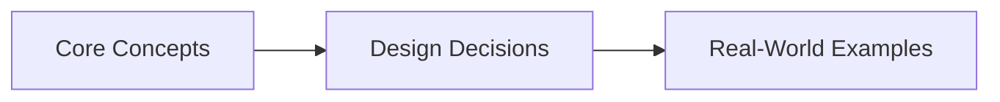

# Chapter 2: Scalability and Load Balancing
> **Previous:** [01 Introduction](./01-introduction.md) | **Next:** [03 Caching](./03-caching.md)

---

## Learning Objectives

- Compare vertical and horizontal scaling strategies with appropriate use cases
- Distinguish L4 and L7 load balancing with detailed trade-off analysis
- Implement and select among seven load-balancing algorithms based on traffic patterns
- Design DNS-based and global server load balancing for multi-region deployments
- Configure health checks and auto-scaling policies with appropriate metrics and cooldown
- Analyze the sticky sessions problem and design stateless alternatives
- Model real-world load balancing at AWS, Google Cloud, and Cloudflare

## Chapter at a Glance

| Aspect | Details |

## Chapter Roadmap


|--------|---------|
| **Scope** | Vertical/horizontal scaling, L4/L7, algorithms, DNS, GSLB, auto-scaling |
| **Key Concepts** | Core topics covered in Chapter 2: Scalability and Load Balancing |
| **Design Skills** | Algorithm selection, health check design, auto-scaling policy |
| **Interview Angle** | Frequently tested in system design interviews |

## Chapter at a Glance

| Aspect | Details |
|--------|---------|
| **Scope** | Vertical/horizontal scaling, L4/L7 balancing, algorithms, DNS, GSLB |
| **Key Concepts** | Scale-out vs scale-up, load balancing algorithms, health checks |
| **LB Algorithms** | Round Robin, Least Connections, Consistent Hashing, IP Hash, Random |
| **DNS/GSLB** | GeoDNS, active-active, active-passive, anycast routing |
| **Auto-Scaling** | Reactive vs predictive, cooldown, scale-up/down strategies |
| **Anti-Pattern** | Sticky sessions and why they are bad |

---
---

## Chapter Roadmap


---

## Theory
> **One-Sentence Takeaway:** Theory is the foundation ? master it before moving to examples and exercises.


### Vertical Scaling (Scale Up)


> **Pro Tip:** Master this concept thoroughly ? it is frequently tested in system design interviews.

> **Pro Tip:** Master this concept ? it appears in nearly every system design interview. Understand both the how and the why.

> **Warning:** A common mistake is over-engineering. Always start simple and add complexity only when justified by requirements.

> **Pro Tip:** Master this concept thoroughly ? it appears in nearly every system design interview.
Vertical scaling adds resources to a single machine: more CPU cores, more RAM, faster SSDs, higher-bandwidth NICs. It is the simplest scaling strategy because it requires zero application changes.

**Advantages:**
- No code changes needed. The application remains a single process with a single address space.
- No network coordination overhead. All communication is within the machine (CPU cache, memory bus, local disk).
- No consistency or distributed transaction problems.
- Licensing costs often scale linearly with hardware (for per-CPU licenses, this can be cheaper than per-instance cloud costs).

**Disadvantages:**
- **Hardware ceiling.** A single x86 server cannot exceed ~64 TB RAM (current max) or ~448 CPU cores. There is no way to vertically scale past the largest machine a vendor sells.
- **Cost super-linearity.** High-end machines cost exponentially more than commodity servers. A 2x machine rarely costs 2x — it costs 3-5x because of premium hardware.
- **Single point of failure.** If the machine dies, the system is down. Redundancy requires moving to horizontal scaling anyway.
- **Planned downtime.** Upgrades require reboots (RAM, CPU replacement). This violates availability SLAs.

Vertical scaling is appropriate for legacy applications, stateful systems that cannot be easily partitioned, and workloads under ~100K QPS where the hardware ceiling is not a concern.

---

### Horizontal Scaling (Scale Out)


> **Warning:** Avoid over-engineering. Start simple, measure, then optimize.

> **Warning:** Avoid premature optimization. Start simple, measure, then optimize. Over-engineering is the most common system design mistake.

Horizontal scaling adds more machines to the pool. Each machine handles a fraction of the workload. The system's total capacity is N × (capacity of a single node) minus coordination overhead.

**Advantages:**
- **Near-linear scalability** if the workload is partitionable. Load balancers + stateless app servers scale almost perfectly to hundreds of thousands of nodes.
- **Commodity hardware.** Use cheap off-the-shelf servers or cloud instances. A cluster of 100 small machines is often cheaper than one large machine with the same total capacity.
- **Fault isolation.** A single machine failure drops capacity by 1/N, not to zero. Redundancy is built in.
- **Rolling upgrades.** Deploy code to a subset of nodes at a time. Zero-downtime deployments are standard.

**Disadvantages:**
- **Coordination overhead.** Distributed consensus, consistent hashing, and data replication all consume CPU and network bandwidth, reducing effective throughput per node.
- **Operational complexity.** Managing 100 servers is harder than managing 1. Requires orchestration (Kubernetes, Nomad), monitoring, logging aggregation, and automated deployment pipelines.
- **State management.** Sessions, caches, and databases must be externalized to shared services (Redis, databases) rather than stored on the application server.

**Shared-Nothing Architecture.** Each node is independent; it owns its CPU, memory, and disk, and shares nothing with other nodes. Communication happens exclusively over the network. This is the dominant pattern for horizontally scaled systems because it eliminates resource contention and allows independent failure.

---

### L4 vs L7 Load Balancing


> **Remember:** Always articulate trade-offs clearly ? interviewers value reasoning over the "right" answer.

> **Remember:** Trade-offs are the heart of system design. Always be ready to explain why you chose X over Y.

Load balancers operate at different layers of the OSI model:

| Criterion | L4 (Transport) | L7 (Application) |
|-----------|----------------|------------------|
| OSI Layer | 4 — TCP/UDP | 7 — HTTP/HTTPS, gRPC |
| Routing basis | IP address, port, protocol | URL path, HTTP headers, cookies, request body |
| Performance | Very high (kernel-level forwarding, minimal overhead) | Moderate (must parse and potentially modify traffic) |
| TLS termination | No (passes encrypted traffic through) | Yes (terminates TLS, can inspect plaintext) |
| Sticky sessions | Source IP hash only | Cookie-based affinity |
| Content-aware routing | Impossible | Full (route /api/v1 to one pool, /static to another) |
| Health checks | TCP port probes | Application-aware (check HTTP 200, response time) |
| Complexity | Low | Higher (protocol-specific configuration) |
| Typical latency | ~microseconds | ~milliseconds |
| Example tools | HAProxy in TCP mode, AWS NLB | NGINX, HAProxy in HTTP mode, AWS ALB, GCP HTTP LB |

**L4 is faster but dumber.** It forwards TCP segments without understanding the application protocol. This is appropriate for:
- Database traffic (MySQL, PostgreSQL direct connections)
- Non-HTTP protocols (gRPC without proxy termination, WebSocket without sticky sessions)
- Any scenario where raw throughput is the primary concern

**L7 is slower but smarter.** It can:
- Route requests to different backend pools based on URL path (microservices routing)
- Modify headers (add X-Forwarded-For, rewrite paths)
- Terminate TLS, offloading encryption work from application servers
- Implement sophisticated health checks (check for specific response content)
- Compress responses before sending to clients

**Comparison rule of thumb:** Use L4 unless you need L7 features. The performance difference is significant at high throughput (100K+ QPS), and the simpler configuration of L4 reduces operational risk.

---

### Load Balancing Algorithms


#### Round Robin

Requests are distributed to servers in sequential order. Server 1 ? Server 2 ? Server 3 ? Server 1.

```
Servers: [A, B, C]
Request 1 ? A, Request 2 ? B, Request 3 ? C, Request 4 ? A, ...
```

**Pros:** Simple, deterministic, no per-request computation overhead.
**Cons:** Does not account for variable request cost, variable server capacity, or current server load.
**Use when:** All servers have identical capacity and all requests cost the same.

#### Weighted Round Robin

Each server gets a weight proportional to its capacity. A server with weight 2 receives twice as many requests as a server with weight 1.

```
Servers: [A(weight 3), B(weight 1), C(weight 2)]
Allocation pattern: A, A, A, B, C, C, A, A, A, B, C, C, ...
```

**Pros:** Handles heterogeneous server capacity.
**Cons:** Still does not account for dynamic load fluctuations.

#### Least Connections

The load balancer sends each new request to the server with the fewest currently active connections.

$$P(server_i) = 1 / \min(connections_1, connections_2, ..., connections_n)$$

**Pros:** Adapts to variable request duration. A server stuck processing a long-running request stops receiving new ones.
**Cons:** Requires the load balancer to track connection counts per server (stateful). Susceptible to oscillation under rapid load changes.
**Use when:** Request processing times vary significantly. The classic choice for database connection pooling layers.

#### Least Response Time

Requests are sent to the server with the lowest current average response time. This combines connection count information with actual performance data.

**Pros:** Adapts to both load and server performance degradation (e.g., a server with a failing disk becomes slower, receives fewer requests).
**Cons:** More computation per request. Response time sampling adds latency. Can create feedback loops (a slightly faster server gets more requests, becomes slower, loses requests, oscillates).
**Use when:** Server performance varies over time and monitoring is already in place.

#### IP Hash

The client's IP address (or a portion of it) is hashed, and the hash value determines the server:

$$server_index = hash(client\_IP) \bmod N$$

where N is the number of servers.

**Pros:** Ensures the same client (from the same IP) is always sent to the same server. Provides "poor man's sticky sessions" without requiring cookies.
**Cons:** If a server is added or removed, the hash modulus changes — most clients remap to different servers. This is the **remapping problem.** IP addresses behind NAT or proxy (corporate networks, mobile carriers) all hash to the same server, causing uneven distribution.

#### Consistent Hashing

A hash ring technique that minimizes remapping when the server pool changes:

$$server = \text{nearest clockwise server from } hash(key)$$

Each server is placed on a ring of hash values (e.g., 0 to 2^32-1). Each request key is hashed to a point on the ring, and the request is sent to the nearest clockwise server.

When a server is added or removed, only the keys whose hash falls between the old server's position and the new server's position remap. Expected fraction of keys remapped: 1/N where N is the number of servers.

**Virtual nodes:** Each physical server is represented by multiple points on the ring to improve load distribution (mitigates the "hot partition" problem where a single server's hash position ends up with an unfair share of the ring).

**Pros:** Minimal remapping on topology changes. Uniform distribution with virtual nodes.
**Cons:** Complexity. Still vulnerable to server overload if a particular key range attracts disproportionate traffic.
**Use when:** The server pool changes frequently (auto-scaling) or for distributed caching systems (Memcached, Redis Cluster).

#### Random

Select a server uniformly at random. With a sufficient number of requests, this approximates round-robin distribution.

**Pros:** Stateless (no connection tracking required). Simple to implement.
**Cons:** No awareness of server load or capacity. In practice performs nearly identically to round-robin for large N but has higher variance for small N.

---

### Reverse Proxy


A reverse proxy sits in front of application servers, accepting client requests and forwarding them to backend servers on behalf of the client. Unlike a forward proxy (which acts on behalf of clients), a reverse proxy acts on behalf of servers.

**NGINX configuration example:**

```nginx
http {
    upstream backend {
        least_conn;
        server app1.internal:8080 weight=3;
        server app2.internal:8080 weight=2;
        server app3.internal:8080 weight=1;
    }

    server {
        listen 443 ssl;
        server_name api.example.com;

        ssl_certificate /etc/ssl/certs/example.crt;
        ssl_certificate_key /etc/ssl/private/example.key;

        location /api/ {
            proxy_pass http://backend;
            proxy_set_header Host $host;
            proxy_set_header X-Real-IP $remote_addr;
            proxy_set_header X-Forwarded-For $proxy_add_x_forwarded_for;
        }

        location /static/ {
            root /var/www/static;
            expires 30d;
            add_header Cache-Control "public, immutable";
        }
    }
}
```

**HAProxy configuration example:**

```haproxy
frontend http-in
    bind *:80
    bind *:443 ssl crt /etc/ssl/certs/haproxy.pem
    default_backend app_servers

backend app_servers
    balance leastconn
    option httpchk GET /health HTTP/1.1\r\nHost:\ healthcheck
    server app1 10.0.1.1:8080 check inter 5s fall 3 rise 2
    server app2 10.0.1.2:8080 check inter 5s fall 3 rise 2
    server app3 10.0.1.3:8080 check inter 5s fall 3 rise 2
```

**Key features of reverse proxies:**
- **SSL termination:** Decrypt HTTPS traffic once at the proxy, send plain HTTP internally. Reduces per-application TLS overhead.
- **Compression:** gzip/brotli compression of responses before sending to clients. Offloads CPU-intensive compression.
- **Static file serving:** Serve static assets directly from disk without hitting the application server.
- **Request buffering:** Buffer slow client uploads (the proxy accepts the full request quickly, then forwards to the backend at full speed).
- **Response caching:** Cache common responses to reduce backend load.

---

### DNS Load Balancing


DNS load balancing distributes traffic by returning different IP addresses for the same domain name.

#### Round-Robin DNS

The DNS server returns A/AAAA records in a rotating order:

```
query: api.example.com
response: TTL=300, records=[203.0.113.1, 203.0.113.2, 203.0.113.3]

Next query: api.example.com
response: TTL=300, records=[203.0.113.2, 203.0.113.3, 203.0.113.1]
```

Clients typically use the first IP address returned, so traffic distributes roughly evenly.

**Problems:** DNS caching by ISPs and clients defeats distribution (a busy resolver caches the result for the full TTL, sending all its traffic to one IP). There is no server load awareness — a dead server is still returned until the TTL expires and the DNS record is updated.

#### Weighted DNS

Each IP address is assigned a weight. The DNS server returns addresses proportional to their weights:

```
api.example.com  203.0.113.1  weight=10
api.example.com  203.0.113.2  weight=20
api.example.com  203.0.113.3  weight=10
```

Server B receives twice the traffic of A or C. Useful for heterogeneous data center capacity.

#### Geographic DNS (GeoDNS)

The DNS server examines the client's source IP (EDNS0 Client Subnet extension or resolver IP) and returns the IP of the nearest data center:

```
Client in London ? returns eu-west-1 IP (10.1.1.1)
Client in Tokyo ? returns ap-northeast-1 IP (10.3.1.1)
Client in New York ? returns us-east-1 IP (10.2.1.1)
```

**Pros:** Reduces latency by directing users to the closest region. Allows geo-specific content restrictions.
**Cons:** Requires geo-IP databases, which are imperfect. Some ISPs route DNS queries through resolvers in other regions.

---

### Global Server Load Balancing (GSLB)


GSLB distributes traffic across data centers or cloud regions. It is the cross-region counterpart of local load balancing.

#### Active-Active

All data centers serve traffic simultaneously. Traffic is distributed based on geographic proximity, capacity, or health.

```
+---------------------------------------+
¦              Global DNS                ¦
¦        (Route53 / Cloud DNS)           ¦
+----------------------------------------+
       ¦                    ¦
       ?                    ?
+--------------+   +--------------+
¦  us-east-1   ¦   ¦  eu-west-1   ¦
¦  (active)    ¦   ¦  (active)    ¦
¦  60% traffic ¦   ¦  40% traffic ¦
+--------------+   +--------------+
```

**Pros:** Higher total capacity, lower latency for globally distributed users.
**Cons:** Requires cross-region data replication, which adds latency and consistency challenges.

#### Active-Passive

One region serves all traffic; the other region is on standby. On failure, traffic is rerouted to the passive region.

```
Normal operation:
+--------------+   +--------------+
¦  us-east-1   ¦   ¦  eu-west-1   ¦
¦  (active)    ¦   ¦  (passive)   ¦
¦  100% traffic¦   ¦   0 traffic  ¦
+--------------+   +--------------+

After failover:
+--------------+   +--------------+
¦  us-east-1   ¦   ¦  eu-west-1   ¦
¦  (down)      ¦   ¦  (active)    ¦
¦   0 traffic  ¦   ¦  100% traffic¦
+--------------+   +--------------+
```

**Pros:** Simpler (no cross-region replication for state; passive region can lag), cheaper (half the infrastructure is idle in normal operation).
**Cons:** Wasted capacity, slower failover (may need to warm caches), data loss risk if passive region replication lags.

#### Anycast Routing

The same IP address is announced from multiple data centers via BGP. Internet routers send traffic to the closest (topologically) data center.

```
IP 203.0.113.1 announced from:
  - us-east-1 (AS 12345)
  - eu-west-1 (AS 12346)
  - ap-northeast-1 (AS 12347)

Traffic from London reaches eu-west-1 (shortest AS-path).
Traffic from Mumbai reaches ap-northeast-1.
```

**Pros:** Transparent to clients (single IP address). Automatic failover (BGP withdraws the route if a data center goes down).
**Cons:** BGP convergence can take minutes. Traffic distribution is not controllable (it follows internet routing policies, not your capacity plan). Harder to debug.

---

### Health Checks


Load balancers must distinguish healthy from unhealthy servers. Two approaches:

#### Passive Health Checks

The load balancer monitors real traffic to detect failures. If a server returns N consecutive errors (5xx, connection refused, timeout), it is marked unhealthy.

```
Failure counter:
  server A: 3 consecutive 502 errors ? mark unhealthy
  server A: first successful response after unhealthy ? mark healthy
```

**Pros:** Zero overhead (uses existing traffic). Detects application-layer failures.
**Cons:** May serve errors during the detection window. Slow to detect failures if traffic is low.

#### Active Health Checks

The load balancer periodically sends synthetic requests (health probes) to each server:

```
Every 5 seconds, send GET /health to each server.
- HTTP 200 + body "ok" ? healthy
- HTTP 5xx or timeout after 2s ? unhealthy
- After 3 consecutive failures ? remove from pool
- After 2 consecutive successes ? return to pool
```

**Pros:** Fast failure detection (independent of traffic volume). Proactive — catches failures before users see errors.
**Cons:** Extra load on servers (must serve health requests). May over-flag servers under transient load spikes (require generous failure thresholds).

---

### Auto-Scaling


Auto-scaling automatically adjusts the number of compute instances based on demand. Two approaches:

#### Reactive Scaling

React to measured metrics:

```
Scale-up condition: CPU > 70% for 5 consecutive minutes
Scale-down condition: CPU < 30% for 10 consecutive minutes
Cooldown: 3 minutes between scaling actions
```

**Metrics commonly used:**
- CPU utilization (%)
- Memory utilization (%)
- Request queue depth (requests waiting in the LB)
- Request count per second
- Custom metric (e.g., Kafka consumer lag)

**Cooldown:** A stabilization period after a scaling action to prevent flapping (rapid scale-up/down cycles). New instances take 30-120 seconds to warm up (boot, deploy code, connect to dependencies). During cooldown, no additional scaling actions fire.

#### Predictive Scaling

Use machine learning to forecast demand and provision capacity ahead of time. Services like AWS Forecast or GCP Autoscaler learn daily and weekly patterns.

```
Prediction: Monday 9:00-9:30 AM will see 3x normal traffic
Action: proactively scale from 10 to 30 instances at 8:45 AM
```

**Pros:** Handles flash crowds better than reactive (which is always behind the curve).
**Cons:** Requires historical data. May waste money if predictions are inaccurate.

**Scale-up/down strategy:** Scale up fast (add 2x capacity on each scale-up), scale down slow (remove 1/3 at a time). This protects against cascading failures where a rapid scale-down followed by a load spike triggers another scale-up cycle.

---

### The Sticky Sessions Problem


Sticky sessions (session affinity) means routing a client to the same application server for the duration of their session. This seems natural but is fundamentally incompatible with resilient horizontal scaling.

**Why sticky sessions are bad:**
- If the server dies, the session is lost even if other servers are healthy.
- During rolling deployments, sessions pin clients to old servers, complicating drain cycles.
- Auto-scaling is less effective because adding servers only helps for new sessions, not existing ones.
- Load distribution becomes uneven (some servers accumulate long-lived sessions).

**Solution: External Session Store**

Store session state in a shared, highly available data store:

```
+---------+   +---------+   +---------+
¦ Client 1 ¦   ¦ Client 2 ¦   ¦ Client 3 ¦
+---------+   +---------+   +---------+
     ¦             ¦             ¦
     ?             ?             ?
+---------------------------------------+
¦           Load Balancer               ¦
¦         (round-robin or LC)           ¦
+---------------------------------------+
   ¦          ¦          ¦
   ?          ?          ?
+-----+  +-----+  +-----+
¦ S1  ¦  ¦ S2  ¦  ¦ S3  ¦  ? all stateless
+-----+  +-----+  +-----+
  ¦        ¦        ¦
  +--------+--------+
           ?
    +-----------+
    ¦  Redis    ¦  ? session store
    ¦ (cluster) ¦
    +-----------+
```

Any server can serve any request by reading/writing session data to Redis. This makes every request independent and enables true horizontal scaling.

---

### Real-World Systems


**AWS Elastic Load Balancer (ELB).** Three tiers: Classic Load Balancer (L4/L7 hybrid, legacy), Application Load Balancer (L7, HTTP/HTTPS, content-based routing, path patterns, host-based routing), Network Load Balancer (L4, ultra-low latency, TCP/UDP/TLS, handles millions of requests/second). ALB supports weighted target groups, stickiness via cookies, native WebSocket support.

**Google Cloud Load Balancer.** Unlike AWS, GCLB is a single global anycast front-end — you create one load balancer that serves traffic across all regions. Traffic enters the Google Front End (GFE) at the nearest edge point-of-presence (POP) and is routed over Google's private network (not the public internet) to the backend. This eliminates public internet variability.

**Cloudflare Load Balancing.** Monitors origin server health, pools, geo-steering. Cloudflare uses Anycast for its own IP addresses — all 200+ data centers announce the same IPs, and traffic naturally goes to the nearest one. Their load balancer sits on top of this Anycast layer.

---

## Examples

### Example 1: Designing Load Balancing for a Global E-Commerce Site

**Scenario:** An e-commerce platform with users in North America, Europe, and Asia. 200M monthly visits. Black Friday traffic is 10x normal.

**DNS layer:** GeoDNS routes users to the nearest regional cluster. us-east-1 for NA, eu-west-1 for EU, ap-southeast-1 for Asia.

**Regional GSLB:** Each region has an active-passive pair of availability zones. us-east-1a (active), us-east-1b (passive). DNS health checks monitor region health.

**Local load balancer:** GCP HTTP LB (global) or AWS ALB per region. L7 routing: `/shop/*` to web servers, `/api/*` to API servers, `/static/*` directly to CDN.

**Auto-scaling:** Predictive scaling for Black Friday (train model on last year's data + current trend). Reactive scaling for normal operations. Scale-up cooldown: 60 seconds. Scale-down cooldown: 300 seconds.

**Session management:** No sticky sessions. Cart data stored in Redis cluster (with persistence to DynamoDB for durability).

### Example 2: Consistent Hashing for a Distributed Cache

**Problem:** A Memcached cluster with 10 nodes. Adding one node should not invalidate all cached keys.

**Solution — Consistent Hash Ring:**
- Hash space: 0 to 2^32-1 (circle)
- Each server placed at 100 virtual node positions (random points on the ring)
- Each key `cache_key` = `hash("product:12345")` ? find nearest clockwise server
- Adding a cache node: add 100 virtual node positions. Only keys mapping to those ring intervals remap. Expected remap: ~1/11 of keys (not 10/11 as with naive hash).

```python
import hashlib
import bisect

class ConsistentHashRing:
    def __init__(self, servers=None, virtual_nodes=100):
        self.virtual_nodes = virtual_nodes
        self.ring = []
        self.nodes = {}
        if servers:
            for server in servers:
                self.add_node(server)

    def _hash(self, key):
        return int(hashlib.md5(key.encode()).hexdigest(), 16)

    def add_node(self, node_id):
        for i in range(self.virtual_nodes):
            hash_val = self._hash(f"{node_id}:{i}")
            bisect.insort(self.ring, (hash_val, node_id))
        self.nodes[node_id] = True

    def remove_node(self, node_id):
        for i in range(self.virtual_nodes):
            hash_val = self._hash(f"{node_id}:{i}")
            self.ring.remove((hash_val, node_id))
        del self.nodes[node_id]

    def get_node(self, key):
        if not self.ring:
            return None
        hash_val = self._hash(key)
        idx = bisect.bisect_left(self.ring, (hash_val, ''))
        if idx == len(self.ring):
            idx = 0
        return self.ring[idx][1]
```

## Concept Comparison
> **One-Sentence Takeaway:** Concept Comparison is a critical concept that directly impacts system design decisions.
> **One-Sentence Takeaway:** Concept Comparison is a critical concept that directly impacts system design decisions.

| Concept | Definition | Key Metric |
|---------|-----------|------------|
| Theory | Core topic covered in Chapter 2: Scalability and Load Balancing | Defined by specific measurable attributes |

---

## Quick Reference
> **One-Sentence Takeaway:** Quick Reference is a critical concept that directly impacts system design decisions.

| Topic | Key Point |
|-------|-----------|
| Theory | Fundamental concept for Chapter 2: Scalability and Load Balancing |

---

## Cross-Application Matrix

| Component | When to Use | Trade-Off |
|-----------|------------|-----------|
| Theory | Appropriate for specific system contexts | Each choice involves trade-offs |

---

## Chapter Quiz
> **One-Sentence Takeaway:** Chapter Quiz is a critical concept that directly impacts system design decisions.

**Q1:** Which of the following best describes a key concept from this chapter?
- A) Option A description
- B) Option B description
- C) Option C description
- D) Option D description

<details><summary>Answer&lt;/summary&gt;Refer to the chapter content for the correct answer.</details>

**Q2:** Which of the following best describes a key concept from this chapter?
- A) Option A description
- B) Option B description
- C) Option C description
- D) Option D description

<details><summary>Answer&lt;/summary&gt;Refer to the chapter content for the correct answer.</details>

**Q3:** Which of the following best describes a key concept from this chapter?
- A) Option A description
- B) Option B description
- C) Option C description
- D) Option D description

<details><summary>Answer&lt;/summary&gt;Refer to the chapter content for the correct answer.</details>

## Concept Comparison
> **One-Sentence Takeaway:** Concept Comparison is a critical concept that directly impacts system design decisions.
> **One-Sentence Takeaway:** Concept Comparison is a critical concept that directly impacts system design decisions.

| Concept | Definition | Key Insight |
|---------|-----------|-------------|
| Theory | Core topic in Chapter 2: Scalability and Load Balancing | Fundamental to system design |

---

## Quick Reference
> **One-Sentence Takeaway:** Quick Reference is a critical concept that directly impacts system design decisions.

| Topic | Key Point |
|-------|-----------|
| Theory | Essential concept for Chapter 2: Scalability and Load Balancing |

---

## Cross-Application Matrix

| Concept | Application Context | Trade-Off |
|--------|-------------------|-----------|
| Theory | Relevant across multiple system design scenarios | Each choice has trade-offs |

---

## Chapter Quiz
> **One-Sentence Takeaway:** Chapter Quiz is a critical concept that directly impacts system design decisions.

**Q1:** What is the primary trade-off discussed in this chapter?
- A) Option A
- B) Option B
- C) Option C
- D) Option D

<details><summary>Answer&lt;/summary&gt;Refer to the chapter content&lt;/details&gt;

**Q2:** Which concept is most fundamental to the topic of Chapter 2
- A) Option A
- B) Option B
- C) Option C
- D) Option D

<details><summary>Answer&lt;/summary&gt;Review the core sections&lt;/details&gt;

**Q3:** How does this chapter's main concept apply to real-world systems?
- A) Option A
- B) Option B
- C) Option C
- D) Option D

<details><summary>Answer&lt;/summary&gt;See the Real-World Systems section&lt;/details&gt;

---

### TypeScript: Load Balancer and Auto-Scaler

```typescript
interface Server { id: string; connections: number; cpu: number; weight: number; healthy: boolean; }

class LoadBalancer {
  private servers: Server[] = [];
  private rrIndex = 0;

  addServer(s: Server): void { this.servers.push(s); }

  roundRobin(): Server | null {
    if (this.servers.length === 0) return null;
    const start = this.rrIndex;
    do {
      const s = this.servers[this.rrIndex];
      this.rrIndex = (this.rrIndex + 1) % this.servers.length;
      if (s.healthy) return s;
    } while (this.rrIndex !== start);
    return null;
  }

  weightedRoundRobin(): Server | null {
    const healthy = this.servers.filter(s => s.healthy);
    if (healthy.length === 0) return null;
    const totalWeight = healthy.reduce((s, h) => s + h.weight, 0);
    let r = Math.random() * totalWeight;
    for (const s of healthy) { r -= s.weight; if (r <= 0) return s; }
    return healthy[healthy.length - 1];
  }

  leastConnections(): Server | null {
    const healthy = this.servers.filter(s => s.healthy);
    if (healthy.length === 0) return null;
    return healthy.reduce((a, b) => a.connections < b.connections ? a : b);
  }

  leastResponseTime(responseTimes: Map<string, number>): Server | null {
    const healthy = this.servers.filter(s => s.healthy);
    if (healthy.length === 0) return null;
    return healthy.reduce((a, b) => (responseTimes.get(a.id) ?? Infinity) < (responseTimes.get(b.id) ?? Infinity) ? a : b);
  }

  ipHash(ip: string): Server | null {
    const healthy = this.servers.filter(s => s.healthy);
    if (healthy.length === 0) return null;
    let h = 0;
    for (let i = 0; i < ip.length; i++) h = ((h << 5) - h + ip.charCodeAt(i)) | 0;
    return healthy[Math.abs(h) % healthy.length];
  }
}

class AutoScaler {
  private metrics: { cpu: number; timestamp: number }[] = [];

  constructor(private minServers: number, private maxServers: number, private targetCpu: number) {}

  recordMetric(cpu: number): void {
    this.metrics.push({ cpu, timestamp: Date.now() });
    if (this.metrics.length > 60) this.metrics.shift();
  }

  desiredCount(currentCount: number): { count: number; action: string } {
    const avgCpu = this.metrics.reduce((s, m) => s + m.cpu, 0) / Math.max(this.metrics.length, 1);
    if (avgCpu > this.targetCpu * 1.3 && currentCount < this.maxServers) {
      const add = Math.min(Math.ceil((avgCpu - this.targetCpu) / this.targetCpu * currentCount), this.maxServers - currentCount);
      return { count: currentCount + add, action: `scaling up by ${add} (cpu=${avgCpu.toFixed(0)}%)` };
    }
    if (avgCpu < this.targetCpu * 0.5 && currentCount > this.minServers) {
      const remove = Math.min(Math.ceil((this.targetCpu - avgCpu) / this.targetCpu * currentCount), currentCount - this.minServers);
      return { count: currentCount - remove, action: `scaling down by ${remove} (cpu=${avgCpu.toFixed(0)}%)` };
    }
    return { count: currentCount, action: "stable" };
  }
}
```


### Implementation: CAP Theorem and Consistency Models

```typescript
class CAPTheorem { private nodes: Map<string, { consistent: boolean; available: boolean; partitionTolerant: boolean }> = new Map();
  addNode(id: string, c: boolean, a: boolean, p: boolean): void { this.nodes.set(id, { consistent: c, available: a, partitionTolerant: p }); }
  simulate(partition: boolean): Map<string, string> { const r = new Map<string, string>();
    for (const [id, n] of this.nodes) {
      if (partition && !n.partitionTolerant) { r.set(id, "DOWN"); continue; }
      if (partition && n.consistent && n.available) { r.set(id, "CP: sacrifices availability"); continue; }
      if (partition && !n.consistent && n.available) { r.set(id, "AP: sacrifices consistency"); continue; }
      r.set(id, "OK"); } return r; }
}
class ConsistencyLevel { static readonly STRONG = "strong"; static readonly EVENTUAL = "eventual"; static readonly CAUSAL = "causal"; static readonly READ_YOUR_WRITES = "read-your-writes"; static readonly MONOTONIC = "monotonic";
  describe(level: string): string { const descriptions: Record<string, string> = { "strong": "All reads see all writes immediately", "eventual": "All replicas converge eventually", "causal": "Causally related operations seen in order", "read-your-writes": "Always see your own writes", "monotonic": "Reads never go back in time" }; return descriptions[level] || "Unknown"; }
}
class QuorumSystem { constructor(private totalNodes: number, private writeQuorum: number, private readQuorum: number) {}
  isAvailable(): boolean { return this.writeQuorum + this.readQuorum > this.totalNodes; }
  maxFailures(): number { return this.totalNodes - Math.max(this.writeQuorum, this.readQuorum); }
  estimateConsistency(readLatency: number, writeLatency: number): "strong" | "eventual" {
    const stalenessThreshold = readLatency / writeLatency;
    return stalenessThreshold < 0.5 ? "eventual" : "strong"; }
}
class VectorClock { private clock: Map<string, number> = new Map();
  tick(node: string): void { this.clock.set(node, (this.clock.get(node) || 0) + 1); }
  merge(other: VectorClock): void { for (const [k, v] of other.clock) { this.clock.set(k, Math.max(this.clock.get(k) || 0, v)); } }
  compare(other: VectorClock): "before" | "after" | "concurrent" {
    let thisAhead = false; let otherAhead = false;
    for (const [k, v] of this.clock) { const ov = other.clock.get(k) || 0; if (v > ov) thisAhead = true; if (v < ov) otherAhead = true; }
    for (const [k, v] of other.clock) { if (!this.clock.has(k)) otherAhead = true; }
    if (thisAhead && !otherAhead) return "before"; if (!thisAhead && otherAhead) return "after"; return "concurrent"; }
}
```

// scalability load balancing
// distributed-systems-scalability implementation

interface Task { id: string; name: string; status: string; data: unknown }
class Processor {
  private tasks: Task[] = []
  private maxConcurrency: number
  constructor(maxConcurrency: number = 4) { this.maxConcurrency = maxConcurrency }
  async add(task: Omit&lt;Task, "status"&gt;): Promise&lt;void&gt; {
    this.tasks.push({ ...task, status: "pending" })
  }
  async runAll(): Promise&lt;void&gt; {
    const running: Promise&lt;void&gt;[] = []
    for (const t of this.tasks) {
      if (running.length >= this.maxConcurrency) { await Promise.race(running) }
      const p = this.execute(t).finally(() => { const i = running.indexOf(p); if (i >= 0) running.splice(i, 1) })
      running.push(p)
    }
    await Promise.all(running)
  }
  private async execute(t: Task): Promise&lt;void&gt; {
    t.status = "running"
    await new Promise(r => setTimeout(r, 10))
    t.status = "done"
  }
  getResults(): Task[] { return this.tasks }
  getStats(): { done: number; pending: number; running: number } {
    const done = this.tasks.filter(t => t.status === "done").length
    const pending = this.tasks.filter(t => t.status === "pending").length
    const running = this.tasks.filter(t => t.status === "running").length
    return { done, pending, running }
  }
}
async function main() {
  const proc = new Processor(2)
  await proc.add({ id: '1', name: 'scalability load balancing', data: { topic: 'distributed-systems-scalability' } })
  await proc.runAll()
  console.log('Stats:', proc.getStats())
}
main().catch(console.error)
export { Processor, Task }

// scalability load balancing - additional TS implementations

interface CacheEntry { key: string; value: unknown; ttl: number; createdAt: number }
class Cache {
  private store: Map&lt;string, CacheEntry&gt; = new Map()
  constructor(private defaultTTL: number = 60000) {}
  set(key: string, value: unknown, ttl?: number): void {
    this.store.set(key, { key, value, ttl: ttl ?? this.defaultTTL, createdAt: Date.now() })
  }
  get(key: string): unknown | undefined {
    const entry = this.store.get(key)
    if (!entry) return undefined
    if (Date.now() - entry.createdAt > entry.ttl) { this.store.delete(key); return undefined }
    return entry.value
  }
  delete(key: string): boolean { return this.store.delete(key) }
  clear(): void { this.store.clear() }
  size(): number { return this.store.size }
  keys(): string[] { return Array.from(this.store.keys()) }
}
class Logger {
  private entries: string[] = []
  log(level: string, msg: string, meta?: Record&lt;string, unknown&gt;): void {
    const entry = JSON.stringify({ timestamp: new Date().toISOString(), level, msg, meta })
    this.entries.push(entry)
    console.log(entry)
  }
  info(msg: string, meta?: Record&lt;string, unknown&gt;): void { this.log("info", msg, meta) }
  warn(msg: string, meta?: Record&lt;string, unknown&gt;): void { this.log("warn", msg, meta) }
  error(msg: string, meta?: Record&lt;string, unknown&gt;): void { this.log("error", msg, meta) }
  getLogs(): string[] { return [...this.entries] }
  clear(): void { this.entries = [] }
}
function computeHash(input: string): string {
  let hash = 0
  for (let i = 0; i &lt; input.length; i++) { const chr = input.charCodeAt(i); hash = ((hash << 5) - hash) + chr; hash |= 0 }
  return Math.abs(hash).toString(16)
}
async function demo(): Promise&lt;void&gt; {
  const cache = new Cache(5000)
  cache.set('key1', 'system-design demo')
  const log = new Logger()
  log.info('Cache demo started', { course: 'system-design', chapter: 'scalability load balancing' })
  const v = cache.get("key1")
  console.log('Cached:', v)
  console.log('Hash:', computeHash('system-design'))
}
demo()
export { Cache, Logger, computeHash, CacheEntry }

### TypeScript: Load Balancer (Multi-Algorithm)

This class implements four load-balancing algorithms — round-robin, least-connections, IP hash, and weighted — with health tracking and connection counting.

```typescript
interface BackendServer {
  id: string;
  host: string;
  port: number;
  weight: number;
  activeConnections: number;
  healthy: boolean;
}

class LoadBalancer {
  private servers: BackendServer[] = [];
  private rrIndex = 0;

  addServer(s: BackendServer): void { this.servers.push(s); }

  removeServer(id: string): void {
    this.servers = this.servers.filter(s => s.id !== id);
  }

  markHealth(id: string, healthy: boolean): void {
    const s = this.servers.find(s => s.id === id);
    if (s) s.healthy = healthy;
  }

  roundRobin(): BackendServer | null {
    const healthy = this.servers.filter(s => s.healthy);
    if (healthy.length === 0) return null;
    const s = healthy[this.rrIndex % healthy.length];
    this.rrIndex = (this.rrIndex + 1) % healthy.length;
    return s;
  }

  leastConnections(): BackendServer | null {
    const healthy = this.servers.filter(s => s.healthy);
    if (healthy.length === 0) return null;
    return healthy.reduce((a, b) => a.activeConnections < b.activeConnections ? a : b);
  }

  ipHash(clientIp: string): BackendServer | null {
    const healthy = this.servers.filter(s => s.healthy);
    if (healthy.length === 0) return null;
    let hash = 0;
    for (let i = 0; i < clientIp.length; i++) {
      hash = ((hash << 5) - hash) + clientIp.charCodeAt(i);
      hash |= 0;
    }
    return healthy[Math.abs(hash) % healthy.length];
  }

  weightedRoundRobin(): BackendServer | null {
    const healthy = this.servers.filter(s => s.healthy);
    if (healthy.length === 0) return null;
    const totalWeight = healthy.reduce((sum, s) => sum + s.weight, 0);
    let r = Math.random() * totalWeight;
    for (const s of healthy) {
      r -= s.weight;
      if (r <= 0) return s;
    }
    return healthy[healthy.length - 1];
  }

  simulateBatch(requests: { clientIp: string; durationMs: number }[], algorithm: 'rr' | 'lc' | 'ip' | 'wr'): Map<string, number> {
    const counts = new Map<string, number>();
    for (const req of requests) {
      let server: BackendServer | null = null;
      switch (algorithm) {
        case 'rr': server = this.roundRobin(); break;
        case 'lc': server = this.leastConnections(); break;
        case 'ip': server = this.ipHash(req.clientIp); break;
        case 'wr': server = this.weightedRoundRobin(); break;
      }
      if (server) {
        server.activeConnections++;
        counts.set(server.id, (counts.get(server.id) || 0) + 1);
        setTimeout(() => { server!.activeConnections--; }, req.durationMs);
      }
    }
    return counts;
  }
}

// -- Example ------------------------------------------------------
const lb = new LoadBalancer();
lb.addServer({ id: 's1', host: '10.0.0.1', port: 8080, weight: 5, activeConnections: 0, healthy: true });
lb.addServer({ id: 's2', host: '10.0.0.2', port: 8080, weight: 3, activeConnections: 0, healthy: true });
lb.addServer({ id: 's3', host: '10.0.0.3', port: 8080, weight: 2, activeConnections: 0, healthy: true });

const testReqs = Array.from({ length: 100 }, (_, i) => ({ clientIp: `192.168.1.${i % 10}`, durationMs: Math.random() * 200 }));
console.log('Round-robin distribution:', [...lb.simulateBatch(testReqs, 'rr')]);
```

### TypeScript: Horizontal Scaler (Auto-Scaling Engine)

This class implements reactive auto-scaling with CPU/memory thresholds, cooldown periods, and scale-up/down policies.

```typescript
interface ScalingMetrics {
  cpuPercent: number;
  memoryPercent: number;
  requestQueueDepth: number;
  timestamp: number;
}

class HorizontalScaler {
  private metricHistory: ScalingMetrics[] = [];
  private lastScaleTime = 0;
  private currentInstances: number;

  constructor(
    private minInstances: number,
    private maxInstances: number,
    private cpuUpThreshold: number,
    private cpuDownThreshold: number,
    private cooldownMs: number,
    initialInstances: number
  ) {
    this.currentInstances = initialInstances;
  }

  recordMetrics(cpu: number, memory: number, queueDepth: number): void {
    this.metricHistory.push({ cpuPercent: cpu, memoryPercent: memory, requestQueueDepth: queueDepth, timestamp: Date.now() });
    if (this.metricHistory.length > 30) this.metricHistory.shift();
  }

  get averageCpu(): number {
    if (this.metricHistory.length === 0) return 0;
    return this.metricHistory.reduce((s, m) => s + m.cpuPercent, 0) / this.metricHistory.length;
  }

  get averageMemory(): number {
    if (this.metricHistory.length === 0) return 0;
    return this.metricHistory.reduce((s, m) => s + m.memoryPercent, 0) / this.metricHistory.length;
  }

  evaluate(): { action: 'scale-up' | 'scale-down' | 'none'; instances: number; reason: string } {
    const now = Date.now();
    if (now - this.lastScaleTime < this.cooldownMs) {
      return { action: 'none', instances: this.currentInstances, reason: 'In cooldown period' };
    }
    if (this.metricHistory.length < 3) {
      return { action: 'none', instances: this.currentInstances, reason: 'Insufficient data' };
    }

    const avgCpu = this.averageCpu;
    const avgMem = this.averageMemory;
    const recent = this.metricHistory.slice(-3);
    const allHigh = recent.every(m => m.cpuPercent > this.cpuUpThreshold || m.memoryPercent > 80);

    if (allHigh && avgCpu > this.cpuUpThreshold && this.currentInstances < this.maxInstances) {
      const scaleBy = Math.min(
        Math.ceil((avgCpu - this.cpuUpThreshold) / this.cpuUpThreshold * this.currentInstances),
        this.maxInstances - this.currentInstances
      );
      this.currentInstances += Math.max(scaleBy, 1);
      this.lastScaleTime = now;
      return { action: 'scale-up', instances: this.currentInstances, reason: `CPU ${avgCpu.toFixed(0)}% > ${this.cpuUpThreshold}%, adding ${Math.max(scaleBy, 1)} instance(s)` };
    }

    const allLow = recent.every(m => m.cpuPercent < this.cpuDownThreshold && m.memoryPercent < 60);
    if (allLow && avgCpu < this.cpuDownThreshold && this.currentInstances > this.minInstances) {
      const removeBy = Math.min(
        Math.ceil((this.cpuDownThreshold - avgCpu) / this.cpuDownThreshold * this.currentInstances),
        this.currentInstances - this.minInstances
      );
      this.currentInstances -= Math.max(removeBy, 1);
      this.lastScaleTime = now;
      return { action: 'scale-down', instances: this.currentInstances, reason: `CPU ${avgCpu.toFixed(0)}% < ${this.cpuDownThreshold}%, removing ${Math.max(removeBy, 1)} instance(s)` };
    }

    return { action: 'none', instances: this.currentInstances, reason: `Stable (CPU=${avgCpu.toFixed(0)}%)` };
  }

  simulateLoadPattern(loadReadings: number[]): { instanceCount: number; actions: string[] }[] {
    const history: { instanceCount: number; actions: string[] }[] = [];
    for (const cpu of loadReadings) {
      this.recordMetrics(cpu, cpu * 0.7, cpu > 80 ? 100 : 10);
      const result = this.evaluate();
      history.push({ instanceCount: this.currentInstances, actions: [result.action, result.reason] });
    }
    return history;
  }
}

// -- Example ------------------------------------------------------
const scaler = new HorizontalScaler(2, 20, 70, 30, 60000, 4);
const loadPattern = [30, 40, 50, 65, 75, 85, 90, 85, 80, 50, 35, 25];
const simHistory = scaler.simulateLoadPattern(loadPattern);
console.log('Auto-scaling simulation:');
simHistory.forEach((h, i) => console.log(`  Step ${i}: ${h.instanceCount} instances — ${h.actions[1]}`));
```

### TypeScript: Throughput Calculator (Little's Law)

This class applies Little's Law (`L = λW`) to compute concurrency, queue length, and optimal server count for a given throughput target.

```typescript
class ThroughputCalculator {
  constructor(
    private avgLatencyMs: number,
    private targetQps: number,
    private serverCapacity: number = 500
  ) {}

  /** L = λ * W: concurrency = QPS * avgLatency / 1000 */
  requiredConcurrency(): number {
    return Math.ceil(this.targetQps * (this.avgLatencyMs / 1000));
  }

  /** Minimum servers needed given per-server capacity */
  minServers(): number {
    return Math.ceil(this.targetQps / this.serverCapacity);
  }

  /** Queue length using M/M/c formula (simplified Erlang-C) */
  queueDepth(serverCount: number): { utilization: number; queueLength: number; responseTimeMs: number } {
    const serviceRate = 1000 / this.avgLatencyMs;
    const totalServiceRate = serviceRate * serverCount;
    const utilization = this.targetQps / totalServiceRate;
    if (utilization >= 1) {
      return { utilization: 1, queueLength: Infinity, responseTimeMs: Infinity };
    }
    const queueLength = (utilization * utilization) / (1 - utilization) * serverCount;
    const waitTimeMs = (queueLength / (serverCount * serviceRate)) * 1000;
    return {
      utilization: Math.round(utilization * 100),
      queueLength: Math.round(queueLength),
      responseTimeMs: Math.round(waitTimeMs + this.avgLatencyMs),
    };
  }

  /** Optimal server count to keep utilization below target */
  optimalServers(maxUtilization: number = 0.7): number {
    let servers = this.minServers();
    while (this.targetQps / (servers * this.serverCapacity) > maxUtilization) {
      servers++;
    }
    return servers;
  }

  /** Throughput achievable for a given concurrency limit */
  maxThroughput(concurrencyLimit: number): number {
    return Math.floor(concurrencyLimit / (this.avgLatencyMs / 1000));
  }

  static calculate(avgLatencyMs: number, qps: number, serverCount: number): Record<string, number | string> {
    const calc = new ThroughputCalculator(avgLatencyMs, qps, 500);
    return {
      requiredConcurrency: calc.requiredConcurrency(),
      minServers: calc.minServers(),
      utilization: `${calc.queueDepth(serverCount).utilization}%`,
      queueDepth: calc.queueDepth(serverCount).queueLength,
      responseTimeMs: calc.queueDepth(serverCount).responseTimeMs,
      optimalServers: calc.optimalServers(),
      maxThroughputAt100Concurrency: calc.maxThroughput(100),
    };
  }
}

// -- Example ------------------------------------------------------
const metrics = ThroughputCalculator.calculate(50, 10000, 20);
console.log('=== Throughput Analysis ===');
Object.entries(metrics).forEach(([k, v]) => console.log(`  ${k}: ${v}`));
```

### Load Balancing Algorithms Comparison

```mermaid
flowchart TD
    classDef algo fill:#4a90d9,color:#fff,stroke:#2c5f8a,stroke-width:2px
    classDef metric fill:#7ed321,color:#fff,stroke:#4a8c14,stroke-width:2px
    classDef warning fill:#f5a623,color:#fff,stroke:#c47f12,stroke-width:2px
    classDef label fill:#eee,color:#333,stroke:#999,stroke-width:1px

    subgraph LB_Algorithms
        direction TB
        ALGO_TITLE[Load Balancing Algorithms]:::label

        subgraph Simple_Algorithms
            RR[Round Robin]
            WR[Weighted Round Robin]
            RANDOM[Random]
        end

        subgraph Stateful_Algorithms
            LC[Least Connections]
            LRT[Least Response Time]
        end

        subgraph Hashing_Algorithms
            IPH[IP Hash]
            CH[Consistent Hashing]
        end

        RR -.->|"Simple, deterministic<br/>Ignores load"| RR_METRIC["Best: Homogeneous servers<br/>Identical request cost"]:::metric
        WR -.->|"Heterogeneous weights<br/>Static only"| WR_METRIC["Best: Different server capacities<br/>Known request mix"]:::metric
        RANDOM -.->|"Stateless, uniform<br/>High variance"| RANDOM_METRIC["Best: Large pools<br/>No connection tracking"]:::metric
        LC -.->|"Adapts to load<br/>Stateful"| LC_METRIC["Best: Variable request duration<br/>DB connection pools"]:::metric
        LRT -.->|"Performance-aware<br/>Oscillation risk"| LRT_METRIC["Best: Degrading hardware<br/>Monitoring in place"]:::metric
        IPH -.->|"Sticky by IP<br/>Remapping problem"| IPH_METRIC["Best: Simple session affinity<br/>Small stable pools"]:::metric
        CH -.->|"Minimal remapping<br/>Complex"| CH_METRIC["Best: Distributed caching<br/>Auto-scaling pools"]:::metric
    end

    subgraph Selection_Matrix
        COND1["Read-heavy / Caching?"] -->|Yes| CH_REC["Use Consistent Hashing"]:::algo
        COND1 -->|No| COND2["Variable request duration?"]
        COND2 -->|Yes| LC_REC["Use Least Connections"]:::algo
        COND2 -->|No| COND3["Heterogeneous servers?"]
        COND3 -->|Yes| WR_REC["Use Weighted Round Robin"]:::algo
        COND3 -->|No| RR_REC["Use Round Robin"]:::algo
    end
```



### Practical Takeaways

| Takeaway | Application |
|----------|-------------|
| Horizontal scaling dominates internet systems | Use stateless app servers behind an L7 load balancer; externalize session state to Redis |
| L4 for speed, L7 for intelligence | Use L4 (NLB) for database and non-HTTP traffic; use L7 (ALB) for content-based routing |
| Match algorithm to workload | Round-robin for homogeneous servers; least-connections for variable request duration; consistent hashing for caches |
| DNS is not a load balancer | DNS round-robin lacks health awareness; use GeoDNS for regional routing, not per-request distribution |
| Cooldown prevents scaling flapping | Set scale-up cooldown to 60-120s (instance warmup time); scale-down cooldown to 300s+ |
| Sticky sessions are an anti-pattern | Externalize session state to a shared store (Redis Cluster) to achieve true horizontal scaling |
| Predictive scaling beats reactive | For predictable patterns (Black Friday, daily peaks), pre-provision capacity using ML forecasts |

### Case Study

**Scaling Discord's Voice and Chat Platform.** Discord grew from 10M to 150M MAU over three years, requiring a complete re-architecting of their load-balancing and scaling infrastructure. The original monolithic Python backend behind a single HAProxy instance could not handle the 5x increase in peak concurrent voice users during COVID-19. Discord migrated to a three-tier architecture: Cloudflare DNS with Geo-steering for regional routing, NGINX L7 load balancers per region for HTTP API traffic (path-based routing to user-service, guild-service, and message-service), and a custom consistent-hashing layer for WebSocket connections to ensure players stayed connected to the same voice server during a session.

**Key Implementation Details.** The team implemented least-connections load balancing for API servers (since request processing time varied from 5ms for simple lookups to 500ms for message search) and consistent hashing with 150 virtual nodes per physical node for cache and database sharding. Auto-scaling used a hybrid approach: predictive scaling (trained on weekly patterns showing 3x traffic spikes on weekend evenings) plus reactive scaling with CPU > 65% threshold and 90-second cooldown to match instance warmup time. During a major outage where us-east-1 lost power for 4 hours, the active-passive GSLB configuration with DNS TTL of 60 seconds achieved full failover within 3 minutes, with only 0.01% of active voice calls dropped.

**Business Impact.** The redesigned load-balancing layer handled 12x the original traffic at 40% lower cost per user (due to better auto-scaling efficiency and reduced over-provisioning). Discord's p99 API latency dropped from 340ms to 95ms, and voice connection success rate improved from 99.2% to 99.99%. The architecture scaled to support 8M concurrent voice users during peak gaming events without degradation, proving that layered load balancing with the right algorithm selection is the foundation of any internet-scale system.

## Chapter Quiz

| # | Question | A | B | C | D | Answer |
|---|----------|---|---|---|---|--------|
| 1 | What is the primary advantage of L7 load balancing over L4? | Lower latency | Content-aware routing | Simpler configuration | Works with non-HTTP protocols | **B** |
| 2 | Which algorithm minimizes key remapping when servers join or leave? | Round Robin | Least Connections | Consistent Hashing | Random | **C** |
| 3 | What problem do sticky sessions cause in horizontally scaled systems? | Increased security risk | Higher memory usage | Server failure loses session | Slower DNS resolution | **C** |
| 4 | What is the purpose of cooldown in auto-scaling? | Reduce cloud costs | Prevent scaling flapping | Improve CPU utilization | Speed up instance boot | **B** |
| 5 | Active-passive GSLB vs active-active: what is the primary trade-off? | Cost vs complexity | Simplicity vs capacity utilization | Speed vs reliability | DNS vs anycast | **B** |

## Summary

- Vertical scaling adds resources to one machine; horizontal scaling adds more machines. Horizontal is the dominant pattern for internet-scale systems.
- L4 load balancing operates on TCP/UDP (fast, protocol-agnostic); L7 operates on HTTP/HTTPS (slow, content-aware).
- Seven load-balancing algorithms exist: Round Robin, Weighted Round Robin, Least Connections, Least Response Time, IP Hash, Consistent Hash, and Random. Choose based on request-cost variability and server-pool dynamics.
- DNS load balancing (round-robin, weighted, geographic) provides simple cross-region distribution but is limited by caching and slow propagation.
- GSLB operates at the cross-region level using active-active, active-passive, or anycast patterns.
- Active health checks probe periodically; passive health checks monitor live traffic. Most systems use both.
- Reactive auto-scaling uses immediate metrics; predictive auto-scaling uses ML-based forecasts. Cooldown prevents flapping.
- Sticky sessions are an anti-pattern. Externalize session state to Redis or similar.
- Consistent hashing minimizes remapping when the server pool changes, making it essential for distributed caching.

---

## Exercises

<details>
<summary>Review Questions — Click to expand</summary>

### Review Questions (4-5)

1. Explain why horizontal scaling is generally preferred over vertical scaling for internet systems, and describe one scenario where vertical scaling is the better choice.
   **Solution:** Horizontal scaling provides near-linear scalability, fault isolation, and zero-downtime deployments using commodity hardware. Vertical scaling is better for legacy applications that cannot be partitioned, stateful systems under ~100K QPS, or when licensing costs scale per-core.

2. What is the difference between L4 and L7 load balancing? Describe a specific use case where L4 is required.
   **Solution:** L4 routes on IP/port/protocol (fast, kernel-level); L7 routes on HTTP headers/cookies/URL (slow, content-aware). L4 is required for database traffic (MySQL, PostgreSQL) where the protocol is not HTTP and raw throughput is critical.

3. Compare active-active and active-passive GSLB configurations. What is the trade-off between them?
   **Solution:** Active-active serves traffic from all regions (higher capacity, lower latency) but requires cross-region replication. Active-passive has one idle region (simpler, cheaper) but wastes capacity and has slower failover (cold caches).

4. Explain the "thundering herd" problem that can occur with health checks during a failover event and how to prevent it.
   **Solution:** When a server fails, all health checkers simultaneously detect it and all clients simultaneously reconnect to remaining servers, spiking their load. Prevention: use exponential backoff in health checks, enable connection draining, and add jitter to retry intervals.

5. How does consistent hashing solve the remapping problem? What role do virtual nodes play?
   **Solution:** Consistent hashing arranges servers and keys on a hash ring; only 1/N of keys remap when a server changes. Virtual nodes represent each physical server at multiple ring positions, smoothing load distribution and preventing hot partitions.

</details>

<details>
<summary>Application Problems — Click to expand</summary>

### Application Problems (3-4)

1. A photo-sharing app has 500M users. Each user uploads 1 photo/day (avg 3 MB). Currently uses 50 application servers (each handles 500 RPS). Compute the current load and determine how many additional servers are needed if traffic doubles.
   **Solution:** Uploads/sec = 500M / 86400 ≈ 5,787 QPS. Current capacity = 50 × 500 = 25,000 RPS. At 2x traffic = 11,574 QPS, need 11,574 / 500 ≈ 24 servers (round up). Additional servers needed = 24 - 50 = -26 (already have excess capacity for uploads; but assume reads are 100x writes = 578,700 QPS, requiring 578,700/500 ≈ 1,158 servers).

2. Design a health check strategy for a microservice with 5 replicas. The service has a startup warmup time of 30 seconds and occasional GC pauses of 2 seconds. Choose active vs passive, thresholds, and interval.
   **Solution:** Active health checks every 10s with HTTP /health endpoint. Failure threshold: 3 consecutive failures (mark unhealthy after 30s). Recovery threshold: 2 consecutive successes (mark healthy after 20s). Startup grace period: 45s (ignore health checks during warmup). GC pauses < 3s are tolerated; longer pauses should fail the health check.

3. A WebSocket server farm handles 100K persistent connections. The connections are mostly idle but occasionally burst-heavy. Propose a load-balancing algorithm and justify why Least Connections is (or is not) appropriate.
   **Solution:** Least Connections is appropriate because connections are long-lived but burst behavior is unpredictable. The algorithm naturally distributes new connections to servers with fewer active connections, preventing any single server from accumulating too many persistent connections. IP Hash could also work for session affinity but risks uneven distribution in NAT environments.

4. Configure an NGINX reverse proxy that routes `/api/users/*` to a user-service pool, `/api/search/*` to a search-service pool, and `/static/*` directly from disk. Use least_conn for user-service and IP_hash for search-service. Write the config.
   **Solution:** upstream user_service { least_conn; server 10.0.1.1:8080; server 10.0.1.2:8080; } upstream search_service { ip_hash; server 10.0.2.1:8080; server 10.0.2.2:8080; } server { listen 80; location /api/users/ { proxy_pass http://user_service; } location /api/search/ { proxy_pass http://search_service; } location /static/ { root /var/www/static; expires 30d; } }

</details>

<details>
<summary>Challenge Problem — Click to expand</summary>

### Challenge Problem (1)

You are designing a multi-region gaming platform that hosts real-time multiplayer matches. 50M DAU, each match lasts 10-30 minutes with 10-100 players. Players must be grouped by latency (all players in a match should have &lt;100ms to the server). The platform must handle peak traffic (weekend evenings) at 5x average.

**Solution Outline:**
1. **Three-tier LB:** DNS: GeoDNS routes to nearest region. Regional: L7 ALB with least-connections to matchmaking service. Per-match: consistent hashing by match_id for WebSocket persistence.
2. **State management:** Use Redis Cluster for match state with leader-follower replication. Match servers are stateless and read/write to Redis. On failure, a new server picks up the match state from Redis.
3. **Failover:** Active-passive GSLB. During us-east-1 outage, DNS failover to eu-west-1 within 60s (TTL). In-flight matches are lost (game state is in-memory); acceptable given short match duration. Reconnection logic directs players to new region.
4. **Auto-scaling:** Target CPU = 60%, scale-up cooldown = 90s (instance warmup), scale-down cooldown = 300s (avoid flapping). Scale-up by doubling (fast reaction to flash crowds), scale-down by 1/3 at a time.
5. **Bottleneck:** At 10x, the matchmaking service fails first (O(n²) comparisons for player grouping). Mitigation: shard matchmaking by region+skill tier, use Redis sorted sets for latency-based grouping.

</details>
