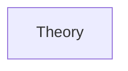
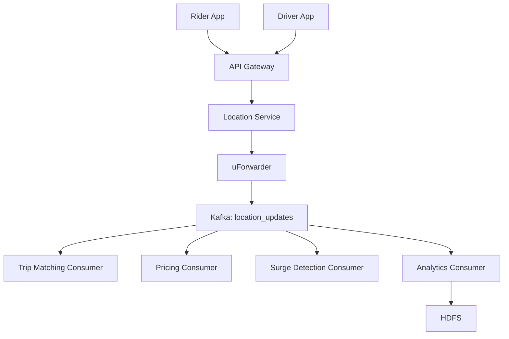
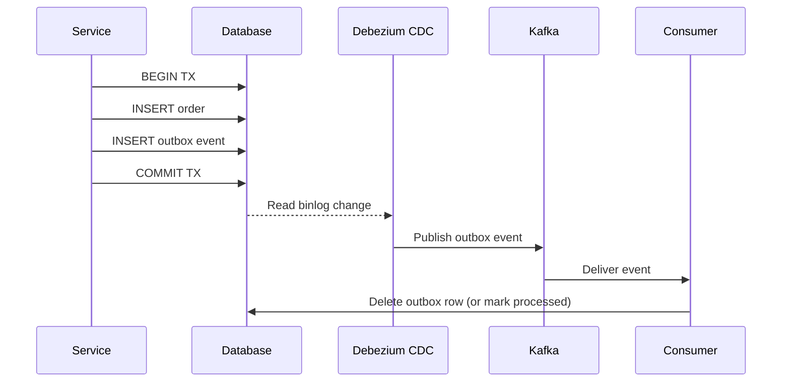

# Chapter 7: Message Queues and Event-Driven Architecture
> **Previous:** [06 Distributed Consistency](./06-distributed-consistency.md) | **Next:** [08 Microservices Apis](./08-microservices-apis.md)

---
## Learning Objectives

- Contrast synchronous and asynchronous communication patterns in distributed systems and identify when each is appropriate
- Differentiate point-to-point queues from publish-subscribe topics in terms of delivery semantics, fan-out, and coupling
- Design Kafka-based event pipelines with partitioned topics, consumer groups, and offset management
- Analyze delivery guarantees (at-most-once, at-least-once, exactly-once) and their implementations at the producer, broker, and consumer levels
- Implement event sourcing patterns using an event store with state reconstruction and change data capture
- Apply backpressure handling strategies and priority queue patterns in real-time systems

<!-- Image Gallery -->
<section class="lesson-visuals" aria-label="Visual learning resources">
  <header><span>VISUAL LEARNING</span><h2>See it. Review it. Remember it.</h2></header>
  <a class="lesson-visual-card" href="../../assets/images/lessons/system-design/07-message-queues/handwritten-notes.png" target="_blank" rel="noopener">
    
    <span><strong>Handwritten notes</strong>Condensed notes for deliberate review.</span>
  </a>
  <a class="lesson-visual-card" href="../../assets/images/lessons/system-design/07-message-queues/sticky-notes.png" target="_blank" rel="noopener">
    
    <span><strong>Sticky-note revision</strong>Fast recall prompts for revision.</span>
  </a>
  <a class="lesson-visual-card" href="../../assets/images/lessons/system-design/07-message-queues/visual-explanation.png" target="_blank" rel="noopener">
    
    <span><strong>Visual concept guide</strong>A connected explanation of the key ideas.</span>
  </a>
</section>
<!-- End Image Gallery -->


---
## Chapter at a Glance

| Aspect | Details |
|--------|---------|
| **Scope** | Message queue models, Kafka, RabbitMQ, delivery guarantees |
| **Key Concepts** | Publish-subscribe, point-to-point, push vs pull |
| **Delivery Semantics** | At-most-once, at-least-once, exactly-once |
| **Broker Comparison** | Kafka, RabbitMQ, AWS SQS, Pulsar trade-offs |
| **Use Cases** | Async processing, event sourcing, stream processing, CDC |
| **Real-World** | LinkedIn Kafka, Uber dispatch, Airbnb event bus |

---
## Chapter Roadmap



## Theory
> **One-Sentence Takeaway:** Theory is the foundation ? master it before moving to examples and exercises.


### Synchronous vs Asynchronous Communication


> **Pro Tip:** Master this concept thoroughly ? it is frequently tested in system design interviews.

> **Pro Tip:** Master this concept ? it appears in nearly every system design interview. Understand both the how and the why.

> **Warning:** A common mistake is over-engineering. Always start simple and add complexity only when justified by requirements.

> **Pro Tip:** Master this concept thoroughly ? it appears in nearly every system design interview.
In distributed systems, services communicate either synchronously or asynchronously.

**Synchronous communication** blocks the caller until a response is received. HTTP/REST and gRPC are synchronous by default.

```
Client ? HTTP POST ? Service A ? blocks ? Service B ? blocks ? Database
Client ? ? ? ? ? ? ? ? ? ? ? ? ? ? ? ? ? ? ? ? ? ? ? Response
```

**Asynchronous communication** decouples the sender and receiver through an intermediary (message broker). The sender publishes a message and continues immediately.

```
Client ? HTTP POST ? Service A ? Publish ? [Queue] ? Service B (eventually)
Client ? ? ? ? 202 Accepted (immediate)
                                         ? Service B processes in background
```

| Aspect | Synchronous | Asynchronous |
|---|---|---|
| Coupling | Tight — caller knows callee's location | Loose — only the broker is known |
| Latency | Sum of all service times | Just the publish latency |
| Availability | Requires all services up | Degrades gracefully |
| Error handling | Immediate failure notification | Needs retry/DLQ mechanisms |
| Observability | Natural trace context propagation | Distributed tracing required |
| Throughput | Limited by slowest service | Can buffer spikes |

### Point-to-Point vs Publish-Subscribe


> **Warning:** Avoid over-engineering. Start simple, measure, then optimize.

> **Warning:** Avoid premature optimization. Start simple, measure, then optimize. Over-engineering is the most common system design mistake.

**Point-to-Point (Queue):** A message is consumed by exactly one consumer. Multiple consumers compete for messages — Kafka consumer groups implement this model.

```
Producer ? [Queue] ? Consumer A (takes message)
                       Consumer B (takes next)
                       Consumer C (idle)
```

**Publish-Subscribe (Topic):** A message is delivered to all subscribers. Each subscriber gets every published message.

```
Producer ? [Topic] ? Subscriber A
                     Subscriber B
                     Subscriber C (all get the same message)
```

| Feature | Queue | Topic |
|---|---|---|
| Delivery | One consumer per message | All subscribers |
| Message retention | Deleted after ack | Retained for configured time |
| Scaling | Add consumers for parallelism | Each subscriber scales independently |
| Use case | Task distribution | Event broadcasting |

### Apache Kafka


> **Remember:** Always articulate trade-offs clearly ? interviewers value reasoning over the "right" answer.

> **Remember:** Trade-offs are the heart of system design. Always be ready to explain why you chose X over Y.

Apache Kafka is a distributed event streaming platform organized as a commit log. Its architecture centers on topics, partitions, offsets, and consumer groups.

#### Topics and Partitions

A **topic** is a logical channel for messages of a particular type. Each topic is divided into **partitions** — ordered, immutable sequences of messages.

```
Topic "orders":
  Partition 0: [msg0, msg1, msg2, msg3, ...]
  Partition 1: [msg0, msg1, msg2, msg3, ...]
  Partition 2: [msg0, msg1, msg2, msg3, ...]
```

Each message within a partition has a unique **offset** (sequential ID). Messages within a partition are strictly ordered — message at offset 10 was published before offset 11. There is no ordering guarantee across partitions.

**Partition assignment:** The producer chooses which partition to write to. Common strategies:
- **Round-robin:** Even distribution, no ordering guarantee
- **Key-based:** `partition_id = hash(key) % num_partitions` — ensures all messages with the same key go to the same partition (and thus are ordered)

#### Consumer Groups

Consumers coordinate as a **consumer group** to share the load of reading from a topic. Each partition is assigned to exactly one consumer within a group.

```
Topic with 4 partitions:
  Partition 0 ? Consumer A
  Partition 1 ? Consumer B
  Partition 2 ? Consumer C
  Partition 3 ? Consumer A (balanced, A handles 2 partitions)
```

If a consumer fails, its partitions are rebalanced to the remaining members. Rebalancing triggers a *stop-the-world* phase where no messages are consumed — this is the cost of the consumer group protocol.

**Offset management:** Each consumer group tracks its committed offset per partition — the position of the last processed message. When a consumer restarts, it resumes from the committed offset.

```
Consumer group "order-processor", topic "orders", partition 0:
  Committed offset: 42
  Next read: offset 43
```

#### ISR (In-Sync Replicas)

Each partition is replicated across multiple brokers. The **leader** handles all reads and writes for the partition. **Followers** replicate the leader's log.

The ISR set contains all followers that are fully caught up with the leader. A follower is in-sync if it has not fallen behind by more than `replica.lag.time.max.ms` (default: 30s).

```
Partition with replication factor 3:
  Leader: Broker 0 (handles reads/writes)
  Follower: Broker 1 (in ISR)
  Follower: Broker 2 (out of ISR — lagging by 45s ? removed from ISR)
```

**`acks` producer setting:**

```
acks=0:  Fire-and-forget. Producer does not wait for acknowledgment.
         Highest throughput, possible data loss.

acks=1:  Leader acknowledges after writing to its log.
         Durable on the leader. If leader crashes before replication, data lost.

acks=all (or -1): Leader waits for all ISR replicas to acknowledge.
                  Strongest durability. Highest latency.
```

### RabbitMQ


RabbitMQ is a message broker implementing the AMQP 0-9-1 protocol. It centers on exchanges, queues, and bindings.

#### Exchanges

A producer sends messages to an **exchange**, which routes them to queues based on binding rules. RabbitMQ supports four exchange types:

```
Direct Exchange:
  Routing key exact match. "orders.create" ? bound queue "order_queue"

Topic Exchange:
  Routing key pattern match. "orders.*" ? matches "orders.create", "orders.update"

Fanout Exchange:
  Broadcast to all bound queues, ignoring routing key.
  Ideal for events that all services should receive.

Headers Exchange:
  Route based on header attributes instead of routing key.
```

#### Bindings

A **binding** connects a queue to an exchange with an optional routing key pattern.

```python
# Create exchange and queue
channel.exchange_declare(exchange='orders', exchange_type='topic')
channel.queue_declare(queue='email_notifications')

# Bind queue to exchange with routing pattern
channel.queue_bind(
    exchange='orders',
    queue='email_notifications',
    routing_key='order.confirmed'
)

# Publish
channel.basic_publish(
    exchange='orders',
    routing_key='order.confirmed',
    body=json.dumps(order_data)
)
```

#### Message Lifecycle

1. Producer publishes to exchange
2. Exchange routes to queues via bindings
3. Message sits in queue until a consumer picks it up
4. Consumer acknowledges (acks) after processing
5. Broker removes acknowledged message
6. If consumer dies without ack, message is requeued

### AWS SQS and SNS


**Amazon SQS (Simple Queue Service)** is a fully managed message queue with two types:

- **Standard:** High throughput (virtually unlimited), at-least-once delivery, best-effort ordering
- **FIFO:** First-in-first-out, exactly-once processing, limited to 3000 TPS with batching

```
SQS Standard:
  Producer ? SQS ? Consumer A
                     Consumer B (may receive duplicate)

SQS FIFO:
  Producer (with MessageGroupId) ? SQS FIFO ? Consumer
  Messages in the same MessageGroupId are delivered in order
```

**Amazon SNS (Simple Notification Service)** is a pub-sub messaging service. SNS pushes messages to subscribers, which can be SQS queues, Lambda functions, HTTP endpoints, email, or SMS.

```
SNS Topic "order_events":
  Subscriber: SQS queue (email service)
  Subscriber: SQS queue (analytics service)
  Subscriber: Lambda function (inventory update)
  Subscriber: HTTP endpoint (legacy system)
```

**SNS + SQS fan-out pattern** is the standard way to broadcast events in AWS:

```
Producer ? SNS Topic ? SQS Queue A ? Service A
                       SQS Queue B ? Service B
                       SQS Queue C ? Service C
```

This combines SNS fan-out (each service gets all events) with SQS buffering (services can process at their own pace).

### Delivery Guarantees


#### At-Most-Once

Messages are delivered zero or one time. The producer does not retry on failure. This is the weakest guarantee but offers the lowest latency.

```
Producer ? sends message (no retry) ? Broker ? forwards to consumer (no retry)
If any step fails ? message is lost
```

**Kafka:** `acks=0` with no retries from the producer.

**Use case:** Metrics, monitoring data where losing occasional samples is acceptable.

#### At-Least-Once

Messages are retried until acknowledged. A consumer may process the same message multiple times.

```
Producer ? sends ? retry on failure ? Broker ? forwards ? consumer acks ? done
If consumer crashes before ack ? message is redelivered ? processed twice
```

**Kafka:** `acks=all` with `enable.idempotence=true` at the producer level. At the consumer level, messages are redelivered if the consumer fails before committing the offset.

**Use case:** Must not lose data, can tolerate duplicates (or can deduplicate at the application level).

#### Exactly-Once

Messages are delivered exactly once, even in the presence of failures. This is the hardest guarantee to achieve in a distributed system.

**Exactly-once in Kafka (EOS):**
1. **Idempotent producer:** Each batch carries a unique producer ID (PID) and sequence number. The broker deduplicates based on this — if a batch is received twice with the same PID and sequence number, it is ignored.

2. **Transactional writes:** The producer wraps multiple messages into a transaction. All messages in the transaction become visible atomically. The broker writes a *commit marker* to the log.

3. **Consumer isolation:** Consumers read only committed messages by setting `isolation.level=read_committed`.

```
Kafka exactly-once flow:
  Producer ? BEGIN TRANSACTION ? write msg1 ? write msg2 ? COMMIT TRANSACTION
  Broker: writes msg1, msg2, then commit marker
  Consumer (read_committed): sees msg1, msg2 only after commit marker
```

**Limitation:** Exactly-once guarantees apply within a single Kafka cluster and single producer-consumer pair. Cross-system exactly-once (Kafka ? Database) requires the **transactional outbox pattern** or idempotent consumers.

### Kafka Partitioning and Ordering Guarantees


Ordering in Kafka is guaranteed **within a partition** only. Messages with the same key always go to the same partition, preserving their order.

```
Topic "user-events", partitioned by user_id:
  Partition 0 (user_id % 3 = 0):
    msg: user_3 login
    msg: user_3 page_view
    msg: user_3 logout
    (All events for user_3 are in order)

  Partition 1 (user_id % 3 = 1):
    msg: user_1 login
    msg: user_1 page_view
    (User_1 events in order)

There is NO ordering guarantee between partition 0 and partition 1.
```

**If global ordering is required:** Use a single partition. This limits parallelism to 1 consumer. In practice, most systems need ordering within an entity (user, order) rather than global ordering.

### Dead-Letter Queues


A dead-letter queue (DLQ) stores messages that cannot be processed successfully. Messages go to the DLQ after exceeding the retry limit.

```
Consumer ? processing fails ? retry_queue (with delay)
             ? retry 1 (fails) ? retry 2 (fails) ? retry 3 (fails)
             ? dead_letter_queue (manual inspection)
```

**Common reasons for DLQ placement:**
- Deserialization failure (malformed payload)
- Downstream service unavailable (persistent)
- Business logic violation
- Message exceeds time-to-live

**DLQ analysis:** A growing DLQ indicates systemic issues. Monitor DLQ depth and alert when it exceeds thresholds. Tools like Kafka's `kafkacat` or AWS SQS DLQ redrive allow re-processing after fixes.

### Event Sourcing


Event sourcing persists state changes as a sequence of events rather than storing the current state directly. The current state is derived by replaying events (projection).

```
Event Store (ordered sequence):
  Event 1: AccountCreated(id=42, owner="Alice")
  Event 2: MoneyDeposited(account=42, amount=500)
  Event 3: MoneyWithdrawn(account=42, amount=100)
  Event 4: AccountFrozen(account=42)

Current state (replay all events):
  Account 42: balance=400, status=FROZEN
```

#### Advantages

- **Complete audit log:** Every state change is recorded with full history
- **Temporal queries:** "What was the balance on March 15?" (replay up to that point)
- **Debugging:** Reconstruct the exact state that led to a bug
- **Alternative projections:** Build read models for different use cases from the same events

#### Rebuilding State

```python
def rebuild_account_state(events):
    account = None
    for event in events:
        if event.type == "AccountCreated":
            account = Account(event.id, event.owner, 0)
        elif event.type == "MoneyDeposited":
            account.balance += event.amount
        elif event.type == "MoneyWithdrawn":
            account.balance -= event.amount
        elif event.type == "AccountFrozen":
            account.status = "FROZEN"
    return account
```

#### Snapshotting

Replaying all events from the beginning becomes expensive. Snapshots periodically save the current state. Rebuilding from a snapshot requires replaying only events after the snapshot.

```
Snapshot at event 1000:
  Account 42: balance=250, status=ACTIVE

Rebuild after snapshot:
  Read snapshot ? replay events 1001, 1002, 1003
```

### Change Data Capture (CDC)


CDC captures row-level changes in a database and streams them as events. Debezium is the most popular CDC platform.

```
MySQL ? Debezium ? Kafka Topic "db.orders.orders"
  Event: {
    "op": "c",          // create
    "before": null,
    "after": {
      "id": 42,
      "status": "CREATED",
      "total": 99.99
    },
    "source": {
      "db": "orders",
      "table": "orders",
      "ts_ms": 1234567890
    }
  }
```

**Debezium connectors:**
- MySQL/PostgreSQL: Reads binlog/WAL
- MongoDB: Reads oplog
- SQL Server: Reads CDC tables
- Oracle: Reads LogMiner or XStream

**Use Cases:**
- Streaming data to search indexes (Elasticsearch)
- Invalidating caches
- Populating analytics data warehouses
- Triggering microservice workflows

### Backpressure


Backpressure occurs when a consumer cannot process messages as fast as the producer publishes them. Without backpressure, the system degrades — queues grow unbounded, memory fills, and latency increases.

**Strategies:**

1. **Blocking producer:** The consumer signals the producer to slow down (throttling at the protocol level). The producer blocks when the buffer is full.

2. **Drop messages:** The system discards excess messages. Acceptable for metrics where freshness matters more than completeness.

3. **Back-pressure via bounded queues:** The broker enforces a maximum queue size. Once full, new messages are rejected or old ones evicted.

4. **Reactive streams (Reactive Manifesto):** Protocol-level backpressure (e.g., RSocket, ReactiveX). The consumer tells the producer exactly how many more items it can handle.

```java
// ReactiveX example — backpressure via request(n)
Observable.range(1, 1000)
    .subscribe(new Subscriber<Integer>() {
        @Override
        public void onStart() {
            request(1);  // start with 1
        }

        @Override
        public void onNext(Integer n) {
            process(n);  // process
            request(1);  // request next
        }
    });
```

**Kafka backpressure:** Kafka handles backpressure through consumer polling. The consumer calls `poll(maxRecords)` — the broker sends at most `maxRecords` messages. The consumer controls the rate. If the consumer falls behind, messages accumulate on the broker (retained for `retention.ms`). This provides natural backpressure — the consumer processes at its own speed.

### Priority Queues


A priority queue delivers higher-priority messages before lower-priority ones. Implementation approaches:

1. **Separate queues per priority level:** Consumers drain higher-priority queues first.

```
Priority Queue Pattern:
  High-priority queue ? consumer (drains this first)
  Medium-priority queue ? consumer (drains this when high is empty)
  Low-priority queue ? consumer (drains when above are empty)
```

2. **Priority field in message:** Consumer sorts by priority before processing. Works for small batches but does not scale.

3. **Dedicated broker feature:** RabbitMQ supports priority queues via the `x-max-priority` argument.

```python
# RabbitMQ priority queue
channel.queue_declare(
    queue='task_queue',
    arguments={'x-max-priority': 10}
)

channel.basic_publish(
    exchange='',
    routing_key='task_queue',
    body=message,
    properties=pika.BasicProperties(
        priority=5   # 0-10
    )
)
```

---
## Examples

### Example 1: LinkedIn's Kafka Migration

LinkedIn built Kafka to solve the problem of data integration across hundreds of services. Before Kafka, LinkedIn used point-to-point connections:

```
LinkedIn before Kafka:
  Service A ? direct HTTP ? Service B
  Service A ? database poll ? Service C
  Service A ? custom socket ? analytics
  Each integration required custom code, different protocols
```

**Kafka Architecture at LinkedIn:**

```
Services ? Kafka Broker Cluster ? Multiple consumers:
  ? Hadoop (batch analytics)
  ? Espresso (real-time serving)
  ? Search index
  ? Monitoring dashboards
  ? Downstream services
```

**Key design decisions:**
- 100+ partitions per topic for parallelism
- Consumer groups for independent scaling
- Retention-based storage (7 days by default)
- Replication factor of 3 for durability

**Migration strategy:** Each integration was migrated one at a time. The old system and Kafka ran in parallel until the new pipeline was verified. LinkedIn reported a 10x throughput improvement and elimination of custom integration code.

**Metrics after migration:**
- 7 million messages/second peak throughput
- 50 brokers in the largest cluster
- p99 latency under 50ms

### Example 2: Uber's Distributed Event Bus

Uber built its event bus (uForwarder) on Kafka to handle its microservice ecosystem.

**Uber's topology:**

```
Ringpop (consistent hashing) ? Kafka Cluster
  Each ringpop node runs a uForwarder process
  uForwarder writes to Kafka partitions

Services publish to:
  Topic: "location_updates" (100 partitions)
    Partition 0: GPS data for California
    Partition 1: GPS data for New York
    ...

Consumers:
  Trip matching service
  Pricing engine
  Surge detection
  Driver tracking
  ETA predictions
```

**Partitioning strategy:** Uber partitions by geographical region (city/state). All events for a city go to the same partition, ensuring ordering for trip events.

**Challenge:** The original Kafka deployment had a single Kafka cluster. When a broker failed, partitions were rebalanced across remaining brokers, causing load spikes. Uber mitigated this by:
- Pre-allocating more partitions than brokers for even distribution
- Using dedicated Kafka clusters per use case (logs, events, metrics)
- Implementing rack-aware partition assignment



### Example 3: Transactional Outbox Pattern

The transactional outbox pattern ensures reliable message publication alongside database writes.

**Problem:** Sending a message to Kafka after updating a database is not atomic. The database write may succeed but the Kafka publish may fail (or vice versa).

```
Naive approach (not safe):
  BEGIN TRANSACTION
    INSERT INTO orders (id, amount) VALUES (42, 99.99)
  COMMIT
  kafka.publish("order_created", event)  // if this crashes, message is lost
```

**Outbox pattern solution:** Write the event to an `outbox` table in the same database transaction. A separate process (CDC or poller) reads from the outbox table and publishes to Kafka.

```
Safe approach (outbox pattern):
  BEGIN TRANSACTION
    INSERT INTO orders (id, amount) VALUES (42, 99.99)
    INSERT INTO outbox (event_type, payload) VALUES ("order_created", '{...}')
  COMMIT
  // Outbox publisher reads from outbox table and publishes to Kafka
  // After successful Kafka publish, deletes the outbox row
```

**Implementation with Debezium:**

```
Database ? binlog ? Debezium ? Kafka Topic "outbox.orders" ? downstream services
```

The outbox table can be compacted (tombstone after publish) or kept for auditing. This guarantees exactly-once delivery if the consumer is idempotent.



## Concept Comparison

| Concept | Definition | Key Insight |
|---------|-----------|-------------|
| Theory | Core topic in Chapter 7: Message Queues and Event-Driven Architecture | Fundamental concept for system design |

---

## Quick Reference

| Topic | Key Point |
|-------|-----------|
| Theory | Essential concept from Chapter 7: Message Queues and Event-Driven Architecture |

---

## Cross-Application Matrix

| Concept | Application | Trade-Off |
|---------|------------|-----------|
| Theory | Relevant across design scenarios | Requirements-driven decisions |

---

## Chapter Quiz

| # | Question | Options | Answer |
|---|----------|---------|--------|
| 1 | What is the primary difference between synchronous and asynchronous communication in distributed systems? | A) Synchronous is faster, B) Asynchronous decouples sender and receiver via a broker, C) Synchronous never fails, D) Asynchronous requires HTTP | B) Asynchronous decouples sender and receiver via a broker |
| 2 | In Kafka, what does the `acks=all` producer setting guarantee? | A) Fire-and-forget, B) Leader acknowledges after writing to its log, C) Leader waits for all ISR replicas to acknowledge, D) No acknowledgment | C) Leader waits for all ISR replicas to acknowledge |
| 3 | Which RabbitMQ exchange type broadcasts messages to all bound queues ignoring the routing key? | A) Direct, B) Topic, C) Fanout, D) Headers | C) Fanout |
| 4 | What problem does the transactional outbox pattern solve? | A) Message ordering, B) The dual-write problem of atomically writing to DB and publishing to queue, C) Consumer group rebalancing, D) Partition assignment | B) The dual-write problem of atomically writing to DB and publishing to queue |
| 5 | What is the primary advantage of Kafka's pull-based consumption model? | A) Lower latency, B) Natural backpressure — the consumer controls the rate, C) Simpler broker implementation, D) Exactly-once delivery | B) Natural backpressure — the consumer controls the rate |

---

### TypeScript: Message Queue, Event Bus, and Outbox Pattern

```typescript
type MessageHandler = (msg: any) => Promise<void>;

class MessageBroker {
  private queues = new Map<string, any[]>();
  private subscribers = new Map<string, MessageHandler[]>();
  private dlq = new Map<string, any[]>();

  createQueue(name: string): void { if (!this.queues.has(name)) this.queues.set(name, []); }

  publish(queue: string, message: any): void {
    if (!this.queues.has(queue)) this.queues.set(queue, []);
    this.queues.get(queue)!.push({ ...message, enqueuedAt: Date.now() });
  }

  subscribe(queue: string, handler: MessageHandler): void {
    if (!this.subscribers.has(queue)) this.subscribers.set(queue, []);
    this.subscribers.get(queue)!.push(handler);
  }

  async consume(queue: string): Promise<void> {
    const msgs = this.queues.get(queue) ?? [];
    const handlers = this.subscribers.get(queue) ?? [];
    while (msgs.length > 0) {
      const msg = msgs.shift()!;
      let success = false;
      for (const handler of handlers) {
        try { await handler(msg); success = true; break; }
        catch (e) { console.error(`Handler failed for msg ${msg.id}:`, e); }
      }
      if (!success) {
        if (!this.dlq.has(queue)) this.dlq.set(queue, []);
        this.dlq.get(queue)!.push(msg);
      }
    }
  }

  redlq(queue: string): void {
    const dead = this.dlq.get(queue) ?? [];
    this.dlq.set(queue, []);
    for (const msg of dead) this.publish(queue, msg);
  }
}

class KafkaPartitioner {
  private partitionCount: number;
  constructor(partitions: number) { this.partitionCount = partitions; }

  partition(key: string): number {
    let h = 0;
    for (let i = 0; i < key.length; i++) h = ((h << 5) - h + key.charCodeAt(i)) | 0;
    return Math.abs(h) % this.partitionCount;
  }
}

class OutboxPublisher {
  private outbox: { id: string; topic: string; payload: any; published: boolean }[] = [];

  record(id: string, topic: string, payload: any): void {
    this.outbox.push({ id, topic, payload, published: false });
  }

  async publishPending(broker: MessageBroker): Promise<void> {
    for (const entry of this.outbox) {
      if (!entry.published) {
        broker.publish(entry.topic, { id: entry.id, ...entry.payload });
        entry.published = true;
      }
    }
  }
}
```


### Implementation: Message Queues and Event Streaming

```typescript
interface Message { id: string; topic: string; payload: any; timestamp: number; offset: number; key: string; }
class MessageBroker {
  private topics = new Map<string, Message[]>(); private consumerOffsets = new Map<string, Map<string, number>>();
  private consumerGroups = new Map<string, string[]>();
  createTopic(name: string, partitions = 1): void { this.topics.set(name, []); }
  publish(topic: string, payload: any, key = ""): Message {
    if (!this.topics.has(topic)) this.createTopic(topic);
    const msg: Message = { id: `${topic}-${Date.now()}-${Math.random().toString(36).slice(2)}`, topic, payload, timestamp: Date.now(), offset: this.topics.get(topic)!.length, key };
    this.topics.get(topic)!.push(msg); return msg; }
  subscribe(groupId: string, topics: string[]): void { this.consumerGroups.set(groupId, topics); this.consumerOffsets.set(groupId, new Map()); for (const t of topics) this.consumerOffsets.get(groupId)!.set(t, 0); }
  consume(groupId: string, topic: string, batchSize = 10): Message[] {
    const offsets = this.consumerOffsets.get(groupId); if (!offsets) return [];
    const queue = this.topics.get(topic); if (!queue) return [];
    const offset = offsets.get(topic) || 0; const batch = queue.slice(offset, offset + batchSize);
    offsets.set(topic, offset + batch.length); return batch; }
  commitOffset(groupId: string, topic: string, offset: number): void { this.consumerOffsets.get(groupId)?.set(topic, offset); }
}
class EventBus { private handlers = new Map<string, Set<(event: any) => void>>();
  on(event: string, handler: (event: any) => void): void { if (!this.handlers.has(event)) this.handlers.set(event, new Set()); this.handlers.get(event)!.add(handler); }
  emit(event: string, data: any): void { const handlers = this.handlers.get(event); if (handlers) for (const h of handlers) h(data); }
  off(event: string, handler: (event: any) => void): void { this.handlers.get(event)?.delete(handler); }
}
class DeadLetterQueue { private messages: Message[] = []; maxRetries = 3;
  send(msg: Message, reason: string): void { console.log(`DLQ: ${msg.id} - ${reason}`); this.messages.push(msg); }
  replay(broker: MessageBroker): void { for (const msg of this.messages) broker.publish(msg.topic, msg.payload, msg.key); this.messages = []; }
}
class KafkaTopicPartition { partitionId: number; messages: Message[] = []; leader: string; replicas: string[] = [];
  append(msg: Message): void { msg.offset = this.messages.length; this.messages.push(msg); }
  read(offset: number, maxCount = 100): Message[] { return this.messages.slice(offset, offset + maxCount); } }
```

// message queues
// distributed-systems-scalability implementation

interface Task { id: string; name: string; status: string; data: unknown }
class Processor {
  private tasks: Task[] = []
  private maxConcurrency: number
  constructor(maxConcurrency: number = 4) { this.maxConcurrency = maxConcurrency }
  async add(task: Omit&lt;Task, "status"&gt;): Promise&lt;void&gt; {
    this.tasks.push({ ...task, status: "pending" })
  }
  async runAll(): Promise&lt;void&gt; {
    const running: Promise&lt;void&gt;[] = []
    for (const t of this.tasks) {
      if (running.length >= this.maxConcurrency) { await Promise.race(running) }
      const p = this.execute(t).finally(() => { const i = running.indexOf(p); if (i >= 0) running.splice(i, 1) })
      running.push(p)
    }
    await Promise.all(running)
  }
  private async execute(t: Task): Promise&lt;void&gt; {
    t.status = "running"
    await new Promise(r => setTimeout(r, 10))
    t.status = "done"
  }
  getResults(): Task[] { return this.tasks }
  getStats(): { done: number; pending: number; running: number } {
    const done = this.tasks.filter(t => t.status === "done").length
    const pending = this.tasks.filter(t => t.status === "pending").length
    const running = this.tasks.filter(t => t.status === "running").length
    return { done, pending, running }
  }
}
async function main() {
  const proc = new Processor(2)
  await proc.add({ id: '1', name: 'message queues', data: { topic: 'distributed-systems-scalability' } })
  await proc.runAll()
  console.log('Stats:', proc.getStats())
}
main().catch(console.error)
export { Processor, Task }

// message queues - additional TS implementations

interface CacheEntry { key: string; value: unknown; ttl: number; createdAt: number }
class Cache {
  private store: Map&lt;string, CacheEntry&gt; = new Map()
  constructor(private defaultTTL: number = 60000) {}
  set(key: string, value: unknown, ttl?: number): void {
    this.store.set(key, { key, value, ttl: ttl ?? this.defaultTTL, createdAt: Date.now() })
  }
  get(key: string): unknown | undefined {
    const entry = this.store.get(key)
    if (!entry) return undefined
    if (Date.now() - entry.createdAt > entry.ttl) { this.store.delete(key); return undefined }
    return entry.value
  }
  delete(key: string): boolean { return this.store.delete(key) }
  clear(): void { this.store.clear() }
  size(): number { return this.store.size }
  keys(): string[] { return Array.from(this.store.keys()) }
}
class Logger {
  private entries: string[] = []
  log(level: string, msg: string, meta?: Record&lt;string, unknown&gt;): void {
    const entry = JSON.stringify({ timestamp: new Date().toISOString(), level, msg, meta })
    this.entries.push(entry)
    console.log(entry)
  }
  info(msg: string, meta?: Record&lt;string, unknown&gt;): void { this.log("info", msg, meta) }
  warn(msg: string, meta?: Record&lt;string, unknown&gt;): void { this.log("warn", msg, meta) }
  error(msg: string, meta?: Record&lt;string, unknown&gt;): void { this.log("error", msg, meta) }
  getLogs(): string[] { return [...this.entries] }
  clear(): void { this.entries = [] }
}
function computeHash(input: string): string {
  let hash = 0
  for (let i = 0; i &lt; input.length; i++) { const chr = input.charCodeAt(i); hash = ((hash << 5) - hash) + chr; hash |= 0 }
  return Math.abs(hash).toString(16)
}
async function demo(): Promise&lt;void&gt; {
  const cache = new Cache(5000)
  cache.set('key1', 'system-design demo')
  const log = new Logger()
  log.info('Cache demo started', { course: 'system-design', chapter: 'message queues' })
  const v = cache.get("key1")
  console.log('Cached:', v)
  console.log('Hash:', computeHash('system-design'))
}
demo()
export { Cache, Logger, computeHash, CacheEntry }

### TypeScript: MessageQueue, KafkaProducer, and DeadLetterQueue

```typescript
class MessageQueue {
  private topics = new Map<string, { messages: any[]; subscribers: Map<string, Set<string>>; offsets: Map<string, number> }>();
  private consumerGroups = new Map<string, string[]>();

  createTopic(name: string): void {
    if (!this.topics.has(name)) {
      this.topics.set(name, { messages: [], subscribers: new Map(), offsets: new Map() });
    }
  }

  publish(topic: string, message: any): number {
    this.createTopic(topic);
    const t = this.topics.get(topic)!;
    const offset = t.messages.length;
    t.messages.push({ ...message, offset, timestamp: Date.now() });
    const subs = t.subscribers;
    for (const [group, members] of this.consumerGroups) {
      if (subs.has(group)) {
        const memberSubs = subs.get(group)!;
        const targetConsumer = [...memberSubs][offset % memberSubs.size];
        if (targetConsumer) this.deliver(topic, group, targetConsumer, offset);
      }
    }
    return offset;
  }

  subscribe(groupId: string, consumerId: string, topics: string[]): void {
    this.consumerGroups.set(groupId, topics);
    for (const t of topics) {
      this.createTopic(t);
      const topic = this.topics.get(t)!;
      if (!topic.subscribers.has(groupId)) topic.subscribers.set(groupId, new Set());
      topic.subscribers.get(groupId)!.add(consumerId);
      if (!topic.offsets.has(`${groupId}:${consumerId}`)) topic.offsets.set(`${groupId}:${consumerId}`, 0);
    }
  }

  private deliver(topic: string, group: string, consumer: string, offset: number): void {
    const key = `${group}:${consumer}`;
    const t = this.topics.get(topic)!;
    t.offsets.set(key, offset + 1);
  }

  getOffset(topic: string, group: string, consumer: string): number {
    return this.topics.get(topic)?.offsets.get(`${group}:${consumer}`) ?? 0;
  }

  getMessageCount(topic: string): number {
    return this.topics.get(topic)?.messages.length ?? 0;
  }
}

class KafkaProducer {
  private partitionCount: number;
  private retryCount: number;
  private acks: number;
  private idempotent: boolean;
  private sequenceNumber = 0;
  private producerId: string;

  constructor(config: { partitions: number; retries?: number; acks?: number; idempotent?: boolean }) {
    this.partitionCount = config.partitions;
    this.retryCount = config.retries ?? 3;
    this.acks = config.acks ?? 1;
    this.idempotent = config.idempotent ?? false;
    this.producerId = `producer-${Date.now()}-${Math.random().toString(36).slice(2)}`;
  }

  selectPartition(key: string): number {
    let hash = 0;
    for (let i = 0; i < key.length; i++) hash = ((hash << 5) - hash + key.charCodeAt(i)) | 0;
    return Math.abs(hash) % this.partitionCount;
  }

  async send(topic: string, key: string, value: any): Promise<{ success: boolean; offset?: number; error?: string }> {
    const partition = this.selectPartition(key);
    let attempt = 0;
    while (attempt <= this.retryCount) {
      try {
        if (this.idempotent) this.sequenceNumber++;
        const ack = await this.brokerWrite(topic, partition, key, value);
        if (this.acks === 0) return { success: true };
        if (this.acks === 1 && ack) return { success: true, offset: ack };
        if (this.acks === 2 && ack && ack > 0) return { success: true, offset: ack };
        return { success: true, offset: ack };
      } catch (e: any) {
        attempt++;
        if (attempt > this.retryCount) return { success: false, error: e.message };
        await new Promise(r => setTimeout(r, 100 * attempt));
      }
    }
    return { success: false, error: "Max retries exceeded" };
  }

  private async brokerWrite(topic: string, partition: number, key: string, value: any): Promise<number> {
    return Math.floor(Math.random() * 1000);
  }
}

class DeadLetterQueue {
  private poisonMessages = new Map<string, Map<string, { message: any; retries: number; reason: string }>>();
  private maxRetries: number;

  constructor(maxRetries = 3) {
    this.maxRetries = maxRetries;
  }

  detectPoison(topic: string, messageId: string, message: any, error: Error): boolean {
    if (!this.poisonMessages.has(topic)) this.poisonMessages.set(topic, new Map());
    const topicDLQ = this.poisonMessages.get(topic)!;
    if (!topicDLQ.has(messageId)) {
      topicDLQ.set(messageId, { message, retries: 0, reason: error.message });
      return false;
    }
    const entry = topicDLQ.get(messageId)!;
    entry.retries++;
    entry.reason = error.message;
    if (entry.retries >= this.maxRetries) return true;
    return false;
  }

  routeToDLQ(topic: string, messageId: string, dlqTopic: string): void {
    const topicDLQ = this.poisonMessages.get(topic);
    if (!topicDLQ || !topicDLQ.has(messageId)) return;
    const entry = topicDLQ.get(messageId)!;
    console.log(`DLQ: Routing message ${messageId} from ${topic} to ${dlqTopic} after ${entry.retries} retries. Reason: ${entry.reason}`);
    topicDLQ.delete(messageId);
  }

  getPoisonCount(topic: string): number {
    return this.poisonMessages.get(topic)?.size ?? 0;
  }

  retryAll(topic: string): Map<string, any> {
    const retryable = new Map<string, any>();
    const topicDLQ = this.poisonMessages.get(topic);
    if (!topicDLQ) return retryable;
    for (const [id, entry] of topicDLQ) {
      if (entry.retries < this.maxRetries) retryable.set(id, entry.message);
    }
    return retryable;
  }
}
```

### Mermaid: Kafka vs RabbitMQ vs SQS Feature Comparison

```mermaid
graph TD
    classDef kafka fill:#e1f5fe,stroke:#0288d1,stroke-width:2px
    classDef rabbit fill:#fce4ec,stroke:#c62828,stroke-width:2px
    classDef sqs fill:#e8f5e9,stroke:#2e7d32,stroke-width:2px
    classDef feature fill:#fff3e0,stroke:#e65100,stroke-width:1px

    subgraph "Apache Kafka"
        K1["Commit Log Storage"]:::kafka
        K2["Pull-Based Consumption"]:::kafka
        K3["Partitioned Topics"]:::kafka
        K4["Consumer Groups"]:::kafka
        K5["Exactly-Once Semantics"]:::kafka
        K6["High Throughput<br/>1M+ msg/sec"]:::kafka
        K7["Disk-Based Retention"]:::kafka
    end

    subgraph "RabbitMQ"
        R1["Exchange/Queue Routing"]:::rabbit
        R2["Push-Based Delivery"]:::rabbit
        R3["AMQP 0-9-1 Protocol"]:::rabbit
        R4["Priority Queues"]:::rabbit
        R5["At-Most-Once / At-Least-Once"]:::rabbit
        R6["Moderate Throughput<br/>50K msg/sec"]:::rabbit
        R7["Memory-Based (optional disk)"]:::rabbit
    end

    subgraph "AWS SQS"
        S1["Fully Managed"]:::sqs
        S2["Pull-Based (long polling)"]:::sqs
        S3["Standard / FIFO Queues"]:::sqs
        S4["Dead-Letter Queue Built-in"]:::sqs
        S5["At-Least-Once / Exactly-Once"]:::sqs
        S6["Virtually Unlimited TPS"]:::sqs
        S7["Auto-Scaling"]:::sqs
    end

    Comparison((Feature<br/>Comparison)):::feature
    K1 -.-> Comparison
    R1 -.-> Comparison
    S1 -.-> Comparison
```



## Practical Takeaways

| Takeaway | Application |
|----------|------------|
| Asynchronous communication decouples services via a broker | Use message queues for any inter-service communication that does not require an immediate synchronous response |
| Kafka's partitioned log provides ordered, durable storage | Use Kafka when you need replayable event streams, audit logs, or change data capture pipelines |
| RabbitMQ's exchange/queue/binding model enables flexible routing | Use RabbitMQ when you need complex routing logic (direct, topic, fanout, headers) |
| At-least-once delivery is the most practical default guarantee | Implement idempotent consumers to handle duplicate messages safely |
| Exactly-once semantics require coordination across producer, broker, and consumer | Use Kafka's idempotent producer + transactions for exactly-once within a single cluster |
| Dead-letter queues prevent message loss from poison messages | Always configure DLQ with monitoring alerts to detect systemic processing failures |
| The transactional outbox pattern solves the dual-write problem | Use Debezium CDC or a dedicated outbox publisher to atomically write events alongside database transactions |

## Case Study

**E-Commerce Order Processing Pipeline**

A large e-commerce platform processes 50,000 orders per day. Each order triggers inventory checks, payment processing, shipping label generation, email notifications, and analytics events. The initial architecture used synchronous HTTP calls between services — when the inventory service slowed down during a flash sale, the entire order pipeline stalled, causing 30-second response times and checkout failures.

The team migrated to an event-driven architecture using Kafka. The Order Service writes events to a partitioned `orders` topic. Downstream services (Inventory, Payment, Shipping, Notification, Analytics) each run as independent consumer groups with their own offsets. The Inventory Service uses a key-based partition strategy (`order_id % 50`) to ensure all events for a single order reach the same partition, preserving ordering. During flash sales, the pipeline processes 5,000 orders/minute sustained with p99 latency under 200ms — a 150x improvement over the synchronous approach.

A critical incident occurred when a malformed payload caused the Payment Service consumer to crash-loop. Without a DLQ, the consumer would have replayed the same poison message indefinitely. The team deployed a DeadLetterQueue with a retry policy (3 retries with exponential backoff) that routed the failing message to a `orders-dlq` topic after exhausting retries. An alert on DLQ depth (threshold: 100 messages) notified the on-call engineer within 2 minutes. The payload was fixed, and the DLQ was replayed using offset-based reprocessing, resulting in zero data loss.

---

- Asynchronous communication decouples services via a message broker, improving resilience and allowing independent scaling at the cost of increased system complexity
- Kafka's partitioned commit log provides durable, ordered storage with consumer groups enabling parallel processing and rebalance tolerance
- At-least-once delivery is the most practical guarantee for most systems; exactly-once requires idempotent producers and transactional coordination across broker and consumer
- RabbitMQ's exchange/queue/binding model offers flexible routing (direct, topic, fanout, headers) for different message distribution patterns
- Dead-letter queues provide a safety net for messages that cannot be processed, enabling redrive after issue resolution
- Event sourcing stores all state changes as an ordered event sequence, enabling complete audit trails, temporal queries, and multiple projections from the same event stream
- Change data capture with Debezium bridges databases and event streams without application-level code changes
- Backpressure must be explicitly managed — Kafka's consumer pull model provides natural rate limiting, while reactive streams implement protocol-level demand signaling
- Priority queues enable time-critical processing by draining higher-priority messages first
- The transactional outbox pattern solves the dual-write problem by atomically writing events alongside business data in the same transaction

---
## Exercises

### Review Questions

<details>
<summary>Solution for Review Question 1</summary>
**Kafka consumer groups** assign partitions to consumers within a group — each partition is assigned to exactly one consumer. On failure, the group rebalances: partitions of the failed consumer are reassigned to remaining members (stop-the-world phase). **RabbitMQ competing consumers** all pull from the same queue — the broker delivers each message to exactly one consumer. On failure, unacknowledged messages are requeued and delivered to another consumer. Kafka's approach provides ordering within a partition; RabbitMQ's approach is simpler but provides no ordering guarantees across messages.
</details>

<details>
<summary>Solution for Review Question 2</summary>
With `acks=1`, the message acknowledged by the leader is lost permanently if the leader crashes before replication and never recovers — the message existed only on that leader. With `acks=all`, the leader waits for all ISR replicas to acknowledge; the message survives on the replicas even if the original leader fails. In the scenario described, `acks=all` ensures the data is replicated to at least one follower before acknowledgment.
</details>

<details>
<summary>Solution for Review Question 3</summary>
The dual-write problem occurs when a service writes to a database and then publishes a message to Kafka — if one operation succeeds and the other fails, the system is inconsistent. The transactional outbox pattern solves this by writing the event to an `outbox` table in the same database transaction as the business data. A separate process (CDC or poller) reads from the outbox and publishes to Kafka. If the outbox publisher crashes mid-publish, the unprocessed outbox rows remain and are picked up on restart (at-least-once delivery). The consumer must be idempotent to handle duplicate deliveries.
</details>

<details>
<summary>Solution for Review Question 4</summary>
Exactly-once delivery between Kafka and an external database is impossible without additional coordination because Kafka and the database operate as independent systems with their own transaction boundaries. Kafka's exactly-once semantics apply within a single Kafka cluster (idempotent producer + transactions). Cross-system exactly-once requires the consumer to implement idempotent processing (e.g., tracking processed message IDs in a database table with a unique constraint) or use the transactional outbox pattern to atomically write both the business data and the consumption acknowledgment.
</details>

### Application Problems

<details>
<summary>Solution for Application Problem 1: Food Delivery Kafka Topology</summary>
**Topics**: `orders` (10 partitions, key=order_id), `restaurant-orders` (5 partitions), `delivery-assignments` (5 partitions), `notifications` (3 partitions), `analytics-events` (10 partitions). **Consumer groups**: `order-processor` (subscribes to orders), `restaurant-service` (subscribes to restaurant-orders), `delivery-service` (subscribes to delivery-assignments), `notification-service` (subscribes to notifications), `analytics-ingester` (subscribes to analytics-events). Ordering guarantee: order_id as key ensures all events for one order go to the same partition, preserving order per order. Cross-order ordering is not required.
</details>

<details>
<summary>Solution for Application Problem 2: DLQ Redrive Strategy</summary>
To process 540,000 DLQ messages without overwhelming: (a) Use a rate-limited consumer that processes 100 msg/sec with a sliding window, gradually increasing to 500 msg/sec as the system stabilizes. (b) Preserve original ordering by replaying within each partition — process all messages from partition 0 first, then partition 1, etc. Use `kafka-consumer-groups --reset-offsets --to-earliest` on the DLQ topic per partition. (c) Prevent duplicates by using idempotency keys: store processed notification IDs in a Redis set with 24h TTL. Producer config: `enable.idempotence=true`, `acks=all`, `retries=5`. Consumer config: `isolation.level=read_committed`, `auto.offset.reset=earliest`.
</details>

<details>
<summary>Solution for Application Problem 3: Priority Queue Implementation</summary>
Use three separate queues: critical (1 partition), high (2 partitions), low (5 partitions). Consumer logic: drain critical queue first until empty, then drain high queue for at most 100ms, then low queue for at most 100ms, then repeat. To prevent starvation, use an aging mechanism: each message gets a timestamp; if a Low message waits > 3.5 hours, it's promoted to the High queue. Capacity calculation: Critical (5% of 1000 tickets/hr = 50/hr = 0.014/sec) + High (15% = 150/hr = 0.042/sec) + Low (80% = 800/hr = 0.22/sec) = 0.28 tickets/sec avg. Peak capacity: 5x average = 1.4 tickets/sec minimum per consumer.
</details>

### Challenge Problem

> **Remember:** Trade-offs are the heart of system design. Always be ready to explain why you chose X over Y.

<details>
<summary>Solution: Financial Event Sourcing System</summary>
**1. Event Schema (Avro):** TradeExecuted {tradeId, buyOrderId, sellOrderId, symbol, quantity, price, timestamp}, AccountCredited {accountId, amount, tradeId, balanceAfter}, AccountDebited {accountId, amount, tradeId, balanceAfter}, OrderPlaced {orderId, accountId, type, quantity, price, timestamp}, SettlementCompleted {tradeId, settlementDate, status}. **2. Topology:** Topic `ledger-events` with 50 partitions, replication factor 3, retention 30 days, compaction enabled. Consumer groups: balance-projection, pnl-projection, risk-projection, audit-query. **3. Snapshotting:** Snapshot every 100,000 events per partition. Snapshot schema: {accountId, balance, sequenceNumber, timestamp}. Rebuild: load latest snapshot, replay events after snapshot sequence number. **4. Reconciliation:** Nightly job computes expected balances from event stream, compares with DB balances. Discrepancies traced by scanning the event stream for orphaned events (debits without matching credits). **5. Audit optimization:** Partition-level snapshots enable O(1) lookup by account ID. Sub-second queries achieved by indexing snapshots by account + timestamp range.
</details>

---
