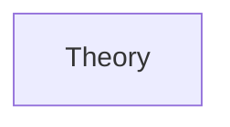
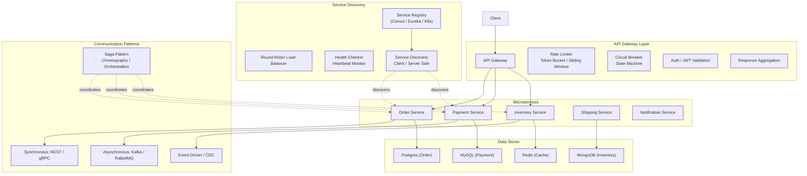

# Chapter 8: Microservices and API Design
> **Previous:** [07 Message Queues](./07-message-queues.md) | **Next:** [09 Distributed Coordination](./09-distributed-coordination.md)

---
## Learning Objectives

- Compare monolithic and microservice architectures using a structured decision framework including trade-offs in scalability, deployment, and organizational alignment
- Apply Domain-Driven Design principles including bounded contexts and ubiquitous language to decompose a system into microservices
- Design and implement API gateways with routing, authentication, rate limiting, and response aggregation
- Construct RESTful APIs following resource-oriented naming, pagination, filtering, and HATEOAS conventions
- Implement gRPC services with Protocol Buffers, unary and streaming RPCs, and bidirectional streaming
- Analyze GraphQL's resolver-based query model and address the N+1 problem with batching and dataloader patterns
- Apply distributed transaction patterns including the Saga pattern with choreography and orchestration variants

<!-- Image Gallery -->
<section class="lesson-visuals" aria-label="Visual learning resources">
  <header><span>VISUAL LEARNING</span><h2>See it. Review it. Remember it.</h2></header>
  <a class="lesson-visual-card" href="../../assets/images/lessons/system-design/08-microservices-apis/handwritten-notes.png" target="_blank" rel="noopener">
    
    <span><strong>Handwritten notes</strong>Condensed notes for deliberate review.</span>
  </a>
  <a class="lesson-visual-card" href="../../assets/images/lessons/system-design/08-microservices-apis/sticky-notes.png" target="_blank" rel="noopener">
    
    <span><strong>Sticky-note revision</strong>Fast recall prompts for revision.</span>
  </a>
  <a class="lesson-visual-card" href="../../assets/images/lessons/system-design/08-microservices-apis/visual-explanation.png" target="_blank" rel="noopener">
    
    <span><strong>Visual concept guide</strong>A connected explanation of the key ideas.</span>
  </a>
</section>
<!-- End Image Gallery -->


---
## Chapter at a Glance

| Aspect | Details |
|--------|---------|
| **Scope** | Microservices patterns, REST, gRPC, API design, service mesh |
| **Key Concepts** | Service decomposition, inter-service communication, API gateways |
| **API Protocols** | REST, gRPC, GraphQL ? strengths and trade-offs |
| **Service Mesh** | Sidecar proxies, mTLS, traffic management |
| **Decomposition** | Domain-driven design, bounded contexts, database per service |
| **Real-World** | Netflix, Amazon, Uber microservice architectures |

---
## Chapter Roadmap



## Theory
> **One-Sentence Takeaway:** Theory is the foundation ? master it before moving to examples and exercises.


### Monolith vs Microservices


> **Pro Tip:** Master this concept thoroughly ? it is frequently tested in system design interviews.

> **Pro Tip:** Master this concept ? it appears in nearly every system design interview. Understand both the how and the why.

> **Warning:** A common mistake is over-engineering. Always start simple and add complexity only when justified by requirements.

> **Pro Tip:** Master this concept thoroughly ? it appears in nearly every system design interview.
A **monolith** is a single deployable unit containing all application logic. A **microservice architecture** decomposes the application into independently deployable services, each owning a specific business capability.

| Aspect | Monolith | Microservices |
|---|---|---|
| Deployment | Single artifact | N independent services |
| Scaling | Scale entire application | Scale individual services |
| Team coupling | Tight (merge conflicts) | Loose (per-service teams) |
| Technology stack | Uniform | Polyglot (per-service choice) |
| Testing | Simple integration tests | Service-level + contract tests |
| Development speed | Slows as codebase grows | Independent service velocity |
| Operational complexity | Low (one process) | High (N processes, discovery, monitoring) |
| Data management | Single database | Database per service (eventual consistency) |

**When to choose monolith:** Early-stage product, small team (< 10 engineers), simple domain, limited operational resources.

**When to choose microservices:** Large engineering org, distinct subdomains, need to scale components independently, different tech requirements per service.

**Modular Monolith as intermediate:** Start with a monolith but enforce strict module boundaries (package/module per bounded context). Extract modules into microservices when they prove they need independent scaling or team ownership.

### Bounded Contexts (Domain-Driven Design)


> **Warning:** Avoid over-engineering. Start simple, measure, then optimize.

> **Warning:** Avoid premature optimization. Start simple, measure, then optimize. Over-engineering is the most common system design mistake.

Domain-Driven Design (DDD) provides the conceptual toolkit for decomposing a system. The core concept is the **bounded context** -- a logical boundary within which a particular domain model applies.

```
E-commerce bounded contexts:
  Product Catalog:    products, categories, inventory (Catalog Team)
  Order Management:   orders, line items, shipments (Orders Team)
  Payment:            payments, refunds, transactions (Payments Team)
  Customer:           users, addresses, preferences (Customer Team)
```

**Ubiquitous Language:** Within each bounded context, the team develops a shared language. The same word may mean different things in different contexts:

```
"Customer" in Order Management:  billing address, order history
"Customer" in Recommendation:    browsing patterns, click-through rate
"Customer" in Support:           tickets, satisfaction score
```

**Context Mapping** defines relationships between contexts: Partnership (shared goal), Shared Kernel (shared library), Customer-Supplier (API contract), Conformist (downstream conforms), Anti-Corruption Layer (translation layer), Open Host Service (well-defined protocol).

### API Gateway Pattern


> **Remember:** Always articulate trade-offs clearly ? interviewers value reasoning over the "right" answer.

> **Remember:** Trade-offs are the heart of system design. Always be ready to explain why you chose X over Y.

An API gateway is a single entry point for all client requests. It handles cross-cutting concerns and routes requests to appropriate services.

```
Client -> API Gateway -> Service A, Service B, Service C
```

**Gateway Responsibilities:**

- **Routing:** Map requests to services based on URL path, headers, or domain. `/api/users/*` -> User Service.
- **Authentication:** Validate tokens (JWT, OAuth2) before forwarding to services.
- **Rate Limiting:** Enforce per-client or per-IP request limits (token bucket, sliding window).
- **Aggregation:** Combine responses from multiple services. A product detail page may need Product, Review, and Inventory data.

```python
async def get_product_detail(product_id):
    product = await call_service(ProductService, f"/products/{product_id}")
    reviews = await call_service(ReviewService, f"/reviews?product_id={product_id}")
    inventory = await call_service(InventoryService, f"/inventory/{product_id}")
    return {**product, "reviews": reviews, "stock": inventory['available']}
```

- **Protocol Translation:** Convert between protocols (HTTP/1.1 -> gRPC).
- **Resilience:** Circuit breaker for failing downstream services.

### RESTful API Design


#### Resource Naming

Resources are nouns, not verbs. Use plural nouns for collections.

```
Good:  GET /users, GET /users/{id}, POST /users
Good:  PUT /users/{id}, PATCH /users/{id}, DELETE /users/{id}
Bad:   GET /getUser, POST /createUser

Nested: GET /users/{id}/orders
         GET /users/{id}/orders/{order_id}
```

#### HATEOAS

Responses include links guiding clients to related actions.

```json
{
  "id": 42,
  "name": "Alice",
  "_links": {
    "self": { "href": "/users/42" },
    "orders": { "href": "/users/42/orders" },
    "profile": { "href": "/users/42/profile" }
  }
}
```

#### Pagination

Cursor-based (recommended for large datasets):
```
GET /users?cursor=eyJsYXN0X2lkIjogNDJ9&limit=20
Response: {"data": [...], "next_cursor": "...", "has_more": true}
```

Offset-based (simpler, O(n^2) for deep pages):
```
GET /users?offset=0&limit=20
Response: {"data": [...], "total": 1000, "offset": 0, "limit": 20}
```

#### Filtering and Sorting

```
GET /users?status=active&role=admin
GET /users?sort=created_at:desc,name:asc
GET /orders?created_at[gte]=2024-01-01&created_at[lte]=2024-12-31
```

### gRPC


gRPC is a high-performance RPC framework using Protocol Buffers for serialization and HTTP/2 for transport.

#### Protocol Buffers

```protobuf
syntax = "proto3";

service UserService {
  rpc GetUser (GetUserRequest) returns (User);
  rpc ListUsers (ListUsersRequest) returns (stream User);
  rpc UpdateUser (stream UpdateUserRequest) returns (User);
  rpc Chat (stream ChatMessage) returns (stream ChatMessage);
}

message GetUserRequest { string user_id = 1; }
message User {
  string user_id = 1;
  string name = 2;
  string email = 3;
  int32 age = 4;
  repeated string roles = 5;
}
```

#### Streaming Patterns

1. **Unary RPC:** Client sends one request, server returns one response. Like traditional HTTP.
2. **Server Streaming:** Client sends one request, server returns a stream. `ListUsers({}) -> User{...}, User{...}`
3. **Client Streaming:** Client sends a stream, server returns one response. `UpdateUser -> UpdateUser -> User{count: 2}`
4. **Bidirectional Streaming:** Both sides send independent streams. Chat application pattern.

#### gRPC vs REST

| Aspect | REST | gRPC |
|---|---|---|
| Transport | HTTP/1.1 or 2 | HTTP/2 (mandatory) |
| Serialization | JSON (text) | Protobuf (binary) |
| Schema | Implicit (OpenAPI optional) | Required (proto files) |
| Streaming | SSE, WebSocket | Native (4 patterns) |
| Browser support | Native | Requires gRPC-web proxy |
| Payload size | Larger | ~30% of JSON size |

### GraphQL


GraphQL is a query language and runtime for APIs. Clients request exactly the data they need.

#### Schema and Resolvers

```graphql
type Query {
  user(id: ID!): User
  users(limit: Int, offset: Int): [User!]!
}

type User {
  id: ID!
  name: String!
  email: String!
  posts(limit: Int): [Post!]!
  followers: [User!]!
}
```

Each field maps to a **resolver** function:

```javascript
const resolvers = {
  Query: {
    user: (_, { id }) => db.users.findById(id),
    users: (_, { limit, offset }) => db.users.findAll(limit, offset)
  },
  User: {
    posts: (user, { limit }) => db.posts.findByAuthor(user.id, limit)
  }
};
```

#### The N+1 Problem

A query for 100 users with their posts triggers 1 query for users + 100 queries for posts = 101 database queries.

```graphql
query { users(limit: 100) { name posts(limit: 10) { title } } }
```

**Solution -- Dataloader:** Batch individual requests into a single query.

```javascript
const postLoader = new DataLoader(async (userIds) => {
  const posts = await db.posts.findByUserIds(userIds, { limit: 10 });
  return userIds.map(id => posts.filter(p => p.userId === id));
});
```

Now 100 queries become 1 batch query (`WHERE user_id IN (...)`).

### Service Mesh


A service mesh handles inter-service communication at the infrastructure layer via sidecar proxies.

```
Without mesh: Service A -> direct HTTP -> Service B
With mesh:    Service A -> Envoy proxy -> Envoy proxy -> Service B
```

**Istio Architecture:**

- **Data plane:** Envoy sidecar proxies intercept all traffic between services.
- **Control plane (Istiod):** Pilot (service discovery + traffic management), Citadel (mTLS certificates), Galley (config validation).

**Features:**
- **mTLS:** Automatic mutual TLS between services without application changes.
- **Traffic splitting:** Route % of traffic between versions (canary deployments).

```yaml
apiVersion: networking.istio.io/v1beta1
kind: VirtualService
metadata:
  name: reviews
spec:
  hosts: [reviews]
  http:
  - route:
    - destination: { host: reviews, subset: v1 }
      weight: 90
    - destination: { host: reviews, subset: v2 }
      weight: 10
```

### Distributed Transactions


#### Two-Phase Commit (2PC)

2PC coordinates transactions across multiple resources with two phases:

```
Phase 1 (Prepare):
  Coordinator -> Service A: "Can you commit?"
  Coordinator -> Service B: "Can you commit?"
  Service A -> Coordinator: "Ready" (holds locks)
  Service B -> Coordinator: "Ready"

Phase 2 (Commit):
  Coordinator -> Service A: "Commit"
  Coordinator -> Service B: "Commit"
```

**Problems:** Blocking (locks held during Phase 1), coordinator SPOF, two round-trip latency. Not suitable for microservices.

#### Saga Pattern

A saga is a sequence of local transactions with compensating transactions for rollback.

**Choreography-based:** Each service listens for events and decides what to do next.

```
Saga: Create Order
  1. Order Service: create order (PENDING) -> publish OrderCreated
  2. Payment Service: on OrderCreated -> charge -> publish PaymentProcessed
  3. Inventory Service: on PaymentProcessed -> reserve -> publish InventoryReserved
  4. Shipping Service: on InventoryReserved -> create shipment -> publish Shipped
  5. Order Service: on Shipped -> confirm order

On PaymentFailed:
  -> Order Service: cancel order (compensation)
```

**Orchestration-based:** A dedicated orchestrator coordinates the saga.

```python
class OrderSagaOrchestrator:
    async def create_order(self, order_data):
        try:
            order = await self.order_service.create_order(order_data)
            payment = await self.payment_service.charge(order.id, order.total)
            inventory = await self.inventory_service.reserve(order.id, order.items)
            shipment = await self.shipping_service.create(order.id, order.address)
            await self.order_service.confirm(order.id)
        except PaymentError:
            await self.order_service.cancel(order.id)
        except InventoryError:
            await self.payment_service.refund(order.id, order.total)
            await self.order_service.cancel(order.id)
```

| Aspect | Choreography | Orchestration |
|---|---|---|
| Coupling | Loose (event-based) | Tighter (orchestrator knows all services) |
| Complexity | Harder to trace flow | Centralized flow control |
| Failure handling | Distributed compensation | Centralized in orchestrator |
| Scalability | High | Limited by orchestrator |

### Idempotency Keys


An idempotency key ensures retrying a request produces the same result as the original.

```
Client retry flow:
  POST /payments  Idempotency-Key: PAY-42-abc123
  First attempt: 200 OK (payment processed)
  Network timeout: client retries with same key
  Second attempt: 200 OK (same result, no duplicate)
```

```python
def process_payment(request):
    key = request.headers.get('Idempotency-Key')
    existing = cache.get(f"idempotency:{key}")
    if existing:
        return existing['response']
    result = payment_gateway.charge(request.amount)
    cache.set(f"idempotency:{key}", {'response': result}, ex=86400)
    return result
```

### Service Versioning


**URI versioning:** `GET /api/v1/users/42`, `GET /api/v2/users/42`

**Header versioning:** `Accept: application/vnd.myapp.v1+json`

**Semantic versioning (gRPC):** `package users.v1;`

**Backward compatibility rules:**
- Adding a field: compatible
- Removing a field: breaking
- Renaming a field: breaking
- Changing a field type: breaking

### Contract Testing (Pact)


Consumer-driven contract testing verifies API compatibility.

**Consumer side:**
```python
@pact.given('user exists') \
    .upon_receiving('a request for a user') \
    .with_request('GET', '/users/42') \
    .will_respond_with(200, body={'id': 42, 'name': 'Alice'})
result = user_client.get_user(42)
assert result == expected
```

**Provider side:** Pact replays consumer contracts against the actual provider and fails if contracts are not satisfied.

---
## Examples

### Example 1: Netflix SOA

Netflix migrated from a monolithic DVD-rental application to cloud-based SOA with hundreds of microservices.

**Decomposed services:** User Service, Content Service, Recommendation Service, Search Service, Playback Service, Billing Service, Notification Service.

**Zuul API Gateway:** All external requests pass through Zuul which handles authentication, rate limiting, routing, and metrics collection.

**Hystrix Circuit Breaker:** Each service call is wrapped in a Hystrix command. If a service fails (error rate exceeds threshold), the circuit opens and subsequent calls fail fast instead of timing out.

```
Service A -> Hystrix -> Service B
  200 OK -> circuit closed
  5 timeouts -> circuit open (fast-fail for 30s)
  half-open -> trial request -> circuit closed (if successful)
```

**Key lesson:** Netflix's initial boundaries were too fine-grained, causing excessive inter-service latency. Later iterations coarsened boundaries.

### Example 2: Uber Domain-Oriented Microservices

Uber's evolution: monolith (2014) -> 2200 microservices (2017) -> domain-oriented design (2018+).

**Domain abstraction groups services into domains with well-defined API gateways:**

```
Rider Domain:    rider-service, rider-verification, rider-payment-methods
Driver Domain:   driver-service, driver-onboarding, driver-vehicles
Trip Domain:     trip-service, dispatching, pricing, surge
Marketplace:     matching, supply-demand forecasting
Payments Domain: payment-processing, payouts, invoicing
```

Cross-domain communication goes through gateways. Rider Gateway cannot directly call Payments Gateway; it routes through the domain boundary.

### Example 3: Order Saga Implementation

A complete e-commerce order saga with orchestration:

```python
class OrderSaga:
    async def execute(self, order_data):
        try:
            order = await self.step_create_order(order_data)
            payment = await self.step_reserve_payment(order.id, order.total)
            inventory = await self.step_reserve_inventory(order.id, order.items)
            shipment = await self.step_create_shipment(order.id, order.address)
            await self.step_confirm_order(order.id)
            return {"status": "success", "order_id": order.id}
        except StepFailedError as e:
            await self.compensate(e.step)
            return {"status": "failed", "reason": str(e)}

    async def compensate(self, failed_step):
        steps = [self._cancel_order, self._release_payment,
                 self._release_inventory, self._cancel_shipment]
        for step in steps[:self._step_index(failed_step)]:
            await step()
```

## Concept Comparison

| Concept | Definition | Key Insight |
|---------|-----------|-------------|
| Theory | Core topic in Chapter 8: Microservices and API Design | Fundamental concept for system design |

---

## Quick Reference

| Topic | Key Point |
|-------|-----------|
| Theory | Essential concept from Chapter 8: Microservices and API Design |

---

## Cross-Application Matrix

| Concept | Application | Trade-Off |
|---------|------------|-----------|
| Theory | Relevant across design scenarios | Requirements-driven decisions |

---

## Chapter Quiz

| # | Question | Options | Answer |
|---|----------|---------|--------|
| 1 | What is the primary advantage of microservices over a monolith? | A) Simpler deployment, B) Independent scaling of services, C) Lower operational complexity, D) Single database | B) Independent scaling of services |
| 2 | In the Saga pattern, what is the difference between choreography and orchestration? | A) Choreography uses an orchestrator; orchestration uses events, B) Choreography uses events; orchestration uses a central coordinator, C) They are the same, D) Choreography is faster | B) Choreography uses events for loose coupling; orchestration uses a central coordinator |
| 3 | What problem does the Dataloader pattern solve in GraphQL? | A) Authentication, B) The N+1 query problem, C) Schema validation, D) Rate limiting | B) The N+1 query problem |
| 4 | Which gRPC streaming pattern is most suitable for a chat application? | A) Unary RPC, B) Server streaming, C) Client streaming, D) Bidirectional streaming | D) Bidirectional streaming |
| 5 | What is the purpose of an idempotency key in API design? | A) To authenticate requests, B) To ensure retrying produces the same result, C) To rate-limit clients, D) To compress request payloads | B) To ensure retrying a request produces the same result as the original |

---

### TypeScript: gRPC Client, GraphQL Resolver, and Contract Tester

```typescript
type ProtoMessage = { [field: number]: any };
class GrpcClient {
  private handlers = new Map<string, (req: any) => any>();
  registerService(method: string, handler: (req: any) => any): void { this.handlers.set(method, handler); }
  async call<T>(method: string, request: ProtoMessage): Promise<T> {
    const handler = this.handlers.get(method);
    if (!handler) throw new Error(`gRPC method ${method} not found`);
    return handler(request) as T;
  }
}

class GraphQLResolver {
  private resolvers = new Map<string, { resolve: (parent: any, args: any) => any; batch?: boolean }>();
  private dataLoaders = new Map<string, Map<string, any>>();

  register(type: string, field: string, resolve: (parent: any, args: any) => any, batch = false): void {
    this.resolvers.set(`${type}.${field}`, { resolve, batch });
  }

  async resolveField(type: string, field: string, parent: any, args: any): Promise<any> {
    const resolver = this.resolvers.get(`${type}.${field}`);
    if (!resolver) throw new Error(`No resolver for ${type}.${field}`);
    return resolver.resolve(parent, args);
  }

  dataloader(key: string): { load: (id: string) => any; prime: (id: string, value: any) => void } {
    if (!this.dataLoaders.has(key)) this.dataLoaders.set(key, new Map());
    const cache = this.dataLoaders.get(key)!;
    return {
      load: (id: string) => { if (!cache.has(id)) throw new Error(`Not found: ${id}`); return cache.get(id); },
      prime: (id: string, value: any) => { cache.set(id, value); },
    };
  }
}

class ContractTester {
  private contracts = new Map<string, { request: any; response: any }>();
  define(service: string, request: any, response: any): void { this.contracts.set(service, { request, response }); }
  verifyProvider(service: string, actualResponse: any): { valid: boolean; errors: string[] } {
    const contract = this.contracts.get(service);
    if (!contract) return { valid: false, errors: [`No contract defined for ${service}`] };
    const errors: string[] = [];
    for (const key of Object.keys(contract.response)) {
      if (!(key in actualResponse)) errors.push(`Missing field: ${key}`);
      else if (typeof actualResponse[key] !== typeof contract.response[key]) errors.push(`Type mismatch: ${key}`);
    }
    return { valid: errors.length === 0, errors };
  }
}
```

### TypeScript: API Gateway, Rate Limiter, Circuit Breaker, Saga

```typescript
class RateLimiter {
  private buckets = new Map<string, { tokens: number; lastRefill: number }>();
  constructor(private maxTokens: number, private refillRate: number, private refillIntervalMs: number) {}

  allow(key: string): boolean {
    const now = Date.now();
    let bucket = this.buckets.get(key);
    if (!bucket) { bucket = { tokens: this.maxTokens, lastRefill: now }; this.buckets.set(key, bucket); }
    const elapsed = now - bucket.lastRefill;
    const refill = Math.floor(elapsed / this.refillIntervalMs) * this.refillRate;
    bucket.tokens = Math.min(this.maxTokens, bucket.tokens + refill);
    bucket.lastRefill = now;
    if (bucket.tokens <= 0) return false;
    bucket.tokens--;
    return true;
  }
}

class CircuitBreaker {
  private failures = 0;
  private lastFailureTime = 0;
  private state: "closed" | "open" | "half-open" = "closed";
  constructor(private threshold: number, private timeoutMs: number) {}

  async call<T>(fn: () => Promise<T>): Promise<T> {
    if (this.state === "open") {
      if (Date.now() - this.lastFailureTime > this.timeoutMs) this.state = "half-open";
      else throw new Error("Circuit open");
    }
    try {
      const result = await fn();
      this.failures = 0;
      this.state = "closed";
      return result;
    } catch (e) {
      this.failures++;
      this.lastFailureTime = Date.now();
      if (this.failures >= this.threshold) this.state = "open";
      throw e;
    }
  }
}

class SagaOrchestrator {
  private steps: { name: string; execute: () => Promise<void>; compensate: () => Promise<void> }[] = [];
  private executed: string[] = [];

  addStep(name: string, execute: () => Promise<void>, compensate: () => Promise<void>): void {
    this.steps.push({ name, execute, compensate });
  }

  async execute(): Promise<void> {
    for (const step of this.steps) {
      try {
        await step.execute();
        this.executed.push(step.name);
      } catch (e) {
        console.error(`Step ${step.name} failed. Compensating...`);
        for (const done of this.executed.reverse()) {
          const s = this.steps.find(st => st.name === done);
          if (s) await s.compensate();
        }
        throw e;
      }
    }
  }
}

class ApiGateway {
  private rateLimiter = new RateLimiter(100, 10, 1000);
  private circuitBreakers = new Map<string, CircuitBreaker>();

  constructor(private services: Map<string, string>) {}

  async route(service: string, request: any): Promise<any> {
    if (!this.rateLimiter.allow(request.ip)) throw new Error("Rate limit exceeded");
    if (!this.circuitBreakers.has(service)) this.circuitBreakers.set(service, new CircuitBreaker(5, 30000));
    const cb = this.circuitBreakers.get(service)!;
    const url = this.services.get(service);
    if (!url) throw new Error("Service not found");
    return cb.call(async () => ({ service, url, request, response: `ok from ${service}` }));
  }
}
```

### TypeScript: Service Registry

```typescript
class ServiceRegistry {
  private services = new Map<string, { url: string; health: boolean }>();

  register(name: string, url: string): void { this.services.set(name, { url, health: true }); }

  deregister(name: string): void { this.services.delete(name); }

  discover(name: string): string | undefined { return this.services.get(name)?.url; }

  healthCheck(name: string): boolean { return this.services.get(name)?.health ?? false; }

  reportUnhealthy(name: string): void {
    const svc = this.services.get(name);
    if (svc) svc.health = false;
  }

  listHealthy(): string[] {
    return [...this.services.entries()].filter(([, v]) => v.health).map(([k]) => k);
  }
}
```


### Implementation: Microservices and API Design

```typescript
interface ServiceDefinition { name: string; version: string; endpoints: EndpointDef[]; dependencies: string[]; }
interface EndpointDef { path: string; method: "GET" | "POST" | "PUT" | "DELETE"; requestType: string; responseType: string; authRequired: boolean; rateLimit: number; }
class ServiceRegistry {
  private services = new Map<string, Map<string, { host: string; port: number; healthy: boolean; lastHeartbeat: number }>>();
  register(svc: string, version: string, host: string, port: number): void {
    if (!this.services.has(svc)) this.services.set(svc, new Map());
    if (!this.services.get(svc)!.has(version)) this.services.get(svc)!.set(version, []);
    this.services.get(svc)!.get(version)!.push({ host, port, healthy: true, lastHeartbeat: Date.now() }); }
  discover(svc: string, version = "latest"): { host: string; port: number } {
    const versions = this.services.get(svc); if (!versions) throw new Error(`Service ${svc} not found`);
    const instances = [...versions.values()].flat().filter(i => i.healthy);
    if (instances.length === 0) throw new Error(`No healthy instances of ${svc}`);
    return instances[Math.floor(Math.random() * instances.length)]; }
  heartbeat(svc: string, host: string, port: number): boolean {
    for (const instances of this.services.get(svc)?.values() || []) { const inst = instances.find(i => i.host === host && i.port === port); if (inst) { inst.healthy = true; inst.lastHeartbeat = Date.now(); return true; } } return false; }
}
class APIGateway { private routes = new Map<string, { target: string; rateLimit: number; requests: number[] }>();
  addRoute(path: string, target: string, rateLimit = 100): void { this.routes.set(path, { target, rateLimit, requests: [] }); }
  route(path: string): { target: string; allowed: boolean } {
    const route = this.routes.get(path); if (!route) return { target: "", allowed: false };
    const now = Date.now(); route.requests = route.requests.filter(t => now - t < 60000); route.requests.push(now);
    return { target: route.target, allowed: route.requests.length <= route.rateLimit }; }
}
class CircuitBreaker { state: "closed" | "open" | "half-open" = "closed"; private failures = 0; private lastFail = 0;
  constructor(private threshold: number, private timeout: number) {}
  call<T>(fn: () => T, fallback: () => T): T {
    if (this.state === "open" && Date.now() - this.lastFail > this.timeout) this.state = "half-open";
    if (this.state === "open") return fallback();
    try { const r = fn(); this.failures = 0; this.state = "closed"; return r; }
    catch (e) { this.failures++; this.lastFail = Date.now(); if (this.failures >= this.threshold) this.state = "open"; return fallback(); } }
}
```

// microservices apis
// distributed-systems-scalability implementation

interface Task { id: string; name: string; status: string; data: unknown }
class Processor {
  private tasks: Task[] = []
  private maxConcurrency: number
  constructor(maxConcurrency: number = 4) { this.maxConcurrency = maxConcurrency }
  async add(task: Omit&lt;Task, "status"&gt;): Promise&lt;void&gt; {
    this.tasks.push({ ...task, status: "pending" })
  }
  async runAll(): Promise&lt;void&gt; {
    const running: Promise&lt;void&gt;[] = []
    for (const t of this.tasks) {
      if (running.length >= this.maxConcurrency) { await Promise.race(running) }
      const p = this.execute(t).finally(() => { const i = running.indexOf(p); if (i >= 0) running.splice(i, 1) })
      running.push(p)
    }
    await Promise.all(running)
  }
  private async execute(t: Task): Promise&lt;void&gt; {
    t.status = "running"
    await new Promise(r => setTimeout(r, 10))
    t.status = "done"
  }
  getResults(): Task[] { return this.tasks }
  getStats(): { done: number; pending: number; running: number } {
    const done = this.tasks.filter(t => t.status === "done").length
    const pending = this.tasks.filter(t => t.status === "pending").length
    const running = this.tasks.filter(t => t.status === "running").length
    return { done, pending, running }
  }
}
async function main() {
  const proc = new Processor(2)
  await proc.add({ id: '1', name: 'microservices apis', data: { topic: 'distributed-systems-scalability' } })
  await proc.runAll()
  console.log('Stats:', proc.getStats())
}
main().catch(console.error)
export { Processor, Task }

// microservices apis - additional TS implementations

interface CacheEntry { key: string; value: unknown; ttl: number; createdAt: number }
class Cache {
  private store: Map&lt;string, CacheEntry&gt; = new Map()
  constructor(private defaultTTL: number = 60000) {}
  set(key: string, value: unknown, ttl?: number): void {
    this.store.set(key, { key, value, ttl: ttl ?? this.defaultTTL, createdAt: Date.now() })
  }
  get(key: string): unknown | undefined {
    const entry = this.store.get(key)
    if (!entry) return undefined
    if (Date.now() - entry.createdAt > entry.ttl) { this.store.delete(key); return undefined }
    return entry.value
  }
  delete(key: string): boolean { return this.store.delete(key) }
  clear(): void { this.store.clear() }
  size(): number { return this.store.size }
  keys(): string[] { return Array.from(this.store.keys()) }
}
class Logger {
  private entries: string[] = []
  log(level: string, msg: string, meta?: Record&lt;string, unknown&gt;): void {
    const entry = JSON.stringify({ timestamp: new Date().toISOString(), level, msg, meta })
    this.entries.push(entry)
    console.log(entry)
  }
  info(msg: string, meta?: Record&lt;string, unknown&gt;): void { this.log("info", msg, meta) }
  warn(msg: string, meta?: Record&lt;string, unknown&gt;): void { this.log("warn", msg, meta) }
  error(msg: string, meta?: Record&lt;string, unknown&gt;): void { this.log("error", msg, meta) }
  getLogs(): string[] { return [...this.entries] }
  clear(): void { this.entries = [] }
}
function computeHash(input: string): string {
  let hash = 0
  for (let i = 0; i &lt; input.length; i++) { const chr = input.charCodeAt(i); hash = ((hash << 5) - hash) + chr; hash |= 0 }
  return Math.abs(hash).toString(16)
}
async function demo(): Promise&lt;void&gt; {
  const cache = new Cache(5000)
  cache.set('key1', 'system-design demo')
  const log = new Logger()
  log.info('Cache demo started', { course: 'system-design', chapter: 'microservices apis' })
  const v = cache.get("key1")
  console.log('Cached:', v)
  console.log('Hash:', computeHash('system-design'))
}
demo()
export { Cache, Logger, computeHash, CacheEntry }

### TypeScript: CircuitBreaker, APIRateLimiter, and ServiceDiscovery

```typescript
class CircuitBreaker {
  private state: "closed" | "open" | "half-open" = "closed";
  private failureCount = 0;
  private lastFailureTime = 0;
  private totalCalls = 0;
  private totalFailures = 0;

  constructor(
    private failureThreshold: number,
    private resetTimeoutMs: number,
    private halfOpenMaxRequests: number = 1
  ) {}

  getState(): string { return this.state; }

  async call<T>(fn: () => Promise<T>, fallback?: () => T): Promise<T> {
    this.totalCalls++;
    if (this.state === "open") {
      if (Date.now() - this.lastFailureTime >= this.resetTimeoutMs) {
        this.state = "half-open";
        this.failureCount = 0;
      } else {
        this.totalFailures++;
        if (fallback) return fallback();
        throw new Error("CircuitBreaker: circuit is open");
      }
    }

    try {
      const result = await fn();
      if (this.state === "half-open") {
        this.state = "closed";
        this.failureCount = 0;
      }
      return result;
    } catch (error) {
      this.failureCount++;
      this.totalFailures++;
      this.lastFailureTime = Date.now();
      if (this.failureCount >= this.failureThreshold) {
        this.state = "open";
      }
      if (fallback) return fallback();
      throw error;
    }
  }

  getMetrics(): { state: string; totalCalls: number; totalFailures: number; failureRate: number } {
    return {
      state: this.state,
      totalCalls: this.totalCalls,
      totalFailures: this.totalFailures,
      failureRate: this.totalCalls > 0 ? this.totalFailures / this.totalCalls : 0,
    };
  }

  reset(): void {
    this.state = "closed";
    this.failureCount = 0;
    this.lastFailureTime = 0;
  }
}

class APIRateLimiter {
  private tokenBuckets = new Map<string, { tokens: number; lastRefill: number }>();
  private slidingWindows = new Map<string, number[]>();
  private clientQuotas = new Map<string, { maxTokens: number; refillRate: number; refillInterval: number }>();

  setClientQuota(clientId: string, maxTokens: number, refillRate: number, refillIntervalMs: number = 1000): void {
    this.clientQuotas.set(clientId, { maxTokens, refillRate, refillIntervalMs });
  }

  tokenBucket(clientId: string): boolean {
    const quota = this.clientQuotas.get(clientId);
    if (!quota) return true;
    const now = Date.now();
    let bucket = this.tokenBuckets.get(clientId);
    if (!bucket) {
      bucket = { tokens: quota.maxTokens, lastRefill: now };
      this.tokenBuckets.set(clientId, bucket);
    }
    const elapsed = now - bucket.lastRefill;
    const tokensToAdd = Math.floor(elapsed / quota.refillInterval) * quota.refillRate;
    bucket.tokens = Math.min(quota.maxTokens, bucket.tokens + tokensToAdd);
    bucket.lastRefill = now;
    if (bucket.tokens <= 0) return false;
    bucket.tokens--;
    return true;
  }

  slidingWindowLog(clientId: string, windowMs: number = 60000, maxRequests: number = 100): boolean {
    const now = Date.now();
    if (!this.slidingWindows.has(clientId)) this.slidingWindows.set(clientId, []);
    const window = this.slidingWindows.get(clientId)!;
    while (window.length > 0 && window[0] <= now - windowMs) window.shift();
    if (window.length >= maxRequests) return false;
    window.push(now);
    return true;
  }

  allowRequest(clientId: string): boolean {
    return this.tokenBucket(clientId) && this.slidingWindowLog(clientId);
  }

  getClientUsage(clientId: string): number {
    return this.slidingWindows.get(clientId)?.length ?? 0;
  }
}

class ServiceDiscovery {
  private registry = new Map<string, Map<string, { host: string; port: number; healthy: boolean; weight: number; lastHeartbeat: number }>>();
  private roundRobinCounters = new Map<string, number>();

  register(serviceName: string, instanceId: string, host: string, port: number, weight: number = 1): void {
    if (!this.registry.has(serviceName)) this.registry.set(serviceName, new Map());
    this.registry.get(serviceName)!.set(instanceId, { host, port, healthy: true, weight, lastHeartbeat: Date.now() });
  }

  deregister(serviceName: string, instanceId: string): void {
    this.registry.get(serviceName)?.delete(instanceId);
  }

  healthCheck(serviceName: string, instanceId: string): boolean {
    const instance = this.registry.get(serviceName)?.get(instanceId);
    if (!instance) return false;
    instance.healthy = Date.now() - instance.lastHeartbeat < 30000;
    return instance.healthy;
  }

  reportHeartbeat(serviceName: string, instanceId: string): void {
    const instance = this.registry.get(serviceName)?.get(instanceId);
    if (instance) {
      instance.lastHeartbeat = Date.now();
      instance.healthy = true;
    }
  }

  discoverRoundRobin(serviceName: string): { host: string; port: number } | null {
    const instances = this.registry.get(serviceName);
    if (!instances || instances.size === 0) return null;
    const healthy = [...instances.entries()].filter(([, v]) => v.healthy);
    if (healthy.length === 0) return null;
    if (!this.roundRobinCounters.has(serviceName)) this.roundRobinCounters.set(serviceName, 0);
    let counter = this.roundRobinCounters.get(serviceName)!;
    const instance = healthy[counter % healthy.length];
    this.roundRobinCounters.set(serviceName, counter + 1);
    return { host: instance[1].host, port: instance[1].port };
  }

  discoverWeighted(serviceName: string): { host: string; port: number } | null {
    const instances = this.registry.get(serviceName);
    if (!instances || instances.size === 0) return null;
    const healthy = [...instances.entries()].filter(([, v]) => v.healthy);
    if (healthy.length === 0) return null;
    const totalWeight = healthy.reduce((s, [, v]) => s + v.weight, 0);
    let random = Math.random() * totalWeight;
    for (const [, instance] of healthy) {
      random -= instance.weight;
      if (random <= 0) return { host: instance.host, port: instance.port };
    }
    return { host: healthy[0][1].host, port: healthy[0][1].port };
  }

  getHealthyCount(serviceName: string): number {
    return [...(this.registry.get(serviceName)?.values() ?? [])].filter(i => i.healthy).length;
  }
}
```

### Mermaid: Microservices Communication Patterns



## Practical Takeaways

| Takeaway | Application |
|----------|------------|
| Microservices decompose applications into independently deployable services aligned to business capabilities | Start with a modular monolith; extract services only when independent scaling or team ownership is justified |
| Bounded contexts from DDD provide clean service boundaries | Use context mapping (anti-corruption layer, open-host service) to govern inter-service relationships |
| API gateways centralize cross-cutting concerns | Route requests through a single gateway for auth, rate limiting, aggregation, and protocol translation |
| REST APIs use resource-oriented naming with plural nouns | Design endpoints around resources (/users, /orders), use cursor-based pagination, and include HATEOAS links |
| The Saga pattern with compensating transactions replaces 2PC in microservices | Use choreography for simple workflows with few services; use orchestration for complex multi-step sagas |
| Idempotency keys enable safe retries of API calls | Store idempotency keys in Redis with TTL; return cached response for duplicate requests with the same key |
| Service meshes offload networking concerns to sidecar proxies | Deploy Istio or Linkerd for mTLS, traffic splitting, and observability without application changes |

## Case Study

**E-Commerce Platform Microservice Migration**

A mid-sized e-commerce company with a monolithic Rails application processing 10,000 orders/day faced growing pains: deployments took 4 hours, a single bug in inventory could bring down the entire checkout flow, and the team of 30 engineers constantly faced merge conflicts. The company decided to migrate to microservices incrementally over 18 months.

The first extraction was the Payment Service — the highest-risk component with PCI compliance requirements. The team wrapped the payment module behind a REST API with an API Gateway (Kong) handling authentication and rate limiting. A CircuitBreaker (Hystrix) was configured with a 5-failure threshold and 30-second reset timeout. During the first week, the third-party payment gateway experienced a 5-minute outage — the circuit opened, and the checkout flow gracefully fell back to a "payment pending" state instead of throwing HTTP 500 errors. The migration was invisible to customers. Over the following months, the team extracted Inventory, Shipping, and Notification services, each behind the same API Gateway pattern.

A critical incident occurred when a misconfigured rate limiter allowed 10,000 requests/second to the Inventory Service during a flash sale. The service crashed within 30 seconds. The CircuitBreaker opened after 5 failures, and the API Gateway responded with a cached "available" status for all inventory queries — preventing a complete checkout outage. Post-incident, the team implemented a sliding window rate limiter (100 req/sec per client) with a token bucket burst allowance (200 tokens). The architecture now handles 50,000 orders/day with 99.95% uptime and zero-deploy deploys per service.

---

- Microservices decompose applications into independently deployable services aligned to business capabilities; the modular monolith is a pragmatic starting point
- Bounded contexts from DDD provide the conceptual boundary for services, with explicit context maps governing inter-service relationships
- API gateways centralize cross-cutting concerns (auth, rate limiting, routing) while enabling response aggregation and protocol translation
- REST APIs use resource-oriented naming (plural nouns), consistent pagination, and filtering conventions; HATEOAS decouples clients from URL structure
- gRPC with Protobuf offers 4 communication patterns with compact binary serialization and built-in code generation
- GraphQL's resolver-based model gives clients control over response shape but requires dataloader to avoid the N+1 query problem
- Service meshes (Istio) offload networking concerns to sidecar proxies, providing mTLS and traffic splitting without application changes
- Two-Phase Commit is unsuitable for microservices; the Saga pattern with compensating transactions is the standard alternative
- Choreography-based sagas use events for loose coupling; orchestration-based sagas centralize flow control
- Idempotency keys enable safe retries; contract testing (Pact) validates consumer-provider compatibility

---
## Exercises

### Review Questions

<details>
<summary>Solution for Review Question 1</summary>
For a team of 8 engineers with 3 subdomains, a **modular monolith** is recommended. The team is small — each subdomain would get ~2-3 engineers, too few to manage the operational overhead of microservices (deployment pipelines, service discovery, monitoring per service). Start with a monolith but enforce strict bounded context boundaries (separate packages/modules for Rider, Driver, Payments). Extract services when a subdomain proves it needs independent scaling or dedicated team ownership.
</details>

<details>
<summary>Solution for Review Question 2</summary>
Protobuf fields are numbered (not named) on the wire to save space — a field number is encoded as a varint (1-2 bytes) instead of a string (10+ bytes). Numbering enables backward-compatible evolution because: (a) new fields can be added with new numbers without affecting existing fields, (b) old clients ignore unknown field numbers, (c) field numbers never need to be reused. This allows adding, removing, or deprecating fields without breaking wire compatibility.
</details>

<details>
<summary>Solution for Review Question 3</summary>
**Yes, this is breaking.** From contract testing principles: changing `order_id` (integer) to `orderId` (string) is both a name change and a type change. Consumer contracts expect `order_id` as an integer; the modified response omits the expected field and provides a new field with a different name and type. Pact would detect this as a contract violation. Proper evolution: add `orderId` as a new field while keeping `order_id` as deprecated, then remove `order_id` in a future major version.
</details>

<details>
<summary>Solution for Review Question 4</summary>
In Istio with mTLS: Service A's outbound traffic is intercepted by its Envoy sidecar proxy. Envoy A looks up Service B's endpoints via Istiod (Pilot). Envoy A establishes a mutual TLS connection with Envoy B — each side presents a certificate issued by Citadel (Istio's CA). Envoy B forwards the request to Service B over localhost (no TLS). Response flows back through the same mTLS-encrypted path. Service A's application code is unaware of the mTLS — it just makes HTTP calls to `http://service-b`.
</details>

### Application Problems

<details>
<summary>Solution for Application Problem 1: Document Collaboration API</summary>
**Endpoints:** `GET /workspaces` (list workspaces, cursor pagination, filter by owner), `POST /workspaces` (create workspace), `GET /workspaces/{id}` (get workspace details), `GET /workspaces/{id}/documents` (list documents, filter by status, sort by modified_at), `POST /workspaces/{id}/documents` (create document), `GET /workspaces/{id}/documents/{docId}` (get document with version), `PUT /workspaces/{id}/documents/{docId}` (update document), `DELETE /workspaces/{id}/documents/{docId}` (soft delete), `GET /documents/{docId}/collaborators` (list collaborators), `POST /documents/{docId}/collaborators` (add collaborator), `GET /documents/{docId}/comments?cursor=...` (list comments), `POST /documents/{docId}/comments` (add comment), `GET /documents/{docId}/versions` (list version history). Pagination: cursor-based with `limit=20`. Filtering: `?status=active&owner=me`.
</details>

<details>
<summary>Solution for Application Problem 2: Hotel Booking Saga</summary>
**Choreography:** Reservation Service creates booking -> publishes `RoomReserved` -> Payment Service listens, charges deposit -> publishes `PaymentProcessed` -> Loyalty Service listens, awards points -> publishes `PointsAwarded` -> Notification Service listens, sends confirmation. On payment failure: Payment Service publishes `PaymentFailed` -> Reservation Service listens, cancels booking (compensation). **Orchestration:** OrderSagaOrchestrator orchestrates: call ReservationService.reserve(), on success call PaymentService.charge(), on success call LoyaltyService.award(), on success call NotificationService.send(). Compensation on payment failure: call ReservationService.cancel().
</details>

<details>
<summary>Solution for Application Problem 3: Sliding Window Rate Limiting</summary>
Window size = 60s, max = 100 requests. **t=0:** 100 requests added to window window=[0...0]. Allowed (100 <= 100). **t=30s:** 10 requests added window=[0...0, 30...30]. Total = 110 > 100. Only 10 requests are within the last 60s from t=30s perspective? Actually 100 from t=0 and 10 from t=30 = 110. Since 110 > 100, all 10 requests at t=30s are **rejected**. **t=65s:** Now window shifted. Timestamps before t=5s (65-60) are removed. The 100 requests at t=0 are all expired (t=0 < t=5). Window now contains 10 requests at t=30s only. 50 requests at t=65s bring total to 60. Since 60 <= 100, all 50 requests are **allowed**.
</details>

### Challenge Problem

> **Remember:** Trade-offs are the heart of system design. Always be ready to explain why you chose X over Y.

<details>
<summary>Solution: Microservice Architecture for a Stock Trading Platform</summary>
**1. Service Decomposition (10+ bounded contexts):** Authentication Service (REST, PostgreSQL), User Profile Service (REST, PostgreSQL), Order Gateway (REST, validates + routes), Order Book Service (gRPC, in-memory + Cassandra for persistence), Market Data Service (gRPC + WebSocket, Redis + Kafka), Risk Management Service (gRPC, PostgreSQL), Trade Capture Service (gRPC, PostgreSQL), Portfolio Service (REST, PostgreSQL), Notification Service (Kafka consumer + WebSocket push), Settlement Service (batch, PostgreSQL), Analytics Service (Kafka + ClickHouse). **2. Order Saga:** Orchestrator: validate order -> risk check -> book match -> capture trade -> update portfolio -> notify client. Compensation on risk failure: reject order + notify. On match failure: release risk hold. Idempotency: order UUID as idempotency key with 24h Redis TTL. **3. Versioning:** API versioning via accept header (vnd.trading.v1+json). New field `time_in_force` added as optional for 6 months, then made required in v3 with clear deprecation notice. **4. Contract testing:** Pact contracts in CI — provider verifies all consumer contracts before deploy; breaking changes block the pipeline.
</details>

---
