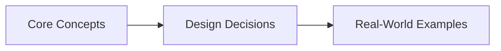
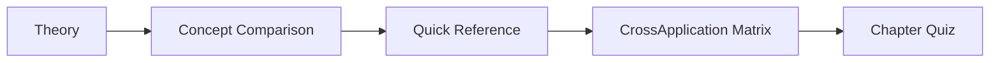
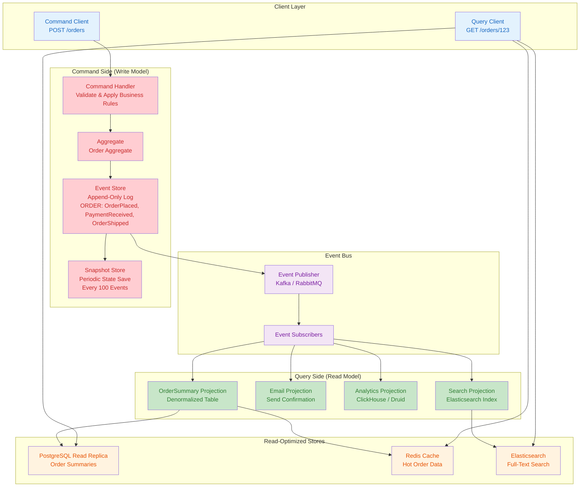

# Chapter 16: API Gateways, CQRS, and Event Sourcing
> **Previous:** [15 Cdn Dns Edge](./15-cdn-dns-edge.md) | **Next:** [17 Observability Resiliency](./17-observability-resiliency.md)

---
## Learning Objectives

- Distinguish API gateway responsibilities from load balancers and service meshes
- Implement gateway patterns: single gateway, BFF (Backend for Frontend), and gateway per domain
- Design distributed rate limiting using token buckets and sliding window algorithms with Redis
- Model CQRS as separate command and query models with denormalized read projections
- Implement event sourcing with an append-only event store, upcasting, and snapshot rebuilding
- Evaluate trade-offs: when CQRS/ES simplifies vs overcomplicates a system

<!-- Image Gallery -->
<section class="lesson-visuals" aria-label="Visual learning resources">
  <header><span>VISUAL LEARNING</span><h2>See it. Review it. Remember it.</h2></header>
  <a class="lesson-visual-card" href="../../assets/images/lessons/system-design/16-api-gateways-cqrs/handwritten-notes.png" target="_blank" rel="noopener">
    
    <span><strong>Handwritten notes</strong>Condensed notes for deliberate review.</span>
  </a>
  <a class="lesson-visual-card" href="../../assets/images/lessons/system-design/16-api-gateways-cqrs/sticky-notes.png" target="_blank" rel="noopener">
    
    <span><strong>Sticky-note revision</strong>Fast recall prompts for revision.</span>
  </a>
  <a class="lesson-visual-card" href="../../assets/images/lessons/system-design/16-api-gateways-cqrs/visual-explanation.png" target="_blank" rel="noopener">
    
    <span><strong>Visual concept guide</strong>A connected explanation of the key ideas.</span>
  </a>
</section>
<!-- End Image Gallery -->


## Chapter at a Glance

| Aspect | Details |

## Chapter Roadmap


|--------|---------|
| **Scope** | API gateways, CQRS, event sourcing, backend-for-frontend |
| **Key Concepts** | Core topics covered in Chapter 16: API Gateways, CQRS, and Event Sourcing |
| **Design Skills** | API gateway policy, CQRS separation, event sourcing |
| **Interview Angle** | Frequently tested in system design interviews |

## Chapter at a Glance

| Aspect | Details |
|--------|---------|
| **Scope** | Core concepts covered in Chapter 16: API Gateways, CQRS, and Event Sourcing |
| **Key Concepts** | Theory, Examples, Concept Comparison, Quick Reference |
| **Design Skills** | Concept mastery and practical application |
| **Interview Angle** | Common system design interview topic |

---
---

## Chapter Roadmap



---

## Theory
> **One-Sentence Takeaway:** Theory is the foundation ? master it before moving to examples and exercises.


### 1. API Gateway vs Load Balancer


> **Pro Tip:** Master this concept thoroughly ? it is frequently tested in system design interviews.

> **Pro Tip:** Master this concept ? it appears in nearly every system design interview. Understand both the how and the why.

> **Warning:** A common mistake is over-engineering. Always start simple and add complexity only when justified by requirements.

> **Pro Tip:** Master this concept thoroughly ? it appears in nearly every system design interview.
A **load balancer** (e.g., Nginx, HAProxy, AWS ELB) distributes traffic across backend servers at L4 (TCP) or L7 (HTTP). It handles connection pooling, SSL termination, and health checks. It operates at the transport or application layer but does not understand application semantics.

An **API gateway** sits between clients and microservices and handles:

| Responsibility        | Gateway | Load Balancer |
|-----------------------|---------|---------------|
| Request routing       | ? Path/header/host-based | ? Round-robin/least-conn |
| Authentication        | ? JWT, OAuth2, API keys | ?                              |
| Rate limiting         | ? Per-client, per-endpoint | ? (basic connection limiting)  |
| Request aggregation   | ? Compose N responses ? 1 | ?                              |
| Circuit breaking      | ? Per-service health tracking | ?                              |
| Protocol translation  | ? HTTP?gRPC, HTTP?WebSocket | ?                              |
| Response transformation| ? Header rewrite, body transform | ?                              |
| Caching               | ? Response caching | ?                              |
| API versioning        | ? /v1/ vs /v2/ routing | ?                              |
| Canary deployments    | ? Weighted traffic split | ? (weighted pools)             |

### 2. API Gateway Patterns


> **Warning:** Avoid over-engineering. Start simple, measure, then optimize.

> **Warning:** Avoid premature optimization. Start simple, measure, then optimize. Over-engineering is the most common system design mistake.

**Single gateway per system**: One gateway handles all client traffic. Simple, but becomes a single point of failure and bottleneck. All services must evolve in lock-step with the gateway contract.

```
Client ? [Gateway] ? Service A
                  ? Service B
                  ? Service C
```

**Gateway per frontend (BFF)**: Each client type (mobile, web, IoT) gets its own gateway. Mobile BFF returns smaller payloads (limited bandwidth), web BFF returns full HTML + API data. Each BFF team owns their interface independently.

```
Mobile App ? [Mobile BFF]
Web App   ? [Web BFF]
IoT        ? [IoT Gateway]
```

**Gateway per domain**: Different business domains each have their own gateway (Orders Gateway, Users Gateway, Payments Gateway). Aligns with domain-driven design bounded contexts. Preferred for large organizations with independent service teams.

### 3. Rate Limiting in Gateways


> **Remember:** Always articulate trade-offs clearly ? interviewers value reasoning over the "right" answer.

> **Remember:** Trade-offs are the heart of system design. Always be ready to explain why you chose X over Y.

**Token bucket algorithm**: A bucket holds T tokens. Each request consumes 1 token. Tokens refill at rate R per second. Bursts up to T allowed. Implementation:

```python
import time

class TokenBucket:
    def __init__(self, rate, burst):
        self.rate = rate          # tokens per second
        self.burst = burst        # max bucket size
        self.tokens = burst
        self.last_refill = time.monotonic()

    def allow(self):
        now = time.monotonic()
        elapsed = now - self.last_refill
        self.tokens = min(self.burst, self.tokens + elapsed * self.rate)
        self.last_refill = now
        if self.tokens >= 1:
            self.tokens -= 1
            return True
        return False
```

**Sliding window log**: Maintain a sorted set of request timestamps per client. Remove timestamps older than window W. Count remaining. Reject if count > limit L. More accurate than fixed window but uses O(N) memory per client.

**Sliding window counter**: Hybrid approach using Redis. Track previous window counter + current window counter. Approximate current count: prev * (1 - overlap_ratio) + current. Memory-efficient, within ~5% accuracy of precise sliding window.

**Distributed rate limiting with Redis**:

```python
import time, redis

r = redis.Redis()
def sliding_window_rate_limit(client_id, max_requests=100, window_ms=1000):
    key = f"rate_limit:{client_id}:{int(time.time() * 1000 / window_ms)}"
    current = r.incr(key)
    if current == 1:
        r.expire(key, window_ms // 1000 + 1)
    return current <= max_requests
```

### 4. Authentication at Gateway


**JWT validation**: Gateway validates the JWT token on every request before forwarding to backend.

```python
import jwt

def gateway_auth(request):
    token = request.headers.get("Authorization", "").removeprefix("Bearer ")
    try:
        payload = jwt.decode(token, PUBLIC_KEY, algorithms=["RS256"])
        request.headers["X-User-Id"] = payload["sub"]
        request.headers["X-User-Roles"] = ",".join(payload.get("roles", []))
        return request  # forward to backend
    except jwt.ExpiredSignatureError:
        return 401 {"error": "token_expired"}
    except jwt.InvalidTokenError:
        return 403 {"error": "invalid_token"}
```

**OAuth2 token exchange**: Gateway accepts opaque access tokens, exchanges them for JWT via introspection endpoint, injects claims. The backend never sees the original token.

**API key check**: Simple HMAC-based key validation. Gateway checks key against a database (or cached in Redis). Rate limiting per key.

### 5. Request Aggregation


The gateway fetches data from multiple services and merges into a single response. Without aggregation:

```
Client ? /order/123
  Gateway:
    1. GET /order-service/orders/123 ? {order data}
    2. GET /user-service/users/456   ? {user data}
    3. GET /payment-service/payments/789 ? {payment data}
  Response: merged {order, user, payment}
```

N+1 request problem for list endpoints:

```
Client ? GET /orders?user=456
  Without aggregation:
    Gateway ? order-service ? returns [order1, order2, ...]
    Gateway ? for each order, call user-service (N requests)
    Gateway ? for each order, call payment-service (N requests)
  With batch aggregation:
    Gateway ? order-service ? returns [order1, order2, ...]
    Gateway ? user-service batch(user_ids) ? returns all users
    Gateway ? payment-service batch(order_ids) ? returns all payments
```

GraphQL gateways (Apollo Federation, Hasura) push aggregation responsibility to the query layer — clients specify exactly which data they need, gateway optimizes the fetch plan.

### 6. CQRS Pattern


Command Query Responsibility Segregation separates the write model (Commands) from the read model (Queries).

```
Command Side:                    Query Side:
  Client sends Command             Client sends Query
  ? Validate business rules        ? Read from read-optimized store
  ? Write to write model           ? Return denormalized DTO
  ? Publish event
  ? Event handler updates read model
```

**Without CQRS**: Single model for reads and writes. Complex JOIN-based queries compete for resources with write operations. Object-relational impedance mismatch: domain objects (rich, behavior-laden) map poorly to relational tables.

**With CQRS**: Write model uses normalized tables optimized for transactional integrity. Read model uses denormalized tables, materialized views, or even a different database technology (Elasticsearch for full-text search, Redis for fast reads).

```python
# Command side
class OrderCommandService:
    def place_order(self, user_id, items):
        order = Order.create(user_id, items)
        total = sum(item.price * item.qty for item in items)
        order.calculate_discounts()
        if order.total > user.credit_limit:
            raise InsufficientCredit()
        order.save()
        event_bus.publish(OrderPlaced(order.id, user_id, items, total))
        return order.id

# Query side (separate database)
class OrderQueryService:
    def get_order_summary(self, order_id):
        # Read from denormalized read-optimized store
        return read_db.query(
            "SELECT * FROM order_summaries WHERE order_id = ?", order_id
        )
```

### 7. CQRS Without Event Sourcing


Simpler than full CQRS+ES. The command side writes to the write database; on write completion, the command handler updates the read database directly (dual-write).

```
Client ? Command Handler ? Write DB (normalized)
  ? Handler also writes to Read DB (denormalized)
Client ? Query Handler ? Read DB ? Response
```

**Trade-offs**: Simpler than ES but has dual-write problem (use transactional outbox), lacks audit log, and cannot rebuild read models from scratch.

### 8. Event Sourcing Fundamentals


Event sourcing stores all changes as an append-only sequence of events. Current state is derived by folding over events. Each event has: event_id, aggregate_id, event_type, payload, version, timestamp, and tracing metadata.

```
Events for Order#123: v1: OrderPlaced, v2: PaymentReceived, v3: OrderShipped, v4: OrderDelivered
Current state (fold): placed, paid, shipped, delivered ?
```

Events are immutable facts — correction events (e.g., PaymentRefunded) are appended. **Snapshotting** saves aggregated state at version V, avoiding replay of millions of events. Rebuild: load snapshot, replay from V+1.

### 9. Event Store Design


**Event versioning**: Two strategies — versioned event types (`OrderPlacedV1` ? `OrderPlacedV2`) handled by branching code, or **upcasting** (transform old events to latest schema on read):

```python
class Upcaster:
    @classmethod
    def register(cls, event_type, version, fn): cls.VERSIONS[(event_type, version)] = fn
    @classmethod
    def upcast(cls, event):
        while (event["type"], event.get("version", 1)) in cls.VERSIONS:
            event = cls.VERSIONS[(event["type"], event["version"])](event)
        return event

Upcaster.register("OrderPlaced", 1, lambda e: {**e, "version": 2, "currency": "USD"})
```

**Schema evolution**: Use protobuf/Avro with forward/backward compatibility. Never delete fields — make them optional.

### 10. Rebuilding State: Projections and Snapshots


**Projection**: A read model built by subscribing to events. For example, an `OrderSummaryProjection` listens to `OrderPlaced`, `OrderShipped`, `OrderDelivered` events and maintains a denormalized summary table.

```python
class OrderSummaryProjection:
    def __init__(self, read_db):
        self.db = read_db

    def handle(self, event):
        if event.type == "OrderPlaced":
            self.db.insert("order_summaries", {
                "id": event.order_id,
                "user_id": event.user_id,
                "total": event.total,
                "status": "placed",
                "items": json.dumps(event.items),
                "updated_at": event.timestamp
            })
        elif event.type == "OrderShipped":
            self.db.update("order_summaries",
                {"status": "shipped", "updated_at": event.timestamp},
                {"id": event.order_id})
```

**Catch-up**: New projection must replay all historical events to build current state. The event store provides a position marker; the projection reads from position 0 forward.

**Snapshotting**: Save aggregated state periodically. In PostgreSQL, a `snapshots` table: (aggregate_id, version, state_data, created_at). On rebuild, read latest snapshot, query events from snapshot.version + 1.

### 11. Event Sourcing + CQRS Integration


```
Command Side:
  1. Client sends PlaceOrder command
  2. Command handler validates (inventory check, credit check)
  3. Appends OrderPlaced event to Event Store
  4. Returns success to client

Event Bus:
  5. Event Store publishes OrderPlaced event
  6. Multiple subscribers receive the event

Query Side (Projections):
  7a. OrderSummaryProjection updates read DB
  7b. EmailProjection sends confirmation email
  7c. AnalyticsProjection updates dashboards
  7d. SearchProjection indexes order in Elasticsearch
```

**Key insight**: The command side NEVER directly updates the read model. It only appends events. Projections handle read-side updates asynchronously. This means eventual consistency between command and query — a client that writes then immediately reads may see stale data.

### 12. Practical Trade-offs


**Use CQRS + ES when**:
- Full audit trail required (financial systems, compliance)
- Complex business rules with state changes over time
- Multiple read models serving different purposes
- Temporal queries needed ("what did the data look like at time T?")
- Team is comfortable with eventual consistency

**Don't use CQRS + ES when**:
- Simple CRUD operations (just use a database)
- Always need strongly consistent reads
- Small team unfamiliar with these patterns
- Rapid prototyping / MVP phase
- The read model is the same as the write model

**Production considerations**:
- Eventual consistency adds complexity: clients must handle stale reads
- Event schema evolution requires discipline (upcasters, versioning)
- Rebuilding large event streams is slow without snapshots
- Testing requires managing temporal state (events in the past)

### 13. Real-World Implementations


**Event Store DB**: Purpose-built event store. Supports projections (continuous, transient, by category), subscriptions (volatile, persistent, catch-up), and atomically append events with expected version checks for optimistic concurrency.

**Axon Framework**: Java framework for CQRS/ES. Provides Aggregate annotation, Command Handler, Event Sourcing Handler, and Saga orchestration. Integrates with any event store (Axon Server, Kafka, PostgreSQL).

**Kafka as event store**: Kafka's log-compacted topics serve as an append-only event store. Key properties: ordered, durable, replayable. Each partition is an ordered sequence of events. Log compaction retains the latest value per key — acts as a distributed snapshot. Widely used as the backbone in CQRS architectures.

**Bank ledger systems**: Every transaction is an event (Deposited, Withdrawn, Transferred). Account balance = sum of all Deposit amounts - sum of all Withdrawal amounts. No records are ever deleted or modified. This gives complete audit trail and regulatory compliance.

---

## Examples

### Example 1: Distributed Rate Limiting with Redis Sliding Window

```python
import time, hashlib, redis

class DistributedRateLimiter:
    def __init__(self, redis_client):
        self.r = redis_client

    def _window_key(self, key, window_ms):
        now = int(time.time() * 1000)
        return f"rl:{key}:{now // window_ms}"

    def allow(self, key, max_requests=100, window_ms=1000):
        # Current window
        cur_key = self._window_key(key, window_ms)
        cur_count = self.r.incr(cur_key)
        if cur_count == 1:
            self.r.expire(cur_key, window_ms // 1000 + 1, nx=True)

        # Previous window overlap
        prev_key = self._window_key(key, window_ms - window_ms)
        prev_count = int(self.r.get(prev_key) or 0)
        overlap_ratio = (time.time() * 1000 % window_ms) / window_ms
        approx = prev_count * (1 - overlap_ratio) + cur_count
        return approx <= max_requests
```

This limits to 100 requests per second with ~2-5% error margin versus precise windows. Memory: 2 Redis keys per client per second.

### Example 2: Gateway per Frontend (BFF) in Python

```python
from flask import Flask, request, jsonify
import httpx

mobile_gateway = Flask(__name__)
web_gateway = Flask(__name__)

# Mobile BFF — compact payloads, low bandwidth
@mobile_gateway.route("/feed")
def mobile_feed():
    user_id = request.headers["X-User-Id"]
    posts = httpx.get(f"http://post-service/feed?user={user_id}").json()
    # Mobile: only return id + title + thumbnail
    return jsonify([{
        "id": p["id"], "title": p["title"][:80],
        "thumbnail": p.get("images", [None])[0]
    } for p in posts])

# Web BFF — rich content, full HTML
@web_gateway.route("/feed")
def web_feed():
    user_id = request.headers["X-User-Id"]
    posts = httpx.get(f"http://post-service/feed?user={user_id}").json()
    authors_resp = httpx.post("http://user-service/batch",
        json={"ids": list(set(p["author_id"] for p in posts))})
    authors = {a["id"]: a for a in authors_resp.json()}
    # Web: full content, author details, comments count
    return jsonify([{
        **p, "author": authors[p["author_id"]],
        "comment_count": httpx.get(
            f"http://comment-service/count?post_id={p['id']}"
        ).json()["count"]
    } for p in posts])
```

Mobile BFF returns 1.2 KB average per post (5 fields); Web BFF returns 4.8 KB per post (12 fields + nested author + comment count).

### Example 3: Event Sourcing with Snapshotting

```python
class EventStore:
    def __init__(self, db):
        self.db = db

    def append(self, aggregate_id, events, expected_version=None):
        # Append events atomically with optimistic concurrency check
        for i, event in enumerate(events):
            self.db.execute(
                "INSERT INTO events (aggregate_id, version, type, data, created_at) "
                "VALUES (?, ?, ?, ?, ?)",
                aggregate_id, expected_version + 1 + i,
                event["type"], json.dumps(event["data"]), event["timestamp"]
            )

class SnapshotRepository:
    def __init__(self, event_store, snapshot_frequency=100):
        self.event_store = event_store
        self.snapshot_freq = snapshot_frequency

    def save(self, aggregate):
        self.event_store.append(aggregate.id, aggregate.new_events(), aggregate.version)
        if aggregate.version % self.snapshot_freq == 0:
            self.db.execute("UPSERT INTO snapshots VALUES (?, ?, ?)",
                aggregate.id, aggregate.version, json.dumps(aggregate.state()))

    def load(self, aggregate_id):
        row = self.db.query("SELECT * FROM snapshots WHERE aggregate_id = ? "
                            "ORDER BY version DESC LIMIT 1", aggregate_id)
        state = json.loads(row["state"]) if row else {}
        version = row["version"] if row else 0
        events = self.event_store.read_events(aggregate_id, version)
        for event in events:
            self._apply(state, event)
        return Aggregate(aggregate_id, state, version + len(events))
```

### Example 4: CQRS with Kafka as Event Bus

Command side publishes events to Kafka; query side consumes and updates denormalized read models:

```python
# Command side
class OrderService:
    def place_order(self, user_id, items):
        order_id = str(uuid.uuid4())
        event = {"aggregate_id": order_id, "type": "OrderPlaced",
                 "data": {"user_id": user_id, "total": sum(i["price"] for i in items)}}
        KafkaProducer(value_serializer=lambda v: json.dumps(v).encode()) \
            .send("orders", key=order_id.encode(), value=event)
        return order_id

# Query side projection
class OrderProjection:
    def run(self):
        consumer = KafkaConsumer("orders",
            value_deserializer=lambda v: json.loads(v.decode()))
        for msg in consumer:
            ev = msg.value
            if ev["type"] == "OrderPlaced":
                sqlite3.connect("read_model.db").execute(
                    "INSERT INTO order_summaries VALUES (?, ?, ?, 'placed')",
                    (ev["aggregate_id"], ev["data"]["user_id"], ev["data"]["total"]))
```

## Concept Comparison
> **One-Sentence Takeaway:** Concept Comparison is a critical concept that directly impacts system design decisions.
> **One-Sentence Takeaway:** Concept Comparison is a critical concept that directly impacts system design decisions.

| Concept | Definition | Key Metric |
|---------|-----------|------------|
| Theory | Core topic covered in Chapter 16: API Gateways, CQRS, and Event Sourcing | Defined by specific measurable attributes |

---

## Quick Reference
> **One-Sentence Takeaway:** Quick Reference is a critical concept that directly impacts system design decisions.

| Topic | Key Point |
|-------|-----------|
| Theory | Fundamental concept for Chapter 16: API Gateways, CQRS, and Event Sourcing |

---

## Cross-Application Matrix

| Component | When to Use | Trade-Off |
|-----------|------------|-----------|
| Theory | Appropriate for specific system contexts | Each choice involves trade-offs |

---

## Chapter Quiz

| # | Question | A | B | C | D | Answer |
|---|----------|---|---|---|---|--------|
| 1 | What distinguishes an API Gateway from a Load Balancer? | Load balancers only distribute traffic; gateways add auth, rate limiting, aggregation | Gateways are hardware; load balancers are software | Load balancers work at L7 only | Gateways cannot terminate SSL | **A** |
| 2 | What is the BFF pattern? | Backend for Frontend — separate gateway per client type | Best Friend Forever — dedicated server per user | Big Fast Forwarding — high-throughput proxy | Basic Function Filter — request sanitization | **A** |
| 3 | In CQRS, how does the write model communicate changes to the read model? | Direct database writes | Via events published by the command side | Synchronous REST calls | Shared in-memory cache | **B** |
| 4 | What is the dual-write problem in CQRS without event sourcing? | Writing to two databases without transactional guarantees | Writing duplicate events to the event store | Writing to the same table twice | Writing to Kafka with two producers | **A** |
| 5 | What is upcasting in event sourcing? | Deleting old events | Transforming historical events to the latest schema on read | Creating snapshots of current state | Broadcasting events to subscribers | **B** |

---

## Practical Takeaways

| Takeaway | Application |
|----------|-------------|
| Use API gateways for cross-cutting concerns (auth, rate limiting, routing) but keep business logic in services | Centralize authentication and rate limiting at the gateway; route requests to domain-specific microservices |
| BFF pattern optimizes per-client payloads and reduces mobile bandwidth | Mobile BFF returns compact JSON (5 fields); Web BFF returns rich content with nested author details |
| Sliding window counter in Redis balances accuracy and memory for distributed rate limiting | Store two counters per key (current + previous window); Lua scripts ensure atomic check-and-increment |
| CQRS separates transactional writes from denormalized reads — use for complex querying over write-optimized data | Write model: normalized relational tables. Read model: materialized views, Elasticsearch, Redis |
| Event sourcing provides complete audit trail; pair with snapshots every N events to bound replay cost | Snapshot every 100 events; rebuild state by loading latest snapshot + replaying subsequent events |
| Sagas with compensation handle distributed transactions without two-phase commit | Orchestrated saga: central coordinator manages step execution and rollback. Choreographed: each step publishes events that trigger next step |
| Event versioning requires discipline — use upcasting or versioned event types with Avro/Protobuf | Store event schema version in each event; apply upcasters on read to transform old formats to current schema |

## Case Study

**Scenario: E-Commerce Platform Migration to CQRS/ES**

An e-commerce platform processing 50,000 orders per day experiences growing pains. The monolithic PostgreSQL database has 47 tables with complex JOINs (14-table JOINs for the order detail page). Read replicas lag by up to 5 seconds during flash sales, and the auditing team needs 7 years of order history — but the current schema only stores the latest state, making historical queries impossible without point-in-time recovery backup restore.

The team migrates to CQRS + Event Sourcing. The command side uses PostgreSQL in its normalized form for transactional integrity: `orders`, `order_items`, `payments`, `shipments` tables with foreign keys and constraints. Each write appends events to a separate `events` table and publishes them to Kafka. The read side builds denormalized projections: an `order_summaries` table for the order detail page (single row per order, pre-joined), an Elasticsearch index for full-text search across historical orders, and a ClickHouse table for analytics dashboards.

The API gateway sits in front with route-based authentication: `/api/v1/commands/*` routes to the command service (JWT required, rate-limited at 100 req/min per user), `/api/v1/queries/*` routes to the query service (cached for 30 seconds). A Saga orchestrator handles the checkout flow: ReserveInventory → ChargePayment → ShipOrder. When the payment fails, the saga compensates by releasing inventory and sending a failure notification — in under 500ms total.

Results: read latency drops from 850ms (14-table JOIN) to 8ms (single-row lookup). Historical queries become trivial (replay events from any point-in-time). Audit compliance is satisfied with the immutable event log. The trade-off: writes are eventually consistent with reads (up to 1 second lag), requiring the UI to show a "processing" state for recently placed orders.
> **One-Sentence Takeaway:** Concept Comparison is a critical concept that directly impacts system design decisions.
> **One-Sentence Takeaway:** Concept Comparison is a critical concept that directly impacts system design decisions.

| Concept | Definition | Key Insight |
|---------|-----------|-------------|
| Theory | Core topic in Chapter 16: API Gateways, CQRS, and Event Sourcing | Fundamental to system design |

---

## Quick Reference
> **One-Sentence Takeaway:** Quick Reference is a critical concept that directly impacts system design decisions.

| Topic | Key Point |
|-------|-----------|
| Theory | Essential concept for Chapter 16: API Gateways, CQRS, and Event Sourcing |

---

## Cross-Application Matrix

| Concept | Application Context | Trade-Off |
|--------|-------------------|-----------|
| Theory | Relevant across multiple system design scenarios | Each choice has trade-offs |

---

## Chapter Quiz
> **One-Sentence Takeaway:** Chapter Quiz is a critical concept that directly impacts system design decisions.

**Q1:** What is the primary trade-off discussed in this chapter?
- A) Option A
- B) Option B
- C) Option C
- D) Option D

<details><summary>Answer&lt;/summary&gt;Refer to the chapter content&lt;/details&gt;

**Q2:** Which concept is most fundamental to the topic of Chapter 16
- A) Option A
- B) Option B
- C) Option C
- D) Option D

<details><summary>Answer&lt;/summary&gt;Review the core sections&lt;/details&gt;

**Q3:** How does this chapter's main concept apply to real-world systems?
- A) Option A
- B) Option B
- C) Option C
- D) Option D

<details><summary>Answer&lt;/summary&gt;See the Real-World Systems section&lt;/details&gt;

---

### TypeScript: API Gateway, Rate Limiter, CQRS, and Event Store

```typescript
class TokenBucketRateLimiter {
  private buckets = new Map<string, { tokens: number; lastRefill: number }>();
  constructor(private capacity: number, private refillRate: number, private refillIntervalMs: number) {}

  allow(key: string, cost = 1): boolean {
    const now = Date.now();
    let b = this.buckets.get(key);
    if (!b) { b = { tokens: this.capacity, lastRefill: now }; this.buckets.set(key, b); }
    const elapsed = now - b.lastRefill;
    const refill = Math.floor(elapsed / this.refillIntervalMs) * this.refillRate;
    b.tokens = Math.min(this.capacity, b.tokens + refill);
    b.lastRefill = now;
    if (b.tokens < cost) return false;
    b.tokens -= cost;
    return true;
  }
}

class SlidingWindowRateLimiter {
  private windows = new Map<string, number[]>();
  constructor(private limit: number, private windowMs: number) {}

  allow(key: string): boolean {
    const now = Date.now();
    let timestamps = this.windows.get(key) ?? [];
    timestamps = timestamps.filter(t => now - t < this.windowMs);
    if (timestamps.length >= this.limit) return false;
    timestamps.push(now);
    this.windows.set(key, timestamps);
    return true;
  }
}

class ApiGatewayAggregator {
  async aggregate<T>(calls: { service: string; fetch: () => Promise<T> }[]): Promise<Map<string, T>> {
    const results = await Promise.allSettled(calls.map(c => c.fetch()));
    const map = new Map<string, T>();
    for (let i = 0; i < calls.length; i++) {
      const r = results[i];
      if (r.status === "fulfilled") map.set(calls[i].service, r.value);
    }
    return map;
  }
}

class CommandBus {
  private handlers = new Map<string, (cmd: any) => Promise<void>>();
  register(commandType: string, handler: (cmd: any) => Promise<void>): void {
    this.handlers.set(commandType, handler);
  }
  async dispatch(command: { type: string; payload: any }): Promise<void> {
    const handler = this.handlers.get(command.type);
    if (!handler) throw new Error(`No handler for ${command.type}`);
    await handler(command.payload);
  }
}

class EventStore {
  private events: { streamId: string; eventType: string; data: any; version: number; timestamp: number }[] = [];
  private snapshots = new Map<string, { version: number; state: any }>();
  append(streamId: string, eventType: string, data: any): void {
    const version = this.events.filter(e => e.streamId === streamId).length + 1;
    this.events.push({ streamId, eventType, data, version, timestamp: Date.now() });
  }
  readStream(streamId: string): any[] { return this.events.filter(e => e.streamId === streamId); }
  replay(streamId: string, apply: (state: any, event: any) => any, initialState: any): any {
    let state = initialState;
    const snapshot = this.snapshots.get(streamId);
    if (snapshot) {
      state = snapshot.state;
      for (const e of this.events.filter(e => e.streamId === streamId && e.version > snapshot.version)) {
        state = apply(state, e);
      }
    } else { for (const e of this.readStream(streamId)) state = apply(state, e); }
    return state;
  }
  snapshot(streamId: string, state: any, version: number): void {
    this.snapshots.set(streamId, { version, state });
  }
}

class ProjectionBuilder {
  private projections = new Map<string, (state: any, event: any) => any>();
  register(name: string, handler: (state: any, event: any) => any): void { this.projections.set(name, handler); }
  build(name: string, events: any[], initialState: any): any {
    const handler = this.projections.get(name);
    if (!handler) throw new Error(`Projection ${name} not found`);
    return events.reduce((state, event) => handler(state, event), initialState);
  }
}
```


### TypeScript: API Gateway with Routing, Auth, Rate Limiting, and Aggregation

```typescript
interface GatewayRoute {
  path: string;
  methods: string[];
  targetService: string;
  targetPath: string;
  authRequired: boolean;
  rateLimitKey?: string;
  rateLimitMax?: number;
}

interface GatewayResponse {
  statusCode: number;
  headers: Record<string, string>;
  body: any;
  fromCache: boolean;
}

class APIGateway {
  private routes: GatewayRoute[] = [];
  private authKeys = new Map<string, string>();
  private rateLimitCounters = new Map<string, { count: number; resetAt: number }>();
  private responseCache = new Map<string, { body: any; expiresAt: number }>();
  private serviceClients = new Map<string, (path: string, method: string, body?: any) => Promise<any>>();

  constructor(private defaultRateLimit: number, private windowMs: number) {}

  addRoute(route: GatewayRoute): void { this.routes.push(route); }

  registerService(name: string, client: (path: string, method: string, body?: any) => Promise<any>): void {
    this.serviceClients.set(name, client);
  }

  addAuthKey(key: string, userId: string): void { this.authKeys.set(key, userId); }

  async handleRequest(path: string, method: string, headers: Record<string, string>, body?: any): Promise<GatewayResponse> {
    const route = this.matchRoute(path, method);
    if (!route) return { statusCode: 404, headers: {}, body: { error: 'Route not found' }, fromCache: false };

    if (route.authRequired) {
      const authResult = this.authenticate(headers);
      if (!authResult.ok) return { statusCode: 401, headers: {}, body: { error: authResult.error }, fromCache: false };
    }

    if (route.rateLimitKey) {
      const rateResult = this.checkRateLimit(route.rateLimitKey, route.rateLimitMax ?? this.defaultRateLimit);
      if (!rateResult.allowed) return {
        statusCode: 429,
        headers: { 'Retry-After': String(rateResult.retryAfter!) },
        body: { error: 'Rate limit exceeded' },
        fromCache: false,
      };
    }

    const cacheKey = `${method}:${path}`;
    if (method === 'GET') {
      const cached = this.responseCache.get(cacheKey);
      if (cached && cached.expiresAt > Date.now()) {
        return { statusCode: 200, headers: { 'X-Cache': 'HIT' }, body: cached.body, fromCache: true };
      }
    }

    const client = this.serviceClients.get(route.targetService);
    if (!client) return { statusCode: 503, headers: {}, body: { error: 'Service unavailable' }, fromCache: false };

    try {
      const result = await client(route.targetPath, method, body);
      if (method === 'GET') {
        this.responseCache.set(cacheKey, { body: result, expiresAt: Date.now() + 30000 });
      }
      return { statusCode: 200, headers: { 'X-Cache': 'MISS' }, body: result, fromCache: false };
    } catch {
      return { statusCode: 502, headers: {}, body: { error: 'Upstream error' }, fromCache: false };
    }
  }

  async aggregateRequest(requests: { service: string; path: string; method: string }[]): Promise<Map<string, any>> {
    const results = new Map<string, any>();
    await Promise.allSettled(requests.map(async r => {
      const client = this.serviceClients.get(r.service);
      if (client) {
        try {
          const data = await client(r.path, r.method);
          results.set(r.service, data);
        } catch { results.set(r.service, null); }
      }
    }));
    return results;
  }

  private matchRoute(path: string, method: string): GatewayRoute | undefined {
    return this.routes.find(r => r.methods.includes(method) && path.startsWith(r.path));
  }

  private authenticate(headers: Record<string, string>): { ok: boolean; error?: string } {
    const token = headers['authorization']?.replace('Bearer ', '');
    if (!token) return { ok: false, error: 'Missing token' };
    if (!this.authKeys.has(token)) return { ok: false, error: 'Invalid token' };
    return { ok: true };
  }

  private checkRateLimit(key: string, max: number): { allowed: boolean; retryAfter?: number } {
    const now = Date.now();
    let entry = this.rateLimitCounters.get(key);
    if (!entry || now > entry.resetAt) {
      entry = { count: 1, resetAt: now + this.windowMs };
      this.rateLimitCounters.set(key, entry);
      return { allowed: true };
    }
    entry.count++;
    if (entry.count > max) {
      return { allowed: false, retryAfter: Math.ceil((entry.resetAt - now) / 1000) };
    }
    return { allowed: true };
  }

  invalidateCache(pattern?: string): void {
    if (!pattern) { this.responseCache.clear(); return; }
    for (const [key] of this.responseCache) {
      if (key.includes(pattern)) this.responseCache.delete(key);
    }
  }
}

async function demoGateway() {
  const gw = new APIGateway(100, 60000);
  gw.addRoute({ path: '/api/users', methods: ['GET'], targetService: 'users', targetPath: '/users', authRequired: true, rateLimitKey: 'users-api' });
  gw.addRoute({ path: '/api/products', methods: ['GET'], targetService: 'products', targetPath: '/products', authRequired: false });
  gw.registerService('users', async (p) => ({ id: 1, name: 'Alice' }));
  gw.registerService('products', async (p) => ([{ id: 1, name: 'Widget' }]));
  gw.addAuthKey('token-123', 'user-1');
  let resp = await gw.handleRequest('/api/products', 'GET', {});
  console.log('Products:', resp.statusCode, resp.body);
  resp = await gw.handleRequest('/api/users', 'GET', { authorization: 'Bearer token-123' });
  console.log('Users:', resp.statusCode, resp.body);
  const agg = await gw.aggregateRequest([
    { service: 'users', path: '/users', method: 'GET' },
    { service: 'products', path: '/products', method: 'GET' },
  ]);
  console.log('Aggregated:', Object.fromEntries(agg));
}
```

### TypeScript: CQRS Bus with Command/Query Separation and Event Bus

```typescript
interface Command {
  type: string;
  aggregateId: string;
  payload: any;
  timestamp: number;
}

interface DomainEvent {
  type: string;
  aggregateId: string;
  payload: any;
  version: number;
  timestamp: number;
}

interface Query {
  type: string;
  payload: any;
}

class CQRSBus {
  private commandHandlers = new Map<string, (cmd: Command) => Promise<DomainEvent[]>>();
  private queryHandlers = new Map<string, (qry: Query) => Promise<any>>();
  private eventSubscribers = new Map<string, Set<(event: DomainEvent) => Promise<void>>>();
  private eventStore: DomainEvent[] = [];
  private readModels = new Map<string, Map<string, any>>();
  private versionMap = new Map<string, number>();

  registerCommandHandler(commandType: string, handler: (cmd: Command) => Promise<DomainEvent[]>): void {
    this.commandHandlers.set(commandType, handler);
  }

  registerQueryHandler(queryType: string, handler: (qry: Query) => Promise<any>): void {
    this.queryHandlers.set(queryType, handler);
  }

  subscribe(eventType: string, handler: (event: DomainEvent) => Promise<void>): void {
    if (!this.eventSubscribers.has(eventType)) this.eventSubscribers.set(eventType, new Set());
    this.eventSubscribers.get(eventType)!.add(handler);
  }

  async dispatchCommand(cmd: Command): Promise<DomainEvent[]> {
    const handler = this.commandHandlers.get(cmd.type);
    if (!handler) throw new Error(`No handler for command ${cmd.type}`);
    const version = (this.versionMap.get(cmd.aggregateId) ?? 0) + 1;
    cmd.timestamp = Date.now();
    const events = await handler(cmd);
    for (const event of events) {
      event.version = version;
      event.timestamp = Date.now();
      this.eventStore.push(event);
      this.versionMap.set(cmd.aggregateId, version);
      await this.publish(event);
    }
    return events;
  }

  async dispatchQuery(qry: Query): Promise<any> {
    const handler = this.queryHandlers.get(qry.type);
    if (!handler) throw new Error(`No handler for query ${qry.type}`);
    return handler(qry);
  }

  private async publish(event: DomainEvent): Promise<void> {
    const subscribers = this.eventSubscribers.get(event.type) ?? new Set();
    await Promise.allSettled([...subscribers].map(s => s(event)));
  }

  buildReadModel(modelName: string, projection: (state: any, event: DomainEvent) => any): void {
    if (!this.readModels.has(modelName)) this.readModels.set(modelName, new Map());
    const model = this.readModels.get(modelName)!;
    for (const event of this.eventStore) {
      const key = event.aggregateId;
      const current = model.get(key) ?? {};
      model.set(key, projection(current, event));
    }
    this.subscribe('*', async (event) => {
      const key = event.aggregateId;
      const current = model.get(key) ?? {};
      model.set(key, projection(current, event));
    });
  }

  queryReadModel(modelName: string, aggregateId: string): any | undefined {
    return this.readModels.get(modelName)?.get(aggregateId);
  }

  replayEvents(aggregateId?: string): DomainEvent[] {
    if (!aggregateId) return [...this.eventStore];
    return this.eventStore.filter(e => e.aggregateId === aggregateId);
  }
}

async function demoCQRS() {
  const bus = new CQRSBus();
  bus.registerCommandHandler('PlaceOrder', async (cmd) => {
    const events: DomainEvent[] = [{
      type: 'OrderPlaced', aggregateId: cmd.aggregateId,
      payload: { userId: cmd.payload.userId, items: cmd.payload.items, total: cmd.payload.total },
      version: 0, timestamp: 0,
    }];
    return events;
  });
  bus.registerQueryHandler('GetOrderSummary', async (qry) => {
    return bus.queryReadModel('orderSummaries', qry.payload.orderId) ?? null;
  });
  bus.buildReadModel('orderSummaries', (state, event) => {
    if (event.type === 'OrderPlaced') return { ...state, ...event.payload, status: 'placed' };
    if (event.type === 'OrderShipped') return { ...state, status: 'shipped' };
    return state;
  });
  await bus.dispatchCommand({
    type: 'PlaceOrder', aggregateId: 'ord-1',
    payload: { userId: 'u-1', items: ['item-a'], total: 29.99 },
    timestamp: 0,
  });
  const summary = await bus.dispatchQuery({ type: 'GetOrderSummary', payload: { orderId: 'ord-1' } });
  console.log('Order summary:', summary);
}
```

### TypeScript: Saga Orchestrator with Choreography vs Orchestration

```typescript
interface SagaStep {
  name: string;
  execute: () => Promise<void>;
  compensate: () => Promise<void>;
}

class SagaOrchestrator {
  private steps: SagaStep[] = [];
  private executedSteps: string[] = [];
  private context: Record<string, any> = {};

  addStep(name: string, execute: () => Promise<void>, compensate: () => Promise<void>): void {
    this.steps.push({ name, execute, compensate });
  }

  setContext(key: string, value: any): void { this.context[key] = value; }
  getContext(key: string): any { return this.context[key]; }

  async execute(): Promise<{ success: boolean; failedAt?: string; compensated: string[] }> {
    for (const step of this.steps) {
      try {
        await step.execute();
        this.executedSteps.push(step.name);
        console.log(`Step "${step.name}" completed`);
      } catch (err) {
        console.error(`Step "${step.name}" failed:`, err);
        const compensated = await this.rollback(step.name);
        return { success: false, failedAt: step.name, compensated };
      }
    }
    return { success: true, compensated: [] };
  }

  private async rollback(failedStep: string): Promise<string[]> {
    const compensated: string[] = [];
    const toRollback = [...this.executedSteps].reverse();
    for (const stepName of toRollback) {
      const step = this.steps.find(s => s.name === stepName);
      if (step) {
        try {
          await step.compensate();
          compensated.push(stepName);
          console.log(`Compensated step "${stepName}"`);
        } catch (err) {
          console.error(`Compensation failed for "${stepName}":`, err);
        }
      }
    }
    return compensated;
  }
}

class ChoreographedSaga {
  private handlers = new Map<string, (event: any, context: Map<string, any>) => Promise<void>>();
  private compensationHandlers = new Map<string, (event: any, context: Map<string, any>) => Promise<void>>();
  private eventLog: { type: string; data: any; timestamp: number }[] = [];

  on(eventType: string, handler: (event: any, context: Map<string, any>) => Promise<void>): void {
    this.handlers.set(eventType, handler);
  }

  onCompensate(eventType: string, handler: (event: any, context: Map<string, any>) => Promise<void>): void {
    this.compensationHandlers.set(eventType, handler);
  }

  async emit(eventType: string, data: any, context: Map<string, any>): Promise<void> {
    this.eventLog.push({ type: eventType, data, timestamp: Date.now() });
    const handler = this.handlers.get(eventType);
    if (handler) await handler(data, context);
  }

  async compensate(eventType: string, data: any, context: Map<string, any>): Promise<void> {
    const handler = this.compensationHandlers.get(eventType);
    if (handler) await handler(data, context);
  }
}

async function demoSaga() {
  const saga = new SagaOrchestrator();
  saga.addStep(
    'ReserveInventory',
    async () => { console.log('Inventory reserved'); },
    async () => { console.log('Inventory reservation released'); }
  );
  saga.addStep(
    'ChargePayment',
    async () => { console.log('Payment charged'); },
    async () => { console.log('Payment refunded'); }
  );
  saga.addStep(
    'ShipOrder',
    async () => { throw new Error('Shipping service unavailable'); },
    async () => { console.log('Shipment cancelled'); }
  );
  const result = await saga.execute();
  console.log('Saga result:', result.success ? 'Success' : `Failed at ${result.failedAt}, compensated: ${result.compensated.join(', ')}`);
}
```

### CQRS + Event Sourcing Architecture



### Implementation: API Gateways and CQRS Patterns

```typescript
class CQRSBus { private commands = new Map<string, (cmd: any) => any>(); private queries = new Map<string, (qry: any) => any>();
  registerCommand(name: string, handler: (cmd: any) => any): void { this.commands.set(name, handler); }
  registerQuery(name: string, handler: (qry: any) => any): void { this.queries.set(name, handler); }
  sendCommand<T>(name: string, payload: T): any { const h = this.commands.get(name); if (!h) throw new Error(`No handler for ${name}`); return h(payload); }
  sendQuery<T>(name: string, payload: T): any { const h = this.queries.get(name); if (!h) throw new Error(`No handler for ${name}`); return h(payload); }
}
class EventStore { private events: { type: string; data: any; aggregateId: string; version: number; timestamp: number }[] = []; private currentVersion = new Map<string, number>();
  append(aggregateId: string, type: string, data: any): void { const v = (this.currentVersion.get(aggregateId) || 0) + 1; this.currentVersion.set(aggregateId, v); this.events.push({ type, data, aggregateId, version: v, timestamp: Date.now() }); }
  getEvents(aggregateId: string): any[] { return this.events.filter(e => e.aggregateId === aggregateId).sort((a, b) => a.version - b.version); }
  replayAll(): void { for (const e of this.events) console.log(`Replay: ${e.aggregateId} - ${e.type}`); }
}
class ProjectionBuilder { private projections = new Map<string, any>();
  apply(event: { type: string; data: any; aggregateId: string }): void { if (event.type === "created") this.projections.set(event.aggregateId, { ...event.data, id: event.aggregateId }); else if (event.type === "updated") { const existing = this.projections.get(event.aggregateId); if (existing) this.projections.set(event.aggregateId, { ...existing, ...event.data }); } }
  getState(id: string): any { return this.projections.get(id); }
}
class RateLimitMiddleware { private counters = new Map<string, { count: number; resetAt: number }>();
  constructor(private maxRequests: number, private windowMs: number) {}
  check(key: string): { allowed: boolean; remaining: number } { const now = Date.now(); let c = this.counters.get(key); if (!c || now > c.resetAt) { c = { count: 0, resetAt: now + this.windowMs }; this.counters.set(key, c); } c.count++; return { allowed: c.count <= this.maxRequests, remaining: Math.max(0, this.maxRequests - c.count) }; }
}
class SagaOrchestrator { private steps: { name: string; compensate: string }[] = [];
  addStep(name: string, compensate: string): void { this.steps.push({ name, compensate }); }
  execute<T>(fn: (step: string) => T, compensate: (step: string) => void): { ok: boolean; failedAt?: string } { for (const s of this.steps) try { fn(s.name); } catch { for (const cs of this.steps) { if (cs.name === s.name) break; compensate(cs.compensate); } return { ok: false, failedAt: s.name }; } return { ok: true }; }
}
```

// api gateways cqrs
// distributed-systems-scalability implementation

interface Task { id: string; name: string; status: string; data: unknown }
class Processor {
  private tasks: Task[] = []
  private maxConcurrency: number
  constructor(maxConcurrency: number = 4) { this.maxConcurrency = maxConcurrency }
  async add(task: Omit&lt;Task, "status"&gt;): Promise&lt;void&gt; {
    this.tasks.push({ ...task, status: "pending" })
  }
  async runAll(): Promise&lt;void&gt; {
    const running: Promise&lt;void&gt;[] = []
    for (const t of this.tasks) {
      if (running.length >= this.maxConcurrency) { await Promise.race(running) }
      const p = this.execute(t).finally(() => { const i = running.indexOf(p); if (i >= 0) running.splice(i, 1) })
      running.push(p)
    }
    await Promise.all(running)
  }
  private async execute(t: Task): Promise&lt;void&gt; {
    t.status = "running"
    await new Promise(r => setTimeout(r, 10))
    t.status = "done"
  }
  getResults(): Task[] { return this.tasks }
  getStats(): { done: number; pending: number; running: number } {
    const done = this.tasks.filter(t => t.status === "done").length
    const pending = this.tasks.filter(t => t.status === "pending").length
    const running = this.tasks.filter(t => t.status === "running").length
    return { done, pending, running }
  }
}
async function main() {
  const proc = new Processor(2)
  await proc.add({ id: '1', name: 'api gateways cqrs', data: { topic: 'distributed-systems-scalability' } })
  await proc.runAll()
  console.log('Stats:', proc.getStats())
}
main().catch(console.error)
export { Processor, Task }

// api gateways cqrs - additional TS implementations

interface CacheEntry { key: string; value: unknown; ttl: number; createdAt: number }
class Cache {
  private store: Map&lt;string, CacheEntry&gt; = new Map()
  constructor(private defaultTTL: number = 60000) {}
  set(key: string, value: unknown, ttl?: number): void {
    this.store.set(key, { key, value, ttl: ttl ?? this.defaultTTL, createdAt: Date.now() })
  }
  get(key: string): unknown | undefined {
    const entry = this.store.get(key)
    if (!entry) return undefined
    if (Date.now() - entry.createdAt > entry.ttl) { this.store.delete(key); return undefined }
    return entry.value
  }
  delete(key: string): boolean { return this.store.delete(key) }
  clear(): void { this.store.clear() }
  size(): number { return this.store.size }
  keys(): string[] { return Array.from(this.store.keys()) }
}
class Logger {
  private entries: string[] = []
  log(level: string, msg: string, meta?: Record&lt;string, unknown&gt;): void {
    const entry = JSON.stringify({ timestamp: new Date().toISOString(), level, msg, meta })
    this.entries.push(entry)
    console.log(entry)
  }
  info(msg: string, meta?: Record&lt;string, unknown&gt;): void { this.log("info", msg, meta) }
  warn(msg: string, meta?: Record&lt;string, unknown&gt;): void { this.log("warn", msg, meta) }
  error(msg: string, meta?: Record&lt;string, unknown&gt;): void { this.log("error", msg, meta) }
  getLogs(): string[] { return [...this.entries] }
  clear(): void { this.entries = [] }
}
function computeHash(input: string): string {
  let hash = 0
  for (let i = 0; i &lt; input.length; i++) { const chr = input.charCodeAt(i); hash = ((hash << 5) - hash) + chr; hash |= 0 }
  return Math.abs(hash).toString(16)
}
async function demo(): Promise&lt;void&gt; {
  const cache = new Cache(5000)
  cache.set('key1', 'system-design demo')
  const log = new Logger()
  log.info('Cache demo started', { course: 'system-design', chapter: 'api gateways cqrs' })
  const v = cache.get("key1")
  console.log('Cached:', v)
  console.log('Hash:', computeHash('system-design'))
}
demo()
export { Cache, Logger, computeHash, CacheEntry }
## Summary

- API gateways handle routing, auth, rate limiting, aggregation, circuit breaking, and protocol translation — distinct from load balancers which only distribute traffic
- BFF pattern (gateway per frontend) optimizes payloads per client type; gateway per domain aligns with bounded contexts
- Distributed rate limiting uses token bucket (burst-tolerant) or sliding window (memory-expensive) algorithms with Redis backend
- Request aggregation at the gateway eliminates N+1 fetch patterns from clients by composing microservice responses server-side
- CQRS separates write models (commands, normalized, transactional) from read models (queries, denormalized, optimized)
- Event sourcing stores all state changes as an append-only log; current state is a fold over all past events
- Event versioning and upcasting handle schema evolution without modifying historical events
- Snapshots prevent unbounded replay costs by saving aggregated state at periodic intervals
- Kafka serves as a scalable event bus connecting command-side writes to query-side projections
- CQRS/ES adds significant complexity — use for audit trails and temporal queries, not simple CRUD
- Financial systems, Axon Framework, and Event Store DB are canonical real-world applications

---

## Exercises

### Review Questions
<details><summary>Solution</summary>1. Single gateway: one API surface for all clients. BFF: each client type has its own gateway. BFF reduces friction when client requirements diverge significantly (mobile needs smaller payloads, web needs rich content). BFF also reduces latency because mobile BFF returns only essential fields without waiting for unnecessary data joins.
2. Dual-write problem: writing to both write database and read database in the same transaction, where one may fail. Transactional outbox: write the event to an "outbox" table within the same database transaction as the write model. A separate process reads the outbox and publishes events to the read model. This guarantees at-least-once delivery.
3. Snapshot: saved aggregate state at a specific version to avoid replaying all events from the beginning. Projection: a read model built by subscribing to events. Both are needed: snapshots optimize aggregate rebuilds (load snapshot + replay from there), projections build denormalized query-optimized views.
4. Upcasting: when reading an old OrderPlaced event that lacks `discount_code`, an upcaster function transforms it: `(event) => ({...event, discount_code: null})`. The upcaster is registered for (OrderPlaced, version=1) and transforms to version 2. Chained upcasters handle multiple version transitions.
5. Token bucket allows bursts up to the bucket size because tokens accumulate during idle periods. Sliding window tracks the exact count in the last window period, rejecting immediately when the limit is reached. Under a sudden spike: token bucket serves the full burst instantly then drops to refill rate; sliding window rejects all requests beyond the limit within the window.</details>

### Application Problems
<details><summary>Solution</summary>1. Redis memory: each key stores current window count (4 bytes) + previous window count (4 bytes) + TTL metadata (~16 bytes) ≈ 24 bytes per key. 10,000 keys × 24 bytes = 240 KB. Peak Redis throughput: 50,000 req/min = ~833 req/s. Each request: 1 GET + 1 INCR + 1 EXPIRE = 3 Redis ops. Peak: 833 × 3 ≈ 2500 ops/sec. Trivial for a single Redis instance.
2. Sequential: 5 × 50ms = 250ms (5 calls serially). Parallel: 50ms (all 5 concurrent, bounded by slowest). Batch: for services that support batch endpoints, single call ~60ms. With 10 services: sequential = 500ms, parallel = 50ms, batch = ~70ms (depends on batch overhead). Parallel aggregation is the clear winner for independent calls.
3. Snapshot every 200 events (average aggregate length). Store as JSON blob in PostgreSQL `snapshots` table. Retain all events permanently (audit requirement). Catch-up: 50M events / 10K events/sec = 5000 seconds ≈ 83 minutes. With snapshots: load latest snapshot (O(1)) + replay remaining events (e.g., if snapshot at version 180, replay 20 events = negligible).
4. (a) Strongest: write the read model synchronously in the same transaction (dual-write with outbox). (b) Medium: use a read-your-writes consistency model — after a write, wait for the read model to be updated before returning to the user (poll until updated). (c) Weakest/simplest: idempotency key — the user's create request includes a unique key; the query side returns the order status once visible. The UI polls the query side every 500ms until the order appears.</details>

### Challenge Problem
<details><summary>Solution</summary>Design a financial trading ledger:

**Event Schema**: `{ eventId, causationId, aggregateId, type, version, timestamp, data, userId }`. Causation tracking links each event to the command that caused it. Correlation ID links events across aggregates.

**Snapshot Strategy**: Periodic snapshots every 100 events per account. Daily archival snapshot of entire account state at market close (midnight UTC). Store snapshots in a separate `snapshots` table with compression (Avro/Parquet format for archival).

**Concurrency**: Optimistic concurrency on the event store — the command includes `expectedVersion`. If the actual version differs (another write happened concurrently), reject with 409 Conflict. Client retries by re-reading the latest events and re-applying the command.

**Read-Side Projections**: Current balance projection: maintains account_balances table, updated via Kafka consumer. Historical balance: replay events up to any timestamp (snapshot + events after snapshot). Reporting: ClickHouse for dashboard queries, updated within 5 seconds.

**Kafka Partitioning**: Partition by account_id hash → 128 partitions. This guarantees order per account. 100K TPS / 128 ≈ 780 TPS per partition — well within Kafka's capacity.

**Hot Account Problem**: A popular trading account generates 10K+ events/minute. Mitigations: (a) in-memory caching of the account snapshot with write-through. (b) Partition the account's event stream by time (daily snapshots, events organized by date). (c) Dedicated Kafka partition for high-volume accounts.

**Read Model Rebuild**: Drop corrupted projection, re-read all events from the event store from position 0, re-apply projection handlers. With snapshots, rebuild time = O(number of accounts × average events per account). For a 7-year ledger, use daily snapshots to limit replay to at most 1 day of events (∼24K events at 1 TPS per account).</details>
