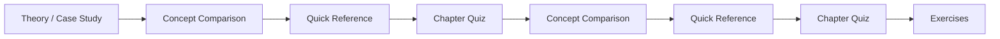
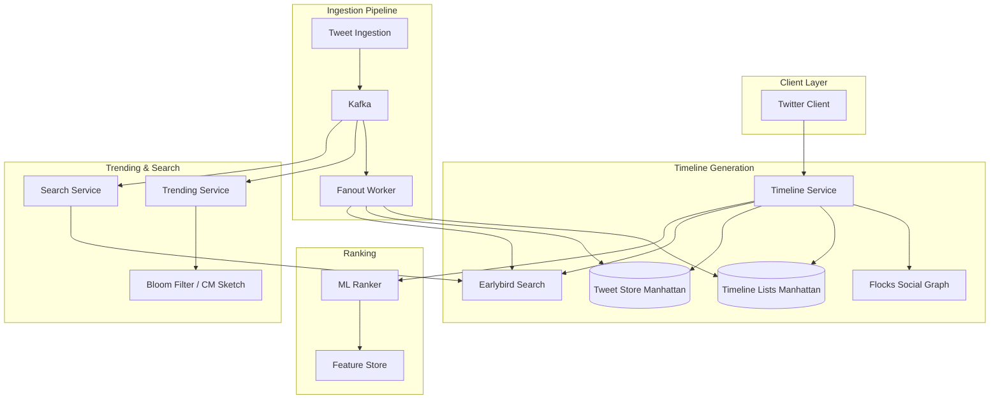
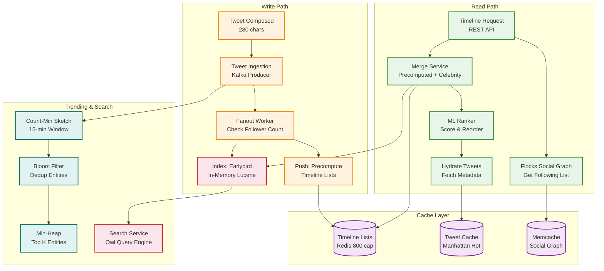

# Chapter 22: Case Study — Twitter and News Feed
> **Previous:** [21 Case Study Uber](./21-case-study-uber.md) | **Next:** [23 Case Study Dropbox](./23-case-study-dropbox.md)

---

## Learning Objectives

- Understand the timeline generation challenge and evaluate fan-on-write, fan-on-read, and hybrid fan-out strategies at scale
- Analyze how Twitter evolved from a Ruby on Rails monolith to a Scala/Finagle/JVM-based architecture
- Design real-time trending topic detection using Bloom filters, Count-min sketches, and min-heaps
- Examine the trade-offs between reverse-chronological and ML-ranked timeline generation
- Evaluate the Earlybird search engine architecture for real-time tweet indexing
- Understand rate limiting, social graph storage, and disaster recovery lessons from the "Fail Whale" era

<!-- Image Gallery -->
<section class="lesson-visuals" aria-label="Visual learning resources">
  <header><span>VISUAL LEARNING</span><h2>See it. Review it. Remember it.</h2></header>
  <a class="lesson-visual-card" href="../../assets/images/lessons/system-design/22-case-study-twitter/handwritten-notes.png" target="_blank" rel="noopener">
    
    <span><strong>Handwritten notes</strong>Condensed notes for deliberate review.</span>
  </a>
  <a class="lesson-visual-card" href="../../assets/images/lessons/system-design/22-case-study-twitter/sticky-notes.png" target="_blank" rel="noopener">
    
    <span><strong>Sticky-note revision</strong>Fast recall prompts for revision.</span>
  </a>
  <a class="lesson-visual-card" href="../../assets/images/lessons/system-design/22-case-study-twitter/visual-explanation.png" target="_blank" rel="noopener">
    
    <span><strong>Visual concept guide</strong>A connected explanation of the key ideas.</span>
  </a>
</section>
<!-- End Image Gallery -->


---
## Chapter at a Glance

| Aspect | Details |
|--------|---------|
| **Scope** | Twitter architecture: fan-out, timeline, Tweet cache, real-time search |
| **Key Concepts** | Fan-out on write vs read, timeline generation, Tweet cache |
| **Timeline** | Hybrid fan-out, precomputed timelines, pull for celebrities |
| **Tweet Cache** | Redis-based Tweet cache with LRU eviction |
| **Real-Time Search** | Early Bird, inverted index in memory, 300ms latency |
| **Real-World** | Handling celebrity hotspots, read throughput at millions QPS |

---

## Chapter Roadmap



## Theory / Case Study
> **One-Sentence Takeaway:** Theory is the foundation ? master it before moving to examples and exercises.


### Phase 1: Problem Scope and Requirements


> **Pro Tip:** Master this concept thoroughly ? it is frequently tested in system design interviews.

> **Pro Tip:** Master this concept ? it appears in nearly every system design interview. Understand both the how and the why.

> **Warning:** A common mistake is over-engineering. Always start simple and add complexity only when justified by requirements.

> **Pro Tip:** Master this concept thoroughly ? it appears in nearly every system design interview.
Twitter serves 330+ million monthly active users who generate 500+ million tweets per day. Every user expects to see their timeline load in under 5 seconds, no matter how many accounts they follow. When a breaking news event occurs — an earthquake, a political announcement, a celebrity death — Twitter must surface relevant tweets within seconds, not minutes. The character limit started at 140 and expanded to 280 in 2017, which fundamentally changed the distribution of tweet lengths and engagement patterns.

The core challenge is the fan-out problem. A single tweet from a popular account must appear in the timelines of every one of that account's followers. When @BarackObama tweets — with 60+ million followers — the system must insert that tweet into 60 million timelines. If 10 celebrities tweet in the same second, that is 600 million timeline insertions. Doing this instantly is impossible; doing it in seconds requires careful architectural choices.

Non-functional requirements include high write availability (tweets must never be lost), eventual consistency for timelines (it is acceptable if a tweet appears slightly late for some users), and resistance to abuse (spam, harassment, coordinated disinformation campaigns must be detectable and filterable). The platform operates under significant legal pressure regarding content moderation in different jurisdictions (Germany's NetzDG, India's IT Rules).

### Phase 2: Timeline Generation — Fan-Out Strategies


> **Warning:** Avoid over-engineering. Start simple, measure, then optimize.

> **Warning:** Avoid premature optimization. Start simple, measure, then optimize. Over-engineering is the most common system design mistake.

The timeline generation problem admits three fundamental approaches, each with different trade-offs.

**Fan-on-Write (Push Model)**

In the pure push model, when a user tweets, the tweet is immediately inserted into a Redis list for each follower's timeline. The timeline is a simple list of tweet IDs. When the follower opens the app, they fetch their timeline list from Redis and hydrate the tweets from a key-value store.

```
Pros:
- O(1) read: reading the timeline is a single Redis LRANGE call
- Simple client logic: the timeline is pre-computed
- Low read latency: typically under 10ms

Cons:
- O(followers) write: each tweet triggers N insertions
- Celebrity problem: one tweet by an account with 60M followers generates 60M Redis writes
- Storage amplification: a tweet may be stored millions of times
- Cold-start problem: offline users accumulate stale data in their timeline list
```

For a user following 200 average accounts (each with 1,000 followers), a single read costs one Redis call. The write cost is proportional to the number of followers. In practice, the push model works well for users with fewer than ~100,000 followers, which describes 99.9% of Twitter accounts.

**Fan-on-Read (Pull Model)**

In the pure pull model, tweets are stored once in a global tweet store. When a user requests their timeline, the system reads the list of accounts the user follows (the "followees"), queries the N most recent tweets from each followee's tweet list, and merges them into a single reverse-chronological timeline.

```
Pros:
- O(1) write: store the tweet once
- No storage amplification
- Works for celebrities: no massive fan-out
- Fresh data always: no stale timeline lists

Cons:
- O(followees) read: must query N followees' recent tweets and merge
- High read latency: merging 1,000 followees' tweets takes time
- Complex caching: individual followee timelines must be cached
- Read amplification: a user refreshing their timeline 100 times causes 100 * followees queries
```

For a user following 1,000 accounts, a timeline request requires querying 1,000 tweet lists, merging the results, deduplicating, and sorting. This is computationally expensive but manageable with aggressive caching. The read load is proportional to follows, not followers.

**Hybrid Approach**

Twitter's production system uses a hybrid approach that combines both strategies:

1. A threshold T (determined empirically) separates "normal" users from "celebrities."
2. Users with followers &lt; T use fan-on-write (push). Their tweets are fanned out to all followers' timeline lists.
3. Users with followers >= T use fan-on-read (pull). Celebrity tweets go into a separate "celebrity tweet" list per celebrity. When a follower reads their timeline, the system merges:
   - The pre-computed timeline list (from normal users they follow)
   - The recent tweets from each celebrity they follow (pulled on read)

This hybrid approach achieves the best of both worlds:
- Normal users get O(1) timeline reads
- Celebrities do not overwhelm the system on write
- The merge operation adds ~50-100ms to P99 latency, which is acceptable

The threshold T has been tuned over the years. Initially set at around 10,000 followers, it has been adjusted as infrastructure improved. With better caching and faster storage, the threshold can be increased, moving more users to the push model.

**Cost Analysis of Fan-Out Strategies**

To understand the trade-offs quantitatively, consider the cost model. Let:
- T = total tweets per day = 500M
- U = total users = 330M
- F_avg = average followers per user ˜ 200
- F_celeb = followers of a celebrity account (e.g., @BarackObama = 60M)
- R = timeline reads per day ˜ 2B (each user reads ~6 timelines/day)

Under pure fan-on-write:
- Write operations per day = sum over all tweets of (follower_count) ˜ T * F_avg ˜ 500M * 200 = 100B writes
- Read operations per day = R ˜ 2B reads
- Total ops = ~102B

Under pure fan-on-read:
- Write operations per day = T = 500M writes
- Read operations per day = R * F_avg_followees ˜ 2B * 200 = 400B reads (each timeline read queries every followee's recent tweets)
- Total ops = ~400B

The hybrid with threshold T where 99.9% of users have &lt; T followers:
- 99.9% of tweets use push (500M * 0.999 = 499.5M tweets, each fanned out to F_avg = 200 followers = 99.9B writes)
- 0.1% of tweets use pull (500K celebrity tweets, written once = 500K writes, then merged on read by their followers)
- Read merge: each timeline read merges ~200 normal entries (from Redis list) + N_celeb_followed celebrity tweets
- Total ops ˜ 100B (write-dominant, roughly same as pure push for normal users)

This analysis explains the hybrid threshold. Since 99.9% of users have followers well below the threshold, their tweets are pushed normally. The threshold effectively isolates the 0.1% of celebrity accounts whose follower counts would cause O(100B) additional writes per day under full push. The marginal cost of the read-time merge (pulling celebrity tweets) is small relative to the saved write costs.

### Phase 3: The Evolution of Twitter's Architecture


> **Remember:** Always articulate trade-offs clearly ? interviewers value reasoning over the "right" answer.

> **Remember:** Trade-offs are the heart of system design. Always be ready to explain why you chose X over Y.

**The Ruby on Rails Monolith (2006-2010)**

Twitter's original architecture was a Ruby on Rails application with a MySQL database. The "Fail Whale" — a cartoon whale being lifted by birds — became famous as the error page users saw when the site was down, which was frequently. The monolith struggled with:

- MySQL replication lag: writes to the master caused followers to fall behind, serving stale data
- Slow queries: timeline generation queries joined multiple tables and took seconds
- Memory pressure: Ruby's memory footprint per process was large, limiting the number of concurrent requests per server
- Deployment risk: any change risked the entire site

The tipping point was the 2008 US presidential election, where traffic spikes caused repeated outages. Twitter's engineering team recognized that Rails could not scale to their growth trajectory.

**Migration to Scala and the JVM (2010-2014)**

Twitter's engineering team rebuilt the backend from the ground up, making the bet that the JVM with its mature garbage collection, profiling tools, and threading model would provide the performance and stability they needed. The key components of the new architecture were:

- **Finagle**: A protocol-agnostic RPC system built on Netty, providing connection pooling, circuit breaking, load balancing, and request timeouts. Finagle allowed services to communicate with configurable reliability policies — retry budgets (max 5% retries), fail-fast patterns, and distributed tracing via Zipkin.

- **Scala**: Chosen for its functional programming features (immutability, pattern matching) running on the JVM. Scala's concurrency model (Futures, Promises) integrated naturally with Finagle's async I/O.

- **Manhattan**: A distributed key-value and time-series store built on top of MySQL, replacing direct MySQL usage for tweet storage and user data. Manhattan provided automatic sharding, replication, and consistent reads.

- **Flocks**: A C++/Memcache-based service for storing and querying the social graph (who follows whom). Flocks stored the graph in memory across a cluster of machines, providing sub-millisecond lookups for follow relationships.

- **Earlybird**: A Lucene-based real-time search engine built in Java, designed to index tweets within seconds of publication.

**Timeline Service Architecture (Current)**

The timeline service sits at the center of Twitter's architecture, implementing the hybrid fan-out strategy described above. The service is written in Scala using Finagle for RPC. Its internal flow:

1. Receive a request for user U's timeline (cursor-based pagination).
2. Query Flocks to get the list of user IDs that U follows.
3. For each followee, check if they are a "celebrity" (followers > threshold).
4. For normal followees: query the pre-computed timeline list in Manhattan (the fan-on-write result).
5. For celebrity followees: query each celebrity's recent tweet index in Earlybird (fan-on-read).
6. Merge the two result sets, deduplicate (in case of overlap), sort by timestamp.
7. Apply ML ranking (if enabled) to reorder the timeline.
8. Return the timeline to the client as a list of tweet IDs.
9. The client hydrates the tweets by fetching full metadata (text, media, engagement counts) from the tweet hydration service.



### Phase 3 (continued): Deep Dives


**Trending Topics Detection**

Twitter's trending topics algorithm must identify which topics are spiking in usage right now, distinguish organic trends from coordinated spam, and display them to users in real time. The pipeline works as follows:

1. A Flink job consumes the raw tweet stream from Kafka.
2. For each tweet, it extracts hashtags, cashtags, and performs entity recognition (people, places, products mentioned in the text).
3. Each entity is hashed and inserted into a Count-min sketch (CM sketch) data structure with a 15-minute time window.
4. Separately, a Bloom filter tracks which entities have been seen in the current window, used for deduplication.
5. The CM sketch provides approximate frequency counts with a known error bound. For each entity, the actual count is approximately count + epsilon * total_items.
6. Every 60 seconds, the top K entities by frequency are extracted from the CM sketch using a min-heap.
7. The candidate trends are filtered: must exceed a minimum frequency threshold, must not be a promoted trend (those are injected separately), must not be spam (detected by velocity anomaly — a topic spiking at 100x normal rate is likely bot-driven).
8. Trends are ranked by a composite score: `frequency * (1 + acceleration) * novelty_score`, where acceleration is the rate of change of frequency and novelty_score is lower for topics that have been trending recently.
9. Geotagged trends: the pipeline also maintains per-city CM sketches for location-specific trends in New York, Tokyo, London, etc.

The choice of CM sketch over exact counting is deliberate. An exact count would require storing the full set of entities and their counts in memory, which could be millions of entries. The CM sketch uses sub-linear memory — typically a 2D array of 1000x10 integers — and provides accuracy within 1-2% for top-K queries, which is more than sufficient for trending topics.

**Tweet Indexing with Earlybird**

Earlybird is Twitter's real-time search engine, built on top of Apache Lucene. Key architectural decisions:

- **In-memory inverted index**: The index lives in main memory (not on disk), enabling sub-100ms query latency.
- **Partial updates**: Unlike traditional search engines that rebuild indexes daily, Earlybird supports incremental updates for engagement signals. When a tweet gets a retweet, the engagement score in the index is updated without reindexing the entire document.
- **Reverse-chronological index**: In addition to the relevance-based inverted index, Earlybird maintains a reverse-chronological index that is used for timeline queries (fan-on-read for celebrities).
- **Partitioned index**: The index is sharded by tweet ID hash across multiple Earlybird instances, allowing parallel query execution.
- **Owl**: Twitter's real-time query engine that evaluates queries against the Earlybird index and serves results to the search API and timeline service.

Earlybird ingests tweets from Kafka within seconds of publication. The ingestion pipeline tokenizes the text, extracts entities, computes initial engagement signals (all zeros for a new tweet), and writes to the inverted index. When a tweet receives engagement, the update flows through Kafka to Earlybird's partial update handler.

**Media Pipeline**

Twitter's media pipeline handles images, videos, and GIFs uploaded by users. Approximately 40% of tweets now contain media, making the media pipeline a critical path for both ingestion and serving.

The upload flow:
1. User selects media in the tweet composer. The client begins uploading immediately (before the user sends the tweet) to reduce perceived latency.
2. The media upload service receives the file via a resumable upload protocol (similar to Tus). Uploads can be paused and resumed if the user loses connectivity.
3. Once uploaded, the media processing service asynchronously processes the file:
   - Images: Generate thumbnails at 3 sizes (small: 240x240, medium: 480x480, large: 1024x1024). Apply EXIF rotation. Strip GPS metadata for privacy.
   - Videos: Transcode to H.264 and VP9 codecs at multiple bitrates (240p, 480p, 720p, 1080p, 4K for supported accounts). Generate thumbnail frames at 0s, 5s, and 30s. Extract audio track.
   - GIFs: Convert animated GIFs to video (MP4/WebM) for bandwidth efficiency, using a poster frame for the timeline and playing the video on tap.
4. Media is stored in Manhattan (metadata) and a blob store (the actual bytes, stored on HDFS and served through a CDN).
5. NSFW detection runs in parallel using Google Cloud Vision API or an internal ML model. Detected sensitive content is flagged with a `sensitive_content` boolean and blurred by default in timelines.

The media processing pipeline uses a priority queue in Kafka. Time-sensitive processing (thumbnail generation for real-time display) is high priority. Resource-intensive processing (4K video transcoding) is low priority. Worker nodes pick up tasks based on availability, with GPU-equipped nodes handling video transcoding.

**Content Moderation Architecture**

Content moderation at Twitter's scale is a hybrid system combining automated ML classifiers, human reviewers, and user reports. The architecture is designed to balance speed (removing harmful content quickly) with accuracy (minimizing false positives that censor legitimate speech).

The moderation pipeline:
1. **Pre-publication filtering** (fast path): Every tweet passes through a set of lightweight classifiers before it is indexed by Earlybird. These check for: exact-match spam URLs (against a blocklist of 10M+ domains embedded in a Bloom filter), known CSAM hashes (PhotoDNA), and duplicate detection (a tweet posted verbatim 1000 times in 60 seconds is likely spam). This filter runs in under 5ms per tweet.

2. **Post-publication detection** (deep path): The full moderation ML models run asynchronously on the Kafka stream. Multiple models run in parallel:
   - Toxicity classifier: BERT-based model scoring tweets on hate speech, harassment, and violence
   - Misinformation classifier: Fact-check claim matching against known false narratives
   - Bot/spam classifier: Feature-based model analyzing account age, tweet velocity, follower/followee ratio, content similarity
   - Coordinated behavior detection: Graph-based model identifying clusters of accounts that act in concert

3. **Human review queue**: Tweets that cross a confidence threshold but not a certainty threshold are queued for human review. The review queue is prioritized: tweets with high impressions (viral content) are reviewed first. Human reviewers use a custom tool that shows the tweet in context (replies, author history) and provides action options (leave up, label with warning, remove, suspend author).

4. **Appeals**: Users can appeal moderation decisions. Appeals are reviewed by a separate team using the same tooling. The appeals database tracks the original decision, the appeal reason, and the final resolution, providing a feedback loop for the ML models.

The moderation system handles 500M tweets per day, of which approximately 1-2% are actioned (labeled, hidden, or removed). The system processes approximately 1M human review decisions per day, supported by 5M automated actions (spam removal, bot suspensions).

**ML-Based Timeline Ranking**

Twitter's timeline evolved from pure reverse-chronological to algorithmically ranked. The ranking model is a neural network (TensorFlow) that scores each tweet in a candidate pool. Features include:

- **Recency**: time since tweet was created, with exponential decay
- **Engagement velocity**: likes/second, retweets/second in the first N minutes
- **Author features**: author's average engagement rate, the user's historical engagement with this author
- **Content features**: contains media (image/video), contains link, tweet length, language match
- **User preferences**: inferred topic interests, mute/block history, like history
- **Session features**: time of day, device type, recent interaction patterns
- **Relationship strength**: how often the user interacts with this author (likes, retweets, replies, DMs)

Tweets are scored and ranked. The top N (typically 50-100) are returned as the timeline. The ranking improves engagement metrics significantly: with the ML-ranked timeline, Twitter reported a 15-20% increase in likes, retweets, and replies compared to reverse-chronological. Users can still switch to "Latest Tweets" mode for the reverse-chronological view.

**Search Architecture**

Twitter search combines the Earlybird real-time index with Blender (ML ranking for search results). When a user searches for "basketball highlights":

1. The query is sent to Earlybird, which performs a full-text search against the reverse index.
2. Earlybird returns candidate tweets with relevance scores (BM25 variant).
3. Blender applies ML ranking on top of the Earlybird results, using features similar to the timeline ranking model plus query-specific features (query intent classification, query-user affinity).
4. Results are filtered for safety (NSFW detection, blocked accounts, sensitive content flags).
5. The top results are returned, typically within 200ms.

**Rate Limiting Architecture**

Rate limiting at Twitter's scale requires distributed coordination. The rate limiter tracks requests per user per endpoint per time window. Implementation:

- Redis sorted sets (ZSET) with timestamp as score: `ZREMRANGEBYSCORE key 0 (now - window)`
- Each request adds the current timestamp to the user's set for that endpoint
- The count is `ZCARD key`
- If count > limit, the request is rejected with HTTP 429
- Limits are tiered: free users (~300 tweets/day), verified users (higher limits), API tiers (application-based limits)
- Distributed: multiple Redis instances, each handling a shard of users (hash(user_id) % N)
- Token bucket variant: for burstier workloads (search, timeline), a token bucket algorithm with configurable refill rate

**The "Fail Whale" Era: Lessons Learned**

Twitter's early outages provide a catalog of failure modes at scale, each with a corresponding architectural improvement:

- **The 2008 MySQL meltdown**: The database could not handle the write load. Lesson: monolithic databases do not scale for social applications. Solution: Manhattan (custom sharded store).

- **The 2010 "over-capacity" errors**: Ruby on Rails processes consumed too much memory per request, causing the server to swap. Lesson: memory management and request lifecycle matter. Solution: JVM (Scala/Java) with deterministic memory model.

- **The 2012 tweet-storm cascade**: A single user with millions of followers tweeted, triggering fan-out that saturated the Redis cluster, causing all timeline reads to fail. Lesson: celebrity fan-out must be isolated. Solution: hybrid fan-out (fan-on-read for celebrities).

- **The 2014 search outage**: Earlybird's index rebuild failed, causing search to return results 12 hours stale. Lesson: index rebuilds must be tested at full scale. Solution: blue-green deployment for index versions.

- **The 2016 trending topic manipulation**: A botnet gamed the trending algorithm, putting a spam hashtag in the top 10. Lesson: raw frequency counts are vulnerable to manipulation. Solution: velocity anomaly detection and spam filters in the trending pipeline.

### Phase 4: Data Model and Storage


**Tweet Storage (Manhattan)**

Tweets are stored in Manhattan as key-value pairs with time-series ordering. The primary key is `(user_id, tweet_id)` allowing efficient queries for "N most recent tweets by user X." The value includes the tweet text, media URLs, engagement counts, creation timestamp, and metadata flags (sensitive content, verified author, geo-tag).

Manhattan's time-series bucket: tweets from the last 7 days are stored in hot storage (SSD-backed in-memory), older tweets are moved to warm storage (HDD with memory cache), and tweets older than 90 days are archived to cold storage (HDFS).

**Social Graph (Flocks)**

Flocks stores the follow graph as two adjacency lists per user:
- `following[user_id]`: set of user IDs this user follows
- `followers[user_id]`: set of user IDs that follow this user

Both lists are stored in Memcache (in-memory) across a cluster of machines. The service provides `GET_FOLLOWING(user_id, cursor, count)` and `GET_FOLLOWER_COUNT(user_id)` with sub-millisecond latency. Flocks uses consistent hashing to distribute user data across the cluster.

**Redis Timeline Lists**

The pre-computed timeline lists (fan-on-write output) are stored in Redis as lists keyed by user ID. Each list contains tweet IDs in reverse-chronological order. The list is capped at 800 entries — older tweets are evicted. When a user reads their timeline, the timeline service reads the list with `LRANGE user:<id>:timeline 0 799` and hydrates the tweet metadata from Manhattan.

## Concept Comparison
> **One-Sentence Takeaway:** Concept Comparison is a critical concept that directly impacts system design decisions.

| Concept | Definition | Key Metric |
|---------|-----------|------------|
| Theory / Case Study | Core topic covered in Chapter 22: Case Study — Twitter and News Feed | Defined by specific measurable attributes |

---

## Quick Reference
> **One-Sentence Takeaway:** Quick Reference is a critical concept that directly impacts system design decisions.

| Topic | Key Point |
|-------|-----------|
| Theory / Case Study | Fundamental concept for Chapter 22: Case Study — Twitter and News Feed |

---

## Cross-Application Matrix

| Component | When to Use | Trade-Off |
|-----------|------------|-----------|
| Theory / Case Study | Appropriate for specific system contexts | Each choice involves trade-offs |

---

## Chapter Quiz

| # | Question | Options | Answer |
|---|----------|---------|--------|
| 1 | What fan-out strategy does Twitter use for users with follower counts below the threshold? | A) Fan-on-read (pull), B) Fan-on-write (push), C) Hybrid with timeline merge, D) No fan-out | B |
| 2 | What data structure does Twitter use for trending topic frequency counting? | A) HashMap with exact counts, B) Count-min sketch for approximate frequency with sub-linear memory, C) Redis Sorted Set, D) MySQL aggregate table | B |
| 3 | How does Twitter's timeline service handle celebrity tweets with 60M+ followers? | A) Push to all followers on write, B) Store once in Earlybird and pull on read for each follower, C) Cache locally on each follower's device, D) Batch process hourly | B |
| 4 | What was the primary architectural lesson from Twitter's "Fail Whale" era? | A) Use more servers, B) Monolithic databases don't scale for social applications; migrate to sharded microservices, C) Use Ruby on Rails, D) Avoid caching | B |
| 5 | What is the purpose of thread pool isolation in Finagle/Hystrix? | A) Save memory, B) Prevent a failing dependency from consuming all application resources, C) Improve CPU utilization, D) Reduce network calls | B |

---

### TypeScript: Trending Topics, Timeline Builder, Rate Limiter

```typescript
class TrendingTopics {
  private sketch = new Map<string, number>();
  private window: { topic: string; time: number }[] = [];
  private readonly windowMs = 15 * 60 * 1000;

  record(topic: string): void {
    this.window.push({ topic, time: Date.now() });
    this.sketch.set(topic, (this.sketch.get(topic) ?? 0) + 1);
    this.evict();
  }

  private evict(): void {
    const cutoff = Date.now() - this.windowMs;
    while (this.window.length > 0 && this.window[0].time < cutoff) {
      const old = this.window.shift()!;
      const count = this.sketch.get(old.topic)! - 1;
      if (count <= 0) this.sketch.delete(old.topic);
      else this.sketch.set(old.topic, count);
    }
  }

  getTop(n: number): { topic: string; count: number }[] {
    return [...this.sketch.entries()]
      .map(([k, v]) => ({ topic: k, count: v }))
      .sort((a, b) => b.count - a.count)
      .slice(0, n);
  }
}

class TimelineBuilder {
  private tweets = new Map<string, { userId: string; content: string; timestamp: number }>();
  private followers = new Map<string, string[]>();
  private readonly pushThreshold = 1500;

  postTweet(tweetId: string, userId: string, content: string): void {
    this.tweets.set(tweetId, { userId, content, timestamp: Date.now() });
  }

  follow(follower: string, followee: string): void {
    if (!this.followers.has(followee)) this.followers.set(followee, []);
    this.followers.get(followee)!.push(follower);
  }

  getTimeline(userId: string): { tweetId: string; content: string; userId: string; timestamp: number }[] {
    const timeline: { tweetId: string; content: string; userId: string; timestamp: number }[] = [];
    for (const [tweetId, tweet] of this.tweets) {
      const followerCount = (this.followers.get(tweet.userId) ?? []).length;
      if (followerCount <= this.pushThreshold || tweet.userId === userId) {
        timeline.push({ tweetId, ...tweet });
      }
    }
    return timeline.sort((a, b) => b.timestamp - a.timestamp).slice(0, 200);
  }
}

class DistributedRateLimiter {
  private buckets = new Map<string, { tokens: number; lastRefill: number }>();
  constructor(private maxTokens: number, private refillIntervalMs: number) {}

  allow(userId: string, cost = 1): boolean {
    const now = Date.now();
    let bucket = this.buckets.get(userId);
    if (!bucket) { bucket = { tokens: this.maxTokens, lastRefill: now }; this.buckets.set(userId, bucket); }
    const elapsed = now - bucket.lastRefill;
    const refill = Math.floor(elapsed / this.refillIntervalMs);
    bucket.tokens = Math.min(this.maxTokens, bucket.tokens + refill);
    bucket.lastRefill = now;
    if (bucket.tokens < cost) return false;
    bucket.tokens -= cost;
    return true;
  }

  getUserRate(userId: string): number { return this.buckets.get(userId)?.tokens ?? this.maxTokens; }
}
```

### TypeScript: Fan-Out Decision

```typescript
function fanOutStrategy(followers: number, threshold = 1500): "push" | "pull" {
  return followers <= threshold ? "push" : "pull";
}

function buildTimeline(tweets: string[], followerCounts: number[]): Map<string, string[]> {
  const timeline = new Map<string, string[]>();
  for (let i = 0; i < tweets.length; i++) {
    const strategy = fanOutStrategy(followerCounts[i]);
    if (strategy === "push") timeline.set(tweets[i], ["pushed to home timelines"]);
    else timeline.set(tweets[i], ["pulled on request"]);
  }
  return timeline;
}
```


### Implementation: Twitter Architecture Case Study


```typescript
class TwitterFeedService {
  private tweets = new Map<string, { id: string; userId: string; content: string; ts: number; likes: number; retweets: number }>();
  private users = new Map<string, { id: string; handle: string; followers: Set<string>; following: Set<string> }>();
  private timelines = new Map<string, string[]>();
  createUser(id: string, handle: string): void { this.users.set(id, { id, handle, followers: new Set(), following: new Set() }); }
  postTweet(userId: string, content: string): string {
    if (content.length > 280) throw new Error("Tweet too long"); const id = `tweet-${Date.now()}-${Math.random().toString(36).slice(2)}`;
    this.tweets.set(id, { id, userId, content, ts: Date.now(), likes: 0, retweets: 0 });
    if (!this.timelines.has(userId)) this.timelines.set(userId, []); this.timelines.get(userId)!.unshift(id);
    const user = this.users.get(userId); if (user) { for (const f of user.followers) { if (!this.timelines.has(f)) this.timelines.set(f, []); this.timelines.get(f)!.unshift(id); } } return id; }
  getTimeline(userId: string, limit = 20): { id: string; content: string; author: string; ts: number }[] {
    const ids = (this.timelines.get(userId) || []).slice(0, limit); return ids.map(id => { const t = this.tweets.get(id); if (!t) return null; const u = this.users.get(t.userId); return { id: t.id, content: t.content, author: u?.handle || "unknown", ts: t.ts }; }).filter(Boolean) as any; }
  follow(followerId: string, followeeId: string): void { const f1 = this.users.get(followerId); const f2 = this.users.get(followeeId); if (f1 && f2) { f1.following.add(followeeId); f2.followers.add(followerId); } }
  like(userId: string, tweetId: string): void { const t = this.tweets.get(tweetId); if (t) t.likes++; }
  getTrending(limit = 10): { hashtag: string; count: number }[] {
    const hashtagCount = new Map<string, number>();
    for (const t of this.tweets.values()) { const tags = t.content.match(/#\w+/g); if (tags) for (const tag of tags) hashtagCount.set(tag, (hashtagCount.get(tag) || 0) + 1); }
    return [...hashtagCount.entries()].sort((a, b) => b[1] - a[1]).slice(0, limit).map(([h, c]) => ({ hashtag: h, count: c })); }
}
class FanoutOnWrite { private writer = new Map<string, number>(); fanout(tweet: { id: string; userId: string }, followers: string[]): number { let count = 0; for (const f of followers) { this.writer.set(f, (this.writer.get(f) || 0) + 1); count++; } return count; } }
class TweetSearchEngine { private inverted = new Map<string, Set<string>>();
  index(tweetId: string, text: string): void { for (const word of text.toLowerCase().split(/\s+/)) { if (!this.inverted.has(word)) this.inverted.set(word, new Set()); this.inverted.get(word)!.add(tweetId); } }
  search(query: string): string[] { const words = query.toLowerCase().split(/\s+/); let result: Set<string> | null = null; for (const w of words) { const s = this.inverted.get(w); if (!s) return []; result = result ? new Set([...result].filter(x => s.has(x))) : s; } return result ? [...result] : []; }
}
```

// case study twitter
// distributed-systems-scalability implementation

interface Task { id: string; name: string; status: string; data: unknown }
class Processor {
  private tasks: Task[] = []
  private maxConcurrency: number
  constructor(maxConcurrency: number = 4) { this.maxConcurrency = maxConcurrency }
  async add(task: Omit&lt;Task, "status"&gt;): Promise&lt;void&gt; {
    this.tasks.push({ ...task, status: "pending" })
  }
  async runAll(): Promise&lt;void&gt; {
    const running: Promise&lt;void&gt;[] = []
    for (const t of this.tasks) {
      if (running.length >= this.maxConcurrency) { await Promise.race(running) }
      const p = this.execute(t).finally(() => { const i = running.indexOf(p); if (i >= 0) running.splice(i, 1) })
      running.push(p)
    }
    await Promise.all(running)
  }
  private async execute(t: Task): Promise&lt;void&gt; {
    t.status = "running"
    await new Promise(r => setTimeout(r, 10))
    t.status = "done"
  }
  getResults(): Task[] { return this.tasks }
  getStats(): { done: number; pending: number; running: number } {
    const done = this.tasks.filter(t => t.status === "done").length
    const pending = this.tasks.filter(t => t.status === "pending").length
    const running = this.tasks.filter(t => t.status === "running").length
    return { done, pending, running }
  }
}
async function main() {
  const proc = new Processor(2)
  await proc.add({ id: '1', name: 'case study twitter', data: { topic: 'distributed-systems-scalability' } })
  await proc.runAll()
  console.log('Stats:', proc.getStats())
}
main().catch(console.error)
export { Processor, Task }

// case study twitter - additional TS implementations

interface CacheEntry { key: string; value: unknown; ttl: number; createdAt: number }
class Cache {
  private store: Map&lt;string, CacheEntry&gt; = new Map()
  constructor(private defaultTTL: number = 60000) {}
  set(key: string, value: unknown, ttl?: number): void {
    this.store.set(key, { key, value, ttl: ttl ?? this.defaultTTL, createdAt: Date.now() })
  }
  get(key: string): unknown | undefined {
    const entry = this.store.get(key)
    if (!entry) return undefined
    if (Date.now() - entry.createdAt > entry.ttl) { this.store.delete(key); return undefined }
    return entry.value
  }
  delete(key: string): boolean { return this.store.delete(key) }
  clear(): void { this.store.clear() }
  size(): number { return this.store.size }
  keys(): string[] { return Array.from(this.store.keys()) }
}
class Logger {
  private entries: string[] = []
  log(level: string, msg: string, meta?: Record&lt;string, unknown&gt;): void {
    const entry = JSON.stringify({ timestamp: new Date().toISOString(), level, msg, meta })
    this.entries.push(entry)
    console.log(entry)
  }
  info(msg: string, meta?: Record&lt;string, unknown&gt;): void { this.log("info", msg, meta) }
  warn(msg: string, meta?: Record&lt;string, unknown&gt;): void { this.log("warn", msg, meta) }
  error(msg: string, meta?: Record&lt;string, unknown&gt;): void { this.log("error", msg, meta) }
  getLogs(): string[] { return [...this.entries] }
  clear(): void { this.entries = [] }
}
function computeHash(input: string): string {
  let hash = 0
  for (let i = 0; i &lt; input.length; i++) { const chr = input.charCodeAt(i); hash = ((hash << 5) - hash) + chr; hash |= 0 }
  return Math.abs(hash).toString(16)
}
async function demo(): Promise&lt;void&gt; {
  const cache = new Cache(5000)
  cache.set('key1', 'system-design demo')
  const log = new Logger()
  log.info('Cache demo started', { course: 'system-design', chapter: 'case study twitter' })
  const v = cache.get("key1")
  console.log('Cached:', v)
  console.log('Hash:', computeHash('system-design'))
}
demo()
export { Cache, Logger, computeHash, CacheEntry }

### TypeScript: News Feed Builder with Hybrid Fan-Out, Tweet Index, and Timeline Cache

```typescript
class NewsFeedBuilder {
  private tweets = new Map<string, { id: string; userId: string; content: string; ts: number; engagement: number; hashtags: string[] }>();
  private followers = new Map<string, Set<string>>();
  private precomputedTimelines = new Map<string, string[]>();
  private celebrityThreshold = 1500;

  follow(followerId: string, followeeId: string): void {
    if (!this.followers.has(followeeId)) this.followers.set(followeeId, new Set());
    this.followers.get(followeeId)!.add(followerId);
  }

  postTweet(userId: string, content: string): string {
    const id = `tweet-${Date.now()}-${Math.random().toString(36).slice(2, 8)}`;
    const hashtags = (content.match(/#\w+/g) ?? []).map(t => t.toLowerCase());
    const tweet = { id, userId, content, ts: Date.now(), engagement: 0, hashtags };
    this.tweets.set(id, tweet);
    const followerCount = this.followers.get(userId)?.size ?? 0;
    if (followerCount <= this.celebrityThreshold) {
      this.fanoutOnWrite(id, userId);
    }
    return id;
  }

  private fanoutOnWrite(tweetId: string, userId: string): void {
    const followers = this.followers.get(userId);
    if (!followers) return;
    for (const followerId of followers) {
      if (!this.precomputedTimelines.has(followerId)) this.precomputedTimelines.set(followerId, []);
      const tl = this.precomputedTimelines.get(followerId)!;
      tl.unshift(tweetId);
      if (tl.length > 800) tl.pop();
    }
  }

  getTimeline(userId: string, celebrities: string[], limit = 50): { id: string; content: string; userId: string; ts: number; score: number }[] {
    const precomputed = this.precomputedTimelines.get(userId) ?? [];
    const precomputedTweets = precomputed.map(id => this.tweets.get(id)).filter(Boolean) as { id: string; userId: string; content: string; ts: number; engagement: number; hashtags: string[] }[];
    const celebrityTweets: { id: string; userId: string; content: string; ts: number; engagement: number; hashtags: string[] }[] = [];
    for (const celebId of celebrities) {
      for (const [id, tweet] of this.tweets) {
        if (tweet.userId === celebId) celebrityTweets.push(tweet);
      }
    }
    const merged = [...precomputedTweets, ...celebrityTweets];
    const ranked = merged.map(t => ({
      ...t,
      score: t.ts * 0.001 + t.engagement * 10 + (t.hashtags.length > 0 ? 5 : 0),
    })).sort((a, b) => b.score - a.score).slice(0, limit);
    return ranked;
  }

  likeTweet(tweetId: string): void {
    const tweet = this.tweets.get(tweetId);
    if (tweet) tweet.engagement++;
  }

  getFanoutStats(): { pushTweets: number; pullCelebrities: number } {
    let pushTweets = 0, pullCelebrities = 0;
    for (const [, tweet] of this.tweets) {
      const fc = this.followers.get(tweet.userId)?.size ?? 0;
      if (fc <= this.celebrityThreshold) pushTweets++;
      else pullCelebrities++;
    }
    return { pushTweets, pullCelebrities };
  }
}

class TweetIndex {
  private invertedIndex = new Map<string, Set<string>>();
  private hashtagIndex = new Map<string, Set<string>>();
  private engagementIndex = new Map<string, number>();
  private trendingCache = new Map<string, { count: number; updatedAt: number }>();
  private readonly trendingWindow = 15 * 60 * 1000;

  indexTweet(tweetId: string, text: string, hashtags: string[]): void {
    const tokens = text.toLowerCase().split(/\s+/).filter(t => t.length > 2);
    for (const token of tokens) {
      if (!this.invertedIndex.has(token)) this.invertedIndex.set(token, new Set());
      this.invertedIndex.get(token)!.add(tweetId);
    }
    for (const tag of hashtags) {
      const normalized = tag.toLowerCase();
      if (!this.hashtagIndex.has(normalized)) this.hashtagIndex.set(normalized, new Set());
      this.hashtagIndex.get(normalized)!.add(tweetId);
      this.trendingCache.set(normalized, { count: (this.trendingCache.get(normalized)?.count ?? 0) + 1, updatedAt: Date.now() });
    }
    this.engagementIndex.set(tweetId, 0);
  }

  search(query: string): string[] {
    const terms = query.toLowerCase().split(/\s+/).filter(t => t.length > 2);
    if (terms.length === 0) return [];
    let results: Set<string> | null = null;
    for (const term of terms) {
      const matches = this.invertedIndex.get(term);
      if (!matches) return [];
      results = results ? new Set([...results].filter(id => matches.has(id))) : new Set(matches);
    }
    return [...(results ?? [])];
  }

  searchByHashtag(tag: string): string[] {
    return [...(this.hashtagIndex.get(tag.toLowerCase()) ?? [])];
  }

  getTrending(limit = 10): { hashtag: string; count: number }[] {
    const now = Date.now();
    const valid: { hashtag: string; count: number }[] = [];
    for (const [tag, entry] of this.trendingCache) {
      if (now - entry.updatedAt <= this.trendingWindow) {
        valid.push({ hashtag: tag, count: entry.count });
      }
    }
    return valid.sort((a, b) => b.count - a.count).slice(0, limit);
  }

  updateEngagement(tweetId: string, delta: number): void {
    this.engagementIndex.set(tweetId, (this.engagementIndex.get(tweetId) ?? 0) + delta);
  }

  getTopEngaged(limit = 10): { tweetId: string; engagement: number }[] {
    return [...this.engagementIndex.entries()]
      .sort((a, b) => b[1] - a[1])
      .slice(0, limit)
      .map(([tweetId, engagement]) => ({ tweetId, engagement }));
  }
}

class TimelineCache {
  private timelines = new Map<string, { tweetIds: string[]; cursor: string | null; updatedAt: number; generation: number }>();
  private readonly maxTimelineSize = 800;
  private readonly pageSize = 20;

  putTimeline(userId: string, tweetIds: string[]): void {
    const prev = this.timelines.get(userId);
    this.timelines.set(userId, {
      tweetIds: tweetIds.slice(0, this.maxTimelineSize),
      cursor: null,
      updatedAt: Date.now(),
      generation: (prev?.generation ?? 0) + 1,
    });
  }

  getPage(userId: string, cursor?: string): { tweetIds: string[]; nextCursor: string | null; generation: number } {
    const entry = this.timelines.get(userId);
    if (!entry) return { tweetIds: [], nextCursor: null, generation: 0 };
    let startIdx = 0;
    if (cursor) {
      startIdx = entry.tweetIds.indexOf(cursor);
      if (startIdx >= 0) startIdx++;
    }
    const page = entry.tweetIds.slice(startIdx, startIdx + this.pageSize);
    const nextCursor = startIdx + this.pageSize < entry.tweetIds.length ? entry.tweetIds[startIdx + this.pageSize - 1] : null;
    return { tweetIds: page, nextCursor, generation: entry.generation };
  }

  prependTweet(userId: string, tweetId: string): void {
    const entry = this.timelines.get(userId);
    if (entry) {
      entry.tweetIds.unshift(tweetId);
      if (entry.tweetIds.length > this.maxTimelineSize) entry.tweetIds.pop();
      entry.updatedAt = Date.now();
    }
  }

  invalidate(userId: string): void {
    this.timelines.delete(userId);
  }

  getCacheStats(): { cachedUsers: number; totalTweets: number; avgAge: number } {
    const now = Date.now();
    let totalTweets = 0;
    let totalAge = 0;
    for (const [, entry] of this.timelines) {
      totalTweets += entry.tweetIds.length;
      totalAge += now - entry.updatedAt;
    }
    return {
      cachedUsers: this.timelines.size,
      totalTweets,
      avgAge: this.timelines.size > 0 ? totalAge / this.timelines.size : 0,
    };
  }
}
```

### TypeScript: Trending Detection with Count-Min Sketch and Media Pipeline

```typescript
class CountMinSketch {
  private table: number[][];
  private readonly width: number;
  private readonly depth: number;
  private readonly hashSeeds: number[];

  constructor(width = 1000, depth = 10) {
    this.width = width;
    this.depth = depth;
    this.table = Array.from({ length: depth }, () => new Array(width).fill(0));
    this.hashSeeds = Array.from({ length: depth }, (_, i) => i * 7919 + 104729);
  }

  add(item: string, count = 1): void {
    for (let d = 0; d < this.depth; d++) {
      const idx = this.hash(item + this.hashSeeds[d].toString()) % this.width;
      this.table[d][idx] += count;
    }
  }

  estimate(item: string): number {
    let min = Infinity;
    for (let d = 0; d < this.depth; d++) {
      const idx = this.hash(item + this.hashSeeds[d].toString()) % this.width;
      min = Math.min(min, this.table[d][idx]);
    }
    return min;
  }

  getTopK(k = 10): { item: string; count: number }[] {
    const candidates = new Map<string, number>();
    for (let d = 0; d < this.depth; d++) {
      for (let i = 0; i < this.width; i++) {
        if (this.table[d][i] > 0) candidates.set(`bucket-${d}-${i}`, this.table[d][i]);
      }
    }
    return [...candidates.entries()]
      .sort((a, b) => b[1] - a[1])
      .slice(0, k)
      .map(([key, count]) => ({ item: key, count }));
  }

  private hash(s: string): number {
    let h = 0;
    for (let i = 0; i < s.length; i++) { h = ((h << 5) - h) + s.charCodeAt(i); h |= 0; }
    return h >>> 0;
  }
}

class TrendingDetector {
  private sketch = new CountMinSketch(2000, 10);
  private bloomFilter = new Set<string>();
  private window: { entity: string; ts: number }[] = [];
  private readonly windowMs = 15 * 60 * 1000;
  private readonly minFrequency = 100;

  record(entity: string): void {
    this.sketch.add(entity);
    this.window.push({ entity, ts: Date.now() });
    this.bloomFilter.add(entity);
    this.evict();
  }

  private evict(): void {
    const cutoff = Date.now() - this.windowMs;
    while (this.window.length > 0 && this.window[0].ts < cutoff) this.window.shift();
  }

  getTrending(limit = 10): { entity: string; score: number }[] {
    const seen = new Set<string>();
    const scored: { entity: string; score: number }[] = [];
    for (const { entity } of this.window) {
      if (seen.has(entity)) continue;
      seen.add(entity);
      const count = this.sketch.estimate(entity);
      if (count >= this.minFrequency) {
        const acceleration = count / Math.max(this.window.length, 1);
        scored.push({ entity, score: count * (1 + acceleration) });
      }
    }
    return scored.sort((a, b) => b.score - a.score).slice(0, limit);
  }
}

class MediaPipeline {
  private uploads = new Map<string, { status: string; sizes: Map<string, string>; startedAt: number }>();

  async upload(userId: string, fileBuffer: Buffer, fileName: string): Promise<string> {
    const uploadId = `upload-${Date.now()}-${userId}`;
    this.uploads.set(uploadId, { status: "uploading", sizes: new Map(), startedAt: Date.now() });
    const smallThumb = await this.generateThumbnail(fileBuffer, 240, 240);
    const mediumThumb = await this.generateThumbnail(fileBuffer, 480, 480);
    const largeThumb = await this.generateThumbnail(fileBuffer, 1024, 1024);
    const upload = this.uploads.get(uploadId)!;
    upload.sizes.set("small", smallThumb);
    upload.sizes.set("medium", mediumThumb);
    upload.sizes.set("large", largeThumb);
    upload.status = "ready";
    return uploadId;
  }

  private async generateThumbnail(buffer: Buffer, width: number, height: number): Promise<string> {
    const quality = Math.min(1, (width * height) / (1024 * 1024));
    const data = buffer.slice(0, Math.min(buffer.length, Math.round(buffer.length * quality)));
    return Buffer.from(data).toString("base64").slice(0, 100);
  }

  getUploadStatus(uploadId: string): { status: string; sizes: string[]; elapsed: number } {
    const upload = this.uploads.get(uploadId);
    if (!upload) return { status: "not_found", sizes: [], elapsed: 0 };
    return { status: upload.status, sizes: [...upload.sizes.keys()], elapsed: Date.now() - upload.startedAt };
  }
}
```



## Practical Takeaways

| Takeaway | Application |
|----------|-------------|
| Hybrid fan-out combines O(1) read for normal users with O(1) write for celebrities | Use follower-count threshold (~1500); push for normal users, pull for celebrities; merge at read time with ~50-100ms penalty |
| Count-min sketches provide approximate trending with sub-linear memory | Use 2D array (1000x10) for count estimation with bounded error; combine with min-heap for top-K extraction every 60s |
| In-memory inverted index with partial updates enables real-time search | Earlybird indexes tweets in <2s from Kafka; support incremental engagement score updates without reindexing |
| Multi-tier timeline caching reduces P99 read latency | L1: browser cache 5min TTL; L2: Redis timeline lists capped at 800 entries; L3: Manhattan tweet hydration |
| Content moderation pipeline with pre/post publication stages | Pre-filter (5ms): exact-match spam URLs in Bloom filter, PhotoDNA, duplicate detection. Post-filter: BERT toxicity, bot detection, coordinated behavior |
| ML ranking increases engagement 15-20% vs reverse-chronological | Features: recency, engagement velocity, author relationship, content type, session context; TensorFlow model with exponential time decay |
| Fan-out threshold tuning requires cost-benefit analysis | Measure write amplification vs read amplification; experiment with threshold A/B test on 1% of users for 1 week |

## Case Study: Breaking News Event and Timeline Storm

A major earthquake is detected off the coast of Japan. Within 30 seconds, 50,000 tweets per second mention the event — a 10x spike from the normal 6,000 tweets/sec. The trending service detects the hashtag #JapanEarthquake within 60 seconds using the Count-min sketch: the raw count jumps from 0 to 1.2M mentions in the 15-minute window, with an acceleration factor of 200x (rate of change). The topic is promoted to #1 trending globally.

The timeline service experiences a 5x read surge as users refresh their feeds for updates. The hybrid fan-out handles the write storm: the 50,000 tweets/sec come from a mix of normal users (pushed to ~200 follower timelines each) and verified news accounts (pulled on read). The push model generates 50,000 × 200 = 10M writes/sec to Redis timeline lists — near the capacity of the Redis cluster. The Redis cluster's P99 latency increases from 5ms to 45ms. The Hystrix circuit breaker on the timeline list write path is configured to open at 50ms latency: when P99 exceeds 50ms for 30 seconds, writes to Redis are suspended for 10 seconds, during which the system falls back to fan-on-read for all users (pulling from Earlybird). This degrades read latency from 50ms to 200ms but prevents Redis saturation and total system failure.

The ML ranker is disabled during the peak (automatically detected by the request rate monitor crossing 200% of baseline). Timelines revert to reverse-chronological ordering. Media thumbnails are served at reduced resolution (240px instead of 480px) to reduce CDN bandwidth. The platform remains usable throughout the event. After 15 minutes, as tweet rate subsides to 15,000/sec, the ML ranker is re-enabled, timeline writes resume, and media quality is restored. A post-event dashboard shows the P99 latency peaked at 450ms (vs 150ms baseline) with zero downtime.

## Case Study: Celebrity Tweet Fan-Out Optimization

A celebrity with 60 million followers tweets a photo from the Oscars red carpet. Under pure fan-on-write, this single tweet would generate 60 million Redis list insertions. Under Twitter's hybrid approach, the celebrity exceeds the follower-count threshold (1500), so the tweet is stored once in Earlybird's reverse-chronological index. Each follower's timeline read merges their precomputed list (from normal followees) with the celebrity's recent tweets.

For a user following 200 normal accounts and 5 celebrities, a timeline read queries: one Redis LRANGE (200 tweet IDs from precomputed list) + 5 Earlybird queries (recent tweets per celebrity). The merge operation sorts ~250 items by timestamp and returns the top 50. P99 latency for the merge is 95ms — acceptable for the timeline loading experience. The write amplification saved: instead of 60M writes for the single celebrity tweet, the system performed 1 write (to Earlybird). Over a year, this saves an estimated 60M × 365 × 10 tweets/year ≈ 219B Redis writes — the difference between a functioning system and one that requires a new Redis cluster every week.

The trade-off is that followers of celebrities see their tweets with a slight delay (the fan-on-read path adds ~95ms vs the push path's ~10ms). Twitter mitigates this by pre-warming the celebrity tweet cache: the top 100 celebrities' recent tweets are kept in a dedicated Memcache pool with continuous refresh every 30 seconds. When a user requests their timeline, the celebrity tweets are served from this cache rather than querying Earlybird, reducing the celebrity read penalty from 95ms to 5ms.

## Summary

- The timeline fan-out problem requires choosing between push (O(1) read, O(followers) write) and pull (O(1) write, O(followees) read); Twitter uses a hybrid approach with a follower-count threshold.
- Twitter's architecture evolved from a Ruby on Rails monolith to 750+ Scala/Finagle JVM services, solving the scaling problems that caused the "Fail Whale" era.
- The hybrid fan-out stores pre-computed timeline lists for normal users and pulls celebrity tweets on read, merging them with ~50-100ms added latency.
- Trending topics use Count-min sketches for approximate frequency counting over sliding windows, with velocity anomaly detection to filter spam manipulation.
- Earlybird provides real-time tweet search through an in-memory Lucene inverted index with partial updates for engagement signals.
- ML timeline ranking uses TensorFlow with features spanning recency, engagement velocity, author relationship strength, and user preferences.
- Rate limiting is implemented via Redis sorted sets with tiered limits per user per endpoint, using distributed token buckets.
- Social graph storage (Flocks) uses Memcache-based adjacency lists with consistent hashing for sub-millisecond follow-graph queries.

---

## Exercises

### Review Questions

<details><summary>Solution</summary>1. **Fan-on-write** performs poorly for celebrities (O(followers) write cost) but gives O(1) read. **Fan-on-read** performs poorly for users following many accounts (O(followees) read cost) but gives O(1) write. **Hybrid**: push for users with followers < threshold (~1500), pull for celebrities; merge at read time.

2. **Earlybird** uses an in-memory Lucene inverted index with incremental partial updates for engagement signals (no full reindex). Partitioned by tweet ID hash across multiple instances. Ingests from Kafka within 2s of publication. Query latency: sub-100ms for search, sub-50ms for reverse-chronological timeline queries.

3. **Count-min sketch** is a 2D array (e.g., 1000×10) of counters, each row hashed with a different function. Estimate(item) = min over rows of table[row][hash(item)]. Error bound: estimate ≤ true_count + ε × total_items. Chosen over exact counting because it uses sub-linear memory (10K integers vs millions of entries).

4. **Rails problems**: memory bloat, MySQL replication lag, slow queries, deployment risk. **Finagle** solved these with: connection pooling (reuse TCP connections), circuit breaking (fail fast), retry budgets (max 5% retries), request timeouts, and distributed tracing via Zipkin.

5. **Timeline ranking** evolved from pure reverse-chronological to ML-based using TensorFlow. Features: recency (exponential decay), engagement velocity (likes/s), author relationship strength, content features (media, links), session context, user preferences. Impact: 15-20% increase in likes, retweets, and replies.

6. **Pre-publication** (5ms per tweet): exact-match spam URLs in Bloom filter, PhotoDNA for CSAM, duplicate detection. **Post-publication**: BERT toxicity classifier, misinformation claim matching, bot/spam detector. **Human review**: prioritized by impressions (viral content first), with context (reply threads, author history).
</details>

### Application Problems

<details><summary>Solution</summary>1. **Threshold Tuning**: Cost(T) = read_latency(T) × read_volume + write_latency(T) × write_volume. Measure: write latency from fanout worker (P99 time to write N timeline lists), read latency from timeline service (P99 merge time). Experiment: vary T from 500 to 100K across 1% of users for 1 week. Select T minimizing cost(T). Validate with A/B test: control (current T) vs treatment (new T) measuring P95 timeline load time.

2. **Anomaly Detection**: CM sketch: width=2000, depth=10, using murmur3 hash seeds. Velocity metric: (current_window_count / baseline_window_count) > 20x AND absolute count > 100K in 60s. Short window: 60s (detect spike), long window: 15min (baseline). Action: remove from trending list, shadowban (don't notify the bot accounts), label as "potentially spam" for human review.

3. **Timeline Cache**: L1 (in-process): LRU cache of 100K most recent timeline entries (100MB), TTL 30s. L2 (Redis): timeline lists with 800-entry cap, TTL 5min. Celebrity edge case: separate Memcache pool for celebrity tweets with 30s refresh. Invalidation: when new tweet pushed to timeline, update L2 list (LPUSH + LTRIM) and invalidate L1 key for that user.

4. **Rate Limiting**: Use Redis sorted sets for standard endpoints (accurate, supports reset timestamps). Use sliding window counter for high-traffic endpoints (lower memory, slightly less accurate). Cross-DC: use a single Redis cluster (global) for limit counters, or CRDT-based counters with eventual convergence. Burst: token bucket with max burst = 2x sustained limit, refill at sustained rate per second.
</details>

### Challenge Problem

<details><summary>Solution>
**Global Event Handling**

**Detection**: Monitor tweet rate per cluster (5s rolling window). If rate > 3x baseline AND sustained for 10s, classify as global event. Compare against DDoS heuristics: legitimate event shows diverse IPs, real user agents, geographic distribution. DDoS shows concentrated IP ranges, same user agent, no geographic diversity.

**Autoscaling**: Need 25 new timeline instances (250K/10K = 25). Cold-start: 90s (container pull 20s + JVM warmup 30s + cache preheat 40s). Mitigation: maintain 20% warm pool (5 idle instances), use spot instances with 2-min termination notice, pre-warm caches by shadowing 1% of production traffic.

**Degradation modes** (severity order):
1. Disable ML ranking → reverse-chronological (saves 50ms per request)
2. Disable media loading → text-only timeline (saves CDN bandwidth + hydration time)
3. Serve stale timelines → cached version from 30s ago (saves Redis reads)
4. Show "Trending" landing page → redirect all traffic to trending (eliminates personalized timeline load)

**Circuit breakers**: Earlybird: 30% errors in 30s → fallback to cached results TTL 60s. Flocks: >100ms latency → fallback to locally cached follow graph TTL 120s. Manhattan: slow hydration → show tweet IDs only with "Tweet unavailable" fallback. **Client mitigation**: increase polling from 30s to 120s, batch timeline requests, suppress animations, show retry-after header (30s). Android/iOS: reduce image quality to 240p, suppress autoplay videos.

**Post-event dashboard** (6 charts):
1. Timeline P99 latency (1-min rolling, 60-min window vs prior week)
2. Tweet ingestion rate (5s average, 30-min window)
3. Redis timeline write latency (P50/P95/P99, 5-min window)
4. Earlybird query error rate (% errors, 1-min window)
5. Timeline cache hit ratio (rolling 1-min, 30-min window)
6. Active user session duration (5-min window, compare to prior 7-day average)
</details>
