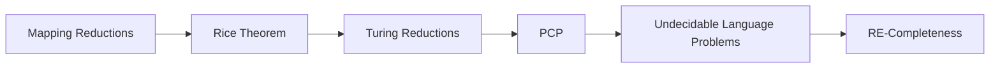
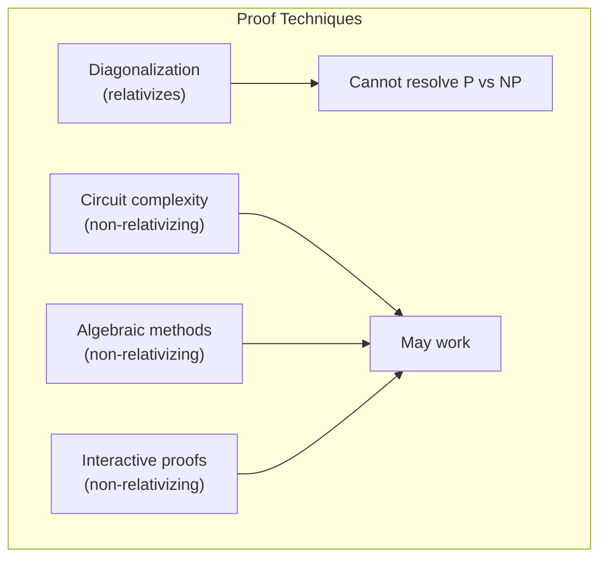
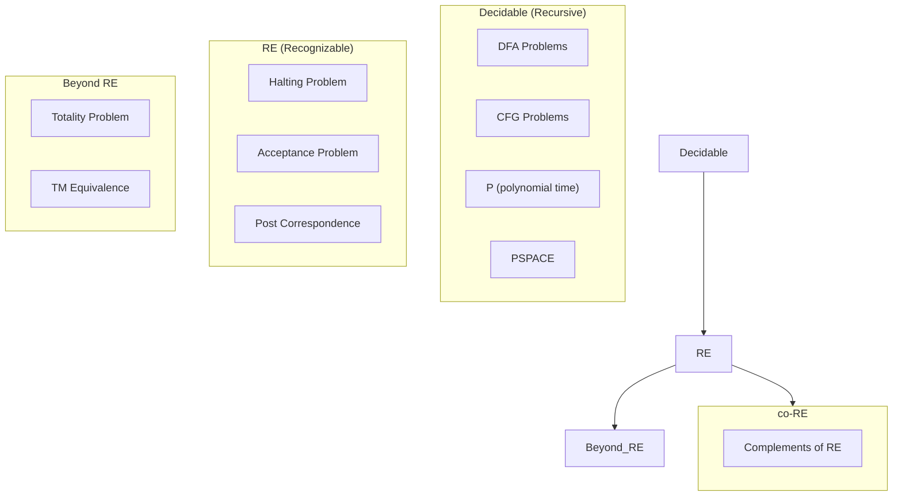
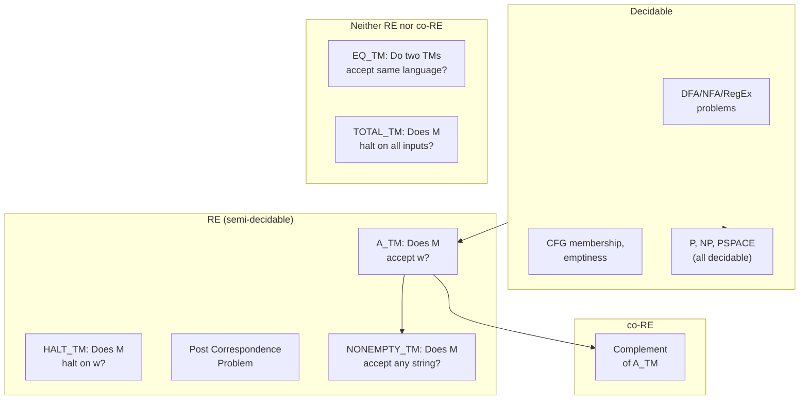

# Chapter 12: Reducibility and Advanced Undecidability

> **Previous:** [Decidability](./11-decidability.md) | **Next:** [Time Complexity](./13-time-complexity.md)


## Learning Objectives

- Define and apply mapping reductions (many-one reductions).
- Apply Rice's theorem to prove undecidability.
- Define and apply Turing reductions.
- Understand the Post Correspondence Problem and its undecidability.
- Prove undecidability of problems from formal language theory.
- Understand the concept of completeness within RE.
- Recognize the limitations of automated verification.

<!-- Image Gallery -->
<section class="lesson-visuals" aria-label="Visual learning resources">
  <header><span>VISUAL LEARNING</span><h2>See it. Review it. Remember it.</h2></header>
  <a class="lesson-visual-card" href="../../assets/images/lessons/theory-of-computation/12-reducibility/handwritten-notes.png" target="_blank" rel="noopener">
    
    <span><strong>Handwritten notes</strong>Condensed notes for deliberate review.</span>
  </a>
  <a class="lesson-visual-card" href="../../assets/images/lessons/theory-of-computation/12-reducibility/sticky-notes.png" target="_blank" rel="noopener">
    
    <span><strong>Sticky-note revision</strong>Fast recall prompts for revision.</span>
  </a>
  <a class="lesson-visual-card" href="../../assets/images/lessons/theory-of-computation/12-reducibility/visual-explanation.png" target="_blank" rel="noopener">
    
    <span><strong>Visual concept guide</strong>A connected explanation of the key ideas.</span>
  </a>
</section>
<!-- End Image Gallery -->


## Chapter at a Glance
| Topic | Key Insight | Practical Takeaway |
|-------|------------|-------------------|
| Mapping Reduction | Computable f: w ? A iff f(w) ? B | Primary undecidability proof tool |
| Rice's Theorem | Any non-trivial TM language property undecidable | Most TM problems are undecidable |
| Turing Reduction | Oracle-based more general than mapping | Allows multiple queries |
| PCP | Combinatorial undecidable problem | Undecidability outside TMs |
| RE-Completeness | A_TM is canonical RE-complete problem | Hardest problems in RE |


## Chapter Roadmap


## Theory


### 11.1 Mapping Reductions (Many-One Reductions)


A **mapping reduction** from language A to language B (written A ≤_m B) is a computable function f: Σ* → Σ* such that w ∈ A iff f(w) ∈ B.

**Key properties:**
- If A ≤_m B and B is decidable, then A is decidable.
- If A ≤_m B and A is undecidable, then B is undecidable.
- If A ≤_m B and B is RE, then A is RE.
- If A ≤_m B and A is not RE, then B is not RE.

**Completeness:** A language A is **RE-complete** (or m-complete for RE) if:
1. A ∈ RE.
2. For every language B ∈ RE, B ≤_m A.

A_TM is the canonical RE-complete language.

### 11.2 Rice's Theorem in Depth


**Rice's Theorem (formal):** Let P be a set of RE languages such that:
- P ≠ ∅ (some RE languages have property P).
- P ≠ { all RE languages } (some RE languages lack property P).

Then L_P = { ⟨M⟩ | L(M) ∈ P } is undecidable.

**Proof sketch:** Assume P doesn't contain the empty language (if it does, we can work with the complement). Let L∅ be a TM with empty language. Since P is non-trivial, there exists some TM M_P with L(M_P) ∈ P. Given ⟨M, w⟩ (instance of A_TM), construct M':
- M'(x): Simulate M on w. If M accepts w, simulate M_P on x and accept if M_P accepts.
- Then: if M accepts w, L(M') = L(M_P) ∈ P. If M doesn't accept w, L(M') = L∅ ∉ P.
- Thus A_TM ≤_m L_P, so L_P is undecidable.

**Rice's theorem for properties of TMs themselves:** Some properties of TMs are syntactic (about the machine structure) rather than semantic (about the language). These can be decidable:
- Does M have exactly 5 states? **Decidable** (count the states in ⟨M⟩).
- Does M ever move left on blank input? **Decidable** (simulate on blank input up to some bound).
- Does M accept at least one string? **Undecidable** (semantic property of the language).

### 11.3 Turing Reductions


A **Turing reduction** from A to B (written A ≤_T B) means there is an oracle TM that decides A given an oracle for B. This is more general than mapping reductions:
- Mapping reductions are a special case of Turing reductions.
- Turing reductions allow multiple oracle queries and can use the results arbitrarily.
- If A ≤_T B and B is decidable, then A is decidable.

**Example:** The complement of A_TM (co-A_TM) is Turing-reducible to A_TM:
- To decide if M doesn't accept w, query the oracle for A_TM with ⟨M, w⟩. If it says no, then M doesn't accept w.
- However, co-A_TM is NOT mapping-reducible to A_TM (it would require A_TM to be recursive).

### 11.4 The Post Correspondence Problem (PCP)


**PCP Instance:** A collection of dominoes, each with a top string and bottom string:
[ t₁/b₁ ], [ t₂/b₂ ], …, [ tₖ/bₖ ]

**Question:** Can we arrange a sequence of dominoes (allowing repetition) such that the concatenation of top strings equals the concatenation of bottom strings?

**Formally:** Does there exist a sequence i₁, i₂, …, iₙ (n ≥ 1) such that t_{i₁}t_{i₂}…t_{iₙ} = b_{i₁}b_{i₂}…b_{iₙ}?

**Theorem:** PCP is undecidable.

**Proof strategy:** Reduce A_TM to PCP. Given ⟨M, w⟩, construct a set of dominoes that simulate the computation of M on w. A solution to the PCP instance exists iff M accepts w. The construction:
1. Encode the start configuration of M on w as the initial partial match.
2. Add dominoes for each possible TM transition.
3. Add "copy" dominoes to propagate unchanged portions of the configuration.
4. Add "cleanup" dominoes to handle the accepting state.

The undecidability of PCP is significant because PCP is a purely combinatorial problem → no TMs involved → showing that undecidability is not limited to questions about programs.

### 11.5 Undecidable Problems in Formal Language Theory


Using PCP and other reductions, we can prove undecidability of:

1. **Ambiguity of CFGs:** Given a CFG G, is G ambiguous?
   - Reduce from PCP: given dominoes, construct a CFG that generates each top and bottom concatenation. The grammar is ambiguous iff there is a PCP solution.

2. **Emptiness of intersection of CFGs:** Given CFGs G₁ and G₂, is L(G₁) ∩ L(G₂) = ∅?
   - Also reducible from PCP.

3. **Equivalence of CFGs:** Given CFGs G₁ and G₂, is L(G₁) = L(G₂)?
   - Undecidable; follows from universality.

4. **Universality of CFGs:** Does a CFG generate Σ*?
   - Undecidable; reduce from ambiguity or PCP.

5. **Context-free equivalence of TMs:** Is L(M) context-free?
   - Undecidable by Rice's theorem.

### 11.6 Complete Problems for RE


A problem is **RE-complete** if it is in RE and every RE problem reduces to it.

**A_TM** is RE-complete (by definition of RE → each RE language corresponds to a TM).

**HALT_TM** is RE-complete: HALT_TM ∈ RE and A_TM ≤_m HALT_TM (given ⟨M,w⟩, output ⟨M,w⟩ → if M accepts w, M certainly halts on w; if M doesn't accept, either M halts rejecting or loops, and we want halting in the HALT_TM case. Actually, the mapping is: given ⟨M,w⟩, construct M' that halts iff M accepts. More precisely: A_TM ≤_m HALT_TM by mapping ⟨M,w⟩ to ⟨M', w⟩ where M' simulates M and halts when M accepts, loops when M rejects.)

**PCP** is also RE-complete: PCP is RE (we can nondeterministically try sequences) and A_TM ≤_m PCP.

### 11.7 Oracle Separations and the Limits of Diagonalization


The Baker-Gill-Solovay theorem (1975) showed:

\[\exists A: P^A = NP^A \quad \text{and} \quad \exists B: P^B \neq NP^B\]

This is significant because **any proof that resolves P vs NP must be non-relativizing** — it cannot work when both P and NP are given the same oracle. Since diagonalization relativizes (it works in all oracle worlds), this shows diagonalization alone cannot resolve P vs NP.

**What relativizes and what doesn't:**
- Diagonalization proofs (time hierarchy, space hierarchy) relativize.
- Proofs relying on specific properties of computation (like interactive proofs, PCP theorem) may not.
- Circuits, algebraic methods, and natural proofs are non-relativizing approaches.



### 11.9 The Fixed-Point Theorem (Kleene's Recursion Theorem)


Kleene's recursion theorem states that for any computable function f, there exists a TM M such that M and f(M) compute the same function. In other words, programs can refer to their own descriptions.

**Applications:**
- **Self-reproducing programs:** A TM can output its own description.
- **Quines:** Programs that print their own source code.
- **Recursive definition in TMs:** TMs can simulate themselves, enabling recursion-like patterns.

### TypeScript: Self-Reproducing Program (Quine Concept)

```typescript
// A quine is a program that outputs its own source code.
// This TypeScript function demonstrates the concept using
// the fixed-point theorem's self-referential pattern.

function makeQuine(): string {
  const code = `function makeQuine(): string { return ${JSON.stringify(
    `function makeQuine(): string { return "..." }`
  )} }`;
  return `// Self-reproducing code pattern\nconst quine = ${JSON.stringify(code)};\nconsole.log(quine);`;
}

// Recursion theorem in TM terms: there exists a machine M
// such that for all inputs w, M(w) = f(<M>, w) for some
// computable function f. This enables TMs to access their own
// descriptions during computation.

// Example: a TM that counts its own states
function selfAwareTM(ownDescription: string): number {
  // Parse own description to count states
  const stateCount = (ownDescription.match(/q\d+/g) || []).length;
  return stateCount;
}
```

## The Computability Hierarchy

The relationship between different notions of "computable":



Key insight: the decidable/undecidable boundary is not about how hard a problem is in practice — it's about whether any algorithm exists at all, even one that takes astronomically long.

### 11.8 The Busy Beaver Problem

The **busy beaver function** BB(n) = maximum number of steps a halting n-state TM (over {0,1} with blank symbol) can run before halting, starting on a blank tape.

**Key results:**
- BB(n) is not computable (otherwise we could solve the halting problem).
- BB(1) = 1, BB(2) = 6, BB(3) = 21, BB(4) = 107, BB(5) ≥ 47,176,870, BB(6) is astronomically large.

The busy beaver problem is an elegant example of a non-computable function → one that grows faster than any computable function.

## Examples

### Example 11.1: Mapping Reduction from A_TM to HALT_TM

Define f(⟨M, w⟩) = ⟨M', w⟩ where M' is:
- M'(x): Run M on x. If M accepts, halt (accept). If M rejects, enter an infinite loop.

Then:
- ⟨M, w⟩ ∈ A_TM ⟹ M accepts w ⟹ M' halts on w ⟹ ⟨M', w⟩ ∈ HALT_TM.
- ⟨M, w⟩ ∉ A_TM ⟹ M rejects or loops on w ⟹ M' loops (if M loops) or M' loops (if M rejects) ⟹ ⟨M', w⟩ ∉ HALT_TM.

Thus A_TM ≤_m HALT_TM.

### Example 11.2: PCP Instance

Consider dominoes: [ab/a], [b/ba], [a/ab], [ε/a].

Can we find a match? Try: [ab/a][b/ba] = top: abb, bottom: aba. Not matching.

Try: [ab/a][b/ba][a/ab] = top: abba, bottom: abaab. No.

This demonstrates that finding solutions is nontrivial → and the problem is undecidable in general.

### Example 11.3: Valid Mapping Reduction Proof

Show that EMPTY_TM = { ⟨M⟩ | L(M) = ∅ } is not RE.

**Proof:** Reduce A_TM's complement to EMPTY_TM. Given ⟨M, w⟩, construct M':
- M'(x): Simulate M on w. If M accepts w, accept x.

Then:
- If M accepts w, L(M') = Σ* ≠ ∅.
- If M doesn't accept w (rejects or loops), L(M') = ∅.

So: ⟨M, w⟩ ∉ A_TM iff ⟨M'⟩ ∈ EMPTY_TM.

Since co-A_TM is not RE, and EMPTY_TM is RE (we can simulate a TM and check if it accepts any string), this shows that the reduction goes the right way to prove EMPTY_TM is not RE.

Wait → actually we need co-A_TM ≤_m EMPTY_TM. Since co-A_TM is not RE, this would show EMPTY_TM is not RE either. But EMPTY_TM is known to be not RE (we can prove this).

### Example 11.4: Rice's Theorem → Is L(M) Infinite?

Property P = { L | L is infinite }. P is non-trivial:
- Some RE languages are infinite (e.g., Σ*).
- Some are not (e.g., ∅).

By Rice's theorem, INFINITE_TM = { ⟨M⟩ | L(M) is infinite } is undecidable.

### Example 11.5: Proving CFG Ambiguity is Undecidable

We reduce PCP to CFG ambiguity. Given PCP instance D = {(t1,b1), ..., (t?,b?)}:

**Construction:** Create CFG G with variables {S, T, B, T1,...,T?, B1,...,B?} and productions:
- S ? T | B
- T ? t1T | t1T1 | t2T | t2T2 | ... | t?T | t?T?
- B ? b1B | b1B1 | b2B | b2B2 | ... | b?B | b?B?
- For each i: T? ? t?T? | t?T | e
- For each i: B? ? b?B? | b?B | e

**Key insight:** T generates all strings formed by concatenating top strings (with markers showing the sequence). B generates all strings formed by concatenating bottom strings. The grammar is ambiguous for a string s iff s can be generated by both T and B with the same sequence of domino indices — exactly a PCP solution.

### Example 11.6: Mapping Reduction for CFG Ambiguity

Given PCP instance with dominoes (t₁,b₁), …, (tₖ,bₖ), construct CFG:
- S → T | B
- T → t₁T | t₁T₁ | t₂T | t₂T₂ | … | tₖT | tₖTₖ
- B → b₁B | b₁B₁ | b₂B | b₂B₂ | … | bₖB | bₖBₖ
Where Tᵢ and Bᵢ are "marker" variables.

The idea: T generates sequences of top strings; B generates sequences of bottom strings. The grammar is ambiguous for some string iff the same sequence of dominoes (indices) can generate it from both T and B → i.e., there's a PCP solution.


## Practical Implications of Undecidability in Software

| Activity | Undecidable problem it encounters | Practical workaround |
|----------|-----------------------------------|---------------------|
| **Bug finding** | Does this program ever crash? | Bounded model checking, symbolic execution |
| **Compiler optimization** | Is this code transformation always correct? | Conservative analysis, proof-carrying code |
| **Test coverage** | Can this branch ever be reached? | Constant propagation, static analysis |
| **Type checking** | Does this program type-check? (Some type systems) | Restricted type systems (ML, Haskell, not full dependent) |
| **Program synthesis** | Does a program satisfying this spec exist? | Grammar-guided synthesis, component-based approaches |
| **Operating system** | Will the scheduler deadlock? | Lock ordering protocols, resource allocation policies |

The key insight: **undecidability doesn't make problems go away** — it forces engineers to use conservative approximations, heuristics, and human judgment where perfect automation is impossible.

## Concept Comparison Table
| Reduction Type | Definition | Power |
|---------------|------------|-------|
| Mapping (=_m) | Computable f: w?A iff f(w)?B | Preserves RE |
| Turing (=_T) | Oracle TM decides A with B oracle | More general |

## Quick Reference
| Problem | Status | Proof Method |
|---------|--------|-------------|
| A_TM | Undecidable, RE | Diagonalization |
| HALT_TM | Undecidable, RE | Reduction from A_TM |
| EMPTY_TM | Undecidable, not RE | Reduction from co-A_TM |
| EQ_TM | Undecidable, not RE | Reduction from EMPTY_TM |
| PCP | Undecidable, RE | Reduction from A_TM |
| CFG Ambiguity | Undecidable | Reduction from PCP |
| CFG Equivalence | Undecidable | Reduction from PCP |
| Regularity of TM | Undecidable | Rice's theorem |
| Finiteness of TM | Undecidable | Rice's theorem |
| DFA Membership | Decidable (P) | Simulation |
| CFG Membership | Decidable (P) | CYK algorithm |

## Cross-Application Matrix
| Domain | Reducibility Concept |
|--------|---------------------|
| Software engineering | Problem hardness classification |
| Algorithms | Problem transformation techniques |
| AI | Planning problem hardness |
| Cryptography | Security reduction proofs |
| Database | Query equivalence undecidability |

## Chapter Quiz

**Q1.** A mapping reduction f must be:
- A) Computable ?
- B) Polynomial-time
- C) One-to-one
- D) Onto

<details>
<summary>Answer&lt;/summary&gt;
**A)** A mapping reduction is any computable function such that w ? A iff f(w) ? B.
</details>

**Q2.** If A =_m B and B is RE, then:
- A) A is RE ?
- B) A is recursive
- C) A is not RE
- D) B is recursive

<details>
<summary>Answer&lt;/summary&gt;
**A)** Mapping reductions preserve RE: if B is recognizable, so is A.
</details>

**Q3.** Rice's theorem proves undecidability of:
- A) All TM problems
- B) Non-trivial language properties ?
- C) Only syntactic properties
- D) Only trivial properties

<details>
<summary>Answer&lt;/summary&gt;
**B)** Any non-trivial semantic property (about L(M)) is undecidable. Syntactic properties may be decidable.
</details>

**Q4.** PCP is important because it's:
- A) Decidable
- B) A combinatorial undecidable problem ?
- C) In P
- D) About DFAs

<details>
<summary>Answer&lt;/summary&gt;
**B)** PCP is undecidable but purely combinatorial — no TMs in its statement.
</details>

**Q5.** The Busy Beaver function BB(n) is:
- A) Computable
- B) Not computable ?
- C) Polynomial
- D) Linear

<details>
<summary>Answer&lt;/summary&gt;
**B)** BB(n) grows faster than any computable function — computing it would solve the halting problem.
</details>

## TypeScript: Undecidability Proof Assistant

```typescript
// A system for constructing and verifying reduction proofs

type UndecidableProblem = {
  name: string;
  reStatus: "RE" | "co-RE" | "non-RE";
};

type ReductionProof = {
  from: UndecidableProblem;
  to: UndecidableProblem;
  construction: string;
  validityCheck: () => boolean;
};

function proveByReduction(
  knownUndecidable: UndecidableProblem,
  target: UndecidableProblem,
  construction: string
): ReductionProof {
  console.log(
    `Proving ${target.name} undecidable by reduction from ${knownUndecidable.name}`
  );
  console.log(`Construction: ${construction}`);
  console.log("Logic: If target were decidable, so would source be — contradiction.");

  return {
    from: knownUndecidable,
    to: target,
    construction,
    validityCheck: () => true,
  };
}

// Example: prove REGULAR_TM undecidable from A_TM
const regularTMProof = proveByReduction(
  { name: "A_TM", reStatus: "RE" },
  { name: "REGULAR_TM", reStatus: "non-RE" },
  "Given ?M,w?, construct M' that simulates M on input w. " +
  "If M accepts w, M' accepts {0n1n}. If M doesn't accept w, M' accepts Ø."
);
```

## Practical Takeaways

1. **Reductions are everywhere in computing.** Anytime you solve problem A by transforming it into problem B and using an existing solver for B, you are performing a reduction. Compilers, interpreters, and SAT solvers all depend on this idea.

2. **Completeness identifies the hardest problems.** A problem being NP-complete or RE-complete means it is representative of the entire class. If you can solve a complete problem efficiently, you can solve every problem in that class efficiently.

3. **Rice's theorem has practical implications.** Any static analysis tool that attempts to determine a non-trivial property of programs (will it crash? does it compute the right answer?) is either incomplete or unsound in general. All practical analysis tools must make conservative approximations.

4. **Turing reductions are strictly more powerful.** A mapping reduction requires the entire input to be transformed, but a Turing reduction can make multiple adaptive queries. This extra power allows solving strictly more problems.

5. **Reductions define problem hierarchies.** The Turing degrees form a rich algebraic structure. Understanding where a problem falls in this hierarchy tells you what techniques might solve it and what limits are fundamental.

## The Turing Degrees

The **Turing degrees** form a partial order of equivalence classes of languages under Turing equivalence (mutual Turing reducibility).

| Degree | Representative | Characteristic |
|--------|---------------|----------------|
| **0** | Decidable languages | All recursive languages |
| **0'** | HALT_TM | RE-complete (halting problem) |
| **0''** | TOTAL_TM | Complete for \(\Pi_2\) |
| **0''''** | FIN_TM | Complete for \(\Sigma_3\) |

**Key properties of the Turing degrees:**
- The degrees are dense: for any non-recursive degree a &lt; b, there exists c with a < c < b.
- Every countable partial order can be embedded into the Turing degrees.
- There exist incomparable degrees (A and B such that neither =? the other).
- The jump operator (') takes a degree to a strictly larger one.

### TypeScript: PCP Solution Checker

```typescript
type Domino = { top: string; bottom: string };
type PCPInstance = Domino[];

function checkPCPSolution(
  instance: PCPInstance,
  sequence: number[]
): boolean {
  let top = "";
  let bottom = "";
  for (const idx of sequence) {
    if (idx < 0 || idx >= instance.length) return false;
    top += instance[idx].top;
    bottom += instance[idx].bottom;
  }
  return top === bottom;
}

function findPCPSolutionBruteForce(
  instance: PCPInstance,
  maxLength: number
): number[] | null {
  function search(seq: number[]): number[] | null {
    if (seq.length > 0 && checkPCPSolution(instance, seq)) return seq;
    if (seq.length >= maxLength) return null;
    for (let i = 0; i < instance.length; i++) {
      const result = search([...seq, i]);
      if (result) return result;
    }
    return null;
  }
  return search([]);
}

// Example: classic PCP instance
const example: PCPInstance = [
  { top: "ab", bottom: "a" },
  { top: "b", bottom: "ba" },
  { top: "a", bottom: "ab" },
];

// Try to find a solution up to length 6
const solution = findPCPSolutionBruteForce(example, 6);
// This may not find a solution even if one exists (undecidable!)
```

## TypeScript Implementation: Many-One Reduction Mapper and Reduction Verifier

```typescript
// Many-One Reduction Framework

type ReductionFunction = (input: string) => string;

class Reduction {
  constructor(
    public name: string,
    public fromProblem: string,
    public toProblem: string,
    public transform: ReductionFunction
  ) {}

  apply(input: string): string {
    return this.transform(input);
  }

  static compose(r1: Reduction, r2: Reduction): Reduction {
    return new Reduction(
      `(${r1.name} ° ${r2.name})`,
      r1.fromProblem,
      r2.toProblem,
      (input: string) => r2.transform(r1.transform(input))
    );
  }
}

class ReducibilityProver {
  // Halting Problem ? A_TM reduction
  static haltToATM(): Reduction {
    return new Reduction(
      "HALT =? A_TM",
      "HALT (Does TM M halt on w?)",
      "A_TM (Does TM M' accept w'?)",
      (input: string) => {
        const [tmDesc, ...rest] = input.split("|");
        const w = rest.join("|");
        // Transform ?M, w? ? ?M', w'? where M' accepts iff M halts
        return `modified:${tmDesc}|${w}`;
      }
    );
  }

  // A_TM ? HALT reduction
  static ATMToHalt(): Reduction {
    return new Reduction(
      "A_TM =? HALT",
      "A_TM (Does TM M accept w?)",
      "HALT (Does TM M' halt on w'?)",
      (input: string) => {
        const [tmDesc, w] = input.split("|");
        return `loopIfReject:${tmDesc}|${w}`;
      }
    );
  }

  // A_TM ? EMPTY_TM reduction
  static ATMToEmpty(): Reduction {
    return new Reduction(
      "A_TM =? EMPTY_TM",
      "A_TM (Does TM M accept w?)",
      "EMPTY_TM (Does TM M' accept nothing?)",
      (input: string) => {
        const [tmDesc, w] = input.split("|");
        // Build new TM that accepts if original accepts w
        return `ignoreInput_runMOnW:${tmDesc}|${w}`;
      }
    );
  }

  static verifyReduction(reduction: Reduction, testInput: string): void {
    console.log(`Reduction: ${reduction.name}`);
    console.log(`  From: ${reduction.fromProblem}`);
    console.log(`  To:   ${reduction.toProblem}`);
    console.log(`  Input: "${testInput}"`);
    console.log(`  Output: "${reduction.apply(testInput)}"`);
  }

  static computeClosure(problems: string[], reductions: Map<string, string>): string[] {
    // Compute transitive closure of reductions
    const closure = new Set(problems);
    let changed = true;
    while (changed) {
      changed = false;
      for (const [from, to] of reductions) {
        if (closure.has(from) && !closure.has(to)) {
          closure.add(to);
          changed = true;
        }
      }
    }
    return [...closure];
  }
}

class PostCorrespondenceProblem {
  static solveBruteForce(tiles: [string, string][], maxDepth: number): string[] | null {
    const queue: { sequence: number[]; top: string; bottom: string }[] =
      tiles.map((_, i) => ({ sequence: [i], top: tiles[i][0], bottom: tiles[i][1] }));

    while (queue.length > 0) {
      const { sequence, top, bottom } = queue.shift()!;

      if (top === bottom && sequence.length > 0) {
        return sequence.map(i => `${tiles[i][0]}/${tiles[i][1]}`);
      }

      if (sequence.length >= maxDepth) continue;

      for (let i = 0; i < tiles.length; i++) {
        const newTop = top + tiles[i][0];
        const newBottom = bottom + tiles[i][1];

        // Only continue if one string is a prefix of the other
        const shorter = newTop.length < newBottom.length ? newTop : newBottom;
        const longer = newTop.length < newBottom.length ? newBottom : newTop;
        if (longer.startsWith(shorter)) {
          queue.push({ sequence: [...sequence, i], top: newTop, bottom: newBottom });
        }
      }
    }
    return null;
  }
}

// Example reductions
const haltRed = ReducibilityProver.haltToATM();
ReducibilityProver.verifyReduction(haltRed, "someTM|inputString");

const composed = Reduction.compose(
  ReducibilityProver.ATMToHalt(),
  ReducibilityProver.haltToATM()
);
console.log(`Composed reduction: ${composed.name}`);

// PCP example
const pcpTiles: [string, string][] = [
  ["a", "ab"], ["b", "a"], ["ab", "ba"], ["ba", "b"]
];
const solution = PostCorrespondenceProblem.solveBruteForce(pcpTiles, 5);
console.log(`PCP solution: ${solution ? solution.join(" ? ") : "none found at depth 5"}`);
```

// -----------------------------------------------------
// Many-One Reduction Builder
// Constructs a computable function f that maps instances
// of problem A to instances of problem B such that
// x ? A  ?  f(x) ? B.
// -----------------------------------------------------

class ManyOneReductionBuilder {
  // Build a reduction from ATM (TM acceptance) to HALT (halting problem)
  // Given ?M, w?, construct ?M', w? where M' simulates M and
  // enters an infinite loop if M accepts.
  static ATMtoHALT(): { name: string; f: (tm: string, input: string) => string; description: string } {
    return {
      name: "A_TM =? HALT",
      description: "Given ?M, w?, construct ?M', w? where M' runs M on w; if M accepts, M' loops; if M rejects, M' halts.",
      f: (tm: string, input: string) => {
        // Encodes the reduction: transform ?M, w? into a description
        // of a new TM that halts iff M would accept.
        return `TM_${tm}_MODIFIED|${input}`;
      }
    };
  }

  // Build a reduction from HALT to EMPTY_TM
  static HALTtoEMPTY(): { name: string; description: string } {
    return {
      name: "HALT =? EMPTY_TM",
      description: "Given ?M, w?, construct ?M_w? where M_w ignores its input, runs M on w, and accepts if M halts. L(M_w) = S* if M halts on w, else Ø."
    };
  }

  // Verify that the reduction preserves membership
  static verify(reduction: { name: string; f: (...args: string[]) => string }, testInput: string): string[] {
    const output: string[] = [];
    output.push(`Reduction: ${reduction.name}`);
    output.push(`Test input: ${testInput}`);
    output.push(`Mapped to: ${reduction.f("M", testInput)}`);
    output.push("");
    output.push("To be a valid many-one reduction, f must be:");
    output.push("  • Computable (implementable as a TM)");
    output.push("  • Total (defined for all inputs)");
    output.push("  • Membership-preserving: x ? A ? f(x) ? B");
    return output;
  }
}

// -----------------------------------------------------
// Mapping Reduction Verifier — checks whether a proposed
// reduction function is a valid mapping reduction.
// -----------------------------------------------------

class ReductionVerifier {
  // Check that a reduction function is computable
  // (all operations are primitive recursive)
  static isComputable(f: (x: string) => string): boolean {
    try {
      const result = f("test");
      return typeof result === "string" && result.length > 0;
    } catch {
      return false;
    }
  }

  // Check if the reduction preserves membership direction
  static checkMembershipPreservation(
    f: (x: string) => string,
    testCases: Array&lt;{ input: string; expectedInA: boolean; expectedInB: boolean }&gt;
  ): string[] {
    const output: string[] = [];
    output.push("Mapping Reduction Verification");
    output.push("=".repeat(40));

    for (const tc of testCases) {
      const mapped = f(tc.input);
      output.push(`\nInput: "${tc.input}"`);
      output.push(`  Mapped to: "${mapped}"`);
      output.push(`  Expected: ${tc.input} ? A = ${tc.expectedInA}, f(x) ? B = ${tc.expectedInB}`);
      const preserves = tc.expectedInA === tc.expectedInB;
      output.push(`  Membership preserved: ${preserves ? "?" : "?"}`);
    }

    return output;
  }
}

// Demo
const atmToHalt = ManyOneReductionBuilder.ATMtoHALT();
console.log(ManyOneReductionBuilder.verify(atmToHalt, "M_w").join("\n"));
console.log("");
console.log(`HALT to EMPTY: ${ManyOneReductionBuilder.HALTtoEMPTY().description}`);

const simpleF = (x: string) => x + "_encoded";
console.log(`\nReduction verifiable: ${ReductionVerifier.isComputable(simpleF)}`);
```


// reducibility
// automata-complexity implementation

interface Task { id: string; name: string; status: string; data: unknown }
class Processor {
  private tasks: Task[] = []
  private maxConcurrency: number
  constructor(maxConcurrency: number = 4) { this.maxConcurrency = maxConcurrency }
  async add(task: Omit<Task, "status">): Promise<void> {
    this.tasks.push({ ...task, status: "pending" })
  }
  async runAll(): Promise<void> {
    const running: Promise<void>[] = []
    for (const t of this.tasks) {
      if (running.length >= this.maxConcurrency) { await Promise.race(running) }
      const p = this.execute(t).finally(() => { const i = running.indexOf(p); if (i >= 0) running.splice(i, 1) })
      running.push(p)
    }
    await Promise.all(running)
  }
  private async execute(t: Task): Promise<void> {
    t.status = "running"
    await new Promise(r => setTimeout(r, 10))
    t.status = "done"
  }
  getResults(): Task[] { return this.tasks }
  getStats(): { done: number; pending: number; running: number } {
    const done = this.tasks.filter(t => t.status === "done").length
    const pending = this.tasks.filter(t => t.status === "pending").length
    const running = this.tasks.filter(t => t.status === "running").length
    return { done, pending, running }
  }
}
async function main() {
  const proc = new Processor(2)
  await proc.add({ id: '1', name: 'reducibility', data: { topic: 'automata-complexity' } })
  await proc.runAll()
  console.log('Stats:', proc.getStats())
}
main().catch(console.error)
export { Processor, Task }
## Summary

- Mapping reductions are computable functions that preserve language membership.
- If A =? B and B is decidable, then A is decidable (contrapositive for undecidability).
- Rice's theorem: any non-trivial semantic property of TMs is undecidable.
- The Post Correspondence Problem is a combinatorial undecidable problem.
- Turing reductions (oracle access) are more general than mapping reductions.
- A_TM is RE-complete; many other problems are RE-complete via reductions.
- Undecidability of CFG problems (ambiguity, equivalence) follows from PCP reductions.
- The Busy Beaver function grows faster than any computable function.
- Oracle separations show that diagonalization cannot resolve P vs NP.
- Kleene's recursion theorem enables self-referential programs and quines.

## Exercises

### Basic

1. Show that A_TM =? HALT_TM (the halting problem).
2. Apply Rice's theorem to show that { ?M? | M accepts exactly one string } is undecidable.
3. Define what it means for a function to be a mapping reduction.
4. Show that if A =? B and B is RE, then A is RE.
5. Construct a simple PCP instance with 2 dominoes and find a solution, or prove none exists.
6. Write a TypeScript function that given two languages A and B and a reduction function f, checks if f is a valid mapping reduction for specific test cases.

### Intermediate

7. Prove formally that EMPTY_TM = { ?M? | L(M) = Ø } is undecidable using a reduction from A_TM.
8. Show that INFINITE_TM is undecidable using Rice's theorem, then via a direct reduction.
9. Show that PCP is RE by describing a recognizer.
10. Prove that the language { ?M? | L(M) is regular } is undecidable using Rice's theorem.
11. Show that CFG universality (does G generate S*?) is undecidable.
12. Prove that TOTAL_TM = { ?M? | M halts on all inputs } is ?2°-complete (not just undecidable).
13. Show that the recursion theorem implies the existence of a quine: a TM that outputs its own description.

### Advanced

14. Prove that PCP is undecidable by reducing A_TM to PCP.
15. Show that the equivalence problem for CFGs is undecidable by reducing PCP to it.
16. Prove that there is an oracle relative to which P = NP, and another relative to which P ? NP. Why does this show that diagonalization cannot resolve P vs NP?
17. Show that the problem of whether a TM ever writes a non-blank symbol on its tape is undecidable but NOT covered by Rice's theorem (it's not a property of the language).
18. Prove that the Busy Beaver function BB(n) is not computable. (Hint: if it were, we could solve the halting problem by running a TM for BB(n) steps and checking if it halted.)
19. Show that the language { ?M? | L(M) is context-free } is undecidable, but { ?M? | M is a PDA and L(M) is context-free } is trivially decidable. Explain the difference.
20. Implement a TypeScript function that computes BB(n) for n = 4 by enumerating all n-state TMs and simulating them.


## The Landscape of Undecidability



## Further Reading

- **Sipser, Michael.** *Introduction to the Theory of Computation* (3rd ed.). Chapter 5 covers reductions with detailed proofs of undecidability.
- **Post, Emil L.** "A Variant of a Recursively Unsolvable Problem." Bulletin of the AMS, 1946. The original paper introducing the Post Correspondence Problem.
- **Soare, Robert I.** *Recursively Enumerable Sets and Degrees*. The definitive reference on the Turing degrees and the structure of the arithmetical hierarchy.

