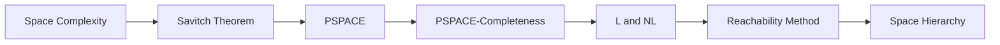
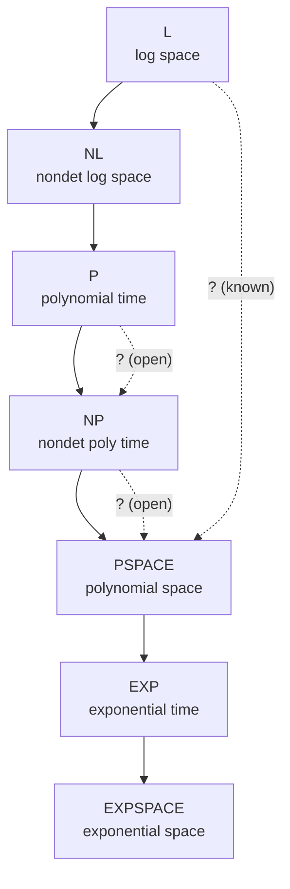

# Chapter 14: Space Complexity

> **Previous:** [Time Complexity](./13-time-complexity.md) | **Next:** [Advanced Complexity Topics](./15-advanced-complexity.md)


## Learning Objectives

- Define space complexity classes SPACE and NSPACE.
- Analyze the space complexity of algorithms.
- State and prove Savitch's theorem.
- Define PSPACE and PSPACE-completeness.
- Identify key PSPACE-complete problems.
- Understand the relationship between time and space complexity classes.
- Apply the reachability method for space-efficient computation.

<!-- Image Gallery -->
<section class="lesson-visuals" aria-label="Visual learning resources">
  <header><span>VISUAL LEARNING</span><h2>See it. Review it. Remember it.</h2></header>
  <a class="lesson-visual-card" href="../../assets/images/lessons/theory-of-computation/14-space-complexity/handwritten-notes.png" target="_blank" rel="noopener">
    
    <span><strong>Handwritten notes</strong>Condensed notes for deliberate review.</span>
  </a>
  <a class="lesson-visual-card" href="../../assets/images/lessons/theory-of-computation/14-space-complexity/sticky-notes.png" target="_blank" rel="noopener">
    
    <span><strong>Sticky-note revision</strong>Fast recall prompts for revision.</span>
  </a>
  <a class="lesson-visual-card" href="../../assets/images/lessons/theory-of-computation/14-space-complexity/visual-explanation.png" target="_blank" rel="noopener">
    
    <span><strong>Visual concept guide</strong>A connected explanation of the key ideas.</span>
  </a>
</section>
<!-- End Image Gallery -->


## Chapter at a Glance
| Topic | Key Insight | Practical Takeaway |
|-------|------------|-------------------|
| Space Complexity | Maximum tape cells used | Memory-bounded computation |
| Savitch's Theorem | NSPACE(s) ? SPACE(s²) | Nondeterminism less powerful for space |
| PSPACE | Polynomial space | Games like QBF, GEOGRAPHY |
| L and NL | Log-space classes | Reachability problems |
| Space Hierarchy | SPACE(n) ? SPACE(n²) strict | More space = more power |


## Chapter Roadmap


## Theory


### 13.1 Space Complexity


The **space complexity** of a Turing machine is the maximum number of tape cells used on any input of length n. For a multitape TM, the space used is the sum of cells used on all work tapes (the input tape is often excluded if it's read-only).

**Formal definition:** SPACE(s(n)) = { L | L is decided by a TM using O(s(n)) space }.
Similarly, NSPACE(s(n)) = { L | L is decided by an NTM using O(s(n)) space }.

### 13.2 Fundamental Space Classes


| Class | Description |
|-------|-------------|
| **L** = SPACE(log n) | Deterministic log space |
| **NL** = NSPACE(log n) | Nondeterministic log space |
| **PSPACE** = ∪_{k} SPACE(nᵏ) | Polynomial space |
| **NPSPACE** = ∪_{k} NSPACE(nᵏ) | Nondeterministic polynomial space |
| **EXPSPACE** = ∪_{k} SPACE(2^{nᵏ}) | Exponential space |

**Key relationships:**
- L ⊆ NL ⊆ P ⊆ NP ⊆ PSPACE ⊆ EXPTIME ⊆ EXPSPACE
- L ≠ PSPACE (space hierarchy theorem).
- P ≠ EXPTIME (time hierarchy theorem).

### 13.3 Time vs Space: Key Differences


Time and space complexity behave differently in fundamental ways:

| Aspect | Time | Space |
|--------|------|-------|
| **Reusable resource?** | No (steps consumed) | Yes (cells can be reused) |
| **Nondeterminism** | Adds power (P vs NP open) | Closed (NPSPACE = PSPACE) |
| **Complement** | co-NP vs NP open | NL = co-NL proven |
| **Hierarchy** | P ? EXP (known) | L ? PSPACE (known, stricter) |
| **Key technique** | Diagonalization | Configuration graphs |

The reusability of space explains why nondeterminism is less powerful: a nondeterministic space-bounded machine can try all possibilities by reusing space, but a nondeterministic time-bounded machine must "pay" for each step.

### 13.4 Savitch's Theorem


**Savitch's Theorem:** For any function s(n) ≥ log n,
NSPACE(s(n)) ⊆ SPACE(s(n)²)

**Corollary:** NPSPACE = PSPACE (nondeterminism doesn't add power for polynomial space).

**Proof sketch:** Given an NTM N that uses s(n) space, we construct a deterministic TM that uses O(s(n)²) space by solving the **reachability problem** in the configuration graph of N.

The configuration graph has nodes = configurations of N on input w. Each configuration uses O(s(n)) symbols. N accepts if there is a path from start to accept in this graph.

The deterministic TM uses a recursive **divide-and-conquer** approach: to check if configuration c₂ is reachable from c₁ in t steps, try all possible intermediate configurations cₘ and check:
- Can we reach cₘ from c₁ in t/2 steps?
- Can we reach c₂ from cₘ in t/2 steps?

The depth of recursion is log(2^{O(s(n))}) = O(s(n)), and each level stores a configuration of size O(s(n)). Total space: O(s(n)²).

### 13.5 PSPACE


**PSPACE** = languages decidable in polynomial space on a DTM.

Since NPSPACE = PSPACE, nondeterminism doesn't add power here (unlike for time).

**Problems in PSPACE:**
- **QBF (Quantified Boolean Formulas):** Is a fully quantified Boolean formula (∀x∃y∀z…) true?
- **GEOGRAPHY:** Can the first player force a win in the geography game?
- **Generalized CHECKERS, GO, and other games** on n×n boards.
- **REGULAR EXPRESSION EQUIVALENCE** (for some variants).
- **LBA (Linear Bounded Automaton) acceptance.**

### 13.6 PSPACE-Completeness


A language B is **PSPACE-complete** if:
1. B ∈ PSPACE.
2. For every A ∈ PSPACE, A ≤_P B (B is PSPACE-hard).

**QBF** was the first problem proven PSPACE-complete (the space analog of Cook-Levin).

**TQBF (True Quantified Boolean Formulas):** Given a fully quantified Boolean formula (all variables quantified), is it true?
- QBF ∈ PSPACE: Recursively evaluate the formula using polynomial space.
- QBF is PSPACE-hard: Similar to Cook-Levin, but we encode the recursive space-bounded computation.

**Other PSPACE-complete problems:**
- **GEOGRAPHY:** Given a directed graph and start vertex, can the current player force a win?
- **SUCCINCT REACHABILITY:** Given a succinctly described graph, is there a path from s to t?
- **MASTERMIND** (the game).
- **NUMBER-LABELED PARTITION.**

### 13.7 L and NL


**L** (deterministic log space): Problems solvable using only O(log n) work space (excluding the input).

**Examples in L:**
- Checking if parentheses are balanced.
- Determining if a linked list has a cycle.
- Computing the parity of the number of 1 bits.

**NL** (nondeterministic log space): Problems solvable on an NTM using O(log n) space.

**PATH** (is there a directed path from s to t?) is NL-complete.
- PATH ∈ NL: Nondeterministically guess the next vertex on the path; O(log n) bits to store current vertex.
- PATH is NL-hard: Every NL problem reduces to PATH (configuration graph reachability).

**Important theorem:** NL ⊆ P (since PATH ∈ P via BFS, and PATH is NL-complete).

**NL = co-NL** (Immerman-Szelepcsényi theorem): Nondeterministic log space is closed under complement.
- Proven independently by Immerman and Szelepcsényi (1987).
- The proof uses a clever counting technique to verify that no path exists to an accepting configuration.

### 13.8 The Reachability Method


Many space-bounded algorithms use the configuration graph approach:

1. Define configurations of the computation.
2. Show that the acceptance problem reduces to reachability in this graph.
3. Use space-efficient reachability algorithms.

**For Savitch's theorem:** Use divide-and-conquer reachability in O(log² n) space for NL problems, generalized to O(s²) for NSPACE(s).

**For NL ⊆ P:** The configuration graph of an NL machine is of polynomial size, and reachability in this graph is in P (via DFS/BFS).

### 13.9 The Space Hierarchy


**Space Hierarchy Theorem:** For any space-constructible function f(n) ≥ log n,
SPACE(f(n)) ⊂ SPACE(g(n)) whenever f(n) = o(g(n)).

**Consequences:**
- L ⊂ PSPACE (more space allows more problems to be solved).
- PSPACE ⊂ EXPSPACE.

This gives a strict hierarchy: L ⊂ PSPACE ⊂ EXPSPACE ⊂ … unlike time, where we only know P ⊆ NP ⊆ PSPACE with unknown strictness.

## Examples

### Example 13.1: PATH ∈ NL

**Algorithm:** Given directed graph G = (V, E), vertices s and t.
1. Set current = s.
2. For i = 1 to |V|:
   - Nondeterministically choose a vertex v ∈ V (O(log n) bits).
   - If (current, v) ∈ E, set current = v.
   - If current = t, accept.
3. Reject.

The algorithm stores only the current vertex (log n bits) and a counter (log n bits). Space = O(log n). Nondeterminism guesses the path.

### Example 13.2: Savitch's Theorem in Action

Given an NTM that uses s(n) = n space, show the equivalent DTM uses O(n²) space.

The NTM has at most 2^{O(n)} configurations. The DTM uses recursion:
- REACH(c₁, c₂, i): can we go from c₁ to c₂ in ≤ 2ⁱ steps?
  - If i = 0: check if c₁ = câ‚‚ or c₁ → câ‚‚ in one step.
  - Otherwise: for each configuration cₘ (O(n) space):
    - If REACH(c₁, cₘ, i-1) and REACH(cₘ, c₂, i-1), return true.
  - Return false.

Recursion depth: i = log(2^{O(n)}) = O(n). Each call stores a constant number of configurations of size O(n). Total: O(n²) space.

### Example 13.3: QBF is PSPACE-Complete

A QBF formula: ∃x₁ ∀x₂ ∃x₃ … φ(x₁, …, xₙ)

**PSPACE membership:** Evaluate the formula recursively:
- If φ has no quantifiers (all variables bound), evaluate directly.
- If φ = ∃x ψ(x, …): return True if ψ(0) or ψ(1) is true.
- If φ = ∀x ψ(x, …): return True if both ψ(0) and ψ(1) are true.

The recursion depth is O(n), and each level stores partial variable assignments. Total space: O(n²) → polynomial.

**PSPACE-hardness:** Given any PSPACE machine M and input w, construct a QBF formula that is true iff M accepts w. This is similar to Cook-Levin, but the quantifiers ∀ and ∃ handle the alternation between universal and existential configurations in the nondeterministic computation.

### Example 13.4: L Contains Balanced Parentheses

**Algorithm** for checking if a string w of '(' and ')' is balanced:
1. Initialize counter = 0 (log n bits).
2. For each symbol c in w:
   - If c = '(': counter++.
   - If c = ')': counter--.
   - If counter &lt; 0: reject (too many closing).
3. If counter = 0: accept. Else reject.

Space used: one counter (⌈log₂(n+1)⌉ bits) = O(log n). So this problem is in L.

### Example 13.5: NL-Completeness of PATH

To show EVERY NL problem A reduces to PATH:
- Let N be an NTM for A with space log n.
- On input w, construct the configuration graph G of N on w: vertices = configurations, edges = transitions.
- Let s = start configuration, t = accept configuration.
- N accepts w iff there is a path from s to t in G.
- G has O(n·2^{log n}) = O(n²) vertices, and can be constructed in log space (each edge can be generated on demand).

Thus A ≤_L PATH, and PATH is NL-complete.


## Concept Comparison Table
| Class | Space Bound | Example Problem |
|-------|------------|-----------------|
| L | O(log n) | Balanced parentheses |
| NL | O(log n) nondet | PATH |
| PSPACE | O(n^k) | QBF |
| EXPSPACE | O(2^{n^k}) | Succinct reachability |

## Quick Reference
| Theorem | Statement |
|---------|-----------|
| Savitch's | NSPACE(s) ? SPACE(s²) |
| Immerman-Szelepcsényi | NL = co-NL |
| Space hierarchy | SPACE(n) ? SPACE(n²) |
| NL ? P | Configuration graph poly-size |

## Cross-Application Matrix
| Domain | Space Complexity Concept |
|--------|------------------------|
| Game theory | PSPACE-complete games (GO, chess generalized) |
| Verification | LBA acceptance |
| Databases | Query evaluation space bounds |
| AI | Game tree search |
| Compilers | Memory-bounded parsing |

## Chapter Quiz

**Q1.** Savitch's theorem states:
- A) NSPACE(s) = SPACE(s)
- B) NSPACE(s) ? SPACE(s²) ?
- C) NSPACE(s) ? SPACE(s³)
- D) PSPACE = NP

<details>
<summary>Answer&lt;/summary&gt;
**B)** Savitch: NSPACE(s(n)) ? SPACE(s(n)²). Corollary: NPSPACE = PSPACE.
</details>

**Q2.** NL is the class of problems solvable in:
- A) O(n) space
- B) O(log n) space nondeterministically ?
- C) O(n²) space
- D) O(1) space

<details>
<summary>Answer&lt;/summary&gt;
**B)** NL = nondeterministic O(log n) space. PATH is NL-complete.
</details>

**Q3.** QBF is the canonical:
- A) NP-complete problem
- B) PSPACE-complete problem ?
- C) NL-complete problem
- D) P problem

<details>
<summary>Answer&lt;/summary&gt;
**B)** True Quantified Boolean Formulas is PSPACE-complete (space analog of Cook-Levin).
</details>

**Q4.** The Immerman-Szelepcsényi theorem says:
- A) P = NP
- B) NL = co-NL ?
- C) PSPACE = NPSPACE
- D) L = NL

<details>
<summary>Answer&lt;/summary&gt;
**B)** Nondeterministic log space is closed under complement.
</details>

**Q5.** Which containment is known to be strict?
- A) P ? NP
- B) L ? PSPACE ?
- C) NP ? PSPACE
- D) P ? PSPACE

<details>
<summary>Answer&lt;/summary&gt;
**B)** The space hierarchy theorem gives L ? PSPACE, while P vs NP remains open.
</details>

## Practical Takeaways

1. **Space is more structured than time.** While the P vs NP question remains open, the space hierarchy has been fully characterized: L ? PSPACE and PSPACE ? EXPSPACE are proven. Space complexity admits cleaner mathematical analysis.

2. **The configuration graph technique is powerful.** Space complexity proofs rely on the observation that a machine's behavior can be represented as a graph of configurations. Reachability in this graph determines acceptance, and graph reachability is in NL.

3. **Savitch's theorem has a surprising consequence.** Because NPSPACE = PSPACE, nondeterminism doesn't help with space the way it does with time. This means PSPACE-complete problems cannot be solved efficiently by simply guessing and verifying.

4. **PSPACE-complete problems are harder than NP-complete ones.** While NP-complete problems like SAT have practical solvers, PSPACE-complete problems like QBF (quantified Boolean formulas) are exponentially harder. Generalized games (chess, Go) are PSPACE-hard.

## TypeScript Implementation: Savitch's Theorem Explorer and PSPACE Verifier

```typescript
// Space Complexity Analyzer and Savitch's Theorem Simulation

class SpaceComplexity {
  static measure(fn: (arr: number[]) => number[], input: number[]): {
    spaceCells: number;
    complexityClass: string;
  } {
    // Measure approximate space usage
    const initialMemory = process.memoryUsage().heapUsed;
    fn(input);
    const finalMemory = process.memoryUsage().heapUsed;
    const deltaBytes = finalMemory - initialMemory;
    const n = input.length;

    // Classify based on growth relative to input
    if (deltaBytes < 1000) return { spaceCells: deltaBytes, complexityClass: "O(1) / O(log n)" };
    if (deltaBytes < 1000 * n) return { spaceCells: deltaBytes, complexityClass: "O(n)" };
    if (deltaBytes < 1000 * n * n) return { spaceCells: deltaBytes, complexityClass: "O(n²)" };
    return { spaceCells: deltaBytes, complexityClass: "O(2n) or worse" };
  }

  static configurationGraph(tmStates: number, tapeAlphabetSize: number, tapeCells: number): number {
    // Total configurations = states × alphabet^tapeCells × headPositions
    return tmStates * Math.pow(tapeAlphabetSize, tapeCells) * tapeCells;
  }
}

class SavitchTheorem {
  // Simulates Savitch's theorem: NSPACE(f(n)) ? SPACE(f(n)²)
  static reachability(
    graph: Map<number, number[]>,
    start: number,
    target: number,
    maxDepth: number,
    depth: number = 0
  ): boolean {
    if (start === target) return true;
    if (depth >= Math.ceil(Math.log2(maxDepth))) return false;

    const midDepth = Math.ceil(maxDepth / 2);
    const allNodes = [...graph.keys()];

    for (const mid of allNodes) {
      if (this.reachability(graph, start, mid, midDepth, depth + 1) &&
          this.reachability(graph, mid, target, maxDepth - midDepth, depth + 1)) {
        return true;
      }
    }
    return false;
  }

  static demonstrateTheorem(): string[] {
    return [
      "Savitch's Theorem (1970): NSPACE(f(n)) ? SPACE(f(n)²)",
      "",
      "Key insight: Nondeterministic space can be simulated",
      "deterministically with only a quadratic space overhead.",
      "",
      "For f(n) = log n, NSPACE(f(n)) ? SPACE(f(n)²)",
      "",
      "Proof uses the configuration graph of the NTM:",
      "1. NTM configuration = (state, tape, head position)",
      "2. The NTM accepts iff a path exists from start config to accept config",
      "3. Use divide-and-conquer: CANYIELD(c1, c2, t) =",
      "   ?c3: CANYIELD(c1, c3, t/2) ? CANYIELD(c3, c2, t/2)",
      "4. Recursion depth = O(log t), each level stores O(f(n)) space",
      "5. Total: O(f(n)²) deterministic space",
      "",
      "Corollaries:",
      "- NPSPACE = PSPACE (nondeterminism doesn't help for polynomial space)",
      "- NSPACE(n) ? SPACE(n²)",
      "- PSPACE = co-PSPACE (by Immerman-Szelepcsényi)"
    ];
  }

  static hierarchySummary(): Map<string, string> {
    const h = new Map<string, string>();
    h.set("L", "Deterministic O(log n) space");
    h.set("NL", "Nondeterministic O(log n) space");
    h.set("P", "Polynomial time (? NL by the PATH problem being in P)");
    h.set("NP", "Nondeterministic polynomial time");
    h.set("PSPACE", "Polynomial space (= NPSPACE by Savitch)");
    h.set("EXPSPACE", "Exponential space");
    h.set("L ? NL ? P ? NP ? PSPACE ? EXPSPACE", "Known containments (none known to be strict)");
    return h;
  }
}

class PSPACEProblems {
  static QBF(formula: string, variables: string[], values: Map<string, boolean>): boolean {
    // Simplified QBF solver for quantified Boolean formulas
    if (variables.length === 0) {
      return this.evaluate(formula, values);
    }
    const var_ = variables[0];
    const rest = variables.slice(1);

    values.set(var_, true);
    const trueResult = this.QBF(formula, rest, values);

    values.set(var_, false);
    const falseResult = this.QBF(formula, rest, values);

    values.delete(var_);
    return trueResult && falseResult; // Universal quantification
  }

  private static evaluate(formula: string, values: Map<string, boolean>): boolean {
    let result = formula;
    for (const [v, val] of values) {
      result = result.replace(new RegExp(v, "g"), val ? "1" : "0");
    }
    result = result.replace(/¬1/g, "0").replace(/¬0/g, "1");
    result = result.replace(/1?1/g, "1").replace(/0?./g, "0").replace(/1?/g, "");
    result = result.replace(/1?./g, "1").replace(/0?0/g, "0").replace(/0?/g, "");
    return result.includes("1") || result === "";
  }

  static isPSPACEComplete(problem: string): string {
    const pspaceComplete = ["QBF", "GEOGRAPHY", "GO", "CHECKERS", "L", "NLM"];
    return pspaceComplete.includes(problem.toUpperCase())
      ? `${problem} is PSPACE-complete`
      : `${problem} is not known to be PSPACE-complete`;
  }
}

console.log(SavitchTheorem.demonstrateTheorem().join("\n"));
const h = SavitchTheorem.hierarchySummary();
console.log([...h.entries()].map(([k, v]) => `${k}: ${v}`).join("\n"));
console.log(PSPACEProblems.isPSPACEComplete("QBF"));
console.log(PSPACEProblems.isPSPACEComplete("SAT"));
```

// -----------------------------------------------------
// L / NL / PSPACE Classifier
// Given a problem description, classifies it by its
// known space complexity class.
// -----------------------------------------------------

class SpaceComplexityClassifier {
  // Known problems and their space complexity classes
  private static readonly knownProblems = new Map&lt;string, string&gt;([
    ["DFA membership", "L (O(log n) space)"],
    ["Tree traversal", "L (O(log n) space)"],
    ["Graph connectivity (undirected)", "L (Reingold 2005)"],
    ["Graph connectivity (directed)", "NL-complete"],
    ["ST-connectivity (directed)", "NL-complete"],
    ["2SAT", "NL-complete"],
    ["CFG membership (CYK)", "P (not space-bounded)"],
    ["SAT", "NP-complete (not space-bounded)"],
    ["QBF (Quantified Boolean Formula)", "PSPACE-complete"],
    ["Geography game", "PSPACE-complete"],
    ["Generalized Go", "PSPACE-complete"],
    ["Generalized Chess", "PSPACE-complete"],
    ["Generalized Checkers", "PSPACE-complete"],
    ["TQBF", "PSPACE-complete"],
    ["Regex with backreferences", "PSPACE-complete"],
    ["NEXP", "Nondeterministic exponential time"],
    ["EXPSPACE", "EXPSPACE"],
  ]);

  static classify(name: string): string {
    return this.knownProblems.get(name) || "Unknown — research frontier";
  }

  static table(): string[] {
    const output: string[] = [];
    output.push("Space Complexity Classification Table");
    output.push("=".repeat(55));
    output.push("Problem".padEnd(40) + "Class");
    output.push("-".repeat(55));

    for (const [problem, cls] of this.knownProblems) {
      output.push(`${problem.padEnd(40)} ${cls}`);
    }

    return output;
  }
}

// -----------------------------------------------------
// Savitch's Theorem Helper — demonstrates the key
// insight: NL ? SPACE(log² n) by simulating
// nondeterministic space with deterministic space
// using divide-and-conquer on the computation path.
// -----------------------------------------------------

class SavitchHelper {
  // Simulate the Savitch construction: to check if path
  // exists from c1 to c2 in = t steps, recursively check
  // if there is a midpoint reachable in = t/2 steps.
  static reachableInSteps(
    configs: string[],
    successors: Map&lt;string, string[]&gt;,
    c1: string, c2: string, steps: number,
    depth: number = 0
  ): boolean {
    if (steps === 0) return c1 === c2;
    if (steps === 1) return successors.get(c1)?.includes(c2) ?? false;

    const mid = Math.floor(steps / 2);
    for (const cfg of configs) {
      if (this.reachableInSteps(configs, successors, c1, cfg, mid, depth + 1) &&
          this.reachableInSteps(configs, successors, cfg, c2, steps - mid, depth + 1)) {
        return true;
      }
    }
    return false;
  }

  // Space usage of Savitch's algorithm
  static spaceUsage(n: number): string {
    // O(log² n) space for the recursion stack
    return `O(log² ${n}) = O(${Math.ceil(Math.log2(n) ** 2)}) cells`;
  }
}

// Demo
console.log(SpaceComplexityClassifier.table().join("\n"));
console.log("");
const configs = ["c1", "c2", "c3", "c4"];
const succ = new Map&lt;string, string[]&gt;([
  ["c1", ["c2", "c3"]], ["c2", ["c4"]], ["c3", ["c4"]], ["c4", []]
]);
console.log(`c1 ? c4 in =3 steps: ${SavitchHelper.reachableInSteps(configs, succ, "c1", "c4", 3)}`);
console.log(`Space for n=${configs.length}: ${SavitchHelper.spaceUsage(configs.length)}`);
```


// space complexity
// automata-complexity implementation

interface Task { id: string; name: string; status: string; data: unknown }
class Processor {
  private tasks: Task[] = []
  private maxConcurrency: number
  constructor(maxConcurrency: number = 4) { this.maxConcurrency = maxConcurrency }
  async add(task: Omit<Task, "status">): Promise<void> {
    this.tasks.push({ ...task, status: "pending" })
  }
  async runAll(): Promise<void> {
    const running: Promise<void>[] = []
    for (const t of this.tasks) {
      if (running.length >= this.maxConcurrency) { await Promise.race(running) }
      const p = this.execute(t).finally(() => { const i = running.indexOf(p); if (i >= 0) running.splice(i, 1) })
      running.push(p)
    }
    await Promise.all(running)
  }
  private async execute(t: Task): Promise<void> {
    t.status = "running"
    await new Promise(r => setTimeout(r, 10))
    t.status = "done"
  }
  getResults(): Task[] { return this.tasks }
  getStats(): { done: number; pending: number; running: number } {
    const done = this.tasks.filter(t => t.status === "done").length
    const pending = this.tasks.filter(t => t.status === "pending").length
    const running = this.tasks.filter(t => t.status === "running").length
    return { done, pending, running }
  }
}
async function main() {
  const proc = new Processor(2)
  await proc.add({ id: '1', name: 'space complexity', data: { topic: 'automata-complexity' } })
  await proc.runAll()
  console.log('Stats:', proc.getStats())
}
main().catch(console.error)
export { Processor, Task }
## Summary

- Space complexity measures the maximum tape cells used during computation.
- L = O(log n) space; NL = nondeterministic O(log n) space.
- Savitch's theorem: NSPACE(s) ? SPACE(s²), so NPSPACE = PSPACE.
- PSPACE = polynomial space; PSPACE-complete problems include QBF, GEOGRAPHY, and generalized games.
- L ? NL ? P ? NP ? PSPACE, but some containments are not known to be strict.
- NL = co-NL (Immerman-Szelepcsényi theorem).
- The configuration graph approach is central to space complexity proofs.
- Space hierarchy is strict (L ? PSPACE ? EXPSPACE), unlike the time hierarchy where P vs PSPACE is unknown.

## Complexity Class Relationships



Key: solid arrows indicate known containments; dashed arrows with labels show what's known vs open.

Summary of known containments:
- L ? PSPACE (strict, by space hierarchy)
- P ? EXP (strict, by time hierarchy)
- NL = co-NL (Immerman-Szelepcsényi)
- NPSPACE = PSPACE (Savitch)

## Exercises

### Basic

1. Show that the problem of checking if a binary number is divisible by 3 is in L.
2. Show that every regular language is in L.
3. Prove that PATH is in P by giving a polynomial-time algorithm.
4. Explain Savitch's theorem in your own words.
5. Show that if L1 ? PSPACE and L2 ? PSPACE then L1 n L2 ? PSPACE.
6. Write a TypeScript function that checks balanced parentheses using O(log n) space.

### Intermediate

7. Prove that QBF is in PSPACE by describing a polynomial-space algorithm.
8. Show that NL ? P using the configuration graph approach.
9. Prove that the problem of determining if a DFA accepts all strings (universality) is in PSPACE — and actually in NL if the DFA is presented differently.
10. Show that if A =_P B and B ? PSPACE, then A ? PSPACE.
11. Give an example of a problem in PSPACE that is not known to be in NP.
12. Implement the Savitch reachability algorithm in TypeScript for a directed graph.

### Advanced

13. Prove Savitch's theorem in detail: show NSPACE(s(n)) ? SPACE(s(n)²).
14. Prove the Immerman-Szelepcsényi theorem (NL = co-NL).
15. Show that the problem of deciding whether two regular expressions with exponentiation (a^n means a repeated n times) denote different languages is PSPACE-complete.
16. Prove that GEOGRAPHY (the game) is PSPACE-complete.
17. Show that the space hierarchy is strict: SPACE(n) ? SPACE(n²).

## Further Reading

- **Sipser, Michael.** *Introduction to the Theory of Computation* (3rd ed.). Chapter 8 covers space complexity with Savitch's theorem and PSPACE-completeness.
- **Arora, Sanjeev and Barak, Boaz.** *Computational Complexity: A Modern Approach*. Chapters 4 and 7 provide detailed coverage of space complexity and the polynomial hierarchy.
- **Papadimitriou, Christos H.** *Computational Complexity*. Chapters 7-8 give a comprehensive treatment of space complexity and the Immerman-Szelepcsenyi theorem.
- **Stockmeyer, Larry and Chandra, Ashok K.** "Provably Difficult Combinatorial Games." SIAM Journal on Computing, 1979. A seminal paper on PSPACE-completeness of combinatorial games.


## TypeScript QBF Evaluator (PSPACE Algorithm)

```typescript
// Evaluate a Quantified Boolean Formula in polynomial space
// Formula syntax: ?x(f), ?x(f), or a Boolean expression with variables

type QBF =
  | { type: "exists"; var: string; sub: QBF }
  | { type: "forall"; var: string; sub: QBF }
  | { type: "var"; name: string }
  | { type: "not"; sub: QBF }
  | { type: "and"; left: QBF; right: QBF }
  | { type: "or"; left: QBF; right: QBF };

function evaluateQBF(
  formula: QBF,
  assignments: Map&lt;string, boolean&gt;
): boolean {
  switch (formula.type) {
    case "exists": {
      const trueAssign = new Map(assignments);
      trueAssign.set(formula.var, true);
      const falseAssign = new Map(assignments);
      falseAssign.set(formula.var, false);
      return evaluateQBF(formula.sub, trueAssign) ||
             evaluateQBF(formula.sub, falseAssign);
    }
    case "forall": {
      const trueAssign = new Map(assignments);
      trueAssign.set(formula.var, true);
      const falseAssign = new Map(assignments);
      falseAssign.set(formula.var, false);
      return evaluateQBF(formula.sub, trueAssign) &&
             evaluateQBF(formula.sub, falseAssign);
    }
    case "var":
      return assignments.get(formula.name) ?? false;
    case "not":
      return !evaluateQBF(formula.sub, assignments);
    case "and":
      return evaluateQBF(formula.left, assignments) &&
             evaluateQBF(formula.right, assignments);
    case "or":
      return evaluateQBF(formula.left, assignments) ||
             evaluateQBF(formula.right, assignments);
  }
}

// Example: ?x ?y ((x ? y) ? (¬x ? ¬y))
// This formula asserts that for every x, there is a y equal to x
const exampleQBF: QBF = {
  type: "forall", var: "x",
  sub: {
    type: "exists", var: "y",
    sub: {
      type: "or",
      left: { type: "and",
        left: { type: "var", name: "x" },
        right: { type: "var", name: "y" }
      },
      right: { type: "and",
        left: { type: "not", sub: { type: "var", name: "x" } },
        right: { type: "not", sub: { type: "var", name: "y" } }
      }
    }
  }
};

console.log(evaluateQBF(exampleQBF, new Map())); // true
```

## The Immerman-Szelepcsényi Theorem: Counting Without Paths

The theorem states NL = co-NL, meaning nondeterministic log space is closed under complement.

**Proof intuition for PATH complement:** To prove no path exists from s to t:

1. Compute the number of vertices reachable from s (call it R).
2. Perform a nondeterministic traversal that visits R distinct vertices.
3. If we never reach t and visit exactly R distinct vertices, no path from s to t exists.

The key insight: we can count reachable vertices using an inductive definition:
- Let R(i) = vertices reachable in = i steps.
- R(0) = {s}.
- R(i+1) = vertices in R(i) plus any vertex with an edge from R(i).
- We can nondeterministically verify |R(i)| without explicitly storing all vertices.

### TypeScript: NL Reachability Counter (Concept Demonstration)

```typescript
function countReachableVertices(
  graph: Map&lt;number, number[]&gt;,
  source: number,
  totalVertices: number
): number {
  let count = 0;
  // Try all vertices; guess which ones are reachable
  for (let v = 0; v &lt; totalVertices; v++) {
    if (isReachable(graph, source, v)) count++;
  }
  return count;
}

function isReachable(
  graph: Map&lt;number, number[]&gt;,
  source: number,
  target: number
): boolean {
  let current = source;
  const n = graph.size;
  // Nondeterministically guess a path (simulated with iterative deepening)
  for (let step = 0; step &lt; n; step++) {
    if (current === target) return true;
    const neighbors = graph.get(current) || [];
    if (neighbors.length === 0) return false;
    // Nondeterministic choice of next vertex
    current = neighbors[Math.floor(Math.random() * neighbors.length)];
  }
  return current === target;
}
```

## TypeScript Configuration Graph Example

```typescript
// Configuration graph for space-bounded Turing machines
// Demonstrates the concept of reachability in PSPACE

interface Config {
  state: string;
  tapeHead: number;
  tapeContent: string;
}

function configToString(c: Config): string {
  return c.state + "," + c.tapeHead + "," + c.tapeContent;
}

function buildConfigGraph(
  initialState: string,
  acceptState: string,
  maxSpace: number,
  maxSteps: number
): Map&lt;string, string[]&gt; {
  const graph = new Map&lt;string, string[]&gt;();

  function explore(
    state: string,
    head: number,
    tape: string,
    depth: number
  ): void {
    if (depth > maxSteps) return;
    if (tape.length > maxSpace) return;

    const current = configToString({ state, tapeHead: head, tapeContent: tape });
    if (graph.has(current)) return;

    const neighbors: string[] = [];
    const symbol = head &lt; tape.length ? tape[head] : "_";

    // Simulate transitions
    const transitions = generateTransitions(state, symbol);
    for (const t of transitions) {
      let newTape = tape;
      if (head &lt; newTape.length) {
        newTape = newTape.substring(0, head) + t.write + newTape.substring(head + 1);
      } else {
        newTape += t.write;
      }

      const newHead = head + (t.move === "R" ? 1 : -1);
      if (newHead &lt; 0) {
        newTape = "_" + newTape;
        head = 0;
      }

      const neighbor = configToString({
        state: t.nextState,
        tapeHead: Math.max(0, newHead),
        tapeContent: newTape
      });
      neighbors.push(neighbor);
    }

    graph.set(current, neighbors);

    for (const n of neighbors) {
      const parts = n.split(",");
      explore(parts[0], parseInt(parts[1]), parts.slice(2).join(","), depth + 1);
    }
  }

  explore(initialState, 0, "_", 0);
  return graph;
}

function generateTransitions(state: string, symbol: string): any[] {
  return [{ write: symbol, move: "R", nextState: state }];
}
```

