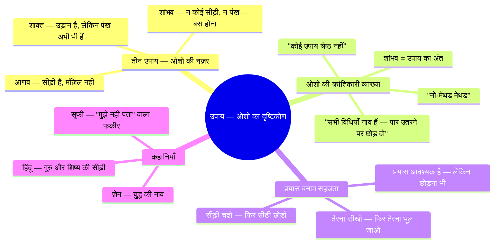
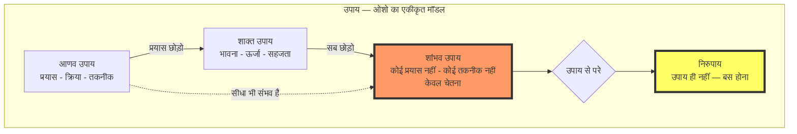
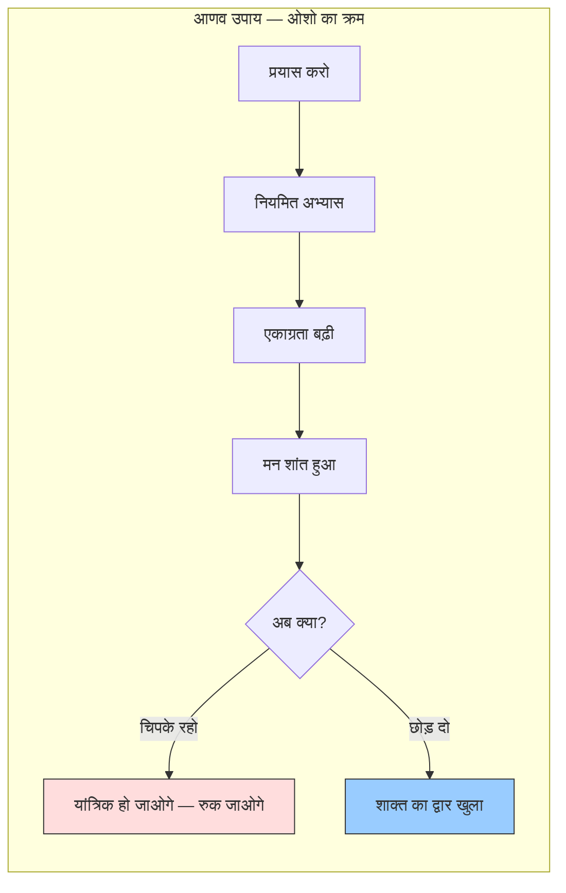
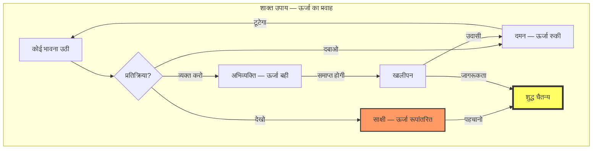
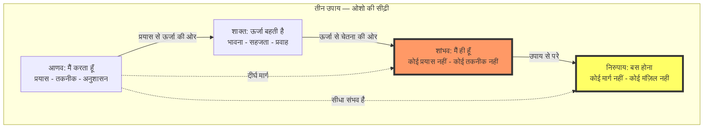
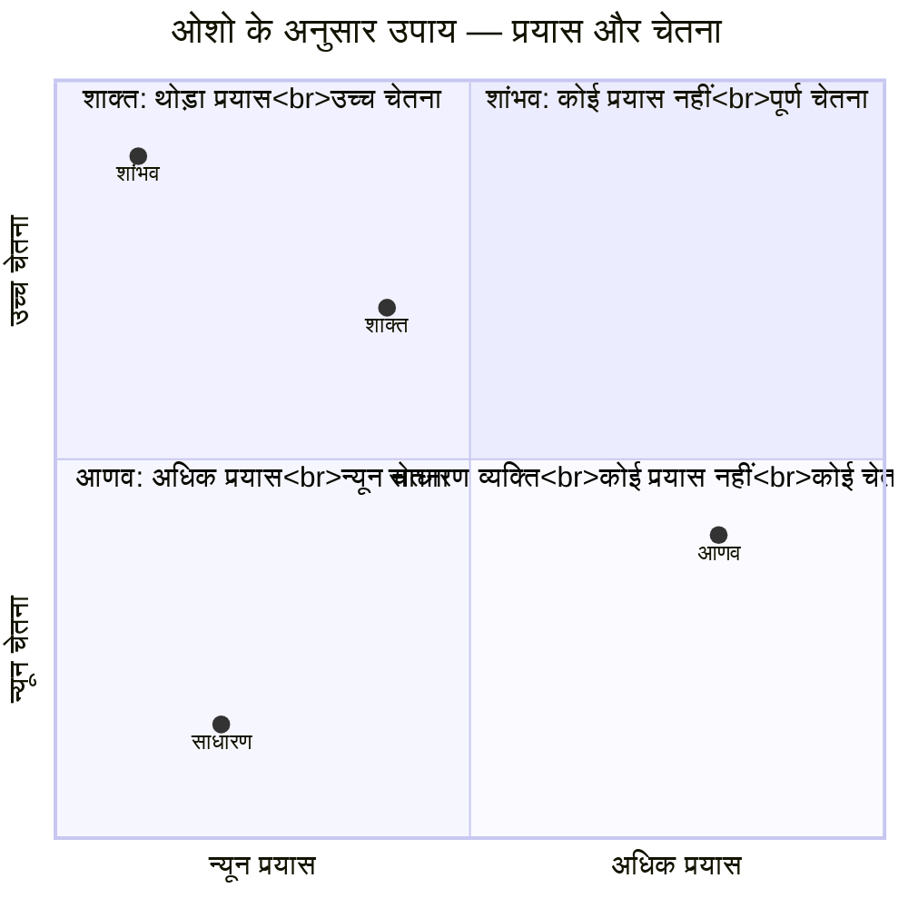

# अध्याय १०: उपाय — ओशो का दृष्टिकोण

> **यह अध्याय ओशो के 'बुक ऑफ सीक्रेट्स' प्रवचन श्रृंखला पर आधारित है**
> *बोले: ओशो, पूना, १९७२-७३*

---

<!-- Image Gallery -->
<section class="lesson-visuals" aria-label="Visual learning resources">
  <header><span>VISUAL LEARNING</span><h2>See it. Review it. Remember it.</h2></header>
  <a class="lesson-visual-card" href="../../assets/images/lessons/vigyan-bhairav-tantra/10-upaya-tantra-osho/handwritten-notes.png" target="_blank" rel="noopener">
    
    <span><strong>Handwritten notes</strong>Condensed notes for deliberate review.</span>
  </a>
  <a class="lesson-visual-card" href="../../assets/images/lessons/vigyan-bhairav-tantra/10-upaya-tantra-osho/sticky-notes.png" target="_blank" rel="noopener">
    
    <span><strong>Sticky-note revision</strong>Fast recall prompts for revision.</span>
  </a>
  <a class="lesson-visual-card" href="../../assets/images/lessons/vigyan-bhairav-tantra/10-upaya-tantra-osho/visual-explanation.png" target="_blank" rel="noopener">
    
    <span><strong>Visual concept guide</strong>A connected explanation of the key ideas.</span>
  </a>
</section>
<!-- End Image Gallery -->

## सीखने के उद्देश्य



इस अध्याय को पूरा करने के बाद आप:

- तीन उपायों को ओशो के अनूठे और क्रांतिकारी दृष्टिकोण से समझेंगे
- जानेंगे कि क्यों ओशो "नो-मेथड" (शांभव) को सर्वोच्च मानते हैं — और फिर भी ११२ तकनीकें क्यों देते हैं
- प्रयास और सहजता के बीच ओशो के संतुलन को समझेंगे
- ओशो की कहानियों — नाव वाली, सीढ़ी वाली — के माध्यम से उपायों का सार पकड़ेंगे
- TypeScript में उपाय वर्गीकरण प्रणाली बनाएँगे
- अपने स्वभाव के अनुकूल उपाय को पहचानेंगे

---

## ओशो का परिचय: "उपाय का मतलब है — उपाय से मुक्त हो जाना"

> **ओशो वाणी:**
> *"उपाय — साधन — का अर्थ ही यह है कि वह तुम्हें उस बिंदु तक ले जाए जहाँ उपाय की जरूरत न रहे। एक अच्छा उपाय वह है जो खुद को नष्ट कर दे। एक सच्चा गुरु वह है जो तुम्हें खुद से आज़ाद कर दे। याद रखो — सीढ़ी चढ़ने के लिए होती है, उतरने के लिए नहीं। एक बार छत पर पहुँच गए, तो सीढ़ी को भूल जाओ।"*

देखो, मेरे प्यारे साधकों, उपाय का सवाल बहुत नाज़ुक है। कश्मीर शैव दर्शन ने तीन उपाय बताए हैं — आणव, शाक्त, शांभव। और विद्वानों ने इन्हें एक पदानुक्रम में रख दिया है — आणव सबसे नीचे, शाक्त बीच में, शांभव सबसे ऊपर।

लेकिन मैं तुमसे कहता हूँ — यह पदानुक्रम गलत है। या यूँ कहो कि यह सच है भी और झूठ भी।

सच इसलिए कि शांभव में कोई प्रयास नहीं है, कोई तकनीक नहीं है — और यह सबसे सरल है। आणव में बहुत प्रयास है, बहुत तकनीक है — और यह सबसे जटिल है।

लेकिन झूठ इसलिए कि — तुम शांभव को पा नहीं सकते, क्योंकि शांभव तुम्हारा स्वभाव है। शांभव कोई उपाय नहीं है — वह उपाय का अंत है। और उस अंत तक पहुँचने के लिए, तुम्हें आणव और शाक्त से गुज़रना होगा — या नहीं भी गुज़रना होगा।

> **ओशो वाणी:**
> *"यह बहुत अजीब बात है — शांभव कोई उपाय नहीं है, फिर भी वह सबसे उच्च उपाय कहा जाता है। यह ऐसे ही है जैसे कोई कहे — सीढ़ी का सबसे ऊपरी डगरा वह है जहाँ सीढ़ी खत्म हो जाती है। तो सीढ़ी का सबसे अच्छा हिस्सा वह है जहाँ सीढ़ी नहीं है! यही शांभव का रहस्य है।"*



---

## १. आणव उपाय — ओशो की व्याख्या

### "आणव का अर्थ है — तुम अभी पर्याप्त नहीं हो"

> **ओशो वाणी:**
> *"आणव उपाय — यह उनके लिए है जो सोचते हैं कि वे छोटे हैं, सीमित हैं, अपूर्ण हैं। आणव का मतलब ही 'अणु' — छोटा — है। और यह उपाय मानता है कि तुम्हें कुछ करना है, कुछ बनना है, कुछ पाना है। यह द्वैत पर आधारित है — साधक और साध्य, कर्ता और कर्म, मार्ग और मंज़िल।"*

ओशो आणव उपाय को बहुत सम्मान देते हैं — लेकिन उसकी सीमाएँ भी बताते हैं। वे कहते हैं, आणव वह मार्ग है जहाँ तुम प्रयास करते हो, तकनीक का पालन करते हो, अनुशासन में रहते हो। यह एक क्रमिक मार्ग है — धीरे-धीरे, कदम-दर-कदम।

| आणव उपाय के पहलू | ओशो का दृष्टिकोण |
|-----------------|------------------|
| प्रयास | आवश्यक है — लेकिन याद रखो कि यह सिर्फ शुरुआत है |
| तकनीक | सहायक है — लेकिन तकनीक में मत उलझो |
| अनुशासन | अच्छा है — लेकिन यांत्रिक मत बनो |
| क्रमिक प्रगति | धीमी है — लेकिन निश्चित है |
| द्वैत | यहाँ रहेगा — लेकिन इसे पार करना है |

### ओशो की नाव वाली कहानी

एक आदमी को नदी पार करनी थी। वह बहुत डरा हुआ था — नदी गहरी थी, धारा तेज़ थी। उसने एक नाव बनाई। बड़ी मेहनत से — दिन-रात काम किया। नाव तैयार हुई। उसने नाव खेई और नदी पार की।

पार उतरने के बाद, वह सोचने लगा — "यह नाव बहुत अच्छी है। इसने मेरी जान बचाई। मैं इसे नहीं छोड़ सकता।" तो वह नाव को अपने सिर पर उठाकर आगे बढ़ने लगा। अब वह नाव उसके लिए बोझ बन गई।

> **ओशो वाणी:**
> *"यही आणव उपाय का खतरा है — तुम तकनीक से चिपक जाते हो। नाव पार उतरने के लिए थी — उसे छोड़ दो। सीढ़ी चढ़ने के लिए थी — उसे छोड़ दो। तकनीक तुम्हें ले आई — अब तकनीक को छोड़ो। मत चिपको। चिपकना ही बंधन है।"*

### आणव के लिए कौन उपयुक्त है — ओशो के अनुसार

> **ओशो वाणी:**
> *"यदि तुम अनुशासन में विश्वास करते हो, यदि तुम क्रमिक प्रगति पसंद करते हो, यदि तुम 'करने' में सहज महसूस करते हो — तो आणव तुम्हारा मार्ग है। इसमें कोई शर्म की बात नहीं है। बुद्ध ने भी इसी मार्ग से शुरुआत की थी। लेकिन याद रखो — यह शुरुआत है, अंत नहीं।"*

### आणव उपाय की तकनीकों पर ओशो की टिप्पणी

**श्वास-ध्यान पर ओशो:**
> *"श्वास को देखना — यह सबसे सरल तकनीक है। और सबसे गहरी भी। श्वास वह पुल है जो शरीर और मन को जोड़ता है। जब तुम श्वास को देखते हो, तो तुम दोनों को देख रहे हो। यहीं से शुरुआत करो।"*

**मंत्र-जप पर ओशो:**
> *"मंत्र एक ऐसी ध्वनि है जो तुम्हें अपने भीतर ले जाती है। लेकिन सावधान — मंत्र को यांत्रिक मत बनाओ। हर बार ताज़गी से जपो। और जब मंत्र तुम्हें मौन में ले जाए — तो मंत्र को छोड़ दो। वह मौन ही तुम्हारा लक्ष्य है।"*

**त्राटक (दृष्टि स्थिरीकरण) पर ओशो:**
> *"एक बिंदु पर आँखें स्थिर करो — इतना केंद्रित हो जाओ कि दुनिया गायब हो जाए। लेकिन फिर — उस बिंदु को भी छोड़ दो। जो बचता है, वही तुम हो।"*



---

## २. शाक्त उपाय — ओशो की व्याख्या

### "शाक्त का अर्थ है — तुम ऊर्जा हो, कर्ता नहीं"

> **ओशो वाणी:**
> *"शाक्त उपाय में तुम कुछ नहीं करते — तुम केवल ऊर्जा को प्रवाहित होने देते हो। तुम नदी नहीं खेते — तुम नदी बन जाते हो। तुम नियंत्रण छोड़ देते हो — और फिर पहली बार, तुम पाते हो कि असली नियंत्रण तो यही है।"*

ओशो शाक्त उपाय को आणव से एक कदम आगे मानते हैं। यहाँ प्रयास कम है, भावना अधिक है। यह ऊर्जा का मार्ग है — जहाँ तुम तकनीक नहीं करते, बल्कि ऊर्जा को अपने से होकर बहने देते हो।

| शाक्त उपाय के पहलू | ओशो का दृष्टिकोण |
|-------------------|------------------|
| प्रयास | न्यूनतम — बस एक हल्का संकेत काफी है |
| भावना | यही मार्ग है — भावना को दबाओ मत, उसे प्रवाहित होने दो |
| ऊर्जा | तुम ऊर्जा हो — इसे पहचानो |
| सहजता | यहाँ प्रयास नहीं, सहज प्रवाह है |
| गति | आणव से तेज़ — क्योंकि प्रतिरोध कम है |

### शाक्त उपाय पर ओशो का एक ज़ेन दृष्टांत

एक ज़ेन गुरु के पास एक विद्वान आया। विद्वान ने कहा — "गुरुजी, मैं बहुत सालों से ध्यान कर रहा हूँ। मैंने सब तकनीकें आज़मा लीं। मुझे कुछ नहीं मिल रहा।"

गुरु ने उसे चाय पिलाई। कप में चाय डालते रहे — कप भर गया, फिर भी डालते रहे। चाय कप से बाहर गिरने लगी।

विद्वान ने कहा — "गुरुजी, कप भर गया! अब और न डालिए!"

गुरु ने कहा — "यही तुम्हारी समस्या है। तुम तकनीकों से भरे हुए हो। पहले खाली करो। तब ही कुछ मिलेगा।"

> **ओशो वाणी:**
> *"शाक्त उपाय का अर्थ है — खाली हो जाना। सारी तकनीकें, सारे प्रयास, सारे ज्ञान को एक तरफ रख दो। केवल ऊर्जा को प्रवाहित होने दो। जब तुम खाली होते हो, तब परम तुम्हें भरता है।"*

### रति-ध्यान — ओशो की व्याख्या

> **ओशो वाणी:**
> *"प्रेम — रति — यह शाक्त उपाय की सबसे शक्तिशाली तकनीक है। क्योंकि प्रेम में, तुम करीब होते हो — लेकिन करीबी में भी, एक दूरी होती है। प्रेम में तुम एक होने की कोशिश करते हो — और वही कोशिश तुम्हें चैतन्य के करीब लाती है। प्रेम को निर्विषय कर दो — बिना किसी वस्तु के प्रेम — और वही परम है।"*

**ओशो की रति-ध्यान विधि:**

१. किसी से प्रेम करो — सच्चा, गहरा प्रेम।
२. उस प्रेम को महसूस करो — उसकी गर्माहट, उसकी कोमलता, उसका विस्तार।
३. अब, धीरे-धीरे, उस व्यक्ति को हटाओ। प्रेम को रहने दो — व्यक्ति को हटाओ।
४. प्रेम बिना किसी वस्तु के — शुद्ध प्रेम — वही परम चैतन्य है।
५. इस शुद्ध प्रेम में विश्राम करो।



### शाक्त उपाय के लिए कौन उपयुक्त है — ओशो के अनुसार

> **ओशो वाणी:**
> *"यदि तुम भावनाओं में गहरे उतर सकते हो, यदि तुम संगीत में खो सकते हो, यदि तुम प्रेम में पागल हो सकते हो — तो शाक्त तुम्हारा मार्ग है। यह कवियों का, कलाकारों का, प्रेमियों का मार्ग है। यह सहज है, तीव्र है — लेकिन अस्थिर भी है। शाक्त में तुम ऊपर उठ सकते हो — और नीचे गिर भी सकते हो। इसलिए साक्षी बने रहना — यही शाक्त में संतुलन है।"*

---

## ३. शांभव उपाय — ओशो की क्रांतिकारी व्याख्या

### "शांभव — उपायों का अंत, चेतना की शुरुआत"

यह ओशो का सबसे महत्वपूर्ण संदेश है — शांभव कोई उपाय नहीं है।

> **ओशो वाणी:**
> *"शांभव — इसका अर्थ है शिव से संबंधित। और शिव कौन है? शिव है शुद्ध चेतना — बिना किसी क्रिया के, बिना किसी गुण के, बिना किसी रूप के। और शांभव उपाय का अर्थ है — बिना किसी उपाय के, केवल चेतना में स्थित हो जाना। यह कोई तकनीक नहीं है — यह तकनीक का अंत है। यह कोई मार्ग नहीं है — यह मंज़िल है।"*

ओशो कहते हैं कि शांभव सबसे कठिन है — और सबसे आसान भी। कठिन इसलिए कि हम प्रयास करने के आदी हैं। आसान इसलिए कि इसमें कुछ करना नहीं है — बस पहचानना है जो पहले से है।

| शांभव उपाय के पहलू | ओशो का दृष्टिकोण |
|-------------------|------------------|
| प्रयास | शून्य — कोई प्रयास नहीं |
| तकनीक | कोई तकनीक नहीं — केवल संकल्प |
| साधन | कोई साधन नहीं — तुम ही साधन हो |
| द्वैत | कोई द्वैत नहीं — सब एक है |
| गति | तत्क्षण — इसी क्षण में |

### ओशो की "नो-मेथड मेथड"

> **ओशो वाणी:**
> *"मैं तुम्हें एक ऐसी विधि देता हूँ जो कोई विधि नहीं है। मैं तुम्हें कुछ ऐसा करने को कहता हूँ जो कोई क्रिया नहीं है। मैं कहता हूँ — बस बैठो। कुछ मत करो। श्वास को मत बदलो, मंत्र मत जपो, कुछ मत सोचो। बस बैठो — और होने दो जो हो रहा है। यही शांभव है।"*

**ओशो की शांभव विधि (यदि इसे विधि कहा जा सके):**

१. एक शांत जगह पर बैठो।
२. समझ लो — तुम्हें कुछ करना नहीं है।
३. कोई प्रयास मत करो — बिल्कुल कोई प्रयास नहीं।
४. जो हो रहा है, उसे होने दो — श्वास अपने आप आ रही है, विचार अपने आप आ रहे हैं।
५. तुम केवल हो — तुम कोई क्रिया नहीं।
६. इस 'होने' में ही स्थित रहो।
७. यही शांभव है।

### एक और ज़ेन कहानी

बुद्ध के एक शिष्य ने पूछा — "भगवान, मैं ध्यान कैसे करूँ?"

बुद्ध ने कहा — "जब तुम बैठो, तो बैठने दो। जब तुम उठो, तो उठने दो। बस इतना ही। कुछ मत जोड़ो।"

शिष्य ने कहा — "लेकिन यह तो बहुत आसान है!"

बुद्ध ने कहा — "यह इतना आसान है कि तुम इसे कर ही नहीं सकते। क्योंकि तुम कुछ करना चाहते हो। तुम प्रयास करना चाहते हो। तुम सिद्धि चाहते हो। और यहाँ कुछ करना नहीं है — केवल होना है।"

> **ओशो वाणी:**
> *"बुद्ध सही कह रहे थे — शांभव इतना आसान है कि तुम इसे कर नहीं सकते। क्योंकि तुम 'करना' ही भूल गए हो। तुम जन्म से ही 'करने' में प्रशिक्षित हो। शांभव का अर्थ है — उस प्रशिक्षण को भूल जाना। उस कंडीशनिंग को हटा देना। और जब सब हट जाता है — जो बचता है, वह शांभव है।"*



---

## प्रयास बनाम सहजता — ओशो का संतुलन

### "प्रयास आवश्यक है — लेकिन प्रयास में मत उलझो"

यह ओशो का सबसे व्यावहारिक संदेश है। वे कहते हैं —

> **ओशो वाणी:**
> *"प्रयास करो — लेकिन याद रखो कि प्रयास अंत नहीं है। प्रयास तुम्हें उस बिंदु तक ले जाएगा जहाँ प्रयास की जरूरत नहीं है। जैसे तैरना सीखो — पहले हाथ-पैर चलाने होते हैं, बहुत प्रयास करना होता है। लेकिन एक दिन तुम तैरना सीख जाते हो — फिर प्रयास नहीं करते, तुम बस तैरते हो। वही शांभव है।"*

| प्रयास (आणव) | सहजता (शांभव) |
|--------------|---------------|
| सीढ़ी चढ़ना | छत पर होना |
| नाव खेना | पार उतरना |
| तैरना सीखना | तैराक हो जाना |
| मंत्र जपना | मौन में स्थित होना |
| श्वास देखना | श्वास को होने देना |

### ओशो का उदाहरण — तीरंदाज़ी

एक तीरंदाज़ ने सालों अभ्यास किया। उसने लक्ष्य साधना, धनुष खींचना, छोड़ना — सब सीखा। फिर एक दिन, गुरु ने कहा — "अब सब भूल जाओ।"

तीरंदाज़ ने कहा — "लेकिन गुरुजी, मैंने इतने साल सीखा!"

गुरु ने कहा — "यही तो समस्या है। तुम सीख गए हो। अब सीखने को भूल जाओ। अब तीरंदाज़ी को तुम्हारे भीतर से आने दो — तुम्हारे सीखे हुए नियमों से नहीं, तुम्हारे अस्तित्व से।"

> **ओशो वाणी:**
> *"यही तीनों उपायों का क्रम है। पहले सीखो — पूरी लगन से, पूरे प्रयास से। फिर भूलो — जैसे कुछ सीखा ही न हो। और जब सीखना और भूलना दोनों समाप्त हो जाएँ — तब जो बचता है, वही सत्य है। वही शांभव है।"*

---

## ओशो का निष्कर्ष — तीनों उपाय एक ही चेतना के तीन स्तर हैं

> **ओशो वाणी:**
> *"तीन उपाय — तीन अलग-अलग मार्ग नहीं हैं। वे एक ही मार्ग के तीन स्तर हैं। जैसे तुम सीढ़ी चढ़ते हो — पहला डगरा, दूसरा डगरा, तीसरा डगरा — लेकिन सीढ़ी एक ही है। आणव से शाक्त, शाक्त से शांभव — यह कोई छलांग नहीं है, यह एक स्वाभाविक विकास है।
*
*लेकिन याद रखो — तुम पहले से ही शांभव में हो। तुम पहले से ही उस छत पर हो। तुम सिर्फ यह भूल गए हो। और ११२ तकनीकें — वे सब तुम्हें यह याद दिलाने के लिए हैं कि तुम कहाँ हो।"*



---

## TypeScript: ओशो का उपाय वर्गीकरण और विश्लेषण

नीचे एक TypeScript आधारित उपाय वर्गीकरण प्रणाली है जो ओशो के दृष्टिकोण को कोड में ढालती है।

```typescript
/**
 * ओशो का उपाय वर्गीकरण और विश्लेषण (Osho's Upaya Classification System)
 * 
 * ओशो के अनुसार — तीन उपाय एक ही चेतना के तीन स्तर हैं।
 * आणव = प्रयास, शाक्त = सहजता, शांभव = कोई प्रयास नहीं।
 * 
 * कोर टीचिंग: "शांभव कोई उपाय नहीं — वह उपाय का अंत है।"
 * — ओशो
 */

// ===== मूल प्रकार (Core Types) =====

/** ओशो के अनुसार तीन उपाय */
export enum OshoUpaya {
    ANAVA = 'आणव उपाय',
    SHAKTA = 'शाक्त उपाय',
    SHAMBHAVA = 'शांभव उपाय',
    NIRUPAYA = 'निरुपाय — उपाय से परे',
}

/** ओशो के अनुसार उपाय का चरण */
export enum OshoUpayaStage {
    BEGINNER = 'प्रारंभिक — सीढ़ी का पहला डगरा',
    PRACTITIONER = 'अभ्यासी — सीढ़ी के बीच में',
    MASTER = 'निपुण — सीढ़ी के ऊपर',
    BEYOND = 'सिद्ध — सीढ़ी छोड़ चुका',
}

/** उपाय के मापदंड — ओशो के अनुसार */
export interface OshoUpayaParameters {
    /** प्रयास स्तर 0-10 (0 = कोई प्रयास नहीं, 10 = अत्यधिक प्रयास) */
    effortLevel: number;
    /** बाह्य साधन 0-10 (कितनी चीज़ों की ज़रूरत) */
    externalAids: number;
    /** भावनात्मक गहराई 0-10 */
    emotionalDepth: number;
    /** सहजता 0-10 (कितना अपने आप होता है) */
    spontaneousFactor: number;
    /** द्वैत 0-10 (कितना अलगाव है) */
    dualAwareness: number;
    /** ओशो द्वारा अनुशंसित ऊर्जा */
    recommendedEnergy: 'क्रियाशक्ति' | 'ज्ञानशक्ति' | 'इच्छाशक्ति';
}

/** Osho-style technique description */
export interface OshoTechnique {
    id: number;
    name: string;
    sanskritName: string;
    /** ओशो का मुख्य श्लोक */
    oshoKeyQuote: string;
    /** ओशो की तकनीक का विवरण */
    oshoMethod: string;
    /** ओशो की कहानी / दृष्टांत */
    oshoStory?: string;
    parameters: OshoUpayaParameters;
    upaya: OshoUpaya;
    stage: OshoUpayaStage;
    /** ओशो के अनुसार चेतावनी */
    oshoWarning: string;
}

/** उपाय विश्लेषण परिणाम — ओशो शैली */
export interface OshoUpayaAnalysis {
    technique: OshoTechnique;
    primaryUpaya: OshoUpaya;
    /** क्या यह उपाय छोड़ने का समय है? */
    oshoAdvice: string;
    /** ओशो की कहानी इस संदर्भ में */
    oshoTeaching: string;
    /** अगला कदम */
    nextStep: string;
    confidence: number;
}

/** साधक प्रोफ़ाइल — ओशो के अनुसार */
export interface OshoSadhakaProfile {
    name: string;
    /** कितने समय से साधना कर रहे हैं */
    practiceDuration: 'कुछ दिन' | 'कुछ महीने' | 'कुछ साल' | 'कई साल';
    /** क्या वे प्रयास करने में विश्वास करते हैं? */
    effortBelief: 'प्रयास में विश्वास' | 'प्रयास छोड़ने को तैयार' | 'पहले से सहज';
    /** उनकी प्रकृति */
    nature: 'क्रियाशील' | 'भावुक' | 'चिंतनशील' | 'सहज';
    /** क्या वे तकनीक से चिपके हुए हैं? */
    attachedToTechnique: boolean;
    /** क्या वे गुरु की कृपा में हैं? */
    hasGuruGrace: boolean;
}

// ===== मुख्य वर्गीकरण प्रणाली =====

export class OshoUpayaSystem {
    private techniques: OshoTechnique[] = [];

    constructor() {
        this.initializeDatabase();
    }

    /** ओशो के अनुसार तकनीक का उपाय बताएँ */
    classify(technique: OshoTechnique): OshoUpayaAnalysis {
        const params = technique.parameters;
        let primaryUpaya: OshoUpaya;
        let confidence: number;

        // ओशो का वर्गीकरण — सरल और सीधा
        if (params.effortLevel >= 6 && params.spontaneousFactor <= 3) {
            primaryUpaya = OshoUpaya.ANAVA;
            confidence = 0.8 + (params.externalAids > 5 ? 0.1 : 0);
        } else if (params.effortLevel >= 3 && params.spontaneousFactor >= 4 && params.emotionalDepth >= 5) {
            primaryUpaya = OshoUpaya.SHAKTA;
            confidence = 0.7 + (params.emotionalDepth > 7 ? 0.2 : 0);
        } else if (params.effortLevel <= 2 && params.spontaneousFactor >= 8) {
            primaryUpaya = OshoUpaya.SHAMBHAVA;
            confidence = 0.9;
        } else {
            // मिश्रित — ओशो कहते हैं कि यह साधक पर निर्भर करता है
            primaryUpaya = OshoUpaya.ANAVA;
            confidence = 0.5;
        }

        // ओशो की सलाह
        const oshoAdvice = this.getOshoAdvice(primaryUpaya, technique);
        const oshoTeaching = this.getOshoTeaching(primaryUpaya);
        const nextStep = this.getNextStep(primaryUpaya);

        return {
            technique,
            primaryUpaya,
            oshoAdvice,
            oshoTeaching,
            nextStep,
            confidence: Math.round(confidence * 100) / 100,
        };
    }

    /** साधक के लिए उपाय सुझाएँ — ओशो शैली */
    suggestForSadhaka(profile: OshoSadhakaProfile): {
        recommendedUpaya: OshoUpaya;
        oshoMessage: string;
        warning: string;
        practiceAdvice: string;
    } {
        let recommendedUpaya: OshoUpaya;
        let oshoMessage: string;
        let warning: string;
        let practiceAdvice: string;

        // प्रोफ़ाइल के आधार पर सुझाव
        if (profile.attachedToTechnique) {
            recommendedUpaya = OshoUpaya.SHAKTA;
            oshoMessage = 'ओशो कहते हैं: "तुम तकनीक से चिपक गए हो। अब तकनीक को छोड़ने का समय है। शाक्त उपाय में जाओ — भावना को प्रवाहित होने दो, नियंत्रण छोड़ो।"';
            warning = 'चेतावनी: तकनीक से चिपकना ही सबसे बड़ा बंधन है। तकनीक नाव है — पार उतरने के बाद नाव को छोड़ दो।';
            practiceAdvice = 'प्रतिदिन एक शाक्त तकनीक करें (रति-ध्यान या हर्ष-चेतना)। प्रयास न करें — केवल भावना को प्रवाहित होने दें।';
        } else if (profile.practiceDuration === 'कुछ दिन' || profile.practiceDuration === 'कुछ महीने') {
            recommendedUpaya = OshoUpaya.ANAVA;
            oshoMessage = 'ओशो कहते हैं: "शुरुआत में प्रयास आवश्यक है। सीढ़ी के पहले डगरे पर खड़े होकर छत पर पहुँचने की कोशिश मत करो। धीरे-धीरे, कदम-दर-कदम।"';
            warning = 'चेतावनी: प्रयास करो, लेकिन प्रयास में मत उलझो। याद रखो — यह शुरुआत है, अंत नहीं।';
            practiceAdvice = 'प्रतिदिन २० मिनट श्वास-ध्यान करें। नियमितता महत्वपूर्ण है। हर सात दिन बाद एक दिन बिना किसी तकनीक के बैठें।';
        } else if (profile.nature === 'भावुक' || profile.nature === 'सहज') {
            recommendedUpaya = OshoUpaya.SHAKTA;
            oshoMessage = 'ओशो कहते हैं: "तुम स्वभाव से ही भावुक हो — यह तुम्हारी ताकत है। शाक्त उपाय तुम्हारा मार्ग है। भावनाओं को दबाओ मत — उन्हें प्रवाहित होने दो। भावना ही ध्यान है।"';
            warning = 'चेतावनी: शाक्त में ऊर्जा तीव्र होती है — अस्थिर भी हो सकती है। साक्षी बने रहना मत भूलो।';
            practiceAdvice = 'जब भी कोई प्रबल भावना उठे — उसे दबाओ मत, व्यक्त मत करो — बस देखो। भावना को शरीर में कहाँ महसूस करते हो? वहाँ ध्यान दो।';
        } else if (profile.hasGuruGrace && profile.practiceDuration === 'कई साल') {
            recommendedUpaya = OshoUpaya.SHAMBHAVA;
            oshoMessage = 'ओशो कहते हैं: "अब समय आ गया है — सब छोड़ दो। कोई तकनीक नहीं, कोई मंत्र नहीं, कोई प्रयास नहीं। केवल बैठो और होने दो। गुरु की कृपा तुम्हारे साथ है — अब तुम स्वयं ही गुरु हो।"';
            warning = 'चेतावनी: शांभव में कोई तकनीक नहीं है — इसे तकनीक मत बनाओ। यदि प्रयास करोगे, तो शांभव खो जाएगा।';
            practiceAdvice = 'प्रतिदिन ३० मिनट — बस बैठो। कुछ मत करो। जो हो, उसे होने दो। तुम केवल हो — यही पर्याप्त है।';
        } else {
            recommendedUpaya = OshoUpaya.ANAVA;
            oshoMessage = 'ओशो कहते हैं: "जहाँ हो, वहीं से शुरुआत करो। सीढ़ी के नीचे खड़े होकर ऊपर की बात मत करो। पहला कदम उठाओ — बाकी अपने आप होगा।"';
            warning = 'चेतावनी: देरी मत करो। कल कभी नहीं आता — अभी शुरू करो।';
            practiceAdvice = 'आज से ही शुरू करें। १० मिनट — श्वास को देखें। बस इतना।';
        }

        return { recommendedUpaya, oshoMessage, warning, practiceAdvice };
    }

    /** ओशो की सलाह — उपाय के अनुसार */
    private getOshoAdvice(upaya: OshoUpaya, technique: OshoTechnique): string {
        const adviceMap: Record<OshoUpaya, string> = {
            [OshoUpaya.ANAVA]: 
                `"${technique.name}" का नियमित अभ्यास करो। लेकिन याद रखो — यह सिर्फ शुरुआत है। जब तकनीक सहज लगने लगे, तब प्रयास छोड़ने की कोशिश करो। तकनीक को सीढ़ी की तरह इस्तेमाल करो — उस पर बैठो मत।`,
            [OshoUpaya.SHAKTA]: 
                `"${technique.name}" में प्रयास मत करो। भावना को प्रवाहित होने दो — जैसे नदी बहती है। तुम केवल देखो। जब भावना अपने चरम पर हो, तब देखो कि वह कहाँ जाती है — वह तुम्हें चैतन्य तक ले जाएगी।`,
            [OshoUpaya.SHAMBHAVA]: 
                `"${technique.name}" — इसे तकनीक मत बनाओ। यह तो बस एक संकेत है। जैसे कोई चाँद की तरफ उँगली उठाए — उँगली मत देखो, चाँद देखो। इसी तरह, शांभव की ओर इशारा है — असली चीज़ तो तुम स्वयं हो।`,
            [OshoUpaya.NIRUPAYA]: 
                'अब कुछ मत करो। तुम घर आ गए। कोई मार्ग नहीं, कोई मंज़िल नहीं — केवल तुम हो। और तुम ही वह हो जिसे तुम खोज रहे थे।',
        };

        return adviceMap[upaya];
    }

    /** ओशो की शिक्षा — उपाय के अनुसार */
    private getOshoTeaching(upaya: OshoUpaya): string {
        const teachings: Record<OshoUpaya, string> = {
            [OshoUpaya.ANAVA]: 
                'एक बार एक आदमी ने अपने गुरु से पूछा — "मैं कब तक ध्यान करूँ?" गुरु ने कहा — "जब तक ध्यान करना भूल न जाओ।" यही आणव का सार है — करते-करते ऐसा करो कि करना ही भूल जाओ।',
            [OshoUpaya.SHAKTA]: 
                'सूफी कहानी: एक फकीर नाच रहा था। किसी ने पूछा — "यह क्या कर रहे हो?" फकीर ने कहा — "मैं नहीं कर रहा — हो रहा है। मैं तो बस देख रहा हूँ।" यही शाक्त है — कर्ता गायब, केवल क्रिया शेष।',
            [OshoUpaya.SHAMBHAVA]: 
                'ज़ेन कहानी: एक शिष्य ने गुरु से पूछा — "ध्यान क्या है?" गुरु ने कहा — "जब तुम बैठो, तो बैठो। जब तुम खड़े हो, तो खड़े रहो। बस इतना ही।" शिष्य ने कहा — "लेकिन यह तो सब करते हैं!" गुरु मुस्कुराए — "नहीं। जब तुम बैठते हो, तो तुम हजार काम कर रहे हो। मैं सिर्फ बैठता हूँ।"',
            [OshoUpaya.NIRUPAYA]: 
                'एक बार बुद्ध से किसी ने पूछा — "तुमने क्या पाया है?" बुद्ध ने कहा — "कुछ नहीं। मैंने तो केवल वह पाया जो हमेशा से मेरा था। मैंने केवल वह खोया जो मेरा नहीं था।" यही निरुपाय है।',
        };

        return teachings[upaya];
    }

    /** अगला कदम — ओशो के अनुसार */
    private getNextStep(upaya: OshoUpaya): string {
        const steps: Record<OshoUpaya, string> = {
            [OshoUpaya.ANAVA]: 
                'जब तुम पाओ कि तकनीक यांत्रिक हो रही है — तब रुको। एक दिन बिना किसी तकनीक के बैठो। देखो क्या होता है। यह शाक्त की ओर पहला कदम है।',
            [OshoUpaya.SHAKTA]: 
                'जब शाक्त में स्थिर हो जाओ — तब एक दिन प्रयास करो कि कुछ भी मत करो। कोई भावना मत जगाओ। बस बैठो। यह शांभव की ओर कदम है।',
            [OshoUpaya.SHAMBHAVA]: 
                'अब शांभव में स्थिर रहो। लेकिन याद रखो — शांभव को भी मत पकड़ो। जब शांभव भी छूट जाएगा — तब निरुपाय है। वहाँ कुछ नहीं कहा जा सकता।',
            [OshoUpaya.NIRUPAYA]: 
                'अब कोई कदम नहीं है। तुम वहाँ हो जहाँ जाना था।',
        };

        return steps[upaya];
    }

    /** ओशो के अनुसार तीनों उपायों का सारांश */
    getOshoSummary(): Array<{
        upaya: OshoUpaya;
        oneLiner: string;
        oshoQuote: string;
        whenToUse: string;
        whenToLeave: string;
    }> {
        return [
            {
                upaya: OshoUpaya.ANAVA,
                oneLiner: 'प्रयास करो — लेकिन प्रयास में मत उलझो।',
                oshoQuote: '"सीढ़ी चढ़ो — लेकिन सीढ़ी को अपने सिर पर मत उठाओ।"',
                whenToUse: 'जब मन चंचल हो, जब अनुशासन की जरूरत हो, जब शुरुआत कर रहे हो।',
                whenToLeave: 'जब तकनीक यांत्रिक लगे, जब प्रयास बोझ लगे, जब सहजता की ओर खिंचाव हो।',
            },
            {
                upaya: OshoUpaya.SHAKTA,
                oneLiner: 'प्रवाहित होने दो — नियंत्रण छोड़ो।',
                oshoQuote: '"नदी मत खेओ — नदी बन जाओ।"',
                whenToUse: 'जब भावनाएँ प्रबल हों, जब ऊर्जा उमड़ रही हो, जब प्रेम या करुणा का अनुभव हो।',
                whenToLeave: 'जब भावनाएँ शांत हो जाएँ, जब ऊर्जा स्थिर हो जाए — तब और गहरे जाओ।',
            },
            {
                upaya: OshoUpaya.SHAMBHAVA,
                oneLiner: 'कुछ मत करो — बस हो।',
                oshoQuote: '"तुम पहले से ही वहाँ हो — बस पहचानो।"',
                whenToUse: 'हमेशा — क्योंकि यह तुम्हारा स्वभाव है। लेकिन इसे तभी पहचानोगे जब प्रयास छोड़ोगे।',
                whenToLeave: 'कभी नहीं — यह तुम्हारा स्वभाव है। लेकिन इसे मत पकड़ो। इसे होने दो।',
            },
            {
                upaya: OshoUpaya.NIRUPAYA,
                oneLiner: '—',
                oshoQuote: '"जो कहा न जा सके, वही सत्य है।"',
                whenToUse: 'जब शब्द समाप्त हो जाएँ, जब मौन ही एकमात्र भाषा हो।',
                whenToLeave: '—',
            },
        ];
    }

    /** ओशो रिपोर्ट */
    generateOshoReport(techniques: OshoTechnique[]): string {
        const report: string[] = [];

        report.push('═══════════════════════════════════════════');
        report.push('🌺 ओशो — उपाय विश्लेषण रिपोर्ट');
        report.push('═══════════════════════════════════════════');
        report.push('');
        report.push('"उपाय का अर्थ है — उपाय से मुक्त हो जाना।"');
        report.push('');

        const upayaCount = new Map<OshoUpaya, number>();
        techniques.forEach(t => {
            upayaCount.set(t.upaya, (upayaCount.get(t.upaya) || 0) + 1);
        });

        report.push('📊 तकनीकों का वितरण:');
        upayaCount.forEach((count, upaya) => {
            report.push(`  ${upaya}: ${count} तकनीकें`);
        });

        report.push('');
        report.push('🧘 ओशो का संदेश:');
        report.push('  "तीनों उपाय एक ही सीढ़ी के तीन डगरे हैं।');
        report.push('  आणव से शाक्त, शाक्त से शांभव — यह कोई छलांग नहीं,');
        report.push('  यह एक स्वाभाविक विकास है।');
        report.push('  और याद रखो — तुम पहले से ही छत पर हो।');
        report.push('  सीढ़ी तो बस तुम्हें यह याद दिलाने के लिए है कि तुम कहाँ हो।"');
        report.push('');
        report.push('💡 निष्कर्ष:');
        report.push('  कोई उपाय दूसरे से श्रेष्ठ नहीं है।');
        report.push('  हर उपाय अपनी जगह सही है।');
        report.push('  और सबसे अच्छा उपाय वह है जिसे तुम छोड़ सकते हो।');

        return report.join('\n');
    }

    /** सभी तकनीकें */
    getAllTechniques(): ReadonlyArray<OshoTechnique> {
        return this.techniques;
    }

    private initializeDatabase(): void {
        this.techniques = [
            // आणव उपाय
            {
                id: 1,
                name: 'श्वास-ध्यान',
                sanskritName: 'प्राण-संवेदन',
                oshoKeyQuote: '"श्वास को देखना — यह सबसे सरल और सबसे गहरी तकनीक है।"',
                oshoMethod: 'श्वास को देखो — आते हुए, जाते हुए। नियंत्रित मत करो। बस देखो। जब श्वास भीतर जाए, तो जानो — श्वास भीतर जा रही है। जब बाहर आए, तो जानो — श्वास बाहर आ रही है। बस इतना।',
                parameters: {
                    effortLevel: 7,
                    externalAids: 2,
                    emotionalDepth: 3,
                    spontaneousFactor: 2,
                    dualAwareness: 6,
                    recommendedEnergy: 'क्रियाशक्ति',
                },
                upaya: OshoUpaya.ANAVA,
                stage: OshoUpayaStage.BEGINNER,
                oshoWarning: 'श्वास-ध्यान को यांत्रिक मत बनाओ। हर बार नए सिरे से देखो — जैसे पहली बार देख रहे हो।',
            },
            {
                id: 2,
                name: 'मंत्र-जप',
                sanskritName: 'मंत्र-ध्यान',
                oshoKeyQuote: '"मंत्र एक नाव है — पार उतरने पर छोड़ दो।"',
                oshoMethod: 'किसी मंत्र (ॐ, सोहं, राम) का उच्चारण करो। धीरे-धीरे — हर ध्वनि को पूरे चेतना से अनुभव करो। फिर उच्चारण को मानसिक करो। फिर — मंत्र को छोड़ दो। जो बचता है, वही सत्य है।',
                parameters: {
                    effortLevel: 6,
                    externalAids: 4,
                    emotionalDepth: 4,
                    spontaneousFactor: 2,
                    dualAwareness: 5,
                    recommendedEnergy: 'क्रियाशक्ति',
                },
                upaya: OshoUpaya.ANAVA,
                stage: OshoUpayaStage.PRACTITIONER,
                oshoWarning: 'मंत्र में मत उलझो। मंत्र साधन है, साध्य नहीं। जब मौन आए, तो मंत्र को छोड़ दो।',
            },
            {
                id: 3,
                name: 'त्राटक (दृष्टि स्थिरीकरण)',
                sanskritName: 'त्राटक',
                oshoKeyQuote: '"बिंदु पर ध्यान दो — इतना केंद्रित हो जाओ कि दुनिया गायब हो जाए। फिर बिंदु को भी छोड़ दो।"',
                oshoMethod: 'एक बिंदु (दीपशिखा, चाँद, या कोई चिह्न) पर दृष्टि स्थिर करो। पलक न झपकाएँ। जब आँखें थक जाएँ, तो बंद करो और भीतर उसी बिंदु का ध्यान करो।',
                parameters: {
                    effortLevel: 8,
                    externalAids: 6,
                    emotionalDepth: 2,
                    spontaneousFactor: 1,
                    dualAwareness: 7,
                    recommendedEnergy: 'क्रियाशक्ति',
                },
                upaya: OshoUpaya.ANAVA,
                stage: OshoUpayaStage.PRACTITIONER,
                oshoWarning: 'त्राटक में आँखों पर ज़ोर मत डालो। प्राकृतिक रूप से करो। और याद रखो — बिंदु साधन है, ध्येय नहीं।',
            },
            // शाक्त उपाय
            {
                id: 4,
                name: 'रति-ध्यान',
                sanskritName: 'प्रेम-भावना',
                oshoKeyQuote: '"प्रेम को निर्विषय करो — और वही परम है।"',
                oshoMethod: 'किसी से गहरा प्रेम करो। उस प्रेम को महसूस करो। फिर धीरे-धीरे उस व्यक्ति को हटाओ — प्रेम को रहने दो। यह प्रेम बिना किसी वस्तु के — शुद्ध प्रेम — वही चैतन्य है।',
                parameters: {
                    effortLevel: 2,
                    externalAids: 0,
                    emotionalDepth: 9,
                    spontaneousFactor: 7,
                    dualAwareness: 3,
                    recommendedEnergy: 'ज्ञानशक्ति',
                },
                upaya: OshoUpaya.SHAKTA,
                stage: OshoUpayaStage.MASTER,
                oshoWarning: 'प्रेम में मत खोओ — प्रेम को देखो। प्रेम और साक्षी — दोनों को एक साथ रखो।',
            },
            {
                id: 5,
                name: 'हर्ष-चेतना',
                sanskritName: 'आनंद-साक्षी',
                oshoKeyQuote: '"हर्ष — बिना किसी कारण के — यह तुम्हारा स्वभाव है।"',
                oshoMethod: 'बिना किसी कारण के हर्ष का अनुभव करो। यह हर्ष तुम्हारा स्वभाव है — इसे किसी घटना की जरूरत नहीं। इस हर्ष में स्थित हो जाओ और देखो — यह कहाँ से उठता है?',
                parameters: {
                    effortLevel: 1,
                    externalAids: 0,
                    emotionalDepth: 8,
                    spontaneousFactor: 9,
                    dualAwareness: 2,
                    recommendedEnergy: 'ज्ञानशक्ति',
                },
                upaya: OshoUpaya.SHAKTA,
                stage: OshoUpayaStage.MASTER,
                oshoWarning: 'हर्ष को मत पकड़ो। उसे आने दो, जाने दो। पकड़ोगे तो खो जाएगा।',
            },
            // शांभव उपाय
            {
                id: 6,
                name: 'साक्षी-भाव',
                sanskritName: 'द्रष्टृ-ध्यान',
                oshoKeyQuote: '"देखना ही ध्यान है। बस देखो — और सब अपने आप होगा।"',
                oshoMethod: 'बिना किसी प्रयास के — बस देखो। शरीर को देखो, विचारों को देखो, भावनाओं को देखो। तुम कुछ नहीं करते — केवल देखते हो। और फिर — देखने वाले को देखो।',
                parameters: {
                    effortLevel: 0,
                    externalAids: 0,
                    emotionalDepth: 3,
                    spontaneousFactor: 10,
                    dualAwareness: 1,
                    recommendedEnergy: 'इच्छाशक्ति',
                },
                upaya: OshoUpaya.SHAMBHAVA,
                stage: OshoUpayaStage.BEYOND,
                oshoWarning: 'साक्षी को तकनीक मत बनाओ। यह कोई क्रिया नहीं है — यह तुम्हारा स्वभाव है। जब तुम 'करने' की कोशिश करोगे, तो साक्षी खो जाएगा।',
            },
            {
                id: 7,
                name: 'तुरीय-बोध',
                sanskritName: 'चतुर्थ-पाद',
                oshoKeyQuote: '"तुम पहले से ही तुरीय में हो — बस पहचानो।"',
                oshoMethod: 'जाग्रत, स्वप्न, सुषुप्ति — तीनों अवस्थाओं को जानने वाला एक है। उस एक को पहचानो। वह तुरीय है — और वह तुम हो।',
                parameters: {
                    effortLevel: 1,
                    externalAids: 0,
                    emotionalDepth: 2,
                    spontaneousFactor: 9,
                    dualAwareness: 1,
                    recommendedEnergy: 'इच्छाशक्ति',
                },
                upaya: OshoUpaya.SHAMBHAVA,
                stage: OshoUpayaStage.BEYOND,
                oshoWarning: 'तुरीय को मत खोजो — तुम उसे खोज नहीं सकते, क्योंकि तुम वही हो। केवल पहचानो।',
            },
        ];
    }
}

// ===== उपयोग उदाहरण (Example Usage) =====

function demonstrateOshoUpaya(): void {
    const system = new OshoUpayaSystem();
    
    console.log('🌺 ओशो के उपाय तंत्र में आपका स्वागत है\n');

    // सभी तकनीकों का वर्गीकरण
    const techniques = system.getAllTechniques();
    for (const technique of techniques) {
        const analysis = system.classify(technique);
        console.log('═══════════════════════════════════════════');
        console.log(`🧘 तकनीक: ${technique.name}`);
        console.log(`📌 उपाय: ${analysis.primaryUpaya}`);
        console.log(`💬 ओशो: ${technique.oshoKeyQuote}`);
        console.log(`📝 विधि: ${technique.oshoMethod}`);
        console.log(`⚠️  चेतावनी: ${technique.oshoWarning}`);
        console.log(`📖 ओशो की शिक्षा: ${analysis.oshoTeaching}`);
        console.log(`🎯 अगला कदम: ${analysis.nextStep}`);
        console.log('');
    }

    // साधक सुझाव
    const sadhaka1: OshoSadhakaProfile = {
        name: 'राम',
        practiceDuration: 'कुछ दिन',
        effortBelief: 'प्रयास में विश्वास',
        nature: 'क्रियाशील',
        attachedToTechnique: false,
        hasGuruGrace: false,
    };

    console.log('\n═══════════════════════════════════════════');
    console.log('👤 साधक के लिए सुझाव:');
    const suggestion = system.suggestForSadhaka(sadhaka1);
    console.log(`🎯 अनुशंसित उपाय: ${suggestion.recommendedUpaya}`);
    console.log(`💬 ओशो का संदेश: ${suggestion.oshoMessage}`);
    console.log(`⚠️  ${suggestion.warning}`);
    console.log(`🧘 अभ्यास: ${suggestion.practiceAdvice}`);

    // ओशो सारांश
    console.log('\n\n📚 ओशो के उपायों का सारांश:');
    const summary = system.getOshoSummary();
    summary.forEach(s => {
        console.log(`\n  📌 ${s.upaya}:`);
        console.log(`     "${s.oneLiner}"`);
        console.log(`     ${s.oshoQuote}`);
        console.log(`     कब उपयोग करें: ${s.whenToUse}`);
        if (s.whenToLeave) {
            console.log(`     कब छोड़ें: ${s.whenToLeave}`);
        }
    });

    // रिपोर्ट
    console.log('\n');
    console.log(system.generateOshoReport(techniques));
}

demonstrateOshoUpaya();

/**
 * ओशो का अंतिम संदेश:
 * 
 * तीन उपाय — आणव, शाक्त, शांभव — ये तीन अलग-अलग मार्ग नहीं हैं।
 * ये एक ही मार्ग के तीन स्तर हैं। और अंत में — उपाय से परे जाना
 * ही सच्ची मुक्ति है।
 * 
 * याद रखो:
 * 1. कोई उपाय श्रेष्ठ नहीं है — हर उपाय अपनी जगह सही है।
 * 2. प्रयास करो — लेकिन प्रयास में मत उलझो।
 * 3. तकनीक नाव है — पार उतरने पर छोड़ दो।
 * 4. शांभव कोई तकनीक नहीं — यह तुम्हारा स्वभाव है।
 * 5. "देखना ही ध्यान है — बस देखो।"
 */
```

---

## सारांश — ओशो के शब्दों में

| उपाय | ओशो की परिभाषा | मुख्य संदेश | कहानी |
|------|----------------|-------------|--------|
| आणव | सीढ़ी — प्रयास और अनुशासन का मार्ग | "प्रयास करो, लेकिन प्रयास में मत उलझो" | नाव वाली कहानी |
| शाक्त | ऊर्जा — भावना और सहजता का मार्ग | "प्रयास छोड़ो, प्रवाहित होने दो" | चाय वाली ज़ेन कहानी |
| शांभव | चेतना — बिना किसी उपाय के | "कुछ मत करो — बस हो" | तीरंदाज़ की कहानी |
| निरुपाय | उपाय से परे — मौन | "जो कहा न जा सके, वही सत्य है" | बुद्ध का "कुछ नहीं पाया" |

> **ओशो वाणी — अंतिम संदेश:**
> *"याद रखो — उपाय का अर्थ है उपाय से मुक्त हो जाना। सभी उपाय नावें हैं — और नाव का उपयोग नदी पार करने के लिए है, नाव को सिर पर उठाकर चलने के लिए नहीं। एक बार पार उतर गए — तो नाव को छोड़ दो। मुस्कुराओ और आगे बढ़ो। कोई उपाय तुम्हें परम तक नहीं ले जा सकता — क्योंकि परम तो तुम स्वयं हो। उपाय तो बस तुम्हें यह याद दिलाने के लिए है।"*

---

## अध्याय प्रश्नोत्तरी (Chapter Quiz)

**प्रश्न १:** ओशो के अनुसार, शांभव उपाय क्या है?

- क) सबसे कठिन तकनीक
- ख) कोई उपाय नहीं — उपाय का अंत और चेतना की पहचान
- ग) मंत्र जप करने का एक विशेष तरीका
- घ) केवल संन्यासियों के लिए

<details>
<summary>उत्तर</summary>
**उत्तर:** ख — ओशो कहते हैं कि शांभव कोई उपाय नहीं है। यह उपाय का अंत है — जहाँ कोई तकनीक नहीं, कोई प्रयास नहीं, केवल चेतना है। "शांभव इतना आसान है कि तुम इसे कर नहीं सकते।"
</details>

**प्रश्न २:** ओशो की नाव वाली कहानी का संदेश क्या है?

- क) नाव बहुत उपयोगी है — इसे हमेशा साथ रखो
- ख) तकनीक नाव है — पार उतरने के बाद उसे छोड़ दो
- ग) नाव बनाना बहुत कठिन है
- घ) नाव के बिना नदी पार नहीं की जा सकती

<details>
<summary>उत्तर</summary>
**उत्तर:** ख — ओशो कहते हैं कि तकनीक नाव की तरह है। नदी पार करने के लिए नाव चाहिए, लेकिन पार उतरने के बाद नाव को सिर पर उठाकर चलना मूर्खता है। तकनीक का उपयोग करो, फिर उसे छोड़ दो।
</details>

**प्रश्न ३:** ओशो के अनुसार, आणव उपाय से शाक्त उपाय में कैसे जाएँ?

- क) एक नई तकनीक सीखकर
- ख) प्रयास छोड़कर और ऊर्जा को प्रवाहित होने देकर
- ग) गुरु बदलकर
- ड) कठिन तपस्या करके

<details>
<summary>उत्तर</summary>
**उत्तर:** ख — ओशो कहते हैं कि जब तकनीक यांत्रिक लगने लगे, तब प्रयास छोड़ो। ऊर्जा को प्रवाहित होने दो। यह आणव से शाक्त में संक्रमण है — यह स्वाभाविक है, इसे मजबूरन मत करो।
</details>

**प्रश्न ४:** ओशो की "नो-मेथड मेथड" का क्या अर्थ है?

- क) कोई विधि नहीं है — सब व्यर्थ है
- ख) एक ऐसी विधि जो कोई विधि नहीं है — केवल होना, करना नहीं
- ग) सभी विधियों को एक साथ करना
- घ) विधियों को अनदेखा करना

<details>
<summary>उत्तर</summary>
**उत्तर:** ख — ओशो की "नो-मेथड मेथड" का अर्थ है — कोई प्रयास नहीं, कोई तकनीक नहीं, केवल जागरूकता। यह शांभव उपाय है — जहाँ तुम कुछ नहीं करते, बस होते हो।
</details>

**प्रश्न ५:** ओशो के अनुसार, तीनों उपायों (आणव, शाक्त, शांभव) का आपस में क्या संबंध है?

- क) तीन अलग-अलग मार्ग हैं — एक-दूसरे से कोई संबंध नहीं
- ख) एक ही सीढ़ी के तीन डगरे हैं — एक से दूसरे में स्वाभाविक विकास
- ग) शांभव सबसे अच्छा है, बाकी बेकार
- घ) आणव सबसे अच्छा है क्योंकि इसमें प्रयास है

<details>
<summary>उत्तर</summary>
**उत्तर:** ख — ओशो कहते हैं कि तीनों उपाय एक ही सीढ़ी के तीन डगरे हैं। कोई दूसरे से श्रेष्ठ नहीं है। आणव से शाक्त, शाक्त से शांभव — यह एक स्वाभाविक विकास है। और याद रखो — तुम पहले से ही छत पर हो।
</details>

---

## अभ्यास (Exercises)

### अभ्यास १: तीन उपाय — तीन सप्ताह का प्रयोग

तीन सप्ताह तक प्रतिदिन अभ्यास करें:

- **सप्ताह १ (आणव):** प्रतिदिन २० मिनट श्वास-ध्यान — पूरे प्रयास और अनुशासन के साथ
- **सप्ताह २ (शाक्त):** प्रतिदिन २० मिनट रति-ध्यान या हर्ष-चेतना — प्रयास छोड़ें, भावना को प्रवाहित होने दें
- **सप्ताह ३ (शांभव):** प्रतिदिन १५ मिनट — बस बैठें, कुछ न करें, केवल होने दें

हर सप्ताह के अनुभव को लिखें। किस उपाय में सबसे अधिक सहजता महसूस हुई?

### अभ्यास २: अपनी नाव को पहचानें

ओशो की नाव वाली कहानी पर ध्यान करें। पूछें — "मेरी नाव क्या है? मैं किस तकनीक, किस विश्वास, किस आदत से चिपका हूँ?" उसे पहचानें — और फिर उसे छोड़ने का अभ्यास करें।

### अभ्यास ३: प्रयास-सहजता संतुलन

एक दिन में तीन बार — सुबह, दोपहर, शाम — अपने प्रयास स्तर को मापें (१-१०)। देखें कि कब आप प्रयास कर रहे हैं और कब सहज हैं। TypeScript ट्रैकर का उपयोग करें।

### अभ्यास ४: शांभव का क्षण

दिन में एक बार — किसी भी समय — अचानक रुकें। एक गहरी साँस लें। और फिर — कुछ भी मत करें। केवल ३० सेकंड के लिए — बस होने दें। यह शांभव का एक क्षण है।

### अभ्यास ५: ओशो की कहानियों पर ध्यान

इस अध्याय की तीन कहानियाँ — नाव वाली, चाय वाली, तीरंदाज़ वाली — किसी एक कहानी पर १५ मिनट ध्यान करें। कहानी को याद करें, उसके अर्थ में उतरें, और देखें कि वह कहानी आपके भीतर क्या बदलाव लाती है।

### अभ्यास ६: समूह चर्चा

निम्नलिखित प्रश्नों पर समूह में ओशो के दृष्टिकोण से चर्चा करें:

१. क्या कोई तकनीक के बिना भी ध्यान कर सकता है?
२. प्रयास और सहजता में संतुलन कैसे बनाएँ?
३. क्या होता है जब कोई तकनीक से चिपक जाता है?
४. शांभव — क्या यह सच में कोई तकनीक नहीं है?
५. ओशो कहते हैं कि ११२ तकनीकें तुम्हें कुछ देने के लिए नहीं हैं — तो वे किसलिए हैं?
