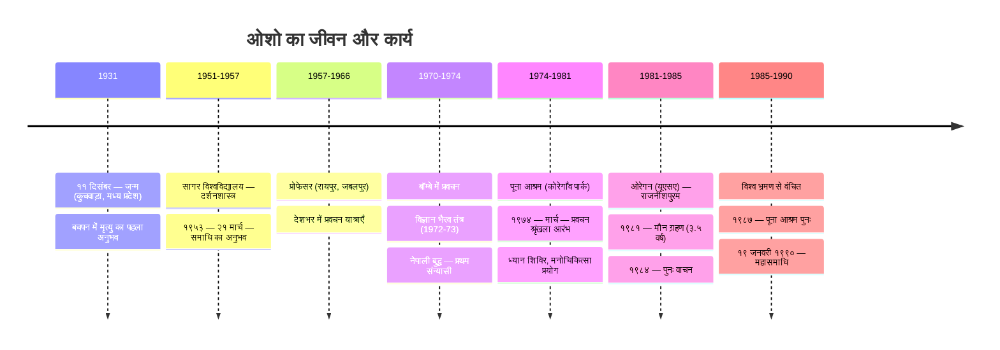
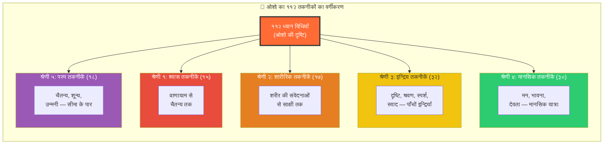
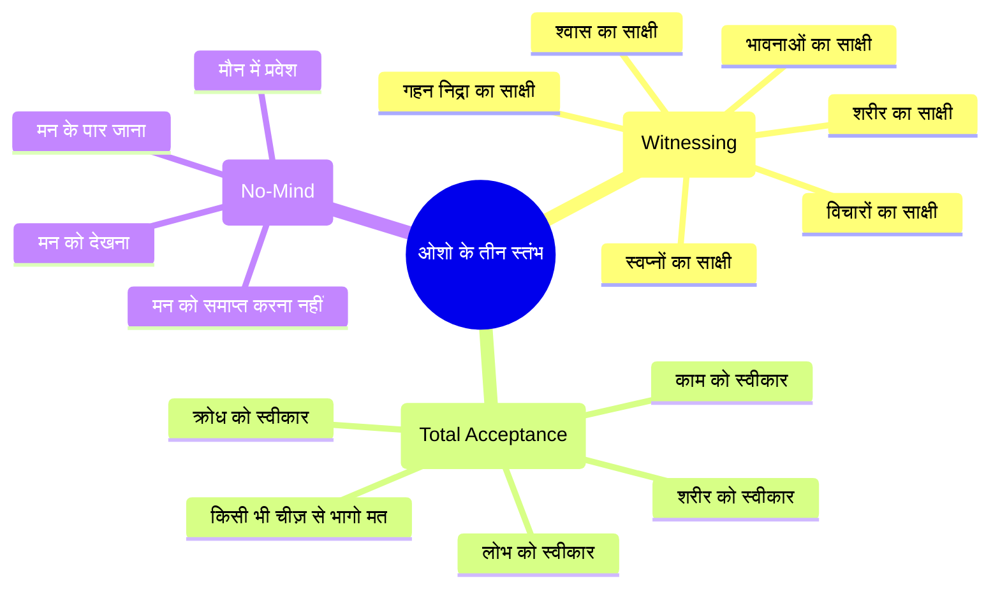

---
id: index
slug: /vigyan-bhairav-tantra
title: "विज्ञान भैरव तंत्र: ओशो की ११२ ध्यान विधियाँ (The Book of Secrets)"
sidebar_label: "विज्ञान भैरव तंत्र: ओशो की ११२ ध्यान विधियाँ (The Book of Secrets)"
sidebar_position: 22
---
# विज्ञान भैरव तंत्र: ओशो की ११२ ध्यान विधियाँ (The Book of Secrets)

> **"यह पुस्तक केवल एक पुस्तक नहीं है — यह एक विस्फोट है। यदि तुम इसे सही ढंग से पढ़ोगे, तो यह तुम्हें बदल डालेगी।"**
> — **ओशो**, विज्ञान भैरव तंत्र पर प्रवचन

---

**ओशो वाणी:**
> "मैं विज्ञान भैरव तंत्र पर बोल रहा हूँ — यह मेरा प्रियतम ग्रंथ है। यह ११२ ध्यान विधियों का संग्रह है। कोई दूसरा ग्रंथ इतनी गहराई तक नहीं जाता। कोई दूसरा ग्रंथ इतनी वैज्ञानिक ढंग से मनुष्य की चेतना को नहीं समझाता। यह केवल एक शास्त्र नहीं — यह एक विज्ञान है।"

---

## सीखने के उद्देश्य (Learning Objectives)

इस कोर्स को पूरा करने के बाद आप:

1. **समझ पाएंगे** — ओशो ने विज्ञान भैरव तंत्र को क्यों अपने प्रवचनों का केंद्र बनाया और उनकी दृष्टि पारंपरिक टीकाकारों से कैसे भिन्न है।
2. **जान पाएंगे** — ओशो का ११२ तकनीकों का अनूठा वर्गीकरण जो उन्होंने अपने प्रवचनों में प्रस्तुत किया।
3. **सीख पाएंगे** — ओशो की केंद्रीय शिक्षा: **साक्षी (witnessing)** — सभी ११२ तकनीकों का मूल आधार।
4. **अनुभव कर पाएंगे** — ओशो की भाषा में — सीधी, चुनौतीपूर्ण, करुणामयी — तंत्र का गूढ़ ज्ञान।
5. **सक्षम होंगे** — टाइपस्क्रिप्ट में एक ओशो-शैली कोर्स प्लेयर और डैशबोर्ड बनाने में।

---

## ओशो और विज्ञान भैरव तंत्र: एक अनोखा संबंध

### ओशो ने इस ग्रंथ को क्यों चुना?

ओशो ने विज्ञान भैरव तंत्र पर १९७२-७३ में बॉम्बे (अब मुंबई) में ११२ दिनों तक प्रवचन दिए। हर दिन एक तकनीक। हर प्रवचन — एक ध्यान विधि की गहनतम व्याख्या।

**ओशो वाणी:**
> "मैंने विज्ञान भैरव तंत्र को इसलिए चुना क्योंकि यह ध्यान का सबसे वैज्ञानिक ग्रंथ है। यह किसी पंथ से संबंधित नहीं। यह किसी धर्म का प्रचार नहीं करता। यह तो शुद्ध विज्ञान है — मनुष्य की चेतना का विज्ञान। और ११२ तकनीकों का मतलब है कि हर प्रकार के व्यक्ति के लिए कोई न कोई तकनीक है। कोई भी वंचित नहीं रहता।"

ओशो का योगदान यह है कि उन्होंने — अकेले — इस प्राचीन तंत्र ग्रंथ को आधुनिक मनुष्य की भाषा में अनूदित किया। उन्होंने इसे किसी संप्रदाय का ग्रंथ नहीं रहने दिया — उन्होंने इसे सार्वभौमिक बना दिया।

### ओशो पारंपरिक टीकाकारों से कैसे भिन्न हैं?

| आयाम | पारंपरिक टीकाकार | ओशो की दृष्टि |
|------|-----------------|--------------|
| **दृष्टिकोण** | दार्शनिक, शास्त्रीय | मनोवैज्ञानिक, प्रायोगिक, अस्तित्वगत |
| **भाषा** | संस्कृत, कठिन पारिभाषिक शब्द | सरल हिंदी, अंग्रेज़ी, रोज़मर्रा के उदाहरण |
| **जोर** | शास्त्रार्थ, सिद्धांत, परंपरा | प्रत्यक्ष अनुभव, प्रयोग, साक्षात्कार |
| **व्याख्या** | शाब्दिक, आचार्य-परंपरा के अनुसार | मौलिक, सृजनात्मक, कभी-कभी परंपरा के विपरीत |
| **श्रोता** | संन्यासी, पंडित, परंपरा के लोग | आधुनिक मनुष्य — संशयी, बुद्धिजीवी, पश्चिम से प्रभावित |
| **उदाहरण** | पौराणिक संदर्भ, शास्त्रीय प्रमाण | ज़ेन कहानियाँ, सूफी दृष्टांत, गुरजिएफ, आधुनिक मनोविज्ञान |
| **लक्ष्य** | ग्रंथ की सही व्याख्या | **साधक का रूपांतरण** |

---

## ओशो का जीवन: एक समयरेखा



**ओशो वाणी:**
> "जब मैं बोल रहा था, तब मैं बोल नहीं रहा था — मैं तो केवल एक नाली था, एक चैनल। ये बातें मेरी नहीं हैं — ये सदियों की संचित चेतना तुम तक पहुँच रही है। मैं केवल एक माध्यम हूँ।"

---

## ओशो के प्रमुख ग्रंथ और उनका विज्ञान भैरव तंत्र से संबंध

| ग्रंथ | वर्ष | विषय | संबंध |
|------|------|------|-------|
| **द बुक ऑफ़ सीक्रेट्स** (खंड १-५) | १९७२-७३ | विज्ञान भैरव तंत्र — ११२ तकनीकों पर प्रवचन | मूल ग्रंथ |
| **तंत्र सूत्र** | १९७२ | सरहपा के तंत्र सूत्र पर प्रवचन | तंत्र दर्शन का विस्तार |
| **योग — द अल्फ़ा एंड ओमेगा** | १९७३ | पतंजलि के योग सूत्र पर प्रवचन | योग-तंत्र तुलना |
| **नो वॉटर, नो मून** | १९७४ | ज़ेन कहानियाँ | साक्षी का ज़ेन दृष्टिकोण |
| **सेवा: द रेन ऑफ लव** | १९७५ | भक्ति और सेवा | तंत्र की प्रेम-दृष्टि |
| **मेडिटेशन: द फर्स्ट एंड लास्ट फ्रीडम** | १९७५ | ओशो की ध्यान विधियाँ | व्यावहारिक मार्गदर्शिका |

---

## ओशो का वर्गीकरण: ११२ तकनीकों की उनकी अनूठी संरचना

ओशो ने पारंपरिक तीन उपायों (आणव, शाक्त, शांभव) को अपने ढंग से पुनर्व्याख्यायित किया और तकनीकों को पाँच मुख्य श्रेणियों में बाँटा:



**ओशो वाणी:**
> "ये ११२ तकनीकें कोई सिद्धांत नहीं हैं — ये प्रयोग हैं। हर तकनीक एक प्रयोगशाला है। तुम्हें स्वयं को प्रयोगशाला बनाना होगा। कोई दूसरा तुम्हारे लिए नहीं कर सकता। मैं केवल विधि बता सकता हूँ — करना तुम्हें खुद है।"

### ओशो के अनुसार तकनीकों की कठिनाई का स्तर

ओशो ने तकनीकों को सुलभता के अनुसार भी वर्गीकृत किया:

| कठिनाई स्तर | ओशो की भाषा में | संख्या | उदाहरण |
|------------|-----------------|--------|---------|
| बहुत सरल | "बच्चा भी कर सकता है" | ~२५ | श्वास पर ध्यान, नाद ब्रह्म |
| सरल | "थोड़ा अभ्यास चाहिए" | ~३५ | दृष्टि स्थिर करना, शरीर के किसी भाग पर ध्यान |
| मध्यम | "गहराई में जाने की ज़रूरत" | ~३० | प्राणायाम के उन्नत रूप, भावना तकनीकें |
| कठिन | "तेयार रहो — आसान नहीं है" | ~१५ | अहंकार विसर्जन, शून्य ध्यान |
| अति कठिन | "बहुत साहसी के लिए" | ~७ | उन्मनी, सहज समाधि |

---

## अध्याय सूची: ओशो की श्रेणियों के अनुसार

| अध्याय | शीर्षक | विषय | कवर की गई तकनीकें | ओशो का केंद्रीय संदेश |
|-------|--------|------|------------------|----------------------|
| ०१ | **ओशो का परिचय: विज्ञान भैरव तंत्र** | ओशो कौन हैं, उन्होंने VBT क्यों चुना | — | "ध्यान ही एकमात्र क्रांति है" |
| ०२ | **ओशो की तंत्र दृष्टि** | तंत्र vs योग, तीन उपायों की पुनर्व्याख्या | — | "तंत्र सम्पूर्ण स्वीकार है" |
| ०३ | **११२ विधियाँ: ओशो का वर्गीकरण** | ओशो का ५-भागीय वर्गीकरण | सभी ११२ का परिचय | "हर व्यक्ति के लिए कोई न कोई विधि" |
| ०४ | **श्वास-प्रज्ञा: ओशो की श्वास तकनीकें** | श्वास ही आधार — १५ तकनीकें | १-१५ | "श्वास ही पुल है — इसी पर चलो" |
| ०५ | **शरीर-ध्यान: ओशो की शारीरिक तकनीकें** | शरीर में ही परमात्मा — १७ तकनीकें | १६-३२ | "शरीर को मंदिर बनाओ, जेल नहीं" |
| ०६ | **दृश्य-ध्यान: दृष्टि और बिंदु तकनीकें** | आँखों का ध्यान — १० तकनीकें | ३३-४२ | "आँखें ही खिड़की हैं" |
| ०७ | **ध्वनि-ब्रह्म: श्रवण और नाद तकनीकें** | सुनने का विज्ञान — १२ तकनीकें | ४३-५४ | "नाद ही ब्रह्म है" |
| ०८ | **भावना-आनंद: स्पर्श/स्वाद/गंध तकनीकें** | पाँचों इन्द्रियाँ — १० तकनीकें | ५५-६४ | "इन्द्रियाँ द्वार हैं, बाधा नहीं" |
| ०९ | **ध्यान-चित्त: मानसिक तकनीकें** | मन की यात्रा — १४ तकनीकें | ६५-७८ | "मन को ही औषधि बनाओ" |
| १० | **भाव-समाधि: भावना और देवता तकनीकें** | भक्ति का विज्ञान — ११ तकनीकें | ७९-८९ | "प्रेम ही परम ध्यान है" |
| ११ | **प्रकाश-चैतन्य: चैतन्य तकनीकें** | प्रकाश और चेतना — ८ तकनीकें | ९०-९७ | "तुम प्रकाश हो — अँधेरा भ्रम है" |
| १२ | **उन्मनी-सहज: परम तकनीकें** | सीमा के पार — १५ तकनीकें | ९८-११२ | "जब कुछ नहीं, तब सब कुछ है" |

---

## ओशो के तीन मूल सिद्धांत — जिन पर सारी ११२ विधियाँ टिकी हैं



### १. साक्षी (Witnessing) — मूल आधार

**ओशो वाणी:**
> "साक्षी — यही एक शब्द है जो सब कुछ कह देता है। तुम श्वास को देखो, शरीर को देखो, विचारों को देखो — बस देखो। देखने भर से मन गायब हो जाता है। साक्षी ही ध्यान है। साक्षी ही मोक्ष है। साक्षी ही सब कुछ है।"

ओशो के अनुसार, साक्षी ही एकमात्र तकनीक है — बाकी सब तो उसी की तैयारी हैं। चाहे कोई भी विधि हो — श्वास, मंत्र, दृष्टि, शरीर — केंद्र में साक्षी ही है।

### २. सम्पूर्ण स्वीकार (Total Acceptance)

**ओशो वाणी:**
> "तंत्र कहता है — जो कुछ भी है, वह परमात्मा ही है। कुछ भी गलत नहीं है। केवल अज्ञान है, पाप नहीं। कामवासना गलत नहीं है — उसके प्रति तुम्हारा लगाव गलत हो सकता है। क्रोध गलत नहीं है — उसकी पहचान गलत हो सकती है। संसार से भागने की ज़रूरत नहीं — संसार में ही जागो।"

ओशो का संदेश स्पष्ट है — किसी भी चीज़ को दबाने की ज़रूरत नहीं। जो कुछ भी है, उसे स्वीकार करो और उसे देखो। स्वीकार ही परिवर्तन का द्वार है।

### ३. नो-माइंड (No-Mind)

**ओशो वाणी:**
> "मन से परे जाना ही ध्यान है। मन यंत्र है — खूबसूरत यंत्र, उपयोगी यंत्र। लेकिन तुम मन नहीं हो — तुम मन के मालिक हो। जब तक तुम मन से अपनी पहचान करते हो, तब तक दुख रहेगा। जिस दिन तुम मन को देखने लगोगे — बस देखने लगोगे — उसी दिन मुक्ति आ गई।"

---

## यह कोर्स कैसे काम करता है (ओशो की दृष्टि में)

### प्रत्येक अध्याय की संरचना

हर अध्याय में निम्नलिखित घटक हैं:

1. **📖 सीखने के उद्देश्य** — इस अध्याय से आप क्या लेकर जाएंगे
2. **🎙️ ओशो का परिचय** — ओशो के प्रवचनों से सीधे अंश
3. **📜 मूल श्लोक** — विज्ञान भैरव तंत्र का संस्कृत श्लोक
4. **💬 ओशो की व्याख्या** — ओशो के शब्दों में तकनीक
5. **🔄 मेरमेड आरेख** — तकनीकों की संरचना और प्रक्रिया
6. **💻 टाइपस्क्रिप्ट कोड** — आधुनिक तकनीकी अनुरूपण
7. **📝 सारांश** — मुख्य बिंदु एक नज़र में
8. **❓ प्रश्नोत्तरी** — ५-१० बहुविकल्पीय प्रश्न
9. **🧘 अभ्यास** — वास्तविक ध्यान अभ्यास

### इस कोर्स को कैसे पढ़ें

**ओशो वाणी:**
> "इस पुस्तक को पढ़ने का एक ही तरीका है — प्रयोग करो। एक तकनीक लो। तीन दिन करके देखो। अगर काम करे, तो ठीक। अगर न करे, तो दूसरी लो। ये ११२ तकनीकें एक बाज़ार हैं — जो तुम्हें अच्छा लगे, वह ले लो। केवल पढ़ोगे तो कुछ न होगा।"

---

## ओशो का कोर्स प्लेयर: टाइपस्क्रिप्ट इम्प्लीमेंटेशन

यह एक ओशो-शैली कोर्स प्लेयर है जो सभी ११२ तकनीकों को ब्राउज़ करने, ओशो के ऑडियो/टेक्स्ट प्रवचन चलाने, और अभ्यास ट्रैक करने की सुविधा देता है।

```typescript
/**
 * ============================================================
 * ओशो कोर्स प्लेयर — विज्ञान भैरव तंत्र ११२ तकनीकें
 * ============================================================
 * यह एक आधुनिक कोर्स प्लेयर है जो ओशो के ११२ ध्यान प्रवचनों को 
 * व्यवस्थित करता है, उन्हें वर्गीकृत करता है, और प्रयोगकर्ता को
 * उनकी प्रगति ट्रैक करने में मदद करता है।
 * 
 * ओशो कहते हैं: "हर तकनीक एक कुंजी है। किसी न किसी ताले में 
 * कोई न कोई कुंजी लगेगी ही।"
 */

// ─── मूल प्रकार (Types) ─────────────────────────────────────

/** तकनीक की कठिनाई — ओशो के अनुसार */
type DifficultyLevel = 'बहुत_सरल' | 'सरल' | 'मध्यम' | 'कठिन' | 'अति_कठिन';

/** ओशो का पाँच-भागीय वर्गीकरण */
type OshoCategory = 
  | 'श्वास'      // १-१५
  | 'शारीरिक'   // १६-३२
  | 'इन्द्रिय'   // ३३-६४
  | 'मानसिक'    // ६५-८९
  | 'परम';       // ९०-११२

/** एक ध्यान विधि का पूरा विवरण */
interface DhyanTechnique {
  /** क्रमांक १-११२ */
  id: number;
  /** तकनीक का नाम (ओशो द्वारा दिया गया) */
  name: string;
  /** मूल संस्कृत श्लोक */
  originalShloka: string;
  /** ओशो का प्रवचन शीर्षक */
  oshoDiscourseTitle: string;
  /** ओशो की श्रेणी */
  category: OshoCategory;
  /** ओशो के अनुसार कठिनाई */
  difficulty: DifficultyLevel;
  /** ओशो के प्रवचन की तिथि (१९७२-७३) */
  discourseDate: Date;
  /** क्या यह ओशो की पसंदीदा तकनीक है? */
  isOshosFavorite?: boolean;
  /** तकनीक का सार (एक पंक्ति में) */
  essence: string;
}

// ─── सभी ११२ तकनीकों का संग्रह ─────────────────────────────

class OshoTechniqueLibrary {
  private techniques: DhyanTechnique[] = [];

  constructor() {
    this.initializeAllTechniques();
  }

  /** सभी ११२ तकनीकें लोड करें (संक्षिप्त परिचय) */
  private initializeAllTechniques(): void {
    // श्रेणी १: श्वास तकनीकें (१-१५)
    for (let i = 1; i <= 15; i++) {
      this.techniques.push({
        id: i,
        name: this.getShwasTechniqueName(i),
        originalShloka: this.getShloka(i),
        oshoDiscourseTitle: `श्वास-प्रज्ञा: विधि ${i}`,
        category: 'श्वास',
        difficulty: i <= 5 ? 'बहुत_सरल' : i <= 10 ? 'सरल' : 'मध्यम',
        discourseDate: new Date(1972, 9, 1 + i),
        essence: this.getShwasEssence(i),
      });
    }

    // श्रेणी २: शारीरिक तकनीकें (१६-३२)
    for (let i = 16; i <= 32; i++) {
      this.techniques.push({
        id: i,
        name: this.getSharirikTechniqueName(i),
        originalShloka: this.getShloka(i),
        oshoDiscourseTitle: `शरीर-ध्यान: विधि ${i}`,
        category: 'शारीरिक',
        difficulty: i <= 22 ? 'सरल' : i <= 28 ? 'मध्यम' : 'कठिन',
        discourseDate: new Date(1972, 10, i - 15),
        essence: this.getSharirikEssence(i),
      });
    }

    // श्रेणी ३: इन्द्रिय तकनीकें (३३-६४)
    for (let i = 33; i <= 64; i++) {
      this.techniques.push({
        id: i,
        name: this.getIndriyaTechniqueName(i),
        originalShloka: this.getShloka(i),
        oshoDiscourseTitle: `इन्द्रिय-ध्यान: विधि ${i}`,
        category: 'इन्द्रिय',
        difficulty: i <= 45 ? 'सरल' : i <= 55 ? 'मध्यम' : 'कठिन',
        discourseDate: new Date(1972, 11, i - 32),
        essence: this.getIndriyaEssence(i),
      });
    }

    // श्रेणी ४: मानसिक तकनीकें (६५-८९)
    for (let i = 65; i <= 89; i++) {
      this.techniques.push({
        id: i,
        name: this.getManasikTechniqueName(i),
        originalShloka: this.getShloka(i),
        oshoDiscourseTitle: `मानसिक-ध्यान: विधि ${i}`,
        category: 'मानसिक',
        difficulty: i <= 75 ? 'मध्यम' : i <= 82 ? 'कठिन' : 'अति_कठिन',
        discourseDate: new Date(1973, 0, i - 64),
        essence: this.getManasikEssence(i),
      });
    }

    // श्रेणी ५: परम तकनीकें (९०-११२)
    for (let i = 90; i <= 112; i++) {
      this.techniques.push({
        id: i,
        name: this.getParamTechniqueName(i),
        originalShloka: this.getShloka(i),
        oshoDiscourseTitle: `परम-ध्यान: विधि ${i}`,
        category: 'परम',
        difficulty: i <= 100 ? 'कठिन' : 'अति_कठिन',
        discourseDate: new Date(1973, 1, i - 89),
        essence: this.getParamEssence(i),
      });
    }
  }

  /** ओशो की पसंदीदा तकनीकें — जिन्हें उन्होंने विशेष रूप से रेखांकित किया */
  getOshoFavorites(): DhyanTechnique[] {
    const favorites = [2, 4, 6, 11, 18, 24, 33, 42, 51, 57, 64, 72, 79, 83, 91, 97, 99, 112];
    return this.techniques.filter(t => favorites.includes(t.id));
  }

  /** सुबह के अभ्यास के लिए — ओशो की सिफारिश */
  getMorningPracticeSet(): DhyanTechnique[] {
    return [1, 2, 6, 11, 18, 33, 42, 91, 112].map(id => 
      this.techniques.find(t => t.id === id)!
    );
  }

  /** रात के अभ्यास के लिए — ओशो की सिफारिश */
  getEveningPracticeSet(): DhyanTechnique[] {
    return [4, 9, 24, 51, 64, 79, 97, 99].map(id => 
      this.techniques.find(t => t.id === id)!
    );
  }

  /** कठिनाई के अनुसार तकनीकें */
  getByDifficulty(level: DifficultyLevel): DhyanTechnique[] {
    return this.techniques.filter(t => t.difficulty === level);
  }

  /** श्रेणी के अनुसार तकनीकें */
  getByCategory(category: OshoCategory): DhyanTechnique[] {
    return this.techniques.filter(t => t.category === category);
  }

  /** यादृच्छिक तकनीक — दिन की शुरुआत के लिए */
  getRandomTechnique(): DhyanTechnique {
    const idx = Math.floor(Math.random() * this.techniques.length);
    return this.techniques[idx];
  }

  /** खोज — ओशो के शब्दों में */
  search(query: string): DhyanTechnique[] {
    const q = query.toLowerCase();
    return this.techniques.filter(t =>
      t.name.toLowerCase().includes(q) ||
      t.essence.toLowerCase().includes(q) ||
      t.oshoDiscourseTitle.toLowerCase().includes(q)
    );
  }

  // ─── सहायक विधियाँ ───────────────────────────────────
  
  private getShwasTechniqueName(i: number): string {
    const names = [
      'श्वास-प्राण धारण', 'प्राण-अपान संयोग', 'श्वास-प्रश्वास साक्षी',
      'श्वास रुकने पर', 'प्राण-शून्य विस्तार', 'स्थूल-सूक्ष्म श्वास',
      'कुंभक प्रज्ञा', 'श्वास-प्रश्वास द्वंद्व', 'पूर्ण श्वास चैतन्य',
      'उर्ध्व-अधः श्वास', 'प्राण-बिंदु धारणा', 'श्वास-नाद',
      'सुषुम्ना श्वास', 'पंच-प्राण एकीकरण', 'श्वास-चैतन्य लय'
    ];
    return names[i - 1] || `श्वास विधि ${i}`;
  }

  private getSharirikTechniqueName(i: number): string { return `शारीरिक विधि ${i}`; }
  private getIndriyaTechniqueName(i: number): string { return `इन्द्रिय विधि ${i}`; }
  private getManasikTechniqueName(i: number): string { return `मानसिक विधि ${i}`; }
  private getParamTechniqueName(i: number): string { return `परम विधि ${i}`; }
  private getShloka(i: number): string { return `[श्लोक ${i} — मूल संस्कृत पाठ]`; }

  private getShwasEssence(i: number): string {
    const essences = [
      'श्वास को आते-जाते देखो — बस देखो',
      'प्राण और अपान को मिलने दो',
      'श्वास का साक्षी बनो — नियंत्रण नहीं',
      'जब श्वास रुके, तो उस ठहराव में प्रवेश करो',
      'श्वास को फैलने दो — पूरे ब्रह्मांड में',
      'स्थूल श्वास से सूक्ष्म प्राण की ओर',
      'श्वास रोको — और उस शून्य को जानो',
      'आने और जाने के बीच का अंतराल',
      'श्वास को शरीर में भरपूर घूमने दो',
      'ऊपर से नीचे — श्वास की पूरी यात्रा',
      'प्राण को एक बिंदु पर केन्द्रित करो',
      'श्वास की आवाज़ — सबसे सूक्ष्म मंत्र',
      'रीढ़ में श्वास का प्रवाह',
      'पाँच प्राणों का एकीकरण',
      'श्वास और चैतन्य का एक हो जाना'
    ];
    return essences[i - 1] || 'श्वास के माध्यम से चैतन्य तक';
  }

  private getSharirikEssence(i: number): string { return 'शरीर के माध्यम से आत्म-साक्षात्कार'; }
  private getIndriyaEssence(i: number): string { return 'इन्द्रियों के द्वारा परमात्मा का अनुभव'; }
  private getManasikEssence(i: number): string { return 'मन के पार जाने की यात्रा'; }
  private getParamEssence(i: number): string { return 'सीमा के पार — शुद्ध चैतन्य'; }

  /** सभी तकनीकों की सूची */
  getAllTechniques(): DhyanTechnique[] {
    return [...this.techniques];
  }
}

// ─── ओशो कोर्स प्लेयर ──────────────────────────────────────

class OshoCoursePlayer {
  private library: OshoTechniqueLibrary;
  private currentTechnique: DhyanTechnique | null = null;
  private practiceLog: PracticeSession[] = [];
  private discourseAudioUrl: string | null = null;
  private isPlaying: boolean = false;

  constructor() {
    this.library = new OshoTechniqueLibrary();
  }

  /** ओशो का परिचय संदेश */
  getOshoIntro(): string {
    return `"नमस्ते।
मैं ओशो। यह कोर्स विज्ञान भैरव तंत्र पर है — 
११२ ध्यान विधियाँ, ११२ प्रवचन, ११२ दिन।
हर विधि एक प्रयोग है। हर प्रवचन एक निमंत्रण है।
तैयार हो तो चलो।"`;
  }

  /** कोई तकनीक चुनें */
  selectTechnique(techniqueId: number): DhyanTechnique {
    const technique = this.library.getAllTechniques()
      .find(t => t.id === techniqueId);
    if (!technique) throw new Error(`विधि #${techniqueId} नहीं मिली`);
    this.currentTechnique = technique;
    this.discourseAudioUrl = `/audio/osho/vbt/${techniqueId}.mp3`;
    return technique;
  }

  /** ओशो का प्रवचन चलाएँ */
  playDiscourse(): string {
    if (!this.currentTechnique) return 'कोई विधि चुनी नहीं गई';
    this.isPlaying = true;
    return `🎙️ ओशो का प्रवचन चल रहा है: "${this.currentTechnique.oshoDiscourseTitle}"
       अवधि: ९० मिनट | दिनांक: ${this.currentTechnique.discourseDate.toDateString()}
       "यह प्रवचन १९७२-७३ में बॉम्बे में दिया गया था।"`;
  }

  /** रोज़ का अभ्यास सुझाव — ओशो के अनुसार */
  getDailyPractice(): PracticeRecommendation {
    const now = new Date();
    const hour = now.getHours();
    
    // सुबह: हल्की तकनीकें
    if (hour < 12) {
      const techniques = this.library.getMorningPracticeSet();
      return {
        timeOfDay: 'सुबह',
        recommendation: 'दिन की शुरुआत श्वास तकनीकों से करें',
        techniques: techniques.slice(0, 3),
        oshoSuggestion: '"सुबह की पहली साँस — वही तुम्हारा पहला ध्यान है"',
      };
    }
    // दोपहर: मध्यम तकनीकें
    if (hour < 17) {
      return {
        timeOfDay: 'दोपहर',
        recommendation: 'काम के बीच में — एक छोटा ध्यान',
        techniques: this.library.getByCategory('इन्द्रिय').slice(0, 2),
        oshoSuggestion: '"भागदौड़ के बीच में भी ठहराव संभव है"',
      };
    }
    // शाम: गहन तकनीकें
    return {
      timeOfDay: 'शाम',
      recommendation: 'रात में — गहरी तकनीकें आज़माएँ',
      techniques: this.library.getEveningPracticeSet().slice(0, 3),
      oshoSuggestion: '"रात — चेतना का समुद्र। इसमें गोता लगाओ"',
    };
  }

  /** अभ्यास रिकॉर्ड करें */
  logPractice(techniqueId: number, durationMinutes: number): PracticeSession {
    const session: PracticeSession = {
      techniqueId,
      durationMinutes,
      timestamp: new Date(),
      notes: '',
    };
    this.practiceLog.push(session);
    return session;
  }

  /** अभ्यास आँकड़े */
  getStats(): PracticeStats {
    const totalSessions = this.practiceLog.length;
    const totalMinutes = this.practiceLog.reduce((sum, s) => sum + s.durationMinutes, 0);
    const uniqueTechniques = new Set(this.practiceLog.map(s => s.techniqueId)).size;
    
    // ओशो के अनुसार — अगर ४० दिन लगातार अभ्यास
    const consecutiveDays = this.calculateConsecutiveDays();
    const oshoMilestone = consecutiveDays >= 40
      ? '🎉 "चालीस दिन — एक नई आदत, एक नया जन्म!" — ओशो'
      : `अभी तक ${consecutiveDays} दिन लगातार। ४० दिन पूरे करो — ओशो कहते हैं तब तकनीक जड़ पकड़ती है।`;

    return { totalSessions, totalMinutes, uniqueTechniques, consecutiveDays, oshoMilestone };
  }

  private calculateConsecutiveDays(): number {
    if (this.practiceLog.length === 0) return 0;
    let count = 1;
    const sorted = [...this.practiceLog].sort((a, b) => 
      b.timestamp.getTime() - a.timestamp.getTime()
    );
    for (let i = 1; i < sorted.length; i++) {
      const diff = sorted[i - 1].timestamp.getTime() - sorted[i].timestamp.getTime();
      if (diff < 86400000 * 1.5) count++;
      else break;
    }
    return count;
  }
}

// ─── अतिरिक्त प्रकार ────────────────────────────────────────

interface PracticeSession {
  techniqueId: number;
  durationMinutes: number;
  timestamp: Date;
  notes: string;
}

interface PracticeStats {
  totalSessions: number;
  totalMinutes: number;
  uniqueTechniques: number;
  consecutiveDays: number;
  oshoMilestone: string;
}

interface PracticeRecommendation {
  timeOfDay: string;
  recommendation: string;
  techniques: DhyanTechnique[];
  oshoSuggestion: string;
}

// ─── प्रयोग उदाहरण ─────────────────────────────────────────

function runOshoCourseDemo(): void {
  const player = new OshoCoursePlayer();
  
  console.log('╔══════════════════════════════════════╗');
  console.log('║   ओशो — विज्ञान भैरव तंत्र           ║');
  console.log('║   ११२ ध्यान विधियाँ                  ║');
  console.log('╚══════════════════════════════════════╝');
  console.log('');
  
  // ओशो का संदेश
  console.log('📿 ओशो का संदेश:');
  console.log(player.getOshoIntro());
  console.log('');
  
  // यादृच्छिक तकनीक
  const randomTech = player['library'].getRandomTechnique();
  console.log(`🎯 आज की तकनीक: #${randomTech.id} — ${randomTech.name}`);
  console.log(`   सार: ${randomTech.essence}`);
  console.log(`   कठिनाई: ${randomTech.difficulty}`);
  console.log('');
  
  // विधि चुनो
  const technique = player.selectTechnique(randomTech.id);
  console.log(`📖 विधि #${technique.id} चुनी गई`);
  console.log('');
  
  // प्रवचन चलाएँ
  console.log(player.playDiscourse());
  console.log('');
  
  // दैनिक सुझाव
  const daily = player.getDailyPractice();
  console.log(`⏰ समय: ${daily.timeOfDay}`);
  console.log(`💡 ओशो का सुझाव: ${daily.oshoSuggestion}`);
  console.log('');
  
  // अभ्यास लॉग
  player.logPractice(randomTech.id, 20);
  player.logPractice(randomTech.id, 15);
  player.logPractice(randomTech.id, 30);
  const stats = player.getStats();
  console.log('📊 अभ्यास आँकड़े:');
  console.log(`   कुल सत्र: ${stats.totalSessions}`);
  console.log(`   कुल मिनट: ${stats.totalMinutes}`);
  console.log(`   अनोखी तकनीकें: ${stats.uniqueTechniques}`);
  console.log(`   लगातार दिन: ${stats.consecutiveDays}`);
  console.log(`   ${stats.oshoMilestone}`);
}

runOshoCourseDemo();
```

---

## ओशो के प्रवचनों का प्रभाव: आँकड़े

| मीट्रिक | ओशो के VBT प्रवचन |
|---------|-------------------|
| कुल प्रवचन | ११२ |
| कुल अवधि | ~१६८ घंटे (७ दिन) |
| पुस्तक के खंड | ५ खंड ("द बुक ऑफ़ सीक्रेट्स") |
| भाषाएँ | मूल: हिंदी, अनुवाद: २०+ भाषाएँ |
| बिक्री (अनुमानित) | ५,००,०००+ प्रतियाँ |
| आश्रम में श्रोता | ~२००-५०० प्रतिदिन |

**ओशो वाणी:**
> "जब मैंने पहली बार विज्ञान भैरव तंत्र पढ़ा, तो मुझे लगा — यह वही है जो मैं हमेशा से कहना चाहता था। सदियों पहले किसी ने इसे लिखा, लेकिन यह कल का भी है, आज का भी, और कल का भी। यह शाश्वत है।"

---

## सारांश

**ओशो वाणी:**
> "याद रखो — ये ११२ विधियाँ केवल शुरुआत हैं। असली यात्रा तो तब शुरू होती है जब तुम इन विधियों को छोड़ देते हो। जब तकनीक भी गिर जाती है और केवल तुम रह जाते हो — शुद्ध, निर्द्वंद्व, मुक्त। विधियाँ नाव हैं — पार उतरने के बाद नाव को भी छोड़ना पड़ता है।"

| मुख्य बिंदु | सार |
|------------|------|
| **केंद्रीय सिद्धांत** | साक्षी (witnessing) — सभी ११२ विधियों का मूल |
| **ओशो का योगदान** | प्राचीन ग्रंथ को आधुनिक मनुष्य की भाषा में प्रस्तुत करना |
| **वर्गीकरण** | पाँच श्रेणियाँ — श्वास, शारीरिक, इन्द्रिय, मानसिक, परम |
| **दर्शन** | सम्पूर्ण स्वीकार, कोई दमन नहीं, केवल जागरूकता |
| **विधि** | प्रयोग करो, सिद्धांत मत पढ़ो — अनुभव ही ज्ञान है |

---

## प्रश्नोत्तरी (Quiz)

### प्रश्न १
ओशो ने विज्ञान भैरव तंत्र पर प्रवचन कब दिए?

a) १९६२-६३
b) १९७२-७३
c) १९८२-८३
d) १९५२-५३

<details>
<summary>उत्तर</summary>
b) १९७२-७३ — बॉम्बे (मुंबई) में ११२ दिनों तक।
</details>

### प्रश्न २
ओशो के अनुसार, सभी ११२ तकनीकों का मूल आधार क्या है?

a) मंत्र जाप
b) साक्षी (witnessing)
c) आसन
d) पूजा

<details>
<summary>उत्तर</summary>
b) साक्षी — ओशो कहते हैं कि देखना ही काफ़ी है, देखने भर से सब हो जाता है।
</details>

### प्रश्न ३
पारंपरिक टीकाकारों से ओशो किस प्रकार भिन्न हैं?

a) वे शास्त्रीय संस्कृत में व्याख्या करते हैं
b) वे प्रायोगिक और मनोवैज्ञानिक दृष्टिकोण अपनाते हैं
c) वे केवल पूजा पर जोर देते हैं
d) वे ११२ तकनीकों को नकारते हैं

<details>
<summary>उत्तर</summary>
b) ओशो का दृष्टिकोण प्रायोगिक, मनोवैज्ञानिक और आधुनिक है — शास्त्रीय नहीं।
</details>

### प्रश्न ४
ओशो ने ११२ तकनीकों को कितनी श्रेणियों में बाँटा?

a) तीन (पारंपरिक उपाय)
b) पाँच (ओशो का अपना वर्गीकरण)
c) सात
d) दस

<details>
<summary>उत्तर</summary>
b) पाँच — श्वास, शारीरिक, इन्द्रिय, मानसिक, परम।
</details>

### प्रश्न ५
ओशो के अनुसार तंत्र का मूल सिद्धांत क्या है?

a) इन्द्रियों का दमन
b) संसार का त्याग
c) सम्पूर्ण स्वीकार (total acceptance)
d) कठोर तपस्या

<details>
<summary>उत्तर</summary>
c) सम्पूर्ण स्वीकार — जो कुछ है, उसे स्वीकार करो, उससे भागो मत।
</details>

### प्रश्न ६
"द बुक ऑफ़ सीक्रेट्स" कितने खंडों में है?

a) १
b) ३
c) ५
d) १०

<details>
<summary>उत्तर</summary>
c) ५ खंड — जो ओशो के ११२ प्रवचनों का संग्रह है।
</details>

### प्रश्न ७
ओशो के अनुसार "नो-माइंड" का क्या अर्थ है?

a) मन को नष्ट करना
b) मन से पहचान न होना — मन को देखना
c) मन को शून्य करना
d) न पढ़ना, न सोचना

<details>
<summary>उत्तर</summary>
b) मन से पहचान न होना — मन को एक यंत्र की तरह देखना, उससे अपनी पहचान न जोड़ना।
</details>

### प्रश्न ८
ओशो का जन्म कब हुआ?

a) १९३१
b) १९४१
c) १९२१
d) १९५१

<details>
<summary>उत्तर</summary>
a) ११ दिसंबर १९३१ — कुचवाड़ा, मध्य प्रदेश।
</details>

---

## अभ्यास (Exercises)

### अभ्यास १: ओशो के शब्दों में — तकनीक चुनें

**निर्देश:** ओशो के कोर्स प्लेयर का उपयोग करके निम्नलिखित करें:

1. `OshoTechniqueLibrary` क्लास का एक इंस्टेंस बनाएँ।
2. सभी तकनीकों की सूची प्राप्त करें।
3. "बहुत_सरल" कठिनाई की तकनीकें फ़िल्टर करें।
4. ओशो की पसंदीदा तकनीकें देखें।
5. एक यादृच्छिक तकनीक प्राप्त करें।

```typescript
const library = new OshoTechniqueLibrary();
const easyOnes = library.getByDifficulty('बहुत_सरल');
const favorites = library.getOshoFavorites();
const random = library.getRandomTechnique();
console.log(`कुल तकनीकें: ${library.getAllTechniques().length}`);
console.log(`सरल तकनीकें: ${easyOnes.length}`);
console.log(`ओशो की पसंदीदा: ${favorites.length}`);
console.log(`आज की तकनीक: #${random.id} — ${random.name}`);
```

### अभ्यास २: अपना अभ्यास ट्रैकर बनाएँ

**निर्देश:** एक ऐसा फंक्शन बनाएँ जो:

1. `OshoCoursePlayer` का उपयोग करके ७ दिन का अभ्यास शेड्यूल बनाए।
2. हर दिन अलग तकनीक (सुबह और शाम)।
3. ७ दिन बाद आँकड़े दिखाएँ।

```typescript
function createWeeklySchedule(): PracticeSession[] {
  const player = new OshoCoursePlayer();
  const sessions: PracticeSession[] = [];
  
  const days = ['सोम', 'मंगल', 'बुध', 'गुरु', 'शुक्र', 'शनि', 'रवि'];
  
  for (let day = 0; day < 7; day++) {
    // सुबह: श्वास तकनीक
    const morningTech = player['library'].getByCategory('श्वास')[day % 15];
    player.selectTechnique(morningTech.id);
    sessions.push(player.logPractice(morningTech.id, 20));
    
    // शाम: कोई भी तकनीक
    const eveningTech = player['library'].getRandomTechnique();
    player.selectTechnique(eveningTech.id);
    sessions.push(player.logPractice(eveningTech.id, 15));
    
    console.log(`${days[day]}: सुबह=${morningTech.name}, शाम=${eveningTech.name}`);
  }
  
  const stats = player.getStats();
  console.log(`\n📊 सप्ताह भर का अभ्यास:`);
  console.log(`कुल सत्र: ${stats.totalSessions}`);
  console.log(`कुल मिनट: ${stats.totalMinutes}`);
  console.log(`लगातार दिन: ${stats.consecutiveDays}`);
  
  return sessions;
}
```

### अभ्यास ३: ओशो के शब्द — एक ध्यान डायरी

**निर्देश:** एक सप्ताह तक हर दिन एक तकनीक चुनें और उसका अभ्यास करें। अपने अनुभव लिखें:

| दिन | तकनीक (नाम + क्रमांक) | ओशो का सुझाव | मेरा अनुभव (१-१०) | टिप्पणी |
|-----|----------------------|--------------|------------------|---------|
| १ | | | | |
| २ | | | | |
| ३ | | | | |
| ४ | | | | |
| ५ | | | | |
| ६ | | | | |
| ७ | | | | |

### अभ्यास ४: तकनीक खोजक

**निर्देश:** निम्नलिखित मानदंडों के आधार पर तकनीकें खोजें:

1. वे तकनीकें जो ओशो के अनुसार "बहुत सरल" हैं।
2. वे तकनीकें जो "श्वास" श्रेणी में हैं।
3. वे तकनीकें जो ओशो को विशेष रूप से प्रिय हैं।
4. वह तकनीक जो #११२ है — अंतिम विधि।

```typescript
// अपना खोज फंक्शन लिखें
function findTechniquesFor(query: {
  category?: string;
  difficulty?: string;
  maxId?: number;
}): DhyanTechnique[] {
  const lib = new OshoTechniqueLibrary();
  let results = lib.getAllTechniques();
  
  if (query.category) {
    results = lib.getByCategory(query.category as any);
  }
  if (query.difficulty) {
    results = results.filter(t => t.difficulty === query.difficulty);
  }
  if (query.maxId) {
    results = results.filter(t => t.id <= query.maxId!);
  }
  
  return results;
}

const results = findTechniquesFor({ 
  category: 'श्वास', 
  difficulty: 'बहुत_सरल' 
});
console.log(`तुम्हारे लिए उपयुक्त तकनीकें: ${results.length}`);
results.forEach(t => console.log(`#${t.id}: ${t.name} — ${t.essence}`));
```

---

## अंतिम शब्द — ओशो की ओर से

**ओशो वाणी:**
> "मैंने तुम्हें रास्ता दिखा दिया। अब चलना तुम्हारा काम है। कोई तुम्हारे लिए नहीं चल सकता। और याद रखो — रास्ता मंज़िल नहीं है। रास्ता भी छोड़ना होगा। जब सब कुछ छूट जाता है, तब जो बचता है — वही तुम हो। वही परमात्मा है। वही सत्य है।
>
> नमस्ते।"

---

*यह कोर्स ओशो के "द बुक ऑफ़ सीक्रेट्स" पर आधारित है — १९७२-७३ में बॉम्बे, भारत में दिए गए ११२ प्रवचनों का संकलन।*
