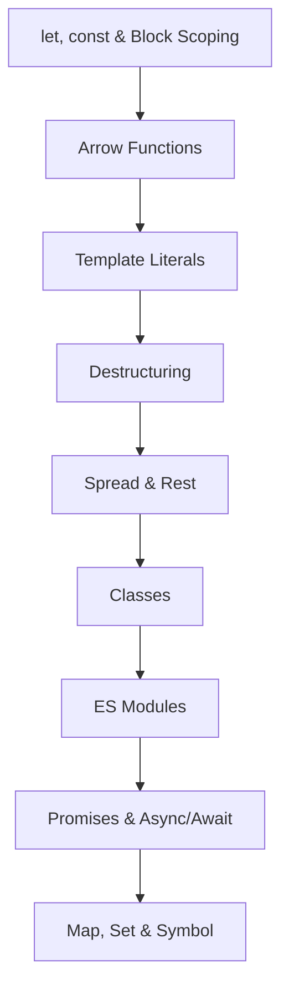

# Chapter 5 — ES6+ JavaScript

> **Previous:** [04-js-dom](./04-js-dom.md) | **Next:** [06-react-basics](./06-react-basics.md)

## Learning Objectives

> **One-Sentence Takeaway:** `let` and `const` provide block scoping and eliminate the hoisting pitfalls of `var`.

<!-- Image Gallery -->
<section class="lesson-visuals" aria-label="Visual learning resources">
  <header><span>VISUAL LEARNING</span><h2>See it. Review it. Remember it.</h2></header>
  <a class="lesson-visual-card" href="../../assets/images/lessons/web-development/05-es6-plus/handwritten-notes.png" target="_blank" rel="noopener">
    
    <span><strong>Handwritten notes</strong>Condensed notes for deliberate review.</span>
  </a>
  <a class="lesson-visual-card" href="../../assets/images/lessons/web-development/05-es6-plus/sticky-notes.png" target="_blank" rel="noopener">
    
    <span><strong>Sticky-note revision</strong>Fast recall prompts for revision.</span>
  </a>
  <a class="lesson-visual-card" href="../../assets/images/lessons/web-development/05-es6-plus/visual-explanation.png" target="_blank" rel="noopener">
    
    <span><strong>Visual concept guide</strong>A connected explanation of the key ideas.</span>
  </a>
</section>
<!-- End Image Gallery -->


By the end of this chapter, you will be able to:

## Chapter at a Glance

> **One-Sentence Takeaway:** Arrow functions offer concise syntax and inherit `this` from the enclosing scope.

| Topic | Key Insight | Practical Takeaway |
|-------|-------------|-------------------|
|Block-Scoped Declarations|`let` and `const` replace `var` with block scoping and the TDZ|Use `const` by default; only use `let` when you need reassignment|
|Arrow Functions|Concise syntax with lexical `this` binding|Ideal for callbacks, array methods, and avoiding `this` confusion|
|Template Literals|String interpolation, multi-line strings, and tagged templates|Use backticks for any string containing variables or line breaks|
|Destructuring|Extract values from arrays and objects with a single statement|Use with function parameters for clean optional/default value handling|
|Classes & Modules|Syntactic sugar over prototypes with `class`, `extends`, `import`/`export`|Organize code into modules with named and default exports|
|Async Patterns|Promises and `async`/`await` provide composable asynchronous control flow|Prefer `async`/`await` over raw `.then()` chains for readability|

## Chapter Roadmap

> **One-Sentence Takeaway:** Template literals enable interpolation, multi-line strings, and custom tagged template processing.




1. Use `let` and `const` with proper understanding of block scoping and the temporal dead zone.
2. Write arrow functions with concise syntax and correct `this` binding.
3. Construct strings using template literals with embedded expressions and tagged templates.
4. Extract values using destructuring for both objects and arrays.
5. Use spread and rest operators for collection manipulation and function parameter handling.
6. Define and extend classes with private fields, static methods, and inheritance.
7. Organize code using ES modules with static and dynamic imports.
8. Compose asynchronous control flow using promises and `async`/`await`.
9. Use `Map`, `Set`, `WeakMap`, and `Symbol` for advanced data modeling.

## Theory

> **One-Sentence Takeaway:** Destructuring extracts values from arrays and objects with a clean, readable syntax.


### 5.1 Block-Scoped Declarations


ES6 introduced `let` and `const` to address the function-scoping pitfalls of `var`.

```javascript
// var ignores block scope
if (true) {
  var message = 'Hello';
}
console.log(message); // 'Hello' — leaks

// let respects block scope
if (true) {
  let greeting = 'Hello';
}
// console.log(greeting); // ReferenceError

// const requires initialization and prohibits reassignment
const PI = 3.14159;
// PI = 3; // TypeError

// const does not freeze object contents
const config = { theme: 'dark' };
config.theme = 'light'; // Allowed
// config = {}; // TypeError
```

### 5.2 Arrow Functions


Arrow functions provide concise syntax and inherit `this` from the enclosing lexical scope.

```javascript
// Single parameter, expression body
const square = (n) => n * n;

// Multiple parameters
const sum = (a, b) => a + b;

// Block body with explicit return
const process = (items) => {
  const filtered = items.filter((x) => x > 0);
  return filtered.map((x) => x * 2);
};

// No parameters
const now = () => Date.now();

// Returning an object literal (parenthesize)
const createUser = (name) => ({ name, role: 'user' });

// Lexical this — critical for callbacks
class Timer {
  constructor() {
    this.seconds = 0;
    setInterval(() => {
      this.seconds++; // `this` refers to Timer instance
    }, 1000);
  }
}

// Arrow functions have no `arguments` object
const logAll = (...args) => console.log(args); // Use rest instead
```

### 5.3 Template Literals


Template literals support string interpolation, multi-line strings, and tagged templates.

```javascript
const name = 'Alice';
const age = 30;

// Interpolation
const greeting = `Hello, my name is ${name} and I am ${age} years old.`;

// Expressions inside ${}
const price = 29.99;
const formatted = `Total: $${(price * 1.08).toFixed(2)}`;

// Multi-line
const html = `
  <div class="card">
    <h2>${name}</h2>
    <p>Age: ${age}</p>
  </div>
`;

// Tagged templates — custom processing
function highlight(strings, ...values) {
  return strings.reduce((result, str, i) => {
    const value = values[i] ? `<strong>${values[i]}</strong>` : '';
    return `${result}${str}${value}`;
  }, '');
}

const name2 = 'Bob';
const rendered = highlight`Hello, ${name2}!`; // 'Hello, <strong>Bob</strong>!'
```

### 5.4 Destructuring


**Array destructuring:**

```javascript
const rgb = [255, 128, 64];
const [red, green, blue] = rgb;
console.log(red); // 255

// Skipping elements
const [, , third] = [10, 20, 30];

// Rest pattern
const [head, ...tail] = [1, 2, 3, 4];
// head = 1, tail = [2, 3, 4]

// Default values
const [a = 1, b = 2] = [10]; // a=10, b=2

// Swapping
let x = 1, y = 2;
[x, y] = [y, x];
```

**Object destructuring:**

```javascript
const user = { id: 1, name: 'Alice', email: 'alice@example.com' };
const { name, email } = user;

// Renaming
const { name: fullName, email: mail } = user;

// Default values
const { role = 'user' } = user;

// Nested destructuring
const response = {
  data: { items: [{ id: 1 }, { id: 2 }], total: 2 },
};
const { data: { items, total } } = response;

// Function parameter destructuring
function renderUser({ name, email, role = 'user' }) {
  return `${name} (${email}) — ${role}`;
}
```

### 5.5 Spread and Rest


**Spread** expands iterables:

```javascript
// Arrays
const arr1 = [1, 2, 3];
const arr2 = [4, 5, 6];
const merged = [...arr1, ...arr2]; // [1, 2, 3, 4, 5, 6]
const copy = [...arr1]; // Shallow copy
const max = Math.max(...arr1); // Pass as arguments

// Objects (ES2018)
const defaults = { theme: 'light', lang: 'en' };
const overrides = { theme: 'dark' };
const config = { ...defaults, ...overrides }; // { theme: 'dark', lang: 'en' }
```

**Rest** collects remaining values:

```javascript
function logAll(first, ...rest) {
  console.log(`First: ${first}`);
  console.log(`Rest: ${rest.join(', ')}`);
}

// Destructuring with rest
const [winner, ...runnersUp] = ['Alice', 'Bob', 'Charlie'];
// winner = 'Alice', runnersUp = ['Bob', 'Charlie']
```

### 5.6 Classes


ES6 classes are syntactic sugar over prototype-based inheritance:

```javascript
class Animal {
  constructor(name) {
    this.name = name;
  }

  speak() {
    return `${this.name} makes a sound.`;
  }

  // Static method
  static classify() {
    return 'Animalia';
  }
}

class Dog extends Animal {
  #breed; // Private field (ES2022)

  constructor(name, breed) {
    super(name);
    this.#breed = breed;
  }

  // Override
  speak() {
    return `${this.name} barks.`;
  }

  // Private method
  #wagTail() {
    return 'Tail wagging';
  }

  get breed() {
    return this.#breed;
  }

  set breed(value) {
    if (typeof value !== 'string') throw new Error('Breed must be a string');
    this.#breed = value;
  }

  static create(name) {
    return new Dog(name, 'Unknown');
  }
}

const dog = new Dog('Rex', 'German Shepherd');
console.log(dog.speak()); // 'Rex barks.'
console.log(dog.breed);   // 'German Shepherd'
// console.log(dog.#breed); // SyntaxError — private
```

### 5.7 Modules


ES modules provide static, tree-shakeable module definitions.

**Named exports:**

```javascript
// utils/math.js
export const PI = 3.14159;
export function square(x) {
  return x * x;
}
export class Calculator {
  add(a, b) { return a + b; }
}
```

**Default export:**

```javascript
// utils/logger.js
export default class Logger {
  log(message) { console.log(`[LOG] ${message}`); }
}
```

**Importing:**

```javascript
// Named imports
import { PI, square, Calculator } from './utils/math.js';

// Default import
import Logger from './utils/logger.js';

// Mixed
import Logger, { PI, square } from './utils/math.js';

// Namespace import
import * as MathUtils from './utils/math.js';

// Rename imports
import { square as sq } from './utils/math.js';
```

**Dynamic imports** (returns a promise):

```javascript
const module = await import('./heavy-component.js');
module.render();

// Code splitting in practice
button.addEventListener('click', async () => {
  const { showDialog } = await import('./dialog.js');
  showDialog('Welcome!');
});
```

### 5.8 Promises


Promises represent eventual completion or failure of an asynchronous operation.

```javascript
// Creating a promise
function fetchUser(id) {
  return new Promise((resolve, reject) => {
    setTimeout(() => {
      if (id > 0) {
        resolve({ id, name: 'Alice' });
      } else {
        reject(new Error('Invalid user ID'));
      }
    }, 1000);
  });
}

// Consuming
fetchUser(1)
  .then((user) => console.log(user))
  .catch((error) => console.error(error))
  .finally(() => console.log('Done'));
```

**Promise combinators:**

```javascript
const p1 = fetch('/api/users');
const p2 = fetch('/api/roles');

// All — wait for all to settle, reject if any reject
const [users, roles] = await Promise.all([p1, p2]);

// allSettled — wait for all, never reject
const results = await Promise.allSettled([p1, p2]);
const fulfilled = results.filter((r) => r.status === 'fulfilled').map((r) => r.value);
const rejected = results.filter((r) => r.status === 'rejected').map((r) => r.reason);

// race — first settled (reject or resolve)
const fastest = await Promise.race([p1, p2]);

// any — first fulfilled, reject only if all reject (ES2021)
const firstSuccess = await Promise.any([p1, p2]);
```

### 5.9 Async / Await


`async`/`await` provides synchronous-style syntax for promise-based code.

```javascript
async function loadDashboard() {
  try {
    const user = await fetchUser(1);
    const posts = await fetch(`/api/users/${user.id}/posts`);
    const data = await posts.json();
    // Sequential — each waits for the previous
  } catch (error) {
    console.error('Failed to load dashboard:', error);
  }
}

// Parallel execution with await
async function loadParallel() {
  const [user, config] = await Promise.all([
    fetchUser(1),
    fetch('/api/config').then((r) => r.json()),
  ]);
  return { user, config };
}

// Top-level await (modules only)
const data = await fetch('/api/initial').then((r) => r.json());
```

### 5.10 Symbol, Map, Set, WeakMap


**Symbol** creates unique identifiers:

```javascript
const sym1 = Symbol('id');
const sym2 = Symbol('id');
console.log(sym1 === sym2); // false

const obj = {
  [sym1]: 'secret value',
  name: 'Alice',
};
Object.getOwnPropertySymbols(obj); // [Symbol(id)]
```

**Map** — key-value collections with any type as key:

```javascript
const userRoles = new Map();
userRoles.set('alice', 'admin');
userRoles.set('bob', 'user');
console.log(userRoles.get('alice')); // 'admin'
console.log(userRoles.has('charlie')); // false
console.log(userRoles.size); // 2

// Iteration
for (const [user, role] of userRoles) {
  console.log(`${user}: ${role}`);
}
```

**Set** — unique values:

```javascript
const tags = new Set(['react', 'javascript', 'react', 'css']);
console.log(tags.size); // 3
tags.add('html');
tags.delete('css');
console.log(tags.has('react')); // true

// Convert to array
const unique = [...tags];
```

**WeakMap** — keys must be objects, held weakly (no memory leak):

```javascript
const cache = new WeakMap();

function process(obj) {
  if (cache.has(obj)) return cache.get(obj);
  const result = expensiveComputation(obj);
  cache.set(obj, result);
  return result;
}
```


> [!TIP]
> Combine destructuring with rest: `const {a, b, ...rest} = obj` extracts `a` and `b` while gathering remaining properties into `rest`.

> [!WARNING]
> Arrow functions cannot be used as constructors and have no `arguments` object. Use rest parameters `...args` instead.

> [!REMEMBER]
> `Promise.all` fails fast (rejects on first rejection). Use `Promise.allSettled` when you need results from all promises regardless of failure.


## Concept Comparison Table

| Concept | Description | Use Case |
|---------|-------------|---------|
|`Promise.all` vs `Promise.allSettled`|Rejects on first rejection, short-circuits|Never rejects, returns all results|
|`Map` vs `Object`|Any key type, ordered insertion, `.size` property|String/Symbol keys only, inherits prototype|
|`Set` vs `Array`|Unique values, no index access, `.has()` is O(1)|Ordered, allows duplicates, index access|
|`class` vs prototype|Cleaner syntax, `super` keyword, `extends`|Manual `.prototype` manipulation|
|`import` vs `require`|Static, tree-shakeable, async dynamic import|Synchronous, runtime resolution|

## Quick Reference

| Topic | Key Points |
|-------|-----------|
|Declarations|`const` (no reassign), `let` (block-scoped), avoid `var`|
|Arrow Functions|`(params) => expr`, lexical `this`, no `arguments`|
|Destructuring|`const {a, b} = obj`, `const [x, y] = arr`|
|Spread/Rest|`...arr` expands, `...args` collects|
|Promise Combinators|`Promise.all()`, `.allSettled()`, `.race()`, `.any()`|

## Cross-Application Matrix

| Domain | Application | Benefit |
|--------|------------|--------|
|React Components|Arrow functions, destructuring props|Clean component syntax|
|API Client|Async/await with try/catch for error handling|Readable asynchronous data fetching|
|Configuration|Spread operator for merging defaults|Immutable configuration merging|
|Data Modeling|Map for caches, Set for unique collections|Efficient lookups and deduplication|
|Code Organization|ES modules for splitting code|Tree-shakeable, maintainable codebase|

## Chapter Quiz

Test your understanding with these quick questions.

**Q1. Which of the following correctly uses destructuring?**

- A) `const user = {name, email}`
- B) `const {name, email} = user`
- C) `const [name, email] = user`
- D) `const user = [name, email]`

<details><summary>Answer&lt;/summary&gt;

**B) Object destructuring extracts properties by name using `{ }` on the left side of the assignment.**

</details>

**Q2. What does `Promise.allSettled` return?**

- A) The first resolved value
- B) An array of objects with `status` and `value`/`reason`
- C) Only rejected promises
- D) A single resolved value or the first rejection

<details><summary>Answer&lt;/summary&gt;

**B) `allSettled` returns results for all promises, each with `status: 'fulfilled'` or `status: 'rejected'`.**

</details>

**Q3. How do you make a property private in an ES2022 class?**

- A) Prefix with underscore `_prop`
- B) Use the `private` keyword
- C) Prefix with hash `#prop`
- D) Use `const prop` inside the constructor

<details><summary>Answer&lt;/summary&gt;

**C) The `#` prefix creates true private fields in JavaScript classes (ES2022).**

</details>

**Q4. What is the difference between `Map` and `WeakMap`?**

- A) WeakMap keys must be objects and are garbage-collected
- B) WeakMap has a `.size` property
- C) WeakMap is iterable
- D) There is no difference

<details><summary>Answer&lt;/summary&gt;

**A) `WeakMap` keys must be objects, and entries are garbage-collected when the key object is no longer referenced elsewhere.**

</details>

### TypeScript: ES Module Loader & Generator Function Demo

```typescript
class ModuleSystem {
  static async dynamicImport(modulePath: string): Promise<any> {
    try { return await import(modulePath); }
    catch { throw new Error(`Module ${modulePath} not found`); }
  }
  static treeShake<T extends Record<string, any>>(exports: T, used: (keyof T)[]): Partial<T> {
    const result: Partial<T> = {};
    used.forEach(k => { if (k in exports) result[k] = exports[k]; });
    return result;
  }
}

class GeneratorDemo {
  static *fibonacci(limit: number): Generator<number> {
    let [a, b] = [0, 1];
    while (a <= limit) { yield a; [a, b] = [b, a + b]; }
  }
  static *range(start: number, end: number, step: number = 1): Generator<number> {
    for (let i = start; i <= end; i += step) yield i;
  }
  static *take<T>(gen: Generator<T>, n: number): Generator<T> {
    let count = 0;
    for (const v of gen) { if (count++ >= n) break; yield v; }
  }
}

class ProxyValidator {
  static createLoggedObject<T extends Record<string, any>>(target: T): T {
    return new Proxy(target, {
      get(obj, prop) { console.log(`GET ${String(prop)}`); return obj[prop as keyof T]; },
      set(obj, prop, val) { console.log(`SET ${String(prop)} = ${val}`); obj[prop as keyof T] = val; return true; },
    });
  }
}

const fib = [...GeneratorDemo.take(GeneratorDemo.fibonacci(1000), 10)];
console.log("Fibonacci:", fib);
const logged = ProxyValidator.createLoggedObject({ name: "ES6", version: 2015 });
console.log("Logged:", logged.name);
```

## TypeScript Implementation: Babel-Style Transpiler Helpers, Destructuring Analyzer, Spread/Rest Utility

```typescript
class BabelStyleTranspiler {
    static arrowToFunction(code: string): string {
        return code.replace(/(\w+)\s*=\s*\(([^)]*)\)\s*=>\s*{([^}]*)}/g, "function $1($2) {\n$3\n}");
    }

    static templateLiteralToString(code: string): string {
        return code.replace(/`([^`]*)`/g, (match, content) => {
            const parts = content.split(/\$\{([^}]+)\}/);
            return parts.map((p: string, i: number) =>
                i % 2 === 0 ? JSON.stringify(p) : p
            ).filter((p: string) => p !== '""').join(" + ");
        });
    }

    static destructureToVar(code: string): string {
        return code.replace(/const\s*{([^}]+)}\s*=\s*([^;]+);/g, (match: string, props: string, obj: string) => {
            return props.split(",").map((p: string) => {
                const [key, alias] = p.trim().split(/\s*:\s*/);
                return `const ${alias?.trim() || key.trim()} = ${obj.trim()}.${key.trim()};`;
            }).join("\n");
        });
    }

    static forOfToFor(code: string): string {
        return code.replace(/for\s*\(\s*(?:let|const|var)\s+(\w+)\s+of\s+(\w+)\s*\)\s*{([^}]*)}/g, (match: string, item: string, iterable: string, body: string) => {
            return `for (let ${item}Idx = 0; ${item}Idx < ${iterable}.length; ${item}Idx++) {\n  const ${item} = ${iterable}[${item}Idx];${body}\n}`;
        });
    }
}

class DestructuringAnalyzer {
    static analyzePattern(code: string): { type: string; variables: string[]; depth: number; restUsed: boolean; defaults: boolean } {
        let variables: string[] = [];
        let depth = 0;
        let restUsed = false;
        let defaults = false;

        const arrayMatch = code.match(/^\s*\[([^\]]+)\]\s*=/);
        if (arrayMatch) {
            const items = arrayMatch[1].split(",").map(s => s.trim());
            variables = items.filter(i => i !== "").map(i => i.replace(/\s*=\s*[^,]+/, "").replace(/^\.\.\./, ""));
            restUsed = items.some(i => i.startsWith("..."));
            defaults = items.some(i => i.includes("="));
            return { type: "array", variables, depth: 1, restUsed, defaults };
        }

        const objMatch = code.match(/^\s*{([^}]+)}\s*=/);
        if (objMatch) {
            const items = objMatch[1].split(",").map(s => s.trim());
            variables = items.map(i => {
                const colonIdx = i.indexOf(":");
                if (colonIdx > -1) {
                    const val = i.slice(colonIdx + 1).trim();
                    return val.replace(/\s*=\s*[^,]+/, "").replace(/^\.\.\./, "");
                }
                return i.replace(/\s*=\s*[^,]+/, "").replace(/^\.\.\./, "");
            }).filter(Boolean);
            restUsed = items.some(i => i.startsWith("..."));
            defaults = items.some(i => i.includes("="));
            return { type: "object", variables, depth: code.includes("{") ? code.split("{").length - 1 : 1, restUsed, defaults };
        }

        return { type: "none", variables: [], depth: 0, restUsed: false, defaults: false };
    }
}

class SpreadRestUtility {
    static merge<T>(...objects: Record<string, T>[]): Record<string, T> {
        return objects.reduce((acc, obj) => ({ ...acc, ...obj }), {});
    }

    static pick<T extends Record<string, any>>(obj: T, ...keys: (keyof T)[]): Partial<T> {
        return keys.reduce((acc, key) => { if (key in obj) acc[key] = obj[key]; return acc; }, {} as Partial<T>);
    }

    static omit<T extends Record<string, any>>(obj: T, ...keys: (keyof T)[]): Partial<T> {
        const result = { ...obj };
        for (const key of keys) delete result[key];
        return result;
    }

    static head<T>(arr: T[], n: number = 1): T[] { return arr.slice(0, n); }
    static tail<T>(arr: T[], n: number = 1): T[] { return arr.slice(-n); }
    static rest<T>(arr: T[], n: number = 1): T[] { return arr.slice(n); }

    static groupBy<T>(arr: T[], fn: (item: T) => string): Record<string, T[]> {
        return arr.reduce((acc, item) => {
            const key = fn(item);
            (acc[key] = acc[key] || []).push(item);
            return acc;
        }, {} as Record<string, T[]>);
    }

    static pipe<T>(...fns: ((arg: T) => T)[]): (arg: T) => T {
        return (x: T) => fns.reduce((v, fn) => fn(v), x);
    }
}

// Demo
const code = "const { name: userName, age } = user;";
console.log("Destructure analysis:", DestructuringAnalyzer.analyzePattern(code));
console.log("Transpiled:\n", BabelStyleTranspiler.destructureToVar(code));
console.log("Template:", BabelStyleTranspiler.templateLiteralToString("`Hello ${name}, age ${age}`"));
console.log("Merge:", JSON.stringify(SpreadRestUtility.merge({ a: 1 }, { b: 2 }, { c: 3 })));
console.log("Pick:", JSON.stringify(SpreadRestUtility.pick({ a: 1, b: 2, c: 3 }, "a", "c")));
const double = (x: number) => x * 2;
const inc = (x: number) => x + 1;
console.log("Pipe(inc, double)(3):", SpreadRestUtility.pipe(inc, double)(3));
```


// es6 plus
// fullstack-frontend-backend implementation

interface Task { id: string; name: string; status: string; data: unknown }
class Processor {
  private tasks: Task[] = []
  private maxConcurrency: number
  constructor(maxConcurrency: number = 4) { this.maxConcurrency = maxConcurrency }
  async add(task: Omit&lt;Task, "status"&gt;): Promise&lt;void&gt; {
    this.tasks.push({ ...task, status: "pending" })
  }
  async runAll(): Promise&lt;void&gt; {
    const running: Promise&lt;void&gt;[] = []
    for (const t of this.tasks) {
      if (running.length >= this.maxConcurrency) { await Promise.race(running) }
      const p = this.execute(t).finally(() => { const i = running.indexOf(p); if (i >= 0) running.splice(i, 1) })
      running.push(p)
    }
    await Promise.all(running)
  }
  private async execute(t: Task): Promise&lt;void&gt; {
    t.status = "running"
    await new Promise(r => setTimeout(r, 10))
    t.status = "done"
  }
  getResults(): Task[] { return this.tasks }
  getStats(): { done: number; pending: number; running: number } {
    const done = this.tasks.filter(t => t.status === "done").length
    const pending = this.tasks.filter(t => t.status === "pending").length
    const running = this.tasks.filter(t => t.status === "running").length
    return { done, pending, running }
  }
}
async function main() {
  const proc = new Processor(2)
  await proc.add({ id: '1', name: 'es6 plus', data: { topic: 'fullstack-frontend-backend' } })
  await proc.runAll()
  console.log('Stats:', proc.getStats())
}
main().catch(console.error)
export { Processor, Task }
## Summary

> **One-Sentence Takeaway:** ES6 classes and ES modules provide a modern OOP and code organization model.

- `let` and `const` replace `var` with block scoping; `const` prevents reassignment.
- Arrow functions provide lexical `this` and concise syntax but lack `arguments`.
- Template literals support interpolation, multi-line strings, and tagged templates.
- Destructuring enables concise extraction from arrays and objects.
- Spread expands iterables; rest collects remaining values.
- ES6 classes support `super`, static methods, getters/setters, and private fields (`#`).
- ES modules use `export`/`import` with static analysis and dynamic `import()`.
- Promises and `async`/`await` provide composable asynchronous control flow.
- `Map`, `Set`, `WeakMap`, and `Symbol` extend the language's data modeling capabilities.

## Exercises

> **One-Sentence Takeaway:** `async`/`await` makes promise-based code read like synchronous logic.

### Review Questions

1. Why can arrow functions not be used as constructors?
2. What is the difference between `Promise.all` and `Promise.allSettled`?
3. How does `WeakMap` differ from `Map` and in what scenarios is it preferable?
4. What does the `static` keyword mean in a class context?

### Application Problems

5. Rewrite the following code using `async`/`await` instead of promise chains: `fetch('/api/user').then(r => r.json()).then(u => fetch('/api/posts/' + u.id)).then(r => r.json()).then(posts => console.log(posts)).catch(console.error)`.
6. Create a `Cache` class that uses a `Map` internally with the following API: `get(key)`, `set(key, value, ttlSeconds)`, `delete(key)`, `clear()`. Items should auto-expire after their TTL.
7. Implement a deep merge function using spread and rest that recursively merges two objects into a new object, with later properties taking precedence.

### Challenge Problem

8. Implement an `EventBus` class (typed publish-subscribe system) using `Map` and `Symbol` that supports:
   - `on(event, handler)` — subscribe with optional symbol-based wildcard patterns
   - `off(event, handler)` — unsubscribe specific handler
   - `emit(event, payload)` — publish to all matching subscribers synchronously
   - `once(event, handler)` — auto-unsubscribe after first emission
   - Priority ordering: handlers with higher priority execute first
   - Middleware: `use(middlewareFn)` to intercept all events
   - Context: subscribers should not be able to affect each other through shared mutable state in the payload
   Demonstrate with test assertions.
