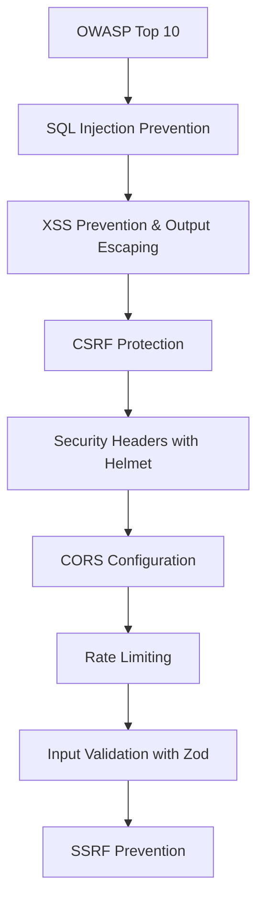

# Chapter 13: Web Security

> **Previous:** [12-deployment](./12-deployment.md) | **Next:** [14-typescript](./14-typescript.md)

## Learning Objectives

> **One-Sentence Takeaway:** Parameterized queries and ORMs prevent SQL injection by separating query structure from data.

By the end of this chapter, you will be able to:

## Chapter at a Glance

> **One-Sentence Takeaway:** XSS is prevented by escaping output — use `textContent`, React's auto-escaping, and DOMPurify for sanitized HTML.

| Topic | Key Insight | Practical Takeaway |
|-------|-------------|-------------------|
|OWASP Top 10|The 10 most critical web application security risks|Know all 10 — they form the baseline for any security review or penetration test|
|SQL Injection|Injecting SQL through unsanitized user input|Always use parameterized queries or ORMs — never concatenate user input into SQL strings|
|XSS|Injecting scripts through unsanitized user content|Use `textContent` instead of `innerHTML`, libraries auto-escape, sanitize with DOMPurify when needed|
|CSRF|Cross-site request forgery exploits authenticated sessions|Use SameSite cookies (Strict), CSRF tokens, and check Origin/Referer headers|
|Security Headers|CSP, HSTS, CORS, X-Frame-Options protect against various attacks|Use Helmet middleware to set security headers with sensible defaults|
|Rate Limiting|Prevents brute-force and denial-of-service attacks|Apply stricter limits on auth endpoints, use skipSuccessfulRequests for login rate limiting|
|Input Validation|Zod schemas validate data shape, type, and constraints at every boundary|Validate on the server even if you validate on the client — never trust the client|

## Chapter Roadmap

> **One-Sentence Takeaway:** CSRF protection uses SameSite cookies, CSRF tokens, and Origin/Referer header validation.




- Identify and prevent OWASP Top 10 vulnerabilities
- Protect against SQL injection, XSS, and CSRF attacks
- Implement proper CORS, CSP, and security headers
- Secure API endpoints with input validation and rate limiting
- Apply secure authentication and session management
- Implement defense-in-depth security strategies

## 13.1 OWASP Top 10 Overview

> **One-Sentence Takeaway:** Security headers (CSP, HSTS, X-Frame-Options) provide browser-level protection against common attacks.


The Open Web Application Security Project (OWASP) publishes the Top 10 most critical web application security risks:

1. Broken Access Control
2. Cryptographic Failures
3. Injection
4. Insecure Design
5. Security Misconfiguration
6. Vulnerable and Outdated Components
7. Identification and Authentication Failures
8. Software and Data Integrity Failures
9. Security Logging and Monitoring Failures
10. Server-Side Request Forgery (SSRF)

## 13.2 SQL Injection Prevention

> **One-Sentence Takeaway:** Rate limiting with tiers per endpoint prevents brute-force and abuse attacks.

```typescript
// VULNERABLE: String concatenation
const query = `SELECT * FROM users WHERE email = '${userInput}'`;

// SAFE: Parameterized query
const { rows } = await pool.query(
  "SELECT * FROM users WHERE email = $1",
  [userInput]
);

// SAFE: Prisma ORM (parameterizes by default)
const user = await prisma.user.findUnique({
  where: { email: userInput },
});

// SAFE: Zod input validation
const emailSchema = z.string().email();
const validatedEmail = emailSchema.parse(userInput);
```

## 13.3 Cross-Site Scripting (XSS) Prevention

> **One-Sentence Takeaway:** Input validation at every boundary ensures data integrity and prevents injection attacks.

```typescript
// VULNERABLE: Direct HTML insertion
element.innerHTML = userComment; // <script>alert('xss')</script>

// SAFE: Text content (auto-escaped)
element.textContent = userComment;

// SAFE: React auto-escapes by default
function Comment({ text }: { text: string }) {
  return <p>{text}</p>; // Safe - React escapes by default
}

// DANGEROUS: dangerouslySetInnerHTML (avoid unless sanitized)
function SafeComment({ html }: { html: string }) {
  const sanitized = DOMPurify.sanitize(html);
  return <div dangerouslySetInnerHTML={{ __html: sanitized }} />;
}

// Server-side: sanitize with DOMPurify
import createDOMPurify from "dompurify";
import { JSDOM } from "jsdom";
const window = new JSDOM("").window;
const purify = createDOMPurify(window as any);

const clean = purify.sanitize(userInput);
```

## 13.4 CSRF Protection

> **One-Sentence Takeaway:** SSRF prevention blocks requests to internal IP ranges and cloud metadata endpoints.

```typescript
import csrf from "csrf";

const tokens = new csrf();

// Generate token for forms
app.get("/api/form", (req, res) => {
  const secret = tokens.secretSync();
  req.session.csrfSecret = secret;
  const token = tokens.create(secret);
  res.json({ csrfToken: token });
});

// Validate token
app.post("/api/data", (req, res) => {
  const { _csrf } = req.body;
  if (!tokens.verify(req.session.csrfSecret, _csrf)) {
    return res.status(403).json({ message: "Invalid CSRF token" });
  }
  // Process request...
});

// For SPA: SameSite cookie attribute (modern browsers)
app.use(
  session({
    cookie: {
      sameSite: "strict", // Prevents CSRF for cross-site requests
      httpOnly: true,
      secure: true,
    },
  })
);
```

## 13.5 Security Headers with Helmet

```typescript
import helmet from "helmet";

app.use(
  helmet({
    contentSecurityPolicy: {
      directives: {
        defaultSrc: ["'self'"],
        scriptSrc: ["'self'", "https://trusted-cdn.com"],
        styleSrc: ["'self'", "'unsafe-inline'"],
        imgSrc: ["'self'", "https://images.example.com"],
        connectSrc: ["'self'", "https://api.example.com"],
        fontSrc: ["'self'", "https://fonts.googleapis.com"],
        objectSrc: ["'none'"],
        frameAncestors: ["'none'"],
      },
    },
    hsts: {
      maxAge: 31536000,
      includeSubDomains: true,
      preload: true,
    },
    referrerPolicy: { policy: "strict-origin-when-cross-origin" },
  })
);

// Resulting headers:
// Content-Security-Policy: default-src 'self'; script-src 'self' https://trusted-cdn.com
// Strict-Transport-Security: max-age=31536000; includeSubDomains; preload
// X-Content-Type-Options: nosniff
// X-Frame-Options: DENY
// Referrer-Policy: strict-origin-when-cross-origin
```

## 13.6 CORS Configuration

```typescript
import cors from "cors";

const allowedOrigins = [
  "https://example.com",
  "https://admin.example.com",
];

app.use(
  cors({
    origin: (origin, callback) => {
      if (!origin || allowedOrigins.includes(origin)) {
        callback(null, true);
      } else {
        callback(new Error("Not allowed by CORS"));
      }
    },
    methods: ["GET", "POST", "PUT", "DELETE", "PATCH"],
    allowedHeaders: ["Content-Type", "Authorization"],
    exposedHeaders: ["X-Total-Count"],
    credentials: true,
    maxAge: 86400, // Preflight cache for 24 hours
  })
);
```

## 13.7 Rate Limiting

```typescript
import rateLimit from "express-rate-limit";

// Global limiter
const globalLimiter = rateLimit({
  windowMs: 15 * 60 * 1000, // 15 minutes
  max: 100,
  standardHeaders: true,
  legacyHeaders: false,
  message: { error: "Too many requests, please try again later" },
});
app.use(globalLimiter);

// Auth endpoint - stricter limits
const authLimiter = rateLimit({
  windowMs: 15 * 60 * 1000,
  max: 5,
  skipSuccessfulRequests: true, // Only count failures
  message: { error: "Too many login attempts" },
});
app.use("/api/auth/login", authLimiter);

// API endpoint - per-user rate limiting
const apiLimiter = rateLimit({
  windowMs: 60 * 1000,
  max: 60,
  keyGenerator: (req) => req.ip,
  handler: (req, res) => {
    res.status(429).json({
      error: "Rate limit exceeded",
      retryAfter: Math.ceil(req.rateLimit.resetTime / 1000),
    });
  },
});
```

## 13.8 Input Validation

```typescript
import { z } from "zod";

const userSchema = z.object({
  email: z.string().email(),
  password: z
    .string()
    .min(8)
    .max(100)
    .regex(/[A-Z]/, "Must contain uppercase letter")
    .regex(/[a-z]/, "Must contain lowercase letter")
    .regex(/[0-9]/, "Must contain number"),
  name: z.string().min(1).max(100).trim(),
  age: z.number().int().positive().max(150).optional(),
  website: z.string().url().optional(),
  role: z.enum(["USER", "ADMIN"]).default("USER"),
});

// Sanitization helper
function sanitize(input: string): string {
  return input
    .replace(/<script\b[^<]*(?:(?!<\/script>)<[^<]*)*<\/script>/gi, "")
    .trim();
}
```

## 13.9 HTTPS and Secure Communication

Enforcing HTTPS ensures data encryption between client and server.

```typescript
import express from "express";
import fs from "fs";
import https from "https";
import helmet from "helmet";

const app = express();
app.use(helmet());

// Redirect HTTP to HTTPS in production
if (process.env.NODE_ENV === "production") {
  app.use((req, res, next) => {
    if (!req.secure && req.headers["x-forwarded-proto"] !== "https") {
      return res.redirect(301, `https://${req.headers.host}${req.url}`);
    }
    next();
  });
}

// HTTPS server (terminate TLS at your reverse proxy in production)
const options = {
  key: fs.readFileSync("/etc/ssl/private/key.pem"),
  cert: fs.readFileSync("/etc/ssl/certs/cert.pem"),
};

https.createServer(options, app).listen(443);
```

### Security Logging and Monitoring


```typescript
import pino from "pino";

const auditLogger = pino({
  name: "audit",
  level: "info",
  redact: ["req.headers.authorization", "req.body.password"],
});

// Audit log middleware for sensitive operations
function auditLog(action: string) {
  return (req: Request, res: Response, next: NextFunction) => {
    const originalJson = res.json.bind(res);
    res.json = function (body: any) {
      auditLogger.info({
        action,
        userId: (req as any).user?.id,
        ip: req.ip,
        userAgent: req.headers["user-agent"],
        timestamp: new Date().toISOString(),
        status: res.statusCode,
      });
      return originalJson(body);
    };
    next();
  };
}

// Usage on sensitive routes
router.delete("/api/users/:id", authenticate, auditLog("USER_DELETE"), deleteUser);
```

### Secure Session Configuration


```typescript
import session from "express-session";
import RedisStore from "connect-redis";
import { createClient } from "redis";

const redisClient = createClient({ url: process.env.REDIS_URL });
redisClient.connect().catch(console.error);

app.use(
  session({
    store: new RedisStore({ client: redisClient }),
    secret: process.env.SESSION_SECRET!,
    name: "__Secure-session", // __Secure- prefix requires HTTPS
    resave: false,
    saveUninitialized: false,
    cookie: {
      httpOnly: true,      // Prevents JavaScript access
      secure: true,        // HTTPS only
      sameSite: "strict",  // Prevents CSRF
      maxAge: 24 * 60 * 60 * 1000, // 24 hours
      path: "/",
    },
    rolling: true, // Reset expiry on each request
  })
);
```

### Dependency Security and Supply Chain


Vulnerable dependencies are a common attack vector (OWASP #6).

```bash
# Audit dependencies
npm audit          # Check known vulnerabilities
npm audit fix      # Auto-fix patch-level vulnerabilities
npm audit --audit-level=high  # Only report high/critical

# Check for malicious packages
npx npm audit --registry=https://registry.npmjs.org

# Lockfile integrity
# Use "integrity" field in package-lock.json to verify package contents
# CI should fail if lockfile changes unexpectedly
```

```yaml
# .github/workflows/dependency-security.yml
name: Dependency Security Check
on: [pull_request]
jobs:
  audit:
    runs-on: ubuntu-latest
    steps:
      - uses: actions/checkout@v4
      - run: npm audit --audit-level=high
      - run: npx socket-cli scan
```

```typescript
// Safe dependency patterns
// 1. Pin exact versions in production
// "express": "4.21.0" not "express": "^4.21.0"

// 2. Use lockfile
// Commit package-lock.json and verify CI uses npm ci

// 3. Minimize dependencies
import defaultImport from "lodash"; // BAD — imports entire library (500KB+)
import debounce from "lodash/debounce"; // GOOD — imports only what's needed

// 4. Validate package provenance with npm attestations
npm publish --provenance
```

### Environment-Specific Security


```typescript
// Security configuration per environment
interface SecurityConfig {
  corsOrigins: string[];
  rateLimits: { windowMs: number; max: number };
  cookieSecure: boolean;
  hstsMaxAge: number;
}

const securityConfigs: Record<string, SecurityConfig> = {
  development: {
    corsOrigins: ["http://localhost:3000"],
    rateLimits: { windowMs: 15 * 60 * 1000, max: 1000 },
    cookieSecure: false,
    hstsMaxAge: 0,
  },
  production: {
    corsOrigins: ["https://example.com", "https://admin.example.com"],
    rateLimits: { windowMs: 15 * 60 * 1000, max: 100 },
    cookieSecure: true,
    hstsMaxAge: 31536000,
  },
};

function getSecurityConfig(env: string): SecurityConfig {
  return securityConfigs[env] ?? securityConfigs.development;
}
```

## 13.10 Server-Side Request Forgery (SSRF) Prevention

```typescript
import { createHash } from "crypto";

// SSRF protection middleware
function preventSSRF(targetUrl: string): boolean {
  const parsed = new URL(targetUrl);

  // Block internal addresses
  const blockedHosts = [
    "localhost",
    "127.0.0.1",
    "0.0.0.0",
    "::1",
    "169.254.169.254", // AWS metadata
  ];

  if (blockedHosts.includes(parsed.hostname)) return false;
  if (parsed.hostname.startsWith("10.")) return false;
  if (parsed.hostname.startsWith("192.168.")) return false;
  if (parsed.hostname.startsWith("172.")) {
    const second = parseInt(parsed.hostname.split(".")[1]);
    if (second >= 16 && second <= 31) return false;
  }

  // Resolve and check IP
  // In practice, resolve DNS and check against private ranges
  return true;
}

// Safe fetch wrapper
async function safeFetch(url: string) {
  if (!preventSSRF(url)) {
    throw new Error("URL not allowed");
  }
  const response = await fetch(url, {
    headers: { "User-Agent": "TaskFlow-Secure/1.0" },
    signal: AbortSignal.timeout(5000),
  });
  return response;
}
```


> [!TIP]
> Run `npx zap-full-scan.py -t https://your-site.com` for an automated OWASP ZAP security scan that catches many common vulnerabilities before production.

> [!WARNING]
> Client-side validation is for UX only — it provides zero security. An attacker can bypass browser validation trivially. Always validate on the server.

> [!REMEMBER]
> Helmet is a security headers collection, not a comprehensive security solution. It sets 15+ HTTP headers with sensible defaults but does not prevent SQL injection, XSS from unsafe code, or authentication flaws.


## Concept Comparison Table

| Concept | Description | Use Case |
|---------|-------------|---------|
|XSS vs CSRF|Injects scripts via untrusted content|Tricks browser into making authenticated requests|
|`textContent` vs `innerHTML`|Safe — escapes HTML entities|Dangerous — interprets HTML including scripts|
|`helmet()` vs manual headers|15+ headers with sensible defaults|Manual control for specific header values|
|CORS `origin` vs `credentials`|Controls which origins can access|Controls whether cookies/auth headers are sent|
|Zod `parse()` vs `safeParse()`|Throws on validation failure|Returns result object, no throw|

## Quick Reference

| Topic | Key Points |
|-------|-----------|
|OWASP Top 10 (2021)|Broken Access Control, Crypto Failures, Injection, Insecure Design, Misconfig, Vulnerable Components, Auth Failures, Integrity Failures, Logging Failures, SSRF|
|Security Headers|`Content-Security-Policy`, `Strict-Transport-Security`, `X-Content-Type-Options`, `X-Frame-Options`, `Referrer-Policy`|
|CORS Headers|`Access-Control-Allow-Origin`, `-Methods`, `-Headers`, `-Credentials`, `-Max-Age`, `Expose-Headers`|
|Rate Limit Tiers|Global (100/15min), Auth (5/15min), API (60/min)|
|SSRF Blocklist|`localhost`, `127.0.0.1`, `169.254.169.254`, `10.x`, `192.168.x`, `172.16-31.x`|

## Cross-Application Matrix

| Domain | Application | Benefit |
|--------|------------|--------|
|E-commerce|CSP + Helmet + rate limiting on checkout|Prevents card scraping and brute force|
|Social Media|DOMPurify + CSP for user content|Safe rendering of user-generated HTML|
|Banking App|CSRF tokens + SameSite Strict + short sessions|Protection against forged transfers|
|Public API|Rate limiting + CORS + input validation|Abuse prevention and data integrity|
|Admin Dashboard|RBAC + IP allowlisting + audit logging|Access control and accountability|

## Chapter Quiz

Test your understanding with these quick questions.

**Q1. What is the only reliable defense against SQL injection?**

- A) Input sanitization
- B) Parameterized queries
- C) WAF (Web Application Firewall)
- D) Input length validation

<details><summary>Answer&lt;/summary&gt;

**B) Parameterized queries (prepared statements) separate SQL code from data, making injection impossible. All other approaches can be bypassed.**

</details>

**Q2. How does a Content Security Policy (CSP) prevent XSS?**

- A) It encrypts all page content
- B) It restricts which sources scripts, styles, and other resources can be loaded from
- C) It validates user input
- D) It escapes HTML output

<details><summary>Answer&lt;/summary&gt;

**B) CSP allows the server to specify which origins are trusted for loading scripts, styles, images, fonts, and other resources. The browser blocks any resource from untrusted origins.**

</details>

**Q3. What is the purpose of the `SameSite` cookie attribute?**

- A) To encrypt cookies
- B) To prevent cookies from being sent with cross-site requests
- C) To set cookie expiration
- D) To restrict cookies to HTTPS only

<details><summary>Answer&lt;/summary&gt;

**B) `SameSite=Strict` prevents the browser from sending the cookie with cross-site requests, which blocks CSRF attacks that trick users into submitting requests from another site.**

</details>

**Q4. Why should rate limiting be stricter on auth endpoints?**

- A) Auth endpoints are faster
- B) Login attempts are a common brute-force attack vector
- C) Auth endpoints use more CPU
- D) Users expect slower login

<details><summary>Answer&lt;/summary&gt;

**B) Login endpoints are targeted by brute-force and credential-stuffing attacks. Stricter rate limits (e.g., 5 attempts per 15 minutes) make these attacks impractical.**

</details>

### TypeScript: CSP Builder & Input Sanitizer

```typescript
class CSPBuilder {
  private directives: Record<string, string[]> = {};

  add(directive: string, ...sources: string[]): this {
    this.directives[directive] = sources;
    return this;
  }
  build(): string {
    return Object.entries(this.directives)
      .map(([k, v]) => `${k} ${v.join(" ")}`).join("; ");
  }
  static strict(): string {
    return new CSPBuilder()
      .add("default-src", "'self'")
      .add("script-src", "'self'", "'unsafe-inline'", "'strict-dynamic'")
      .add("style-src", "'self'", "'unsafe-inline'")
      .add("img-src", "'self'", "data:", "https:")
      .add("connect-src", "'self'")
      .add("font-src", "'self'")
      .add("frame-ancestors", "'none'")
      .build();
  }
}

class InputSanitizer {
  static escapeHTML(str: string): string {
    const map: Record<string, string> = { "&": "&amp;", "<": "&lt;", ">": "&gt;", '"': "&quot;", "'": "&#x27;" };
    return str.replace(/[&<>"']/g, c => map[c]);
  }
  static escapeShell(str: string): string {
    return str.replace(/[;&|`$(){}[\]!#~*?\\<>]/g, "");
  }
  static sanitizeSQL(str: string): string {
    return str.replace(/[';\\--]/g, "");
  }
}

class RateLimiter {
  private hits = new Map<string, number[]>();
  check(key: string, max: number, windowMs: number): boolean {
    const now = Date.now();
    const timestamps = (this.hits.get(key) || []).filter(t => now - t < windowMs);
    timestamps.push(now);
    this.hits.set(key, timestamps);
    return timestamps.length <= max;
  }
}

console.log("CSP:", CSPBuilder.strict());
console.log("Escaped:", InputSanitizer.escapeHTML("<script>alert('xss')</script>"));
```

## TypeScript Implementation: XSS Sanitizer, CSRF Token Generator, CSP Builder, SQL Injection Detector

```typescript
class XSSSanitizer {
    static escapeHTML(input: string): string {
        const map: Record<string, string> = {
            "&": "&amp;", "<": "&lt;", ">": "&gt;",
            '"': "&quot;", "'": "&#x27;", "/": "&#x2F;"
        };
        return input.replace(/[&<>"'/]/g, ch => map[ch] || ch);
    }

    static sanitizeUrl(url: string): string {
        const blocked = ["javascript:", "data:", "vbscript:", "file:"];
        const lower = url.toLowerCase().trim();
        if (blocked.some(b => lower.startsWith(b))) return "#blocked";
        return url;
    }

    static sanitizeHTML(input: string, allowedTags: string[] = ["b", "i", "em", "strong", "a", "code", "pre"]): string {
        const tagPattern = /<\/?([a-zA-Z0-9]+)([^>]*)>/g;
        return input.replace(tagPattern, (match, tag, attrs) => {
            if (!allowedTags.includes(tag.toLowerCase())) {
                return XSSSanitizer.escapeHTML(match);
            }
            if (tag.startsWith("/")) return `</${tag}>`;
            const safeAttrs = attrs.replace(/\s*on\w+\s*=\s*["'][^"']*["']/gi, "");
            const hrefMatch = safeAttrs.match(/\s*href\s*=\s*["']([^"']*)["']/i);
            if (hrefMatch) {
                const sanitizedHref = XSSSanitizer.sanitizeUrl(hrefMatch[1]);
                return `<${tag} href="${sanitizedHref}"${safeAttrs.replace(/href\s*=\s*["'][^"']*["']/i, "")}>`;
            }
            return `<${tag}${safeAttrs}>`;
        });
    }

    static stripTags(input: string): string {
        return input.replace(/<[^>]*>/g, "");
    }

    static detectXSS(input: string): { hasXSS: boolean; patterns: string[] } {
        const patterns = [
            /<script[^>]*>/i, /javascript\s*:/i, /on\w+\s*=/i,
            /<iframe[^>]*>/i, /<embed[^>]*>/i, /<object[^>]*>/i,
            /alert\s*\(/i, /eval\s*\(/i, /document\.cookie/i,
            /String\.fromCharCode/i, /<svg[^>]*>/i,
        ];
        const found = patterns.filter(p => p.test(input)).map(p => p.source);
        return { hasXSS: found.length > 0, patterns: found };
    }
}

class CSRFTokenGenerator {
    static generate(length: number = 32): string {
        const chars = "ABCDEFGHIJKLMNOPQRSTUVWXYZabcdefghijklmnopqrstuvwxyz0123456789";
        let token = "";
        for (let i = 0; i < length; i++) token += chars[Math.floor(Math.random() * chars.length)];
        return token;
    }

    static validate(token: string, storedToken: string): boolean {
        if (!token || !storedToken) return false;
        if (token.length !== storedToken.length) return false;
        let diff = 0;
        for (let i = 0; i < token.length; i++) diff |= token.charCodeAt(i) ^ storedToken.charCodeAt(i);
        return diff === 0;
    }

    static doubleSubmitCookie(token: string, cookieValue: string): boolean {
        return this.validate(token, cookieValue);
    }
}

class CSPBuilder {
    static strict(): string {
        return `default-src 'self'; script-src 'self'; style-src 'self' 'unsafe-inline'; img-src 'self' data:; font-src 'self'; connect-src 'self'; frame-ancestors 'none'; base-uri 'self'; form-action 'self'`;
    }

    static build(directives: Record<string, string[]>): string {
        return Object.entries(directives)
            .map(([key, values]) => `${key} ${values.join(" ")}`)
            .join("; ");
    }

    static reportOnly(directives: Record<string, string[]>, reportUri: string): string {
        const csp = this.build(directives);
        return `${csp}; report-uri ${reportUri}`;
    }
}

class SQLInjectionDetector {
    static detect(input: string): { hasInjection: boolean; risk: "none" | "low" | "medium" | "high"; patterns: string[] } {
        const patterns: { pattern: RegExp; risk: "low" | "medium" | "high" }[] = [
            { pattern: /('|--|;)/, risk: "low" },
            { pattern: /(OR|AND)\s+['"]?\w+['"]?\s*=\s*['"]?\w+['"]?/i, risk: "medium" },
            { pattern: /(OR|AND)\s+\d+\s*=\s*\d+/i, risk: "high" },
            { pattern: /UNION\s+(ALL\s+)?SELECT/i, risk: "high" },
            { pattern: /DROP\s+TABLE/i, risk: "high" },
            { pattern: /DELETE\s+FROM/i, risk: "high" },
            { pattern: /INSERT\s+INTO/i, risk: "high" },
            { pattern: /EXEC\s*\(/i, risk: "high" },
            { pattern: /xp_cmdshell/i, risk: "high" },
            { pattern: /LOAD_FILE\s*\(/i, risk: "high" },
            { pattern: /INFORMATION_SCHEMA/i, risk: "medium" },
            { pattern: /WAITFOR\s+DELAY/i, risk: "high" },
            { pattern: /BENCHMARK\s*\(/i, risk: "high" },
            { pattern: /SLEEP\s*\(/i, risk: "high" },
        ];

        const found: { pattern: RegExp; risk: "low" | "medium" | "high" }[] = [];
        for (const p of patterns) {
            if (p.pattern.test(input)) found.push(p);
        }

        const maxRisk = found.length === 0 ? "none" :
            found.some(f => f.risk === "high") ? "high" :
            found.some(f => f.risk === "medium") ? "medium" : "low";

        return {
            hasInjection: found.length > 0,
            risk: maxRisk as "none" | "low" | "medium" | "high",
            patterns: found.map(f => f.pattern.source)
        };
    }
}

// Demo
const malicious = "<script>alert('xss')</script>";
console.log("Escaped:", XSSSanitizer.escapeHTML(malicious));
console.log("Sanitized:", XSSSanitizer.sanitizeHTML(malicious));
console.log("XSS detect:", XSSSanitizer.detectXSS(malicious));

const token = CSRFTokenGenerator.generate();
console.log("CSRF token:", token);
console.log("CSRF validate:", CSRFTokenGenerator.validate(token, token));

console.log("CSP strict:", CSPBuilder.strict());
console.log("SQLi detect ' OR 1=1 --:", SQLInjectionDetector.detect("' OR 1=1 --"));
console.log("SQLi safe input:", SQLInjectionDetector.detect("hello world"));
```


// security
// fullstack-frontend-backend implementation

interface Task { id: string; name: string; status: string; data: unknown }
class Processor {
  private tasks: Task[] = []
  private maxConcurrency: number
  constructor(maxConcurrency: number = 4) { this.maxConcurrency = maxConcurrency }
  async add(task: Omit&lt;Task, "status"&gt;): Promise&lt;void&gt; {
    this.tasks.push({ ...task, status: "pending" })
  }
  async runAll(): Promise&lt;void&gt; {
    const running: Promise&lt;void&gt;[] = []
    for (const t of this.tasks) {
      if (running.length >= this.maxConcurrency) { await Promise.race(running) }
      const p = this.execute(t).finally(() => { const i = running.indexOf(p); if (i >= 0) running.splice(i, 1) })
      running.push(p)
    }
    await Promise.all(running)
  }
  private async execute(t: Task): Promise&lt;void&gt; {
    t.status = "running"
    await new Promise(r => setTimeout(r, 10))
    t.status = "done"
  }
  getResults(): Task[] { return this.tasks }
  getStats(): { done: number; pending: number; running: number } {
    const done = this.tasks.filter(t => t.status === "done").length
    const pending = this.tasks.filter(t => t.status === "pending").length
    const running = this.tasks.filter(t => t.status === "running").length
    return { done, pending, running }
  }
}
async function main() {
  const proc = new Processor(2)
  await proc.add({ id: '1', name: 'security', data: { topic: 'fullstack-frontend-backend' } })
  await proc.runAll()
  console.log('Stats:', proc.getStats())
}
main().catch(console.error)
export { Processor, Task }
## Summary

Web security requires defense in depth: parameterized queries prevent SQL injection, output escaping prevents XSS, CSRF tokens and SameSite cookies protect cross-site requests, CSP headers restrict resource origins, rate limiting prevents abuse, and input validation ensures data integrity at every layer.

## Exercises

### Review Questions

1. How does a Content Security Policy prevent XSS attacks?
2. Why is parameterized query the only reliable defense against SQL injection?
3. What is the difference between CSRF and XSS?

### Application Projects


1. Add CSRF protection to an existing REST API
2. Implement a Content Security Policy for a React SPA
3. Add rate limiting with different tiers for authenticated vs anonymous users

4. Implement an audit logging system that records all admin actions (user deletion, role changes, configuration updates) with IP, user agent, and timestamp.
5. Build a secure session configuration using Redis storage with httpOnly, secure, and sameSite flags properly configured.

6. Create an environment-specific security configuration that applies strict CSP headers, HSTS, and rate limits only in production, with relaxed settings for development.
7. Implement a dependency security audit pipeline that runs `npm audit` on every PR and blocks merging if any high-severity vulnerabilities are found without an approved exception.

### Challenge Project


Perform a security audit of a web application covering OWASP Top 10, using automated scanners (ZAP) and manual testing. Document findings, implement fixes, and verify with a second scan.

### Practical Takeaways


1. **Defense in depth** — never rely on a single security control. Combine CSP, CORS, rate limiting, input validation, and authentication together.
2. **Validate server-side always** — client validation is UX only. Every API endpoint must re-validate inputs regardless of frontend checks.
3. **Use Helmet for baseline security** — it sets 15+ security headers with sensible defaults in a single middleware call.
4. **Rate limit by endpoint sensitivity** — auth endpoints get strict limits (5/15min), public API gets moderate limits, internal endpoints get generous limits.
5. **Log security events** — failed logins, unauthorized access attempts, and permission denials must be logged with enough context for investigation.
