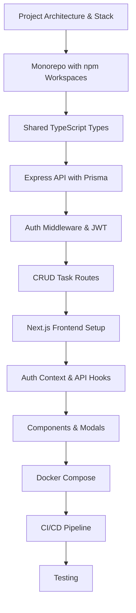

# Chapter 18: Building a Full-Stack Application

> **Previous:** [17-performance](./17-performance.md)

## Learning Objectives

> **One-Sentence Takeaway:** Monorepo with shared types package ensures type consistency across frontend and backend.

<!-- Image Gallery -->
<section class="lesson-visuals" aria-label="Visual learning resources">
  <header><span>VISUAL LEARNING</span><h2>See it. Review it. Remember it.</h2></header>
  <a class="lesson-visual-card" href="../../assets/images/lessons/web-development/18-fullstack-project/handwritten-notes.png" target="_blank" rel="noopener">
    
    <span><strong>Handwritten notes</strong>Condensed notes for deliberate review.</span>
  </a>
  <a class="lesson-visual-card" href="../../assets/images/lessons/web-development/18-fullstack-project/sticky-notes.png" target="_blank" rel="noopener">
    
    <span><strong>Sticky-note revision</strong>Fast recall prompts for revision.</span>
  </a>
  <a class="lesson-visual-card" href="../../assets/images/lessons/web-development/18-fullstack-project/visual-explanation.png" target="_blank" rel="noopener">
    
    <span><strong>Visual concept guide</strong>A connected explanation of the key ideas.</span>
  </a>
</section>
<!-- End Image Gallery -->


By the end of this chapter, you will be able to:

## Chapter at a Glance

> **One-Sentence Takeaway:** Express API with Prisma provides type-safe database access and RESTful CRUD endpoints.

| Topic | Key Insight | Practical Takeaway |
|-------|-------------|-------------------|
|Monorepo Setup|npm workspaces manage shared packages alongside frontend and backend apps|Use Turborepo for task orchestration — it caches build outputs and runs tasks in parallel|
|Shared Types|A packages/shared directory holds types consumed by both frontend and backend|Define all API contracts (request/response shapes) in the shared package to prevent drift|
|Express API|Full REST API with Prisma, JWT auth, Zod validation, and error handling|Structure routes by resource (auth, projects, tasks) with middleware for cross-cutting concerns|
|Next.js Frontend|App Router with auth context, API hooks, and component-based UI|Separate data fetching hooks from presentation components for testability|
|Auth Integration|JWT tokens managed via localStorage with automatic refresh on 401|Implement the AuthProvider at the app root, useApi hook for all authenticated requests|
|Testing|Integration tests for API, E2E tests for user flows|Test the complete user journey (register ? login ? create task) as a single E2E test|
|Docker & CI|Docker Compose for local dev, GitHub Actions for CI/CD|Use service containers in CI for PostgreSQL — no need for separate infrastructure|

## Chapter Roadmap

> **One-Sentence Takeaway:** JWT authentication with access and refresh tokens is implemented at the API gateway layer.




- Design and architect a full-stack web application from scratch
- Set up a monorepo with shared TypeScript types
- Build a RESTful API with Express and Prisma
- Create a React frontend with Next.js
- Implement authentication and authorization
- Deploy the complete application to production
- Apply testing and performance optimization strategies

## 18.1 Project Overview: TaskFlow

> **One-Sentence Takeaway:** Next.js frontend uses the App Router with client components for interactive task management.


Throughout this chapter, we will build **TaskFlow**, a full-stack task management application. TaskFlow allows users to create projects, add tasks, assign team members, set priorities, and track progress in real time.

### Architecture


TaskFlow follows a modern three-tier architecture:

- **Frontend**: Next.js 15 with App Router, React 19, TypeScript, Tailwind CSS
- **Backend**: Express.js REST API with TypeScript
- **Database**: PostgreSQL with Prisma ORM

The monorepo structure:

```
taskflow/
├── apps/
│   ├── web/          # Next.js frontend
│   └── api/          # Express backend
├── packages/
│   └── shared/       # Shared TypeScript types
├── docker-compose.yml
├── package.json
└── tsconfig.json
```

## 18.2 Setting Up the Monorepo

> **One-Sentence Takeaway:** Docker Compose manages local development infrastructure (PostgreSQL, Redis).

We use npm workspaces to manage the monorepo:

```json
{
  "name": "taskflow",
  "private": true,
  "workspaces": ["apps/*", "packages/*"],
  "scripts": {
    "dev": "concurrently \"npm run dev -w apps/api\" \"npm run dev -w apps/web\"",
    "build": "npm run build -w packages/shared && npm run build -w apps/api && npm run build -w apps/web",
    "lint": "turbo run lint",
    "test": "turbo run test"
  },
  "devDependencies": {
    "concurrently": "^9.0.0",
    "turbo": "^2.0.0",
    "typescript": "^5.5.0"
  }
}
```

### Shared TypeScript Configuration


Root `tsconfig.json` establishes base settings:

```json
{
  "compilerOptions": {
    "target": "ES2022",
    "module": "ESNext",
    "moduleResolution": "bundler",
    "strict": true,
    "esModuleInterop": true,
    "skipLibCheck": true,
    "forceConsistentCasingInFileNames": true,
    "declaration": true,
    "declarationMap": true,
    "sourceMap": true
  }
}
```

## 18.3 Shared Types Package

> **One-Sentence Takeaway:** CI/CD with GitHub Actions automates testing and deployment to production.

The `packages/shared` directory defines types used by both frontend and backend:

```typescript
// packages/shared/src/index.ts
export interface Project {
  id: string;
  name: string;
  description: string;
  createdAt: Date;
  updatedAt: Date;
  ownerId: string;
}

export interface Task {
  id: string;
  title: string;
  description?: string;
  status: TaskStatus;
  priority: Priority;
  dueDate?: Date;
  projectId: string;
  assigneeId?: string;
  createdAt: Date;
  updatedAt: Date;
}

export enum TaskStatus {
  Backlog = "BACKLOG",
  Todo = "TODO",
  InProgress = "IN_PROGRESS",
  Review = "REVIEW",
  Done = "DONE",
}

export enum Priority {
  Low = "LOW",
  Medium = "MEDIUM",
  High = "HIGH",
  Critical = "CRITICAL",
}

export interface CreateTaskInput {
  title: string;
  description?: string;
  priority?: Priority;
  dueDate?: string;
  projectId: string;
  assigneeId?: string;
}

export interface UpdateTaskInput {
  title?: string;
  description?: string;
  status?: TaskStatus;
  priority?: Priority;
  dueDate?: string;
  assigneeId?: string;
}

export interface ApiResponse<T> {
  data: T;
  message?: string;
}

export interface PaginatedResponse<T> {
  data: T[];
  total: number;
  page: number;
  pageSize: number;
  totalPages: number;
}

export interface User {
  id: string;
  email: string;
  name: string;
  avatar?: string;
}

export interface AuthTokens {
  accessToken: string;
  refreshToken: string;
}
```

## 18.4 Backend: Express API

### Project Setup


The API application uses Express with TypeScript, Prisma, and JWT authentication:

```json
{
  "name": "@taskflow/api",
  "dependencies": {
    "@prisma/client": "^6.0.0",
    "bcryptjs": "^2.4.3",
    "cors": "^2.8.5",
    "express": "^4.21.0",
    "express-rate-limit": "^7.4.0",
    "helmet": "^8.0.0",
    "jsonwebtoken": "^9.0.0",
    "zod": "^3.23.0"
  },
  "devDependencies": {
    "@types/bcryptjs": "^2.4.6",
    "@types/cors": "^2.8.17",
    "@types/express": "^5.0.0",
    "@types/jsonwebtoken": "^9.0.7",
    "prisma": "^6.0.0",
    "tsx": "^4.19.0"
  }
}
```

### Prisma Schema


```prisma
datasource db {
  provider = "postgresql"
  url      = env("DATABASE_URL")
}

generator client {
  provider = "prisma-client-js"
}

model User {
  id           String   @id @default(cuid())
  email        String   @unique
  passwordHash String
  name         String
  avatar       String?
  createdAt    DateTime @default(now())
  updatedAt    DateTime @updatedAt

  projects Project[]
  tasks    Task[]
}

model Project {
  id          String   @id @default(cuid())
  name        String
  description String
  createdAt   DateTime @default(now())
  updatedAt   DateTime @updatedAt

  owner   User   @relation(fields: [ownerId], references: [id])
  ownerId String
  tasks   Task[]
}

model Task {
  id          String   @id @default(cuid())
  title       String
  description String?
  status      String   @default("BACKLOG")
  priority    String   @default("MEDIUM")
  dueDate     DateTime?
  createdAt   DateTime @default(now())
  updatedAt   DateTime @updatedAt

  project   Project @relation(fields: [projectId], references: [id])
  projectId String
  assignee  User?   @relation(fields: [assigneeId], references: [id])
  assigneeId String?
}
```

### Express Application Entry Point


```typescript
// apps/api/src/index.ts
import express from "express";
import cors from "cors";
import helmet from "helmet";
import rateLimit from "express-rate-limit";
import { authRouter } from "./routes/auth";
import { projectRouter } from "./routes/projects";
import { taskRouter } from "./routes/tasks";
import { errorHandler } from "./middleware/errorHandler";
import { authenticate } from "./middleware/auth";

const app = express();
const PORT = process.env.PORT ?? 4000;

app.use(helmet());
app.use(cors({ origin: process.env.FRONTEND_URL ?? "http://localhost:3000" }));
app.use(express.json());

const limiter = rateLimit({
  windowMs: 15 * 60 * 1000,
  max: 100,
  standardHeaders: true,
  legacyHeaders: false,
});
app.use(limiter);

app.use("/api/auth", authRouter);
app.use("/api/projects", authenticate, projectRouter);
app.use("/api/tasks", authenticate, taskRouter);

app.use(errorHandler);

app.listen(PORT, () => {
  console.log(`TaskFlow API running on port ${PORT}`);
});
```

### Authentication Route


```typescript
// apps/api/src/routes/auth.ts
import { Router } from "express";
import bcrypt from "bcryptjs";
import jwt from "jsonwebtoken";
import { z } from "zod";
import { PrismaClient } from "@prisma/client";

const router = Router();
const prisma = new PrismaClient();

const registerSchema = z.object({
  email: z.string().email(),
  password: z.string().min(8),
  name: z.string().min(1),
});

const loginSchema = z.object({
  email: z.string().email(),
  password: z.string(),
});

router.post("/register", async (req, res, next) => {
  try {
    const { email, password, name } = registerSchema.parse(req.body);
    const existing = await prisma.user.findUnique({ where: { email } });
    if (existing) {
      return res.status(409).json({ message: "Email already registered" });
    }
    const passwordHash = await bcrypt.hash(password, 12);
    const user = await prisma.user.create({
      data: { email, passwordHash, name },
    });
    const accessToken = jwt.sign(
      { userId: user.id },
      process.env.JWT_SECRET!,
      { expiresIn: "15m" }
    );
    const refreshToken = jwt.sign(
      { userId: user.id },
      process.env.JWT_REFRESH_SECRET!,
      { expiresIn: "7d" }
    );
    res.status(201).json({
      data: { user: { id: user.id, email: user.email, name: user.name } },
      tokens: { accessToken, refreshToken },
    });
  } catch (err) {
    next(err);
  }
});

router.post("/login", async (req, res, next) => {
  try {
    const { email, password } = loginSchema.parse(req.body);
    const user = await prisma.user.findUnique({ where: { email } });
    if (!user) {
      return res.status(401).json({ message: "Invalid credentials" });
    }
    const valid = await bcrypt.compare(password, user.passwordHash);
    if (!valid) {
      return res.status(401).json({ message: "Invalid credentials" });
    }
    const accessToken = jwt.sign(
      { userId: user.id },
      process.env.JWT_SECRET!,
      { expiresIn: "15m" }
    );
    const refreshToken = jwt.sign(
      { userId: user.id },
      process.env.JWT_REFRESH_SECRET!,
      { expiresIn: "7d" }
    );
    res.json({
      data: { user: { id: user.id, email: user.email, name: user.name } },
      tokens: { accessToken, refreshToken },
    });
  } catch (err) {
    next(err);
  }
});

router.post("/refresh", async (req, res, next) => {
  try {
    const { refreshToken } = req.body;
    const payload = jwt.verify(
      refreshToken,
      process.env.JWT_REFRESH_SECRET!
    ) as { userId: string };
    const user = await prisma.user.findUnique({
      where: { id: payload.userId },
    });
    if (!user) {
      return res.status(401).json({ message: "Invalid refresh token" });
    }
    const newAccessToken = jwt.sign(
      { userId: user.id },
      process.env.JWT_SECRET!,
      { expiresIn: "15m" }
    );
    res.json({ data: { accessToken: newAccessToken } });
  } catch (err) {
    next(err);
  }
});

export { router as authRouter };
```

### Auth Middleware


```typescript
// apps/api/src/middleware/auth.ts
import { Request, Response, NextFunction } from "express";
import jwt from "jsonwebtoken";

export interface AuthenticatedRequest extends Request {
  userId?: string;
}

export function authenticate(
  req: AuthenticatedRequest,
  res: Response,
  next: NextFunction
) {
  const header = req.headers.authorization;
  if (!header?.startsWith("Bearer ")) {
    return res.status(401).json({ message: "Missing authorization header" });
  }
  const token = header.slice(7);
  try {
    const payload = jwt.verify(token, process.env.JWT_SECRET!) as {
      userId: string;
    };
    req.userId = payload.userId;
    next();
  } catch {
    res.status(401).json({ message: "Invalid or expired token" });
  }
}
```

### Tasks Route with Full CRUD


```typescript
// apps/api/src/routes/tasks.ts
import { Router } from "express";
import { z } from "zod";
import { PrismaClient } from "@prisma/client";
import { AuthenticatedRequest } from "../middleware/auth";

const router = Router();
const prisma = new PrismaClient();

const createTaskSchema = z.object({
  title: z.string().min(1).max(200),
  description: z.string().max(2000).optional(),
  priority: z.enum(["LOW", "MEDIUM", "HIGH", "CRITICAL"]).optional(),
  dueDate: z.string().datetime().optional(),
  projectId: z.string(),
  assigneeId: z.string().optional(),
});

const updateTaskSchema = z.object({
  title: z.string().min(1).max(200).optional(),
  description: z.string().max(2000).optional(),
  status: z
    .enum(["BACKLOG", "TODO", "IN_PROGRESS", "REVIEW", "DONE"])
    .optional(),
  priority: z.enum(["LOW", "MEDIUM", "HIGH", "CRITICAL"]).optional(),
  dueDate: z.string().datetime().optional(),
  assigneeId: z.string().nullable().optional(),
});

// GET /api/tasks?projectId=xxx&status=TODO&page=1&pageSize=20
router.get("/", async (req: AuthenticatedRequest, res, next) => {
  try {
    const page = parseInt(req.query.page as string) || 1;
    const pageSize = parseInt(req.query.pageSize as string) || 20;
    const skip = (page - 1) * pageSize;

    const where: any = {
      project: { ownerId: req.userId },
    };
    if (req.query.projectId) where.projectId = req.query.projectId;
    if (req.query.status) where.status = req.query.status;
    if (req.query.priority) where.priority = req.query.priority;

    const [tasks, total] = await Promise.all([
      prisma.task.findMany({
        where,
        include: { assignee: { select: { id: true, name: true, email: true } } },
        skip,
        take: pageSize,
        orderBy: { createdAt: "desc" },
      }),
      prisma.task.count({ where }),
    ]);

    res.json({
      data: tasks,
      total,
      page,
      pageSize,
      totalPages: Math.ceil(total / pageSize),
    });
  } catch (err) {
    next(err);
  }
});

// GET /api/tasks/:id
router.get("/:id", async (req: AuthenticatedRequest, res, next) => {
  try {
    const task = await prisma.task.findFirst({
      where: {
        id: req.params.id,
        project: { ownerId: req.userId },
      },
      include: { assignee: { select: { id: true, name: true, email: true } } },
    });
    if (!task) {
      return res.status(404).json({ message: "Task not found" });
    }
    res.json({ data: task });
  } catch (err) {
    next(err);
  }
});

// POST /api/tasks
router.post("/", async (req: AuthenticatedRequest, res, next) => {
  try {
    const input = createTaskSchema.parse(req.body);
    const project = await prisma.project.findFirst({
      where: { id: input.projectId, ownerId: req.userId },
    });
    if (!project) {
      return res.status(404).json({ message: "Project not found" });
    }
    const task = await prisma.task.create({
      data: {
        title: input.title,
        description: input.description,
        priority: input.priority ?? "MEDIUM",
        dueDate: input.dueDate ? new Date(input.dueDate) : undefined,
        projectId: input.projectId,
        assigneeId: input.assigneeId,
      },
      include: { assignee: { select: { id: true, name: true, email: true } } },
    });
    res.status(201).json({ data: task });
  } catch (err) {
    next(err);
  }
});

// PUT /api/tasks/:id
router.put("/:id", async (req: AuthenticatedRequest, res, next) => {
  try {
    const input = updateTaskSchema.parse(req.body);
    const existing = await prisma.task.findFirst({
      where: { id: req.params.id, project: { ownerId: req.userId } },
    });
    if (!existing) {
      return res.status(404).json({ message: "Task not found" });
    }
    const task = await prisma.task.update({
      where: { id: req.params.id },
      data: {
        ...input,
        dueDate: input.dueDate ? new Date(input.dueDate) : undefined,
      },
      include: { assignee: { select: { id: true, name: true, email: true } } },
    });
    res.json({ data: task });
  } catch (err) {
    next(err);
  }
});

// DELETE /api/tasks/:id
router.delete("/:id", async (req: AuthenticatedRequest, res, next) => {
  try {
    const existing = await prisma.task.findFirst({
      where: { id: req.params.id, project: { ownerId: req.userId } },
    });
    if (!existing) {
      return res.status(404).json({ message: "Task not found" });
    }
    await prisma.task.delete({ where: { id: req.params.id } });
    res.status(204).send();
  } catch (err) {
    next(err);
  }
});

export { router as taskRouter };
```

### Global Error Handler


```typescript
// apps/api/src/middleware/errorHandler.ts
import { Request, Response, NextFunction } from "express";
import { ZodError } from "zod";

export function errorHandler(
  err: Error,
  _req: Request,
  res: Response,
  _next: NextFunction
) {
  if (err instanceof ZodError) {
    return res.status(400).json({
      message: "Validation error",
      errors: err.errors.map((e) => ({
        field: e.path.join("."),
        message: e.message,
      })),
    });
  }
  console.error("Unhandled error:", err);
  res.status(500).json({ message: "Internal server error" });
}
```

## 18.5 Frontend: Next.js Application

### Project Setup


```json
{
  "name": "@taskflow/web",
  "dependencies": {
    "next": "^15.0.0",
    "react": "^19.0.0",
    "react-dom": "^19.0.0",
    "@taskflow/shared": "*",
    "lucide-react": "^0.450.0",
    "tailwindcss": "^4.0.0"
  }
}
```

### Authentication Context


```typescript
// apps/web/src/lib/AuthContext.tsx
"use client";
import {
  createContext,
  useContext,
  useState,
  useEffect,
  ReactNode,
} from "react";

interface AuthUser {
  id: string;
  email: string;
  name: string;
}

interface AuthContextType {
  user: AuthUser | null;
  login: (email: string, password: string) => Promise<void>;
  register: (email: string, password: string, name: string) => Promise<void>;
  logout: () => void;
  isLoading: boolean;
}

const AuthContext = createContext<AuthContextType | null>(null);

const API_URL = process.env.NEXT_PUBLIC_API_URL ?? "http://localhost:4000";

export function AuthProvider({ children }: { children: ReactNode }) {
  const [user, setUser] = useState<AuthUser | null>(null);
  const [isLoading, setIsLoading] = useState(true);

  useEffect(() => {
    const token = localStorage.getItem("accessToken");
    if (token) {
      try {
        const payload = JSON.parse(atob(token.split(".")[1]));
        setUser({ id: payload.userId, email: "", name: "" });
      } catch {
        localStorage.removeItem("accessToken");
      }
    }
    setIsLoading(false);
  }, []);

  const login = async (email: string, password: string) => {
    const res = await fetch(`${API_URL}/api/auth/login`, {
      method: "POST",
      headers: { "Content-Type": "application/json" },
      body: JSON.stringify({ email, password }),
    });
    if (!res.ok) {
      const err = await res.json();
      throw new Error(err.message);
    }
    const json = await res.json();
    localStorage.setItem("accessToken", json.tokens.accessToken);
    localStorage.setItem("refreshToken", json.tokens.refreshToken);
    setUser(json.data.user);
  };

  const register = async (email: string, password: string, name: string) => {
    const res = await fetch(`${API_URL}/api/auth/register`, {
      method: "POST",
      headers: { "Content-Type": "application/json" },
      body: JSON.stringify({ email, password, name }),
    });
    if (!res.ok) {
      const err = await res.json();
      throw new Error(err.message);
    }
    const json = await res.json();
    localStorage.setItem("accessToken", json.tokens.accessToken);
    localStorage.setItem("refreshToken", json.tokens.refreshToken);
    setUser(json.data.user);
  };

  const logout = () => {
    localStorage.removeItem("accessToken");
    localStorage.removeItem("refreshToken");
    setUser(null);
  };

  return (
    <AuthContext.Provider value={{ user, login, register, logout, isLoading }}>
      {children}
    </AuthContext.Provider>
  );
}

export function useAuth() {
  const ctx = useContext(AuthContext);
  if (!ctx) throw new Error("useAuth must be used within AuthProvider");
  return ctx;
}
```

### Custom Hook for API Calls


```typescript
// apps/web/src/lib/useApi.ts
import { useState, useCallback } from "react";

async function refreshAccessToken(): Promise<string | null> {
  const refreshToken = localStorage.getItem("refreshToken");
  if (!refreshToken) return null;
  try {
    const res = await fetch(
      `${process.env.NEXT_PUBLIC_API_URL}/api/auth/refresh`,
      {
        method: "POST",
        headers: { "Content-Type": "application/json" },
        body: JSON.stringify({ refreshToken }),
      }
    );
    if (!res.ok) return null;
    const json = await res.json();
    localStorage.setItem("accessToken", json.data.accessToken);
    return json.data.accessToken;
  } catch {
    return null;
  }
}

export function useApi() {
  const [isLoading, setIsLoading] = useState(false);
  const [error, setError] = useState<string | null>(null);

  const fetchApi = useCallback(
    async <T>(
      path: string,
      options: RequestInit = {}
    ): Promise<T | null> => {
      setIsLoading(true);
      setError(null);
      const token = localStorage.getItem("accessToken");
      try {
        let res = await fetch(
          `${process.env.NEXT_PUBLIC_API_URL}${path}`,
          {
            ...options,
            headers: {
              "Content-Type": "application/json",
              ...(token ? { Authorization: `Bearer ${token}` } : {}),
              ...options.headers,
            },
          }
        );
        if (res.status === 401) {
          const newToken = await refreshAccessToken();
          if (newToken) {
            res = await fetch(
              `${process.env.NEXT_PUBLIC_API_URL}${path}`,
              {
                ...options,
                headers: {
                  "Content-Type": "application/json",
                  Authorization: `Bearer ${newToken}`,
                  ...options.headers,
                },
              }
            );
          } else {
            localStorage.removeItem("accessToken");
            localStorage.removeItem("refreshToken");
            window.location.href = "/login";
            return null;
          }
        }
        if (!res.ok) {
          const err = await res.json();
          throw new Error(err.message ?? "API request failed");
        }
        if (res.status === 204) return null;
        return await res.json();
      } catch (err) {
        const message =
          err instanceof Error ? err.message : "An error occurred";
        setError(message);
        return null;
      } finally {
        setIsLoading(false);
      }
    },
    []
  );

  return { fetchApi, isLoading, error };
}
```

### Main Task Board Page


```typescript
// apps/web/src/app/dashboard/page.tsx
"use client";
import { useEffect, useState } from "react";
import { useApi } from "@/lib/useApi";
import { TaskCard } from "@/components/TaskCard";
import { CreateTaskModal } from "@/components/CreateTaskModal";
import { Plus } from "lucide-react";

interface Task {
  id: string;
  title: string;
  status: string;
  priority: string;
  dueDate?: string;
  assignee?: { id: string; name: string; email: string };
}

const COLUMNS = [
  { key: "BACKLOG", label: "Backlog" },
  { key: "TODO", label: "To Do" },
  { key: "IN_PROGRESS", label: "In Progress" },
  { key: "REVIEW", label: "Review" },
  { key: "DONE", label: "Done" },
];

export default function DashboardPage() {
  const { fetchApi } = useApi();
  const [tasks, setTasks] = useState<Task[]>([]);
  const [showCreateModal, setShowCreateModal] = useState(false);

  useEffect(() => {
    fetchApi<{ data: Task[] }>("/api/tasks?pageSize=100").then((res) => {
      if (res) setTasks(res.data);
    });
  }, [fetchApi]);

  const grouped = COLUMNS.map((col) => ({
    ...col,
    tasks: tasks.filter((t) => t.status === col.key),
  }));

  return (
    <div className="p-6">
      <div className="flex justify-between items-center mb-6">
        <h1 className="text-2xl font-bold">Task Board</h1>
        <button
          onClick={() => setShowCreateModal(true)}
          className="flex items-center gap-2 bg-blue-600 text-white px-4 py-2 rounded-lg hover:bg-blue-700 transition"
        >
          <Plus size={20} />
          Add Task
        </button>
      </div>

      <div className="flex gap-4 overflow-x-auto pb-4">
        {grouped.map((column) => (
          <div
            key={column.key}
            className="flex-shrink-0 w-72 bg-gray-50 rounded-lg p-4"
          >
            <h2 className="font-semibold text-gray-700 mb-3">
              {column.label}
              <span className="ml-2 text-sm text-gray-400">
                ({column.tasks.length})
              </span>
            </h2>
            <div className="space-y-3">
              {column.tasks.map((task) => (
                <TaskCard key={task.id} task={task} />
              ))}
            </div>
          </div>
        ))}
      </div>

      {showCreateModal && (
        <CreateTaskModal
          onClose={() => setShowCreateModal(false)}
          onCreated={(task) => {
            setTasks((prev) => [...prev, task]);
            setShowCreateModal(false);
          }}
        />
      )}
    </div>
  );
}
```

### Task Card Component


```typescript
// apps/web/src/components/TaskCard.tsx
import { Calendar, User } from "lucide-react";

interface TaskCardProps {
  task: {
    id: string;
    title: string;
    priority: string;
    dueDate?: string;
    assignee?: { name: string; email: string };
  };
}

const priorityColors: Record<string, string> = {
  LOW: "bg-gray-100 text-gray-600",
  MEDIUM: "bg-blue-100 text-blue-600",
  HIGH: "bg-orange-100 text-orange-600",
  CRITICAL: "bg-red-100 text-red-600",
};

export function TaskCard({ task }: TaskCardProps) {
  return (
    <div className="bg-white rounded-lg shadow-sm border border-gray-200 p-4 hover:shadow-md transition cursor-pointer">
      <div className="flex items-start justify-between mb-2">
        <h3 className="font-medium text-gray-900">{task.title}</h3>
        <span
          className={`text-xs px-2 py-1 rounded-full font-medium ${priorityColors[task.priority]}`}
        >
          {task.priority}
        </span>
      </div>
      <div className="flex items-center gap-4 text-sm text-gray-500">
        {task.dueDate && (
          <span className="flex items-center gap-1">
            <Calendar size={14} />
            {new Date(task.dueDate).toLocaleDateString()}
          </span>
        )}
        {task.assignee && (
          <span className="flex items-center gap-1">
            <User size={14} />
            {task.assignee.name}
          </span>
        )}
      </div>
    </div>
  );
}
```

### Create Task Modal


```typescript
// apps/web/src/components/CreateTaskModal.tsx
import { useState } from "react";
import { useApi } from "@/lib/useApi";
import { X } from "lucide-react";

interface CreateTaskModalProps {
  onClose: () => void;
  onCreated: (task: any) => void;
}

const PRIORITIES = ["LOW", "MEDIUM", "HIGH", "CRITICAL"];
const PROJECT_ID = "default";

export function CreateTaskModal({ onClose, onCreated }: CreateTaskModalProps) {
  const { fetchApi, isLoading } = useApi();
  const [title, setTitle] = useState("");
  const [description, setDescription] = useState("");
  const [priority, setPriority] = useState("MEDIUM");
  const [dueDate, setDueDate] = useState("");

  const handleSubmit = async (e: React.FormEvent) => {
    e.preventDefault();
    const result = await fetchApi<{ data: any }>("/api/tasks", {
      method: "POST",
      body: JSON.stringify({
        title,
        description,
        priority,
        dueDate: dueDate ? new Date(dueDate).toISOString() : undefined,
        projectId: PROJECT_ID,
      }),
    });
    if (result) onCreated(result.data);
  };

  return (
    <div className="fixed inset-0 bg-black/50 flex items-center justify-center z-50">
      <div className="bg-white rounded-xl shadow-xl p-6 w-full max-w-md">
        <div className="flex justify-between items-center mb-4">
          <h2 className="text-lg font-semibold">Create Task</h2>
          <button onClick={onClose} className="text-gray-400 hover:text-gray-600">
            <X size={20} />
          </button>
        </div>

        <form onSubmit={handleSubmit} className="space-y-4">
          <div>
            <label className="block text-sm font-medium text-gray-700 mb-1">Title</label>
            <input
              type="text"
              value={title}
              onChange={(e) => setTitle(e.target.value)}
              className="w-full border border-gray-300 rounded-lg px-3 py-2 focus:ring-2 focus:ring-blue-500 focus:border-transparent outline-none"
              required
            />
          </div>

          <div>
            <label className="block text-sm font-medium text-gray-700 mb-1">Description</label>
            <textarea
              value={description}
              onChange={(e) => setDescription(e.target.value)}
              rows={3}
              className="w-full border border-gray-300 rounded-lg px-3 py-2 focus:ring-2 focus:ring-blue-500 focus:border-transparent outline-none"
            />
          </div>

          <div className="flex gap-4">
            <div className="flex-1">
              <label className="block text-sm font-medium text-gray-700 mb-1">Priority</label>
              <select
                value={priority}
                onChange={(e) => setPriority(e.target.value)}
                className="w-full border border-gray-300 rounded-lg px-3 py-2 focus:ring-2 focus:ring-blue-500 focus:border-transparent outline-none"
              >
                {PRIORITIES.map((p) => (
                  <option key={p} value={p}>{p}</option>
                ))}
              </select>
            </div>
            <div className="flex-1">
              <label className="block text-sm font-medium text-gray-700 mb-1">Due Date</label>
              <input
                type="date"
                value={dueDate}
                onChange={(e) => setDueDate(e.target.value)}
                className="w-full border border-gray-300 rounded-lg px-3 py-2 focus:ring-2 focus:ring-blue-500 focus:border-transparent outline-none"
              />
            </div>
          </div>

          <div className="flex justify-end gap-3 pt-2">
            <button type="button" onClick={onClose} className="px-4 py-2 text-gray-700 hover:bg-gray-100 rounded-lg transition">Cancel</button>
            <button type="submit" disabled={isLoading} className="px-4 py-2 bg-blue-600 text-white rounded-lg hover:bg-blue-700 disabled:opacity-50 transition">
              {isLoading ? "Creating..." : "Create Task"}
            </button>
          </div>
        </form>
      </div>
    </div>
  );
}
```

## 18.6 Database Setup with Docker Compose

```yaml
version: "3.8"
services:
  postgres:
    image: postgres:16-alpine
    environment:
      POSTGRES_USER: taskflow
      POSTGRES_PASSWORD: taskflow_secret
      POSTGRES_DB: taskflow_dev
    ports:
      - "5432:5432"
    volumes:
      - pgdata:/var/lib/postgresql/data

  redis:
    image: redis:7-alpine
    ports:
      - "6379:6379"

volumes:
  pgdata:
```

## 18.7 Deployment

### Dockerfile for API


```dockerfile
FROM node:22-alpine AS builder
WORKDIR /app
COPY package.json .
RUN npm ci
COPY . .
RUN npm run build -w packages/shared && npm run build -w apps/api

FROM node:22-alpine
WORKDIR /app
COPY --from=builder /app/apps/api/dist ./dist
COPY --from=builder /app/node_modules ./node_modules
COPY --from=builder /app/apps/api/package.json .
EXPOSE 4000
CMD ["node", "dist/index.js"]
```

### CI/CD with GitHub Actions


```yaml
name: Deploy TaskFlow

on:
  push:
    branches: [main]

jobs:
  test:
    runs-on: ubuntu-latest
    services:
      postgres:
        image: postgres:16-alpine
        env:
          POSTGRES_PASSWORD: test
        options: >-
          --health-cmd pg_isready
          --health-interval 10s
          --health-timeout 5s
          --health-retries 5
    steps:
      - uses: actions/checkout@v4
      - uses: actions/setup-node@v4
        with:
          node-version: 22
      - run: npm ci
      - run: npm run build
      - run: npm test

  deploy:
    needs: test
    runs-on: ubuntu-latest
    steps:
      - uses: actions/checkout@v4
      - name: Deploy to Railway
        run: npx railway up --service taskflow-api
        env:
          RAILWAY_TOKEN: ${{ secrets.RAILWAY_TOKEN }}
```

## 18.8 Testing the Full Stack

### API Integration Test


```typescript
// apps/api/src/__tests__/tasks.test.ts
import { describe, it, expect, beforeAll } from "vitest";
import { PrismaClient } from "@prisma/client";

const prisma = new PrismaClient();
const API = "http://localhost:4000";

let token: string;
let projectId: string;
let taskId: string;

describe("Tasks API", () => {
  beforeAll(async () => {
    const res = await fetch(`${API}/api/auth/register`, {
      method: "POST",
      headers: { "Content-Type": "application/json" },
      body: JSON.stringify({
        email: "test@example.com",
        password: "password123",
        name: "Test User",
      }),
    });
    const json = await res.json();
    token = json.tokens.accessToken;

    const projectRes = await fetch(`${API}/api/projects`, {
      method: "POST",
      headers: {
        "Content-Type": "application/json",
        Authorization: `Bearer ${token}`,
      },
      body: JSON.stringify({ name: "Test Project", description: "A test project" }),
    });
    const projectJson = await projectRes.json();
    projectId = projectJson.data.id;
  });

  it("creates a task", async () => {
    const res = await fetch(`${API}/api/tasks`, {
      method: "POST",
      headers: { "Content-Type": "application/json", Authorization: `Bearer ${token}` },
      body: JSON.stringify({ title: "Write tests", priority: "HIGH", projectId }),
    });
    expect(res.status).toBe(201);
    const json = await res.json();
    expect(json.data.title).toBe("Write tests");
    expect(json.data.priority).toBe("HIGH");
    taskId = json.data.id;
  });

  it("lists tasks for a project", async () => {
    const res = await fetch(`${API}/api/tasks?projectId=${projectId}`, {
      headers: { Authorization: `Bearer ${token}` },
    });
    expect(res.status).toBe(200);
    const json = await res.json();
    expect(json.data.length).toBeGreaterThan(0);
    expect(json.total).toBeGreaterThan(0);
  });

  it("updates a task status", async () => {
    const res = await fetch(`${API}/api/tasks/${taskId}`, {
      method: "PUT",
      headers: { "Content-Type": "application/json", Authorization: `Bearer ${token}` },
      body: JSON.stringify({ status: "IN_PROGRESS" }),
    });
    expect(res.status).toBe(200);
    const json = await res.json();
    expect(json.data.status).toBe("IN_PROGRESS");
  });

  it("deletes a task", async () => {
    const res = await fetch(`${API}/api/tasks/${taskId}`, {
      method: "DELETE",
      headers: { Authorization: `Bearer ${token}` },
    });
    expect(res.status).toBe(204);
  });

  afterAll(async () => {
    await prisma.task.deleteMany();
    await prisma.project.deleteMany();
    await prisma.user.deleteMany();
    await prisma.$disconnect();
  });
});
```

### End-to-End Test with Playwright


```typescript
// apps/web/e2e/auth.spec.ts
import { test, expect } from "@playwright/test";

test("user can register, login, and create a task", async ({ page }) => {
  const testEmail = `test-${Date.now()}@example.com`;

  await page.goto("/register");
  await expect(page.locator("h1")).toContainText("Create Account");

  await page.fill('input[name="name"]', "Test User");
  await page.fill('input[name="email"]', testEmail);
  await page.fill('input[name="password"]', "password123");
  await page.click('button[type="submit"]');

  await expect(page).toHaveURL(/\/dashboard/);
  await expect(page.locator("h1")).toContainText("Task Board");

  await page.click('text=Add Task');
  await page.fill('input[type="text"]', "My first task");
  await page.click('text=Create Task');

  await expect(page.locator("text=My first task")).toBeVisible();
});
```

## 18.9 Performance Optimization

```typescript
// apps/api/src/middleware/cache.ts
import { Request, Response, NextFunction } from "express";
import { createClient } from "redis";

const redis = createClient({ url: process.env.REDIS_URL ?? "redis://localhost:6379" });
await redis.connect();

export function cache(durationSeconds: number) {
  return async (req: Request, res: Response, next: NextFunction) => {
    if (req.method !== "GET") return next();
    const key = `cache:${req.originalUrl}`;
    const cached = await redis.get(key);
    if (cached) {
      return res.json(JSON.parse(cached));
    }
    const originalJson = res.json.bind(res);
    res.json = (body: any) => {
      redis.setEx(key, durationSeconds, JSON.stringify(body));
      return originalJson(body);
    };
    next();
  };
}
```


> [!TIP]
> Use `concurrently` in the root package.json to start both frontend and backend with a single `npm run dev` command — it significantly improves developer experience.

> [!WARNING]
> The GitHub Actions service container for PostgreSQL uses a test password. Never use the CI test database credentials in production — always rotate secrets between environments.

> [!REMEMBER]
> This full-stack project ties together every chapter in the course. If something feels unclear, revisit the specific chapter — REST APIs (ch9), Auth (ch10), Databases (ch11), Deployment (ch12), Security (ch13), TypeScript (ch14), Next.js (ch15), Testing (ch16), and Performance (ch17).


## Concept Comparison Table

| Concept | Description | Use Case |
|---------|-------------|---------|
|Monorepo vs Multi-repo|Shared types, single CI, atomic commits|Independent deploy cycles, separate issues|
|npm Workspaces vs Turborepo|Workspace resolution, hoisting|Task orchestration, caching, parallel execution|
|API with Prisma vs without|Type-safe queries, auto-migrations, relation handling|Manual SQL, raw queries|
|Next.js vs SPA|SSR, ISR, file-based routing, image optimization|Client-only rendering, requires separate backend|
|Docker Compose vs cloud DB|Local dev, reproducible setup|Managed, scalable, production-ready|

## Quick Reference

| Topic | Key Points |
|-------|-----------|
|Project Structure|`apps/web`, `apps/api`, `packages/shared`, root `package.json` with workspaces|
|Stack|Next.js 15 + React 19 + TypeScript + Express + Prisma + PostgreSQL + Redis|
|Key Dependencies|`lucide-react` (icons), `tailwindcss` (styling), `bcryptjs` (hashing), `jsonwebtoken` (JWT), `zod` (validation), `helmet` (security), `cors` (CORS)|
|Auth Flow|Register/Login ? JWT (15min) + Refresh Token (7d) ? 401 triggers refresh ? auto-retry|
|CI Pipeline|quality (type-check + lint + build) ? test (with postgres service) ? deploy (Railway)|

## Cross-Application Matrix

| Domain | Application | Benefit |
|--------|------------|--------|
|TaskFlow (this project)|Full-stack task manager with projects and teams|Complete reference implementation|
|E-commerce Platform|Same stack but with products, cart, orders, payments|Proven architecture scales to any domain|
|SaaS App|Multi-tenant with organization-based data isolation|Add orgId to every query, nested layouts per org|
|Content Platform|ISR for public pages, SSR for authenticated creator dashboard|Performance + personalization|
|Social Network|Real-time features with WebSockets or SSE|Extend with push notifications and live feeds|

## Chapter Quiz

Test your understanding with these quick questions.

**Q1. What is the advantage of a monorepo for full-stack development?**

- A) It is simpler than multi-repo
- B) Shared types between frontend and backend prevent API contract drift
- C) It reduces server costs
- D) It eliminates the need for TypeScript

<details><summary>Answer&lt;/summary&gt;

**B) A monorepo with a shared types package ensures that the frontend and backend always agree on data shapes. Changing an API response type in the shared package immediately surfaces type errors in both codebases.**

</details>

**Q2. How does the `useApi` hook handle expired access tokens?**

- A) It logs the user out immediately
- B) It catches the 401, attempts a token refresh using the refresh token, and retries the original request
- C) It re-fetches from the server
- D) It throws an error for the component to handle

<details><summary>Answer&lt;/summary&gt;

**B) When the API returns 401, `useApi` calls the refresh endpoint with the stored refresh token. If successful, it retries the original request with the new access token. If refresh also fails, the user is redirected to login.**

</details>

**Q3. What is the purpose of the `AuthenticatedRequest` interface?**

- A) To define the request body schema
- B) To extend Express Request with the `userId` property added by the auth middleware
- C) To validate authentication headers
- D) To type the API response

<details><summary>Answer&lt;/summary&gt;

**B) The `AuthenticatedRequest` interface extends Express `Request` with an optional `userId` property. The `authenticate` middleware sets this property after verifying the JWT, and route handlers access it to scope queries to the authenticated user.**

</details>

**Q4. Which Docker service does the TaskFlow application depend on for local development?**

- A) MySQL
- B) MongoDB
- C) PostgreSQL and Redis
- D) SQLite

<details><summary>Answer&lt;/summary&gt;

**C) The `docker-compose.yml` defines PostgreSQL (main database) and Redis (caching) services. The Express API connects to both for data persistence and caching.**

</details>

## TypeScript Implementation: Full-Stack Project Scaffolding, API Route Tree, Error Boundary Generator

```typescript
interface ProjectScaffoldConfig {
    name: string;
    withAuth: boolean;
    withDb: boolean;
    withTests: boolean;
    withDocker: boolean;
    frontend: "react" | "nextjs" | "none";
    backend: "express" | "hono" | "none";
    database: "postgres" | "sqlite" | "none";
}

class FullStackScaffolder {
    static generate(config: ProjectScaffoldConfig): Record<string, string> {
        const files: Record<string, string> = {};

        files["package.json"] = JSON.stringify({
            name: config.name, version: "1.0.0", private: true,
            scripts: {
                ...(config.frontend !== "none" ? { dev: "npm run dev --workspace=apps/web", build: "npm run build --workspace=apps/web" } : {}),
                ...(config.backend !== "none" ? { "dev:api": "npm run dev --workspace=apps/api" } : {}),
                test: "npm run test --workspaces"
            },
            workspaces: ["apps/*", "packages/*"]
        }, null, 2);

        if (config.withDocker) {
            files["docker-compose.yml"] = `version: "3.9"\nservices:\n  db:\n    image: ${config.database === "postgres" ? "postgres:16" : "postgres:16-alpine"}\n    environment:\n      POSTGRES_DB: ${config.name}\n      POSTGRES_PASSWORD: devpassword\n    ports:\n      - "5432:5432"\n  redis:\n    image: redis:7-alpine\n    ports:\n      - "6379:6379"`;
            files["Dockerfile"] = "FROM node:20-alpine\nWORKDIR /app\nCOPY package*.json ./\nRUN npm ci\nCOPY . .\nRUN npm run build\nEXPOSE 3000\nCMD [\"node\", \"dist/index.js\"]";
        }

        if (config.withTests) {
            files["vitest.config.ts"] = `import { defineConfig } from "vitest/config";\nexport default defineConfig({ test: { globals: true, environment: "node", coverage: { reporter: ["text", "json"] } } });`;
        }

        return files;
    }
}

class APIRouteTreeBuilder {
    static buildTree(routes: { method: string; path: string; handler: string }[]): Record<string, any> {
        const root: Record<string, any> = {};
        for (const route of routes) {
            const parts = route.path.split("/").filter(Boolean);
            let current = root;
            for (let i = 0; i < parts.length; i++) {
                const isParam = parts[i].startsWith(":");
                const key = isParam ? `{${parts[i].slice(1)}}` : parts[i];
                if (!current[key]) current[key] = {};
                if (i === parts.length - 1) {
                    current[key].$method = route.method.toUpperCase();
                    current[key].$handler = route.handler;
                }
                current = current[key];
            }
        }
        return root;
    }

    static generateRouterCode(tree: Record<string, any>, indent: string = ""): string {
        let code = "";
        for (const [key, value] of Object.entries(tree)) {
            if (key === "$method" || key === "$handler") continue;
            const isParam = key.startsWith("{") && key.endsWith("}");
            code += `${indent}// ${isParam ? `:${key.slice(1, -1)}` : `/${key}`}\n`;
            if (value.$method) code += `${indent}router.${value.$method.toLowerCase()}("${isParam ? ":" + key.slice(1, -1) : "/" + key}", ${value.$handler});\n`;
            code += this.generateRouterCode(value, indent + "  ");
        }
        return code;
    }
}

class ErrorBoundaryGenerator {
    static react(): string {
        return `import React, { Component, ErrorInfo, ReactNode } from "react";

interface Props { children: ReactNode; fallback?: ReactNode; onError?: (error: Error, info: ErrorInfo) => void; }
interface State { hasError: boolean; error: Error | null; }

class ErrorBoundary extends Component<Props, State> {
  state: State = { hasError: false, error: null };

  static getDerivedStateFromError(error: Error): State { return { hasError: true, error }; }

  componentDidCatch(error: Error, info: ErrorInfo) { this.props.onError?.(error, info); }

  render() {
    if (this.state.hasError) return this.props.fallback || <div><h2>Something went wrong</h2><p>{this.state.error?.message}</p></div>;
    return this.props.children;
  }
}

export default ErrorBoundary;`;
    }

    static api(): string {
        return `import { Request, Response, NextFunction } from "express";

export function errorHandler(err: Error, req: Request, res: Response, next: NextFunction) {
  console.error("Unhandled error:", err.message);
  res.status(500).json({ error: "Internal server error", message: process.env.NODE_ENV === "development" ? err.message : undefined });
}

export function asyncHandler(fn: (req: Request, res: Response, next: NextFunction) => Promise<any>) {
  return (req: Request, res: Response, next: NextFunction) => Promise.resolve(fn(req, res, next)).catch(next);
}`;
    }
}

// Demo
const scaffold = FullStackScaffolder.generate({ name: "my-app", withAuth: true, withDb: true, withTests: true, withDocker: true, frontend: "nextjs", backend: "express", database: "postgres" });
console.log("Scaffold files:", Object.keys(scaffold).join(", "));
const tree = APIRouteTreeBuilder.buildTree([
    { method: "GET", path: "/api/users", handler: "getUsers" },
    { method: "POST", path: "/api/users", handler: "createUser" },
    { method: "GET", path: "/api/users/:id", handler: "getUserById" },
    { method: "DELETE", path: "/api/users/:id", handler: "deleteUser" },
]);
console.log("Route tree:\n", APIRouteTreeBuilder.generateRouterCode(tree));
console.log("Error boundary:\n", ErrorBoundaryGenerator.react().slice(0, 200) + "...");
```


// fullstack project
// fullstack-frontend-backend implementation

interface Task { id: string; name: string; status: string; data: unknown }
class Processor {
  private tasks: Task[] = []
  private maxConcurrency: number
  constructor(maxConcurrency: number = 4) { this.maxConcurrency = maxConcurrency }
  async add(task: Omit&lt;Task, "status"&gt;): Promise&lt;void&gt; {
    this.tasks.push({ ...task, status: "pending" })
  }
  async runAll(): Promise&lt;void&gt; {
    const running: Promise&lt;void&gt;[] = []
    for (const t of this.tasks) {
      if (running.length >= this.maxConcurrency) { await Promise.race(running) }
      const p = this.execute(t).finally(() => { const i = running.indexOf(p); if (i >= 0) running.splice(i, 1) })
      running.push(p)
    }
    await Promise.all(running)
  }
  private async execute(t: Task): Promise&lt;void&gt; {
    t.status = "running"
    await new Promise(r => setTimeout(r, 10))
    t.status = "done"
  }
  getResults(): Task[] { return this.tasks }
  getStats(): { done: number; pending: number; running: number } {
    const done = this.tasks.filter(t => t.status === "done").length
    const pending = this.tasks.filter(t => t.status === "pending").length
    const running = this.tasks.filter(t => t.status === "running").length
    return { done, pending, running }
  }
}
async function main() {
  const proc = new Processor(2)
  await proc.add({ id: '1', name: 'fullstack project', data: { topic: 'fullstack-frontend-backend' } })
  await proc.runAll()
  console.log('Stats:', proc.getStats())
}
main().catch(console.error)
export { Processor, Task }
## Summary

Building a full-stack application requires integrating all the concepts from previous chapters into a cohesive system. In this chapter, we constructed TaskFlow, a complete task management application:

- **Monorepo structure** with shared types ensures type safety across the entire stack
- **Express API** with Prisma provides type-safe database access and RESTful endpoints
- **JWT authentication** with refresh tokens keeps the API secure
- **Next.js frontend** with the App Router delivers a modern, performant user experience
- **Docker Compose** simplifies local development with PostgreSQL and Redis
- **CI/CD pipeline** automates testing and deployment
- **Integration and E2E tests** verify the system works end-to-end
- **Redis caching** improves API response times for frequently accessed data

## Exercises

### Review Questions

1. What are the advantages of a monorepo structure for full-stack applications?
2. How does the shared types package prevent inconsistencies between frontend and backend?
3. Explain the token refresh flow implemented in the authentication system.

### Application Projects


1. **Add task drag-and-drop**: Implement drag-and-drop functionality to move tasks between status columns using the HTML Drag and Drop API, with optimistic UI updates.
2. **Real-time collaboration**: Integrate Server-Sent Events (SSE) or WebSocket to broadcast task updates to all connected clients in real time.
3. **File attachments**: Add the ability to upload file attachments to tasks using multipart form data and cloud storage (S3 or similar).

### Challenge Project


Build a **Project Management Dashboard** that extends TaskFlow with:

- **Sprint planning**: Group tasks into sprints with start/end dates and velocity tracking
- **Time tracking**: Log hours worked on each task with weekly summaries
- **Analytics**: Burndown charts, cycle time, and throughput metrics using Chart.js or Recharts
- **Notifications**: Email notifications when tasks are assigned or due dates approach
- **Team management**: Invite team members, assign roles (Admin/Member/Viewer), and manage permissions
- **Audit log**: Record all changes to tasks and projects with timestamps and user attribution

Deploy the complete application to a cloud platform (Vercel + Railway or AWS) and configure a custom domain with HTTPS.
