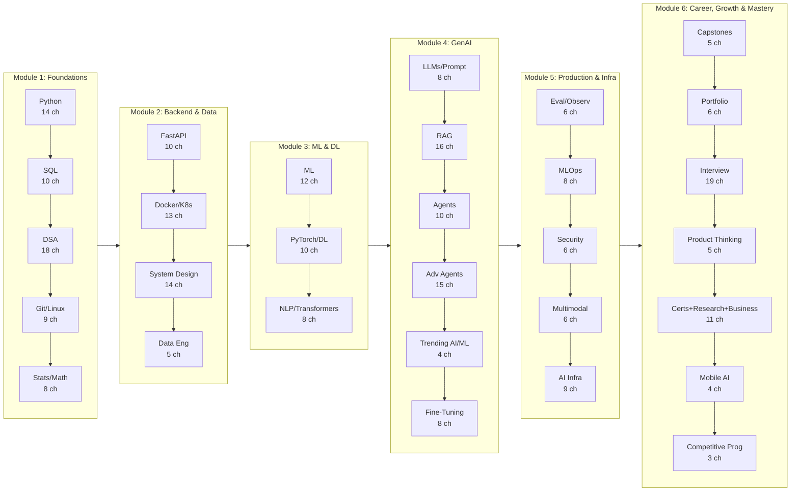
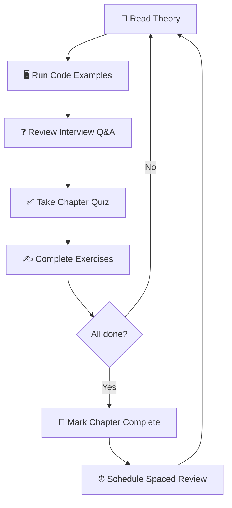

# Backend + AI Engineer — Complete Placement Course

> **Zero to job-ready in 12 months. 33 subjects, 290+ sub-chapters, 3,148+ interview Q&A. All in browser localStorage — zero backend.**

## What This Course Covers

This is a **single, unified placement course** for software developers targeting **Backend + AI Engineer** roles at product companies, startups, and MNCs. Unlike scattered tutorials, this course provides a complete end-to-end path with:

| Feature | Detail |
|---------|--------|
| **Subjects** | 33 broad subject areas (Core CS → Competitive Programming) |
| **Sub-chapters** | 290+ focused topic files, each 400+ lines |
| **Interview Q&A** | 3,148+ questions with expandable answers — click to reveal |
| **Chapter Quizzes** | 5 MCQ per sub-chapter = 1,450+ total questions |
| **Exercises** | 5 hands-on per sub-chapter = 1,235+ exercises |
| **Capstone Projects** | 5 production-grade projects, from beginner to SaaS |
| **Progress Tracking** | All in browser localStorage — theory, Q&A, exercises, streak |
| **Study Mode** | Review Mode, spaced repetition, bookmarks, daily goals |
| **Language** | Python 3.11+ throughout (TypeScript comparisons where relevant) |

## Who This Is For

- **Full-stack developers** (3+ years) transitioning into AI/ML
- **CS graduates** preparing for Backend + AI Engineer placements
- **Self-taught engineers** wanting a structured path to FAANG/MNC AI roles
- **Anyone** who wants to crack interviews at Google, Microsoft, Amazon, NVIDIA, TCS Digital, Accenture AI, Infosys Topaz, Deloitte AI, and AI startups

## Prerequisites

| Requirement | Level | How to Verify |
|-------------|-------|--------------|
| Basic programming logic | Comfortable with loops, functions, conditionals | Write a fizzbuzz without looking |
| Logical thinking | Can break down problems step by step | Explain how you'd sort a list manually |
| Time commitment | 15-20 hours per week for 12 months | Block calendar in advance |

> No prior Python, ML, or AI experience required — **Chapter 1 starts from zero**.

## Course Roadmap

## Study Workflow

Every sub-chapter follows this study loop:

All progress stored in your browser's localStorage — **zero servers, zero accounts, zero data sent anywhere**.

## 12-Month Weekly Plan

### Month 1-2: Foundations (Python + SQL + DSA + Git)

| Week | Focus | Sub-chapters | Daily Target |
|------|-------|-------------|--------------|
| 1 | Python basics + control flow | 01-02 | 2 Q&A per day |
| 2 | Strings, collections, functions | 03-05 | 2 Q&A per day |
| 3 | Modules, files, OOP | 06-08 | 2 Q&A per day |
| 4 | Decorators, concurrency, NumPy | 09-11 | 2 Q&A per day |
| 5 | Pandas, viz, SQL basics | 12-14 + SQL 01 | 3 Q&A per day |
| 6 | SQL aggregates, joins, subqueries | SQL 02-04 | 3 Q&A per day |
| 7 | SQL window functions, sets, indexes | SQL 05-07 | 3 Q&A per day |
| 8 | SQL design, transactions + DSA intro | SQL 08-10 + DSA 01 | 3 Q&A per day |
| 9 | DSA: arrays, strings, sliding window | DSA 02-04 | 3 Q&A per day |
| 10 | DSA: two pointers, hash maps, linked lists | DSA 05-07 | 3 Q&A per day |
| 11 | DSA: stacks, queues, trees, BST | DSA 08-10 | 3 Q&A per day |
| 12 | DSA: heaps, tries, graphs | DSA 11-14 | 3 Q&A per day |
| 13 | DSA: DP 1D, DP 2D, backtracking, bit | DSA 15-18 | 3 Q&A per day |
| 14 | Git + Linux + SSH, cron, process mgmt | GIT 01-09 | Review all Q&A |
| 15 | Statistics: descriptive, probability | STAT 01-02 | 3 Q&A per day |
| 16 | Statistics: hypothesis testing, correlation | STAT 03-04 | 3 Q&A per day |
| 17 | Linear algebra, calculus, A/B testing | STAT 05-07 | 3 Q&A per day |
| 18 | Statistics for ML practical | STAT 08 | 3 Q&A per day |

### Month 3-4: Backend Engineering (FastAPI + Docker/K8s + System Design + Data Engineering)

| Week | Focus | Sub-chapters | Daily Target |
|------|-------|-------------|--------------|
| 19 | FastAPI: REST, basics, Pydantic | FB 01-03 | 3 Q&A per day |
| 20 | FastAPI: DI, auth, database | FB 04-06 | 3 Q&A per day |
| 21 | FastAPI: async, testing, error, deploy | FB 07-10 | 3 Q&A per day |
| 22 | Docker: basics, compose, best practices | DKC 01-03 | 3 Q&A per day |
| 23 | K8s: basics, config, scaling | DKC 04-06 | 3 Q&A per day |
| 24 | Cloud: AWS, Lambda, Azure AI, GCP Vertex, CI/CD | DKC 07-13 | 3 Q&A per day |
| 25 | System Design: scalability, microservices, queues | SD 01-03 | 3 Q&A per day |
| 26 | System Design: caching, DB scaling, CAP, API | SD 04-07 | 3 Q&A per day |
| 27 | System Design: rate limiting, monitoring, notification, upload | SD 08-14 | 3 Q&A per day |
| 28 | Data Engineering: ETL, lakehouse, Spark basics | DE 01-03 | 3 Q&A per day |
| 29 | Data Engineering: streaming, feature stores | DE 04-05 | 3 Q&A per day |
| 30 | **Capstone 1**: House Price Prediction API | Build + Deploy | — |

### Month 5-6: ML & Deep Learning

| Week | Focus | Sub-chapters | Daily Target |
|------|-------|-------------|--------------|
| 31 | ML: fundamentals, linear regression | ML 01-02 | 3 Q&A per day |
| 32 | ML: logistic regression, Naive Bayes, decision trees | ML 03-04, 11 | 3 Q&A per day |
| 33 | ML: SVM, ensemble, unsupervised | ML 05-07 | 3 Q&A per day |
| 34 | ML: PCA, evaluation, hyperparameter tuning, feature eng | ML 08-10, 12 | 3 Q&A per day |
| 35 | DL: neural nets basics, PyTorch tensors | DL 01-02 | 3 Q&A per day |
| 36 | DL: nn.Module, CNN fundamentals | DL 03-04 | 3 Q&A per day |
| 37 | DL: advanced CNN, transfer learning | DL 05-06 | 3 Q&A per day |
| 38 | DL: RNN/LSTM, training pipelines | DL 07-08 | 3 Q&A per day |
| 39 | DL: deployment, best practices | DL 09-10 | 3 Q&A per day |
| 40 | **Capstone 2**: Resume ATS Analyzer | Build + Deploy | — |

### Month 7-8: NLP & GenAI

| Week | Focus | Sub-chapters | Daily Target |
|------|-------|-------------|--------------|
| 41 | NLP: preprocessing, embeddings | NLP 01-02 | 3 Q&A per day |
| 42 | NLP: sequence models, attention | NLP 03-04 | 3 Q&A per day |
| 43 | NLP: transformers, BERT, Hugging Face | NLP 05-07 | 3 Q&A per day |
| 44 | NLP: applications | NLP 08 | 3 Q&A per day |
| 45 | LLMs: overview, APIs, zero/few-shot | LLM 01-03 | 3 Q&A per day |
| 46 | LLMs: CoT, structured output, context | LLM 04-06 | 3 Q&A per day |
| 47 | LLMs: evaluation, cost optimization | LLM 07-08 | 3 Q&A per day |
| 48 | **Capstone 3**: Enterprise RAG Platform | Build + Deploy | — |

### Month 9-10: RAG, Agents, Fine-Tuning

| Week | Focus | Sub-chapters | Daily Target |
|------|-------|-------------|--------------|
| 49 | RAG: architecture, chunking, embeddings | RAG 01-03 | 3 Q&A per day |
| 50 | RAG: vector DB, similarity, hybrid search | RAG 04-06 | 3 Q&A per day |
| 51 | RAG: re-ranking, advanced patterns, eval | RAG 07-09 | 3 Q&A per day |
| 52 | RAG: production | RAG 10 | 3 Q&A per day |
| 53 | Agents: overview, ReAct, tool calling | AGE 01-03 | 3 Q&A per day |
| 54 | Agents: memory, LangGraph basics | AGE 04-05 | 3 Q&A per day |
| 55 | Agents: LangGraph advanced, multi-agent | AGE 06-07 | 3 Q&A per day |
| 56 | Agents: MCP, evaluation, production | AGE 08-10 | 3 Q&A per day |
| 57 | Fine-tuning: when, full FT, LoRA theory | FT 01-03 | 3 Q&A per day |
| 58 | Fine-tuning: LoRA impl, QLoRA, instruction | FT 04-06 | 3 Q&A per day |
| 59 | Fine-tuning: DPO, evaluation | FT 07-08 | 3 Q&A per day |
| 60 | **Capstone 4**: Multi-Agent Support System | Build + Deploy | — |

### Month 11-13: Production, Security, Portfolio, Interview

| Week | Focus | Sub-chapters | Daily Target |
|------|-------|-------------|--------------|
| 61 | Eval: metrics, LLM-as-judge, datasets | EVAL 01-03 | 3 Q&A per day |
| 62 | Eval: observability, tracing, alerting | EVAL 04-06 | 3 Q&A per day |
| 63 | MLOps: tracking, prompt, data, CI/CD | MLOPS 01-04 | 3 Q&A per day |
| 64 | MLOps: serving, drift, cost, incident | MLOPS 05-08 | 3 Q&A per day |
| 65 | Security: threats, injection, filtering | SEC 01-03 | 3 Q&A per day |
| 66 | Security: guardrails, secrets, compliance | SEC 04-06 | 3 Q&A per day |
| 67 | Multimodal: CV basics, object detection | MM 01-02 | 3 Q&A per day |
| 68 | Multimodal: segmentation, OCR, STT, voice | MM 03-06 | 3 Q&A per day |
| 69 | **Capstone 5**: Full AI SaaS Platform | Build + Deploy | — |
| 70 | Portfolio: GitHub, repos, blogging, LinkedIn | PORT 01-06 | — |
| 71 | Interview: DSA, SQL, backend patterns | INT 01-03 | Practice 10 Qs |
| 72 | Interview: ML, DL, LLM/RAG | INT 04-06 | Practice 10 Qs |
| 73 | Interview: agents, system design, behavioral | INT 07-09 | Mock interview |
| 74 | Interview: resume, salary, mock sims | INT 10-12 | Full mock round |
| 75 | Interview: math, ML sys design, FAANG deep dives | INT 13-15 | Practice 10 Qs |
| 76 | Interview: DSA bank, OOD, debugging, AI tools | INT 16-19 | Full mock round |

## Subject Overview

| # | Subject | Sub-chapters | Q&A | Hours | Weight |
|---|---------|-------------|-----|-------|--------|
| 00 | Core Computer Science | 5 | 50 | 20 | ⭐⭐⭐ |
| 01 | Python for AI | 14 | 140 | 40 | ⭐⭐⭐ |
| 02 | SQL & Databases | 10 | 100 | 25 | ⭐⭐⭐⭐ |
| 03 | DSA | 18 | 216 | 60 | ⭐⭐⭐⭐⭐ |
| 04 | Git, Linux & CLI | 9 | 72 | 15 | ⭐⭐ |
| 05 | FastAPI & Backend | 10 | 100 | 35 | ⭐⭐⭐⭐⭐ |
| 06 | Docker, K8s & Cloud | 13 | 130 | 35 | ⭐⭐⭐⭐ |
| 07 | System Design | 14 | 168 | 45 | ⭐⭐⭐⭐⭐ |
| 08 | ML | 12 | 120 | 40 | ⭐⭐⭐⭐ |
| 09 | Deep Learning / PyTorch | 10 | 100 | 35 | ⭐⭐⭐⭐ |
| 10 | NLP & Transformers | 8 | 80 | 25 | ⭐⭐⭐ |
| 11 | LLMs & Prompt Engineering | 8 | 80 | 25 | ⭐⭐⭐⭐⭐ |
| 12 | RAG & Vector Databases | 16 | 160 | 35 | ⭐⭐⭐⭐⭐ |
| 13 | AI Agents & LangGraph | 10 | 100 | 40 | ⭐⭐⭐⭐⭐ |
| 14 | Fine-Tuning & PEFT | 8 | 80 | 25 | ⭐⭐⭐ |
| 15 | AI Eval & Observability | 6 | 60 | 20 | ⭐⭐⭐ |
| 16 | MLOps & Production | 8 | 80 | 25 | ⭐⭐⭐⭐ |
| 17 | AI Security & Guardrails | 6 | 60 | 15 | ⭐⭐⭐ |
| 18 | Multimodal AI & Voice | 6 | 60 | 20 | ⭐⭐⭐ |
| 19 | Capstone Projects | 5 | 25 | 50 | ⭐⭐⭐⭐⭐ |
| 20 | Portfolio & Branding | 6 | 48 | 15 | ⭐⭐⭐ |
| 21 | Interview Preparation | 19 | 285 | 80 | ⭐⭐⭐⭐⭐ |
| 22 | Advanced AI Agents | 10 | 100 | 40 | ⭐⭐⭐⭐⭐ |
| 23 | Trending AI/ML Platforms & Tools | 4 | 40 | 10 | ⭐⭐⭐ |
| 24 | Statistics & Mathematics for AI | 8 | 80 | 30 | ⭐⭐⭐⭐ |
| 25 | Data Engineering for AI | 5 | 50 | 20 | ⭐⭐⭐ |
| 26 | AI Product Thinking | 5 | 50 | 20 | ⭐⭐⭐ |
| 27 | AI Infrastructure & Optimization | 9 | 90 | 35 | ⭐⭐⭐⭐ |
| 28 | AI Certifications Guide | 3 | 30 | 10 | ⭐⭐ |
| 29 | Research Reading & AI Literature | 4 | 40 | 15 | ⭐⭐ |
| 30 | Business Skills for AI Engineers | 4 | 40 | 15 | ⭐⭐ |
| 31 | Mobile AI & Edge Deployment | 4 | 40 | 15 | ⭐⭐ |
| 32 | Competitive Programming | 3 | 30 | 10 | ⭐⭐ |
| **Total** | **33** | **~290** | **~3,148** | **~950** | — |

## How to Use This Course

1. **Start from Subject 01** and progress sequentially
2. For each sub-chapter:
   - Read the theory and run the Python code examples
   - Study the Mermaid diagrams
   - Expand and review each Interview Q&A (click to reveal answer)
   - Take the chapter quiz (5 MCQ)
   - Complete the exercises
   - Click "Mark as Complete" when done
3. Use **Review Mode** (button at top) to shuffle unanswered Q&A
4. Visit the **Study Dashboard** daily to track streak and progress
5. After each module, build the associated capstone project

## Technology Stack

| Layer | Technology |
|-------|-----------|
| Language | Python 3.11+ |
| Backend | FastAPI, Uvicorn, Pydantic |
| ML | scikit-learn, NumPy, Pandas |
| DL | PyTorch, torchvision, Hugging Face |
| LLMs | OpenAI, Anthropic, Ollama, vLLM |
| Agents | LangGraph, MCP |
| Vector DB | Qdrant |
| Containers | Docker, Docker Compose |
| Orchestration | Kubernetes |
| Cloud | AWS (EC2, S3, ECS), GCP Vertex AI |
| CI/CD | GitHub Actions |
| Tracking | MLflow, LangFuse |
| Testing | pytest, pytest-asyncio |

## Navigation

- **Start**: [01 — Python for AI →](courses/python-programming/index.md)
- **Dashboard**: (auto-generated by JavaScript from localStorage)

---

> **Next**: [01 — Python for AI →](courses/python-programming/index.md)
