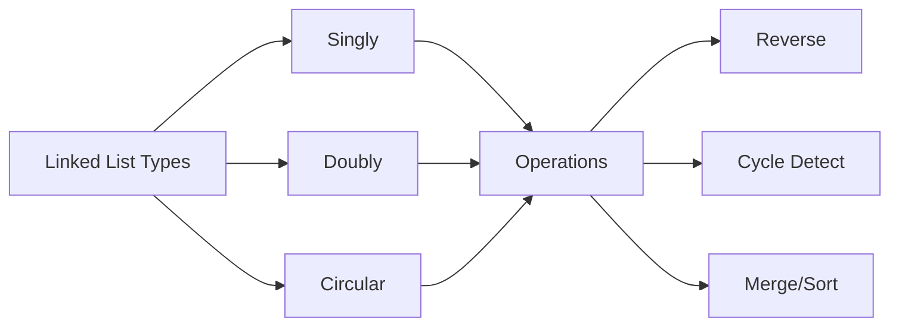

---
slug: /03-dsa/linked-lists
title: "Linked Lists"
sidebar_label: "Linked Lists"
sidebar_position: 7
---

# Linked Lists

## Learning Objectives

| Objective | Description |
|-----------|-------------|
| LO1 | Understand singly linked list, doubly linked list, and circular linked list structures |
| LO2 | Implement linked list operations: traversal, insertion, deletion, reversal |
| LO3 | Solve cycle detection and cycle-related problems using Floyd's algorithm |
| LO4 | Apply fast-slow pointer techniques for middle finding and palindrome checking |
| LO5 | Implement in-place reordering operations (reverse, rotate, reorder) |
| LO6 | Use dummy nodes and recursion to simplify linked list problems |

## Introduction

Stacks and queues are fundamental LIFO and FIFO data structures. They appear in countless problems from balanced parentheses to BFS traversal. Mastering these structures helps you solve problems involving ordering, nesting, and processing sequences.

## Prerequisites

- Array basics
- Basic programming


## Key Terminology

**Key Terms**: Core vocabulary and concepts for this topic.

**Definition**: Essential terms you must know for interviews and production work.

## Theory

Understanding linked lists is fundamental for AI engineers. This section covers the core concepts, underlying principles, and theoretical framework that govern how linked lists works in practice.


## Chapter at a Glance

| Section | Topic | Key Concept |
|---------|-------|-------------|
| 7.1 | Linked List Fundamentals | Singly, doubly, circular; Node structure |
| 7.2 | Basic Operations | Insert, delete, traverse, search |
| 7.3 | Reversal Techniques | Iterative, recursive, in-place reversal |
| 7.4 | Cycle Detection | Floyd's algorithm, cycle start, cycle length |
| 7.5 | Advanced Operations | Palindrome check, merge, add numbers |
| 7.6 | Doubly Linked Lists | Operations, insertion, deletion |

## Chapter Roadmap



A linked list is a linear data structure where elements (nodes) are stored at non-contiguous memory locations, connected via pointers.

## 7.1 Linked List Fundamentals

**Singly linked list**: Each node has a value and a next pointer. Traversal is one-directional.

**Doubly linked list**: Each node has prev and next pointers. Traversal is bi-directional.

**Circular linked list**: The last node points back to the head. Can be singly or doubly linked.

```python
class ListNode:
    def __init__(self, val=0, next=None):
        self.val = val
        self.next = next

class DoublyListNode:
    def __init__(self, val=0, prev=None, next=None):
        self.val = val
        self.prev = prev
        self.next = next

## Build: 1 -> 2 -> 3 -> None
head = ListNode(1)
head.next = ListNode(2)
head.next.next = ListNode(3)

## Build: 1 <-> 2 <-> 3 <-> None
d1 = DoublyListNode(1)
d2 = DoublyListNode(2)
d3 = DoublyListNode(3)
d1.next = d2; d2.prev = d1
d2.next = d3; d3.prev = d2
```

## 7.2 Basic Operations

**Traversal**:

```python
def traverse(head):
    current = head
    while current:
        print(current.val, end=" -> ")
        current = current.next
    print("None")

def get_length(head):
    count = 0
    while head:
        count += 1
        head = head.next
    return count
```

**Insertion**:

```python
def insert_at_beginning(head, val):
    new_node = ListNode(val)
    new_node.next = head
    return new_node

def insert_at_end(head, val):
    if not head:
        return ListNode(val)
    current = head
    while current.next:
        current = current.next
    current.next = ListNode(val)
    return head

def insert_at_position(head, val, pos):
    if pos == 0:
        return insert_at_beginning(head, val)
    current = head
    for _ in range(pos - 1):
        if not current:
            raise IndexError("Position out of bounds")
        current = current.next
    new_node = ListNode(val)
    new_node.next = current.next
    current.next = new_node
    return head
```

**Deletion**:

```python
def delete_node(head, key):
    if not head:
        return None
    if head.val == key:
        return head.next
    current = head
    while current.next and current.next.val != key:
        current = current.next
    if current.next:
        current.next = current.next.next
    return head
```

## 7.3 Reversal Techniques

**Iterative reversal**:

```python
def reverse_iterative(head):
    prev = None
    curr = head
    while curr:
        next_temp = curr.next
        curr.next = prev
        prev = curr
        curr = next_temp
    return prev  # new head
```

**Recursive reversal**:

```python
def reverse_recursive(head):
    if not head or not head.next:
        return head
    new_head = reverse_recursive(head.next)
    head.next.next = head
    head.next = None
    return new_head
```

**Reverse k nodes at a time**:

```python
def reverse_k_group(head, k):
    count = 0
    curr = head
    while curr and count < k:
        curr = curr.next
        count += 1
    if count < k:
        return head
    prev = None
    curr = head
    for _ in range(k):
        next_temp = curr.next
        curr.next = prev
        prev = curr
        curr = next_temp
    head.next = reverse_k_group(curr, k)
    return prev
```

## 7.4 Cycle Detection

Floyd's cycle detection determines if a linked list has a cycle using two pointers.

```python
def has_cycle(head):
    slow = fast = head
    while fast and fast.next:
        slow = slow.next
        fast = fast.next.next
        if slow == fast:
            return True
    return False

def detect_cycle_start(head):
    slow = fast = head
    while fast and fast.next:
        slow = slow.next
        fast = fast.next.next
        if slow == fast:
            slow = head
            while slow != fast:
                slow = slow.next
                fast = fast.next
            return slow
    return None

def cycle_length(head):
    meeting = detect_cycle_start(head)
    if not meeting:
        return 0
    count = 1
    curr = meeting.next
    while curr != meeting:
        count += 1
        curr = curr.next
    return count
```

## 7.5 Advanced Operations

**Palindrome check**:

```python
def is_palindrome(head):
    if not head or not head.next:
        return True
    slow = fast = head
    while fast and fast.next:
        slow = slow.next
        fast = fast.next.next
    second_half = reverse_iterative(slow)
    first_half = head
    while second_half:
        if first_half.val != second_half.val:
            return False
        first_half = first_half.next
        second_half = second_half.next
    return True
```

**Merge two sorted lists**:

```python
def merge_two_lists(l1, l2):
    dummy = ListNode(0)
    curr = dummy
    while l1 and l2:
        if l1.val < l2.val:
            curr.next = l1
            l1 = l1.next
        else:
            curr.next = l2
            l2 = l2.next
        curr = curr.next
    curr.next = l1 or l2
    return dummy.next
```

**Remove nth node from end**:

```python
def remove_nth_from_end(head, n):
    dummy = ListNode(0)
    dummy.next = head
    first = second = dummy
    for _ in range(n + 1):
        first = first.next
    while first:
        first = first.next
        second = second.next
    second.next = second.next.next
    return dummy.next
```

**Add two numbers** (represented as reversed lists):

```python
def add_two_numbers(l1, l2):
    dummy = ListNode(0)
    curr = dummy
    carry = 0
    while l1 or l2 or carry:
        v1 = l1.val if l1 else 0
        v2 = l2.val if l2 else 0
        total = v1 + v2 + carry
        carry = total // 10
        curr.next = ListNode(total % 10)
        curr = curr.next
        if l1: l1 = l1.next
        if l2: l2 = l2.next
    return dummy.next
```

## 7.6 Doubly Linked Lists

```python
class DLLNode:
    def __init__(self, val=0):
        self.val = val
        self.prev = None
        self.next = None

def insert_at_front(head, val):
    new_node = DLLNode(val)
    new_node.next = head
    if head:
        head.prev = new_node
    return new_node

def delete_node_dll(head, node):
    if head == node:
        head = node.next
    if node.next:
        node.next.prev = node.prev
    if node.prev:
        node.prev.next = node.next
    return head

def traverse_forward(head):
    result = []
    while head:
        result.append(head.val)
        head = head.next
    return result

def traverse_backward(tail):
    result = []
    while tail:
        result.append(tail.val)
        tail = tail.prev
    return result
```

---

## TypeScript Parallel

```typescript
class ListNode {
    val: number;
    next: ListNode | null = null;
    constructor(val: number) { this.val = val; }
}

function hasCycle(head: ListNode | null): boolean {
    let slow = head, fast = head;
    while (fast && fast.next) {
        slow = slow!.next;
        fast = fast.next.next;
        if (slow === fast) return true;
    }
    return false;
}

function reverseList(head: ListNode | null): ListNode | null {
    let prev = null, curr = head;
    while (curr) {
        const next = curr.next;
        curr.next = prev;
        prev = curr;
        curr = next;
    }
    return prev;
}

function mergeTwoLists(l1: ListNode | null, l2: ListNode | null): ListNode | null {
    const dummy = new ListNode(0);
    let curr = dummy;
    while (l1 && l2) {
        if (l1.val < l2.val) { curr.next = l1; l1 = l1.next; }
        else { curr.next = l2; l2 = l2.next; }
        curr = curr.next;
    }
    curr.next = l1 || l2;
    return dummy.next;
}
```

---

## Summary

- Linked lists provide O(1) insertion/deletion at known positions but O(n) random access
- Singly linked lists have next pointers only; doubly linked lists add prev pointers for bi-directional traversal
- Iterative reversal uses three pointers (prev, curr, next) to reverse links in O(n) time
- Floyd's cycle detection uses fast and slow pointers to detect cycles in O(n) time with O(1) space
- The dummy node pattern simplifies edge cases for insertion and deletion operations
- Fast-slow pointers find the middle element, detect cycles, and help check palindromes
- Recursive solutions for linked lists often use the call stack naturally but risk stack overflow for large lists
- The merge two sorted lists problem uses a dummy node and compares values iteratively
- Doubly linked lists enable O(1) deletion of a known node without traversing from head
- Linked lists are used to implement LRU caches, hash table chaining, and adjacency lists for graphs

## Practical Takeaways

| Scenario | Do This | Avoid This |
|----------|---------|------------|
| Iterative reversal | Use prev, curr, next three pointers | Recursive reversal for large lists |
| Edge cases like head deletion | Use dummy sentinel node | Special-casing head |
| Cycle detection | Floyd's fast-slow algorithm | Hash set of visited nodes |
| Finding middle | Fast-slow pointers | Counting length then traversing again |
| Remove nth from end | Two pointers with n+1 gap | Reversing then removing |
| Merge sorted lists | Dummy node + compare | Creating new nodes unnecessarily |


## Interview Q&A
<details class="tp-qa-card" data-qid="dsa07-q1">
  <summary class="tp-qa-question"><span class="tp-qa-status"></span>
    Q1: What are the time complexities of linked list operations?
  </summary>
  <div class="tp-qa-answer">
    <table><tr><th>Operation</th><th>Singly</th><th>Doubly</th></tr>
    <tr><td>Access by index</td><td>O(n)</td><td>O(n)</td></tr>
    <tr><td>Search</td><td>O(n)</td><td>O(n)</td></tr>
    <tr><td>Insert at head</td><td>O(1)</td><td>O(1)</td></tr>
    <tr><td>Insert at tail</td><td>O(n)</td><td>O(1) with tail pointer</td></tr>
    <tr><td>Delete known node</td><td>O(n)</td><td>O(1)</td></tr></table>
  </div>
  <button class="tp-qa-mark-btn">✅ Mark Reviewed</button>
  <button class="tp-qa-bookmark-btn">🔖 Bookmark</button>
</details>

<details class="tp-qa-card" data-qid="dsa07-q2">
  <summary class="tp-qa-question"><span class="tp-qa-status"></span>
    Q2: How do you detect a cycle in a linked list?
  </summary>
  <div class="tp-qa-answer">
    <p>Use Floyd's cycle detection: slow pointer moves 1 step, fast moves 2 steps. If they meet, a cycle exists.</p>
    <p>Phase 2: Reset slow to head, move both 1 step each. They meet at cycle start.</p>
  </div>
  <button class="tp-qa-mark-btn">✅ Mark Reviewed</button>
  <button class="tp-qa-bookmark-btn">🔖 Bookmark</button>
</details>

<details class="tp-qa-card" data-qid="dsa07-q3">
  <summary class="tp-qa-question"><span class="tp-qa-status"></span>
    Q3: Explain how to reverse a linked list iteratively.
  </summary>
  <div class="tp-qa-answer">
    <p>Use three pointers: prev (None initially), curr (head), next_temp. At each step, save curr.next, point curr.next to prev, advance prev and curr.</p>
    <p>Time: O(n), Space: O(1).</p>
  </div>
  <button class="tp-qa-mark-btn">✅ Mark Reviewed</button>
  <button class="tp-qa-bookmark-btn">🔖 Bookmark</button>
</details>

<details class="tp-qa-card" data-qid="dsa07-q4">
  <summary class="tp-qa-question"><span class="tp-qa-status"></span>
    Q4: How do you find the middle of a linked list?
  </summary>
  <div class="tp-qa-answer">
    <p>Fast-slow pointers: move slow by 1, fast by 2. When fast reaches end, slow is at the middle.</p>
    <p>For even length, slow points to the first middle (or second, depending on implementation).</p>
  </div>
  <button class="tp-qa-mark-btn">✅ Mark Reviewed</button>
  <button class="tp-qa-bookmark-btn">🔖 Bookmark</button>
</details>

<details class="tp-qa-card" data-qid="dsa07-q5">
  <summary class="tp-qa-question"><span class="tp-qa-status"></span>
    Q5: How does the dummy node pattern simplify linked list code?
  </summary>
  <div class="tp-qa-answer">
    <p>A dummy node points to head. Operations that modify the head (like deletion) no longer need special cases for empty lists or head removal.</p>
    <p>Return dummy.next as the new head.</p>
  </div>
  <button class="tp-qa-mark-btn">✅ Mark Reviewed</button>
  <button class="tp-qa-bookmark-btn">🔖 Bookmark</button>
</details>

<details class="tp-qa-card" data-qid="dsa07-q6">
  <summary class="tp-qa-question"><span class="tp-qa-status"></span>
    Q6: Implement merge of two sorted linked lists.
  </summary>
  <div class="tp-qa-answer">
    <p>Use a dummy node. Compare current nodes of both lists, attach the smaller one to result, advance that list's pointer.</p>
    <p>When one list exhausts, attach the rest of the other. Time: O(m+n), Space: O(1).</p>
  </div>
  <button class="tp-qa-mark-btn">✅ Mark Reviewed</button>
  <button class="tp-qa-bookmark-btn">🔖 Bookmark</button>
</details>

<details class="tp-qa-card" data-qid="dsa07-q7">
  <summary class="tp-qa-question"><span class="tp-qa-status"></span>
    Q7: How do you remove the nth node from the end of a linked list?
  </summary>
  <div class="tp-qa-answer">
    <p>Use two pointers with a gap of n+1 nodes. Move first n+1 steps ahead, then move both until first reaches end. Second points to the node before the one to delete.</p>
  </div>
  <button class="tp-qa-mark-btn">✅ Mark Reviewed</button>
  <button class="tp-qa-bookmark-btn">🔖 Bookmark</button>
</details>

<details class="tp-qa-card" data-qid="dsa07-q8">
  <summary class="tp-qa-question"><span class="tp-qa-status"></span>
    Q8: How do you check if a linked list is a palindrome?
  </summary>
  <div class="tp-qa-answer">
    <p>Find the middle using fast-slow. Reverse the second half. Compare first half with reversed second half. Optionally restore the list.</p>
    <p>Time: O(n), Space: O(1).</p>
  </div>
  <button class="tp-qa-mark-btn">✅ Mark Reviewed</button>
  <button class="tp-qa-bookmark-btn">🔖 Bookmark</button>
</details>

<details class="tp-qa-card" data-qid="dsa07-q9">
  <summary class="tp-qa-question"><span class="tp-qa-status"></span>
    Q9: What is the advantage of a doubly linked list over a singly linked list?
  </summary>
  <div class="tp-qa-answer">
    <p>Doubly linked lists allow O(1) deletion of a known node (with its pointer). They support bi-directional traversal. However, they use more memory (extra prev pointer).</p>
    <p>Used in: LRU cache, browser history, undo/redo systems.</p>
  </div>
  <button class="tp-qa-mark-btn">✅ Mark Reviewed</button>
  <button class="tp-qa-bookmark-btn">🔖 Bookmark</button>
</details>

<details class="tp-qa-card" data-qid="dsa07-q10">
  <summary class="tp-qa-question"><span class="tp-qa-status"></span>
    Q10: How do you add two numbers represented as linked lists?
  </summary>
  <div class="tp-qa-answer">
    <p>Traverse both lists, adding corresponding digits plus carry. Create a new node with result % 10, carry = result / 10. Continue until both lists and carry are exhausted.</p>
  </div>
  <button class="tp-qa-mark-btn">✅ Mark Reviewed</button>
  <button class="tp-qa-bookmark-btn">🔖 Bookmark</button>
</details>

<details class="tp-qa-card" data-qid="dsa07-q11">
  <summary class="tp-qa-question"><span class="tp-qa-status"></span>
    Q11: How do you reverse k nodes at a time in a linked list?
  </summary>
  <div class="tp-qa-answer">
    <p>Count k nodes. If there are less than k, return head. Otherwise, reverse k nodes iteratively, then recursively call on the rest. Connect the reversed segment with the next reversed segment.</p>
  </div>
  <button class="tp-qa-mark-btn">✅ Mark Reviewed</button>
  <button class="tp-qa-bookmark-btn">🔖 Bookmark</button>
</details>

<details class="tp-qa-card" data-qid="dsa07-q12">
  <summary class="tp-qa-question"><span class="tp-qa-status"></span>
    Q12: Compare arrays and linked lists.
  </summary>
  <div class="tp-qa-answer">
    <p>Arrays: O(1) access, O(n) insertion/deletion (except end). Cache-friendly. Linked lists: O(n) access, O(1) insertion/deletion at known position. Not cache-friendly.</p>
    <p>Choose arrays for random access, linked lists for frequent insertions/deletions.</p>
  </div>
  <button class="tp-qa-mark-btn">✅ Mark Reviewed</button>
  <button class="tp-qa-bookmark-btn">🔖 Bookmark</button>
</details>

## Chapter Quiz

**Q1**: What is the time complexity of searching for a value in a linked list?
a) O(1)  b) O(log n)  c) O(n)  d) O(n^2)
<details class="tp-qa-card" data-qid="dsa07-quiz1"><summary>Show Answer</summary><div class="tp-qa-answer"><p><strong>Answer: c) O(n)</strong></p></div></details>

**Q2**: In Floyd's cycle detection, where do the slow and fast pointers first meet?
a) At the head  b) At the cycle start  c) Somewhere inside the cycle  d) At tail
<details class="tp-qa-card" data-qid="dsa07-quiz2"><summary>Show Answer</summary><div class="tp-qa-answer"><p><strong>Answer: c) Somewhere inside the cycle</strong></p></div></details>

**Q3**: What data structure is used to implement an LRU cache?
a) Array  b) Hash Map + Doubly Linked List  c) Stack  d) Queue
<details class="tp-qa-card" data-qid="dsa07-quiz3"><summary>Show Answer</summary><div class="tp-qa-answer"><p><strong>Answer: b) Hash Map + Doubly Linked List</strong></p></div></details>

**Q4**: What operation is O(n) for singly linked lists but O(1) for doubly?
a) Access by index  b) Delete known node  c) Insert at head  d) Traverse forward
<details class="tp-qa-card" data-qid="dsa07-quiz4"><summary>Show Answer</summary><div class="tp-qa-answer"><p><strong>Answer: b) Delete known node</strong></p></div></details>

**Q5**: What is the space complexity of iterative linked list reversal?
a) O(1)  b) O(n)  c) O(log n)  d) O(n^2)
<details class="tp-qa-card" data-qid="dsa07-quiz5"><summary>Show Answer</summary><div class="tp-qa-answer"><p><strong>Answer: a) O(1)</strong></p></div></details>

## Exercises

**Easy** - Reverse a singly linked list iteratively and recursively

**Medium** - Merge k sorted linked lists into one sorted list

**Medium** - Detect and remove cycle from a linked list

**Hard** - Implement LRU Cache with O(1) get and put using doubly linked list + hash map

**Hard** - Flatten a multi-level doubly linked list where each node has child pointers

---


## Common Mistakes

1. Using stack when queue is needed (and vice versa)
2. Not handling empty stack/queue operations
3. Forgetting that stacks can be implemented with arrays
4. Not using monotonic stack for next greater element
5. Mixing up push/pop vs enqueue/dequeue

## Revision Notes

- Stack: LIFO — push, pop, peek
- Queue: FIFO — enqueue, dequeue, peek
- Monotonic stack for next greater/smaller element
- BFS uses queue, DFS uses stack
- Two stacks can simulate a queue
