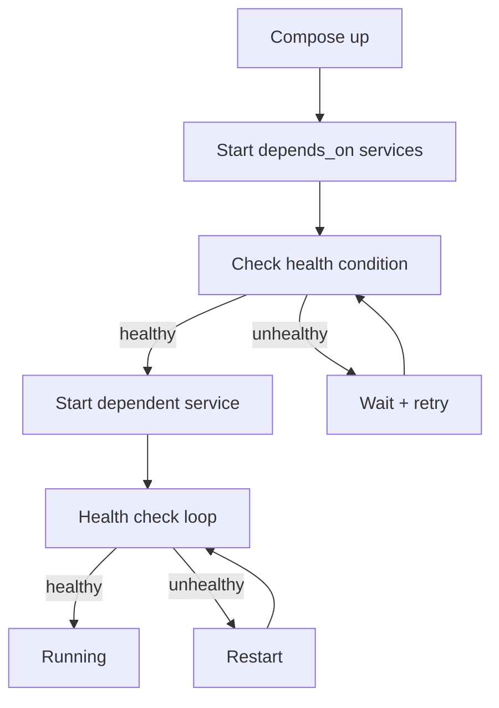

# Docker Compose — Multi-Container Orchestration

## Learning Objectives

| Objective | Description |
|-----------|-------------|
| LO1 | Understand Docker Compose architecture and use cases |
| LO2 | Write docker-compose.yml files with services, networks, and volumes |
| LO3 | Manage multi-container application lifecycle with Compose CLI |
| LO4 | Configure environment variables, dependencies, and health checks |
| LO5 | Scale services and manage load balancing with Compose |
| LO6 | Debug multi-container applications using Compose logs and exec |

## Introduction

Containers and cloud platforms are where AI models live in production. Docker packages your model, Kubernetes orchestrates it, and cloud platforms scale it. This module covers the full deployment stack.


## Prerequisites

- Basic programming knowledge
- Understanding of data structures

## Key Terminology

**Key Terms**: Core vocabulary and concepts for this topic.

**Definition**: Essential terms you must know for interviews and production work.

## Theory

Understanding docker compose is fundamental for AI engineers. This section covers the core concepts, underlying principles, and theoretical framework that govern how docker compose works in practice.


## Chapter at a Glance

| Section | Topic | Key Concept |
|---------|-------|-------------|
| 2.1 | What is Docker Compose | Declarative multi-container orchestration |
| 2.2 | Compose File Structure | services, networks, volumes, configs |
| 2.3 | Service Configuration | image, build, ports, volumes, environment |
| 2.4 | Networking in Compose | service discovery, custom networks, DNS |
| 2.5 | Dependencies and Health Checks | depends_on, healthcheck, restart policies |
| 2.6 | Environment Variables | .env file, env_file, variable substitution |
| 2.7 | Scaling and Load Balancing | docker compose up --scale, replicas |
| 2.8 | Debugging and Logging | logs, exec, port conflicts, troubleshooting |

## Chapter Roadmap


## 2.1 What is Docker Compose

Docker Compose is a tool for defining and running multi-container Docker applications. With a single YAML file, you declare your application stack — services, networks, volumes — and manage the entire lifecycle with simple commands.

**Why Compose matters for AI engineering**:

- Define ML pipeline components: data ingestion, preprocessing, training, serving
- Set up dependent infrastructure: databases, message brokers, vector stores
- Reproduce environments across development, CI/CD, and staging
- Onboard team members with a single `docker compose up` command

```bash

## Check Compose version
docker compose version

## Start all services
docker compose up -d

## Stop all services
docker compose down
```

**Compose V1 vs V2**: The original `docker-compose` (Python) is deprecated. The current `docker compose` (Go plugin) is integrated into the Docker CLI and is faster.

```mermaid
flowchart TD
    A[docker-compose.yml] --> B[Compose CLI]
    B --> C[Create default network]
    B --> D[Pull/Build images]
    B --> E[Create volumes]
    B --> F[Start containers in order]
    C --> G[app-network (bridge)]
    F --> H[api:8000]
    F --> I[db:5432]
    F --> J[redis:6379]
    H --> I
    H --> J
```

## 2.2 Compose File Structure

A Compose file follows a standard YAML structure with three top-level keys: `services`, `networks`, and `volumes`.

```yaml
version: "3.9"  # Compose specification version

services:       # Define application components
  app:
    build: .
    ports:
      - "8000:8000"
    depends_on:
      - db

  db:
    image: postgres:15
    volumes:
      - pgdata:/var/lib/postgresql/data

networks:       # Define custom networks
  frontend:
    driver: bridge
  backend:
    driver: bridge

volumes:        # Define named volumes
  pgdata:
    driver: local
```

**YAML basics for Compose**:
- Indentation matters (2 spaces preferred)
- Strings can be quoted or unquoted
- Lists use `-` prefix
- Maps use `key: value` pairs
- Supports anchors (`&`) and aliases (`*`) for reuse

```yaml

## YAML anchors for config reuse
x-logging: &default-logging
  driver: "json-file"
  options:
    max-size: "10m"
    max-file: "3"

services:
  api:
    logging: *default-logging
  worker:
    logging: *default-logging
```

## 2.3 Service Configuration

Each service defines how a container is built or pulled and how it runs.

```yaml
services:
  api:
    # Build from Dockerfile
    build:
      context: .
      dockerfile: Dockerfile.dev
      args:
        NODE_ENV: development

    # Or use a pre-built image
    image: nginx:alpine

    # Port mapping
    ports:
      - "8000:8000"           # HOST:CONTAINER
      - "9229:9229/tcp"       # protocol

    # Volume mounts
    volumes:
      - .:/app                # bind mount
      - app_data:/data        # named volume
      - /tmp/cache:/cache     # host path

    # Container config
    container_name: my-api
    restart: unless-stopped
    user: "1000:1000"
    working_dir: /app

    # Resource limits
    deploy:
      resources:
        limits:
          cpus: "0.5"
          memory: "512M"
        reservations:
          cpus: "0.25"
          memory: "256M"
```

**Build configuration**:

| Option | Purpose | Example |
|--------|---------|---------|
| context | Build directory | `./api` |
| dockerfile | Dockerfile path | `Dockerfile.prod` |
| args | Build arguments | `VERSION: 1.0` |
| target | Multi-stage target | `runtime` |
| cache_from | Cache sources | `type=registry,ref=image` |

## 2.4 Networking in Compose

Compose automatically creates a default bridge network and connects all services to it. Service names become hostnames that containers can use to reach each other.

```yaml
services:
  api:
    networks:
      - frontend
      - backend
    ports:
      - "8000:8000"

  db:
    networks:
      - backend

  web:
    networks:
      - frontend

networks:
  frontend:
    driver: bridge
    ipam:
      config:
        - subnet: "172.20.0.0/16"
  backend:
    driver: bridge
    internal: true  # no external access
```

**Service discovery**: Containers can reach each other by service name:

```python

## Inside api container — connects to db service
DATABASE_URL = "postgresql://postgres:password@db:5432/app"
```

**Static IP assignment**:

```yaml
services:
  db:
    networks:
      backend:
        ipv4_address: "172.20.0.10"
```

## 2.5 Dependencies and Health Checks

**depends_on** controls startup order but does not wait for the service to be ready.

```yaml
services:
  api:
    depends_on:
      db:
        condition: service_healthy
      redis:
        condition: service_started
```

**Health checks** ensure services are actually ready:

```yaml
services:
  db:
    image: postgres:15
    healthcheck:
      test: ["CMD-SHELL", "pg_isready -U postgres"]
      interval: 10s
      timeout: 5s
      retries: 5
      start_period: 30s

  api:
    build: .
    depends_on:
      db:
        condition: service_healthy
    healthcheck:
      test: ["CMD", "curl", "-f", "http://localhost:8000/health"]
      interval: 30s
      timeout: 10s
      retries: 3
```

**Restart policies**:

| Policy | Behavior |
|--------|----------|
| `no` | Never restart |
| `always` | Always restart regardless of exit code |
| `on-failure` | Restart only on non-zero exit |
| `unless-stopped` | Restart unless manually stopped |



## 2.6 Environment Variables

Compose supports multiple ways to inject environment variables.

```yaml
services:
  api:
    # Inline
    environment:
      - NODE_ENV=production
      - DEBUG=false

    # From file
    env_file:
      - .env
      - .env.production

    # Variable substitution
    image: myapp:${TAG:-latest}
    ports:
      - "${PORT:-8000}:8000"
```

**.env file** (placed alongside docker-compose.yml):

```env

## .env
PORT=8000
TAG=latest
DATABASE_URL=postgresql://postgres:password@db:5432/app
REDIS_URL=redis://redis:6379
```

**Variable substitution in Compose**:

| Syntax | Behavior |
|--------|----------|
| `${VAR}` | Use value of VAR, error if unset |
| `${VAR:-default}` | Use default if VAR is unset/null |
| `${VAR:?error}` | Error with message if VAR is unset |
| `${VAR:+replacement}` | Use replacement if VAR is set |

```yaml
services:
  api:
    image: myapp:${TAG:-latest}
    ports:
      - "${HOST_PORT:-8000}:${CONTAINER_PORT:-8000}"
    environment:
      - DATABASE_URL=${DATABASE_URL:?DATABASE_URL is required}
```

## 2.7 Scaling and Load Balancing

Compose can scale stateless services to multiple replicas.

```bash

## Scale API to 3 instances
docker compose up -d --scale api=3

## Scale with specific ports
docker compose up -d --scale api=3 --scale worker=2
```

**Service replica configuration**:

```yaml
services:
  api:
    build: .
    ports:
      - "8000-8002:8000"  # spread across replicas
    deploy:
      mode: replicated
      replicas: 3
      resources:
        limits:
          cpus: "0.5"
          memory: "512M"
```

**Using a reverse proxy for load balancing**:

```yaml
services:
  nginx:
    image: nginx:alpine
    ports:
      - "80:80"
    volumes:
      - ./nginx.conf:/etc/nginx/nginx.conf:ro
    depends_on:
      - api

  api:
    build: .
    scale: 3
    expose:
      - "8000"  # internal only
```

```nginx

## nginx.conf — load balance across API replicas
upstream api_servers {
    server api:8000;
    server api:8000;
    server api:8000;
}

server {
    listen 80;
    location / {
        proxy_pass http://api_servers;
    }
}
```

## 2.8 Debugging and Logging

**View logs**:

```bash

## All services
docker compose logs

## Specific service
docker compose logs api

## Follow mode
docker compose logs -f

## Tail last N lines
docker compose logs --tail=100 api

## Timestamps
docker compose logs -t
```

**Execute commands in running services**:

```bash

## Interactive shell
docker compose exec api bash

## Run command
docker compose exec db pg_dump -U postgres app > backup.sql

## As specific user
docker compose exec --user root api apt-get update
```

**Port conflicts**: If a host port is already in use, change the mapping or stop the conflicting process.

```bash

## Find process using port
netstat -ano | findstr :8000

## Or change port in Compose
services:
  api:
    ports:
      - "8001:8000"  # use different host port
```

**Common troubleshooting scenarios**:

| Issue | Symptom | Fix |
|-------|---------|-----|
| Port conflict | `port is already allocated` | Change host port or stop conflicting container |
| Image not found | `manifest not found` | Check image name and tag, pull manually |
| Volume permissions | `Permission denied` | Check user mapping, use `user:` in service |
| DNS resolution | `Could not resolve host` | Check network configuration and service names |
| Build cache issues | Stale code in container | `docker compose build --no-cache` |

```bash

## Full reset — remove everything and rebuild
docker compose down -v
docker compose build --no-cache
docker compose up -d
```

---

## TypeScript Parallel

TypeScript applications can dynamically generate and manage docker-compose configurations using libraries like `js-yaml`:

```typescript
import * as yaml from "js-yaml";
import * as fs from "fs";

interface ComposeService {
  image?: string;
  build?: string | { context: string; dockerfile: string };
  ports?: string[];
  environment?: Record<string, string>;
}

function generateCompose(services: Record<string, ComposeService>): string {
  const compose = {
    version: "3.9",
    services,
    networks: { app: { driver: "bridge" } },
  };
  return yaml.dump(compose, { indent: 2 });
}

const config = generateCompose({
  api: {
    build: "./api",
    ports: ["8000:8000"],
    environment: { NODE_ENV: "production" },
  },
  db: {
    image: "postgres:15",
    environment: { POSTGRES_PASSWORD: "secret" },
  },
});

fs.writeFileSync("docker-compose.yml", config);
```

---

## Summary

- Docker Compose defines multi-container applications declaratively in YAML — services, networks, and volumes are configured in a single file
- Service configuration includes build context, image, ports, volumes, environment variables, and resource limits
- Compose creates a default bridge network; service names serve as DNS hostnames for inter-service communication
- `depends_on` controls startup order; `healthcheck` ensures services are actually ready before dependents start
- Environment variables can be set inline, via env_file, or through .env variable substitution
- Scale stateless services with `docker compose up --scale service=N` for horizontal scaling
- Logs are aggregated per service; `docker compose logs -f` follows all services simultaneously
- Port conflicts and stale caches are common issues; use `down -v` and `build --no-cache` for clean restarts
- YAML anchors (`&` and `*`) reduce duplication across similar service configurations
- Compose is ideal for local development, CI/CD environments, and staging deployments before Kubernetes

## Practical Takeaways

| Scenario | Do This | Avoid This |
|----------|---------|------------|
| Local development | Bind mount source + hot-reload | Rebuilding image on every change |
| Database dependency | depends_on + healthcheck | depends_on without condition |
| Secrets | .env file in .gitignore | Hardcoding passwords in compose YAML |
| Multiple environments | Separate .env files per environment | Single .env for all environments |
| Service discovery | Use service name as hostname | Hardcoding IP addresses |
| Resource management | Set CPU/memory limits | Running unbounded containers |
| Log management | json-file driver with rotation | Default logging without limits |

## Interview Q&A

<details class="tp-qa-card" data-qid="docker-s02-q1">
  <summary class="tp-qa-question">
    <span class="tp-qa-status"></span>
    Q1: What problem does Docker Compose solve?
  </summary>
  <div class="tp-qa-answer">
    <p>Docker Compose solves the complexity of running multi-container applications. Without Compose, you would need to write long shell scripts with multiple <code>docker run</code> commands, manually create networks, and manage startup ordering.</p>
    <p>Compose provides a declarative YAML file that defines the entire application stack. A single <code>docker compose up</code> creates all networks, builds/pulls images, and starts containers in the correct order.</p>
    <p>For AI engineering, Compose is particularly valuable for defining ML pipelines that involve multiple services: data processing containers, model training jobs, inference servers, vector databases, and monitoring.</p>
  </div>
  <button class="tp-qa-mark-btn">✅ Mark Reviewed</button>
  <button class="tp-qa-bookmark-btn">🔖 Bookmark</button>
</details>

<details class="tp-qa-card" data-qid="docker-s02-q2">
  <summary class="tp-qa-question">
    <span class="tp-qa-status"></span>
    Q2: How does service discovery work in Docker Compose?
  </summary>
  <div class="tp-qa-answer">
    <p>Compose creates a default bridge network and registers each service by its service name as a DNS entry. Containers can reach each other using the service name as the hostname:</p>
    <pre><code># api service can reach db service
DATABASE_URL = "postgresql://user:pass@db:5432/mydb"

## From within api container
ping db  # resolves to db service container IP</code></pre>
    <p>This works because Docker's embedded DNS server resolves service names to container IPs. For custom domains or more complex routing, use an external service mesh or reverse proxy.</p>
  </div>
  <button class="tp-qa-mark-btn">✅ Mark Reviewed</button>
  <button class="tp-qa-bookmark-btn">🔖 Bookmark</button>
</details>

<details class="tp-qa-card" data-qid="docker-s02-q3">
  <summary class="tp-qa-question">
    <span class="tp-qa-status"></span>
    Q3: What is the difference between depends_on and healthcheck in Compose?
  </summary>
  <div class="tp-qa-answer">
    <p><strong>depends_on</strong> controls startup order — it ensures a container starts after its dependencies. However, it does not wait for the dependency to be "ready" (e.g., PostgreSQL accepting connections).</p>
    <p><strong>healthcheck</strong> periodically runs a command inside the container to verify it's working. Combined with <code>depends_on: condition: service_healthy</code>, Compose waits for the dependency to pass its health check before starting the dependent service.</p>
    <pre><code>services:
  db:
    image: postgres:15
    healthcheck:
      test: ["CMD-SHELL", "pg_isready -U postgres"]
      interval: 10s

  api:
    depends_on:
      db:
        condition: service_healthy  # waits for pg_isready</code></pre>
  </div>
  <button class="tp-qa-mark-btn">✅ Mark Reviewed</button>
  <button class="tp-qa-bookmark-btn">🔖 Bookmark</button>
</details>

<details class="tp-qa-card" data-qid="docker-s02-q4">
  <summary class="tp-qa-question">
    <span class="tp-qa-status"></span>
    Q4: How do you handle environment-specific configurations in Compose?
  </summary>
  <div class="tp-qa-answer">
    <p>Several strategies for environment-specific Compose configurations:</p>
    <ol>
      <li><strong>Multiple Compose files</strong>: Base file + override files
        <pre><code>docker compose -f docker-compose.yml -f docker-compose.prod.yml up</code></pre></li>
      <li><strong>.env file</strong>: Place a <code>.env</code> file in the same directory — Compose reads it automatically</li>
      <li><strong>Variable substitution</strong>: Use <code>${VAR:-default}</code> in the Compose file</li>
      <li><strong>env_file directive</strong>: Specify different files per service</li>
    </ol>
    <pre><code># docker-compose.override.yml — extends base config
services:
  api:
    volumes:
      - .:/app  # bind mount only in development
    environment:
      - DEBUG=true</code></pre>
  </div>
  <button class="tp-qa-mark-btn">✅ Mark Reviewed</button>
  <button class="tp-qa-bookmark-btn">🔖 Bookmark</button>
</details>

<details class="tp-qa-card" data-qid="docker-s02-q5">
  <summary class="tp-qa-question">
    <span class="tp-qa-status"></span>
    Q5: Can you scale services with Docker Compose? How is load balancing handled?
  </summary>
  <div class="tp-qa-answer">
    <p>Yes, stateless services can be scaled with <code>docker compose up --scale service=N</code>. Compose creates N container instances of the service.</p>
    <p>However, Compose does not include a built-in load balancer. You need to add one (typically Nginx or HAProxy):</p>
    <pre><code>services:
  nginx:
    image: nginx:alpine
    ports: ["80:80"]
    volumes: ["./nginx.conf:/etc/nginx/nginx.conf:ro"]

  api:
    build: .
    scale: 3

## nginx upstream must reference the service name
upstream api {
    server api:8000;
}</code></pre>
    <p>Docker's DNS does round-robin resolution, but for production load balancing, use a dedicated reverse proxy.</p>
  </div>
  <button class="tp-qa-mark-btn">✅ Mark Reviewed</button>
  <button class="tp-qa-bookmark-btn">🔖 Bookmark</button>
</details>

<details class="tp-qa-card" data-qid="docker-s02-q6">
  <summary class="tp-qa-question">
    <span class="tp-qa-status"></span>
    Q6: How do you persist database data when using docker compose down?
  </summary>
  <div class="tp-qa-answer">
    <p>Use named volumes that persist independently of container lifecycle:</p>
    <pre><code>services:
  db:
    image: postgres:15
    volumes:
      - pgdata:/var/lib/postgresql/data

volumes:
  pgdata:</code></pre>
    <p>Even after <code>docker compose down</code>, the volume persists. To remove it, use <code>docker compose down -v</code> (careful — this deletes all data).</p>
    <p>For backups:</p>
    <pre><code># Backup
docker compose exec db pg_dump -U postgres mydb &gt; backup.sql

## Restore
cat backup.sql | docker compose exec -T db psql -U postgres mydb</code></pre>
  </div>
  <button class="tp-qa-mark-btn">✅ Mark Reviewed</button>
  <button class="tp-qa-bookmark-btn">🔖 Bookmark</button>
</details>

<details class="tp-qa-card" data-qid="docker-s02-q7">
  <summary class="tp-qa-question">
    <span class="tp-qa-status"></span>
    Q7: Explain variable substitution in Docker Compose with examples.
  </summary>
  <div class="tp-qa-answer">
    <p>Compose supports shell-like variable substitution in YAML values:</p>
    <pre><code># .env file
PORT=8080
TAG=v2.1

## docker-compose.yml
services:
  api:
    image: myapp:${TAG:-latest}
    ports:
      - "${PORT}:8000"
    environment:
      - DATABASE_URL=${DATABASE_URL:?err}
      - CACHE_ENABLED=${CACHE:+true}</code></pre>
    <p>Compose reads the <code>.env</code> file from the same directory automatically. You can also pass variables explicitly: <code>PORT=9000 docker compose up</code>.</p>
  </div>
  <button class="tp-qa-mark-btn">✅ Mark Reviewed</button>
  <button class="tp-qa-bookmark-btn">🔖 Bookmark</button>
</details>

<details class="tp-qa-card" data-qid="docker-s02-q8">
  <summary class="tp-qa-question">
    <span class="tp-qa-status"></span>
    Q8: How do you debug a Compose application that fails to start?
  </summary>
  <div class="tp-qa-answer">
    <p>Step-by-step debugging approach:</p>
    <ol>
      <li><strong>Check logs</strong>: <code>docker compose logs</code> or <code>docker compose logs service_name</code></li>
      <li><strong>Verify port conflicts</strong>: <code>netstat -ano | findstr :PORT</code></li>
      <li><strong>Test individual services</strong>: <code>docker compose run --rm service_name command</code></li>
      <li><strong>Inspect network</strong>: <code>docker compose exec service_name ping other_service</code></li>
      <li><strong>Override entrypoint</strong>: Add <code>entrypoint: ["sh"]</code> to service config temporarily</li>
    </ol>
    <pre><code># Debug with interactive shell
services:
  api:
    entrypoint: ["tail", "-f", "/dev/null"]  # keeps container alive

## Then exec into it
docker compose exec api bash</code></pre>
  </div>
  <button class="tp-qa-mark-btn">✅ Mark Reviewed</button>
  <button class="tp-qa-bookmark-btn">🔖 Bookmark</button>
</details>

<details class="tp-qa-card" data-qid="docker-s02-q9">
  <summary class="tp-qa-question">
    <span class="tp-qa-status"></span>
    Q9: What is the difference between docker-compose (v1) and docker compose (v2)?
  </summary>
  <div class="tp-qa-answer">
    <p><strong>docker-compose</strong> (v1) was a standalone Python tool. It is now deprecated and being phased out.</p>
    <p><strong>docker compose</strong> (v2) is a Docker CLI plugin written in Go. Key differences:</p>
    <ul>
      <li>Integrated into Docker CLI (no separate install)</li>
      <li>Faster performance (Go vs Python)</li>
      <li>Compose Specification (not tied to version)</li>
      <li>Better support for profiles, GPU resources, and buildkit</li>
      <li>Uses <code>docker compose</code> (space, not hyphen) as the command</li>
    </ul>
    <p>The Compose file format is largely compatible between v1 and v2. Always use the new <code>docker compose</code> command for new projects.</p>
  </div>
  <button class="tp-qa-mark-btn">✅ Mark Reviewed</button>
  <button class="tp-qa-bookmark-btn">🔖 Bookmark</button>
</details>

<details class="tp-qa-card" data-qid="docker-s02-q10">
  <summary class="tp-qa-question">
    <span class="tp-qa-status"></span>
    Q10: How do you set resource limits for services in Docker Compose?
  </summary>
  <div class="tp-qa-answer">
    <p>Resource limits are set under the <code>deploy.resources</code> key:</p>
    <pre><code>services:
  api:
    deploy:
      resources:
        limits:
          cpus: "0.5"      # half a CPU core
          memory: "512M"    # 512 MB RAM
        reservations:
          cpus: "0.25"
          memory: "256M"</code></pre>
    <p><strong>CPU limits</strong>: Can be fractional (0.5 = half core) or integer. Docker uses Completely Fair Scheduler (CFS) quotas for enforcement.</p>
    <p><strong>Memory limits</strong>: Set in bytes (b, k, m, g). Exceeding memory causes the container to be OOM-killed.</p>
    <p><strong>GPU access</strong>:</p>
    <pre><code>services:
  train:
    image: pytorch/pytorch:latest
    deploy:
      resources:
        reservations:
          devices:
            - driver: nvidia
              count: 1
              capabilities: [gpu]</code></pre>
  </div>
  <button class="tp-qa-mark-btn">✅ Mark Reviewed</button>
  <button class="tp-qa-bookmark-btn">🔖 Bookmark</button>
</details>

## Chapter Quiz

**Q1**: Which command starts all services defined in a docker-compose.yml file in detached mode?

a) `docker compose run`
b) `docker compose start`
c) `docker compose up -d`
d) `docker compose launch`

<details class="tp-qa-card" data-qid="docker-s02-quiz1"><summary>Show Answer</summary><div class="tp-qa-answer"><p><strong>Answer: c) docker compose up -d</strong></p><p>The <code>up</code> command creates and starts containers; <code>-d</code> runs them in detached mode.</p></div></details>

**Q2**: How do services discover each other in a Docker Compose application?

a) By IP address
b) By container ID
c) By service name
d) By port number

<details class="tp-qa-card" data-qid="docker-s02-quiz2"><summary>Show Answer</summary><div class="tp-qa-answer"><p><strong>Answer: c) By service name</strong></p><p>Compose's embedded DNS resolves service names to container IPs automatically.</p></div></details>

**Q3**: What does `docker compose down -v` do that `docker compose down` does not?

a) Force stops containers
b) Removes volumes
c) Removes images
d) Deletes the compose file

<details class="tp-qa-card" data-qid="docker-s02-quiz3"><summary>Show Answer</summary><div class="tp-qa-answer"><p><strong>Answer: b) Removes volumes</strong></p><p>The <code>-v</code> flag removes named volumes declared in the compose file, permanently deleting persistent data.</p></div></details>

**Q4**: Which Compose configuration ensures a service only starts after its database is accepting connections?

a) `depends_on: - db`
b) `depends_on: db: condition: service_healthy`
c) `links: - db`
d) `needs: db`

<details class="tp-qa-card" data-qid="docker-s02-quiz4"><summary>Show Answer</summary><div class="tp-qa-answer"><p><strong>Answer: b) depends_on with condition: service_healthy</strong></p><p>This waits for the database's health check to pass before starting the dependent service.</p></div></details>

**Q5**: How can you scale a service to 3 replicas using Docker Compose?

a) `docker compose scale api=3`
b) `docker compose up --scale api=3`
c) Edit the compose file to add replicas: 3
d) Both b and c

<details class="tp-qa-card" data-qid="docker-s02-quiz5"><summary>Show Answer</summary><div class="tp-qa-answer"><p><strong>Answer: d) Both b and c</strong></p><p>You can scale at runtime with <code>--scale</code> or define replicas in the compose file under deploy.replicas.</p></div></details>

## Exercises

**Easy** — Create a docker-compose.yml that runs Nginx on port 8080 with a custom HTML page served from a bind-mounted host directory.

**Medium** — Write a Compose file for a FastAPI application with PostgreSQL and Redis. Include health checks for the database, proper depends_on, and persistent volumes.

**Medium** — Create a development Compose setup with two profiles: "dev" (with hot-reload and debug mode) and "prod" (optimized, no bind mounts, resource limits).

**Hard** — Build a multi-service ML inference pipeline with three services: a FastAPI inference API, a Redis message queue, and a worker service that processes inference requests from the queue. Include proper health checks, scaling configuration, and resource limits.

**Hard** — Debug and fix a broken docker-compose.yml that has port conflicts, incorrect depends_on, missing volume declarations, and invalid YAML syntax. Document each issue found and the fix applied.

---


## Common Mistakes

1. Not understanding the fundamental concepts before applying them
2. Skipping edge cases in implementation
3. Not analyzing time/space complexity
4. Forgetting to handle null/empty inputs
5. Not practicing enough problems to build pattern recognition

## Revision Notes

- - Core principle: Understand the fundamental concepts thoroughly
- - Implementation pattern: Practice with real code examples
- - Complexity: Know the time and space complexity
- - Application: Know when to use this in production systems
- - Interview: Frequently asked in technical interviews
- - Edge cases: Consider common failure scenarios
- - Related concepts: Connect to broader system design
