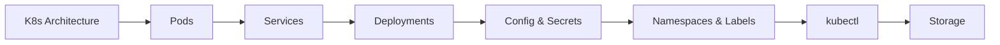
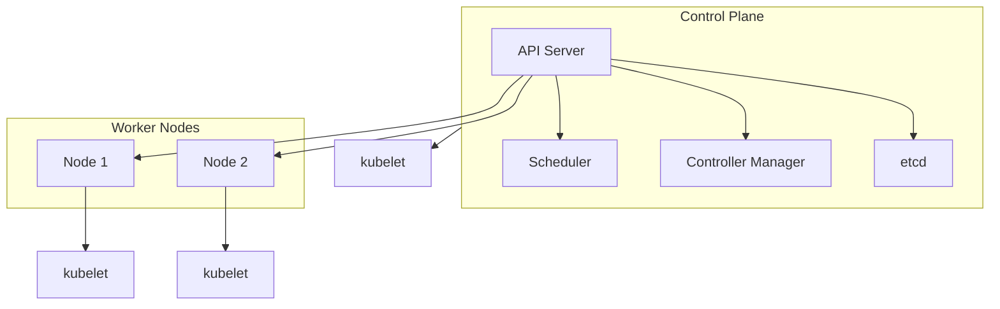

---
slug: /06-docker-k8s-cloud/kubernetes-basics
title: "Kubernetes Basics"
sidebar_label: "Kubernetes Basics"
sidebar_position: 4
---

# Kubernetes Basics � Pods, Services, and Deployments

## Learning Objectives

| Objective | Description |
|-----------|-------------|
| LO1 | Understand Kubernetes architecture: control plane, nodes, and core components |
| LO2 | Deploy and manage Pods as the smallest deployable units |
| LO3 | Create Services for stable networking and service discovery |
| LO4 | Use Deployments for declarative updates and rollbacks |
| LO5 | Configure ConfigMaps and Secrets for configuration management |
| LO6 | Explore the Kubernetes ecosystem: kubectl, namespaces, labels |

## Introduction

Containers and cloud platforms are where AI models live in production. Docker packages your model, Kubernetes orchestrates it, and cloud platforms scale it. This module covers the full deployment stack.


## Prerequisites

- Basic programming knowledge
- Understanding of data structures

## Key Terminology

**Key Terms**: Core vocabulary and concepts for this topic.

**Definition**: Essential terms you must know for interviews and production work.

## Theory

Understanding kubernetes basics is fundamental for AI engineers. This section covers the core concepts, underlying principles, and theoretical framework that govern how kubernetes basics works in practice.


## Examples

### Basic Example

```python
# Basic kubernetes basics example
def example():
    """Demonstrate kubernetes basics"""
    result = "Hello, kubernetes basics!"
    print(result)
    return result

example()
```


## Overview
### Expected Output

```text
Hello, kubernetes basics!
```text

## Chapter at a Glance

| Section | Topic | Key Concept |
|---------|-------|-------------|
| 4.1 | Kubernetes Architecture | Control plane, nodes, etcd, kubelet, kube-proxy |
| 4.2 | Pods | Smallest unit, multi-container patterns, lifecycle |
| 4.3 | Services | ClusterIP, NodePort, LoadBalancer, DNS |
| 4.4 | Deployments | ReplicaSets, rolling updates, rollbacks |
| 4.5 | ConfigMaps and Secrets | Decouple config from container images |
| 4.6 | Namespaces and Labels | Multi-tenancy, organization, selectors |
| 4.7 | kubectl Essentials | Imperative and declarative management |
| 4.8 | Storage Basics | Volumes, PersistentVolumes, PVCs |

## Chapter Roadmap



## 4.1 Kubernetes Architecture

Kubernetes (K8s) is an open-source container orchestration platform that automates deployment, scaling, and management of containerized applications.

**Control Plane components**:



| Component | Role |
|-----------|------|
| API Server | Entry point for all management requests via REST API |
| Scheduler | Assigns Pods to nodes based on resource availability |
| Controller Manager | Runs controllers: replication, node, endpoints |
| etcd | Distributed key-value store � cluster source of truth |

**Node components**: kubelet (ensures containers run), kube-proxy (networking and load balancing), container runtime (containerd, CRI-O).

```bash
kubectl cluster-info
kubectl get nodes
kubectl get pods -n kube-system
```

## 4.2 Pods

A Pod is the smallest deployable unit � one or more containers sharing network, storage, and lifecycle.

```yaml
apiVersion: v1
kind: Pod
metadata:
  name: nginx-pod
  labels:
    app: web
spec:
  containers:
    - name: nginx
      image: nginx:alpine
      ports:
        - containerPort: 80
      resources:
        requests:
          memory: 64Mi
          cpu: 250m
        limits:
          memory: 128Mi
          cpu: 500m
```

```bash
kubectl apply -f pod.yaml
kubectl get pods
kubectl describe pod nginx-pod
kubectl exec -it nginx-pod -- sh
kubectl port-forward pod/nginx-pod 8080:80
kubectl delete pod nginx-pod
```

**Multi-container patterns**: Sidecar (log collector), Ambassador (proxy), Adapter (transform output).

**Pod lifecycle**: Pending -> Running -> Succeeded/Failed -> Deleted.

## 4.3 Services

Services provide stable networking for ephemeral Pods.

```yaml
apiVersion: v1
kind: Service
metadata:
  name: web-service
spec:
  selector:
    app: web
  ports:
    - protocol: TCP
      port: 80
      targetPort: 80
  type: ClusterIP
```

| Type | Accessibility | Use Case |
|------|--------------|----------|
| ClusterIP | Internal cluster only | Backend services |
| NodePort | External via node IP:port | Development testing |
| LoadBalancer | External via cloud LB | Production web |
| ExternalName | DNS alias | External integration |

```bash
kubectl apply -f service.yaml
kubectl get svc
kubectl run test --image=alpine --rm -it -- sh

## Inside: wget -qO- http://web-service
```

**DNS**: CoreDNS creates records like <service>.<namespace>.svc.cluster.local.

## 4.4 Deployments

Deployments provide declarative updates for Pods via ReplicaSets.

```yaml
apiVersion: apps/v1
kind: Deployment
metadata:
  name: web-deployment
spec:
  replicas: 3
  selector:
    matchLabels:
      app: web
  template:
    metadata:
      labels:
        app: web
    spec:
      containers:
        - name: nginx
          image: nginx:alpine
          ports:
            - containerPort: 80
```

```bash
kubectl apply -f deployment.yaml
kubectl scale deployment web-deployment --replicas=5
kubectl set image deployment/web-deployment nginx=nginx:1.25-alpine
kubectl rollout status deployment/web-deployment
kubectl rollout undo deployment/web-deployment
kubectl rollout history deployment/web-deployment
```

**Rolling update**: Creates new ReplicaSet, gradually scales it up while scaling down the old one. Controlled by maxSurge and maxUnavailable.

## 4.5 ConfigMaps and Secrets

ConfigMaps store non-sensitive config; Secrets store sensitive data (base64 encoded).

```yaml
apiVersion: v1
kind: ConfigMap
metadata:
  name: app-config
data:
  APP_ENV: production
  LOG_LEVEL: info
```

```yaml
apiVersion: v1
kind: Secret
metadata:
  name: app-secret
type: Opaque
data:
  DB_PASSWORD: cGFzc3dvcmQ=
```

```bash
kubectl create configmap app-config --from-literal=APP_ENV=production
kubectl create secret generic db-secret --from-literal=password=secret
```

Pods consume these via envFrom, valueFrom, or volume mounts.

## 4.6 Namespaces and Labels

Namespaces isolate resources within a cluster. Labels organize and select resources.

```bash
kubectl create namespace staging
kubectl get pods -n staging
kubectl get pods -l app=web
kubectl get pods -l 'environment in (production,staging)'
```

Annotations store non-identifying metadata (build info, contact).

## 4.7 kubectl Essentials

Common commands: apply, delete, get, describe, logs, exec, port-forward, cp, top.

```bash
kubectl apply -f deployment.yaml
kubectl describe pod nginx-pod
kubectl logs pod-name
kubectl exec -it pod-name -- sh
kubectl port-forward pod-name 8080:80
kubectl top nodes
kubectl top pods
```

## 4.8 Storage Basics

Volumes attach storage to Pods. PersistentVolumes (PV) are cluster storage resources. PersistentVolumeClaims (PVC) request storage.

```yaml
apiVersion: v1
kind: PersistentVolumeClaim
metadata:
  name: pvc-data
spec:
  accessModes:
    - ReadWriteOnce
  resources:
    requests:
      storage: 5Gi
```

| Volume Type | Use Case |
|-------------|----------|
| emptyDir | Temporary scratch |
| hostPath | DaemonSet logs |
| configMap | Config files |
| secret | Credentials |
| PVC | Databases |

---

## TypeScript Parallel

TypeScript can manage Kubernetes programmatically with @kubernetes/client-node:

```typescript
import * as k8s from "@kubernetes/client-node";

const kc = new k8s.KubeConfig();
kc.loadFromDefault();
const api = kc.makeApiClient(k8s.AppsV1Api);

async function deploy(name: string, image: string, replicas: number) {
  const deployment = {
    apiVersion: "apps/v1",
    kind: "Deployment",
    metadata: { name },
    spec: {
      replicas,
      selector: { matchLabels: { app: name } },
      template: {
        metadata: { labels: { app: name } },
        spec: { containers: [{ name, image }] },
      },
    },
  };
  await api.createNamespacedDeployment("default", deployment);
}
```

---

## Summary

- Kubernetes has a control plane (API server, scheduler, controller manager, etcd) and worker nodes (kubelet, kube-proxy, container runtime)
- Pods are the smallest deployable unit � one or more containers sharing network and storage
- Services provide stable networking via ClusterIP, NodePort, or LoadBalancer
- Deployments manage ReplicaSets with rolling updates, scaling, and rollbacks
- ConfigMaps store non-sensitive config; Secrets store sensitive data (base64 encoded)
- Namespaces enable multi-tenancy; labels organize and select resources
- kubectl is the primary CLI for declarative (apply) and imperative management
- PersistentVolumes and PVCs provide durable storage independent of Pod lifecycle
- CoreDNS enables DNS-based service discovery within the cluster
- Health checks (liveness, readiness probes) ensure application reliability

## Practical Takeaways

| Scenario | Do This | Avoid This |
|----------|---------|------------|
| Quick test | kubectl run --image | Writing full YAML for experiments |
| Production app | Declarative YAML with Deployment + Service | Imperative commands only |
| Configuration | ConfigMap + Secret | Hardcoding in images |
| Persistent data | PVC for databases | emptyDir for persistent storage |
| Multi-tenancy | Namespaces with ResourceQuotas | Single namespace for everything |
| Updates | Rolling update with health checks | Deleting all Pods at once |
| Debugging | kubectl describe + kubectl logs | Guessing the problem |
| Resources | Always set requests and limits | Running unbounded containers |

## Interview Q&A

<details class="tp-qa-card" data-qid="docker-s04-q1">
  <summary class="tp-qa-question">
    <span class="tp-qa-status"></span>
    Q1: What are the main components of the Kubernetes control plane?
  </summary>
  <div class="tp-qa-answer">
    <p>Four components: API Server (front-end REST interface), etcd (distributed key-value store for cluster state), Scheduler (assigns Pods to nodes), Controller Manager (runs controller processes for replication, node management, endpoints).</p>
  </div>
  <button class="tp-qa-mark-btn">&#x2705; Mark Reviewed</button>
  <button class="tp-qa-bookmark-btn">&#x1F516; Bookmark</button>
</details>

<details class="tp-qa-card" data-qid="docker-s04-q2">
  <summary class="tp-qa-question">
    <span class="tp-qa-status"></span>
    Q2: What is a Pod and what are multi-container Pod patterns?
  </summary>
  <div class="tp-qa-answer">
    <p>A Pod is the smallest deployable unit � one or more containers sharing network namespace, storage volumes, and lifecycle. Multi-container patterns include Sidecar (helper containers like log collectors), Ambassador (proxies external services), and Adapter (transforms output format).</p>
  </div>
  <button class="tp-qa-mark-btn">&#x2705; Mark Reviewed</button>
  <button class="tp-qa-bookmark-btn">&#x1F516; Bookmark</button>
</details>

<details class="tp-qa-card" data-qid="docker-s04-q3">
  <summary class="tp-qa-question">
    <span class="tp-qa-status"></span>
    Q3: Explain the different Service types in Kubernetes.
  </summary>
  <div class="tp-qa-answer">
    <p>ClusterIP (default): internal cluster-only IP. NodePort: exposes on each node's IP at a static port (30000-32767). LoadBalancer: provisions a cloud load balancer. ExternalName: returns a CNAME record instead of proxying.</p>
  </div>
  <button class="tp-qa-mark-btn">&#x2705; Mark Reviewed</button>
  <button class="tp-qa-bookmark-btn">&#x1F516; Bookmark</button>
</details>

<details class="tp-qa-card" data-qid="docker-s04-q4">
  <summary class="tp-qa-question">
    <span class="tp-qa-status"></span>
    Q4: How do Deployments handle rolling updates?
  </summary>
  <div class="tp-qa-answer">
    <p>When the Pod template changes, the Deployment creates a new ReplicaSet and gradually scales it up while scaling down the old one. maxSurge controls extra Pods during update; maxUnavailable controls how many can be unavailable. If health checks fail, the rollout pauses.</p>
  </div>
  <button class="tp-qa-mark-btn">&#x2705; Mark Reviewed</button>
  <button class="tp-qa-bookmark-btn">&#x1F516; Bookmark</button>
</details>

<details class="tp-qa-card" data-qid="docker-s04-q5">
  <summary class="tp-qa-question">
    <span class="tp-qa-status"></span>
    Q5: What is the difference between ConfigMap and Secret?
  </summary>
  <div class="tp-qa-answer">
    <p>ConfigMap stores non-sensitive configuration in plain text. Secret stores sensitive data base64-encoded. Kubernetes applies additional security to Secrets: encryption at rest, stricter RBAC, and only distributed to nodes that need them.</p>
  </div>
  <button class="tp-qa-mark-btn">&#x2705; Mark Reviewed</button>
  <button class="tp-qa-bookmark-btn">&#x1F516; Bookmark</button>
</details>

<details class="tp-qa-card" data-qid="docker-s04-q6">
  <summary class="tp-qa-question">
    <span class="tp-qa-status"></span>
    Q6: How does service discovery work in Kubernetes?
  </summary>
  <div class="tp-qa-answer">
    <p>CoreDNS creates DNS records for every Service. Pattern: <service>.<namespace>.svc.cluster.local. Pods can resolve services by name within the same namespace, or by full DNS name across namespaces.</p>
  </div>
  <button class="tp-qa-mark-btn">&#x2705; Mark Reviewed</button>
  <button class="tp-qa-bookmark-btn">&#x1F516; Bookmark</button>
</details>

<details class="tp-qa-card" data-qid="docker-s04-q7">
  <summary class="tp-qa-question">
    <span class="tp-qa-status"></span>
    Q7: Explain kubectl apply vs kubectl create.
  </summary>
  <div class="tp-qa-answer">
    <p>kubectl apply is declarative � creates or updates resources based on desired state. Idempotent and safe to run multiple times. kubectl create is imperative � creates new resources but fails if they already exist. Best practice: use apply for production.</p>
  </div>
  <button class="tp-qa-mark-btn">&#x2705; Mark Reviewed</button>
  <button class="tp-qa-bookmark-btn">&#x1F516; Bookmark</button>
</details>

<details class="tp-qa-card" data-qid="docker-s04-q8">
  <summary class="tp-qa-question">
    <span class="tp-qa-status"></span>
    Q8: What are Kubernetes namespaces used for?
  </summary>
  <div class="tp-qa-answer">
    <p>Namespaces provide virtual cluster isolation within a physical cluster. Use cases: environment isolation (dev/staging/prod), team separation, resource quotas per namespace, and network policies between namespaces.</p>
  </div>
  <button class="tp-qa-mark-btn">&#x2705; Mark Reviewed</button>
  <button class="tp-qa-bookmark-btn">&#x1F516; Bookmark</button>
</details>

<details class="tp-qa-card" data-qid="docker-s04-q9">
  <summary class="tp-qa-question">
    <span class="tp-qa-status"></span>
    Q9: How do PV and PVC work together?
  </summary>
  <div class="tp-qa-answer">
    <p>PersistentVolume (PV) is cluster storage provisioned by an admin. PersistentVolumeClaim (PVC) is a user request for storage. Kubernetes binds PVCs to matching PVs based on size and access mode. Pods use PVCs as volumes � if the Pod is deleted, the PVC and PV persist, preserving data.</p>
  </div>
  <button class="tp-qa-mark-btn">&#x2705; Mark Reviewed</button>
  <button class="tp-qa-bookmark-btn">&#x1F516; Bookmark</button>
</details>

<details class="tp-qa-card" data-qid="docker-s04-q10">
  <summary class="tp-qa-question">
    <span class="tp-qa-status"></span>
    Q10: How do you debug a Pod stuck in Pending state?
  </summary>
  <div class="tp-qa-answer">
    <p>Use kubectl describe pod to check events and conditions. Common causes: insufficient node resources, resource requests exceeding node capacity, node selector/affinity mismatch, taints without tolerations, unbound PVC.</p>
  </div>
  <button class="tp-qa-mark-btn">&#x2705; Mark Reviewed</button>
  <button class="tp-qa-bookmark-btn">&#x1F516; Bookmark</button>
</details>

## Chapter Quiz

**Q1**: Which component stores the cluster's source of truth?

a) API Server
b) etcd
c) Scheduler
d) Controller Manager

<details class="tp-qa-card" data-qid="docker-s04-quiz1"><summary>Show Answer</summary><div class="tp-qa-answer"><p><strong>Answer: b) etcd</strong></p></div></details>

**Q2**: What is the smallest deployable unit in Kubernetes?

a) Container
b) Pod
c) Node
d) Service

<details class="tp-qa-card" data-qid="docker-s04-quiz2"><summary>Show Answer</summary><div class="tp-qa-answer"><p><strong>Answer: b) Pod</strong></p></div></details>

**Q3**: Which Service type exposes on each node at a static port?

a) ClusterIP
b) NodePort
c) LoadBalancer
d) ExternalName

<details class="tp-qa-card" data-qid="docker-s04-quiz3"><summary>Show Answer</summary><div class="tp-qa-answer"><p><strong>Answer: b) NodePort</strong></p></div></details>

**Q4**: Which command provides detailed resource info including events?

a) kubectl get
b) kubectl describe
c) kubectl logs
d) kubectl inspect

<details class="tp-qa-card" data-qid="docker-s04-quiz4"><summary>Show Answer</summary><div class="tp-qa-answer"><p><strong>Answer: b) kubectl describe</strong></p></div></details>

**Q5**: What controls how many extra Pods can run during a rolling update?

a) maxSurge
b) maxUnavailable
c) minReadySeconds
d) revisionHistoryLimit

<details class="tp-qa-card" data-qid="docker-s04-quiz5"><summary>Show Answer</summary><div class="tp-qa-answer"><p><strong>Answer: a) maxSurge</strong></p></div></details>

## Exercises

**Easy** � Create a single Nginx Pod with a NodePort Service on port 30080. Verify you can access it.

**Medium** � Write a Deployment for a FastAPI app with 3 replicas, resource limits, liveness/readiness probes, and a ClusterIP Service.

**Medium** � Create a multi-tier app: frontend Deployment with LoadBalancer Service, backend Deployment with ClusterIP Service, PostgreSQL StatefulSet with PVC.

**Hard** � Set up a namespace with ResourceQuota (2 CPU, 4Gi memory limit). Deploy an app exceeding the quota and observe behavior.

**Hard** � Debug a failing Deployment: given one that crashes on startup (wrong image, missing ConfigMap, resource limits too low), use kubectl describe and logs to identify and fix all issues.


---


## Common Mistakes

1. Not understanding the fundamental concepts before applying them
2. Skipping edge cases in implementation
3. Not analyzing time/space complexity
4. Forgetting to handle null/empty inputs
5. Not practicing enough problems to build pattern recognition

## Revision Notes

- - Core principle: Understand the fundamental concepts thoroughly
- - Implementation pattern: Practice with real code examples
- - Complexity: Know the time and space complexity
- - Application: Know when to use this in production systems
- - Interview: Frequently asked in technical interviews
- - Edge cases: Consider common failure scenarios
- - Related concepts: Connect to broader system design
