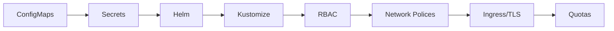

---
slug: /06-docker-k8s-cloud/kubernetes-config
title: "Kubernetes Config"
sidebar_label: "Kubernetes Config"
sidebar_position: 5
---

# Kubernetes Configuration — ConfigMaps, Secrets, and Helm

## Learning Objectives

| Objective | Description |
|-----------|-------------|
| LO1 | Manage application configuration with ConfigMaps and Secrets |
| LO2 | Inject configuration into Pods via env vars and volumes |
| LO3 | Understand Helm charts for package management |
| LO4 | Use Kustomize for environment-specific overlays |
| LO5 | Implement RBAC, service accounts, network policies |
| LO6 | Manage TLS certificates and Ingress resources |

## Introduction

Containers and cloud platforms are where AI models live in production. Docker packages your model, Kubernetes orchestrates it, and cloud platforms scale it. This module covers the full deployment stack.


## Prerequisites

- Basic programming knowledge
- Understanding of data structures

## Key Terminology

**Key Terms**: Core vocabulary and concepts for this topic.

**Definition**: Essential terms you must know for interviews and production work.

## Theory

Understanding kubernetes config is fundamental for AI engineers. This section covers the core concepts, underlying principles, and theoretical framework that govern how kubernetes config works in practice.


## Chapter at a Glance

| Section | Topic | Key Concept |
|---------|-------|-------------|
| 5.1 | ConfigMaps in Depth | Create, consume, update strategies |
| 5.2 | Secrets Management | Encryption, external stores |
| 5.3 | Helm Package Manager | Charts, releases, repositories |
| 5.4 | Kustomize | Base/overlay, patches |
| 5.5 | RBAC and Service Accounts | Roles, bindings |
| 5.6 | Network Policies | Ingress/egress rules |
| 5.7 | Ingress and TLS | Ingress controller, cert-manager |
| 5.8 | Resource Quotas | LimitRange, ResourceQuota |

## Chapter Roadmap



## 5.1 ConfigMaps in Depth

ConfigMaps decouple configuration from container images.

```bash
kubectl create configmap app-config --from-literal=APP_ENV=production
kubectl create configmap app-config --from-file=config.json
kubectl create configmap app-config --from-env-file=.env
```

**Consumption**:

```yaml
spec:
  containers:
    - name: app
      envFrom:
        - configMapRef:
            name: app-config
      volumeMounts:
        - name: config
          mountPath: /etc/config
  volumes:
    - name: config
      configMap:
        name: app-config
```

Updates: env vars require Pod restart; volume mounts sync within ~2 minutes.

## 5.2 Secrets Management

Secrets are base64 encoded. Use encryption at rest for production.

```bash
kubectl create secret generic db-secret --from-literal=password=secret
kubectl create secret docker-registry regcred --docker-server=registry.example.com --docker-username=user --docker-password=pass
```

**External Secrets Operator**:

```yaml
apiVersion: external-secrets.io/v1beta1
kind: ExternalSecret
spec:
  secretStoreRef:
    name: aws-parameter-store
  target:
    name: app-secret
  data:
    - secretKey: DB_PASSWORD
      remoteRef:
        key: /production/db/password
```

**Sealed Secrets**: Encrypt with kubeseal for safe Git storage.

## 5.3 Helm Package Manager

```bash
helm repo add bitnami https://charts.bitnami.com/bitnami
helm install my-release bitnami/nginx --set service.type=LoadBalancer
helm list
helm upgrade my-release -f values-prod.yaml
helm rollback my-release 1
helm uninstall my-release
```

**Chart structure**: Chart.yaml, values.yaml, templates/, charts/.

## 5.4 Kustomize

```yaml

## base/kustomization.yaml
apiVersion: kustomize.config.k8s.io/v1beta1
kind: Kustomization
resources:
  - deployment.yaml
commonLabels:
  app: my-app
```

```bash
kubectl apply -k overlays/production/
```

## 5.5 RBAC and Service Accounts

```yaml
apiVersion: rbac.authorization.k8s.io/v1
kind: Role
metadata:
  name: pod-reader
rules:
  - apiGroups: [""]
    resources: ["pods"]
    verbs: ["get", "list", "watch"]
---
apiVersion: v1
kind: ServiceAccount
metadata:
  name: my-app-sa
```

## 5.6 Network Policies

```yaml
apiVersion: networking.k8s.io/v1
kind: NetworkPolicy
metadata:
  name: api-policy
spec:
  podSelector:
    matchLabels:
      app: api
  ingress:
    - from:
        - podSelector:
            matchLabels:
              app: frontend
      ports:
        - port: 8000
```

## 5.7 Ingress and TLS

```yaml
apiVersion: networking.k8s.io/v1
kind: Ingress
metadata:
  annotations:
    cert-manager.io/cluster-issuer: letsencrypt-prod
spec:
  ingressClassName: nginx
  tls:
    - hosts:
        - app.example.com
      secretName: app-tls
  rules:
    - host: app.example.com
      http:
        paths:
          - path: /api
            pathType: Prefix
            backend:
              service:
                name: api-service
                port:
                  number: 8000
```

## 5.8 Resource Quotas and Limits

```yaml
apiVersion: v1
kind: LimitRange
metadata:
  name: resource-limits
spec:
  limits:
    - default:
        cpu: 500m
        memory: 512Mi
      defaultRequest:
        cpu: 200m
        memory: 256Mi
---
apiVersion: v1
kind: ResourceQuota
metadata:
  name: compute-quota
spec:
  hard:
    requests.cpu: "4"
    requests.memory: 8Gi
    pods: "10"
```

---

## TypeScript Parallel

```typescript
function generateDeployment(name: string, image: string, replicas: number): string {
  const lines = [
    "apiVersion: apps/v1",
    "kind: Deployment",
    "metadata:",
    "  name: " + name,
    "spec:",
    "  replicas: " + replicas,
  ];
  return lines.join("\n");
}
```

---

## Summary

- ConfigMaps store non-sensitive config; consumed as env vars or volume mounts
- Secrets are base64-encoded; use encryption at rest and external stores
- Helm packages resources into versioned charts with templates
- Kustomize customizes YAML through overlays/patches without templating
- RBAC uses Roles/RoleBindings and ClusterRoles/ClusterRoleBindings
- ServiceAccounts provide Pod identity for API auth
- Network Policies control traffic based on selectors and ports
- Ingress routes HTTP/HTTPS; cert-manager automates TLS
- ResourceQuota caps namespace usage; LimitRange sets per-container defaults
- PriorityClass determines scheduling priority

## Practical Takeaways

| Scenario | Do This | Avoid This |
|----------|---------|------------|
| Configuration | ConfigMap + Volume Mount | Hardcoding in image |
| Secrets in Git | Sealed Secrets | Plain text in repo |
| Multi-env | Kustomize overlays | Copy-pasted manifests |
| Distribution | Helm chart repo | Raw YAML |
| Permissions | Dedicated ServiceAccount | Default SA |
| TLS | cert-manager | Manual certs |
| Resources | ResourceQuota + LimitRange | No limits |
| Traffic | Network Policies | Default allow-all |

## Interview Q&A

<details class="tp-qa-card" data-qid="docker-s05-q1">
  <summary class="tp-qa-question"><span class="tp-qa-status"></span> Q1: ConfigMap vs Secret?</summary>
  <div class="tp-qa-answer"><p>ConfigMap: non-sensitive plain text. Secret: base64-encoded sensitive data with encryption at rest and stricter RBAC.</p></div>
  <button class="tp-qa-mark-btn">&#x2705; Mark Reviewed</button>
  <button class="tp-qa-bookmark-btn">&#x1F516; Bookmark</button>
</details>

<details class="tp-qa-card" data-qid="docker-s05-q2">
  <summary class="tp-qa-question"><span class="tp-qa-status"></span> Q2: Helm chart structure?</summary>
  <div class="tp-qa-answer"><p>Chart.yaml, values.yaml, templates/ (Go templates), charts/ (sub-charts). Installed as releases with version history.</p></div>
  <button class="tp-qa-mark-btn">&#x2705; Mark Reviewed</button>
  <button class="tp-qa-bookmark-btn">&#x1F516; Bookmark</button>
</details>

<details class="tp-qa-card" data-qid="docker-s05-q3">
  <summary class="tp-qa-question"><span class="tp-qa-status"></span> Q3: Kustomize vs Helm?</summary>
  <div class="tp-qa-answer"><p>Helm: Go templating, logic, sub-charts. Kustomize: pure YAML patches, base/overlay pattern. Kustomize built into kubectl.</p></div>
  <button class="tp-qa-mark-btn">&#x2705; Mark Reviewed</button>
  <button class="tp-qa-bookmark-btn">&#x1F516; Bookmark</button>
</details>

<details class="tp-qa-card" data-qid="docker-s05-q4">
  <summary class="tp-qa-question"><span class="tp-qa-status"></span> Q4: RBAC resource types?</summary>
  <div class="tp-qa-answer"><p>Role (namespace), ClusterRole (cluster-wide), RoleBinding, ClusterRoleBinding.</p></div>
  <button class="tp-qa-mark-btn">&#x2705; Mark Reviewed</button>
  <button class="tp-qa-bookmark-btn">&#x1F516; Bookmark</button>
</details>

<details class="tp-qa-card" data-qid="docker-s05-q5">
  <summary class="tp-qa-question"><span class="tp-qa-status"></span> Q5: ServiceAccount purpose?</summary>
  <div class="tp-qa-answer"><p>Pod identity for Kubernetes API authentication. Used by CI/CD, operators, apps.</p></div>
  <button class="tp-qa-mark-btn">&#x2705; Mark Reviewed</button>
  <button class="tp-qa-bookmark-btn">&#x1F516; Bookmark</button>
</details>

<details class="tp-qa-card" data-qid="docker-s05-q6">
  <summary class="tp-qa-question"><span class="tp-qa-status"></span> Q6: Network Policies?</summary>
  <div class="tp-qa-answer"><p>Firewall rules for Pods using podSelector, policyTypes, ingress/egress rules. Adding a policy denies unallowed traffic.</p></div>
  <button class="tp-qa-mark-btn">&#x2705; Mark Reviewed</button>
  <button class="tp-qa-bookmark-btn">&#x1F516; Bookmark</button>
</details>

<details class="tp-qa-card" data-qid="docker-s05-q7">
  <summary class="tp-qa-question"><span class="tp-qa-status"></span> Q7: cert-manager workflow?</summary>
  <div class="tp-qa-answer"><p>ClusterIssuer -> watch Ingress annotations -> solve ACME challenge -> store cert as Secret -> Ingress uses Secret.</p></div>
  <button class="tp-qa-mark-btn">&#x2705; Mark Reviewed</button>
  <button class="tp-qa-bookmark-btn">&#x1F516; Bookmark</button>
</details>

<details class="tp-qa-card" data-qid="docker-s05-q8">
  <summary class="tp-qa-question"><span class="tp-qa-status"></span> Q8: ResourceQuota vs LimitRange?</summary>
  <div class="tp-qa-answer"><p>ResourceQuota: namespace aggregate caps. LimitRange: per-container defaults and min/max.</p></div>
  <button class="tp-qa-mark-btn">&#x2705; Mark Reviewed</button>
  <button class="tp-qa-bookmark-btn">&#x1F516; Bookmark</button>
</details>

<details class="tp-qa-card" data-qid="docker-s05-q9">
  <summary class="tp-qa-question"><span class="tp-qa-status"></span> Q9: Secrets in GitOps?</summary>
  <div class="tp-qa-answer"><p>Sealed Secrets (encrypt with kubeseal), External Secrets Operator, SOPS with Flux/ArgoCD. Never raw secrets in Git.</p></div>
  <button class="tp-qa-mark-btn">&#x2705; Mark Reviewed</button>
  <button class="tp-qa-bookmark-btn">&#x1F516; Bookmark</button>
</details>

<details class="tp-qa-card" data-qid="docker-s05-q10">
  <summary class="tp-qa-question"><span class="tp-qa-status"></span> Q10: How does Ingress work?</summary>
  <div class="tp-qa-answer"><p>Ingress resource defines routing rules. Ingress controller configures proxy. Traffic routes to correct Service based on host/path.</p></div>
  <button class="tp-qa-mark-btn">&#x2705; Mark Reviewed</button>
  <button class="tp-qa-bookmark-btn">&#x1F516; Bookmark</button>
</details>

## Chapter Quiz

**Q1**: Which stores non-sensitive config?

a) Secret
b) ConfigMap
c) EnvironmentConfig
d) ConfigResource

<details class="tp-qa-card" data-qid="docker-s05-quiz1"><summary>Show Answer</summary><div class="tp-qa-answer"><p><strong>Answer: b) ConfigMap</strong></p></div></details>

**Q2**: What encrypts Secrets for Git?

a) Helm
b) Kustomize
c) Sealed Secrets
d) cert-manager

<details class="tp-qa-card" data-qid="docker-s05-quiz2"><summary>Show Answer</summary><div class="tp-qa-answer"><p><strong>Answer: c) Sealed Secrets</strong></p></div></details>

**Q3**: Which command installs a Helm chart?

a) helm deploy
b) helm install
c) helm apply
d) helm create

<details class="tp-qa-card" data-qid="docker-s05-quiz3"><summary>Show Answer</summary><div class="tp-qa-answer"><p><strong>Answer: b) helm install</strong></p></div></details>

**Q4**: What does a ServiceAccount provide?

a) Store credentials
b) Pod identity for API auth
c) Create users
d) Manage traffic

<details class="tp-qa-card" data-qid="docker-s05-quiz4"><summary>Show Answer</summary><div class="tp-qa-answer"><p><strong>Answer: b) Pod identity for API auth</strong></p></div></details>

**Q5**: What controls Pod-to-Pod traffic?

a) Ingress
b) NetworkPolicy
c) Service
d) Gateway

<details class="tp-qa-card" data-qid="docker-s05-quiz5"><summary>Show Answer</summary><div class="tp-qa-answer"><p><strong>Answer: b) NetworkPolicy</strong></p></div></details>

## Exercises

**Easy** — Create a ConfigMap with 3 env vars. Mount into a Pod. Verify readable.

**Medium** — Write a Helm chart for a web app with configurable replica count and image tag. Install and upgrade.

**Medium** — Create Kustomize base + two overlays (dev, prod). Prod has more replicas and different config.

**Hard** — Set up: ServiceAccount with RBAC, NetworkPolicy, Ingress with TLS, ResourceQuota on namespace.

**Hard** — Migrate raw YAML manifests to Helm charts. Add DB dependency. Create CI pipeline.

## Advanced Helm Patterns

**Dependency management**: Helm charts can depend on other charts using the `dependencies` field in Chart.yaml.

```yaml

## Chart.yaml
dependencies:
  - name: postgresql
    version: "12.x"
    repository: "https://charts.bitnami.com/bitnami"
    condition: postgresql.enabled
    alias: db

## Install with dependencies

## helm dependency update

## helm install my-release . --set db.postgresql.enabled=true
```

**Go template functions in Helm templates**:

```yaml

## templates/configmap.yaml
apiVersion: v1
kind: ConfigMap
metadata:
  name: {{ .Release.Name }}-config
  labels:
    app.kubernetes.io/managed-by: {{ .Release.Service }}
    app.kubernetes.io/instance: {{ .Release.Name }}
data:
  APP_ENV: {{ .Values.environment | default "production" | quote }}
  APP_VERSION: {{ .Chart.AppVersion | quote }}
  REPLICA_COUNT: {{ .Values.replicaCount | toString | quote }}
  {{- if .Values.features.metrics }}
  METRICS_ENABLED: "true"
  {{- end }}
```

**Helm hooks** for lifecycle management:

```yaml

## templates/migration-job.yaml
apiVersion: batch/v1
kind: Job
metadata:
  name: {{ .Release.Name }}-db-migrate
  annotations:
    "helm.sh/hook": pre-upgrade,pre-install
    "helm.sh/hook-weight": "-5"
    "helm.sh/hook-delete-policy": hook-succeeded
spec:
  template:
    spec:
      restartPolicy: Never
      containers:
        - name: migrate
          image: "{{ .Values.image.repository }}:{{ .Values.image.tag }}"
          command: ["python", "manage.py", "migrate"]
```

## Pod Security Standards

**Pod Security Admission** (replaces PSP in K8s 1.25+):

```yaml
apiVersion: v1
kind: Namespace
metadata:
  name: secure-ns
  labels:
    pod-security.kubernetes.io/enforce: restricted
    pod-security.kubernetes.io/audit: restricted
    pod-security.kubernetes.io/warn: baseline
```

**Security context best practices**:

```yaml
apiVersion: v1
kind: Pod
metadata:
  name: secure-pod
spec:
  securityContext:
    runAsNonRoot: true
    runAsUser: 1000
    fsGroup: 2000
    seccompProfile:
      type: RuntimeDefault
  containers:
    - name: app
      image: myapp:latest
      securityContext:
        allowPrivilegeEscalation: false
        capabilities:
          drop: ["ALL"]
        readOnlyRootFilesystem: true
```

## Common Troubleshooting Commands

| Command | Purpose |
|---------|---------|
| `kubectl describe pod <name>` | Detailed pod status and events |
| `kubectl logs <pod> -c <container>` | View container logs |
| `kubectl exec -it <pod> -- sh` | Shell into container |
| `kubectl get events --sort-by=.lastTimestamp` | View cluster events |
| `kubectl top pod` | Resource usage metrics |
| `kubectl get all -n <ns>` | All resources in namespace |

---


## Common Mistakes

1. Not understanding the fundamental concepts before applying them
2. Skipping edge cases in implementation
3. Not analyzing time/space complexity
4. Forgetting to handle null/empty inputs
5. Not practicing enough problems to build pattern recognition

## Revision Notes

- - Core principle: Understand the fundamental concepts thoroughly
- - Implementation pattern: Practice with real code examples
- - Complexity: Know the time and space complexity
- - Application: Know when to use this in production systems
- - Interview: Frequently asked in technical interviews
- - Edge cases: Consider common failure scenarios
- - Related concepts: Connect to broader system design
