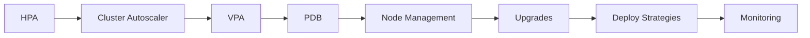
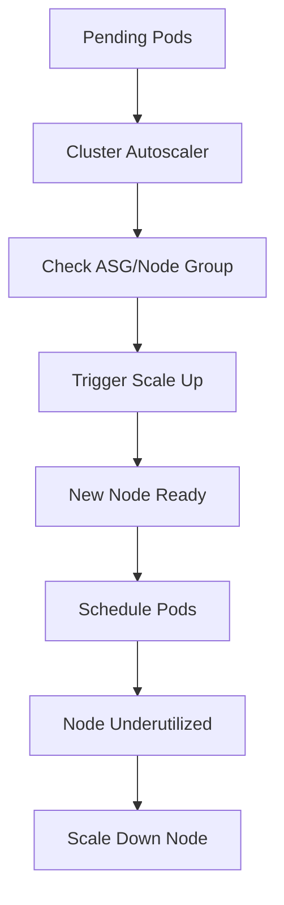

---
slug: /06-docker-k8s-cloud/kubernetes-scaling
title: "Kubernetes Scaling"
sidebar_label: "Kubernetes Scaling"
sidebar_position: 6
---

# Kubernetes Scaling � HPA, Autoscaling, and Cluster Management

## Learning Objectives

| Objective | Description |
|-----------|-------------|
| LO1 | Configure Horizontal Pod Autoscaler for automatic scaling |
| LO2 | Understand Cluster Autoscaler for node-level scaling |
| LO3 | Implement Vertical Pod Autoscaler for resource optimization |
| LO4 | Use Pod Disruption Budgets for high availability |
| LO5 | Manage cluster upgrades and node maintenance |
| LO6 | Implement canary deployments and blue-green strategies |

## Introduction

Containers and cloud platforms are where AI models live in production. Docker packages your model, Kubernetes orchestrates it, and cloud platforms scale it. This module covers the full deployment stack.


## Prerequisites

- Basic programming knowledge
- Understanding of data structures

## Key Terminology

**Key Terms**: Core vocabulary and concepts for this topic.

**Definition**: Essential terms you must know for interviews and production work.

## Theory

Understanding kubernetes scaling is fundamental for AI engineers. This section covers the core concepts, underlying principles, and theoretical framework that govern how kubernetes scaling works in practice.


## Examples

### Basic Example

```python
# Basic kubernetes scaling example
def example():
    """Demonstrate kubernetes scaling"""
    result = "Hello, kubernetes scaling!"
    print(result)
    return result

example()
```


## Overview
### Expected Output

```text
Hello, kubernetes scaling!
```text

## Chapter at a Glance

| Section | Topic | Key Concept |
|---------|-------|-------------|
| 6.1 | Horizontal Pod Autoscaler | CPU/memory based scaling, custom metrics |
| 6.2 | Cluster Autoscaler | Node pool scaling, cloud provider integration |
| 6.3 | Vertical Pod Autoscaler | Resource recommendation, automatic adjustment |
| 6.4 | Pod Disruption Budgets | Minimum available during voluntary disruptions |
| 6.5 | Node Management | Taints, tolerations, cordon, drain |
| 6.6 | Cluster Upgrades | Control plane upgrade, node upgrade strategies |
| 6.7 | Deployment Strategies | Canary, blue-green, rolling, recreate |
| 6.8 | Cluster Monitoring | Metrics Server, Prometheus, dashboard |

## Chapter Roadmap



## 6.1 Horizontal Pod Autoscaler

HPA automatically scales Pod replicas based on observed CPU, memory, or custom metrics.

```yaml
apiVersion: autoscaling/v2
kind: HorizontalPodAutoscaler
metadata:
  name: api-hpa
spec:
  scaleTargetRef:
    apiVersion: apps/v1
    kind: Deployment
    name: api-deployment
  minReplicas: 2
  maxReplicas: 10
  metrics:
    - type: Resource
      resource:
        name: cpu
        target:
          type: Utilization
          averageUtilization: 70
    - type: Resource
      resource:
        name: memory
        target:
          type: Utilization
          averageUtilization: 80
    - type: Pods
      pods:
        metric:
          name: http_requests_per_second
        target:
          type: AverageValue
          averageValue: 1000
```

**How HPA works**: The HPA controller queries the Metrics Server every 15 seconds. It calculates desired replicas as:

```
desiredReplicas = ceil[currentReplicas * (currentMetricValue / desiredMetricValue)]
```

**Custom metrics with Prometheus**:

```yaml
apiVersion: autoscaling/v2
kind: HorizontalPodAutoscaler
spec:
  metrics:
    - type: Object
      object:
        metric:
          name: requests_per_second
        describedObject:
          apiVersion: networking.k8s.io/v1
          kind: Ingress
          name: api-ingress
        target:
          type: Value
          value: 5000
```

```bash
kubectl apply -f hpa.yaml
kubectl get hpa
kubectl describe hpa api-hpa
kubectl get hpa --watch
```

## 6.2 Cluster Autoscaler

Cluster Autoscaler automatically adds or removes nodes based on pending Pods.

```yaml

## AWS EKS Cluster Autoscaler deployment
apiVersion: apps/v1
kind: Deployment
metadata:
  name: cluster-autoscaler
  namespace: kube-system
spec:
  template:
    spec:
      containers:
        - name: cluster-autoscaler
          image: registry.k8s.io/autoscaling/cluster-autoscaler:v1.28
          command:
            - ./cluster-autoscaler
            - --v=4
            - --stderrthreshold=info
            - --cloud-provider=aws
            - --skip-nodes-with-local-storage=false
            - --balance-similar-node-groups
            - --node-group-auto-discovery=asg:tag=k8s.io/cluster-autoscaler/enabled
```

**How it works**:



**Cloud provider configuration**:

```bash

## AWS
aws autoscaling describe-auto-scaling-groups
eksctl scale nodegroup --cluster my-cluster --name workers --nodes 5

## GCP
gcloud container clusters resize my-cluster --node-pool default-pool --num-nodes 5

## AKS
az aks scale --resource-group my-rg --name my-cluster --node-count 5
```

**Node group sizing**: Set min/max nodes per node group. Cluster Autoscaler works within these bounds.

```bash
eksctl create nodegroup --cluster my-cluster --name workers \
    --node-type t3.medium \
    --nodes 3 --nodes-min 1 --nodes-max 10
```

## 6.3 Vertical Pod Autoscaler

VPA recommends or automatically adjusts CPU/memory requests based on historical usage.

```yaml
apiVersion: autoscaling.k8s.io/v1
kind: VerticalPodAutoscaler
metadata:
  name: api-vpa
spec:
  targetRef:
    apiVersion: apps/v1
    kind: Deployment
    name: api-deployment
  updatePolicy:
    updateMode: Auto  # Off, Initial, Auto, Recreate
  resourcePolicy:
    containerPolicies:
      - containerName: '*'
        minAllowed:
          cpu: 100m
          memory: 128Mi
        maxAllowed:
          cpu: 4
          memory: 4Gi
        controlledResources: ["cpu", "memory"]
```

**Update modes**:

| Mode | Behavior |
|------|----------|
| Off | Only provide recommendations |
| Initial | Set requests at creation time only |
| Auto | Update Pods during runtime (eviction) |
| Recreate | Evict and recreate Pods with new requests |

```bash

## Install VPA
git clone https://github.com/kubernetes/autoscaler.git
kubectl apply -k autoscaler/vertical-pod-autoscaler/deploy/

## View VPA recommendations
kubectl describe vpa api-vpa

## Output shows:

## Recommended Pod Resources:

##   cpu: 250m (lower bound: 150m, upper bound: 500m)

##   memory: 512Mi (lower bound: 256Mi, upper bound: 1Gi)
```

## 6.4 Pod Disruption Budgets

PDB limits the number of Pods that can be unavailable during voluntary disruptions (node maintenance, cluster upgrades).

```yaml
apiVersion: policy/v1
kind: PodDisruptionBudget
metadata:
  name: api-pdb
spec:
  minAvailable: 2        # Minimum Pods that must remain available
  # OR
  maxUnavailable: 1       # Maximum Pods that can be unavailable
  selector:
    matchLabels:
      app: api
```

**PDB strategies**:

```yaml

## Critical service � always keep most available
apiVersion: policy/v1
kind: PodDisruptionBudget
metadata:
  name: critical-pdb
spec:
  minAvailable: 80%  # Percentage-based
  selector:
    matchLabels:
      tier: critical

## Batch job � can tolerate disruptions
apiVersion: policy/v1
kind: PodDisruptionBudget
metadata:
  name: batch-pdb
spec:
  maxUnavailable: 50%
  selector:
    matchLabels:
      job: batch-worker
```

```bash
kubectl apply -f pdb.yaml
kubectl get pdb
kubectl describe pdb api-pdb
```

**When PDBs block operations**:

```bash

## If PDB prevents drain, use --disable-eviction
kubectl drain node-1 --ignore-daemonsets --disable-eviction

## Force drain (use with caution)
kubectl drain node-1 --ignore-daemonsets --delete-emptydir-data --force
```

## 6.5 Node Management

**Taints and Tolerations**: Taints repel Pods from nodes; tolerations allow Pods to be scheduled on tainted nodes.

```bash

## Taint a node
kubectl taint nodes node1 key=value:NoSchedule
kubectl taint nodes node1 key=value:NoExecute
kubectl taint nodes node1 key=value:PreferNoSchedule

## Remove taint
kubectl taint nodes node1 key=value:NoSchedule-
```

```yaml

## Pod toleration
apiVersion: v1
kind: Pod
spec:
  tolerations:
    - key: "key"
      operator: "Equal"
      value: "value"
      effect: "NoSchedule"
    - key: "key"
      operator: "Exists"
      effect: "NoExecute"
      tolerationSeconds: 3600
```

**Node selectors and affinity**:

```yaml
apiVersion: apps/v1
kind: Deployment
spec:
  template:
    spec:
      nodeSelector:
        disk-type: ssd
      affinity:
        nodeAffinity:
          requiredDuringSchedulingIgnoredDuringExecution:
            nodeSelectorTerms:
              - matchExpressions:
                  - key: topology.kubernetes.io/zone
                    operator: In
                    values:
                      - us-east-1a
          preferredDuringSchedulingIgnoredDuringExecution:
            - weight: 100
              preference:
                matchExpressions:
                  - key: instance-type
                    operator: In
                    values:
                      - t3.large
```

**Cordon, Drain, and Delete**:

```bash

## Mark node as unschedulable
kubectl cordon node1

## Evict Pods (respects PDBs)
kubectl drain node1 --ignore-daemonsets

## Force drain for testing
kubectl drain node1 --ignore-daemonsets --delete-emptydir-data --force

## Make node schedulable again
kubectl uncordon node1

## Delete node
kubectl delete node node1
```

## 6.6 Cluster Upgrades

**Upgrade strategy**: Upgrade control plane first, then worker nodes.

```bash

## Check current version
kubectl version --short

## Upgrade control plane (EKS)
eksctl upgrade cluster --name my-cluster --version 1.28

## Upgrade node group
eksctl upgrade nodegroup --cluster my-cluster --name workers

## GKE
gcloud container clusters upgrade my-cluster \
    --master --cluster-version 1.28

## AKS
az aks upgrade --resource-group my-rg --name my-cluster --kubernetes-version 1.28
```

**Node upgrade strategies**:

| Strategy | Description | Downtime |
|----------|-------------|----------|
| Surge | Add new nodes before removing old | None |
| Rolling | Replace nodes one at a time | Minimal |
| Recreate | Delete all nodes, create new | Full |

**Blue-green node pools**:

```bash

## Create new node pool with updated version
eksctl create nodegroup --cluster my-cluster --name workers-v2 \
    --node-type t3.medium --nodes 3

## Migrate workloads
kubectl cordon workers-v1
kubectl drain workers-v1 --ignore-daemonsets

## Delete old node pool
eksctl delete nodegroup --cluster my-cluster --name workers-v1
```

## 6.7 Deployment Strategies

**Rolling update** (default):

```yaml
spec:
  strategy:
    type: RollingUpdate
    rollingUpdate:
      maxSurge: 25%
      maxUnavailable: 25%
```

**Recreate**:

```yaml
spec:
  strategy:
    type: Recreate  # Kills old Pods before creating new
```

**Blue-green deployment**:

```yaml
apiVersion: v1
kind: Service
metadata:
  name: my-app
spec:
  selector:
    version: green  # Switch between blue/green
---
apiVersion: apps/v1
kind: Deployment
metadata:
  name: my-app-blue
spec:
  replicas: 3
  selector:
    matchLabels:
      app: my-app
      version: blue
  template:
    metadata:
      labels:
        app: my-app
        version: blue
---
apiVersion: apps/v1
kind: Deployment
metadata:
  name: my-app-green
spec:
  replicas: 3
  selector:
    matchLabels:
      app: my-app
      version: green
  template:
    metadata:
      labels:
        app: my-app
        version: green
```

**Canary deployment**:

```bash

## Deploy canary with 1 replica
kubectl scale deployment my-app-canary --replicas=1
kubectl scale deployment my-app-stable --replicas=4

## Monitor canary metrics

## If stable, shift traffic gradually
kubectl scale deployment my-app-canary --replicas=3
kubectl scale deployment my-app-stable --replicas=2

## Full rollout
kubectl scale deployment my-app-canary --replicas=5
kubectl scale deployment my-app-stable --replicas=0
```

## 6.8 Cluster Monitoring

**Metrics Server** (required for HPA):

```bash
kubectl apply -f https://github.com/kubernetes-sigs/metrics-server/releases/latest/download/components.yaml

kubectl top nodes
kubectl top pods
```

**Prometheus and Grafana**:

```bash

## Install with Helm
helm repo add prometheus-community https://prometheus-community.github.io/helm-charts
helm install prometheus prometheus-community/kube-prometheus-stack

## Access Grafana
kubectl port-forward service/prometheus-grafana 3000:80

## Access Prometheus
kubectl port-forward service/prometheus-kube-prometheus-prometheus 9090:9090
```

**Dashboard**:

```bash
kubectl apply -f https://raw.githubusercontent.com/kubernetes/dashboard/v2.7.0/aio/deploy/recommended.yaml
kubectl proxy

## Access: http://localhost:8001/api/v1/namespaces/kubernetes-dashboard/services/https:kubernetes-dashboard:/proxy/
```

**Key metrics to monitor**:

| Metric | Source | Alert Threshold |
|--------|--------|----------------|
| CPU Utilization | Metrics Server | > 80% for 5m |
| Memory Utilization | Metrics Server | > 85% for 5m |
| Pod Restarts | kube-state-metrics | > 3 in 10m |
| Node Disk Pressure | kubelet | Any |
| API Server Latency | Kubernetes API | > 1s p99 |
| etcd fsync Duration | etcd | > 100ms p99 |

---

## TypeScript Parallel

TypeScript can automate scaling decisions using the Kubernetes API:

```typescript
import * as k8s from "@kubernetes/client-node";

const kc = new k8s.KubeConfig();
kc.loadFromDefault();
const autoscalingApi = kc.makeApiClient(k8s.AutoscalingV2Api);

async function createHPA(name: string, deployment: string, min: number, max: number, cpuTarget: number) {
  const hpa: k8s.V2HorizontalPodAutoscaler = {
    apiVersion: "autoscaling/v2",
    kind: "HorizontalPodAutoscaler",
    metadata: { name },
    spec: {
      scaleTargetRef: { apiVersion: "apps/v1", kind: "Deployment", name: deployment },
      minReplicas: min,
      maxReplicas: max,
      metrics: [{
        type: "Resource",
        resource: { name: "cpu", target: { type: "Utilization", averageUtilization: cpuTarget } }
      }]
    }
  };
  await autoscalingApi.createNamespacedHorizontalPodAutoscaler("default", hpa);
}
```

---

## Summary

- Horizontal Pod Autoscaler automatically scales Pod replicas based on CPU, memory, or custom metrics from Prometheus
- Cluster Autoscaler adds or removes nodes when Pods are pending or nodes are underutilized, working with cloud provider auto-scaling groups
- Vertical Pod Autoscaler recommends or automatically adjusts resource requests based on historical usage patterns
- Pod Disruption Budgets ensure minimum availability during voluntary disruptions like node maintenance
- Taints and tolerations control which Pods can be scheduled on specific nodes
- Cordon, drain, and uncordon manage node availability during maintenance
- Cluster upgrades should upgrade control plane before worker nodes
- Blue-green deployments use two identical environments with a Service selector switch
- Canary deployments gradually shift traffic from stable to new version
- Metrics Server, Prometheus, and Grafana provide comprehensive cluster monitoring

## Practical Takeaways

| Scenario | Do This | Avoid This |
|----------|---------|------------|
| Variable traffic | HPA with CPU/memory metrics | Fixed replica count |
| Resource optimization | VPA recommendations | Overprovisioning without data |
| Node maintenance | PDB + drain with --ignore-daemonsets | Draining without PDB |
| Cluster upgrade | Surge node pools | Upgrading all nodes at once |
| New deployment | Canary with gradual traffic shift | Full rollout without monitoring |
| Node isolation | Taints + Tolerations | NodeSelector only |
| Monitoring | Prometheus + Grafana | No monitoring |
| Cost optimization | Cluster Autoscaler with min/max nodes | Fixed node count |

## Interview Q&A

<details class="tp-qa-card" data-qid="docker-s06-q1">
  <summary class="tp-qa-question">
    <span class="tp-qa-status"></span>
    Q1: How does Horizontal Pod Autoscaler calculate desired replicas?
  </summary>
  <div class="tp-qa-answer">
    <p>HPA calculates desired replicas as: desiredReplicas = ceil[currentReplicas * (currentMetricValue / desiredMetricValue)]. It queries the Metrics Server every 15 seconds and adjusts the Deployment replica count accordingly. For example, if target CPU is 70% and current utilization is 140%, HPA will double the replica count.</p>
  </div>
  <button class="tp-qa-mark-btn">&#x2705; Mark Reviewed</button>
  <button class="tp-qa-bookmark-btn">&#x1F516; Bookmark</button>
</details>

<details class="tp-qa-card" data-qid="docker-s06-q2">
  <summary class="tp-qa-question">
    <span class="tp-qa-status"></span>
    Q2: What is the difference between HPA and Cluster Autoscaler?
  </summary>
  <div class="tp-qa-answer">
<p>HPA scales Pod replicas up/down based on metrics. Cluster Autoscaler adds/removes worker nodes from the cluster when Pods can't be scheduled or.
nodes are underutilized. HPA operates at the Pod level; Cluster Autoscaler operates at the infrastructure level. They work together: HPA creates more Pods,.
which may trigger Cluster Autoscaler to add nodes if there's insufficient capacity.</p>
  </div>
  <button class="tp-qa-mark-btn">&#x2705; Mark Reviewed</button>
  <button class="tp-qa-bookmark-btn">&#x1F516; Bookmark</button>
</details>

<details class="tp-qa-card" data-qid="docker-s06-q3">
  <summary class="tp-qa-question">
    <span class="tp-qa-status"></span>
    Q3: Explain blue-green deployment strategy in Kubernetes.
  </summary>
  <div class="tp-qa-answer">
<p>Blue-green maintains two identical environments (blue = current, green = new). A Service selector pointing to the active version. Deploy the green version,.
test it, then switch the Service selector from blue to green to route all traffic to green. Rollback is as simple as switching the selector.
back to blue.</p>
  </div>
  <button class="tp-qa-mark-btn">&#x2705; Mark Reviewed</button>
  <button class="tp-qa-bookmark-btn">&#x1F516; Bookmark</button>
</details>

<details class="tp-qa-card" data-qid="docker-s06-q4">
  <summary class="tp-qa-question">
    <span class="tp-qa-status"></span>
    Q4: What is a Pod Disruption Budget and why is it important?
  </summary>
  <div class="tp-qa-answer">
    <p>PDB limits how many Pods of a replicated application can be unavailable during voluntary disruptions (node drain, cluster upgrades). It ensures high availability by enforcing minAvailable or maxUnavailable thresholds. Without PDBs, cluster operations like node drain could take down all replicas of a critical service.</p>
  </div>
  <button class="tp-qa-mark-btn">&#x2705; Mark Reviewed</button>
  <button class="tp-qa-bookmark-btn">&#x1F516; Bookmark</button>
</details>

<details class="tp-qa-card" data-qid="docker-s06-q5">
  <summary class="tp-qa-question">
    <span class="tp-qa-status"></span>
    Q5: How do taints and tolerations work in Kubernetes?
  </summary>
  <div class="tp-qa-answer">
    <p>Taints are applied to nodes to repel Pods. Tolerations on Pods allow them to be scheduled on tainted nodes. Taint effects: NoSchedule (don't schedule new Pods unless tolerated), PreferNoSchedule (try to avoid), NoExecute (evict existing Pods without toleration).</p>
  </div>
  <button class="tp-qa-mark-btn">&#x2705; Mark Reviewed</button>
  <button class="tp-qa-bookmark-btn">&#x1F516; Bookmark</button>
</details>

<details class="tp-qa-card" data-qid="docker-s06-q6">
  <summary class="tp-qa-question">
    <span class="tp-qa-status"></span>
    Q6: What is the difference between kubectl cordon and kubectl drain?
  </summary>
  <div class="tp-qa-answer">
    <p>kubectl cordon marks a node as unschedulable � no new Pods are scheduled, but existing Pods continue running. kubectl drain cordons the node and then evicts all Pods (respecting PDBs), moving them to other nodes. Drain is used for maintenance; cordon is used before drain.</p>
  </div>
  <button class="tp-qa-mark-btn">&#x2705; Mark Reviewed</button>
  <button class="tp-qa-bookmark-btn">&#x1F516; Bookmark</button>
</details>

<details class="tp-qa-card" data-qid="docker-s06-q7">
  <summary class="tp-qa-question">
    <span class="tp-qa-status"></span>
    Q7: How do you perform a canary deployment in Kubernetes?
  </summary>
  <div class="tp-qa-answer">
    <p>Deploy the new version alongside the stable version with a small replica count (e.g., 1 canary, 4 stable). Use a Service that selects versions via label. Monitor metrics and errors. Gradually shift traffic by scaling canary up and stable down. When confident, route all traffic to canary and remove stable.</p>
  </div>
  <button class="tp-qa-mark-btn">&#x2705; Mark Reviewed</button>
  <button class="tp-qa-bookmark-btn">&#x1F516; Bookmark</button>
</details>

<details class="tp-qa-card" data-qid="docker-s06-q8">
  <summary class="tp-qa-question">
    <span class="tp-qa-status"></span>
    Q8: What metrics should you monitor for cluster health?
  </summary>
  <div class="tp-qa-answer">
    <p>Key metrics: node CPU/memory utilization, Pod restart counts, API Server latency, etcd fsync duration, network errors, disk pressure on nodes, OOM-killed containers, and HPA status. Use Prometheus + Grafana for visualization and set up alerts for critical thresholds.</p>
  </div>
  <button class="tp-qa-mark-btn">&#x2705; Mark Reviewed</button>
  <button class="tp-qa-bookmark-btn">&#x1F516; Bookmark</button>
</details>

<details class="tp-qa-card" data-qid="docker-s06-q9">
  <summary class="tp-qa-question">
    <span class="tp-qa-status"></span>
    Q9: How does Vertical Pod Autoscaler determine resource recommendations?
  </summary>
  <div class="tp-qa-answer">
    <p>VPA analyzes historical resource usage from Metrics Server. It provides lower bound (guaranteed performance), target (recommended), and upper bound (not exceeding) for CPU and memory. In Auto mode, it updates Pods by evicting them and recreating with new resource requests based on the 95th percentile of usage.</p>
  </div>
  <button class="tp-qa-mark-btn">&#x2705; Mark Reviewed</button>
  <button class="tp-qa-bookmark-btn">&#x1F516; Bookmark</button>
</details>

<details class="tp-qa-card" data-qid="docker-s06-q10">
  <summary class="tp-qa-question">
    <span class="tp-qa-status"></span>
    Q10: What is the recommended strategy for upgrading a Kubernetes cluster?
  </summary>
  <div class="tp-qa-answer">
    <p>Upgrade the control plane first (minor version upgrades sequentially), then worker nodes. Use surge node pools: create a new node pool with the target version, cordon and drain old nodes, then delete the old pool. Always back up etcd before upgrading. Test the upgrade on a staging cluster first.</p>
  </div>
  <button class="tp-qa-mark-btn">&#x2705; Mark Reviewed</button>
  <button class="tp-qa-bookmark-btn">&#x1F516; Bookmark</button>
</details>

## Chapter Quiz

**Q1**: Which tool automatically adds nodes when Pods can't be scheduled?

a) HPA
b) VPA
c) Cluster Autoscaler
d) PDB

<details class="tp-qa-card" data-qid="docker-s06-quiz1"><summary>Show Answer</summary><div class="tp-qa-answer"><p><strong>Answer: c) Cluster Autoscaler</strong></p></div></details>

**Q2**: What HPA metric type uses average value across all Pods?

a) Resource
b) Pods
c) Object
d) External

<details class="tp-qa-card" data-qid="docker-s06-quiz2"><summary>Show Answer</summary><div class="tp-qa-answer"><p><strong>Answer: b) Pods</strong></p></div></details>

**Q3**: Which kubectl command evicts all Pods from a node for maintenance?

a) kubectl cordon
b) kubectl drain
c) kubectl delete node
d) kubectl taint

<details class="tp-qa-card" data-qid="docker-s06-quiz3"><summary>Show Answer</summary><div class="tp-qa-answer"><p><strong>Answer: b) kubectl drain</strong></p></div></details>

**Q4**: What resource ensures minimum available Pods during voluntary disruptions?

a) HPA
b) VPA
c) PDB
d) NetworkPolicy

<details class="tp-qa-card" data-qid="docker-s06-quiz4"><summary>Show Answer</summary><div class="tp-qa-answer"><p><strong>Answer: c) PDB (Pod Disruption Budget)</strong></p></div></details>

**Q5**: In blue-green deployment, what is switched to route traffic to the new version?

a) Ingress
b) Service selector
c) Deployment image
d) ConfigMap

<details class="tp-qa-card" data-qid="docker-s06-quiz5"><summary>Show Answer</summary><div class="tp-qa-answer"><p><strong>Answer: b) Service selector</strong></p></div></details>

## Exercises

**Easy** � Deploy an Nginx with HPA that scales between 1-5 replicas based on CPU at 50% target. Generate load and watch it scale.

**Medium** � Set up a canary deployment: deploy v1 (3 replicas) and v2 (1 replica) of an app. Use a Service to split traffic. Gradually shift to v2.

**Medium** � Create a PDB that ensures 2 Pods are always available. Deploy a Deployment with 3 replicas. Drain a node and observe that PDB prevents disruption.

**Hard** � Set up Prometheus and Grafana monitoring for a cluster. Configure HPA based on custom Prometheus metrics (requests per second). Generate load and verify autoscaling works.

**Hard** � Perform a simulated cluster upgrade: create two node pools with different Kubernetes versions, migrate workloads from old to new using cordon/drain/uncordon, and verify zero downtime.


---


## Common Mistakes

1. Not understanding the fundamental concepts before applying them
2. Skipping edge cases in implementation
3. Not analyzing time/space complexity
4. Forgetting to handle null/empty inputs
5. Not practicing enough problems to build pattern recognition

## Revision Notes

- - Core principle: Understand the fundamental concepts thoroughly
- - Implementation pattern: Practice with real code examples
- - Complexity: Know the time and space complexity
- - Application: Know when to use this in production systems
- - Interview: Frequently asked in technical interviews
- - Edge cases: Consider common failure scenarios
- - Related concepts: Connect to broader system design
