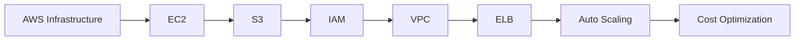
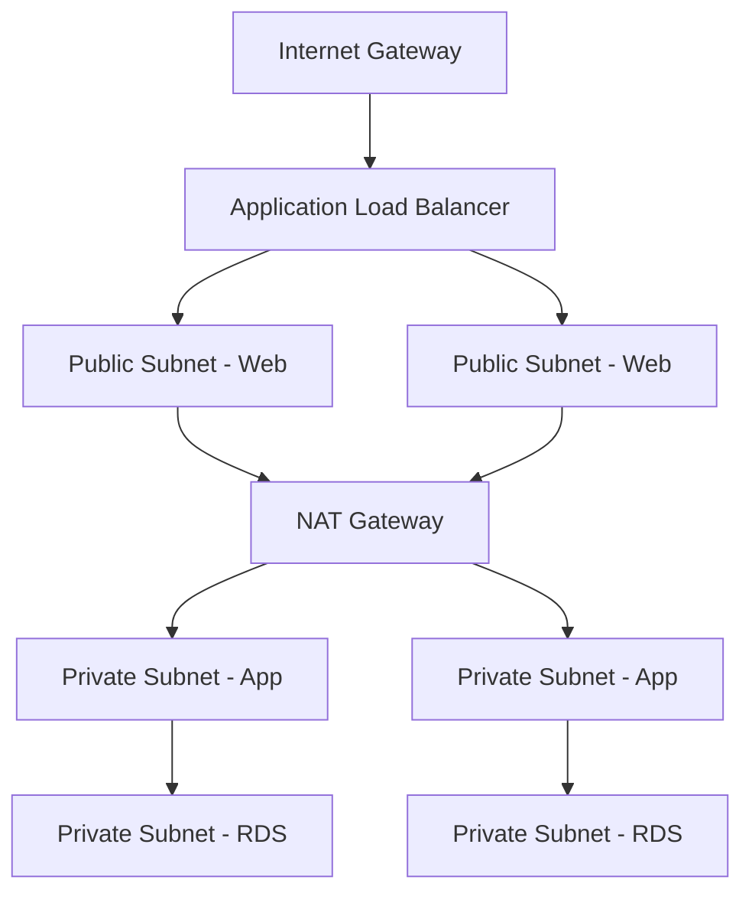

---
slug: /06-docker-k8s-cloud/aws-fundamentals
title: "Aws Fundamentals"
sidebar_label: "Aws Fundamentals"
sidebar_position: 7
---

# AWS Fundamentals — EC2, S3, IAM, and Networking

## Learning Objectives

| Objective | Description |
|-----------|-------------|
| LO1 | Understand AWS global infrastructure: regions, AZs, edge locations |
| LO2 | Launch and manage EC2 instances with security groups and key pairs |
| LO3 | Store and retrieve objects using S3 with proper bucket policies |
| LO4 | Manage access control with IAM users, groups, roles, and policies |
| LO5 | Configure VPC networking: subnets, route tables, internet gateways |
| LO6 | Understand AWS pricing models and cost optimization strategies |

## Introduction

Containers and cloud platforms are where AI models live in production. Docker packages your model, Kubernetes orchestrates it, and cloud platforms scale it. This module covers the full deployment stack.


## Prerequisites

- Basic programming knowledge
- Understanding of data structures

## Key Terminology

**Key Terms**: Core vocabulary and concepts for this topic.

**Definition**: Essential terms you must know for interviews and production work.

## Theory

Understanding aws fundamentals is fundamental for AI engineers. This section covers the core concepts, underlying principles, and theoretical framework that govern how aws fundamentals works in practice.


## Chapter at a Glance

| Section | Topic | Key Concept |
|---------|-------|-------------|
| 7.1 | AWS Global Infrastructure | Regions, Availability Zones, Edge Locations |
| 7.2 | EC2 Compute | Instance types, AMIs, security groups, EBS |
| 7.3 | S3 Storage | Buckets, objects, storage classes, lifecycle |
| 7.4 | IAM Security | Users, groups, roles, policies, best practices |
| 7.5 | VPC Networking | Subnets, route tables, NAT gateways, peering |
| 7.6 | Elastic Load Balancing | ALB, NLB, target groups, health checks |
| 7.7 | Auto Scaling | Launch templates, scaling policies, lifecycle |
| 7.8 | Pricing and Cost Optimization | Reserved instances, Savings Plans, cost explorer |

## Chapter Roadmap



## 7.1 AWS Global Infrastructure

AWS spans 30+ geographic regions, each with multiple Availability Zones (AZs). Each AZ is an isolated data center with independent power, cooling, and networking.

**Key concepts**:

| Concept | Description |
|---------|-------------|
| Region | Geographic area (us-east-1, eu-west-1, ap-south-1) |
| Availability Zone | One or more data centers within a region (us-east-1a, us-east-1b) |
| Edge Location | CDN endpoint for CloudFront content delivery |
| Local Zone | Extends region closer to end users |

```bash

## AWS CLI basics
aws configure
aws ec2 describe-regions
aws ec2 describe-availability-zones --region us-east-1
```

**Choosing a region**: Consider latency to users, compliance requirements, service availability, and pricing (varies by region).

## 7.2 EC2 Compute

EC2 (Elastic Compute Cloud) provides virtual servers in the cloud.

**Instance types**:

| Family | Use Case | Examples |
|--------|----------|----------|
| General purpose | Web servers, code repos | t3, m5, m6g |
| Compute optimized | Batch processing, HPC | c5, c6g |
| Memory optimized | Databases, caching | r5, x2gd |
| GPU instances | ML training, rendering | p3, p4d, g5 |

```bash

## Launch EC2 instance
aws ec2 run-instances     --image-id ami-0c55b159cbfafe1f0     --instance-type t3.micro     --key-name my-key     --security-group-ids sg-123     --subnet-id subnet-456

## SSH into instance
ssh -i my-key.pem ec2-user@54.123.45.67

## Stop/start/terminate
aws ec2 stop-instances --instance-ids i-123
aws ec2 start-instances --instance-ids i-123
aws ec2 terminate-instances --instance-ids i-123
```

**Security Groups** — virtual firewall for EC2 instances:

```bash
aws ec2 create-security-group --group-name web-sg --description "Web server SG"
aws ec2 authorize-security-group-ingress     --group-id sg-123     --protocol tcp     --port 80     --cidr 0.0.0.0/0
```

**EBS (Elastic Block Store)** — persistent block storage:

```bash
aws ec2 create-volume --volume-type gp3 --size 100 --availability-zone us-east-1a
aws ec2 attach-volume --volume-id vol-123 --instance-id i-456 --device /dev/sdf
```

## 7.3 S3 Storage

S3 (Simple Storage Service) provides scalable object storage.

```bash

## Create bucket
aws s3 mb s3://my-unique-bucket-name

## Upload objects
aws s3 cp file.txt s3://my-bucket/
aws s3 sync ./local-folder s3://my-bucket/ --acl public-read

## List objects
aws s3 ls s3://my-bucket/
aws s3 ls s3://my-bucket/ --recursive

## Set bucket policy
aws s3api put-bucket-policy --bucket my-bucket --policy file://policy.json
```

**Storage classes**:

| Class | Durability | Availability | Retrieval | Use Case |
|-------|------------|-------------|-----------|----------|
| Standard | 99.999999999% | 99.99% | Instant | Active data |
| Intelligent-Tiering | 99.999999999% | 99.99% | Instant | Unknown patterns |
| Standard-IA | 99.999999999% | 99.9% | Instant | Infrequent access |
| One Zone-IA | 99.999999999% | 99.5% | Instant | Recreatable data |
| Glacier | 99.999999999% | 99.99% | 1-5 min | Archives |
| Glacier Deep Archive | 99.999999999% | 99.99% | 12 hours | Compliance |

**Lifecycle policies** — automate storage class transitions:

```json
{
  "Rules": [{
    "Id": "archive-rule",
    "Status": "Enabled",
    "Filter": {},
    "Transitions": [
      {"Days": 30, "StorageClass": "STANDARD_IA"},
      {"Days": 90, "StorageClass": "GLACIER"}
    ],
    "Expiration": {"Days": 365}
  }]
}
```

## 7.4 IAM Security

IAM (Identity and Access Management) controls access to AWS resources.

**Best practices**:

```json
{
  "Version": "2012-10-17",
  "Statement": [
    {
      "Effect": "Allow",
      "Action": "s3:GetObject",
      "Resource": "arn:aws:s3:::my-bucket/*"
    },
    {
      "Effect": "Deny",
      "Action": "*",
      "Resource": "*",
      "Condition": {
        "Bool": {"aws:SecureTransport": "false"}
      }
    }
  ]
}
```

```bash

## Create IAM user
aws iam create-user --user-name developer
aws iam create-access-key --user-name developer

## Attach policy
aws iam attach-user-policy     --user-name developer     --policy-arn arn:aws:iam::aws:policy/AmazonS3ReadOnlyAccess

## Create IAM role
aws iam create-role --role-name ec2-s3-access --assume-role-policy-document file://trust-policy.json

## Attach role policy
aws iam attach-role-policy     --role-name ec2-s3-access     --policy-arn arn:aws:iam::aws:policy/AmazonS3FullAccess
```

**IAM Policies evaluation**: Explicit Deny > Explicit Allow > Default Deny.

**Roles vs Users**: Roles are assumed by AWS services (EC2, Lambda); Users are for people.

## 7.5 VPC Networking

VPC (Virtual Private Cloud) provides isolated networking in AWS.

```bash

## Create VPC
aws ec2 create-vpc --cidr-block 10.0.0.0/16

## Create subnets (public and private)
aws ec2 create-subnet --vpc-id vpc-123 --cidr-block 10.0.1.0/24
aws ec2 create-subnet --vpc-id vpc-123 --cidr-block 10.0.2.0/24

## Internet Gateway
aws ec2 create-internet-gateway
aws ec2 attach-internet-gateway --vpc-id vpc-123 --internet-gateway-id igw-123

## Route tables
aws ec2 create-route-table --vpc-id vpc-123
aws ec2 create-route --route-table-id rtb-123 --destination-cidr-block 0.0.0.0/0 --gateway-id igw-123
```

**VPC components**:

| Component | Purpose |
|-----------|---------|
| Subnet | Segments VPC IP range (public/private) |
| Route Table | Directs traffic between subnets and gateways |
| Internet Gateway | Enables public internet access |
| NAT Gateway | Enables outbound internet from private subnets |
| VPC Peering | Connects VPCs within or across accounts |
| Security Group | Instance-level firewall |
| NACL | Subnet-level stateless firewall |

**VPC design for web applications**:



## 7.6 Elastic Load Balancing

ELB distributes incoming traffic across multiple targets.

```bash

## Create Application Load Balancer
aws elbv2 create-load-balancer     --name my-alb     --subnets subnet-abc subnet-def     --security-groups sg-123

## Create target group
aws elbv2 create-target-group     --name my-targets     --protocol HTTP     --port 80     --vpc-id vpc-123     --health-check-path /health

## Register targets
aws elbv2 register-targets     --target-group-arn arn:aws:elasticloadbalancing:...     --targets Id=i-123 Id=i-456

## Create listener
aws elbv2 create-listener     --load-balancer-arn arn:aws:elasticloadbalancing:...     --protocol HTTP --port 80     --default-actions Type=forward,TargetGroupArn=...
```

**ALB vs NLB**:

| Feature | ALB (Layer 7) | NLB (Layer 4) |
|---------|---------------|---------------|
| Protocol | HTTP, HTTPS, gRPC | TCP, UDP, TLS |
| Routing | Path, host, query-based | IP-based |
| TLS termination | Yes | Yes |
| Static IP | No | Yes |
| WebSocket | Yes | No |
| Performance | Moderate | Ultra-high |

## 7.7 Auto Scaling

Auto Scaling automatically adjusts EC2 capacity based on demand.

```bash

## Create launch template
aws ec2 create-launch-template     --launch-template-name web-template     --version-description v1     --launch-template-data file://template-data.json

## Create auto scaling group
aws autoscaling create-auto-scaling-group     --auto-scaling-group-name web-asg     --launch-template LaunchTemplateName=web-template     --min-size 2 --max-size 10 --desired-capacity 2     --vpc-zone-identifier subnet-abc,subnet-def     --target-group-arns arn:aws:elasticloadbalancing:...

## Scaling policies
aws autoscaling put-scaling-policy     --auto-scaling-group-name web-asg     --policy-name cpu-target     --policy-type TargetTrackingScaling     --target-tracking-configuration file://cpu-target.json
```

**Scaling strategies**:

| Strategy | Description |
|----------|-------------|
| Target tracking | Maintain CPU/request count at target value |
| Step scaling | Add/remove instances based on alarm thresholds |
| Simple scaling | Single scaling adjustment |
| Scheduled scaling | Time-based predictable patterns |
| Predictive scaling | ML-based capacity forecasting |

## 7.8 Pricing and Cost Optimization

**AWS pricing models**:

| Model | Commitment | Discount |
|-------|------------|----------|
| On-Demand | None | 0% |
| Reserved Instance | 1-3 years | Up to 72% |
| Savings Plan | 1-3 years | Up to 66% |
| Spot Instance | None | Up to 90% |
| Dedicated Host | None | Full instance cost |

```bash

## Cost Explorer (CLI)
aws ce get-cost-and-usage     --time-period Start=2024-01-01,End=2024-01-31     --granularity MONTHLY     --metrics BlendedCost

## Budget setup
aws budgets create-budget     --account-id 123456789012     --budget file://budget.json     --notifications-with-subscribers file://notifications.json
```

**Cost optimization tips**:
- Right-size instances using Compute Optimizer
- Use Spot instances for fault-tolerant workloads
- Implement lifecycle policies for S3
- Delete unused EBS volumes and Elastic IPs
- Use Auto Scaling to match capacity to demand
- Choose Graviton (ARM) instances for better price/performance

#!/usr/bin/env python3
"""Generate subject 06 chapter 05, 07-10 files."""
import os

BASE = r"C:\xam
---


## TypeScript Parallel

```typescript
import { EC2Client, DescribeInstancesCommand } from "@aws-sdk/client-ec2";

const client = new EC2Client({ region: "us-east-1" });

async function listEC2(): Promise<string[]> {
  const cmd = new DescribeInstancesCommand({});
  const resp = await client.send(cmd);
  const ids: string[] = [];
  for (const r of resp.Reservations || []) {
    for (const i of r.Instances || []) {
      ids.push(i.InstanceId || "");
    }
  }
  return ids;
}
```

---

## Summary

- AWS global infrastructure includes 30+ regions with multiple Availability Zones per region for high availability
- EC2 offers general purpose, compute, memory, GPU, and storage-optimized instance types
- S3 provides 11 nines of durability with Standard, IA, Glacier, and Deep Archive storage classes
- IAM enables fine-grained access control via users, groups, roles, and policies
- VPC creates isolated networks with subnets, route tables, internet/NAT gateways, and security groups
- ALB handles Layer 7 routing; NLB handles Layer 4 with ultra-low latency
- Auto Scaling Groups maintain desired capacity with target tracking and scheduled scaling
- Reserved Instances and Savings Plans provide up to 72% discount for committed usage
- Spot Instances offer up to 90% discount for fault-tolerant workloads
- Cost Explorer, Budgets, and Compute Optimizer help monitor and optimize spending

## Practical Takeaways

| Scenario | Do This | Avoid This |
|----------|---------|------------|
| EC2 access | Systems Manager Session Manager | SSH port 22 open to 0.0.0.0/0 |
| S3 security | Block public access, use CloudFront OAC | Publicly accessible buckets |
| IAM | Least privilege with roles | Root account for daily tasks |
| VPC | Multi-AZ, public/private subnets | Single AZ |
| Cost | Budgets + Cost Explorer | Unmonitored resources |
| Scaling | Target tracking with ALB metrics | Fixed instance count |
| Security groups | Specific CIDR ranges | 0.0.0.0/0 for admin |

## Interview Q&A

<details class="tp-qa-card" data-qid="docker-s07-q1">
  <summary class="tp-qa-question"><span class="tp-qa-status"></span> Q1: What is the difference between Security Group and NACL?</summary>
  <div class="tp-qa-answer"><p>Security Groups are stateful instance-level firewalls (allow only). NACLs are stateless subnet-level firewalls (allow + deny, evaluated in order).</p></div>
  <button class="tp-qa-mark-btn">&#x2705; Mark Reviewed</button>
  <button class="tp-qa-bookmark-btn">&#x1F516; Bookmark</button>
</details>

<details class="tp-qa-card" data-qid="docker-s07-q2">
  <summary class="tp-qa-question"><span class="tp-qa-status"></span> Q2: What are the S3 storage classes?</summary>
  <div class="tp-qa-answer"><p>Standard (frequent), Intelligent-Tiering (auto), Standard-IA (infrequent), One Zone-IA (recreatable), Glacier (minutes retrieval), Glacier Deep Archive (hours). All 11 nines durability.</p></div>
  <button class="tp-qa-mark-btn">&#x2705; Mark Reviewed</button>
  <button class="tp-qa-bookmark-btn">&#x1F516; Bookmark</button>
</details>

<details class="tp-qa-card" data-qid="docker-s07-q3">
  <summary class="tp-qa-question"><span class="tp-qa-status"></span> Q3: ALB vs NLB?</summary>
  <div class="tp-qa-answer"><p>ALB: Layer 7, path/host routing, WebSocket, TLS termination. NLB: Layer 4, ultra-low latency, static IPs, client IP preservation.</p></div>
  <button class="tp-qa-mark-btn">&#x2705; Mark Reviewed</button>
  <button class="tp-qa-bookmark-btn">&#x1F516; Bookmark</button>
</details>

<details class="tp-qa-card" data-qid="docker-s07-q4">
  <summary class="tp-qa-question"><span class="tp-qa-status"></span> Q4: How does Auto Scaling work?</summary>
  <div class="tp-qa-answer"><p>ASG maintains desired EC2 count via launch templates. Scaling policies (target tracking, step, scheduled) adjust capacity. Health checks replace unhealthy instances. Distributes across AZs.</p></div>
  <button class="tp-qa-mark-btn">&#x2705; Mark Reviewed</button>
  <button class="tp-qa-bookmark-btn">&#x1F516; Bookmark</button>
</details>

<details class="tp-qa-card" data-qid="docker-s07-q5">
  <summary class="tp-qa-question"><span class="tp-qa-status"></span> Q5: IAM role vs user?</summary>
  <div class="tp-qa-answer"><p>Role: temporary credentials via STS, assumed by services. User: long-term access keys. Roles are more secure.</p></div>
  <button class="tp-qa-mark-btn">&#x2705; Mark Reviewed</button>
  <button class="tp-qa-bookmark-btn">&#x1F516; Bookmark</button>
</details>

<details class="tp-qa-card" data-qid="docker-s07-q6">
  <summary class="tp-qa-question"><span class="tp-qa-status"></span> Q6: What is VPC peering?</summary>
  <div class="tp-qa-answer"><p>Private connection between VPCs using AWS network. Instances communicate via private IPs. Not transitive.</p></div>
  <button class="tp-qa-mark-btn">&#x2705; Mark Reviewed</button>
  <button class="tp-qa-bookmark-btn">&#x1F516; Bookmark</button>
</details>

<details class="tp-qa-card" data-qid="docker-s07-q7">
  <summary class="tp-qa-question"><span class="tp-qa-status"></span> Q7: How to securely serve S3 content?</summary>
  <div class="tp-qa-answer"><p>CloudFront + OAC. CloudFront uses IAM to access S3. Bucket policy allows only CloudFront. Prevents direct S3 access.</p></div>
  <button class="tp-qa-mark-btn">&#x2705; Mark Reviewed</button>
  <button class="tp-qa-bookmark-btn">&#x1F516; Bookmark</button>
</details>

<details class="tp-qa-card" data-qid="docker-s07-q8">
  <summary class="tp-qa-question"><span class="tp-qa-status"></span> Q8: EBS vs Instance Store?</summary>
  <div class="tp-qa-answer"><p>EBS: persistent, survives termination. Instance store: ephemeral, data lost on stop. EBS for databases, instance store for caches.</p></div>
  <button class="tp-qa-mark-btn">&#x2705; Mark Reviewed</button>
  <button class="tp-qa-bookmark-btn">&#x1F516; Bookmark</button>
</details>

<details class="tp-qa-card" data-qid="docker-s07-q9">
  <summary class="tp-qa-question"><span class="tp-qa-status"></span> Q9: Design a serverless web app?</summary>
  <div class="tp-qa-answer"><p>Route53 + CloudFront + S3 (static) + API Gateway + Lambda + DynamoDB + Cognito. Scales from zero with no servers.</p></div>
  <button class="tp-qa-mark-btn">&#x2705; Mark Reviewed</button>
  <button class="tp-qa-bookmark-btn">&#x1F516; Bookmark</button>
</details>

<details class="tp-qa-card" data-qid="docker-s07-q10">
  <summary class="tp-qa-question"><span class="tp-qa-status"></span> Q10: How to optimize AWS costs?</summary>
  <div class="tp-qa-answer"><p>Reserved/Savings Plans, Spot instances, right-size with Compute Optimizer, S3 lifecycle policies, delete unused resources, Budgets.</p></div>
  <button class="tp-qa-mark-btn">&#x2705; Mark Reviewed</button>
  <button class="tp-qa-bookmark-btn">&#x1F516; Bookmark</button>
</details>

## Chapter Quiz

**Q1**: Which AWS service provides object storage?

a) EBS
b) S3
c) EFS
d) RDS

<details class="tp-qa-card" data-qid="docker-s07-quiz1"><summary>Show Answer</summary><div class="tp-qa-answer"><p><strong>Answer: b) S3</strong></p></div></details>

**Q2**: What provides temporary AWS credentials?

a) IAM user
b) IAM group
c) IAM role
d) IAM policy

<details class="tp-qa-card" data-qid="docker-s07-quiz2"><summary>Show Answer</summary><div class="tp-qa-answer"><p><strong>Answer: c) IAM role</strong></p></div></details>

**Q3**: What enables internet access for private subnets?

a) Internet Gateway
b) NAT Gateway
c) VPC Peering
d) VPN Gateway

<details class="tp-qa-card" data-qid="docker-s07-quiz3"><summary>Show Answer</summary><div class="tp-qa-answer"><p><strong>Answer: b) NAT Gateway</strong></p></div></details>

**Q4**: Which service is a CDN?

a) Route 53
b) CloudFront
c) API Gateway
d) WAF

<details class="tp-qa-card" data-qid="docker-s07-quiz4"><summary>Show Answer</summary><div class="tp-qa-answer"><p><strong>Answer: b) CloudFront</strong></p></div></details>

**Q5**: What is the most cost-effective S3 class for archives?

a) Standard
b) Standard-IA
c) Glacier Deep Archive
d) One Zone-IA

<details class="tp-qa-card" data-qid="docker-s07-quiz5"><summary>Show Answer</summary><div class="tp-qa-answer"><p><strong>Answer: c) Glacier Deep Archive</strong></p></div></details>

## Exercises

**Easy** — Launch a t2.micro EC2 with HTTP access. SSH in and install Nginx.

**Medium** — Create an S3 bucket with lifecycle: Standard-IA at 30d, Glacier at 90d. Verify.

**Medium** — Design VPC with public/private subnets in two AZs. Place web server in public, DB in private.

**Hard** — Set up ALB + ASG with launch template, health checks, CloudWatch alarms. Test auto scaling.

**Hard** — Create IAM role for EC2 (S3 read + DynamoDB write). Attach to instance. Verify.

---


## Common Mistakes

1. Not understanding the fundamental concepts before applying them
2. Skipping edge cases in implementation
3. Not analyzing time/space complexity
4. Forgetting to handle null/empty inputs
5. Not practicing enough problems to build pattern recognition

## Revision Notes

- - Core principle: Understand the fundamental concepts thoroughly
- - Implementation pattern: Practice with real code examples
- - Complexity: Know the time and space complexity
- - Application: Know when to use this in production systems
- - Interview: Frequently asked in technical interviews
- - Edge cases: Consider common failure scenarios
- - Related concepts: Connect to broader system design
