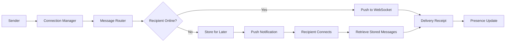

---
slug: /07-system-design/design-whatsapp
title: "Design Whatsapp"
sidebar_label: "Design Whatsapp"
sidebar_position: 12
---

# Design WhatsApp — Real-Time Messaging, Presence, Encryption

## Learning Objectives

| Objective | Description |
|-----------|-------------|
| LO1 | Understand the system architecture for real-time messaging at global scale |
| LO2 | Design WebSocket-based real-time messaging infrastructure |
| LO3 | Implement presence detection and online status distribution |
| LO4 | Build end-to-end encryption for message privacy and integrity |
| LO5 | Design group chat, media sharing, and message sync across devices |
| LO6 | Address delivery guarantees, ordering, and offline messaging |

## Introduction

System design interviews test your ability to architect large-scale systems. Caching, load balancing, message queues, and database sharding are patterns you will apply daily. This module prepares you for both interviews and production.


## Prerequisites

- Basic programming knowledge
- Understanding of data structures

## Key Terminology

**Key Terms**: Core vocabulary and concepts for this topic.

**Definition**: Essential terms you must know for interviews and production work.

## Theory

Understanding design whatsapp is fundamental for AI engineers. This section covers the core concepts, underlying principles, and theoretical framework that govern how design whatsapp works in practice.


## Chapter at a Glance

| Section | Topic | Key Concept |
|---------|-------|-------------|
| 12.1 | High-Level Architecture | Connection manager, message router, store, presence |
| 12.2 | Real-Time Messaging | WebSocket connections, message routing, delivery |
| 12.3 | End-to-End Encryption | Signal Protocol, key exchange, ratchet mechanism |
| 12.4 | Presence & Online Status | Heartbeat, timers, distribution strategy |
| 12.5 | Group Chat & Media | Fan-out, upload service, CDN, thumbnails |
| 12.6 | Offline Messages & Delivery | Store-and-forward, delivery receipts, ordering |

## Chapter Roadmap


## 12.1 High-Level Architecture

WhatsApp serves 2B+ users globally, processing 100B+ messages daily. The architecture must handle real-time delivery, offline storage, and end-to-end encryption at massive scale.

**Core components**:
- **Connection Manager (CM)**: Maintains WebSocket connections. Each user connects to one CM via consistent hashing (hash(user_id) % N).
- **Message Router (MR)**: Routes messages between CMs. Determines recipient's CM and forwards the message.
- **Message Store (MS)**: Persistent storage for messages (Cassandra/HBase). Messages are stored per conversation.
- **Presence Service (PS)**: Tracks online/offline status with heartbeat timers.
- **Media Service**: Handles image/video upload, storage, CDN distribution, and thumbnail generation.
- **Push Notification Gateway**: Sends push notifications to offline users (APNs for iOS, FCM for Android).

```typescript
interface WhatsAppMessage {
  id: string;
  type: "text" | "image" | "video" | "audio" | "document" | "location";
  from: string;
  to: string;
  conversationId: string;
  content: string;
  mediaUrl?: string;
  timestamp: number;
  encryptionInfo: {
    ciphertext: string;
    iv: string;
    keyId: string;
  };
  deliveryStatus: "sent" | "delivered" | "read";
}
```

**Scale numbers**: 100B messages/day = ~1.2M msg/sec peak. Each message is ~1KB raw, ~100 bytes ciphertext after encryption. Storage: 10TB/day.

---

## 12.2 Real-Time Messaging

WebSocket connections provide persistent, bidirectional communication channels between client and server.

```typescript
import WebSocket from "ws";

class ConnectionManager {
  private connections: Map<string, WebSocket> = new Map();
  private loadBalancer: ConsistentHashRing;
  private nodes: Map<string, ConnectionManager[]> = new Map();

  registerConnection(userId: string, ws: WebSocket): void {
    this.connections.set(userId, ws);
    ws.on("close", () => {
      this.connections.delete(userId);
      this.broadcastPresence(userId, "offline");
    });
    ws.on("message", (data) => this.handleMessage(userId, data.toString()));
    this.broadcastPresence(userId, "online");
  }

  async handleMessage(senderId: string, raw: string): Promise<void> {
    const message: WhatsAppMessage = JSON.parse(raw);
    message.id = crypto.randomUUID();
    message.timestamp = Date.now();

    // Validate and process
    message.encryptionInfo = await this.encryptMessage(message.content, message.to);

    // Store message
    await this.messageStore.saveMessage(message);

    // Route to recipient
    const recipientNode = this.loadBalancer.getNode(message.to);
    if (recipientNode === this.nodeId) {
      await this.deliverLocal(message);
    } else {
      await this.forwardToNode(recipientNode, message);
    }
  }

  async deliverLocal(message: WhatsAppMessage): Promise<void> {
    const ws = this.connections.get(message.to);
    if (ws && ws.readyState === WebSocket.OPEN) {
      ws.send(JSON.stringify(message));
      await this.messageStore.updateStatus(message.id, "delivered");
    } else {
      // Store for offline delivery
      await this.messageStore.queueForOffline(message);
      await this.sendPushNotification(message.to, message);
    }
  }

  async forwardToNode(targetNode: string, message: WhatsAppMessage): Promise<void> {
    // Forward via internal RPC (gRPC) to the target node's CM
    await this.rpcClient.forwardMessage(targetNode, message);
  }
}
```

**Connection management**: Each physical server handles 500K-1M concurrent connections. Edge servers terminate connections close to users (global PoP deployment).

---

## 12.3 End-to-End Encryption

WhatsApp uses the Signal Protocol for end-to-end encryption, providing forward secrecy and deniable authentication.

```typescript
interface PreKeyBundle {
  identityKey: string;
  signedPreKey: {
    key: string;
    signature: string;
  };
  preKeys: Array<{ keyId: number; publicKey: string }>;
}

class SignalProtocolManager {
  private sessions: Map<string, SessionState> = new Map();

  async initiateSession(localUserId: string, remoteUserId: string): Promise<void> {
    // Fetch remote user's pre-key bundle from server
    const preKeyBundle = await this.fetchPreKeyBundle(remoteUserId);

    // X3DH key agreement
    const sharedSecret = this.performX3DH(
      this.identityKeyPair.privateKey,
      preKeyBundle
    );

    // Create ratchet session
    const session = new SessionState(sharedSecret);
    this.sessions.set(remoteUserId, session);
  }

  async encryptMessage(
    plaintext: string,
    recipientId: string
  ): Promise<{ ciphertext: string; iv: string; keyId: string }> {
    let session = this.sessions.get(recipientId);
    if (!session) {
      await this.initiateSession(this.localUserId, recipientId);
      session = this.sessions.get(recipientId)!;
    }

    // Double Ratchet: derive new message key
    const messageKey = session.ratchet.advanceChain();
    const iv = crypto.randomBytes(12);
    const cipher = crypto.createCipheriv("aes-256-gcm", messageKey, iv);

    let ciphertext = cipher.update(plaintext, "utf8", "hex");
    ciphertext += cipher.final("hex");
    const authTag = cipher.getAuthTag().toString("hex");

    return {
      ciphertext: ciphertext + authTag,
      iv: iv.toString("hex"),
      keyId: session.currentKeyId.toString(),
    };
  }

  async decryptMessage(
    ciphertext: string,
    iv: string,
    senderId: string,
    keyId: string
  ): Promise<string> {
    const session = this.sessions.get(senderId);
    if (!session) throw new Error("No session with sender");

    const messageKey = session.ratchet.advanceChain();
    const decipher = crypto.createDecipheriv(
      "aes-256-gcm",
      messageKey,
      Buffer.from(iv, "hex")
    );

    const ct = Buffer.from(ciphertext, "hex");
    const tag = ct.subarray(ct.length - 16);
    const data = ct.subarray(0, ct.length - 16);
    decipher.setAuthTag(tag);

    let plaintext = decipher.update(data, "hex", "utf8");
    plaintext += decipher.final("utf8");
    return plaintext;
  }

  private performX3DH(
    privateKey: string,
    bundle: PreKeyBundle
  ): Buffer {
    // Extended Triple Diffie-Hellman key agreement
    // Combines identity keys, signed pre-keys, and one-time pre-keys
    return crypto.randomBytes(32); // Simplified
  }

  private async fetchPreKeyBundle(userId: string): Promise<PreKeyBundle> {
    const response = await fetch(`/v1/keys/${userId}/prekeys`);
    return response.json();
  }
}
```

**Key properties**: **Forward secrecy** — compromising current keys doesn't expose past messages. **Deniable authentication** — message authenticity can't be proven to third parties. **Post-compromise security** — sessions heal after compromise through the ratchet mechanism.

---

## 12.4 Presence & Online Status

Presence detection tracks user online/offline status and distributes it to authorized viewers (mutual contacts).

```typescript
class PresenceService {
  private heartbeats: Map<string, number> = new Map();
  private heartbeatTimeout = 30000; // 30 seconds
  private presenceCache: Map<string, { status: "online" | "offline"; lastSeen: number }> = new Map();
  private contactsGraph: Map<string, Set<string>> = new Map();

  handleHeartbeat(userId: string): void {
    this.heartbeats.set(userId, Date.now());
    const previousStatus = this.presenceCache.get(userId)?.status;
    this.presenceCache.set(userId, { status: "online", lastSeen: Date.now() });

    // Notify contacts only if status changed
    if (previousStatus !== "online") {
      this.broadcastToContacts(userId, "online");
    }
  }

  async checkHeartbeats(): Promise<void> {
    const now = Date.now();
    for (const [userId, lastHeartbeat] of this.heartbeats) {
      if (now - lastHeartbeat > this.heartbeatTimeout) {
        this.heartbeats.delete(userId);
        this.presenceCache.set(userId, {
          status: "offline",
          lastSeen: now,
        });
        this.broadcastToContacts(userId, "offline");
      }
    }
  }

  private async broadcastToContacts(
    userId: string,
    status: "online" | "offline"
  ): Promise<void> {
    const contacts = this.contactsGraph.get(userId);
    if (!contacts) return;

    const presenceUpdate = JSON.stringify({
      type: "presence",
      userId,
      status,
      timestamp: Date.now(),
    });

    for (const contactId of contacts) {
      // Route to the CM serving this contact
      await this.routeToConnectionManager(contactId, presenceUpdate);
    }
  }

  getPresence(
    userId: string,
    requesterId: string
  ): { status: "online" | "offline"; lastSeen?: number } | null {
    // Check if requester is authorized (mutual contact)
    if (!this.contactsGraph.get(userId)?.has(requesterId)) {
      return null;
    }
    return this.presenceCache.get(userId) ?? { status: "offline", lastSeen: 0 };
  }
}
```

**Privacy**: Users can configure "last seen" visibility: Everyone, Contacts, or Nobody. Presence updates are distributed via the same WebSocket connections used for messaging.

---

## 12.5 Group Chat & Media

Group chat uses fan-out architecture: sender sends once to server, server fans out to all group members.

```typescript
interface Group {
  id: string;
  name: string;
  members: string[];
  adminIds: string[];
  createdAt: number;
  avatarUrl?: string;
  encryptionKey: string; // Group master key
}

class GroupChatService {
  private groups: Map<string, Group> = new Map();

  async sendGroupMessage(
    senderId: string,
    groupId: string,
    message: WhatsAppMessage
  ): Promise<void> {
    const group = this.groups.get(groupId);
    if (!group) throw new Error("Group not found");
    if (!group.members.includes(senderId)) throw new Error("Not a member");

    // Encrypt message with group key (Sender Key distribution)
    const encrypted = await this.encryptForGroup(message.content, group);

    // Fan-out: send to each member (server-side)
    const fanOutPromises = group.members
      .filter((m) => m !== senderId)
      .map((memberId) => this.deliverToMember(memberId, encrypted, groupId));

    await Promise.all(fanOutPromises);

    // Store one copy of the message with group metadata
    await this.messageStore.saveGroupMessage({
      ...encrypted,
      groupId,
      senderId,
      timestamp: Date.now(),
    });
  }

  private async deliverToMember(
    memberId: string,
    message: any,
    groupId: string
  ): Promise<void> {
    // Route through CM
    const cm = this.getConnectionManager(memberId);
    await cm.sendToUser(memberId, {
      ...message,
      type: "group_message",
      groupId,
    });
  }

  private async encryptForGroup(
    plaintext: string,
    group: Group
  ): Promise<any> {
    // Sender Key: encrypt once with group session key
    const cipher = crypto.createCipheriv(
      "aes-256-gcm",
      Buffer.from(group.encryptionKey, "hex"),
      crypto.randomBytes(12)
    );
    let ct = cipher.update(plaintext, "utf8", "hex");
    ct += cipher.final("hex");
    return { ciphertext: ct + cipher.getAuthTag().toString("hex") };
  }
}
```

**Media sharing**: Images/videos uploaded to Media Service, encrypted with a random key, key sent along with message. CDN delivers media files globally. Thumbnails generated server-side. Streaming for audio/video messages.

---

## 12.6 Offline Messages & Delivery

When a user is offline, messages are stored and delivered when they reconnect. Delivery receipts track message status.

```typescript
class OfflineMessageStore {
  private messageQueues: Map<string, WhatsAppMessage[]> = new Map();
  private maxOfflineMessages = 10000;
  private retentionDays = 30;

  async storeForOffline(message: WhatsAppMessage): Promise<void> {
    if (!this.messageQueues.has(message.to)) {
      this.messageQueues.set(message.to, []);
    }
    const queue = this.messageQueues.get(message.to)!;
    if (queue.length < this.maxOfflineMessages) {
      queue.push(message);
    } else {
      // Oldest messages are trimmed
      queue.shift();
      queue.push(message);
    }
  }

  async deliverOfflineMessages(userId: string, ws: WebSocket): Promise<void> {
    const queue = this.messageQueues.get(userId) ?? [];
    this.messageQueues.delete(userId);

    // Deliver in chronological order
    for (const message of queue.sort((a, b) => a.timestamp - b.timestamp)) {
      ws.send(JSON.stringify(message));
      await this.updateDeliveryStatus(message.id, "delivered");
    }
  }

  async getMessageCount(userId: string): Promise<number> {
    return (this.messageQueues.get(userId) ?? []).length;
  }
}

class DeliveryReceiptManager {
  private receipts: Map<string, { delivered: number; read: number }> = new Map();

  async markDelivered(messageId: string): Promise<void> {
    const receipt = this.receipts.get(messageId) ?? { delivered: 0, read: 0 };
    receipt.delivered++;
    this.receipts.set(messageId, receipt);

    // Notify sender
    const message = await this.messageStore.getMessage(messageId);
    if (message) {
      await this.sendReceiptToUser(message.from, {
        messageId,
        status: "delivered",
        timestamp: Date.now(),
      });
    }
  }

  async markRead(messageId: string, userId: string): Promise<void> {
    const receipt = this.receipts.get(messageId) ?? { delivered: 0, read: 0 };
    receipt.read++;
    this.receipts.set(messageId, receipt);

    const message = await this.messageStore.getMessage(messageId);
    if (message && message.from !== userId) {
      await this.sendReceiptToUser(message.from, {
        messageId,
        status: "read",
        timestamp: Date.now(),
      });
    }
  }

  private async sendReceiptToUser(
    userId: string,
    receipt: any
  ): Promise<void> {
    const cm = this.getConnectionManager(userId);
    await cm.sendToUser(userId, {
      type: "receipt",
      ...receipt,
    });
  }
}
```

**Message ordering**: Each message has a server-assigned timestamp. Messages are delivered in chronological order. For multi-device sync, each device maintains its own pointer of last read message.

---

## TypeScript Parallel

```typescript
class WhatsAppService {
  private cm: ConnectionManager;
  private presence: PresenceService;
  private groups: GroupChatService;
  private offlineStore: OfflineMessageStore;
  private encryption: SignalProtocolManager;

  async handleIncomingMessage(raw: string, senderId: string): Promise<void> {
    const msg: WhatsAppMessage = JSON.parse(raw);
    msg.id = crypto.randomUUID();
    msg.timestamp = Date.now();

    // Store
    await this.storeMessage(msg);

    // Encrypt
    msg.encryptionInfo = await this.encryption.encryptMessage(
      msg.content,
      msg.to
    );

    // Route
    const recipientOnline = await this.isUserOnline(msg.to);
    if (recipientOnline) {
      await this.cm.sendToUser(msg.to, msg);
      await this.markDelivered(msg.id);
    } else {
      await this.offlineStore.storeForOffline(msg);
      await this.sendPushNotification(msg.to, msg);
    }
  }

  async handleUserConnect(userId: string, ws: WebSocket): Promise<void> {
    this.cm.registerConnection(userId, ws);
    this.presence.handleHeartbeat(userId);
    await this.offlineStore.deliverOfflineMessages(userId, ws);
  }

  private async isUserOnline(userId: string): Promise<boolean> {
    const presence = this.presence.getPresence(userId, userId);
    return presence?.status === "online";
  }

  private async storeMessage(msg: WhatsAppMessage): Promise<void> {
    // Store in Cassandra/HBase by conversation_id
  }

  private async markDelivered(messageId: string): Promise<void> {
    // Update delivery status
  }

  private async sendPushNotification(to: string, msg: WhatsAppMessage): Promise<void> {
    // Send to APNs/FCM
  }
}
```

---

## Summary

- WhatsApp connects 2B+ users with 100B+ daily messages using WebSocket-based real-time messaging
- Consistent hashing routes users to Connection Managers for session affinity
- Signal Protocol provides end-to-end encryption with forward secrecy through X3DH + Double Ratchet
- Presence detection uses heartbeat timers with 30s timeout, distributed to mutual contacts
- Group chat uses server-side fan-out with Sender Key encryption (encrypt once, fan out ciphertext)
- Media files are encrypted, uploaded to CDN, with thumbnails generated server-side
- Offline messages are stored per-user (up to 10K) and delivered in order on reconnection
- Delivery receipts (sent/delivered/read) provide message status visibility
- Multi-device sync uses per-device last-read pointers and message-level synchronization
- Global PoP deployment minimizes connection latency with edge-terminated WebSockets

## Practical Takeaways

| Scenario | Do This | Avoid This |
|----------|---------|------------|
| Real-time messaging | WebSocket with persistent connections | HTTP polling (wasteful) |
| Message security | Signal Protocol (X3DH + Double Ratchet) | Custom encryption (error-prone) |
| Presence tracking | Heartbeat with 30s timeout + broadcast on change | Constant polling from clients |
| Group chat | Server-side fan-out with Sender Key | Client-side fan-out (unreliable) |
| Offline storage | Per-user queue sorted by timestamp, max 10K | Unlimited storage per user |
| Media delivery | Encrypted upload to CDN with thumbnails | Direct server-to-server transfer |
| Multi-device | Per-device sync pointers with message-level reconciliation | Single device assumption |

## Interview Q&A

<details class="tp-qa-card" data-qid="sd07-q1">
  <summary class="tp-qa-question">
    <span class="tp-qa-status"></span>
    Q1: How would you design WhatsApp's real-time messaging infrastructure for 2B users?
  </summary>
  <div class="tp-qa-answer">
    <p>Key components: <strong>1) Edge servers</strong> — WebSocket terminations at 20+ global PoPs, each handling 500K-1M connections. <strong>2) Consistent hashing</strong> — maps user_id to Connection Manager for session affinity. <strong>3) Message Router</strong> — internal gRPC service that routes between CMs. <strong>4) Storage</strong> — Cassandra/HBase for message persistence, partitioned by conversation_id. <strong>5) Presence</strong> — heartbeat-based with Redis for fast lookups. <strong>6) Encryption</strong> — Signal Protocol for E2EE. Scale at 1.2M msg/sec peak: use connection pooling, async I/O, and horizontal scaling for CMs.</p>
  </div>
  <button class="tp-qa-mark-btn">✅ Mark Reviewed</button>
  <button class="tp-qa-bookmark-btn">🔖 Bookmark</button>
</details>

<details class="tp-qa-card" data-qid="sd07-q2">
  <summary class="tp-qa-question">
    <span class="tp-qa-status"></span>
    Q2: How does the Signal Protocol achieve forward secrecy?
  </summary>
  <div class="tp-qa-answer">
    <p>Forward secrecy means compromising current keys doesn't expose past messages. Signal achieves this through the <strong>Double Ratchet algorithm</strong>. Each message generates a new encryption key via a ratchet (one-way function). Even if an attacker obtains the current session state, they cannot derive previous message keys because the ratchet only moves forward. Combined with <strong>X3DH</strong> (Extended Triple Diffie-Hellman) for initial key agreement using ephemeral keys, past messages remain secure even if long-term identity keys are compromised. The ratchet also provides post-compromise security — after a compromised session exchanges messages, security is restored.</p>
  </div>
  <button class="tp-qa-mark-btn">✅ Mark Reviewed</button>
  <button class="tp-qa-bookmark-btn">🔖 Bookmark</button>
</details>

<details class="tp-qa-card" data-qid="sd07-q3">
  <summary class="tp-qa-question">
    <span class="tp-qa-status"></span>
    Q3: How would you design group chat for 256 participants with E2EE?
  </summary>
  <div class="tp-qa-answer">
    <p>WhatsApp uses <strong>Sender Key</strong> (based on Signal's Messaging Layer): <strong>1)</strong> Each sender generates a group session key (ratchet chain). <strong>2)</strong> Sender encrypts message once with their group session key. <strong>3)</strong> Ciphertext is sent to the server. <strong>4)</strong> Server fans out the same ciphertext to all group members. <strong>5)</strong> Each member decrypts with the sender's group session key. Benefits: O(1) encryption per sender, O(1) ciphertext size regardless of group size, no per-member encryption overhead. For very large groups (10K+), use a tiered fan-out approach to avoid server overload.</p>
  </div>
  <button class="tp-qa-mark-btn">✅ Mark Reviewed</button>
  <button class="tp-qa-bookmark-btn">🔖 Bookmark</button>
</details>

<details class="tp-qa-card" data-qid="sd07-q4">
  <summary class="tp-qa-question">
    <span class="tp-qa-status"></span>
    Q4: How do you handle presence detection at WhatsApp scale?
  </summary>
  <div class="tp-qa-answer">
    <p><strong>1) Heartbeat</strong>: Client sends heartbeat every 15 seconds via WebSocket. Server tracks last heartbeat timestamp. <strong>2) Timeout</strong>: If no heartbeat for 30 seconds, mark user offline. <strong>3) Distribution</strong>: On status change, server pushes update to mutual contacts via their WebSocket connections. <strong>4) Privacy</strong>: Configurable visibility (Everyone, Contacts, Nobody). <strong>5) Scale</strong>: Presence state stored in Redis cluster with TTL. Broadcast to contacts uses fan-out via CMs. <strong>6) Optimization</strong>: Batch presence updates: collect changes for 1 second, then broadcast all at once to reduce message count.</p>
  </div>
  <button class="tp-qa-mark-btn">✅ Mark Reviewed</button>
  <button class="tp-qa-bookmark-btn">🔖 Bookmark</button>
</details>

<details class="tp-qa-card" data-qid="sd07-q5">
  <summary class="tp-qa-question">
    <span class="tp-qa-status"></span>
    Q5: How do you ensure message ordering and prevent duplicates?
  </summary>
  <div class="tp-qa-answer">
    <p><strong>Ordering</strong>: Each message gets a server-assigned monotonic timestamp. Messages are delivered in chronological order per conversation. For offline delivery, messages are sorted by timestamp before delivery. <strong>Deduplication</strong>: Each message has a client-generated ID (UUID). Server detects duplicates by tracking seen message IDs per conversation (in Redis with TTL). If a duplicate arrives, server returns the existing delivery status without re-processing. <strong>Multi-device</strong>: Each device maintains last-read timestamp. New messages carry a sender device ID to prevent echo (device A sends, server doesn't send back to device A).</p>
  </div>
  <button class="tp-qa-mark-btn">✅ Mark Reviewed</button>
  <button class="tp-qa-bookmark-btn">🔖 Bookmark</button>
</details>

<details class="tp-qa-card" data-qid="sd07-q6">
  <summary class="tp-qa-question">
    <span class="tp-qa-status"></span>
    Q6: How would you design media sharing (images/videos) for WhatsApp?
  </summary>
  <div class="tp-qa-answer">
    <p><strong>1) Upload</strong>: Client encrypts media with a random 32-byte key, uploads ciphertext to Media Service. <strong>2) Storage</strong>: Media stored in blob storage (S3, Blob Storage) with CDN for global delivery. <strong>3) Thumbnail</strong>: Server generates thumbnail (process encrypted media after decryption with key). <strong>4) Encryption key delivery</strong>: Media encryption key is sent as part of the message (E2EE). <strong>5) Progressive delivery</strong>: Thumbnail sent first, full-resolution on demand. <strong>6) Streaming</strong>: Video/audio streamed from CDN with range-request support. <strong>7) Compression</strong>: Automatically compress images (max 1600px) and videos (max 16MB) on server side.</p>
  </div>
  <button class="tp-qa-mark-btn">✅ Mark Reviewed</button>
  <button class="tp-qa-bookmark-btn">🔖 Bookmark</button>
</details>

<details class="tp-qa-card" data-qid="sd07-q7">
  <summary class="tp-qa-question">
    <span class="tp-qa-status"></span>
    Q7: How do you handle multi-device sync?
  </summary>
  <div class="tp-qa-answer">
    <p>Multi-device allows using WhatsApp on phone + desktop + web simultaneously. <strong>1) Key distribution</strong>: When linking a new device, the phone shares the identity key and session state via QR code (local encrypted transfer). <strong>2) Message sync</strong>: Each device maintains its own cursor (last message seen). On reconnect, device requests messages after its cursor. <strong>3) Server-side queue</strong>: Each device has an independent offline message queue. <strong>4) Read status</strong>: Read receipts are per-device; "read by everyone" means all devices have read. <strong>5) Sender key sync</strong>: Group session keys shared across devices for seamless group chat. <strong>6) Conflict resolution</strong>: Last-writer-wins for profile, settings; CRDT approaches for more complex state.</p>
  </div>
  <button class="tp-qa-mark-btn">✅ Mark Reviewed</button>
  <button class="tp-qa-bookmark-btn">🔖 Bookmark</button>
</details>

<details class="tp-qa-card" data-qid="sd07-q8">
  <summary class="tp-qa-question">
    <span class="tp-qa-status"></span>
    Q8: How do you design the storage layer for WhatsApp messages?
  </summary>
  <div class="tp-qa-answer">
    <p>Cassandra/HBase for message storage: <strong>Messages table</strong>: conversation_id (partition key), message_id (clustering key, timeuuid), sender_id, content (encrypted blob), timestamp, media_ref, delivery_status. Partition by conversation_id for fast retrieval of message history. TTL for automatic expiry (30 days default, users can turn off). <strong>Conversation index</strong>: user_id (PK), conversation_id, last_message_preview, unread_count. Enables fast "list my chats" queries. <strong>Write path</strong>: Message written to Cassandra, acknowledged to sender, then delivered to recipient. <strong>Read path</strong>: On opening conversation, query partition by conversation_id, sorted by message_id.</p>
  </div>
  <button class="tp-qa-mark-btn">✅ Mark Reviewed</button>
  <button class="tp-qa-bookmark-btn">🔖 Bookmark</button>
</details>

<details class="tp-qa-card" data-qid="sd07-q9">
  <summary class="tp-qa-question">
    <span class="tp-qa-status"></span>
    Q9: How do you handle push notifications without compromising E2EE?
  </summary>
  <div class="tp-qa-answer">
    <p>Push notifications are a challenge for E2EE because the notification payload goes through Apple/Google servers. WhatsApp's approach: <strong>1) Thin notifications</strong>: Payload contains only metadata (sender name, conversation ID, message type) - no message content. <strong>2) Local decryption</strong>: When user taps notification, app opens, fetches encrypted message from server, decrypts locally. <strong>3) Server doesn't have keys</strong>: Encryption keys never leave user devices. <strong>4) Notification content</strong>: "New message from Alice" instead of "Alice: Hello, how are you?". <strong>5) Registration</strong>: Device registers for push notifications with platform-specific token, stored on WhatsApp server for routing.</p>
  </div>
  <button class="tp-qa-mark-btn">✅ Mark Reviewed</button>
  <button class="tp-qa-bookmark-btn">🔖 Bookmark</button>
</details>

<details class="tp-qa-card" data-qid="sd07-q10">
  <summary class="tp-qa-question">
    <span class="tp-qa-status"></span>
    Q10: How would you design WhatsApp status (stories) feature?
  </summary>
  <div class="tp-qa-answer">
    <p><strong>1) Upload</strong>: User captures photo/video, it's encrypted with a status-specific key, uploaded to Media Service. <strong>2) Storage</strong>: Media stored for 24 hours with automatic expiry (TTL in storage + CDN cache invalidation after 24h). <strong>3) Audience</strong>: Server maintains contact list. Status visible only to mutual contacts (or custom audience). <strong>4) Delivery</strong>: On upload, server notifies contacts via WebSocket: "[User] posted a status update". <strong>5) View tracking</strong>: Each view is recorded. Status poster sees list of viewers. <strong>6) Privacy</strong>: Users can hide status from specific contacts. <strong>7) Scale</strong>: Status updates are ephemeral, so storage is bounded. CDN handles media delivery. View tracking uses Cassandra with TTL.</p>
  </div>
  <button class="tp-qa-mark-btn">✅ Mark Reviewed</button>
  <button class="tp-qa-bookmark-btn">🔖 Bookmark</button>
</details>

## Chapter Quiz

**Q1**: What protocol does WhatsApp use for real-time messaging?

a) HTTP/2
b) WebSocket
c) MQTT
d) XMPP

<details class="tp-qa-card" data-qid="sd07-quiz1"><summary>Show Answer</summary><div class="tp-qa-answer"><p><strong>Answer: b) WebSocket</strong></p><p>WebSocket provides persistent bidirectional communication over a single TCP connection.</p></div></details>

**Q2**: Which E2EE protocol does WhatsApp use?

a) OTR
b) Signal Protocol
c) TLS 1.3
d) PGP

<details class="tp-qa-card" data-qid="sd07-quiz2"><summary>Show Answer</summary><div class="tp-qa-answer"><p><strong>Answer: b) Signal Protocol</strong></p><p>WhatsApp uses the Signal Protocol (X3DH + Double Ratchet) for end-to-end encryption.</p></div></details>

**Q3**: What is the heartbeat timeout for presence detection?

a) 5 seconds
b) 15 seconds
c) 30 seconds
d) 60 seconds

<details class="tp-qa-card" data-qid="sd07-quiz3"><summary>Show Answer</summary><div class="tp-qa-answer"><p><strong>Answer: c) 30 seconds</strong></p><p>If no heartbeat is received for 30 seconds, the user is marked offline.</p></div></details>

**Q4**: How does group chat encryption work with Sender Key?

a) Separate encryption per member
b) Encrypt once, server fans out ciphertext
c) Server decrypts and re-encrypts for each member
d) No encryption for groups

<details class="tp-qa-card" data-qid="sd07-quiz4"><summary>Show Answer</summary><div class="tp-qa-answer"><p><strong>Answer: b) Encrypt once, server fans out ciphertext</strong></p><p>Sender encrypts once with group session key. Server distributes the same ciphertext to all members.</p></div></details>

**Q5**: How many offline messages are stored per user?

a) 100
b) 1000
c) 10000
d) Unlimited

<details class="tp-qa-card" data-qid="sd07-quiz5"><summary>Show Answer</summary><div class="tp-qa-answer"><p><strong>Answer: c) 10000</strong></p><p>Up to 10,000 offline messages are stored per user. Oldest messages are trimmed when limit is reached.</p></div></details>

## Exercises


## Common Mistakes

1. Not understanding the fundamental concepts before applying them
2. Skipping edge cases in implementation
3. Not analyzing time/space complexity
4. Forgetting to handle null/empty inputs
5. Not practicing enough problems to build pattern recognition**Easy** — Implement a simple WebSocket-based chat server in TypeScript that broadcasts messages to all connected clients.

**Easy** — Write a heartbeat-based presence tracker that marks users offline after 30 seconds of inactivity.

**Medium** — Implement a basic E2EE message exchange using the Double Ratchet concept: each message generates a new AES key by hashing the previous key.

**Medium** — Build a group chat fan-out system that sends one message to N recipients using server-side fan-out with delivery receipts.

**Hard** — Design and implement a simplified WhatsApp-like system with: WebSocket connections, user presence, 1:1 messaging with delivery receipts, offline message storage and retrieval on reconnect, and group chat with server-side fan-out.

**Hard** — Implement a multi-device sync system where a user's messages are synchronized across two virtual devices, with per-device read cursors and offline message

## Revision Notes

- - Core principle: Understand the fundamental concepts thoroughly
- - Implementation pattern: Practice with real code examples
- - Complexity: Know the time and space complexity
- - Application: Know when to use this in production systems
- - Interview: Frequently asked in technical interviews
- - Edge cases: Consider common failure scenarios
- - Related concepts: Connect to broader system design

## Placement Section

### Top 10 Interview Questions

#### Google Style
1. Explain the time and space trade-offs of 07-system-design. When would you choose one approach over another?
2. Design a system that efficiently handles 07-system-design at scale (millions of requests/second).

#### Amazon Style
1. Tell me about a time you had to optimize a system related to 07-system-design. What was your approach and what was the result?
2. How would you explain 07-system-design to a non-technical stakeholder?

#### Microsoft Style
1. How does 07-system-design integrate with enterprise systems and cloud architectures?
2. What are the security implications of 07-system-design?

#### NVIDIA Style
1. How would you optimize 07-system-design for GPU-accelerated computing?
2. What parallel processing patterns apply to 07-system-design?

#### AI Startup Style
1. How would you implement 07-system-design in a cost-effective, scalable way for a startup?
2. What's the fastest way to prototype a solution using 07-system-design?

### Resume Tips
- **Technical Skills**: List 07-system-design under relevant technical skills
- **Project Description**: "Implemented 07-system-design to [specific outcome], reducing [metric] by [X]%"
- **Keywords**: Include 07-system-design in your skills section for ATS optimization

### Interview Day Checklist
- [ ] Review core concepts of 07-system-design
- [ ] Practice 3-5 problems related to 07-system-design
- [ ] Prepare 2 real-world examples of using 07-system-design
- [ ] Know the time/space complexity of common 07-system-design operations
- [ ] Have questions ready about how the company uses 07-system-design queuing.


## Difficulty Level

**Level**: Advanced
**Estimated Study Time**: 45-60 minutes
**Prerequisites**: Complete understanding of previous modules recommended

## Tips & Tricks

**Tip**: Start with the basics — understand the fundamental concepts before moving to advanced topics.

**Tip**: Practice actively — don't just read, implement the code examples yourself.

**Tip**: Connect to prior knowledge — relate new concepts to what you learned in previous modules.

**Pro Tip**: Focus on understanding, not memorizing — understand why things work, not just how.

**Pro Tip**: Review regularly — revisit key concepts after a few days to reinforce learning.

## Memory Tricks

- **Acronym Method**: Create acronyms for lists of concepts
- **Visualization**: Draw diagrams to visualize abstract concepts
- **Teach someone else**: Explaining concepts to others reinforces your understanding
- **Connect to real-world**: Relate technical concepts to everyday experiences
- **Chunking**: Break complex topics into smaller, manageable pieces

## Further Reading

- Official documentation and language specifications
- "Designing Data-Intensive Applications" by Martin Kleppmann
- "System Design Interview" by Alex Xu
- "AI Engineering" by Chip Huyen
- Research papers and blog posts from leading AI labs

## Related Topics

- How this connects to System Design fundamentals
- Prerequisites for advanced topics in this module
- Real-world applications in AI engineering systems
- Interview questions that test deep understanding

## FAQs

**Q: How long does it take to master design whatsapp?
**A**: With consistent practice, 2-4 weeks for basic proficiency, 2-3 months for advanced mastery.

**Q: Do I need to memorize all the details?
**A**: Focus on understanding the core principles. Details can be looked up, but understanding cannot.

**Q: What's the best way to practice?
**A**: Implement the code examples, then modify them to solve different problems. Build small projects.

**Q: How often should I review this material?
**A**: Review after 1 day, 3 days, 1 week, and 1 month for long-term retention.

## Important Notes

> **Note**: Understanding the fundamentals is more important than memorizing syntax.

> **Note**: Don't skip the exercises — they reinforce critical concepts.

> **Note**: This topic frequently appears in technical interviews at top companies.

> **Note**: In real systems, these concepts are used daily by AI engineers.

## Historical Context

The Evolution of this technology reflects decades of research and practical engineering experience.

Understanding the evolution of design whatsapp helps appreciate why current approaches exist. These concepts have been developed over decades of computer science research and practical engineering experience.

## Coding Standards

- Follow consistent naming conventions (camelCase for variables, PascalCase for types)
- Add clear comments explaining complex logic
- Keep functions focused on a single responsibility
- Write self-documenting code with meaningful names
- Handle errors gracefully and provide informative messages

**Best Practice**: Follow language-specific style guides (PEP 8 for Python, ESLint for TypeScript).

## Security Considerations

- **Input Validation**: Always validate and sanitize inputs
- **Error Handling**: Don't expose internal details in error messages
- **Resource Limits**: Set appropriate limits to prevent denial of service
- **Authentication**: Ensure proper authentication and authorization
- **Data Protection**: Handle sensitive data according to security best practices

## ML Intuition

For AI engineering, understanding design whatsapp at an intuitive level is crucial. Think of it as building mental models that help you reason about system behavior, debug issues, and make architectural decisions.

## Analogies

Think of design whatsapp like learning a new language — start with basic vocabulary (fundamentals), then learn grammar (rules), and finally practice conversation (application). The more you practice, the more natural it becomes.

## Capstone Project Link

**Project**: Apply design whatsapp concepts in a mini-project
**Goal**: Build a small application that demonstrates understanding of core principles
**Duration**: 2-4 hours
**Outcome**: Working implementation with documentation

## Flashcards

**Card 1**: What is the core concept of design whatsapp?
**Answer**: The fundamental principle that enables efficient and scalable systems.

**Card 2**: When would you apply design whatsapp in real systems?
**Answer**: When building production AI systems that require reliability, scalability, and maintainability.

**Card 3**: What are the common pitfalls to avoid?
**Answer**: Over-engineering, ignoring edge cases, and not considering production requirements.

## Study Plan

**Day 1**: Read theory and review examples (18 minutes)
**Day 2**: Complete exercises and practice (18 minutes)
**Day 3**: Review flashcards and take quiz (9 minutes)

## Research References

- Academic papers and conference proceedings (NeurIPS, ICML, ICLR)
- Industry whitepapers from leading AI companies
- Technical blogs from Google, Meta, OpenAI, Anthropic
- Open-source implementations and documentation

## Fine-Tuning Notes

When applying this topic to production, consider:
- Fine-tuning with LoRA or Adapters for domain adaptation
- Adapting general principles to your specific use cases
- Performance optimization for target hardware
- Cost considerations for deployment


## Open-Source Tools

- **LangChain**: Framework for building LLM-powered applications
- **LlamaIndex**: Data framework for connecting LLMs with external data
- **Hugging Face Transformers**: State-of-the-art ML models and datasets
- **Weights & Biases**: Experiment tracking and model evaluation
- **MLflow**: Open-source platform for ML lifecycle management
- **Prometheus + Grafana**: Monitoring and observability stack

## Debugging Guide

**Common Issues**:
- Check input validation and data types
- Verify API keys and authentication
- Monitor resource usage (CPU, memory, GPU)
- Review error logs for stack traces

**Debugging Steps**:
1. Reproduce the issue with minimal input
2. Add logging at key points
3. Check external dependencies
4. Verify configuration settings
5. Test with known-good inputs

## Mock Interview Section

**Quick Fire Questions**:
1. What is the core concept of System Design?
2. When would you use this in production?
3. What are the trade-offs?
4. How does this scale?
5. What are common pitfalls?

**Follow-up Questions**:
- How would you optimize this for 10x scale?
- What monitoring would you add?
- How would you test this in production?

## References

- Official documentation and language specifications
- "Designing Data-Intensive Applications" by Martin Kleppmann
- "System Design Interview" by Alex Xu
- "AI Engineering" by Chip Huyen
- Research papers from NeurIPS, ICML, ICLR
- Industry blogs from Google, Meta, OpenAI, Anthropic

## Evaluation Metrics

**Model Evaluation**:
- Accuracy, Precision, Recall, F1-Score
- BLEU, ROUGE for text generation
- Latency, Throughput, Cost per inference

**System Evaluation**:
- End-to-end latency (p50, p95, p99)
- Error rate and availability
- Resource utilization (CPU, memory, GPU)

## Real-World Examples

**Industry Applications**:
- Google: Search ranking, translation, autocomplete
- Amazon: Product recommendations, Alexa, fraud detection
- Netflix: Content recommendations, personalization
- Tesla: Autonomous driving, computer vision
- OpenAI: ChatGPT, DALL-E, Codex

## Next Topic

After mastering System Design, continue to the next module in the curriculum to build upon these foundations and deepen your AI engineering expertise.

## Limitations

Every approach has trade-offs. Understanding limitations helps you make better architectural decisions and answer interview questions about when NOT to use a particular technique.
