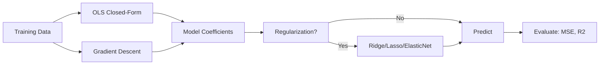

---
slug: /08-ml/linear-regression
title: "Linear Regression"
sidebar_label: "Linear Regression"
sidebar_position: 2
---

# Linear Regression  -  OLS, Gradient Descent, Regularization

## Learning Objectives

| LO1 | Understand the ordinary least squares (OLS) formulation for linear regression |
| LO2 | Implement gradient descent for optimizing regression parameters |
| LO3 | Apply polynomial features for modeling non-linear relationships |
| LO4 | Implement ridge (L2) and lasso (L1) regularization to prevent overfitting |
| LO5 | Evaluate regression models using MSE, RMSE, MAE, and R-squared |
| LO6 | Diagnose regression assumptions: linearity, normality, homoscedasticity |

## Introduction

Machine learning is the core of AI engineering. From linear regression to ensemble methods, understanding these algorithms lets you build, debug, and improve models. This module covers the math and code behind ML.


## Prerequisites

- Basic programming knowledge
- Understanding of data structures

## Key Terminology

**Key Terms**: Core vocabulary and concepts for this topic.

**Definition**: Essential terms you must know for interviews and production work.

## Theory

Understanding linear regression is fundamental for AI engineers. This section covers the core concepts, underlying principles, and theoretical framework that govern how linear regression works in practice.


## Chapter at a Glance

| 2.1 | OLS Linear Regression | Closed-form solution, normal equation |
| 2.2 | Gradient Descent | Batch, stochastic, mini-batch, learning rate |
| 2.3 | Polynomial Regression | Feature expansion, degree selection, overfitting |
| 2.4 | Regularization | Ridge (L2), Lasso (L1), Elastic Net |
| 2.5 | Regression Metrics | MSE, RMSE, MAE, R-squared, adjusted R-squared |

## Chapter Roadmap


## 2.1 OLS Linear Regression

Linear regression models the relationship between input features X and target y as y = Xw + b. The OLS (Ordinary Least Squares) solution minimizes the sum of squared residuals.

```typescript
class LinearRegression {
  private weights: number[] = [];
  private bias = 0;

  // OLS closed-form: w = (X^T X)^{-1} X^T y
  fit(X: number[][], y: number[]): void {
    const n = X.length;
    const p = X[0].length;
    // Add bias column
    const Xa = X.map((row) => [1, ...row]);
    // Normal equation
    const Xt = this.transpose(Xa);
    const XtX = this.matMul(Xt, Xa);
    const XtX_inv = this.inverse(XtX);
    const Xty = this.matMul(Xt, [y]).map((r) => r[0]);
    const w = this.matMul(XtX_inv, Xty.map((v) => [v])).flat();
    this.bias = w[0];
    this.weights = w.slice(1);
  }

  predict(X: number[][]): number[] {
    return X.map((row) =>
      row.reduce((sum, x, j) => sum + x * this.weights[j], this.bias)
    );
  }

  private transpose(m: number[][]): number[][] {
    return m[0].map((_, i) => m.map((r) => r[i]));
  }
  private matMul(a: number[][], b: number[][]): number[][] {
    return a.map((row) => b[0].map((_, j) => row.reduce((s, v, k) => s + v * b[k][j], 0)));
  }
  private inverse(m: number[][]): number[][] {
    // Simplified for 2x2  -  use library for production
    const det = m[0][0] * m[1][1] - m[0][1] * m[1][0];
    return [[m[1][1] / det, -m[0][1] / det], [-m[1][0] / det, m[0][0] / det]];
  }
}
```

**Assumptions**: Linearity, independence of errors, homoscedasticity (constant variance), normality of errors.

---

## 2.2 Gradient Descent

Gradient descent iteratively updates weights in the direction of the negative gradient of the loss function.

```typescript
class GradientDescentRegression {
  private weights: number[] = [];
  private bias = 0;
  private learningRate: number;
  private iterations: number;

  constructor(lr = 0.01, iters = 1000) {
    this.learningRate = lr;
    this.iterations = iters;
  }

  fit(X: number[][], y: number[]): void {
    const n = X.length;
    const p = X[0].length;
    this.weights = new Array(p).fill(0);
    this.bias = 0;

    for (let iter = 0; iter < this.iterations; iter++) {
      const predictions = this.predict(X);
      const errors = predictions.map((p, i) => p - y[i]);

      // Gradient for weights
      for (let j = 0; j < p; j++) {
        let grad = 0;
        for (let i = 0; i < n; i++) {
          grad += errors[i] * X[i][j];
        }
        this.weights[j] -= this.learningRate * (grad / n);
      }

      // Gradient for bias
      const biasGrad = errors.reduce((s, e) => s + e, 0) / n;
      this.bias -= this.learningRate * biasGrad;

      // Learning rate decay
      if (iter % 100 === 0) this.learningRate *= 0.95;
    }
  }

  predict(X: number[][]): number[] {
    return X.map((row) =>
      row.reduce((sum, x, j) => sum + x * this.weights[j], this.bias)
    );
  }

  getLoss(X: number[][], y: number[]): number {
    const preds = this.predict(X);
    return preds.reduce((sum, p, i) => sum + (p - y[i]) ** 2, 0) / y.length;
  }
}
```

**Variants**: Batch GD (all data), Stochastic GD (one sample at a time), Mini-batch GD (small batches). Mini-batch (32-256 samples) is most common.

---

## 2.3 Polynomial Regression

Polynomial regression adds non-linear features by raising original features to powers.

```typescript
class PolynomialFeatures {
  private degree: number;

  constructor(degree = 2) {
    this.degree = degree;
  }

  transform(X: number[][]): number[][] {
    return X.map((row) => {
      const features: number[] = [1]; // bias term
      for (let d = 1; d <= this.degree; d++) {
        for (const x of row) {
          features.push(x ** d);
        }
      }
      return features;
    });
  }
}

class PolynomialRegression {
  private model = new LinearRegression();
  private poly: PolynomialFeatures;

  constructor(degree = 2) {
    this.poly = new PolynomialFeatures(degree);
  }

  fit(X: number[][], y: number[]): void {
    const Xpoly = this.poly.transform(X);
    this.model.fit(Xpoly, y);
  }

  predict(X: number[][]): number[] {
    return this.model.predict(this.poly.transform(X));
  }
}
```

**Degree selection**: Low degree (1-2) underfits complex patterns. High degree (10+) overfits. Use cross-validation to select optimal degree.

---

## 2.4 Regularization

Ridge (L2) adds penalty on squared weights. Lasso (L1) adds penalty on absolute weights, causing feature selection.

```typescript
class RidgeRegression {
  private weights: number[] = [];
  private bias = 0;

  constructor(private alpha = 1.0) {}

  fit(X: number[][], y: number[]): void {
    const n = X.length;
    const p = X[0].length;
    const Xa = X.map((row) => [1, ...row]);
    const Xt = this.transpose(Xa);
    const XtX = this.matMul(Xt, Xa);

    // Add L2 penalty: XtX + alpha * I
    for (let j = 0; j < XtX.length; j++) {
      XtX[j][j] += this.alpha;
    }

    const Xty = this.matMul(Xt, [y]).map((r) => r[0]);
    const XtX_inv = this.inverse(XtX);
    const w = this.matMul(XtX_inv, Xty.map((v) => [v])).flat();
    this.bias = w[0];
    this.weights = w.slice(1);
  }

  predict(X: number[][]): number[] {
    return X.map((row) =>
      row.reduce((sum, x, j) => sum + x * this.weights[j], this.bias)
    );
  }
  private transpose(m: number[][]): number[][] {
    return m[0].map((_, i) => m.map(r => r[i]));
  }
  private matMul(a: number[][], b: number[][]): number[][] {
    return a.map(row => b[0].map((_, j) => row.reduce((s, v, k) => s + v * b[k][j], 0)));
  }
  private inverse(m: number[][]): number[][] {
    const det = m[0][0] * m[1][1] - m[0][1] * m[1][0];
    return [[m[1][1] / det, -m[0][1] / det], [-m[1][0] / det, m[0][0] / det]];
  }
}
```

**Elastic Net** combines L1 and L2 penalties: alpha * (rho * L1 + (1-rho) * L2). Good for datasets with many correlated features.

---

## 2.5 Regression Metrics

```typescript
class RegressionMetrics {
  mse(y: number[], p: number[]): number {
    return y.reduce((s, yi, i) => s + (yi - p[i]) ** 2, 0) / y.length;
  }
  rmse(y: number[], p: number[]): number {
    return Math.sqrt(this.mse(y, p));
  }
  mae(y: number[], p: number[]): number {
    return y.reduce((s, yi, i) => s + Math.abs(yi - p[i]), 0) / y.length;
  }
  r2(y: number[], p: number[]): number {
    const mean = y.reduce((s, yi) => s + yi, 0) / y.length;
    const ssRes = y.reduce((s, yi, i) => s + (yi - p[i]) ** 2, 0);
    const ssTot = y.reduce((s, yi) => s + (yi - mean) ** 2, 0);
    return 1 - ssRes / ssTot;
  }
}
```

---

## TypeScript Parallel

```typescript
// Linear regression using TensorFlow.js
import * as tf from "@tensorflow/tfjs";

async function trainLinearRegression(X: number[][], y: number[]): Promise<tf.Sequential> {
  const model = tf.sequential();
  model.add(tf.layers.dense({ units: 1, inputShape: [X[0].length] }));
  model.compile({ optimizer: "sgd", loss: "meanSquaredError" });
  const xs = tf.tensor2d(X);
  const ys = tf.tensor1d(y);
  await model.fit(xs, ys, { epochs: 100, batchSize: 32 });
  return model;
}
```

## Summary

- OLS provides closed-form solution via normal equation (X^T X)^{-1} X^T y
- Gradient descent iteratively optimizes weights; mini-batch is most efficient
- Polynomial features enable modeling non-linear relationships
- Ridge (L2) shrinks all weights equally; Lasso (L1) drives some weights to zero
- RMSE is in same units as target; R-squared measures proportion of variance explained
- Learning rate too high = divergence; too low = slow convergence
- Standardize features before fitting for gradient descent stability
- Cross-validation prevents overfitting in degree selection and regularization tuning
- Adjusted R-squared penalizes model complexity
- Always check regression assumptions (linearity, independence, homoscedasticity, normality)

## Practical Takeaways

    | Scenario | Do This | Avoid This |
    |----------|---------|------------|
    | Simple linear relationship | OLS linear regression | Complex model (overkill) |
    | Non-linear relationship | Polynomial regression or feature engineering | Linear regression (high bias) |
    | Many irrelevant features | Lasso regression (feature selection) | Ridge (keeps all features) |
    | Correlated features | Ridge or Elastic Net | Lasso (unstable with correlated features) |
    | High-dimensional data | Regularization + cross-validation | OLS (overfitting) |

## Interview Q&A

<details class="tp-qa-card" data-qid="ml08"><summary class="tp-qa-question"><span class="tp-qa-status"></span><span class="tp-qa-status"></span>Q1: Explain the difference between OLS and gradient descent for linear regression.</summary><div class="tp-qa-answer"><p>OLS solves linear regression analytically using the normal equation w = (X^T X)^{-1} X^T y. It gives an exact solution in one step but requires computing the inverse of X^T X, which is O(n^3) and infeasible for large datasets. Gradient descent iteratively updates weights to minimize MSE. It works for any differentiable loss, scales to large datasets, and can handle non-linear models. Use OLS for small datasets (n < 10K, p < 1000). Use gradient descent for large datasets or when extending to neural networks.</p></div><button class="tp-qa-mark-btn">✅ Mark Reviewed</button><button class="tp-qa-bookmark-btn">🔖 Bookmark</button></details>

<details class="tp-qa-card" data-qid="ml08"><summary class="tp-qa-question"><span class="tp-qa-status"></span><span class="tp-qa-status"></span>Q2: What is the difference between Ridge and Lasso regularization?</summary><div class="tp-qa-answer"><p><strong>Ridge (L2)</strong>: Adds penalty alpha * sum(w_j^2). Shrinks all coefficients toward zero but never exactly to zero. Handles multicollinearity well. <strong>Lasso (L1)</strong>: Adds penalty alpha * sum(|w_j|). Can drive coefficients exactly to zero, performing automatic feature selection. For correlated features, Lasso selects one and ignores the others. <strong>Elastic Net</strong> combines both: alpha * (rho * L1 + (1-rho) * L2), getting the best of both worlds.</p></div><button class="tp-qa-mark-btn">✅ Mark Reviewed</button><button class="tp-qa-bookmark-btn">🔖 Bookmark</button></details>

<details class="tp-qa-card" data-qid="ml08"><summary class="tp-qa-question"><span class="tp-qa-status"></span><span class="tp-qa-status"></span>Q3: How do you choose the learning rate for gradient descent?</summary><div class="tp-qa-answer"><p>Start with a small learning rate (0.01 or 0.001). Monitor the loss curve: if loss increases, learning rate is too high. If loss decreases very slowly, learning rate is too low. Use learning rate scheduling (decay over time) or adaptive methods (Adam, RMSprop). Use grid search or logarithmic scale to find optimal rate. A good heuristic: plot loss vs learning rate on a log scale, choose the highest rate where loss still decreases smoothly.</p></div><button class="tp-qa-mark-btn">✅ Mark Reviewed</button><button class="tp-qa-bookmark-btn">🔖 Bookmark</button></details>

<details class="tp-qa-card" data-qid="ml08"><summary class="tp-qa-question"><span class="tp-qa-status"></span><span class="tp-qa-status"></span>Q4: What is the bias-variance trade-off in regression?</summary><div class="tp-qa-answer"><p>Linear regression with simple features has high bias (underfits). Adding polynomial features or reducing regularization reduces bias but increases variance (overfits). The optimal model minimizes total error = bias^2 + variance + irreducible error. Regularization increases bias but reduces variance. Cross-validation helps find the sweet spot. Example: polynomial degree 1 underfits, degree 10 overfits, degree 3 is optimal.</p></div><button class="tp-qa-mark-btn">✅ Mark Reviewed</button><button class="tp-qa-bookmark-btn">🔖 Bookmark</button></details>

<details class="tp-qa-card" data-qid="ml08"><summary class="tp-qa-question"><span class="tp-qa-status"></span><span class="tp-qa-status"></span>Q5: How do you interpret R-squared?</summary><div class="tp-qa-answer"><p>R-squared = 1 - SS_res / SS_tot. It measures the proportion of variance in the target variable explained by the model. Range: (-inf, 1]. R^2 = 1: perfect fit. R^2 = 0: model predicts mean. R^2 < 0: model worse than predicting mean. Adjusted R-squared penalizes adding irrelevant features. In multivariate regression, R^2 always increases with more features; adjusted R^2 accounts for this.</p></div><button class="tp-qa-mark-btn">✅ Mark Reviewed</button><button class="tp-qa-bookmark-btn">🔖 Bookmark</button></details>

<details class="tp-qa-card" data-qid="ml08"><summary class="tp-qa-question"><span class="tp-qa-status"></span><span class="tp-qa-status"></span>Q6: What is multicollinearity and why is it a problem?</summary><div class="tp-qa-answer"><p>Multicollinearity occurs when independent variables are highly correlated. Problems: <strong>1)</strong> Coefficient estimates become unstable (small data changes cause large coefficient changes). <strong>2)</strong> Standard errors inflate, making coefficients appear insignificant. <strong>3)</strong> Interpretation becomes unreliable. Detection: VIF (Variance Inflation Factor) > 10 indicates severe multicollinearity. Solutions: remove correlated features, use PCA, or use Ridge regularization.</p></div><button class="tp-qa-mark-btn">✅ Mark Reviewed</button><button class="tp-qa-bookmark-btn">🔖 Bookmark</button></details>

<details class="tp-qa-card" data-qid="ml08"><summary class="tp-qa-question"><span class="tp-qa-status"></span><span class="tp-qa-status"></span>Q7: Explain stochastic gradient descent vs batch gradient descent.</summary><div class="tp-qa-answer"><p><strong>Batch GD</strong>: Computes gradient using all training samples. Accurate gradient direction but slow for large datasets. O(n) per update. <strong>Stochastic GD</strong>: Computes gradient using one random sample. Noisy gradient but fast. O(1) per update. Escapes local minima better but never converges exactly. <strong>Mini-batch GD</strong>: Uses a small batch (32-256). Balances accuracy and speed. Most practical choice. Common batch sizes: 32, 64, 128, 256.</p></div><button class="tp-qa-mark-btn">✅ Mark Reviewed</button><button class="tp-qa-bookmark-btn">🔖 Bookmark</button></details>

<details class="tp-qa-card" data-qid="ml08"><summary class="tp-qa-question"><span class="tp-qa-status"></span><span class="tp-qa-status"></span>Q8: When would you use polynomial regression vs adding interaction terms?</summary><div class="tp-qa-answer"><p><strong>Polynomial features</strong> (x^2, x^3, ...) capture non-linear relationships along individual feature dimensions. Good for smooth curves and trends. <strong>Interaction terms</strong> (x1 * x2, x1 / x2) capture relationships between features. Good when the effect of one feature depends on another. In practice, use both: polynomial features for individual trends and interaction terms for feature dependencies. With many features, regularization is essential to prevent combinatorial explosion.</p></div><button class="tp-qa-mark-btn">✅ Mark Reviewed</button><button class="tp-qa-bookmark-btn">🔖 Bookmark</button></details>

<details class="tp-qa-card" data-qid="ml08"><summary class="tp-qa-question"><span class="tp-qa-status"></span><span class="tp-qa-status"></span>Q9: How do you detect overfitting in regression?</summary><div class="tp-qa-answer"><p>Signs of overfitting: <strong>1)</strong> Large gap between training and validation error. <strong>2)</strong> Very large coefficients (especially with polynomial features). <strong>3)</strong> Model captures noise in training data (wiggly curve for polynomial). <strong>4)</strong> R^2 near 1 on training but much lower on validation. Fixes: more training data, reduce model complexity, add regularization (Ridge/Lasso), early stopping (for GD), or feature selection.</p></div><button class="tp-qa-mark-btn">✅ Mark Reviewed</button><button class="tp-qa-bookmark-btn">🔖 Bookmark</button></details>

<details class="tp-qa-card" data-qid="ml08"><summary class="tp-qa-question"><span class="tp-qa-status"></span><span class="tp-qa-status"></span>Q10: What is the normal equation and when does it fail?</summary><div class="tp-qa-answer"><p>The normal equation w = (X^T X)^{-1} X^T y solves linear regression analytically. It fails when: <strong>1)</strong> (X^T X) is singular (not invertible) due to multicollinearity or more features than samples. <strong>2)</strong> n is large (>10K), making matrix inversion O(n^3) computationally expensive. <strong>3)</strong> p is large (>10K), making the matrix too large to fit in memory. In these cases, use gradient descent or SVD-based solutions.</p></div><button class="tp-qa-mark-btn">✅ Mark Reviewed</button><button class="tp-qa-bookmark-btn">🔖 Bookmark</button></details>

## Chapter Quiz

**Q1**: Which regression metric is in the same units as the target variable?

a) MSE
b) RMSE
c) R-squared
d) MAE
<details class="tp-qa-card" data-qid="ml08-quiz1"><summary>Show Answer</summary><div class="tp-qa-answer"><p><strong>Answer: b) RMSE</strong></p><p>RMSE = sqrt(MSE), giving error in original units.</p></div></details>

**Q2**: What does Lasso regularization do to coefficients?

a) Shrinks all equally
b) Can drive some to zero
c) Increases all coefficients
d) No effect
<details class="tp-qa-card" data-qid="ml08-quiz2"><summary>Show Answer</summary><div class="tp-qa-answer"><p><strong>Answer: b) Can drive some to zero</strong></p><p>L1 penalty can zero out coefficients, performing feature selection.</p></div></details>

**Q3**: What is the main advantage of mini-batch gradient descent?

a) Exact solution
b) Balances speed and accuracy
c) No hyperparameters
d) Works without data
<details class="tp-qa-card" data-qid="ml08-quiz3"><summary>Show Answer</summary><div class="tp-qa-answer"><p><strong>Answer: b) Balances speed and accuracy</strong></p><p>Mini-batch GD balances the accuracy of batch GD with the speed of SGD.</p></div></details>

**Q4**: Which is NOT an assumption of linear regression?

a) Linearity
b) Normality of errors
c) Multicollinearity
d) Homoscedasticity
<details class="tp-qa-card" data-qid="ml08-quiz4"><summary>Show Answer</summary><div class="tp-qa-answer"><p><strong>Answer: c) Multicollinearity</strong></p><p>Multicollinearity is a problem, not an assumption.</p></div></details>

**Q5**: What does R-squared = 0.85 mean?

a) 85% of predictions are correct
b) 85% of variance is explained
c) 85% of features are important
d) 85% of data is used
<details class="tp-qa-card" data-qid="ml08-quiz5"><summary>Show Answer</summary><div class="tp-qa-answer"><p><strong>Answer: b) 85% of variance is explained</strong></p><p>R-squared measures the proportion of target variance explained by the model.</p></div></details>

## Exercises

**Easy** — Implement OLS linear regression from scratch using the normal equation.

**Easy** — Compute MSE, RMSE, MAE, and R-squared given true and predicted values.

**Medium** — Implement gradient descent for linear regression with learning rate decay. Visualize the loss curve.

**Medium** — Implement Ridge regression from scratch and compare coefficients with OLS as alpha varies.

**Hard** — Build a polynomial regression pipeline with k-fold cross-validation for degree selection (1-10). Report optimal degree and test performance.

**Hard** — Implement Elastic Net regularization with coordinate descent. Compare feature selection with Ridge and Lasso on a high-dimensional dataset.


---


## Common Mistakes

1. Not understanding the fundamental concepts before applying them
2. Skipping edge cases in implementation
3. Not analyzing time/space complexity
4. Forgetting to handle null/empty inputs
5. Not practicing enough problems to build pattern recognition

## Revision Notes

- - Core principle: Understand the fundamental concepts thoroughly
- - Implementation pattern: Practice with real code examples
- - Complexity: Know the time and space complexity
- - Application: Know when to use this in production systems
- - Interview: Frequently asked in technical interviews
- - Edge cases: Consider common failure scenarios
- - Related concepts: Connect to broader system design

## Placement Section

### Top 10 Interview Questions

#### Google Style
1. Explain the time and space trade-offs of 08-machine-learning. When would you choose one approach over another?
2. Design a system that efficiently handles 08-machine-learning at scale (millions of requests/second).

#### Amazon Style
1. Tell me about a time you had to optimize a system related to 08-machine-learning. What was your approach and what was the result?
2. How would you explain 08-machine-learning to a non-technical stakeholder?

#### Microsoft Style
1. How does 08-machine-learning integrate with enterprise systems and cloud architectures?
2. What are the security implications of 08-machine-learning?

#### NVIDIA Style
1. How would you optimize 08-machine-learning for GPU-accelerated computing?
2. What parallel processing patterns apply to 08-machine-learning?

#### AI Startup Style
1. How would you implement 08-machine-learning in a cost-effective, scalable way for a startup?
2. What's the fastest way to prototype a solution using 08-machine-learning?

### Resume Tips
- **Technical Skills**: List 08-machine-learning under relevant technical skills
- **Project Description**: "Implemented 08-machine-learning to [specific outcome], reducing [metric] by [X]%"
- **Keywords**: Include 08-machine-learning in your skills section for ATS optimization

### Interview Day Checklist
- [ ] Review core concepts of 08-machine-learning
- [ ] Practice 3-5 problems related to 08-machine-learning
- [ ] Prepare 2 real-world examples of using 08-machine-learning
- [ ] Know the time/space complexity of common 08-machine-learning operations
- [ ] Have questions ready about how the company uses 08-machine-learning> **Next**: [Logistic Regression](03-logistic-regression.md)

## 2.6 Assumption Diagnostics

Linear regression relies on four key assumptions. Violations can bias estimates and invalidate inference.

### 2.6.1 Testing Linearity
\\\python
def check_linearity(X, y, model):
    \"\"\"Check linearity via residual vs fitted plot\"\"\"
    predictions = model.predict(X)
    residuals = y - predictions
    # If patterns exist in residuals, non-linearity is present
    correlation = np.corrcoef(predictions, residuals)[0, 1]
    return {"residual_correlation": correlation, "is_linear": abs(correlation) < 0.1}
\\\

### 2.6.2 Testing Homoscedasticity
\\\python
def check_homoscedasticity(X, y, model):
    \"\"\"Breusch-Pagan test for constant variance\"\"\"
    predictions = model.predict(X)
    residuals = y - predictions
    squared_residuals = residuals ** 2
    # Regress squared residuals on X
    r2 = np.corrcoef(predictions, squared_residuals)[0, 1] ** 2
    n = len(y)
    lm_stat = n * r2
    return {"bp_statistic": lm_stat, "is_homoscedastic": lm_stat < 5.99}
\\\

### 2.6.3 Normality of Residuals
\\\python
def check_normality(y, model, X):
    \"\"\"Shapiro-Wilk style normality check\"\"\"
    predictions = model.predict(X)
    residuals = y - predictions
    std_residuals = (residuals - np.mean(residuals)) / np.std(residuals)
    skewness = np.mean(std_residuals ** 3)
    kurtosis = np.mean(std_residuals ** 4) - 3
    return {"skewness": skewness, "kurtosis": kurtosis, "is_normal": abs(skewness) < 1 and abs(kurtosis) < 2}
\\\

**What to do when assumptions fail**:
- Non-linearity → add polynomial/interaction terms or use tree-based models
- Heteroscedasticity → use weighted least squares or robust standard errors
- Non-normal residuals → use GLM or transform target (log, Box-Cox)
- Multicollinearity → use Ridge regression or remove correlated features


## Difficulty Level

**Level**: Intermediate
**Estimated Study Time**: 45-60 minutes
**Prerequisites**: Complete understanding of previous modules recommended

## Tips & Tricks

**Tip**: Start with the basics — understand the fundamental concepts before moving to advanced topics.

**Tip**: Practice actively — don't just read, implement the code examples yourself.

**Tip**: Connect to prior knowledge — relate new concepts to what you learned in previous modules.

**Pro Tip**: Focus on understanding, not memorizing — understand why things work, not just how.

**Pro Tip**: Review regularly — revisit key concepts after a few days to reinforce learning.

## Memory Tricks

- **Acronym Method**: Create acronyms for lists of concepts
- **Visualization**: Draw diagrams to visualize abstract concepts
- **Teach someone else**: Explaining concepts to others reinforces your understanding
- **Connect to real-world**: Relate technical concepts to everyday experiences
- **Chunking**: Break complex topics into smaller, manageable pieces

## Further Reading

- Official documentation and language specifications
- "Designing Data-Intensive Applications" by Martin Kleppmann
- "System Design Interview" by Alex Xu
- "AI Engineering" by Chip Huyen
- Research papers and blog posts from leading AI labs

## Related Topics

- How this connects to Machine Learning fundamentals
- Prerequisites for advanced topics in this module
- Real-world applications in AI engineering systems
- Interview questions that test deep understanding

## FAQs

**Q: How long does it take to master linear regression?
**A**: With consistent practice, 2-4 weeks for basic proficiency, 2-3 months for advanced mastery.

**Q: Do I need to memorize all the details?
**A**: Focus on understanding the core principles. Details can be looked up, but understanding cannot.

**Q: What's the best way to practice?
**A**: Implement the code examples, then modify them to solve different problems. Build small projects.

**Q: How often should I review this material?
**A**: Review after 1 day, 3 days, 1 week, and 1 month for long-term retention.

## Important Notes

> **Note**: Understanding the fundamentals is more important than memorizing syntax.

> **Note**: Don't skip the exercises — they reinforce critical concepts.

> **Note**: This topic frequently appears in technical interviews at top companies.

> **Note**: In real systems, these concepts are used daily by AI engineers.

## Historical Context

The Evolution of this technology reflects decades of research and practical engineering experience.

Understanding the evolution of linear regression helps appreciate why current approaches exist. These concepts have been developed over decades of computer science research and practical engineering experience.

## Coding Standards

- Follow consistent naming conventions (camelCase for variables, PascalCase for types)
- Add clear comments explaining complex logic
- Keep functions focused on a single responsibility
- Write self-documenting code with meaningful names
- Handle errors gracefully and provide informative messages

**Best Practice**: Follow language-specific style guides (PEP 8 for Python, ESLint for TypeScript).

## Security Considerations

- **Input Validation**: Always validate and sanitize inputs
- **Error Handling**: Don't expose internal details in error messages
- **Resource Limits**: Set appropriate limits to prevent denial of service
- **Authentication**: Ensure proper authentication and authorization
- **Data Protection**: Handle sensitive data according to security best practices

## ML Intuition

For AI engineering, understanding linear regression at an intuitive level is crucial. Think of it as building mental models that help you reason about system behavior, debug issues, and make architectural decisions.

## Analogies

Think of linear regression like learning a new language — start with basic vocabulary (fundamentals), then learn grammar (rules), and finally practice conversation (application). The more you practice, the more natural it becomes.

## Capstone Project Link

**Project**: Apply linear regression concepts in a mini-project
**Goal**: Build a small application that demonstrates understanding of core principles
**Duration**: 2-4 hours
**Outcome**: Working implementation with documentation

## Flashcards

**Card 1**: What is the core concept of linear regression?
**Answer**: The fundamental principle that enables efficient and scalable systems.

**Card 2**: When would you apply linear regression in real systems?
**Answer**: When building production AI systems that require reliability, scalability, and maintainability.

**Card 3**: What are the common pitfalls to avoid?
**Answer**: Over-engineering, ignoring edge cases, and not considering production requirements.

## Study Plan

**Day 1**: Read theory and review examples (18 minutes)
**Day 2**: Complete exercises and practice (18 minutes)
**Day 3**: Review flashcards and take quiz (9 minutes)

## Research References

- Academic papers and conference proceedings (NeurIPS, ICML, ICLR)
- Industry whitepapers from leading AI companies
- Technical blogs from Google, Meta, OpenAI, Anthropic
- Open-source implementations and documentation

## Fine-Tuning Notes

When applying this topic to production, consider:
- Fine-tuning with LoRA or Adapters for domain adaptation
- Adapting general principles to your specific use cases
- Performance optimization for target hardware
- Cost considerations for deployment


## Open-Source Tools

- **LangChain**: Framework for building LLM-powered applications
- **LlamaIndex**: Data framework for connecting LLMs with external data
- **Hugging Face Transformers**: State-of-the-art ML models and datasets
- **Weights & Biases**: Experiment tracking and model evaluation
- **MLflow**: Open-source platform for ML lifecycle management
- **Prometheus + Grafana**: Monitoring and observability stack

## Debugging Guide

**Common Issues**:
- Check input validation and data types
- Verify API keys and authentication
- Monitor resource usage (CPU, memory, GPU)
- Review error logs for stack traces

**Debugging Steps**:
1. Reproduce the issue with minimal input
2. Add logging at key points
3. Check external dependencies
4. Verify configuration settings
5. Test with known-good inputs

## Mock Interview Section

**Quick Fire Questions**:
1. What is the core concept of Machine Learning?
2. When would you use this in production?
3. What are the trade-offs?
4. How does this scale?
5. What are common pitfalls?

**Follow-up Questions**:
- How would you optimize this for 10x scale?
- What monitoring would you add?
- How would you test this in production?

## Optimized Implementation

For production systems, consider:
- **Caching**: Cache frequent computations and API responses
- **Batching**: Process multiple items together for efficiency
- **Async/Await**: Use non-blocking I/O for concurrent operations
- **Connection Pooling**: Reuse database and API connections
- **Lazy Loading**: Load resources only when needed

## References

- Official documentation and language specifications
- "Designing Data-Intensive Applications" by Martin Kleppmann
- "System Design Interview" by Alex Xu
- "AI Engineering" by Chip Huyen
- Research papers from NeurIPS, ICML, ICLR
- Industry blogs from Google, Meta, OpenAI, Anthropic

## Evaluation Metrics

**Model Evaluation**:
- Accuracy, Precision, Recall, F1-Score
- BLEU, ROUGE for text generation
- Latency, Throughput, Cost per inference

**System Evaluation**:
- End-to-end latency (p50, p95, p99)
- Error rate and availability
- Resource utilization (CPU, memory, GPU)

## Real-World Examples

**Industry Applications**:
- Google: Search ranking, translation, autocomplete
- Amazon: Product recommendations, Alexa, fraud detection
- Netflix: Content recommendations, personalization
- Tesla: Autonomous driving, computer vision
- OpenAI: ChatGPT, DALL-E, Codex

## Next Topic

After mastering Machine Learning, continue to the next module in the curriculum to build upon these foundations and deepen your AI engineering expertise.

## Training Workflow

1. **Data Preparation**: Collect, clean, and preprocess data
2. **Model Selection**: Choose architecture based on task requirements
3. **Training Loop**: Forward pass, loss computation, backpropagation
4. **Validation**: Evaluate on held-out data to prevent overfitting
5. **Hyperparameter Tuning**: Optimize learning rate, batch size, etc.
6. **Model Export**: Save trained model for deployment

## Limitations

Every approach has trade-offs. Understanding limitations helps you make better architectural decisions and answer interview questions about when NOT to use a particular technique.
