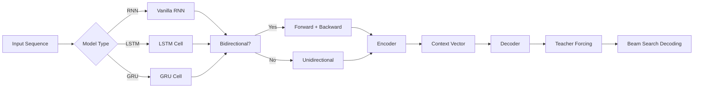

---
slug: /10-nlp/sequence-models
title: "Sequence Models"
sidebar_label: "Sequence Models"
sidebar_position: 3
---

# Sequence Models — RNN, LSTM, GRU, Bidirectional, Encoder-Decoder

## Learning Objectives

| LO# | Description |
|-----|-------------|
| LO1 | Explain the vanishing/exploding gradient problem in vanilla RNNs and how LSTM/GRU solve it |
| LO2 | Implement LSTM with input, forget, output gates and cell state |
| LO3 | Implement GRU with update and reset gates as a simplified LSTM |
| LO4 | Build bidirectional RNNs for full context representation |
| LO5 | Construct encoder-decoder architectures for sequence-to-sequence tasks |
| LO6 | Apply teacher forcing, attention, and beam search in seq2seq decoding |

## Introduction

Natural language processing is how machines understand human text. Transformers revolutionized NLP and enabled modern LLMs. This module covers tokenization, attention, BERT, and the Hugging Face ecosystem.


## Prerequisites

- Basic programming knowledge
- Understanding of data structures

## Key Terminology

**Key Terms**: Core vocabulary and concepts for this topic.

**Definition**: Essential terms you must know for interviews and production work.

## Theory

Understanding sequence models is fundamental for AI engineers. This section covers the core concepts, underlying principles, and theoretical framework that govern how sequence models works in practice.


## Chapter at a Glance

| Section | Topic | Key Concept |
|---------|-------|-------------|
| 3.1 | Vanilla RNN | Hidden state recurrence, tanh activation, gradient issues |
| 3.2 | LSTM | Cell state with forget/input/output gates, gradient flow |
| 3.3 | GRU | Update/reset gates, fewer parameters than LSTM |
| 3.4 | Bidirectional RNNs | Forward + backward passes, full context representation |
| 3.5 | Encoder-Decoder | Context vector, variable-length input/output |
| 3.6 | Advanced Decoding | Teacher forcing, attention, beam search |

## Chapter Roadmap



## 3.1 Vanilla RNN

A recurrent neural network processes sequences by maintaining a hidden state that is updated at each timestep: h_t = tanh(W_hh * h_{t-1} + W_xh * x_t + b_h). The same weights are shared across all timesteps.

```typescript
class VanillaRNN {
  private hiddenSize: number;
  private inputSize: number;
  private Whh: number[][];
  private Wxh: number[][];
  private bh: number[];
  private h: number[];

  constructor(inputSize: number, hiddenSize: number) {
    this.inputSize = inputSize;
    this.hiddenSize = hiddenSize;
    this.Whh = this.initMatrix(hiddenSize, hiddenSize);
    this.Wxh = this.initMatrix(hiddenSize, inputSize);
    this.bh = new Array(hiddenSize).fill(0);
    this.h = new Array(hiddenSize).fill(0);
  }

  private initMatrix(rows: number, cols: number): number[][] {
    const scale = Math.sqrt(2 / (rows + cols));
    return Array.from({ length: rows }, () =>
      Array.from({ length: cols }, () => (Math.random() * 2 - 1) * scale)
    );
  }

  forwardStep(x: number[]): number[] {
    // h_t = tanh(W_hh * h_{t-1} + W_xh * x_t + b_h)
    const newH = new Array(this.hiddenSize).fill(0);
    for (let i = 0; i < this.hiddenSize; i++) {
      for (let j = 0; j < this.hiddenSize; j++) {
        newH[i] += this.Whh[i][j] * this.h[j];
      }
      for (let j = 0; j < this.inputSize; j++) {
        newH[i] += this.Wxh[i][j] * x[j];
      }
      newH[i] += this.bh[i];
      newH[i] = Math.tanh(newH[i]);
    }
    this.h = newH;
    return this.h;
  }

  forward(inputs: number[][]): number[][] {
    const outputs: number[][] = [];
    for (const x of inputs) {
      outputs.push(this.forwardStep(x));
    }
    return outputs;
  }

  resetState(): void {
    this.h = new Array(this.hiddenSize).fill(0);
  }
}
```

**Vanishing gradient problem**: During backpropagation through time (BPTT), gradients are multiplied by the same weight matrix at each timestep. If eigenvalues of W_hh are < 1, gradients vanish to zero. If > 1, gradients explode. LSTM's gating mechanism provides a direct gradient highway through the cell state.

---

## 3.2 LSTM

The Long Short-Term Memory (LSTM) introduces a cell state C_t that runs through the sequence with only linear operations, protected by three gates: forget (f), input (i), and output (o).

```typescript
class LSTMCell {
  private inputSize: number;
  private hiddenSize: number;

  // Weight matrices for gates
  private Wf: number[][]; private bf: number[];
  private Wi: number[][]; private bi: number[];
  private Wc: number[][]; private bc: number[];
  private Wo: number[][]; private bo: number[];

  private h: number[];
  private c: number[];

  constructor(inputSize: number, hiddenSize: number) {
    this.inputSize = inputSize;
    this.hiddenSize = hiddenSize;
    const concatSize = hiddenSize + inputSize;

    this.Wf = this.initMatrix(hiddenSize, concatSize); this.bf = new Array(hiddenSize).fill(0);
    this.Wi = this.initMatrix(hiddenSize, concatSize); this.bi = new Array(hiddenSize).fill(0);
    this.Wc = this.initMatrix(hiddenSize, concatSize); this.bc = new Array(hiddenSize).fill(0);
    this.Wo = this.initMatrix(hiddenSize, concatSize); this.bo = new Array(hiddenSize).fill(0);

    this.h = new Array(hiddenSize).fill(0);
    this.c = new Array(hiddenSize).fill(0);
  }

  private initMatrix(rows: number, cols: number): number[][] {
    const scale = Math.sqrt(2 / (rows + cols));
    return Array.from({ length: rows }, () =>
      Array.from({ length: cols }, () => (Math.random() * 2 - 1) * scale)
    );
  }

  private sigmoid(x: number): number {
    return 1 / (1 + Math.exp(-x));
  }

  private concat(a: number[], b: number[]): number[] {
    return [...a, ...b];
  }

  private matVecMul(W: number[][], v: number[]): number[] {
    return W.map((row) => row.reduce((s, w, j) => s + w * v[j], 0));
  }

  forward(x_t: number[]): { h: number[]; c: number[] } {
    const combined = this.concat(this.h, x_t);

    // Forget gate: f_t = sigmoid(W_f * [h_{t-1}, x_t] + b_f)
    const f = this.matVecMul(this.Wf, combined).map(
      (v, i) => this.sigmoid(v + this.bf[i])
    );

    // Input gate: i_t = sigmoid(W_i * [h_{t-1}, x_t] + b_i)
    const i = this.matVecMul(this.Wi, combined).map(
      (v, idx) => this.sigmoid(v + this.bi[idx])
    );

    // Candidate cell: C~_t = tanh(W_c * [h_{t-1}, x_t] + b_c)
    const cCandidate = this.matVecMul(this.Wc, combined).map(
      (v, idx) => Math.tanh(v + this.bc[idx])
    );

    // Cell state: C_t = f_t * C_{t-1} + i_t * C~_t
    this.c = this.c.map((c_old, idx) => f[idx] * c_old + i[idx] * cCandidate[idx]);

    // Output gate: o_t = sigmoid(W_o * [h_{t-1}, x_t] + b_o)
    const o = this.matVecMul(this.Wo, combined).map(
      (v, idx) => this.sigmoid(v + this.bo[idx])
    );

    // Hidden state: h_t = o_t * tanh(C_t)
    this.h = this.c.map((c_val, idx) => o[idx] * Math.tanh(c_val));

    return { h: this.h, c: this.c };
  }

  forwardSequence(inputs: number[][]): number[][] {
    const outputs: number[][] = [];
    for (const x of inputs) {
      outputs.push(this.forward(x).h);
    }
    return outputs;
  }

  resetState(): void {
    this.h = new Array(this.hiddenSize).fill(0);
    this.c = new Array(this.hiddenSize).fill(0);
  }
}
```

The cell state C_t is the key innovation. Gradients flow through C_t with only element-wise multiplication by f_t (forget gate), which prevents vanishing gradients because f_t values are close to 1 when the network learns to keep information.

---

## 3.3 GRU

The Gated Recurrent Unit (GRU) simplifies the LSTM by merging the cell state and hidden state into a single state vector h_t, using only two gates: update (z) and reset (r).

```typescript
class GRUCell {
  private inputSize: number;
  private hiddenSize: number;
  private Wz: number[][]; private bz: number[];
  private Wr: number[][]; private br: number[];
  private Wh: number[][]; private bh: number[];
  private h: number[];

  constructor(inputSize: number, hiddenSize: number) {
    this.inputSize = inputSize;
    this.hiddenSize = hiddenSize;
    const concatSize = hiddenSize + inputSize;

    this.Wz = this.initMatrix(hiddenSize, concatSize); this.bz = new Array(hiddenSize).fill(0);
    this.Wr = this.initMatrix(hiddenSize, concatSize); this.br = new Array(hiddenSize).fill(0);
    this.Wh = this.initMatrix(hiddenSize, concatSize); this.bh = new Array(hiddenSize).fill(0);
    this.h = new Array(hiddenSize).fill(0);
  }

  private initMatrix(rows: number, cols: number): number[][] {
    const scale = Math.sqrt(2 / (rows + cols));
    return Array.from({ length: rows }, () =>
      Array.from({ length: cols }, () => (Math.random() * 2 - 1) * scale)
    );
  }

  private sigmoid(x: number): number {
    return 1 / (1 + Math.exp(-x));
  }

  private matVecMul(W: number[][], v: number[]): number[] {
    return W.map((row) => row.reduce((s, w, j) => s + w * v[j], 0));
  }

  forward(x_t: number[]): number[] {
    const combined = [...this.h, x_t];

    // Update gate: z_t = sigmoid(W_z * [h_{t-1}, x_t] + b_z)
    const z = this.matVecMul(this.Wz, combined).map(
      (v, i) => this.sigmoid(v + this.bz[i])
    );

    // Reset gate: r_t = sigmoid(W_r * [h_{t-1}, x_t] + b_r)
    const r = this.matVecMul(this.Wr, combined).map(
      (v, i) => this.sigmoid(v + this.br[i])
    );

    // Candidate hidden: h~_t = tanh(W_h * [r_t * h_{t-1}, x_t] + b_h)
    const resetH = this.h.map((h_val, i) => r[i] * h_val);
    const combinedReset = [...resetH, x_t];
    const hCandidate = this.matVecMul(this.Wh, combinedReset).map(
      (v, i) => Math.tanh(v + this.bh[i])
    );

    // Final hidden: h_t = (1 - z_t) * h_{t-1} + z_t * h~_t
    this.h = this.h.map((h_old, i) => (1 - z[i]) * h_old + z[i] * hCandidate[i]);

    return this.h;
  }

  forwardSequence(inputs: number[][]): number[][] {
    const outputs: number[][] = [];
    for (const x of inputs) {
      outputs.push(this.forward(x));
    }
    return outputs;
  }

  resetState(): void {
    this.h = new Array(this.hiddenSize).fill(0);
  }
}
```

GRU has fewer parameters than LSTM (3 gates vs 4), trains faster, and often matches LSTM performance on smaller datasets. On large datasets, LSTM's additional output gate sometimes provides marginal gains.

---

## 3.4 Bidirectional RNNs

A bidirectional RNN processes the sequence in both forward and backward directions, concatenating the hidden states at each timestep. This gives each token awareness of both past and future context.

```typescript
class BidirectionalLSTM {
  private forwardLSTM: LSTMCell;
  private backwardLSTM: LSTMCell;
  private hiddenSize: number;

  constructor(inputSize: number, hiddenSize: number) {
    this.hiddenSize = hiddenSize;
    this.forwardLSTM = new LSTMCell(inputSize, hiddenSize);
    this.backwardLSTM = new LSTMCell(inputSize, hiddenSize);
  }

  forward(inputs: number[][]): number[][] {
    // Forward pass
    this.forwardLSTM.resetState();
    const forwardOut = this.forwardLSTM.forwardSequence(inputs);

    // Backward pass
    this.backwardLSTM.resetState();
    const reversedInputs = [...inputs].reverse();
    const backwardOut = this.backwardLSTM.forwardSequence(reversedInputs);
    const backwardReversed = [...backwardOut].reverse();

    // Concatenate forward and backward states
    return forwardOut.map((fState, i) => [...fState, ...backwardReversed[i]]);
  }
}
```

BiLSTMs are standard for NER, POS tagging, and any task where full sequence context is available. The output dimension is 2x the hidden size. For real-time applications (speech recognition), unidirectional is used because future tokens are unavailable.

---

## 3.5 Encoder-Decoder

The encoder-decoder (seq2seq) architecture maps a variable-length input sequence to a variable-length output sequence. The encoder produces a context vector that summarizes the input, and the decoder generates the output token-by-token.

```typescript
class Seq2SeqModel {
  private encoder: LSTMCell;
  private decoder: LSTMCell;
  private encoderHiddenSize: number;
  private decoderHiddenSize: number;
  private vocabSize: number;

  // Projection from decoder state to vocab probabilities
  private WOutput: number[][];
  private bOutput: number[];

  constructor(
    inputSize: number,
    encoderHiddenSize: number,
    decoderHiddenSize: number,
    vocabSize: number
  ) {
    this.encoder = new LSTMCell(inputSize, encoderHiddenSize);
    this.decoder = new LSTMCell(decoderHiddenSize, decoderHiddenSize);
    this.encoderHiddenSize = encoderHiddenSize;
    this.decoderHiddenSize = decoderHiddenSize;
    this.vocabSize = vocabSize;

    this.WOutput = Array.from({ length: vocabSize }, () =>
      Array.from({ length: decoderHiddenSize }, () => (Math.random() - 0.5) * 0.1)
    );
    this.bOutput = new Array(vocabSize).fill(0);
  }

  encode(inputs: number[][]): { lastHidden: number[]; lastCell: number[] } {
    this.encoder.resetState();
    for (const x of inputs) {
      this.encoder.forward(x);
    }
    return {
      lastHidden: [...this.encoder['h']],
      lastCell: [...this.encoder['c']],
    };
  }

  decode(
    targetInputs: number[][],
    initialHidden: number[],
    initialCell: number[]
  ): number[][] {
    this.decoder.resetState();
    const logits: number[][] = [];

    // Initialize decoder state with encoder final state
    this.decoder['h'] = initialHidden.slice(0, this.decoderHiddenSize);
    this.decoder['c'] = initialCell.slice(0, this.decoderHiddenSize);

    for (const x of targetInputs) {
      const { h } = this.decoder.forward(x);
      // Project to vocabulary
      const scores = new Array(this.vocabSize).fill(0);
      for (let i = 0; i < this.vocabSize; i++) {
        for (let j = 0; j < this.decoderHiddenSize; j++) {
          scores[i] += this.WOutput[i][j] * h[j];
        }
        scores[i] += this.bOutput[i];
      }
      logits.push(scores);
    }
    return logits;
  }

  private softmax(logits: number[]): number[] {
    const max = Math.max(...logits);
    const exp = logits.map((l) => Math.exp(l - max));
    const sum = exp.reduce((a, b) => a + b, 0);
    return exp.map((e) => e / sum);
  }

  generateProbabilities(logits: number[][]): number[][] {
    return logits.map((l) => this.softmax(l));
  }
}
```

The context vector (encoder's final hidden state) is a fixed-size bottleneck. For long sequences, attention mechanisms allow the decoder to look at all encoder hidden states instead of just the final one.

---

## 3.6 Advanced Decoding

**Teacher forcing** feeds the ground truth token (instead of the model's prediction) as the next decoder input during training. This stabilizes and speeds convergence but creates exposure bias: at inference, the model sees its own errors.

```typescript
class DecoderTrainer {
  private model: Seq2SeqModel;
  private useTeacherForcing: boolean;
  private teacherForcingRatio: number;

  constructor(model: Seq2SeqModel, teacherForcingRatio = 0.5) {
    this.model = model;
    this.teacherForcingRatio = teacherForcingRatio;
  }

  trainStep(
    source: number[][],
    target: number[][],
    targetTokens: number[]
  ): number {
    // Encode
    const { lastHidden, lastCell } = this.model.encode(source);

    // Decode with teacher forcing
    this.model['decoder'].resetState();
    this.model['decoder']['h'] = lastHidden.slice(0, this.model['decoderHiddenSize']);
    this.model['decoder']['c'] = lastCell.slice(0, this.model['decoderHiddenSize']);

    let loss = 0;
    let prevToken = target[0]; // <bos>

    for (let t = 1; t < target.length; t++) {
      const { h } = this.model['decoder'].forward(prevToken);

      // Compute logits
      const scores = new Array(this.model['vocabSize']).fill(0);
      for (let i = 0; i < this.model['vocabSize']; i++) {
        for (let j = 0; j < this.model['decoderHiddenSize']; j++) {
          scores[i] += this.model['WOutput'][i][j] * h[j];
        }
        scores[i] += this.model['bOutput'][i];
      }

      // Cross-entropy loss
      const probs = this.softmax(scores);
      loss -= Math.log(probs[targetTokens[t]] + 1e-8);

      // Teacher forcing decision
      const useTruth = Math.random() < this.teacherForcingRatio;
      prevToken = useTruth
        ? target[t]
        : this.sampleFromProbs(probs);
    }
    return loss;
  }

  private softmax(logits: number[]): number[] {
    const max = Math.max(...logits);
    const exp = logits.map((l) => Math.exp(l - max));
    const sum = exp.reduce((a, b) => a + b, 0);
    return exp.map((e) => e / sum);
  }

  private sampleFromProbs(probs: number[]): number[] {
    const cumSum: number[] = [];
    let sum = 0;
    for (const p of probs) {
      sum += p;
      cumSum.push(sum);
    }
    const r = Math.random();
    const idx = cumSum.findIndex((c) => c >= r);
    const oneHot = new Array(probs.length).fill(0);
    oneHot[idx >= 0 ? idx : probs.length - 1] = 1;
    return oneHot;
  }
}
```

**Beam search** maintains k candidate hypotheses instead of greedy decoding. At each step, it expands all k hypotheses, keeps the top k by cumulative log probability, and terminates when hypotheses hit `<eos>`.

```typescript
class BeamSearchDecoder {
  private model: Seq2SeqModel;
  private beamSize: number;
  private maxLen: number;

  constructor(model: Seq2SeqModel, beamSize = 4, maxLen = 50) {
    this.model = model;
    this.beamSize = beamSize;
    this.maxLen = maxLen;
  }

  decode(source: number[][]): number[] {
    const { lastHidden, lastCell } = this.model.encode(source);
    this.model['decoder'].resetState();
    this.model['decoder']['h'] = lastHidden.slice(0, this.model['decoderHiddenSize']);
    this.model['decoder']['c'] = lastCell.slice(0, this.model['decoderHiddenSize']);

    // Beam: array of { sequence, score, hidden, cell }
    interface BeamItem {
      sequence: number[];
      score: number;
      hidden: number[];
      cell: number[];
      finished: boolean;
    }

    let beam: BeamItem[] = [{
      sequence: [0], // <bos> token ID
      score: 0,
      hidden: [...this.model['decoder']['h']],
      cell: [...this.model['decoder']['c']],
      finished: false,
    }];

    for (let step = 0; step < this.maxLen; step++) {
      const candidates: BeamItem[] = [];

      for (const item of beam) {
        if (item.finished) {
          candidates.push(item);
          continue;
        }

        // Restore decoder state
        this.model['decoder']['h'] = [...item.hidden];
        this.model['decoder']['c'] = [...item.cell];

        // Convert last token to input
        const lastTokenOneHot = new Array(this.model['vocabSize']).fill(0);
        lastTokenOneHot[item.sequence[item.sequence.length - 1]] = 1;
        const { h } = this.model['decoder'].forward(lastTokenOneHot);

        // Compute probabilities
        const scores = new Array(this.model['vocabSize']).fill(0);
        for (let i = 0; i < this.model['vocabSize']; i++) {
          for (let j = 0; j < this.model['decoderHiddenSize']; j++) {
            scores[i] += this.model['WOutput'][i][j] * h[j];
          }
          scores[i] += this.model['bOutput'][i];
        }
        const probs = this.softmax(scores);

        // Get top k tokens
        const topK = this.getTopK(probs, this.beamSize);
        const newHidden = [...this.model['decoder']['h']];
        const newCell = [...this.model['decoder']['c']];

        for (const { token, prob } of topK) {
          candidates.push({
            sequence: [...item.sequence, token],
            score: item.score + Math.log(prob + 1e-8),
            hidden: newHidden,
            cell: newCell,
            finished: token === 1, // <eos> token ID
          });
        }
      }

      // Sort by score descending, keep top beamSize
      candidates.sort((a, b) => b.score - a.score);
      beam = candidates.slice(0, this.beamSize);

      // Stop if all finished
      if (beam.every((b) => b.finished)) break;
    }

    // Return best sequence (excluding <bos>)
    beam.sort((a, b) => b.score - a.score);
    return beam[0].sequence.slice(1);
  }

  private softmax(logits: number[]): number[] {
    const max = Math.max(...logits);
    const exp = logits.map((l) => Math.exp(l - max));
    const sum = exp.reduce((a, b) => a + b, 0);
    return exp.map((e) => e / sum);
  }

  private getTopK(
    probs: number[],
    k: number
  ): Array<{ token: number; prob: number }> {
    return probs
      .map((p, i) => ({ token: i, prob: p }))
      .sort((a, b) => b.prob - a.prob)
      .slice(0, k);
  }
}
```

Beam search with beam size 4-10 is standard for NMT and text generation. Larger beams give better results but with diminishing returns and higher computational cost.

---

## Summary

Sequence models process variable-length input and output sequences using recurrent architectures. The vanilla RNN maintains a hidden state that propagates information through time steps but.
suffers from vanishing gradients. LSTM introduces gating mechanisms and a cell state to preserve long-term dependencies, becoming the standard for most sequence tasks. GRU simplifies the LSTM with fewer gates while maintaining competitive performance. Bidirectional RNNs capture context from both past and.
future directions. The encoder-decoder architecture maps variable-length input sequences to output sequences through a fixed-dimensional bottleneck. Teacher forcing accelerates training by feeding ground-truth outputs during decoding,.
while beam search improves inference by maintaining multiple candidate sequences.

## Practical Takeaways

- LSTM solves the vanishing gradient problem via gated cell states; use it as the default RNN variant
- GRU matches LSTM on most tasks with fewer parameters and faster training
- Bidirectional RNNs are essential where full sequence context is available (NER, classification, QA)
- Teacher forcing speeds training but causes exposure bias; use scheduled sampling to mitigate
- Beam search (beam=4-10) significantly improves seq2seq decoding over greedy search
- Encoder-decoder with attention outperforms plain seq2seq for long sequences (>30 tokens)
- Stacking LSTM layers (2-4) captures hierarchical temporal patterns but increases overfitting risk
- Gradient clipping (max norm 1-5) is mandatory for RNN training to prevent gradient explosion

## Interview Q&A

<details class="tp-qa-card" data-qid="nlp03-q1">
  <summary class="tp-qa-question">
    <span class="tp-qa-status"></span>
    Q1: Why do vanilla RNNs suffer from vanishing gradients?
  </summary>
  <div class="tp-qa-answer">
<p>During backpropagation through time (BPTT), the gradient at timestep t contains a product of the form ∏_{k=1}^{t} diag(f'(h_k)) * W_hh^T where f'(h_k) is the derivative of tanh (always ≤ 0.25). If the eigenvalues of W_hh are less than 1,.
this product decays exponentially with sequence length. For example, with 50 timesteps and eigenvalues of 0.9, the gradient scales as 0.9^50 ≈ 0.005. This makes early timesteps effectively untrainable. LSTM solves this by providing an additive gradient path through the cell state with only element-wise gating.</p>
  </div>
  <button class="tp-qa-mark-btn">✅ Mark Reviewed</button>
  <button class="tp-qa-bookmark-btn">🔖 Bookmark</button>
</details>

<details class="tp-qa-card" data-qid="nlp03-q2">
  <summary class="tp-qa-question">
    <span class="tp-qa-status"></span>
    Q2: Explain the three gates of an LSTM and their functions.
  </summary>
  <div class="tp-qa-answer">
<p>(1) Forget gate (f_t): sigmoid(W_f * [h_{t-1}, x_t] + b_f). Decides how much of the previous cell state to forget. Values near 0 mean "forget everything," near 1 mean "keep everything." (2) Input gate (i_t): sigmoid(W_i * [h_{t-1},.
x_t] + b_i). Controls how much of the new candidate cell state to add. (3) Output gate (o_t): sigmoid(W_o * [h_{t-1},.
x_t] + b_o). Controls how much of the cell state flows to the hidden state. Together, they allow the LSTM to learn long-range dependencies by protecting the cell state from irrelevant inputs and.
preserving relevant information across many timesteps.</p>
  </div>
  <button class="tp-qa-mark-btn">✅ Mark Reviewed</button>
  <button class="tp-qa-bookmark-btn">🔖 Bookmark</button>
</details>

<details class="tp-qa-card" data-qid="nlp03-q3">
  <summary class="tp-qa-question">
    <span class="tp-qa-status"></span>
    Q3: What is the difference between LSTM and GRU?
  </summary>
  <div class="tp-qa-answer">
<p>GRU simplifies LSTM by (1) merging the cell state and hidden state into a single state vector. (2) Combining forget and.
input gates into a single update gate z_t. (3) Using a reset gate r_t to control how much past information to forget when computing the candidate hidden state. GRU has 3 gates total vs LSTM's 4. LSTM has an output.
gate that lets the network control how much of the cell state is exposed;.
GRU exposes the full state without gating. GRU has ~25% fewer parameters, trains faster, and often matches LSTM on smaller datasets. LSTM sometimes performs better on very long sequences or.
large datasets.</p>
  </div>
  <button class="tp-qa-mark-btn">✅ Mark Reviewed</button>
  <button class="tp-qa-bookmark-btn">🔖 Bookmark</button>
</details>

<details class="tp-qa-card" data-qid="nlp03-q4">
  <summary class="tp-qa-question">
    <span class="tp-qa-status"></span>
    Q4: What is teacher forcing and what are its drawbacks?
  </summary>
  <div class="tp-qa-answer">
<p>Teacher forcing feeds the ground truth token (from the training set) as the next decoder input, instead of the model's prediction. This stabilizes training,.
prevents error accumulation during training, and speeds convergence. Drawback: exposure bias — at inference time, the model receives its own predictions as input,.
which it never experienced during training. This creates a distribution mismatch between training and inference. Mitigations: (1) Scheduled sampling: gradually reduce teacher forcing from 1.0 to 0.0 during training. (2) Curriculum learning: start with teacher forcing,.
switch to student forcing. (3) Professor forcing: use adversarial training to match training/inference distributions.</p>
  </div>
  <button class="tp-qa-mark-btn">✅ Mark Reviewed</button>
  <button class="tp-qa-bookmark-btn">🔖 Bookmark</button>
</details>

<details class="tp-qa-card" data-qid="nlp03-q5">
  <summary class="tp-qa-question">
    <span class="tp-qa-status"></span>
    Q5: How does beam search improve over greedy decoding?
  </summary>
  <div class="tp-qa-answer">
<p>Greedy decoding picks the highest probability token at each step, which can lead to locally optimal but globally suboptimal sequences. Beam search maintains k (beam size) candidate hypotheses simultaneously. At each timestep,.
it expands all k hypotheses by considering all V tokens, sorts the k*V candidates by cumulative log probability, keeps the top k,.
and repeats. This explores multiple paths and finds globally better sequences. For machine translation, beam=4 improves BLEU by 1-3 points over greedy. Larger beams (>10) show diminishing returns and.
increase computational cost linearly. Beam search also allows length normalization to avoid bias toward short sequences.</p>
  </div>
  <button class="tp-qa-mark-btn">✅ Mark Reviewed</button>
  <button class="tp-qa-bookmark-btn">🔖 Bookmark</button>
</details>

<details class="tp-qa-card" data-qid="nlp03-q6">
  <summary class="tp-qa-question">
    <span class="tp-qa-status"></span>
    Q6: What is the role of bidirectional RNNs in NLP?
  </summary>
  <div class="tp-qa-answer">
<p>Bidirectional RNNs process the sequence in both forward (left to right) and backward (right to left) directions, then concatenate or sum the hidden states at each position. This gives each token access to information from both past and.
future contexts. For NER, knowing "Washington" was preceded by "George" and followed by "was born" helps classify it as PERSON vs LOCATION. For.
classification, the final state of a BiLSTM captures the entire sequence in both directions. Standard in NER, POS tagging, relation extraction,.
and sentence classification. Not suitable for real-time applications (speech recognition, online translation) where future tokens are unavailable.</p>
  </div>
  <button class="tp-qa-mark-btn">✅ Mark Reviewed</button>
  <button class="tp-qa-bookmark-btn">🔖 Bookmark</button>
</details>

<details class="tp-qa-card" data-qid="nlp03-q7">
  <summary class="tp-qa-question">
    <span class="tp-qa-status"></span>
    Q7: How do you handle variable-length sequences in RNNs?
  </summary>
  <div class="tp-qa-answer">
<p>Three main strategies: (1) Padding — pad all sequences to the length of the longest sequence in the batch using a special <pad> token. Combined with masking to ignore padding during loss computation. (2) Bucketing — group sequences of similar lengths into buckets,.
pad within each bucket to minimize wasted computation. (3) Packing — pack sequences into a single tensor and store the true lengths;.
PyTorch's pack_padded_sequence and pad_packed_sequence implement this. Always sort sequences by length descending for efficient packing. Bucketing is most common in production: create 5-10 buckets (e.g.,.
1-10, 11-20, 21-50, 51-100, 100+) and pad within each bucket.</p>
  </div>
  <button class="tp-qa-mark-btn">✅ Mark Reviewed</button>
  <button class="tp-qa-bookmark-btn">🔖 Bookmark</button>
</details>

<details class="tp-qa-card" data-qid="nlp03-q8">
  <summary class="tp-qa-question">
    <span class="tp-qa-status"></span>
    Q8: What is gradient clipping and why is it important for RNNs?
  </summary>
  <div class="tp-qa-answer">
<p>Gradient clipping limits the gradient norm to a maximum threshold (e.g., 5.0) during backpropagation: if ||g|| > threshold, g = g * threshold / ||g||. This prevents gradient explosion in RNNs where repeated multiplication by W_hh during BPTT can cause gradients to grow exponentially (when eigenvalues > 1). Without clipping,.
a single batch with a long sequence can produce gradient values > 10^10, causing NaN loss and completely destabilizing training. Two variants: (1) Value clipping: clip each gradient element to [-threshold,.
threshold]. (2) Norm clipping: rescale the entire gradient vector if its L2 norm exceeds threshold. Norm clipping is preferred as it preserves gradient direction.</p>
  </div>
  <button class="tp-qa-mark-btn">✅ Mark Reviewed</button>
  <button class="tp-qa-bookmark-btn">🔖 Bookmark</button>
</details>

<details class="tp-qa-card" data-qid="nlp03-q9">
  <summary class="tp-qa-question">
    <span class="tp-qa-status"></span>
    Q9: How do you initialize RNN weights to avoid vanishing/exploding gradients?
  </summary>
  <div class="tp-qa-answer">
<p>Proper initialization of RNN weights is critical: (1) Hidden-to-hidden weights (W_hh): use identity matrix initialization or orthogonal initialization. Identity initialization (W_hh = I) preserves gradient norm across timesteps. Orthogonal initialization (W_hh^T W_hh = I) keeps eigenvalues exactly 1,.
maintaining gradient flow. (2) Input-to-hidden weights (W_xh): use Xavier/Glorot initialization (uniform from [-sqrt(6/(fan_in+fan_out)), sqrt(6/(fan_in+fan_out))]). (3) Forget gate bias: initialize to 1.0 (not 0.0) — this biases the forget gate toward remembering,.
helping long-range information flow at the start of training. LSTM with forget gate bias = 1.0 converges faster and achieves lower final loss.</p>
  </div>
  <button class="tp-qa-mark-btn">✅ Mark Reviewed</button>
  <button class="tp-qa-bookmark-btn">🔖 Bookmark</button>
</details>

<details class="tp-qa-card" data-qid="nlp03-q10">
  <summary class="tp-qa-question">
    <span class="tp-qa-status"></span>
    Q10: What is the difference between many-to-one, many-to-many, and encoder-decoder RNN architectures?
  </summary>
  <div class="tp-qa-answer">
<p>(1) Many-to-one: processes an input sequence and produces a single output at the end. Used for sentiment classification, document classification. The final hidden state is fed to a classifier. (2) Many-to-many (same length): each input timestep produces an output. Used for.
POS tagging, NER, frame-by-frame video labeling. (3) Many-to-many (different lengths): encoder-decoder (seq2seq). Encoder reads the entire input sequence to produce a context vector. Decoder generates an output sequence of different length. Used for.
machine translation (English 10 words → French 12 words), summarization, speech recognition.</p>
  </div>
  <button class="tp-qa-mark-btn">✅ Mark Reviewed</button>
  <button class="tp-qa-bookmark-btn">🔖 Bookmark</button>
</details>

## Chapter Quiz

Q1: Which gate in LSTM controls how much of the previous cell state is retained?
a) Input gate
b) Forget gate
c) Output gate
d) Reset gate
<details class="tp-qa-card" data-qid="nlp03-quiz1"><summary>Show Answer</summary><div class="tp-qa-answer"><p><strong>Answer: b) Forget gate</strong></p><p>The forget gate determines how much of C_{t-1} to keep. Values near 1 retain information, values near 0 discard it.</p></div></details>

Q2: What problem does gradient clipping solve?
a) Vanishing gradients
b) Exploding gradients
c) Overfitting
d) Underfitting
<details class="tp-qa-card" data-qid="nlp03-quiz2"><summary>Show Answer</summary><div class="tp-qa-answer"><p><strong>Answer: b) Exploding gradients</strong></p><p>Gradient clipping rescales the gradient if its norm exceeds a threshold, preventing gradient explosion during BPTT.</p></div></details>

Q3: How many gates does a GRU have?
a) 1
b) 2
c) 3
d) 4
<details class="tp-qa-card" data-qid="nlp03-quiz3"><summary>Show Answer</summary><div class="tp-qa-answer"><p><strong>Answer: b) 2</strong></p><p>GRU has two gates: update gate (z) and reset gate (r). Three gates if counting the candidate hidden computation separately, but the canonical answer is 2.</p></div></details>

Q4: What bias initialization is recommended for LSTM forget gates?
a) 0.0
b) -1.0
c) 1.0
d) Random
<details class="tp-qa-card" data-qid="nlp03-quiz4"><summary>Show Answer</summary><div class="tp-qa-answer"><p><strong>Answer: c) 1.0</strong></p><p>Initializing forget gate bias to 1.0 biases the network to remember information, improving gradient flow at the start of training.</p></div></settings>

Q5: What beam size is typical for neural machine translation?
a) 1
b) 2-3
c) 4-10
d) 100+
<details class="tp-qa-card" data-qid="nlp03-quiz5"><summary>Show Answer</summary><div class="tp-qa-answer"><p><strong>Answer: c) 4-10</strong></p><p>Beam sizes of 4-10 give good BLEU gains over greedy search with manageable computational cost. Larger beams show diminishing returns.</p></div></details>

## Exercises


## Common Mistakes

1. Not understanding the fundamental concepts before applying them
2. Skipping edge cases in implementation
3. Not analyzing time/space complexity
4. Forgetting to handle null/empty inputs
5. Not practicing enough problems to build pattern recognition**Easy** — Implement a vanilla RNN from scratch. Train it to predict the next character in a sine wave sequence. Plot the prediction vs ground truth.

**Easy** — Compare the number of parameters in an LSTM vs GRU with the same hidden size (128). Write a function that computes parameter counts.

**Medium** — Implement a BiLSTM for part-of-speech tagging. Use the Brown corpus, report accuracy per POS tag type.

**Medium** — Build a seq2seq model for date format conversion (e.g., "March 5, 2024" → "2024-03-05"). Implement both greedy and beam search (beam=4). Compare results.

**Hard** — Implement scheduled sampling for a seq2seq NMT model. Train with teacher forcing ratio starting at 1.0 and decaying to 0.0 over epochs. Compare BLEU scores against fixed teacher forcing.

---

> **Previous**: [Word Embeddings](02-word-embeddings.md) | **Next**: [Attention Mechanism](04-attention-mech

## Revision Notes

- - Core principle: Understand the fundamental concepts thoroughly
- - Implementation pattern: Practice with real code examples
- - Complexity: Know the time and space complexity
- - Application: Know when to use this in production systems
- - Interview: Frequently asked in technical interviews
- - Edge cases: Consider common failure scenarios
- - Related concepts: Connect to broader system design
