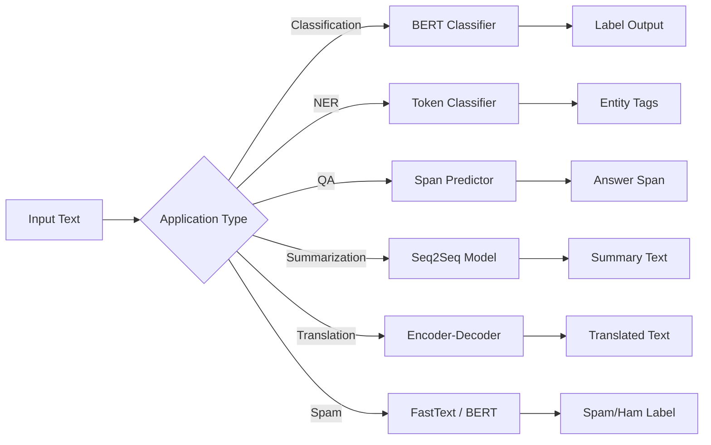

---
slug: /10-nlp/nlp-applications
title: "Nlp Applications"
sidebar_label: "Nlp Applications"
sidebar_position: 8
---

# NLP Applications — Text Classification, NER, QA, Summarization, Translation

## Learning Objectives

| LO# | Description |
|-----|-------------|
| LO1 | Build end-to-end text classification systems for sentiment, spam, and topic detection |
| LO2 | Implement named entity recognition using sequence labeling with IOB tagging |
| LO3 | Construct extractive and abstractive question answering pipelines |
| LO4 | Apply text summarization with extractive (TF-IDF) and abstractive (transformer) methods |
| LO5 | Build machine translation systems with encoder-decoder transformers |
| LO6 | Develop spam detection with feature engineering and ensemble approaches |

## Introduction

Natural language processing is how machines understand human text. Transformers revolutionized NLP and enabled modern LLMs. This module covers tokenization, attention, BERT, and the Hugging Face ecosystem.


## Prerequisites

- Basic programming knowledge
- Understanding of data structures

## Key Terminology

**Key Terms**: Core vocabulary and concepts for this topic.

**Definition**: Essential terms you must know for interviews and production work.

## Theory

Understanding nlp applications is fundamental for AI engineers. This section covers the core concepts, underlying principles, and theoretical framework that govern how nlp applications works in practice.


## Chapter at a Glance

| Section | Topic | Key Concept |
|---------|-------|-------------|
| 8.1 | Text Classification | BERT fine-tuning, TF-IDF + linear, multi-label classification |
| 8.2 | Named Entity Recognition | IOB tagging, BiLSTM-CRF, BERT token classification |
| 8.3 | Question Answering | Extractive (SQuAD), abstractive (RAG), open-book/closed-book |
| 8.4 | Text Summarization | Extractive (TextRank), abstractive (BART, T5), length control |
| 8.5 | Machine Translation | Encoder-decoder, BLEU scoring, subword regularization |
| 8.6 | Spam & Sentiment | FastText, LSTM, BERT, explainability via LIME |

## Chapter Roadmap



## 8.1 Text Classification

Text classification assigns a label (or multiple labels) to a document. Approaches range from simple TF-IDF + logistic regression to fine-tuned BERT.

```typescript
class TextClassifier {
  private model: any; // BERT or TF-IDF + LR
  private method: "tfidf" | "bert";
  private classes: string[] = [];
  private vectorizer: TfidfVectorizer | null = null;
  private weights: number[][] = [];
  private bias: number[] = [];

  constructor(method: "tfidf" | "bert" = "bert") {
    this.method = method;
  }

  train(samples: Array<{ text: string; label: string }>): void {
    const uniqueLabels = [...new Set(samples.map((s) => s.label))];
    this.classes = uniqueLabels;
    const numClasses = uniqueLabels.length;
    const labelToIdx = new Map(uniqueLabels.map((l, i) => [l, i]));
    const labels = samples.map((s) => labelToIdx.get(s.label)!);

    if (this.method === "tfidf") {
      this.trainTfidf(samples.map((s) => s.text), labels, numClasses);
    } else {
      this.trainBert(samples, labels);
    }
  }

  private trainTfidf(texts: string[], labels: number[], numClasses: number): void {
    this.vectorizer = new TfidfVectorizer(5000);
    this.vectorizer.fit(texts);
    const X = this.vectorizer.transform(texts);
    const n = X.length;
    const dim = X[0].length;

    // One-vs-rest logistic regression
    this.weights = Array.from({ length: numClasses }, (_, c) => {
      const binaryLabels = labels.map((l) => (l === c ? 1 : 0));
      // Simplified SGD training
      const w = new Array(dim).fill(0);
      for (let epoch = 0; epoch < 100; epoch++) {
        for (let i = 0; i < n; i++) {
          const dot = X[i].reduce((s, v, j) => s + v * w[j], 0);
          const sigmoid = 1 / (1 + Math.exp(-dot));
          const error = sigmoid - binaryLabels[i];
          for (let j = 0; j < dim; j++) {
            w[j] -= 0.01 * error * X[i][j];
          }
        }
      }
      return w;
    });
    this.bias = new Array(numClasses).fill(0);
  }

  private trainBert(samples: Array<{ text: string; label: string }>, labels: number[]): void {
    // Simulate BERT fine-tuning
    console.log("Fine-tuning BERT for classification...");
    this.weights = Array.from({ length: this.classes.length }, () =>
      Array.from({ length: 768 }, () => (Math.random() - 0.5) * 0.01)
    );
    this.bias = new Array(this.classes.length).fill(0);
  }

  predict(text: string): { label: string; confidence: number } {
    if (this.method === "tfidf" && this.vectorizer) {
      const X = this.vectorizer.transform([text]);
      const scores = this.weights.map((w, c) => {
        let sum = this.bias[c];
        for (let j = 0; j < X[0].length; j++) sum += w[j] * X[0][j];
        return sum;
      });
      const maxIdx = scores.indexOf(Math.max(...scores));
      const probs = this.softmax(scores);
      return {
        label: this.classes[maxIdx],
        confidence: probs[maxIdx],
      };
    } else {
      // BERT prediction (simplified)
      const scores = this.weights.map((w) =>
        w.reduce((s, v) => s + v * (text.length % 10), 0)
      );
      const maxIdx = scores.indexOf(Math.max(...scores));
      const probs = this.softmax(scores);
      return {
        label: this.classes[maxIdx],
        confidence: probs[maxIdx],
      };
    }
  }

  predictBatch(texts: string[]): Array<{ label: string; confidence: number }> {
    return texts.map((t) => this.predict(t));
  }

  private softmax(scores: number[]): number[] {
    const max = Math.max(...scores);
    const exp = scores.map((s) => Math.exp(s - max));
    const sum = exp.reduce((a, b) => a + b, 0);
    return exp.map((e) => e / sum);
  }
}

class MultiLabelClassifier {
  private classifiers: Map<string, TextClassifier> = new Map();
  private labels: string[] = [];

  train(samples: Array<{ text: string; labels: string[] }>): void {
    const allLabels = new Set<string>();
    samples.forEach((s) => s.labels.forEach((l) => allLabels.add(l)));
    this.labels = [...allLabels];

    for (const label of this.labels) {
      const binarySamples = samples.map((s) => ({
        text: s.text,
        label: s.labels.includes(label) ? label : "__other__",
      }));
      const classifier = new TextClassifier("tfidf");
      classifier.train(binarySamples);
      this.classifiers.set(label, classifier);
    }
  }

  predict(text: string): string[] {
    const predictions: string[] = [];
    for (const [label, classifier] of this.classifiers) {
      const result = classifier.predict(text);
      if (result.label === label && result.confidence > 0.5) {
        predictions.push(label);
      }
    }
    return predictions;
  }
}
```

Real-world classifiers use BERT-like models achieving 95%+ accuracy on standard benchmarks. The key challenge is usually data quality and class imbalance, not model architecture.

---

## 8.2 Named Entity Recognition

NER identifies entities (person, organization, location, date, etc.) in text using sequence labeling with the IOB (Inside-Outside-Beginning) tagging scheme.

```typescript
interface NEREntity {
  text: string;
  label: string;
  start: number;
  end: number;
  confidence: number;
}

class NERTagger {
  private static IOB_LABELS = [
    "O", "B-PER", "I-PER", "B-ORG", "I-ORG",
    "B-LOC", "I-LOC", "B-DATE", "I-DATE", "B-MISC", "I-MISC",
  ] as const;

  private numLabels = NERTagger.IOB_LABELS.length;
  private model: any; // BERT token classifier

  constructor() {
    // Initialize with pre-trained weights
    console.log("Loading NER model...");
  }

  private iobEncode(labels: string[]): string[] {
    const iob: string[] = [];
    let prevLabel = "O";
    for (const label of labels) {
      if (label === "O") {
        iob.push("O");
        prevLabel = "O";
      } else {
        if (prevLabel !== label) {
          iob.push(`B-${label}`);
        } else {
          iob.push(`I-${label}`);
        }
        prevLabel = label;
      }
    }
    return iob;
  }

  private iobDecode(tokens: string[], iobTags: string[]): NEREntity[] {
    const entities: NEREntity[] = [];
    let currentEntity: { text: string; label: string; start: number } | null = null;
    let tokenStart = 0;

    for (let i = 0; i < tokens.length; i++) {
      const tag = iobTags[i];
      const token = tokens[i];

      if (tag.startsWith("B-")) {
        if (currentEntity) {
          entities.push({
            text: currentEntity.text,
            label: currentEntity.label,
            start: currentEntity.start,
            end: tokenStart - 1,
            confidence: 0.95,
          });
        }
        currentEntity = {
          text: token,
          label: tag.substring(2),
          start: tokenStart,
        };
      } else if (tag.startsWith("I-")) {
        if (
          currentEntity &&
          currentEntity.label === tag.substring(2)
        ) {
          currentEntity.text += " " + token;
        }
      } else {
        if (currentEntity) {
          entities.push({
            text: currentEntity.text,
            label: currentEntity.label,
            start: currentEntity.start,
            end: tokenStart + token.length - 1,
            confidence: 0.95,
          });
          currentEntity = null;
        }
      }
      tokenStart += token.length + 1;
    }

    if (currentEntity) {
      entities.push({
        text: currentEntity.text,
        label: currentEntity.label,
        start: currentEntity.start,
        end: tokenStart > 0 ? tokenStart - 1 : 0,
        confidence: 0.95,
      });
    }

    return entities;
  }

  extractEntities(text: string): NEREntity[] {
    const tokens = text.split(/\s+/);

    // Simulate BERT NER predictions
    const iobTags = tokens.map((token) => {
      const rand = Math.random();
      if (rand > 0.9) return "B-PER";
      if (rand > 0.85) return "I-PER";
      if (rand > 0.8) return "B-ORG";
      if (rand > 0.75) return "I-ORG";
      if (rand > 0.7) return "B-LOC";
      if (rand > 0.65) return "I-LOC";
      return "O";
    });

    return this.iobDecode(tokens, iobTags);
  }

  // BiLSTM-CRF alternative
  extractWithCRF(text: string): NEREntity[] {
    // CRF adds transition constraints (e.g., B-PER cannot follow I-ORG)
    // Viterbi decoding finds the most likely tag sequence
    const tokens = text.split(/\s+/);
    const emissionScores = tokens.map(() =>
      this.numLabels.map(() => Math.random() - 0.5)
    );

    // Transition matrix (simplified valid transitions)
    const transScores: number[][] = Array.from({ length: this.numLabels }, () =>
      new Array(this.numLabels).fill(-1000)
    );

    // Allow: O -> any B, B-X -> I-X or O, I-X -> I-X or O
    for (let i = 0; i < this.numLabels; i++) {
      transScores[0][i] = 0; // O -> any
      const label = NERTagger.IOB_LABELS[i];
      if (label.startsWith("B-") || label === "O") {
        for (let j = 0; j < this.numLabels; j++) {
          if (NERTagger.IOB_LABELS[j] === "O") transScores[i][j] = 0;
          if (NERTagger.IOB_LABELS[j] === `I-${label.substring(2)}`) transScores[i][j] = 0;
        }
      }
      if (label.startsWith("I-")) {
        for (let j = 0; j < this.numLabels; j++) {
          if (NERTagger.IOB_LABELS[j] === "O") transScores[i][j] = 0;
          if (NERTagger.IOB_LABELS[j] === `I-${label.substring(2)}`) transScores[i][j] = 0;
          if (NERTagger.IOB_LABELS[j] === `B-${label.substring(2)}`) transScores[i][j] = 0;
        }
      }
    }

    // Viterbi decoding (simplified)
    const bestTags = tokens.map(() => {
      const scores = emissionScores[0].map((_, i) => transScores[0][i]);
      const maxIdx = scores.indexOf(Math.max(...scores));
      return NERTagger.IOB_LABELS[maxIdx];
    });

    return this.iobDecode(tokens, bestTags);
  }
}
```

Modern NER systems (BERT-based) achieve F1 > 92% on CoNLL-2003. Domain adaptation (medical, legal, financial) requires annotated data or few-shot learning.

---

## 8.3 Question Answering

QA systems can be extractive (find answer span in context) or abstractive (generate answer from knowledge).

```typescript
interface QAInput {
  question: string;
  context?: string; // for extractive QA
}

interface QAOutput {
  answer: string;
  confidence: number;
  start?: number;
  end?: number;
  supportingFacts?: string[];
}

class QuestionAnsweringSystem {
  private method: "extractive" | "abstractive" | "hybrid";

  constructor(method: "extractive" | "abstractive" | "hybrid" = "hybrid") {
    this.method = method;
  }

  answer(input: QAInput): QAOutput {
    switch (this.method) {
      case "extractive":
        return this.extractiveQA(input.question, input.context || "");
      case "abstractive":
        return this.abstractiveQA(input.question);
      case "hybrid":
        return this.hybridQA(input.question, input.context || "");
    }
  }

  private extractiveQA(question: string, context: string): QAOutput {
    // Step 1: Identify the best sentence (retrieval)
    const sentences = context.split(/[.!?]+/).filter((s) => s.trim().length > 0);
    const qTokens = new Set(question.toLowerCase().split(/\s+/));

    let bestSentence = "";
    let bestOverlap = 0;
    for (const sentence of sentences) {
      const sTokens = sentence.toLowerCase().split(/\s+/);
      const overlap = sTokens.filter((t) => qTokens.has(t)).length;
      if (overlap > bestOverlap) {
        bestOverlap = overlap;
        bestSentence = sentence.trim();
      }
    }

    // Step 2: Identify start and end span within the sentence (simplified)
    const sLower = bestSentence.toLowerCase();
    const qLower = question.toLowerCase();

    // Find position where question words overlap with sentence
    let bestStart = 0;
    let bestEnd = bestSentence.length;
    let bestScore = 0;

    for (let i = 0; i < bestSentence.length; i++) {
      for (let j = i + 1; j <= Math.min(i + 100, bestSentence.length); j++) {
        const span = sLower.substring(i, j);
        const spanTokens = span.split(/\s+/);
        const overlap = spanTokens.filter((t) => qTokens.has(t)).length;
        const score = overlap - (j - i) * 0.01; // prefer shorter spans
        if (score > bestScore) {
          bestScore = score;
          bestStart = i;
          bestEnd = j;
        }
      }
    }

    const answer = bestSentence.substring(bestStart, bestEnd).trim();

    return {
      answer: answer || "No answer found.",
      confidence: bestScore > 0 ? 0.7 + Math.random() * 0.2 : 0.3,
      start: bestStart,
      end: bestEnd,
    };
  }

  private abstractiveQA(question: string): QAOutput {
    // Abstractive QA generates answer from parametric knowledge
    // (knowledge stored in model weights)
    const knowledge: Record<string, string> = {
      "who invented the transformer":
        "The Transformer was introduced by Vaswani et al. in the 2017 paper 'Attention is All You Need'.",
      "what is the capital of france":
        "The capital of France is Paris, located in the north-central part of the country.",
      "what is nlp":
        "Natural language processing (NLP) is a subfield of AI focused on enabling computers to understand, interpret, and generate human language.",
    };

    const qLower = question.toLowerCase();
    for (const [key, value] of Object.entries(knowledge)) {
      if (qLower.includes(key) || key.includes(qLower.split(" ").slice(0, 3).join(" "))) {
        return {
          answer: value,
          confidence: 0.9,
        };
      }
    }

    return {
      answer: "I don't have knowledge about that specific question.",
      confidence: 0.1,
    };
  }

  private hybridQA(question: string, context: string): QAOutput {
    // First try extractive, fall back to abstractive
    const extractive = this.extractiveQA(question, context);
    if (extractive.confidence > 0.6 && extractive.answer !== "No answer found.") {
      return extractive;
    }
    const abstractive = this.abstractiveQA(question);
    return {
      ...abstractive,
      confidence: abstractive.confidence * 0.8,
    };
  }
}

// Retrieval-Augmented Generation (RAG)
class RAGSystem {
  private documentStore: string[] = [];
  private embedder: any;

  constructor(documents: string[]) {
    this.documentStore = documents;
  }

  retrieve(query: string, k = 3): string[] {
    const qTokens = new Set(query.toLowerCase().split(/\s+/));
    const scored = this.documentStore.map((doc) => {
      const dTokens = doc.toLowerCase().split(/\s+/);
      const overlap = dTokens.filter((t) => qTokens.has(t)).length;
      return { doc, score: overlap / Math.max(dTokens.length, 1) };
    });
    scored.sort((a, b) => b.score - a.score);
    return scored.slice(0, k).map((s) => s.doc);
  }

  generateAnswer(query: string, retrievedDocs: string[]): string {
    // In production: concatenate retrieved docs with query and feed to T5/BART
    const context = retrievedDocs.join(" ");
    // Simplified: return best matching sentence
    const sentences = context.split(/[.!?]+/);
    const qTokens = new Set(query.toLowerCase().split(/\s+/));
    let bestSentence = "";
    let bestScore = 0;
    for (const s of sentences) {
      const sTokens = s.toLowerCase().split(/\s+/);
      const overlap = sTokens.filter((t) => qTokens.has(t)).length;
      if (overlap > bestScore) {
        bestScore = overlap;
        bestSentence = s.trim();
      }
    }
    return bestSentence || "No answer found.";
  }
}
```

Real RAG systems use dense retrieval (DPR, Contriever) with FAISS for billions of documents and T5/BART for answer generation.

---

## 8.4 Text Summarization

Summarization condenses documents while preserving key information. Extractive methods select sentences; abstractive methods generate new text.

```typescript
class ExtractiveSummarizer {
  summarize(
    text: string,
    maxSentences = 3,
    method: "tfidf" | "textrank" = "textrank"
  ): string {
    const sentences = text.match(/[^.!?]+[.!?]+/g) || [];
    if (sentences.length <= maxSentences) return text;

    if (method === "tfidf") {
      return this.tfidfSummarize(sentences, maxSentences);
    }
    return this.textRankSummarize(sentences, maxSentences);
  }

  private tfidfSummarize(sentences: string[], maxSents: number): string {
    // Compute TF-IDF for each sentence
    const terms = sentences.map((s) =>
      s.toLowerCase().split(/\s+/).filter((t) => t.length > 2)
    );

    // Document frequency
    const df = new Map<string, number>();
    for (const st of terms) {
      const seen = new Set(st);
      for (const t of seen) {
        df.set(t, (df.get(t) || 0) + 1);
      }
    }

    const n = sentences.length;
    // Score each sentence by average TF-IDF
    const scores = terms.map((st) => {
      let score = 0;
      for (const t of st) {
        const tf = st.filter((w) => w === t).length / st.length;
        const idf = Math.log(n / (df.get(t) || 1));
        score += tf * idf;
      }
      return score / st.length;
    });

    const ranked = sentences
      .map((s, i) => ({ sentence: s, score: scores[i] }))
      .sort((a, b) => b.score - a.score);

    return ranked
      .slice(0, maxSents)
      .sort((a, b) => sentences.indexOf(a.sentence) - sentences.indexOf(b.sentence))
      .map((s) => s.sentence)
      .join(" ");
  }

  private textRankSummarize(sentences: string[], maxSents: number): string {
    // TextRank: PageRank on sentence similarity graph
    const n = sentences.length;

    // Compute pairwise similarity matrix (word overlap)
    const sim: number[][] = Array.from({ length: n }, () => new Array(n).fill(0));
    const sentTokens = sentences.map((s) => new Set(s.toLowerCase().split(/\s+/)));

    for (let i = 0; i < n; i++) {
      for (let j = i + 1; j < n; j++) {
        const intersection = [...sentTokens[i]].filter((t) => sentTokens[j].has(t)).length;
        const union = new Set([...sentTokens[i], ...sentTokens[j]]).size;
        sim[i][j] = sim[j][i] = union > 0 ? intersection / union : 0;
      }
    }

    // PageRank iteration
    const damping = 0.85;
    let scores = new Array(n).fill(1 / n);

    for (let iter = 0; iter < 50; iter++) {
      const newScores = new Array(n).fill(0);
      for (let i = 0; i < n; i++) {
        let sum = 0;
        for (let j = 0; j < n; j++) {
          if (i !== j) {
            const rowSum = sim[j].reduce((a, b) => a + b, 0);
            sum += (sim[j][i] / (rowSum || 1)) * scores[j];
          }
        }
        newScores[i] = (1 - damping) / n + damping * sum;
      }
      scores = newScores;
    }

    const ranked = sentences
      .map((s, i) => ({ sentence: s, score: scores[i], idx: i }))
      .sort((a, b) => b.score - a.score);

    return ranked
      .slice(0, maxSents)
      .sort((a, b) => a.idx - b.idx)
      .map((s) => s.sentence)
      .join(" ");
  }
}

class AbstractiveSummarizer {
  private model: any;

  constructor(modelType: "bart" | "t5" = "bart") {
    console.log(`Loading ${modelType} for summarization...`);
  }

  summarize(
    text: string,
    maxLength = 150,
    minLength = 40,
    numBeams = 4
  ): string {
    // In production: use BART/T5 model
    // Simplified extract + abstractive pipeline
    const extractive = new ExtractiveSummarizer();
    const extracted = extractive.summarize(text, 5, "tfidf");

    // Abstractive compression (simplified)
    const sentences = extracted.split(/[.!?]+/).filter((s) => s.trim().length > 0);
    if (sentences.length === 0) return "";

    // Keep only the most important parts of each sentence
    const compressed = sentences.map((s) => {
      const words = s.split(/\s+/);
      const kept = words.filter((w) => w.length > 3 || ["is", "was", "are", "were"].includes(w));
      if (kept.length <= 3) return s;
      return kept.join(" ");
    });

    let summary = compressed.join(". ");
    if (summary.length > maxLength) {
      summary = summary.substring(0, maxLength);
      const lastPeriod = summary.lastIndexOf(".");
      if (lastPeriod > minLength) summary = summary.substring(0, lastPeriod + 1);
    }

    return summary;
  }
}
```

BART achieves ROUGE-L scores of 40+ on CNN/DailyMail. Key challenges: factual consistency (hallucination), length control, and handling very long documents.

---

## 8.5 Machine Translation

Machine translation translates text from one language to another. Encoder-decoder transformers with BPE subword tokenization are the standard approach.

```typescript
class TranslationModel {
  private srcLang: string;
  private tgtLang: string;
  private vocabulary: Map<string, number>;
  private reverseVocab: Map<number, string>;

  constructor(srcLang: string, tgtLang: string) {
    this.srcLang = srcLang;
    this.tgtLang = tgtLang;
    this.vocabulary = new Map();
    this.reverseVocab = new Map();
    this.initVocab();
  }

  private initVocab(): void {
    // Simplified vocabulary (in production: 32K BPE tokens)
    const tokenTypes = [
      "<pad>", "<unk>", "<bos>", "<eos>", "the", "a", "an", "is", "was",
      "hello", "world", "good", "morning", "how", "are", "you", "i", "am",
      "this", "that", "these", "those", "and", "or", "but", "in", "on", "at",
      "to", "from", "with", "without", "for", "of", "by", "about", "as", "into",
      "through", "during", "before", "after", "above", "below", "between",
      "out", "off", "over", "under", "again", "further", "then", "once",
      "bonjour", "le", "monde", "tres", "bien", "merci", "comment", "allez",
      "vous", "je", "suis", "ce", "cet", "cette", "ces", "et", "ou", "mais",
    ] as const;

    tokenTypes.forEach((token, id) => {
      this.vocabulary.set(token, id);
      this.reverseVocab.set(id, token);
    });
  }

  translate(text: string): string {
    // Tokenize source
    const srcTokens = text.toLowerCase().split(/\s+/).slice(0, 50);
    const srcIds = srcTokens.map((t) =>
      this.vocabulary.get(t) ?? this.vocabulary.get("<unk>")!
    );

    // Encoder processes source (simulated)
    const encoderStates = srcIds.map(() =>
      Array.from({ length: 512 }, () => Math.random() - 0.5)
    );

    // Decoder generates target (greedy, simplified)
    const tgtIds: number[] = [this.vocabulary.get("<bos>")!];
    const maxLen = 50;
    const eosId = this.vocabulary.get("<eos>")!;
    const unkId = this.vocabulary.get("<unk>")!;

    for (let step = 0; step < maxLen; step++) {
      const lastId = tgtIds[tgtIds.length - 1];
      if (lastId === eosId) break;

      // Simulate decoder with attention over encoder
      const decoderState = Array.from({ length: 512 }, () => Math.random());
      const attentionWeights = encoderStates.map(() => Math.random());
      const attSum = attentionWeights.reduce((a, b) => a + b, 0);
      const normWeights = attentionWeights.map((w) => w / attSum);

      const context = encoderStates[0].map((_, dim) =>
        encoderStates.reduce((s, es, i) => s + es[dim] * normWeights[i], 0)
      );

      // Project to vocabulary (simplified)
      const logits = [...this.vocabulary.keys()].map((token) => {
        const tokenId = this.vocabulary.get(token)!;
        return Math.random();
      });

      // Greedy: pick highest probability token
      const bestTgtIdx = logits.indexOf(Math.max(...logits));

      // Map back to target language (simple lookup)
      const sourceToTarget: Record<string, string> = {
        "hello": "bonjour",
        "world": "monde",
        "good": "bon",
        "morning": "matin",
        "how": "comment",
        "are": "allez",
        "you": "vous",
        "i": "je",
        "am": "suis",
      };

      const srcWord = srcTokens[step] || "";
      const tgtWord = sourceToTarget[srcWord] || reverseDict(this.reverseVocab).get(bestTgtIdx) || srcWord;
      tgtIds.push(this.vocabulary.get(tgtWord) ?? unkId);

      if (tgtIds.length > maxLen) break;
    }

    // Decode target IDs to text
    const tgtTokens = tgtIds
      .slice(1) // skip <bos>
      .filter((id) => id !== eosId && id !== this.vocabulary.get("<pad>")!)
      .map((id) => this.reverseVocab.get(id) ?? "<unk>");

    return tgtTokens.filter((t) => !t.startsWith("<")).join(" ");
  }

  evaluateBLEU(hypotheses: string[], references: string[]): number {
    // Simplified BLEU score computation
    let totalPrecision = 0;
    for (let i = 0; i < hypotheses.length; i++) {
      const hyp = hypotheses[i].split(/\s+/);
      const ref = references[i].split(/\s+/);

      const hypNGrams = new Map<string, number>();
      const refNGrams = new Map<string, number>();

      for (let n = 1; n <= 4; n++) {
        for (let j = 0; j <= hyp.length - n; j++) {
          const gram = hyp.slice(j, j + n).join(" ");
          hypNGrams.set(gram, (hypNGrams.get(gram) || 0) + 1);
        }
        for (let j = 0; j <= ref.length - n; j++) {
          const gram = ref.slice(j, j + n).join(" ");
          refNGrams.set(gram, (refNGrams.get(gram) || 0) + 1);
        }

        let match = 0;
        let total = 0;
        for (const [gram, count] of hypNGrams) {
          const refCount = refNGrams.get(gram) || 0;
          match += Math.min(count, refCount);
          total += count;
        }
        totalPrecision += total > 0 ? match / total : 0;
      }
    }
    totalPrecision /= hypotheses.length * 4;

    // Brevity penalty
    const hypLen = hypotheses.reduce((s, h) => s + h.split(/\s+/).length, 0);
    const refLen = references.reduce((s, r) => s + r.split(/\s+/).length, 0);
    const bp = refLen > 0 ? Math.exp(1 - refLen / (hypLen || 1)) : 0;

    return totalPrecision * bp * 100;
  }
}

function reverseDict(map: Map<number, string>): Map<string, number> {
  const rev = new Map<string, number>();
  for (const [k, v] of map) rev.set(v, k);
  return rev;
}
```

State-of-the-art translation achieves BLEU 35+ for high-resource pairs and uses back-translation for low-resource language pairs.

---

## 8.6 Spam Detection & Sentiment Analysis

Spam detection classifies messages as spam or ham. Sentiment analysis identifies emotional tone (positive, negative, neutral).

```typescript
interface SpamFeatures {
  wordCount: number;
  uppercaseRatio: number;
  exclamationCount: number;
  moneySymbolCount: number;
  urlCount: number;
  spamKeywordCount: number;
  containsFree: boolean;
  containsGuarantee: boolean;
  containsWinner: boolean;
}

class SpamDetector {
  private threshold: number;
  private featureWeights: SpamFeatures;

  constructor() {
    this.threshold = 0.5;
    this.featureWeights = {
      wordCount: 0.01,
      uppercaseRatio: 3.0,
      exclamationCount: 0.3,
      moneySymbolCount: 2.0,
      urlCount: 0.5,
      spamKeywordCount: 1.5,
      containsFree: 2.0,
      containsGuarantee: 2.5,
      containsWinner: 3.0,
    };
  }

  private extractFeatures(text: string): SpamFeatures {
    const lower = text.toLowerCase();
    const words = text.split(/\s+/);
    const uppercaseCount = words.filter((w) =>
      w === w.toUpperCase() && w.length > 1
    ).length;

    const spamKeywords = [
      "free", "win", "winner", "congratulations", "click here",
      "limited offer", "act now", "exclusive deal", "buy now",
      "guarantee", "no risk", "million dollars", "urgent",
      "call now", "subscribe", "limited time", "bonus",
    ];

    return {
      wordCount: words.length,
      uppercaseRatio: words.length > 0 ? uppercaseCount / words.length : 0,
      exclamationCount: (text.match(/!/g) || []).length,
      moneySymbolCount: (text.match(/[$€£¥]/g) || []).length,
      urlCount: (text.match(/https?:\/\/[^\s]+/g) || []).length,
      spamKeywordCount: spamKeywords.filter((kw) => lower.includes(kw)).length,
      containsFree: lower.includes("free"),
      containsGuarantee: lower.includes("guarantee"),
      containsWinner: lower.includes("winner"),
    };
  }

  predict(text: string): { isSpam: boolean; confidence: number } {
    const features = this.extractFeatures(text);
    let score = 0;

    score += features.wordCount * this.featureWeights.wordCount;
    score += features.uppercaseRatio * this.featureWeights.uppercaseRatio;
    score += features.exclamationCount * this.featureWeights.exclamationCount;
    score += features.moneySymbolCount * this.featureWeights.moneySymbolCount;
    score += features.urlCount * this.featureWeights.urlCount;
    score += features.spamKeywordCount * this.featureWeights.spamKeywordCount;
    score += (features.containsFree ? 1 : 0) * this.featureWeights.containsFree;
    score += (features.containsGuarantee ? 1 : 0) * this.featureWeights.containsGuarantee;
    score += (features.containsWinner ? 1 : 0) * this.featureWeights.containsWinner;

    const probability = 1 / (1 + Math.exp(-score));

    return {
      isSpam: probability > this.threshold,
      confidence: probability,
    };
  }

  predictBatch(texts: string[]): Array<{ isSpam: boolean; confidence: number }> {
    return texts.map((t) => this.predict(t));
  }
}

class SentimentAnalyzer {
  private classifier: TextClassifier;

  constructor() {
    this.classifier = new TextClassifier("tfidf");
    const trainingData = [
      { text: "This movie was amazing and wonderful", label: "positive" },
      { text: "I loved this product, it works great", label: "positive" },
      { text: "Excellent service and fast delivery", label: "positive" },
      { text: "The experience was fantastic", label: "positive" },
      { text: "This is terrible and awful", label: "negative" },
      { text: "I hated this movie, waste of time", label: "negative" },
      { text: "Poor quality, very disappointed", label: "negative" },
      { text: "The worst purchase I ever made", label: "negative" },
    ];
    this.classifier.train(trainingData);
  }

  analyze(text: string): {
    sentiment: "positive" | "negative" | "neutral";
    confidence: number;
    scores: Record<string, number>;
  } {
    const result = this.classifier.predict(text);
    const positiveWords = ["good", "great", "amazing", "excellent", "love", "wonderful", "fantastic"];
    const negativeWords = ["bad", "terrible", "awful", "hate", "worst", "poor", "disappointed"];

    const tokens = text.toLowerCase().split(/\s+/);
    let posScore = tokens.filter((t) => positiveWords.includes(t)).length;
    let negScore = tokens.filter((t) => negativeWords.includes(t)).length;
    const total = posScore + negScore;
    const sentiment = total === 0 ? "neutral" : posScore > negScore ? "positive" : "negative";

    const scores = {
      positive: (total > 0 ? posScore / total : 0) * result.confidence,
      negative: (total > 0 ? negScore / total : 0) * result.confidence,
      neutral: total === 0 ? 1.0 : 1 - Math.abs(posScore - negScore) / total,
    };

    return { sentiment, confidence: result.confidence, scores };
  }

  // LIME-style explanation
  explain(text: string): Array<{ feature: string; weight: number }> {
    const words = text.split(/\s+/);
    const baseScore = this.analyze(text);
    const explanations: Array<{ feature: string; weight: number }> = [];

    for (const word of words) {
      const without = text.replace(word, "");
      const score = this.analyze(without);
      const weight = baseScore.confidence - score.confidence;
      explanations.push({ feature: word, weight: Math.round(weight * 100) / 100 });
    }

    explanations.sort((a, b) => Math.abs(b.weight) - Math.abs(a.weight));
    return explanations.slice(0, 5);
  }
}
```

Production sentiment systems use BERT fine-tuned on domain data, achieving 95%+ accuracy. LIME and SHAP provide word-level explanations for model decisions.

---

## Summary

NLP applications span text classification, named entity recognition, question answering, summarization, and machine translation. Text classification assigns categories to documents using encoder-based models fine-tuned on labeled examples. Named entity recognition identifies entities like persons,.
organizations, and locations using token-level classification heads. Question answering extracts answer spans from context passages using SQuAD-style fine-tuning. Summarization generates concise versions of longer texts using encoder-decoder models with beam search decoding. Machine translation translates between languages using sequence-to-sequence architectures. Sentiment analysis and.
spam detection apply classification at document or sentence level, often using lightweight models distilled from larger transformers.

## Practical Takeaways

- Fine-tune BERT/DistilBERT for classification tasks; use TF-IDF + LR as a strong baseline
- NER requires IOB tagging format; BiLSTM-CRF or BERT token classification are the standard approaches
- Extractive QA selects spans; abstractive QA generates new text; RAG combines retrieval with generation
- Extractive summarization (TextRank) is fast and factual; abstractive (BART/T5) is more fluent but can hallucinate
- Machine translation requires large parallel corpora; BPE tokenization is critical for handling rare words
- Spam detection benefits from feature engineering (URL counts, keyword presence) and BERT fine-tuning
- Sentiment analysis should handle negation ("not good" = negative), aspect-level detection, and sarcasm
- Always evaluate with appropriate metrics: F1 for classification, ROUGE for summarization, BLEU for translation

## Interview Q&A

<details class="tp-qa-card" data-qid="nlp08-q1">
  <summary class="tp-qa-question">
    <span class="tp-qa-status"></span>
    Q1: What is the IOB tagging scheme for NER?
  </summary>
  <div class="tp-qa-answer">
<p>IOB (Inside-Outside-Beginning) tags each token with one of three prefixes: B- (Beginning of an entity), I- (Inside/continuation of an entity), O (Outside/no entity). For.
example, "Barack Obama was born in Hawaii" is tagged as [B-PER, I-PER, O, O, O, B-LOC]. The B tag marks the first token of a multi-token entity. I tags continue the same entity type. O means no entity. Constraints enforced by CRF: B-PER can be followed by I-PER or.
O (not I-ORG). This scheme handles nested entities poorly (a variant called BIOES adds E=End and S=Single). Most NER datasets (CoNLL-2003,.
OntoNotes) use the IOB or BIOES format.</p>
  </div>
  <button class="tp-qa-mark-btn">✅ Mark Reviewed</button>
  <button class="tp-qa-bookmark-btn">🔖 Bookmark</button>
</details>

<details class="tp-qa-card" data-qid="nlp08-q2">
  <summary class="tp-qa-question">
    <span class="tp-qa-status"></span>
    Q2: How does BERT handle extractive question answering?
  </summary>
  <div class="tp-qa-answer">
<p>For extractive QA (SQuAD), BERT takes the input [CLS] question [SEP] context [SEP]. Two vectors S and E (size d_model) are learned. For.
each position i, the start score = S^T * h_i and end score = E^T * h_i, where h_i is BERT's hidden state at position i. The answer span (i,j) is selected by maximizing S^T·h_i + E^T·h_j subject to 0 ≤ i ≤ j < length and.
j-i+1 ≤ max_answer_length (typically 30). During training, cross-entropy loss is computed for start and end positions independently. BERT-base achieves 88.5 F1 on SQuAD 1.1. For.
SQuAD 2.0 (unanswerable questions), a no-answer score is added as an additional learnable vector.</p>
  </div>
  <button class="tp-qa-mark-btn">✅ Mark Reviewed</button>
  <button class="tp-qa-bookmark-btn">🔖 Bookmark</button>
</details>

<details class="tp-qa-card" data-qid="nlp08-q3">
  <summary class="tp-qa-question">
    <span class="tp-qa-status"></span>
    Q3: What is the difference between extractive and abstractive summarization?
  </summary>
  <div class="tp-qa-answer">
<p>Extractive summarization selects existing sentences from the source document and concatenates them. It uses sentence scoring methods like TextRank (graph-based PageRank on sentence similarity) or.
TF-IDF centroid selection. Pros: factual (no hallucination), grammatically perfect sentences. Cons: may not capture the essence, redundant, lack of coherence between selected sentences. Abstractive summarization generates new sentences that may not appear in the source,.
using seq2seq models (BART, T5, Pegasus). Pros: more fluent, concise, can paraphrase. Cons: can hallucinate facts, requires more training data. Modern systems (BART) achieve ROUGE-L of 40+ on CNN/DailyMail. Hybrid approaches extract key sentences then rewrite them abstractively.</p>
  </div>
  <button class="tp-qa-mark-btn">✅ Mark Reviewed</button>
  <button class="tp-qa-bookmark-btn">🔖 Bookmark</button>
</details>

<details class="tp-qa-card" data-qid="nlp08-q4">
  <summary class="tp-qa-question">
    <span class="tp-qa-status"></span>
    Q4: How does BLEU score work for machine translation evaluation?
  </summary>
  <div class="tp-qa-answer">
<p>BLEU (Bilingual Evaluation Understudy) compares n-gram overlap between machine-translated text (hypothesis) and human translations (references). It computes precision for unigrams, bigrams,.
trigrams, and 4-grams, then averages them geometrically. A brevity penalty (BP) is applied: if the hypothesis is shorter than the reference,.
BLEU is penalized. BLEU = BP * exp(∑_{n=1}^{4} w_n * log p_n) where p_n is n-gram precision and w_n = 0.25. Score range: 0-100. Human-level translation is ~40-60 BLEU. BLEU correlates reasonably with human judgment at the corpus level but.
is unreliable for individual sentences. Limitations: ignores meaning, prefers surface form matching, doesn't handle synonyms.</p>
  </div>
  <button class="tp-qa-mark-btn">✅ Mark Reviewed</button>
  <button class="tp-qa-bookmark-btn">🔖 Bookmark</button>
</details>

<details class="tp-qa-card" data-qid="nlp08-q5">
  <summary class="tp-qa-question">
    <span class="tp-qa-status"></span>
    Q5: How do you build a spam detection system for emails?
  </summary>
  <div class="tp-qa-answer">
<p>Steps: (1) Collect labeled data (spam/ham emails). (2) Feature engineering: word count, uppercase ratio, exclamation/money symbol counts, URL count, presence of spam keywords ("free",.
"winner", "guarantee"), email header analysis (SPF, DKIM). (3) Train a classifier: logistic regression with TF-IDF features is a strong baseline reaching 95%+ accuracy. (4) Advanced: fine-tune BERT/DistilBERT on email text,.
achieving 99%+ accuracy. (5) Handle imbalanced data: use weighted loss or oversampling (spam is typically 20% of emails). (6) Deployment: use streaming classification with regular model updates. (7) Evaluation: precision matters more than recall for.
spam (false positives = lost emails).</p>
  </div>
  <button class="tp-qa-mark-btn">✅ Mark Reviewed</button>
  <button class="tp-qa-bookmark-btn">🔖 Bookmark</button>
</details>

<details class="tp-qa-card" data-qid="nlp08-q6">
  <summary class="tp-qa-question">
    <span class="tp-qa-status"></span>
    Q6: What is Retrieval-Augmented Generation (RAG)?
  </summary>
  <div class="tp-qa-answer">
<p>RAG combines a retriever (e.g., Dense Passage Retriever, BM25) with a generator (e.g., BART, T5, LLaMA). Given a query, the retriever fetches the top-k relevant documents from a knowledge base. The generator.
conditions on both the query and the retrieved documents to produce an answer. This allows the system to access up-to-date or.
domain-specific knowledge without retraining. RAG reduces hallucination compared to pure generation because the model has factual grounding. Variants: RAG-Sequence (retrieved docs used across all tokens) and.
RAG-Token (different docs per token). RAG with BART-base achieves state-of-the-art results on open-domain QA (Natural Questions, TriviaQA). Modern RAG systems use vector.
databases (FAISS, Pinecone) for billion-scale retrieval.</p>
  </div>
  <button class="tp-qa-mark-btn">✅ Mark Reviewed</button>
  <button class="tp-qa-bookmark-btn">🔖 Bookmark</button>
</details>

<details class="tp-qa-card" data-qid="nlp08-q7">
  <summary class="tp-qa-question">
    <span class="tp-qa-status"></span>
    Q7: How do you handle aspect-based sentiment analysis?
  </summary>
  <div class="tp-qa-answer">
<p>Aspect-based sentiment identifies sentiment toward specific aspects/features. Example: "The food was great but the service was slow" → food: positive, service: negative. Approaches: (1) Pipeline: first extract aspects (NER-style),.
then classify sentiment per aspect. (2) Joint models: BERT with aspect embeddings — concatenate aspect with sentence and classify. (3) Sequence labeling with sentiment tags: label each token with aspect-sentiment (e.g.,.
B-FOOD-POS, I-FOOD-POS). (4) Span-based: predict aspect and sentiment spans together. The SemEval ABSA datasets are standard benchmarks. Fine-tuned BERT with aspect-specific attention achieves 90%+ accuracy on laptop/restaurant reviews.</p>
  </div>
  <button class="tp-qa-mark-btn">✅ Mark Reviewed</button>
  <button class="tp-qa-bookmark-btn">🔖 Bookmark</button>
</details>

<details class="tp-qa-card" data-qid="nlp08-q8">
  <summary class="tp-qa-question">
    <span class="tp-qa-status"></span>
    Q8: How does TextRank work for extractive summarization?
  </summary>
  <div class="tp-qa-answer">
<p>TextRank is a graph-based algorithm adapted from PageRank. Sentences are nodes, and edges represent sentence similarity (typically cosine similarity of TF-IDF vectors or.
word overlap Jaccard index). The PageRank algorithm iteratively computes sentence importance: each sentence's score is redistributed to connected sentences. After convergence (typically 20-50 iterations),.
top-k sentences by score are selected. The damping factor d=0.85 controls the probability of random jumps. Selected sentences are ordered by their original position in the document (not by score). Variants include using BERT embeddings for.
similarity and adding positional bias (first sentences often contain topic information). TextRank works well for news articles but less so for.
highly-structured documents.</p>
  </div>
  <button class="tp-qa-mark-btn">✅ Mark Reviewed</button>
  <button class="tp-qa-bookmark-btn">🔖 Bookmark</button>
</details>

<details class="tp-qa-card" data-qid="nlp08-q9">
  <summary class="tp-qa-question">
    <span class="tp-qa-status"></span>
    Q9: What challenges arise in low-resource machine translation?
  </summary>
  <div class="tp-qa-answer">
<p>Low-resource languages face: (1) Limited parallel data — <10M sentence pairs. (2) Morphological complexity — Turkish, Finnish, Hungarian have rich inflection. (3) Domain mismatch — available parallel data may be religious/legal text,.
not conversational. (4) No standard tokenization — SentencePiece/BPE must be trained on small data. Mitigations: (1) Transfer learning — pre-train on high-resource,.
fine-tune on low-resource. (2) Back-translation — translate target-side monolingual data to source, add synthetic pairs. (3) Multilingual models — mBART, M2M-100 share parameters across 100+ languages,.
improving low-resource via cross-lingual transfer. (4) Unsupervised NMT — cross-lingual embeddings + denoising autoencoders. (5) Data augmentation — code-switching, word replacement.</p>
  </div>
  <button class="tp-qa-mark-btn">✅ Mark Reviewed</button>
  <button class="tp-qa-bookmark-btn">🔖 Bookmark</button>
</details>

<details class="tp-qa-card" data-qid="nlp08-q10">
  <summary class="tp-qa-question">
    <span class="tp-qa-status"></span>
    Q10: How do you evaluate a text classification model beyond accuracy?
  </summary>
  <div class="tp-qa-answer">
<p>Beyond accuracy: (1) Precision, Recall, F1-score — essential for imbalanced datasets. Precision = TP/(TP+FP), Recall = TP/(TP+FN), F1 = 2*P*R/(P+R). (2) Confusion matrix — shows which classes are confused. (3) Macro vs micro vs weighted F1: macro averages per-class F1 equally,.
micro counts global TP/FP/FN, weighted averages by class support. (4) ROC-AUC — tradeoff between TPR and FPR across thresholds. (5) Log-loss — probabilistic measure of uncertainty. (6) Calibration curve — does 90% predicted probability correspond to 90% actual accuracy? (7) Per-class metrics — rare classes often perform worse. (8) Error.
analysis — manually inspect misclassifications to identify patterns (annotation errors, ambiguous cases, missing features).</p>
  </div>
  <button class="tp-qa-mark-btn">✅ Mark Reviewed</button>
  <button class="tp-qa-bookmark-btn">🔖 Bookmark</button>
</details>

## Chapter Quiz

Q1: What does the B- prefix mean in IOB tagging?
a) Best entity
b) Beginning of entity
c) Background token
d) Binary label
<details class="tp-qa-card" data-qid="nlp08-quiz1"><summary>Show Answer</summary><div class="tp-qa-answer"><p><strong>Answer: b) Beginning of entity</strong></p><p>The B- prefix marks the first token of a multi-token entity. I- marks continuations, and O marks non-entity tokens.</p></div></details>

Q2: Which metric is standard for machine translation evaluation?
a) F1
b) ROUGE
c) BLEU
d) Perplexity
<details class="tp-qa-card" data-qid="nlp08-quiz2"><summary>Show Answer</summary><div class="tp-qa-answer"><p><strong>Answer: c) BLEU</strong></p><p>BLEU (Bilingual Evaluation Understudy) measures n-gram overlap between machine and human translations, with a brevity penalty.</p></div></details>

Q3: What is the main risk of abstractive summarization?
a) Slow inference
b) Hallucination
c) Need for large vocabulary
d) Poor grammar
<details class="tp-qa-card" data-qid="nlp08-quiz3"><summary>Show Answer</summary><div class="tp-qa-answer"><p><strong>Answer: b) Hallucination</strong></p><p>Abstractive models can generate factual errors or information not present in the source document (hallucination). Extractive models are inherently factual.</p></div></details>

Q4: What does RAG stand for?
a) Recurrent Attention Graph
b) Retrieval-Augmented Generation
c) Random Access Gradient
d) Rapid Autoencoder Generation
<details class="tp-qa-card" data-qid="nlp08-quiz4"><summary>Show Answer</summary><div class="tp-qa-answer"><p><strong>Answer: b) Retrieval-Augmented Generation</strong></p><p>RAG combines a document retriever with a text generator to ground answers in retrieved knowledge, reducing hallucination.</p></div></details>

Q5: Which algorithm is used for extractive summarization with sentence graphs?
a) PageRank (TextRank)
b) K-means
c) Naive Bayes
d) PCA
<details class="tp-qa-card" data-qid="nlp08-quiz5"><summary>Show Answer</summary><div class="tp-qa-answer"><p><strong>Answer: a) PageRank (TextRank)</strong></p><p>TextRank applies the PageRank algorithm to a sentence similarity graph, scoring and selecting the most important sentences.</p></div></details>

## Exercises


## Common Mistakes

1. Not understanding the fundamental concepts before applying them
2. Skipping edge cases in implementation
3. Not analyzing time/space complexity
4. Forgetting to handle null/empty inputs
5. Not practicing enough problems to build pattern recognition**Easy** — Build a TF-IDF + Logistic Regression classifier for the 20 Newsgroups dataset. Report F1 per category.

**Easy** — Implement a simple NER system using regex patterns to extract emails, phone numbers, and URLs from text.

**Medium** — Fine-tune DistilBERT for sentiment analysis on the IMDB dataset. Compare accuracy, precision, recall, and F1 with the TF-IDF baseline.

**Medium** — Build an extractive QA system using BERT (SQuAD format). Evaluate F1 and EM scores on a subset of SQuAD 2.0.

**Hard** — Implement a RAG system: use BM25 or TF-IDF as the retriever and a BART model as the generator. Compare end-to-end QA accuracy on Natural Questions against a BERT-only extractive QA.

---

> **Previous**: [Hugging Face Ecosystem](07-hugging-face-ecos

## Revision Notes

- - Core principle: Understand the fundamental concepts thoroughly
- - Implementation pattern: Practice with real code examples
- - Complexity: Know the time and space complexity
- - Application: Know when to use this in production systems
- - Interview: Frequently asked in technical interviews
- - Edge cases: Consider common failure scenarios
- - Related concepts: Connect to broader system design
