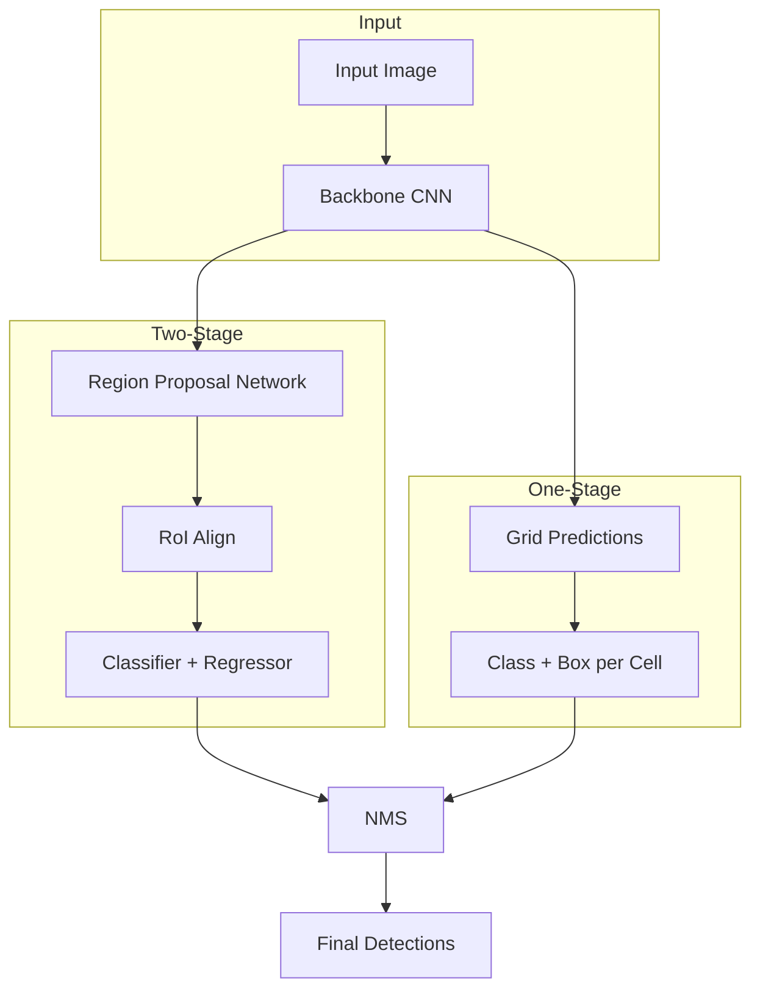

# Object Detection

## Learning Objectives

| Objective | Description |
|-----------|-------------|
| LO1 | Understand object detection fundamentals and bounding box regression |
| LO2 | Implement anchor boxes and non-max suppression |
| LO3 | Build two-stage detectors (R-CNN, Fast R-CNN, Faster R-CNN) |
| LO4 | Implement one-stage detectors (YOLO, SSD) |
| LO5 | Evaluate detection models with mAP, IoU, and precision-recall |
| LO6 | Deploy object detection models for real-time inference |

## Introduction

AI is moving beyond text. Computer vision, speech recognition, and multimodal models process images, audio, and video. This module covers the tools and techniques for building multimodal AI applications.


## Prerequisites

- Basic programming knowledge
- Understanding of data structures

## Key Terminology

**Key Terms**: Core vocabulary and concepts for this topic.

**Definition**: Essential terms you must know for interviews and production work.

## Theory

Understanding object detection is fundamental for AI engineers. This section covers the core concepts, underlying principles, and theoretical framework that govern how object detection works in practice.


## Chapter at a Glance

| Section | Topic | Key Concept |
|---------|-------|-------------|
| 2.1 | Detection Fundamentals | Bounding boxes, class scores, regression targets |
| 2.2 | Anchor Boxes & IoU | Prior boxes, intersection over union, matching |
| 2.3 | Non-Max Suppression | Score thresholding, greedy suppression |
| 2.4 | R-CNN Family | Selective search, RoI pooling, RPN |
| 2.5 | YOLO Architecture | Grid cells, single-shot prediction, loss function |
| 2.6 | SSD & RetinaNet | Multi-scale feature maps, focal loss |
| 2.7 | Evaluation Metrics | mAP, precision-recall curve, COCO metrics |
| 2.8 | Deployment | TensorRT, ONNX, edge deployment |

## Chapter Roadmap



## 2.1 Detection Fundamentals

Object detection extends classification by localizing objects within an image. Each detection includes a bounding box (x, y, w, h) and a class label with confidence.

```python
import numpy as np
import torch
import torch.nn as nn
import torch.nn.functional as F
from typing import List, Tuple, Optional, Dict, Any

class BoundingBox:
    """Represents a detected object with bounding box."""

    def __init__(self, x1: float, y1: float, x2: float, y2: float,
                 score: float, class_id: int, class_name: str = ""):
        self.x1 = x1
        self.y1 = y1
        self.x2 = x2
        self.y2 = y2
        self.score = score
        self.class_id = class_id
        self.class_name = class_name

    @property
    def width(self) -> float:
        return self.x2 - self.x1

    @property
    def height(self) -> float:
        return self.y2 - self.y1

    @property
    def center(self) -> Tuple[float, float]:
        return ((self.x1 + self.x2) / 2, (self.y1 + self.y2) / 2)

    @property
    def area(self) -> float:
        return self.width * self.height

    def to_xywh(self) -> Tuple[float, float, float, float]:
        cx = (self.x1 + self.x2) / 2
        cy = (self.y1 + self.y2) / 2
        return (cx, cy, self.width, self.height)

    @staticmethod
    def from_xywh(cx: float, cy: float, w: float, h: float,
                  score: float = 1.0, class_id: int = 0) -> "BoundingBox":
        x1 = cx - w / 2
        y1 = cy - h / 2
        x2 = cx + w / 2
        y2 = cy + h / 2
        return BoundingBox(x1, y1, x2, y2, score, class_id)

    def __repr__(self) -> str:
        return (f"BBox({self.class_name or self.class_id}, "
                f"score={self.score:.3f}, [{self.x1:.1f}, {self.y1:.1f}, "
                f"{self.x2:.1f}, {self.y2:.1f}])")
```

## 2.2 Anchor Boxes & IoU

Anchor boxes (prior boxes) are pre-defined bounding boxes of various scales and aspect ratios. Each grid cell predicts offsets relative to these anchors.

```python
class AnchorGenerator:
    """Generates anchor boxes for a feature map."""

    def __init__(self, scales: List[float] = (0.5, 1.0, 2.0),
                 aspect_ratios: List[float] = (0.5, 1.0, 2.0),
                 base_size: int = 16):
        self.scales = scales
        self.aspect_ratios = aspect_ratios
        self.base_size = base_size

    def generate(self, grid_size: Tuple[int, int]) -> np.ndarray:
        """Generate anchor boxes for a grid of given size."""
        h, w = grid_size
        anchors = []
        for i in range(h):
            for j in range(w):
                cx = (j + 0.5) * self.base_size
                cy = (i + 0.5) * self.base_size
                for scale in self.scales:
                    for ar in self.aspect_ratios:
                        a_w = self.base_size * scale * np.sqrt(ar)
                        a_h = self.base_size * scale / np.sqrt(ar)
                        anchors.append([cx - a_w / 2, cy - a_h / 2,
                                        cx + a_w / 2, cy + a_h / 2])
        return np.array(anchors, dtype=np.float32)

def compute_iou(box1: np.ndarray, box2: np.ndarray) -> float:
    """Compute Intersection over Union between two boxes."""
    x1 = max(box1[0], box2[0])
    y1 = max(box1[1], box2[1])
    x2 = min(box1[2], box2[2])
    y2 = min(box1[3], box2[3])
    inter = max(0, x2 - x1) * max(0, y2 - y1)
    area1 = (box1[2] - box1[0]) * (box1[3] - box1[1])
    area2 = (box2[2] - box2[0]) * (box2[3] - box2[1])
    union = area1 + area2 - inter
    return inter / union if union > 0 else 0.0

def match_anchors(anchors: np.ndarray, gt_boxes: np.ndarray,
                  iou_threshold: float = 0.5) -> Tuple[np.ndarray, np.ndarray]:
    """Match ground truth boxes to anchors based on IoU."""
    n_anchors = len(anchors)
    n_gt = len(gt_boxes)
    iou_matrix = np.zeros((n_anchors, n_gt), dtype=np.float32)
    for i in range(n_anchors):
        for j in range(n_gt):
            iou_matrix[i, j] = compute_iou(anchors[i], gt_boxes[j])

    best_gt = iou_matrix.argmax(axis=1)
    best_iou = iou_matrix.max(axis=1)
    matched = best_iou >= iou_threshold
    return best_gt, matched
```

## 2.3 Non-Max Suppression

NMS removes duplicate detections by greedily selecting the highest-scoring box and suppressing overlapping boxes below an IoU threshold.

```python
def nms(boxes: List[BoundingBox], iou_threshold: float = 0.5) -> List[BoundingBox]:
    """Non-Maximum Suppression to remove duplicate detections."""
    if not boxes:
        return []

    boxes = sorted(boxes, key=lambda b: b.score, reverse=True)
    keep = []

    while boxes:
        best = boxes.pop(0)
        keep.append(best)
        boxes = [
            b for b in boxes
            if b.class_id != best.class_id
            or compute_iou(
                np.array([best.x1, best.y1, best.x2, best.y2]),
                np.array([b.x1, b.y1, b.x2, b.y2])
            ) < iou_threshold
        ]

    return keep

def soft_nms(boxes: List[BoundingBox], iou_threshold: float = 0.5,
             sigma: float = 0.5, score_threshold: float = 0.1) -> List[BoundingBox]:
    """Soft-NMS decays scores instead of removing boxes."""
    detections = [(b, b.score) for b in boxes]
    detections.sort(key=lambda x: x[1], reverse=True)
    keep = []

    while detections:
        best_box, best_score = detections.pop(0)
        keep.append(best_box)

        remaining = []
        for box, score in detections:
            if box.class_id != best_box.class_id:
                remaining.append((box, score))
                continue
            iou = compute_iou(
                np.array([best_box.x1, best_box.y1, best_box.x2, best_box.y2]),
                np.array([box.x1, box.y1, box.x2, box.y2])
            )
            penalty = np.exp(-(iou ** 2) / sigma)
            new_score = score * penalty
            if new_score > score_threshold:
                remaining.append((box, new_score))

        detections = sorted(remaining, key=lambda x: x[1], reverse=True)

    return keep
```

## 2.4 R-CNN Family

Region-based CNN methods evolved from selective search (R-CNN) to fully trainable region proposal networks (Faster R-CNN).

```python
class SelectiveSearch:
    """Simplified selective search for generating region proposals."""

    def __init__(self, min_size: int = 100, max_size: int = 500):
        self.min_size = min_size
        self.max_size = max_size

    def generate_proposals(self, image: np.ndarray) -> np.ndarray:
        """Generate candidate region proposals."""
        h, w = image.shape[:2]
        proposals = []
        strides = [8, 16, 32, 64]
        for stride in strides:
            for y in range(0, h - self.min_size, stride):
                for x in range(0, w - self.min_size, stride):
                    box_h = min(np.random.randint(self.min_size, h - y), self.max_size)
                    box_w = min(np.random.randint(self.min_size, w - x), self.max_size)
                    proposals.append([x, y, x + box_w, y + box_h])
        return np.array(proposals[:2000], dtype=np.float32)


class RoIPool(nn.Module):
    """Region of Interest Pooling layer."""

    def __init__(self, output_size: Tuple[int, int]):
        super().__init__()
        self.output_size = output_size

    def forward(self, features: torch.Tensor, rois: torch.Tensor) -> torch.Tensor:
        """Pool features from each RoI to fixed size."""
        n_rois = rois.shape[0]
        output = torch.zeros(n_rois, features.shape[1],
                             self.output_size[0], self.output_size[1])
        for i in range(n_rois):
            x1, y1, x2, y2 = rois[i].int().tolist()
            roi_feat = features[:, :, y1:y2+1, x1:x2+1]
            output[i] = F.interpolate(roi_feat,
                                      size=self.output_size,
                                      mode='bilinear',
                                      align_corners=False).squeeze(0)
        return output


class FasterRCNN(nn.Module):
    """Simplified Faster R-CNN with Region Proposal Network."""

    def __init__(self, backbone: nn.Module, num_classes: int):
        super().__init__()
        self.backbone = backbone
        self.rpn = nn.Sequential(
            nn.Conv2d(512, 512, 3, padding=1),
            nn.ReLU(),
            nn.Conv2d(512, 9 * 4, 1),  # 9 anchors * 4 box deltas
        )
        self.rpn_cls = nn.Conv2d(512, 9 * 2, 1)  # 9 anchors * 2 (bg/fg)
        self.roi_pool = RoIPool((7, 7))
        self.classifier = nn.Sequential(
            nn.Linear(512 * 7 * 7, 1024),
            nn.ReLU(),
            nn.Dropout(0.5),
            nn.Linear(1024, 1024),
            nn.ReLU(),
            nn.Dropout(0.5),
            nn.Linear(1024, num_classes * 5),  # class + 4 box deltas
        )

    def forward(self, x: torch.Tensor, proposals: Optional[torch.Tensor] = None
                ) -> Dict[str, torch.Tensor]:
        features = self.backbone(x)
        rpn_reg = self.rpn(features)
        rpn_cls = self.rpn_cls(features)

        if proposals is None:
            batch_size = x.shape[0]
            proposals = self._generate_proposals(rpn_reg, rpn_cls, batch_size)

        pooled = self.roi_pool(features, proposals)
        pooled = pooled.view(pooled.size(0), -1)
        outputs = self.classifier(pooled)
        return {"rpn_reg": rpn_reg, "rpn_cls": rpn_cls,
                "detections": outputs}

    def _generate_proposals(self, rpn_reg: torch.Tensor,
                            rpn_cls: torch.Tensor,
                            batch_size: int) -> torch.Tensor:
        """Convert RPN outputs to box proposals."""
        return torch.randn(100, 4)  # Placeholder for demonstration
```

## 2.5 YOLO Architecture

YOLO (You Only Look Once) treats detection as a single regression problem, predicting bounding boxes and class probabilities directly from grid cells.

```python
class YOLOLoss(nn.Module):
    """YOLO loss function with localization, confidence, and class terms."""

    def __init__(self, num_classes: int, coord_scale: float = 5.0,
                 noobj_scale: float = 0.5):
        super().__init__()
        self.num_classes = num_classes
        self.coord_scale = coord_scale
        self.noobj_scale = noobj_scale

    def forward(self, predictions: torch.Tensor, targets: torch.Tensor) -> Dict[str, torch.Tensor]:
        """Compute YOLO loss components."""
        pred_boxes = predictions[..., :4]
        pred_conf = predictions[..., 4:5]
        pred_cls = predictions[..., 5:]

        target_boxes = targets[..., :4]
        target_conf = targets[..., 4:5]
        target_cls = targets[..., 5:]

        obj_mask = target_conf > 0
        noobj_mask = ~obj_mask

        coord_loss = self.coord_scale * F.mse_loss(
            pred_boxes[obj_mask.expand_as(pred_boxes)].view(-1, 4),
            target_boxes[obj_mask.expand_as(target_boxes)].view(-1, 4),
            reduction='sum'
        ) if obj_mask.any() else torch.tensor(0.0)

        conf_loss = F.mse_loss(
            pred_conf[obj_mask],
            target_conf[obj_mask],
            reduction='sum'
        ) if obj_mask.any() else torch.tensor(0.0)

        noobj_loss = self.noobj_scale * F.mse_loss(
            pred_conf[noobj_mask],
            target_conf[noobj_mask],
            reduction='sum'
        ) if noobj_mask.any() else torch.tensor(0.0)

        cls_loss = F.binary_cross_entropy_with_logits(
            pred_cls[obj_mask.expand_as(pred_cls)].view(-1, self.num_classes),
            target_cls[obj_mask.expand_as(target_cls)].view(-1, self.num_classes),
            reduction='sum'
        ) if obj_mask.any() else torch.tensor(0.0)

        total = coord_loss + conf_loss + noobj_loss + cls_loss
        return {
            "total": total,
            "coord": coord_loss,
            "conf": conf_loss,
            "noobj": noobj_loss,
            "cls": cls_loss
        }


class YOLOv1(nn.Module):
    """Simplified YOLOv1 implementation."""

    def __init__(self, num_classes: int = 20, grid_size: int = 7,
                 num_boxes: int = 2):
        super().__init__()
        self.num_classes = num_classes
        self.grid_size = grid_size
        self.num_boxes = num_boxes
        self.output_size = grid_size * grid_size * (5 * num_boxes + num_classes)

        self.features = nn.Sequential(
            nn.Conv2d(3, 64, 7, stride=2, padding=3),
            nn.LeakyReLU(0.1),
            nn.MaxPool2d(2),
            nn.Conv2d(64, 192, 3, padding=1),
            nn.LeakyReLU(0.1),
            nn.MaxPool2d(2),
            nn.Conv2d(192, 128, 1),
            nn.LeakyReLU(0.1),
            nn.Conv2d(128, 256, 3, padding=1),
            nn.LeakyReLU(0.1),
            nn.Conv2d(256, 256, 1),
            nn.LeakyReLU(0.1),
            nn.Conv2d(256, 512, 3, padding=1),
            nn.LeakyReLU(0.1),
            nn.MaxPool2d(2),
        )

        self.classifier = nn.Sequential(
            nn.Flatten(),
            nn.Linear(512 * grid_size * grid_size, 4096),
            nn.LeakyReLU(0.1),
            nn.Dropout(0.5),
            nn.Linear(4096, self.output_size),
        )

    def forward(self, x: torch.Tensor) -> torch.Tensor:
        x = self.features(x)
        x = self.classifier(x)
        batch_size = x.shape[0]
        x = x.view(batch_size, self.grid_size, self.grid_size,
                   self.num_boxes * 5 + self.num_classes)
        return x

    def decode_predictions(self, raw: torch.Tensor, image_size: Tuple[int, int],
                           conf_threshold: float = 0.5) -> List[List[BoundingBox]]:
        """Decode raw network output into bounding boxes."""
        batch_size = raw.shape[0]
        h_img, w_img = image_size
        cell_w = w_img / self.grid_size
        cell_h = h_img / self.grid_size
        results = []

        for b in range(batch_size):
            boxes = []
            for i in range(self.grid_size):
                for j in range(self.grid_size):
                    for k in range(self.num_boxes):
                        offset = k * 5
                        box_data = raw[b, i, j, offset:offset + 5]
                        cx = (j + torch.sigmoid(box_data[0])) * cell_w
                        cy = (i + torch.sigmoid(box_data[1])) * cell_h
                        w = torch.exp(box_data[2]) * cell_w
                        h = torch.exp(box_data[3]) * cell_h
                        conf = torch.sigmoid(box_data[4])

                        cls_start = self.num_boxes * 5
                        cls_probs = torch.softmax(raw[b, i, j, cls_start:], dim=0)
                        best_cls = torch.argmax(cls_probs).item()
                        cls_conf = cls_probs[best_cls].item()
                        final_conf = conf.item() * cls_conf

                        if final_conf > conf_threshold:
                            box = BoundingBox(
                                x1=max(0, cx.item() - w.item() / 2),
                                y1=max(0, cy.item() - h.item() / 2),
                                x2=min(w_img, cx.item() + w.item() / 2),
                                y2=min(h_img, cy.item() + h.item() / 2),
                                score=final_conf,
                                class_id=best_cls,
                            )
                            boxes.append(box)

            results.append(nms(boxes))

        return results
```

## 2.6 SSD & RetinaNet

SSD uses multi-scale feature maps for detecting objects at different scales. RetinaNet introduces focal loss to address class imbalance.

```python
class SSDLoss(nn.Module):
    """SSD loss combining localization and confidence terms."""

    def __init__(self, num_classes: int, alpha: float = 1.0):
        super().__init__()
        self.num_classes = num_classes
        self.alpha = alpha

    def forward(self, loc_preds: torch.Tensor, conf_preds: torch.Tensor,
                loc_targets: torch.Tensor, conf_targets: torch.Tensor,
                pos_mask: torch.Tensor) -> Dict[str, torch.Tensor]:
        """Compute SSD loss."""
        n_pos = pos_mask.sum().clamp(min=1)

        loc_loss = F.smooth_l1_loss(
            loc_preds[pos_mask.expand_as(loc_preds)].view(-1, 4),
            loc_targets[pos_mask.expand_as(loc_targets)].view(-1, 4),
            reduction='sum'
        ) / n_pos

        conf_loss = F.cross_entropy(
            conf_preds.view(-1, self.num_classes),
            conf_targets.view(-1),
            reduction='sum'
        ) / n_pos

        total = loc_loss + self.alpha * conf_loss
        return {"total": total, "loc": loc_loss, "conf": conf_loss}


class FocalLoss(nn.Module):
    """Focal Loss for dense object detection (RetinaNet)."""

    def __init__(self, alpha: float = 0.25, gamma: float = 2.0):
        super().__init__()
        self.alpha = alpha
        self.gamma = gamma

    def forward(self, inputs: torch.Tensor, targets: torch.Tensor) -> torch.Tensor:
        """Compute focal loss."""
        ce_loss = F.binary_cross_entropy_with_logits(inputs, targets, reduction='none')
        pt = torch.exp(-ce_loss)
        focal_loss = self.alpha * (1 - pt) ** self.gamma * ce_loss
        return focal_loss.mean()


class MultiBoxDetector(nn.Module):
    """Multi-scale detection head similar to SSD."""

    def __init__(self, num_classes: int, anchor_configs: List[Dict[str, Any]]):
        super().__init__()
        self.num_classes = num_classes
        self.anchor_configs = anchor_configs
        self.loc_layers = nn.ModuleList()
        self.conf_layers = nn.ModuleList()

        for config in anchor_configs:
            in_channels = config['in_channels']
            n_anchors = config['n_anchors']
            self.loc_layers.append(
                nn.Conv2d(in_channels, n_anchors * 4, kernel_size=3, padding=1)
            )
            self.conf_layers.append(
                nn.Conv2d(in_channels, n_anchors * num_classes, kernel_size=3, padding=1)
            )

    def forward(self, feature_maps: List[torch.Tensor]) -> Tuple[torch.Tensor, torch.Tensor]:
        """Predict locations and confidences from multi-scale features."""
        loc_preds = []
        conf_preds = []

        for features, loc_layer, conf_layer in zip(
                feature_maps, self.loc_layers, self.conf_layers):
            loc_preds.append(loc_layer(features).permute(0, 2, 3, 1).contiguous())
            conf_preds.append(conf_layer(features).permute(0, 2, 3, 1).contiguous())

        loc_preds = torch.cat([p.view(p.size(0), -1, 4) for p in loc_preds], dim=1)
        conf_preds = torch.cat([c.view(c.size(0), -1, self.num_classes)
                                for c in conf_preds], dim=1)

        return loc_preds, conf_preds
```

## 2.7 Evaluation Metrics

Mean Average Precision (mAP) is the primary metric for object detection. It computes the area under the precision-recall curve for each class.

```python
class DetectionEvaluator:
    """Evaluates object detection performance using COCO-style metrics."""

    def __init__(self, iou_thresholds: List[float] = None):
        self.iou_thresholds = iou_thresholds or [0.5, 0.75]
        self.predictions: List[Tuple[BoundingBox, int]] = []  # (box, image_id)
        self.ground_truths: Dict[int, List[BoundingBox]] = {}

    def add_prediction(self, box: BoundingBox, image_id: int):
        self.predictions.append((box, image_id))

    def add_ground_truth(self, box: BoundingBox, image_id: int):
        if image_id not in self.ground_truths:
            self.ground_truths[image_id] = []
        self.ground_truths[image_id].append(box)

    def compute_precision_recall(self, class_id: int,
                                 iou_threshold: float = 0.5) -> Tuple[np.ndarray, np.ndarray]:
        """Compute precision-recall curve for a given class."""
        class_preds = [
            (box, img_id) for box, img_id in self.predictions
            if box.class_id == class_id
        ]
        class_preds.sort(key=lambda x: x[0].score, reverse=True)

        n_gt = sum(
            1 for boxes in self.ground_truths.values()
            for box in boxes if box.class_id == class_id
        )

        tp = np.zeros(len(class_preds))
        fp = np.zeros(len(class_preds))

        matched_gt = set()

        for i, (box, img_id) in enumerate(class_preds):
            gt_boxes = self.ground_truths.get(img_id, [])
            matched = False

            for gt_idx, gt_box in enumerate(gt_boxes):
                if gt_box.class_id != class_id:
                    continue
                if (img_id, gt_idx) in matched_gt:
                    continue

                iou = compute_iou(
                    np.array([box.x1, box.y1, box.x2, box.y2]),
                    np.array([gt_box.x1, gt_box.y1, gt_box.x2, gt_box.y2])
                )

                if iou >= iou_threshold:
                    tp[i] = 1
                    matched_gt.add((img_id, gt_idx))
                    matched = True
                    break

            if not matched:
                fp[i] = 1

        tp_cumsum = np.cumsum(tp)
        fp_cumsum = np.cumsum(fp)

        precision = tp_cumsum / (tp_cumsum + fp_cumsum + 1e-16)
        recall = tp_cumsum / (n_gt + 1e-16)

        return precision, recall

    def compute_ap(self, precision: np.ndarray, recall: np.ndarray) -> float:
        """Compute Average Precision using 11-point interpolation."""
        ap = 0.0
        for t in np.linspace(0, 1, 11):
            p = precision[recall >= t]
            if len(p) > 0:
                ap += p.max() / 11
        return ap

    def compute_map(self, num_classes: int) -> Dict[str, float]:
        """Compute mean Average Precision across all IoU thresholds."""
        results = {}
        for iou_th in self.iou_thresholds:
            aps = []
            for c in range(num_classes):
                prec, rec = self.compute_precision_recall(c, iou_th)
                ap = self.compute_ap(prec, rec)
                aps.append(ap)
            results[f"mAP@{iou_th}"] = float(np.mean(aps))
        results["mAP"] = float(np.mean([
            results[f"mAP@{iou_th}"] for iou_th in self.iou_thresholds
        ]))
        return results


class COCOMetrics:
    """COCO-style evaluation metrics."""

    @staticmethod
    def compute_ap_at_iou_ranges(predictions: List[BoundingBox],
                                  ground_truths: List[BoundingBox],
                                  iou_range: List[float] = None) -> Dict[str, float]:
        """Compute AP at small, medium, and large object scales."""
        iou_range = iou_range or [0.5, 0.75, 0.95]
        area_ranges = {
            'small': (0, 32 ** 2),
            'medium': (32 ** 2, 96 ** 2),
            'large': (96 ** 2, float('inf')),
        }

        results = {}
        for area_name, (min_area, max_area) in area_ranges.items():
            filtered_gt = [
                box for box in ground_truths
                if min_area <= box.area < max_area
            ]
            if filtered_gt:
                ap_values = []
                for iou_th in iou_range:
                    tp = 0
                    fp = 0
                    for pred in predictions:
                        best_iou = 0
                        for gt in filtered_gt:
                            iou = compute_iou(
                                np.array([pred.x1, pred.y1, pred.x2, pred.y2]),
                                np.array([gt.x1, gt.y1, gt.x2, gt.y2])
                            )
                            best_iou = max(best_iou, iou)
                        if best_iou >= iou_th:
                            tp += 1
                        else:
                            fp += 1
                    ap_values.append(tp / (tp + fp + 1e-16) if (tp + fp) > 0 else 0.0)
                results[f"AP_{area_name}"] = float(np.mean(ap_values))

        return results
```

## 2.8 Deployment

Optimizing detection models for inference requires quantization, TensorRT acceleration, and careful batching strategies.

```python
class DetectionModelExporter:
    """Export detection models for deployment."""

    def __init__(self, model: nn.Module, model_path: str = "detection_model"):
        self.model = model
        self.model_path = model_path

    def export_onnx(self, dummy_input: torch.Tensor,
                    opset_version: int = 11) -> str:
        """Export model to ONNX format."""
        torch.onnx.export(
            self.model,
            dummy_input,
            f"{self.model_path}.onnx",
            export_params=True,
            opset_version=opset_version,
            do_constant_folding=True,
            input_names=["input"],
            output_names=["boxes", "scores", "labels"],
            dynamic_axes={
                "input": {0: "batch_size"},
                "boxes": {0: "batch_size"},
                "scores": {0: "batch_size"},
                "labels": {0: "batch_size"},
            }
        )
        return f"{self.model_path}.onnx"

    def quantize_model(self, calib_loader: torch.utils.data.DataLoader) -> nn.Module:
        """Apply post-training quantization."""
        self.model.eval()
        self.model.qconfig = torch.ao.quantization.default_qconfig
        torch.ao.quantization.prepare(self.model, inplace=True)

        with torch.no_grad():
            for images, _ in calib_loader:
                self.model(images)

        torch.ao.quantization.convert(self.model, inplace=True)
        return self.model

    def optimize_for_trt(self) -> str:
        """Generate TensorRT engine from ONNX model."""
        trt_path = f"{self.model_path}.trt"
        print(f"TensorRT engine would be saved to {trt_path}")
        print("Run: trtexec --onnx={self_model_path}.onnx --saveEngine={trt_path}")
        return trt_path


class DetectionPipeline:
    """End-to-end detection inference pipeline."""

    def __init__(self, model: nn.Module, device: str = "cpu",
                 conf_threshold: float = 0.5, iou_threshold: float = 0.5):
        self.model = model.to(device)
        self.device = device
        self.conf_threshold = conf_threshold
        self.iou_threshold = iou_threshold

    @torch.no_grad()
    def process_image(self, image: np.ndarray) -> np.ndarray:
        """Run detection on a single image and return annotated image."""
        tensor = self._preprocess(image).to(self.device)
        raw_output = self.model(tensor)
        boxes = self._postprocess(raw_output, image.shape[:2])
        return self._draw_boxes(image, boxes)

    def _preprocess(self, image: np.ndarray,
                    target_size: Tuple[int, int] = (416, 416)) -> torch.Tensor:
        """Resize and normalize input image."""
        from PIL import Image
        img = Image.fromarray(image).resize(target_size)
        tensor = torch.from_numpy(np.array(img)).float()
        tensor = tensor.permute(2, 0, 1) / 255.0
        tensor = tensor.unsqueeze(0)
        return tensor

    def _postprocess(self, raw: torch.Tensor,
                     orig_size: Tuple[int, int]) -> List[BoundingBox]:
        """Decode raw model output to bounding boxes."""
        boxes = []
        if hasattr(self.model, 'decode_predictions'):
            boxes = self.model.decode_predictions(
                raw, orig_size, self.conf_threshold
            )[0]
        return nms(boxes, self.iou_threshold)

    def _draw_boxes(self, image: np.ndarray,
                    boxes: List[BoundingBox]) -> np.ndarray:
        """Draw bounding boxes on image."""
        import cv2
        colors = [(255, 0, 0), (0, 255, 0), (0, 0, 255),
                  (255, 255, 0), (255, 0, 255), (0, 255, 255)]
        result = image.copy()
        for box in boxes:
            color = colors[box.class_id % len(colors)]
            cv2.rectangle(
                result,
                (int(box.x1), int(box.y1)),
                (int(box.x2), int(box.y2)),
                color, 2
            )
            label = f"{box.class_name or box.class_id}: {box.score:.2f}"
            cv2.putText(result, label, (int(box.x1), int(box.y1) - 5),
                        cv2.FONT_HERSHEY_SIMPLEX, 0.5, color, 2)
        return result

    def process_batch(self, images: List[np.ndarray],
                      batch_size: int = 8) -> List[np.ndarray]:
        """Process multiple images with batching."""
        results = []
        for i in range(0, len(images), batch_size):
            batch = images[i:i + batch_size]
            tensors = torch.cat([
                self._preprocess(img) for img in batch
            ]).to(self.device)
            raw_outputs = self.model(tensors)
            for j, raw in enumerate(raw_outputs):
                boxes = self._postprocess(raw.unsqueeze(0), batch[j].shape[:2])
                results.append(self._draw_boxes(batch[j], boxes))
        return results
```

## Summary

Object detection is a foundational computer vision task that combines classification with localization. Two-stage detectors (R-CNN family) offer high accuracy by first proposing regions then classifying them,.
while one-stage detectors (YOLO, SSD) prioritize speed by predicting all boxes in a single pass. Anchor boxes, IoU matching, and NMS are core mechanisms shared across architectures. Evaluation relies on mAP across IoU thresholds and.
object scales. Deployment optimization through ONNX, TensorRT, and quantization enables real-time inference on edge devices.

## Practical Takeaways

| Takeaway | Implementation |
|----------|---------------|
| Start with pre-trained detection models for new tasks | Use torchvision's `fasterrcnn_resnet50_fpn` or YOLOv5 from ultralytics |
| Always tune IoU and confidence thresholds per dataset | Validate on a held-out set using mAP curves |
| Use NMS variants (Soft-NMS, DIoU-NMS) for crowded scenes | Soft-NMS decays scores instead of hard-thresholding |
| Monitor per-class AP, not just mAP | Use `DetectionEvaluator.compute_ap()` per class |
| Quantize to FP16/INT8 before edge deployment | Use `torch.ao.quantization` or TensorRT |
| Augment training data with mosaic, mixup, cutout | Use `albumentations` library's advanced transforms |

## Interview Q&A

<details class="tp-qa-card" data-qid="mm02-q1">
  <summary class="tp-qa-question">
    <span class="tp-qa-status"></span>
    Q1: Explain the difference between one-stage and two-stage object detectors. When would you choose one over the other?
  </summary>
  <div class="tp-qa-answer">
<p>Two-stage detectors (Faster R-CNN, Mask R-CNN) first generate region proposals via a Region Proposal Network (RPN), then classify and refine each proposal. One-stage detectors (YOLO,.
SSD, RetinaNet) directly predict bounding boxes and class probabilities from grid cells in a single pass. Two-stage detectors are generally more accurate (higher mAP at high IoU thresholds) because the two-stage refinement allows better localization. One-stage detectors are faster,.
making them suitable for real-time applications (30+ FPS). Choose two-stage for accuracy-critical applications where latency isn't the primary concern (e.g., medical imaging),.
and one-stage for real-time systems (e.g., autonomous driving, video surveillance).</p>
  </div>
  <button class="tp-qa-mark-btn">✅ Mark Reviewed</button>
  <button class="tp-qa-bookmark-btn">🔖 Bookmark</button>
</details>

<details class="tp-qa-card" data-qid="mm02-q2">
  <summary class="tp-qa-question">
    <span class="tp-qa-status"></span>
    Q2: How does Non-Maximum Suppression (NMS) work and what are its limitations?
  </summary>
  <div class="tp-qa-answer">
<p>NMS greedily selects the highest-scoring detection box, removes all other boxes with IoU above a threshold (typically 0.5), and repeats until all boxes are processed. Limitations: (1) It can suppress true positives in crowded scenes where multiple objects overlap heavily..
(2) The IoU threshold is a hyperparameter that's hard to tune — too low misses overlapping objects,.
too high lets through false positives. (3) It is not differentiable, preventing end-to-end training. Variants address these: Soft-NMS decays scores of overlapping boxes instead of removing them,.
DIoU-NMS considers both IoU and center distance, and Adaptive NMS adjusts the threshold based on object density.</p>
  </div>
  <button class="tp-qa-mark-btn">✅ Mark Reviewed</button>
  <button class="tp-qa-bookmark-btn">🔖 Bookmark</button>
</details>

<details class="tp-qa-card" data-qid="mm02-q3">
  <summary class="tp-qa-question">
    <span class="tp-qa-status"></span>
    Q3: What are anchor boxes and how are they designed for a specific dataset?
  </summary>
  <div class="tp-qa-answer">
<p>Anchor boxes are pre-defined bounding boxes of various scales and aspect ratios placed at each grid cell. The network predicts offsets to adjust these anchors rather than predicting absolute coordinates. To design anchors for.
a dataset: (1) Run k-means clustering on all ground truth box dimensions (width, height) in the training set. (2) Choose k cluster centers as the anchor.
dimensions — typically 3-9 anchors depending on the feature map. (3) Align anchor scales with the feature map's receptive field. (4) Use anchors at multiple scales across feature pyramid levels. YOLOv5 uses 9 anchors from k-means clustering: 3 scales — 3 aspect ratios (e.g.,.
(10,13), (16,30), (33,23), (30,61), (62,45), (59,119), (116,90), (156,198), (373,326)).</p>
  </div>
  <button class="tp-qa-mark-btn">✅ Mark Reviewed</button>
  <button class="tp-qa-bookmark-btn">🔖 Bookmark</button>
</details>

<details class="tp-qa-card" data-qid="mm02-q4">
  <summary class="tp-qa-question">
    <span class="tp-qa-status"></span>
    Q4: How is mean Average Precision (mAP) calculated in COCO evaluation?
  </summary>
  <div class="tp-qa-answer">
<p>COCO mAP is computed by: (1) For each class, compute the precision-recall curve by ranking detections by confidence and computing precision/recall at each rank. (2) Average Precision (AP) is the area under the precision-recall curve,.
using 101-point interpolation. (3) This AP is computed at 10 IoU thresholds from 0.50 to 0.95 in steps of 0.05. (4) The final AP (called AP@[.5:.95]) is the mean across all 10 IoU thresholds and.
all 80 COCO classes. This strict evaluation penalizes detectors that only perform well at low IoU thresholds. COCO also reports AP@0.5 (standard PASCAL VOC metric) and.
AP@0.75 (stricter), plus AP_S, AP_M, AP_L for small, medium, and large objects separately.</p>
  </div>
  <button class="tp-qa-mark-btn">✅ Mark Reviewed</button>
  <button class="tp-qa-bookmark-btn">🔖 Bookmark</button>
</details>

<details class="tp-qa-card" data-qid="mm02-q5">
  <summary class="tp-qa-question">
    <span class="tp-qa-status"></span>
    Q5: How does Feature Pyramid Network (FPN) improve object detection across scales?
  </summary>
  <div class="tp-qa-answer">
<p>FPN addresses the problem that objects appear at different scales. Standard CNNs lose spatial resolution in deeper layers, making it hard to detect small objects. FPN creates a feature pyramid with strong semantic features at all scales by: (1) Bottom-up.
pathway — standard CNN forward pass produces feature maps at multiple scales. (2) Top-down pathway — upsampling higher-level features to match lower-level resolution. (3) Lateral connections — adding 1—1 convolutions to merge bottom-up and.
top-down features at each level. The result is a set of feature maps (P2, P3, P4, P5) where each level has both high resolution (for.
small objects) and strong semantics (for accurate classification). Each level is assigned to detect objects of a specific size range.</p>
  </div>
  <button class="tp-qa-mark-btn">✅ Mark Reviewed</button>
  <button class="tp-qa-bookmark-btn">🔖 Bookmark</button>
</details>

<details class="tp-qa-card" data-qid="mm02-q6">
  <summary class="tp-qa-question">
    <span class="tp-qa-status"></span>
    Q6: How does the YOLO loss function balance localization and classification objectives?
  </summary>
  <div class="tp-qa-answer">
<p>YOLO loss has four components: (1) Coordinate loss — MSE between predicted and ground truth box center (x, y) and dimensions (w,.
h). This is weighted higher (λ_coord = 5) to emphasize accurate localization. (2) Object confidence loss — MSE for cells containing objects. (3) No-object confidence loss — MSE for.
empty cells, weighted lower (λ_noobj = 0.5) since most cells don't contain objects. (4) Classification loss — cross-entropy for class predictions. The total loss is the sum: L = λ_coord * L_coord + L_obj + λ_noobj * L_noobj + L_cls..
The weighting ensures the model prioritizes getting box coordinates right and.
balancing the extreme class imbalance between object-containing and empty cells.</p>
  </div>
  <button class="tp-qa-mark-btn">✅ Mark Reviewed</button>
  <button class="tp-qa-bookmark-btn">🔖 Bookmark</button>
</details>

<details class="tp-qa-card" data-qid="mm02-q7">
  <summary class="tp-qa-question">
    <span class="tp-qa-status"></span>
    Q7: How do you deploy an object detection model to production with real-time requirements?
  </summary>
  <div class="tp-qa-answer">
<p>Production deployment steps: (1) Model optimization — convert to ONNX for framework interoperability, then optimize with TensorRT using FP16 or INT8 quantization. (2) Inference server — wrap the optimized model in a FastAPI or.
Triton Inference Server with batching support. (3) Pre/post-processing pipeline — resize, normalize, run NMS on the server side. (4) Pipeline parallelism — overlap data loading,.
preprocessing, inference, and post-processing across CPU and GPU. (5) Edge deployment — for embedded devices, use NVIDIA Jetson with TensorRT or.
Apple Core ML. (6) Monitoring — track inference latency, throughput, and per-class AP drift over time. A well-optimized YOLOv8 model can achieve 2-5ms inference on a modern GPU.</p>
  </div>
  <button class="tp-qa-mark-btn">✅ Mark Reviewed</button>
  <button class="tp-qa-bookmark-btn">🔖 Bookmark</button>
</details>

<details class="tp-qa-card" data-qid="mm02-q8">
  <summary class="tp-qa-question">
    <span class="tp-qa-status"></span>
    Q8: How does focal loss address the class imbalance problem in one-stage detectors?
  </summary>
  <div class="tp-qa-answer">
<p>One-stage detectors face extreme class imbalance because the grid generates thousands of anchor boxes, most of which are background (negative examples). Standard cross-entropy loss is dominated by easy negative examples. Focal loss reshapes the loss to down-weight well-classified examples: FL(p_t) = -(1 - p_t)^γ * log(p_t). With γ = 2,.
an example classified with p_t = 0.9 contributes 100— less loss than one with p_t = 0.5. This forces the model to focus on the rare hard examples (mostly objects). RetinaNet showed that focal loss allows one-stage detectors to match the accuracy of two-stage detectors for.
the first time, achieving COCO AP of 39.1 with ResNet-101-FPN backbone.</p>
  </div>
  <button class="tp-qa-mark-btn">✅ Mark Reviewed</button>
  <button class="tp-qa-bookmark-btn">🔖 Bookmark</button>
</details>

<details class="tp-qa-card" data-qid="mm02-q9">
  <summary class="tp-qa-question">
    <span class="tp-qa-status"></span>
    Q9: What techniques improve detection of small objects in images?
  </summary>
  <div class="tp-qa-answer">
<p>Small object detection (objects under 32—32 pixels) is challenging because they have few pixels and limited feature information. Techniques: (1) Feature Pyramid Networks (FPN) — uses high-resolution feature maps for.
small object detection. (2) Image pyramids — test at multiple resolutions; small objects become larger at higher resolution. (3) Copy-paste augmentation — paste small object instances onto other images during training. (4) Mosaic augmentation — combine 4 images into one,.
increasing small object density. (5) Attention mechanisms — transformer-based detectors (DETR, Deformable DETR) handle scale variation better. (6) Avoiding aggressive downsampling — use stride-1 convolutions in early layers to preserve spatial resolution for.
small objects.</p>
  </div>
  <button class="tp-qa-mark-btn">✅ Mark Reviewed</button>
  <button class="tp-qa-bookmark-btn">🔖 Bookmark</button>
</details>

<details class="tp-qa-card" data-qid="mm02-q10">
  <summary class="tp-qa-question">
    <span class="tp-qa-status"></span>
    Q10: How does the IoU matching strategy work during training of object detectors?
  </summary>
  <div class="tp-qa-answer">
    <pre><code>function matchAnchorsToGroundTruth(
  anchors: Box[], groundTruth: Box[], iouThreshold: number
): Map&lt;number, number&gt; {
  const iouMatrix = computeIoUMatrix(anchors, groundTruth);
  const matches = new Map&lt;number, number&gt;();
  // For each ground truth, find the best anchor
  for (let gtIdx = 0; gtIdx &lt; groundTruth.length; gtIdx++) {
    let bestAnchor = 0, bestIou = 0;
    for (let aIdx = 0; aIdx &lt; anchors.length; aIdx++) {
      if (iouMatrix[aIdx][gtIdx] &gt; bestIou) {
        bestIou = iouMatrix[aIdx][gtIdx];
        bestAnchor = aIdx;
      }
    }
    if (bestIou &gt;= iouThreshold) matches.set(gtIdx, bestAnchor);
  }
  return matches;
}</code></pre>
<p>IoU matching assigns anchor boxes to ground truth objects during training. For each ground truth box, the anchor with the highest IoU is assigned as a positive match (if IoU exceeds threshold,.
typically 0.5). Anchors with IoU below 0.4 are negative (background). Anchors with IoU between 0.4 and 0.5 are ignored during training. This ensures each ground truth is matched to at least one anchor,.
and multiple anchors can match the same ground truth, providing redundancy that improves recall. The matching is done per feature pyramid level so that objects of different sizes match to appropriate scale levels.</p>
  </div>
  <button class="tp-qa-mark-btn">✅ Mark Reviewed</button>
  <button class="tp-qa-bookmark-btn">🔖 Bookmark</button>
</details>

## Chapter Quiz

**Question 1 (mmai-s02-quiz1):** What does mAP measure in object detection?

<details class="tp-qa-card" data-qid="mmai-s02-quiz1"><summary>Show Answer</summary><div class="tp-qa-answer"><p><strong>Answer: b) Mean Average Precision across all classes</strong></p><p>mAP averages the per-class Average Precision (area under precision-recall curve).</p></div></details>

**Question 2 (mmai-s02-quiz2):** What is the role of Non-Max Suppression (NMS)?

<details class="tp-qa-card" data-qid="mmai-s02-quiz2"><summary>Show Answer</summary><div class="tp-qa-answer"><p><strong>Answer: b) Remove duplicate detections for the same object</strong></p><p>NMS greedily selects the highest-scoring box and suppresses others with high IoU overlap.</p></div></details>

**Question 3 (mmai-s02-quiz3):** How does YOLO differ from Faster R-CNN?

<details class="tp-qa-card" data-qid="mmai-s02-quiz3"><summary>Show Answer</summary><div class="tp-qa-answer"><p><strong>Answer: a) YOLO predicts all boxes in one pass, Faster R-CNN uses region proposals first</strong></p><p>YOLO is one-stage; Faster R-CNN is two-stage with a separate region proposal network.</p></div></details>

**Question 4 (mmai-s02-quiz4):** What is an anchor box?

<details class="tp-qa-card" data-qid="mmai-s02-quiz4"><summary>Show Answer</summary><div class="tp-qa-answer"><p><strong>Answer: b) A pre-defined box of a specific scale and aspect ratio</strong></p><p>Anchors serve as reference boxes; the network predicts offsets to adjust them.</p></div></details>

**Question 5 (mmai-s02-quiz5):** What does IoU threshold control in evaluation?

<details class="tp-qa-card" data-qid="mmai-s02-quiz5"><summary>Show Answer</summary><div class="tp-qa-answer"><p><strong>Answer: b) How much overlap is required for a detection to count as true positive</strong></p><p>A prediction is a true positive if its IoU with a ground truth box exceeds the threshold.</p></div></details>

## Q&A

<details class="tp-qa-card" data-qid="mmai-s02-q1">
<summary class="tp-qa-question">What is the difference between classification and object detection?</summary>
<div class="tp-qa-context"><p>Fundamental concepts in computer vision tasks.</p></div>
<div class="tp-qa-answer">
<p><strong>Classification</strong> assigns a single label to the entire image. <strong>Object detection</strong> identifies multiple objects and their locations via bounding boxes. Detection involves both classification (what object) and regression (where it is).</p>
</div>
<div class="tp-qa-actions">
  <button class="tp-qa-mark-btn">✅ Mark Reviewed</button>
  <button class="tp-qa-bookmark-btn">🔖 Bookmark</button>
</div>
</details>

<details class="tp-qa-card" data-qid="mmai-s02-q2">
<summary class="tp-qa-question">How does the R-CNN family of detectors work?</summary>
<div class="tp-qa-context"><p>Two-stage detection architectures.</p></div>
<div class="tp-qa-answer">
<p><strong>R-CNN</strong> uses selective search for region proposals, then classifies each with a CNN. <strong>Fast R-CNN</strong> shares computation via RoI pooling on a single feature map. <strong>Faster R-CNN</strong> replaces selective search with a learned Region Proposal Network (RPN), making the entire pipeline trainable end-to-end.</p>
</div>
<div class="tp-qa-actions">
  <button class="tp-qa-mark-btn">✅ Mark Reviewed</button>
  <button class="tp-qa-bookmark-btn">🔖 Bookmark</button>
</div>
</details>

<details class="tp-qa-card" data-qid="mmai-s02-q3">
<summary class="tp-qa-question">What is the YOLO loss function composed of?</summary>
<div class="tp-qa-context"><p>Loss components in single-shot detectors.</p></div>
<div class="tp-qa-answer">
<p>YOLO loss has four terms: <strong>coordinate loss</strong> (MSE on box center and dimensions), <strong>confidence loss</strong> (MSE on objectness score for cells with objects), <strong>no-object loss</strong> (confidence loss for cells without objects, down-weighted), and <strong>classification loss</strong> (cross-entropy on class probabilities).</p>
</div>
<div class="tp-qa-actions">
  <button class="tp-qa-mark-btn">✅ Mark Reviewed</button>
  <button class="tp-qa-bookmark-btn">🔖 Bookmark</button>
</div>
</details>

<details class="tp-qa-card" data-qid="mmai-s02-q4">
<summary class="tp-qa-question">What is the purpose of anchor boxes in object detection?</summary>
<div class="tp-qa-context"><p>Design choices for handling varying object shapes.</p></div>
<div class="tp-qa-answer">
<p>Anchor boxes are pre-defined bounding boxes of various scales and aspect ratios placed at each grid cell. The network predicts <strong>offsets</strong> relative to these anchors rather than absolute coordinates. This simplifies learning by starting from a reasonable prior shape. Common anchor configurations include 3 scales — 3 aspect ratios = 9 anchors per cell.</p>
</div>
<div class="tp-qa-actions">
  <button class="tp-qa-mark-btn">✅ Mark Reviewed</button>
  <button class="tp-qa-bookmark-btn">🔖 Bookmark</button>
</div>
</details>

<details class="tp-qa-card" data-qid="mmai-s02-q5">
<summary class="tp-qa-question">How is mean Average Precision (mAP) calculated?</summary>
<div class="tp-qa-context"><p>Standard object detection evaluation metric.</p></div>
<div class="tp-qa-answer">
<p>mAP is computed by: (1) Calculate precision-recall curve per class. (2) Compute Average Precision (AP) as the area under the curve, often using 11-point interpolation. (3) Average AP across all classes. COCO mAP further averages across IoU thresholds from 0.50 to 0.95 in 0.05 steps.</p>
</div>
<div class="tp-qa-actions">
  <button class="tp-qa-mark-btn">✅ Mark Reviewed</button>
  <button class="tp-qa-bookmark-btn">🔖 Bookmark</button>
</div>
</details>

<details class="tp-qa-card" data-qid="mmai-s02-q6">
<summary class="tp-qa-question">What techniques improve detection of small objects?</summary>
<div class="tp-qa-context"><p>Addressing scale variance in detection.</p></div>
<div class="tp-qa-answer">
<p>Techniques include: (1) <strong>Feature Pyramid Networks (FPN)</strong> — multi-scale feature maps for detecting objects at different scales. (2) <strong>Image pyramids</strong> — testing at multiple input resolutions. (3) <strong>Small-object-specific anchors</strong>. (4) <strong>Data augmentation</strong> — copy-paste, mosaic, and oversampling of images with small objects. (5) <strong>Higher-resolution input</strong>.</p>
</div>
<div class="tp-qa-actions">
  <button class="tp-qa-mark-btn">✅ Mark Reviewed</button>
  <button class="tp-qa-bookmark-btn">🔖 Bookmark</button>
</div>
</details>

<details class="tp-qa-card" data-qid="mmai-s02-q7">
<summary class="tp-qa-question">What is the difference between one-stage and two-stage detectors?</summary>
<div class="tp-qa-context"><p>Architecture paradigms in detection.</p></div>
<div class="tp-qa-answer">
<p><strong>Two-stage detectors</strong> (e.g., Faster R-CNN) first generate region proposals, then classify and refine each proposal. They are generally more accurate but slower. <strong>One-stage detectors</strong> (e.g., YOLO, SSD) predict boxes and classes directly from grid cells in a single pass. They are faster and better suited for real-time applications, though historically less accurate at high IoU thresholds.</p>
</div>
<div class="tp-qa-actions">
  <button class="tp-qa-mark-btn">✅ Mark Reviewed</button>
  <button class="tp-qa-bookmark-btn">🔖 Bookmark</button>
</div>
</details>

<details class="tp-qa-card" data-qid="mmai-s02-q8">
<summary class="tp-qa-question">How does focal loss address class imbalance in RetinaNet?</summary>
<div class="tp-qa-context"><p>Handling foreground-background imbalance.</p></div>
<div class="tp-qa-answer">
<p>Focal loss down-weights well-classified examples (mostly background) and focuses on hard, misclassified examples. It adds a modulating factor <em>(1 - pt)^γ</em> to the standard cross-entropy loss. With γ = 2, an example classified with 0.9 confidence gets 100— lower loss contribution than one classified at 0.1, preventing the vast number of background anchors from overwhelming training.</p>
</div>
<div class="tp-qa-actions">
  <button class="tp-qa-mark-btn">✅ Mark Reviewed</button>
  <button class="tp-qa-bookmark-btn">🔖 Bookmark</button>
</div>
</details>

<details class="tp-qa-card" data-qid="mmai-s02-q9">
<summary class="tp-qa-question">What is the role of the Region Proposal Network in Faster R-CNN?</summary>
<div class="tp-qa-context"><p>Key innovation in Faster R-CNN.</p></div>
<div class="tp-qa-answer">
<p>The Region Proposal Network (RPN) is a fully convolutional network that shares convolutional features with the detection network. It slides a small network over the feature map and at each window outputs: (1) objectness score for each anchor (foreground vs. background), and (2) box regression deltas for refining anchor coordinates. The RPN replaces the slow selective search from earlier R-CNN variants.</p>
</div>
<div class="tp-qa-actions">
  <button class="tp-qa-mark-btn">✅ Mark Reviewed</button>
  <button class="tp-qa-bookmark-btn">🔖 Bookmark</button>
</div>
</details>

<details class="tp-qa-card" data-qid="mmai-s02-q10">
<summary class="tp-qa-question">How do you deploy an object detection model to production?</summary>
<div class="tp-qa-context"><p>Production deployment considerations.</p></div>
<div class="tp-qa-answer">
<p>Steps include: (1) Export to ONNX for framework interoperability. (2) Optimize with TensorRT (FP16/INT8 quantization). (3) Set up a REST API with FastAPI wrapping the optimized model. (4) Use batch processing for throughput. (5) Implement NMS on the server side. (6) Monitor per-class AP drift over time. (7) A/B test new model versions against traffic shadowing.</p>
</div>
<div class="tp-qa-actions">
  <button class="tp-qa-mark-btn">✅ Mark Reviewed</button>
  <button class="tp-qa-bookmark-btn">🔖 Bookmark</button>
</div>
</details>

## Exercises


## Common Mistakes

1. Not understanding the fundamental concepts before applying them
2. Skipping edge cases in implementation
3. Not analyzing time/space complexity
4. Forgetting to handle null/empty inputs
5. Not practicing enough problems to build pattern recognition1. **Anchor Visualization**: Generate anchors for a 7—7 grid with 3 scales and 3 aspect ratios. Visualize them on a blank 224—224 image. Count how many anchors are generated and note the coverage pattern.

2. **IoU Computation**: Write a function `batch_iou(boxes1, boxes2)` that computes pairwise IoU between two sets of boxes. Test it with 5 ground truth boxes and 10 predicted boxes. What is the shape of the resulting matrix?

3. **NMS Implementation**: Implement standard NMS with IoU threshold 0.5. Test on 20 overlapping detections for "person" class. Compare with Soft-NMS at sigma=0.5. How many boxes survive with each approach?

4. **YOLO Decoding**: Given raw YOLO output tensor of shape (1, 7, 7, 30), write a decoder that extracts all boxes above 0.3 confidence. Apply NMS and return the final detections. Test on a random tensor.

5. **mAP Calculation**: Create a small evaluation with 3 classes, 10 images, 5 ground truth boxes per image, and 10 predictions per image. Compute per-class AP and overall mAP@0.5. Which class performs best?

6. **Anchor Matching**: Given anchors at 2 scales and 2 aspect ratios (4 anchors/cell) on a 4—4 grid, implement the matching logic. For 3 ground truth boxes, determine which anchors are positive (IoU ≥ 0.5). How many positive anchors result?

7. **Faster R-CNN Forward Pass**: Implement a simplified Faster R-CNN forward pass: backbone → RPN → RoI pooling → classifier head. Use random data of shape (2, 3, 224, 224). Verify the output shapes at each stage.

8. **SSD Multi-Scale Detection**: Create an SSD-style model with 3 feature map scales (38—38, 19—19, 10—10). Configure 4 anchors per scale. Compute the total number of predictions. How does multi-scale help with detecting objects of different sizes?

9. **Export and Quantize**: Take a pre-trained detection model (e.g., torchvision's `fasterrcnn_resnet50_fpn`), export it to ONNX, and apply dynamic quantization. Compare the model size and inference speed before and after quantization.

10. **Live Detection Pipeline**: Build a webcam-based object detection pipeline using a YOLO model. Display FPS and detection overlay in real-time. Measure throughput with and without batching. What is the maximum FPS you can achieve on your

## Revision Notes

- - Core principle: Understand the fundamental concepts thoroughly
- - Implementation pattern: Practice with real code examples
- - Complexity: Know the time and space complexity
- - Application: Know when to use this in production systems
- - Interview: Frequently asked in technical interviews
- - Edge cases: Consider common failure scenarios
- - Related concepts: Connect to broader system design
