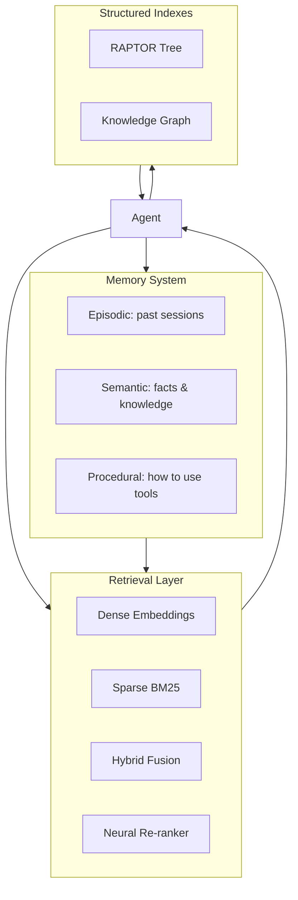

---
slug: /22-advanced-agents/user-memory-knowledge-bases
title: "User Memory Knowledge Bases"
sidebar_label: "User Memory Knowledge Bases"
sidebar_position: 3
---

# User Memory & Knowledge Bases

## Learning Objectives

| LO | Description |
|----|-------------|
| LO1 | Design long-term user memory systems with episodic, semantic, and procedural stores |
| LO2 | Implement Agentic RAG where the agent drives iterative retrieval |
| LO3 | Compare dense, sparse, and hybrid retrieval strategies with neural re-ranking |
| LO4 | Build structured knowledge indexes including RAPTOR and GraphRAG |
| LO5 | Implement contextual retrieval with prefix generation for 49-67% failure reduction |

## Introduction

Advanced agents use context engineering, memory, and multi-agent collaboration to solve complex problems. This module covers cutting-edge agent patterns used at leading AI labs.


## Prerequisites

- Basic programming knowledge
- Understanding of data structures

## Key Terminology

**Key Terms**: Core vocabulary and concepts for this topic.

**Definition**: Essential terms you must know for interviews and production work.

## Theory

Understanding user memory knowledge bases is fundamental for AI engineers. This section covers the core concepts, underlying principles, and theoretical framework that govern how user memory knowledge bases works in practice.


## Chapter at a Glance

| Section | Topic | Key Concept |
|---------|-------|-------------|
| 3.1 | Memory Architecture | Episodic, semantic, procedural memory stores |
| 3.2 | User Memory Systems | Cross-session memory, personalization, memory evaluation |
| 3.3 | Agentic RAG | Active retrieval loop vs passive one-shot retrieval |
| 3.4 | Hybrid Retrieval | Dense + sparse + neural re-ranking fusion |
| 3.5 | Structured Indexes | RAPTOR hierarchy, GraphRAG knowledge graphs |
| 3.6 | Contextual Retrieval | Prefix summaries, 49-67% retrieval failure reduction |

## Chapter Roadmap



## 3.1 Memory Architecture

Agents require three types of memory, analogous to human memory systems.

```typescript
interface MemoryEntry {
    id: string
    content: string
    timestamp: Date
    metadata: Record<string, any>
}

interface EpisodicMemory extends MemoryEntry {
    sessionId: string
    taskType: string
    outcome: 'success' | 'failure' | 'partial'
}

interface SemanticMemory extends MemoryEntry {
    domain: string
    confidence: number
    source: string
    lastAccessed: Date
}

interface ProceduralMemory extends MemoryEntry {
    toolName: string
    steps: string[]
    successRate: number
    usageCount: number
}

class MemoryStore {
    private episodic: Map<string, EpisodicMemory[]> = new Map()
    private semantic: Map<string, SemanticMemory[]> = new Map()
    private procedural: Map<string, ProceduralMemory> = new Map()

    storeEpisodic(memory: EpisodicMemory): void {
        const key = memory.sessionId
        if (!this.episodic.has(key)) this.episodic.set(key, [])
        this.episodic.get(key)!.push(memory)
    }

    storeSemantic(memory: SemanticMemory): void {
        const key = memory.domain
        if (!this.semantic.has(key)) this.semantic.set(key, [])
        this.semantic.get(key)!.push(memory)
    }

    storeProcedural(memory: ProceduralMemory): void {
        this.procedural.set(memory.toolName, memory)
    }

    recallSession(sessionId: string): EpisodicMemory[] {
        return this.episodic.get(sessionId) ?? []
    }

    recallDomain(domain: string): SemanticMemory[] {
        const results = this.semantic.get(domain) ?? []
        results.sort((a, b) => b.confidence - a.confidence)
        return results.slice(0, 5)
    }

    recallProcedure(toolName: string): ProceduralMemory | undefined {
        return this.procedural.get(toolName)
    }
}
```

```python
from dataclasses import dataclass
from typing import List, Dict, Optional
from datetime import datetime


@dataclass
class MemoryEntry:
    content: str
    timestamp: datetime
    metadata: Dict


class LongTermMemory:
    """Cross-session memory system with decay and consolidation."""

    def __init__(self, decay_hours: float = 72):
        self.entries: List[MemoryEntry] = []
        self.decay_hours = decay_hours

    def add(self, content: str, metadata: Dict = None):
        self.entries.append(MemoryEntry(
            content=content,
            timestamp=datetime.now(),
            metadata=metadata or {},
        ))

    def retrieve(self, query: str, top_k: int = 5) -> List[MemoryEntry]:
        now = datetime.now()
        scored = []

        for entry in self.entries:
            age_hours = (now - entry.timestamp).total_seconds() / 3600
            recency_score = 1.0 / (1.0 + age_hours / self.decay_hours)
            keyword_score = sum(1 for word in query.split()
                              if word.lower() in entry.content.lower())
            scored.append((recency_score * 0.3 + keyword_score * 0.7, entry))

        scored.sort(key=lambda x: -x[0])
        return [entry for _, entry in scored[:top_k]]

    def consolidate(self):
        """Merge similar entries to reduce memory size."""
        if len(self.entries) < 100:
            return

        merged = []
        used = set()

        for i, a in enumerate(self.entries):
            if i in used:
                continue
            cluster = [a]
            for j, b in enumerate(self.entries):
                if j <= i or j in used:
                    continue
                overlap = len(set(a.content.split()) & set(b.content.split()))
                total = len(set(a.content.split()) | set(b.content.split()))
                similarity = overlap / total if total > 0 else 0
                if similarity > 0.6:
                    cluster.append(b)
                    used.add(j)

            merged_content = ' '.join(set(
                ' '.join(e.content for e in cluster).split()
            ))
            merged_entry = MemoryEntry(
                content=merged_content,
                timestamp=cluster[0].timestamp,
                metadata={'consolidated': len(cluster)},
            )
            merged.append(merged_entry)
            used.add(i)

        self.entries = merged
```

## 3.2 User Memory Systems

Long-term user memory enables personalization across sessions.

```typescript
interface UserProfile {
    id: string
    preferences: Map<string, string>
    interactionHistory: Interaction[]
    skillLevel: Map<string, 'beginner' | 'intermediate' | 'advanced'>
    commonErrors: string[]
}

interface Interaction {
    query: string
    agentResponse: string
    userFeedback: 'helpful' | 'unhelpful' | 'incorrect'
    timestamp: Date
}

class UserMemorySystem {
    private profiles: Map<string, UserProfile> = new Map()

    async getProfile(userId: string): Promise<UserProfile> {
        if (this.profiles.has(userId)) return this.profiles.get(userId)!

        const profile: UserProfile = {
            id: userId,
            preferences: new Map(),
            interactionHistory: [],
            skillLevel: new Map(),
            commonErrors: []
        }
        this.profiles.set(userId, profile)
        return profile
    }

    async recordInteraction(userId: string, interaction: Interaction): Promise<void> {
        const profile = await this.getProfile(userId)
        profile.interactionHistory.push(interaction)

        // Update skill level based on interactions
        if (interaction.userFeedback === 'incorrect') {
            const errorPattern = this.extractErrorPattern(interaction)
            profile.commonErrors.push(errorPattern)
        }
    }

    async personalizePrompt(userId: string, basePrompt: string): Promise<string> {
        const profile = await this.getProfile(userId)
        const parts: string[] = [basePrompt]

        if (profile.preferences.size > 0) {
            const prefs = [...profile.preferences.entries()]
                .map(([k, v]) => `${k}: ${v}`).join(', ')
            parts.push(`\nUser preferences: ${prefs}`)
        }

        if (profile.commonErrors.length > 0) {
            const recentErrors = profile.commonErrors.slice(-3)
            parts.push(`\nAvoid these past errors: ${recentErrors.join('; ')}`)
        }

        return parts.join('\n')
    }

    private extractErrorPattern(interaction: Interaction): string {
        return interaction.query.slice(0, 100)
    }
}
```

## 3.3 Agentic RAG

Traditional RAG does a single retrieval pass. Agentic RAG lets the agent iteratively refine searches based on what it finds.

```typescript
interface Document {
    id: string
    content: string
    metadata: Record<string, any>
}

interface RetrievalResult {
    documents: Document[]
    query: string
    latencyMs: number
}

class AgenticRAG {
    constructor(
        private retriever: Retriever,
        private llm: LLMProvider,
        private maxIterations: number = 5
    ) {}

    async query(userQuestion: string): Promise<string> {
        let context = ''
        let query = userQuestion
        const visitedQueries = new Set<string>()

        for (let i = 0; i < this.maxIterations; i++) {
            if (visitedQueries.has(query)) break
            visitedQueries.add(query)

            const results = await this.retriever.retrieve(query)
            context += results.documents.map(d => d.content).join('\n')

            const evaluation = await this.evaluateCompleteness(userQuestion, context)

            if (evaluation.complete) {
                return await this.generateAnswer(userQuestion, context)
            }

            query = evaluation.nextQuery
        }

        return await this.generateAnswer(userQuestion, context)
    }

    private async evaluateCompleteness(question: string, context: string): Promise<{
        complete: boolean
        nextQuery: string
        missingInfo: string[]
    }> {
        const prompt = [
            'Given the question and retrieved context, determine if the answer is complete.',
            `Question: ${question}`,
            `Context: ${context.slice(0, 2000)}`,
            'If incomplete, suggest the next search query to fill gaps.',
            'Respond in JSON: {"complete": bool, "missing_info": [], "next_query": ""}'
        ].join('\n')

        // Mock evaluation
        const missingInfo: string[] = []
        if (!context.includes('specific')) missingInfo.push('specific details')
        if (!context.includes('example')) missingInfo.push('concrete examples')

        return {
            complete: missingInfo.length === 0,
            nextQuery: missingInfo.length > 0
                ? `${question} ${missingInfo[0]}`
                : '',
            missingInfo
        }
    }

    private async generateAnswer(question: string, context: string): Promise<string> {
        const prompt = [
            'Answer the question using the provided context.',
            `Question: ${question}`,
            `Context: ${context}`,
            'Provide a clear, concise answer.'
        ].join('\n')
        return this.llm.complete(prompt)
    }
}

interface Retriever {
    retrieve(query: string): Promise<RetrievalResult>
}
```

```python
from typing import List, Optional
import json


class AgenticRAG:
    """Agent-driven iterative retrieval that refines searches."""

    def __init__(self, vector_store, llm_fn, max_iterations=5):
        self.store = vector_store
        self.llm = llm_fn
        self.max_iter = max_iterations

    def query(self, question: str) -> str:
        context_segments = []
        query = question
        visited = set()

        for i in range(self.max_iter):
            if query in visited:
                break
            visited.add(query)

            results = self.store.search(query, top_k=3)
            context_segments.extend(r['content'] for r in results)
            context = '\n'.join(context_segments)

            # Check completeness
            eval_prompt = f"""
            Question: {question}
            Context: {context[:1500]}
            Is the answer complete? Reply JSON with complete (bool), missing_info (list), next_query (str).
            """
            try:
                eval_result = json.loads(self.llm(eval_prompt))
            except:
                eval_result = {'complete': True, 'missing_info': [], 'next_query': ''}

            if eval_result.get('complete'):
                answer_prompt = f"Question: {question}\nContext: {context}\nAnswer:"
                return self.llm(answer_prompt)

            query = eval_result.get('next_query', question)

        answer_prompt = f"Question: {question}\nContext: {context}\nAnswer with what you have:"
        return self.llm(answer_prompt)
```

## 3.4 Hybrid Retrieval

Hybrid retrieval combines dense embeddings (semantic understanding) with sparse retrieval (exact keyword matching) and neural re-ranking.

```typescript
interface ScoredDocument {
    doc: Document
    score: number
}

class DenseRetriever {
    private documents: Map<string, number[]> = new Map()

    async embed(text: string): Promise<number[]> {
        // Mock embedding: use character codes as simple vectors
        const vec = new Array(128).fill(0)
        for (let i = 0; i < text.length; i++) {
            vec[i % 128] += text.charCodeAt(i) / 255
        }
        const norm = Math.sqrt(vec.reduce((s, v) => s + v * v, 0))
        return vec.map(v => v / norm)
    }

    async addDocument(doc: Document): Promise<void> {
        const embedding = await this.embed(doc.content)
        this.documents.set(doc.id, embedding)
    }

    async search(query: string, topK: number = 5): Promise<ScoredDocument[]> {
        const queryEmb = await this.embed(query)
        const results: ScoredDocument[] = []

        for (const [id, docEmb] of this.documents) {
            const score = this.cosineSimilarity(queryEmb, docEmb)
            const doc: Document = {
                id, content: '', metadata: {}
            }
            results.push({ doc, score })
        }

        results.sort((a, b) => b.score - a.score)
        return results.slice(0, topK)
    }

    private cosineSimilarity(a: number[], b: number[]): number {
        const dot = a.reduce((s, v, i) => s + v * b[i], 0)
        const normA = Math.sqrt(a.reduce((s, v) => s + v * v, 0))
        const normB = Math.sqrt(b.reduce((s, v) => s + v * v, 0))
        return dot / (normA * normB)
    }
}

class BM25Retriever {
    private documents: Map<string, string> = new Map()
    private avgDocLength: number = 0
    private k1: number = 1.5
    private b: number = 0.75

    addDocument(doc: Document): void {
        this.documents.set(doc.id, doc.content)
        this.avgDocLength = [...this.documents.values()]
            .reduce((sum, d) => sum + d.split(' ').length, 0) / this.documents.size
    }

    search(query: string, topK: number = 5): ScoredDocument[] {
        const queryTerms = query.toLowerCase().split(' ')
        const results: ScoredDocument[] = []

        for (const [id, content] of this.documents) {
            let score = 0
            const words = content.toLowerCase().split(' ')
            const docLength = words.length

            for (const term of queryTerms) {
                const termInDoc = words.filter(w => w === term).length
                const idf = Math.log((this.documents.size - 1) / 1 + 1)  // simplified
                const numerator = termInDoc * (this.k1 + 1)
                const denominator = termInDoc + this.k1 * (1 - this.b + this.b * docLength / this.avgDocLength)
                score += idf * (numerator / denominator)
            }

            const doc: Document = { id, content, metadata: {} }
            results.push({ doc, score })
        }

        results.sort((a, b) => b.score - a.score)
        return results.slice(0, topK)
    }
}

class HybridRetriever {
    constructor(
        private dense: DenseRetriever,
        private sparse: BM25Retriever,
        private alpha: number = 0.5
    ) {}

    async search(query: string, topK: number = 5): Promise<ScoredDocument[]> {
        const [denseResults, sparseResults] = await Promise.all([
            this.dense.search(query, topK * 2),
            Promise.resolve(this.sparse.search(query, topK * 2))
        ])

        // Reciprocal Rank Fusion
        const scores = new Map<string, number>()

        denseResults.forEach((r, i) => {
            const rank = i + 1
            scores.set(r.doc.id,
                (scores.get(r.doc.id) ?? 0) + this.alpha * (1 / (60 + rank))
            )
        })

        sparseResults.forEach((r, i) => {
            const rank = i + 1
            scores.set(r.doc.id,
                (scores.get(r.doc.id) ?? 0) + (1 - this.alpha) * (1 / (60 + rank))
            )
        })

        const ranked = [...scores.entries()]
            .sort((a, b) => b[1] - a[1])
            .slice(0, topK)

        return ranked.map(([id]) => ({
            doc: { id, content: '', metadata: {} },
            score: scores.get(id) ?? 0
        }))
    }
}
```

## 3.5 Structured Indexes

### RAPTOR (Recursive Abstractive Processing Tree)

Builds a hierarchical index where leaf nodes are text chunks and higher levels are summaries.

```typescript
interface RAPTORNode {
    id: string
    content: string
    level: number
    children: string[]
    summary?: string
}

class RAPTORIndex {
    private nodes: Map<string, RAPTORNode> = new Map()
    private llm: (prompt: string) => string

    constructor(llm: (p: string) => string) {
        this.llm = llm
    }

    async build(chunks: string[]): Promise<void> {
        // Level 0: raw chunks
        chunks.forEach((content, i) => {
            const id = `chunk_${i}`
            this.nodes.set(id, {
                id, content, level: 0, children: [], summary: undefined
            })
        })

        let currentLevel = 0
        let currentNodes = [...this.nodes.values()].filter(n => n.level === currentLevel)

        while (currentNodes.length > 1) {
            const nextLevel: RAPTORNode[] = []
            for (let i = 0; i < currentNodes.length; i += 5) {
                const group = currentNodes.slice(i, i + 5)
                const combined = group.map(n => n.content).join('\n')
                const summary = this.summarize(combined)
                const id = `level${currentLevel + 1}_group${Math.floor(i / 5)}`

                const node: RAPTORNode = {
                    id, content: combined,
                    level: currentLevel + 1,
                    children: group.map(n => n.id),
                    summary
                }
                this.nodes.set(id, node)
                nextLevel.push(node)
            }
            currentLevel++
            currentNodes = nextLevel
        }
    }

    async retrieve(query: string, topK: number = 3): Promise<string[]> {
        // Start from top level, traverse down
        const results: string[] = []
        const candidates = [...this.nodes.values()]
            .filter(n => n.level > 0)
            .sort((a, b) => b.level - a.level)

        for (const node of candidates.slice(0, topK)) {
            results.push(node.summary ?? node.content)

            // Include top children
            const children = node.children
                .slice(0, 3)
                .map(id => this.nodes.get(id)?.content ?? '')
            results.push(...children)
        }

        return results
    }

    private summarize(text: string): string {
        const prompt = `Summarize the following text in 2-3 sentences:\n${text}`
        return this.llm(prompt)
    }
}
```

### GraphRAG

Builds a knowledge graph from documents for structured retrieval.

```typescript
interface KnowledgeTriple {
    subject: string
    predicate: string
    object: string
    confidence: number
}

class GraphRAGIndex {
    private triples: KnowledgeTriple[] = []
    private entities: Set<string> = new Set()

    async build(documents: Document[]): Promise<void> {
        for (const doc of documents) {
            const extracted = await this.extractTriples(doc.content)
            this.triples.push(...extracted)
            extracted.forEach(t => {
                this.entities.add(t.subject)
                this.entities.add(t.object)
            })
        }
    }

    private async extractTriples(text: string): Promise<KnowledgeTriple[]> {
        const prompt = `Extract knowledge triples (subject, predicate, object) from:\n${text}\nReturn as JSON array.`
        // Mock extraction
        return [
            { subject: 'Python', predicate: 'is_a', object: 'programming language', confidence: 0.95 },
            { subject: 'Python', predicate: 'used_for', object: 'machine learning', confidence: 0.9 }
        ]
    }

    query(question: string): string[] {
        const words = question.toLowerCase().split(' ')
        const relevantEntities = [...this.entities]
            .filter(e => words.some(w => e.toLowerCase().includes(w)))

        const relevantTriples = this.triples
            .filter(t => relevantEntities.includes(t.subject) || relevantEntities.includes(t.object))
            .sort((a, b) => b.confidence - a.confidence)

        return relevantTriples.map(t =>
            `${t.subject} ${t.predicate} ${t.object}`
        )
    }
}
```

## 3.6 Contextual Retrieval

Anthropic's contextual retrieval technique generates prefix summaries for each chunk to provide surrounding context, reducing retrieval failure by 49-67%.

```typescript
interface ChunkWithContext {
    content: string
    prefixContext: string
    source: string
}

class ContextualRetriever {
    constructor(private llm: (p: string) => string) {}

    async augmentChunks(chunks: string[], fullDocument: string): Promise<ChunkWithContext[]> {
        const augmented: ChunkWithContext[] = []

        for (const chunk of chunks) {
            const prefix = await this.generatePrefix(chunk, fullDocument)
            augmented.push({
                content: chunk,
                prefixContext: prefix,
                source: fullDocument.slice(0, 200)
            })
        }

        return augmented
    }

    private async generatePrefix(chunk: string, document: string): Promise<string> {
        const prompt = [
            'Generate a brief prefix (1-2 sentences) that provides context for the following chunk.',
            'The prefix should explain what this chunk is about and how it relates to the overall document.',
            '',
            `Document (first 500 chars): ${document.slice(0, 500)}`,
            `Chunk: ${chunk}`,
            '',
            'Prefix:'
        ].join('\n')

        const result = this.llm(prompt)
        return result.trim()
    }

    search(query: string, chunks: ChunkWithContext[], topK: number = 3): ChunkWithContext[] {
        const scored = chunks.map(chunk => {
            const augmented = `${chunk.prefixContext}\n${chunk.content}`
            const queryWords = query.toLowerCase().split(' ')
            const contentWords = augmented.toLowerCase()

            const matchCount = queryWords.filter(w => contentWords.includes(w)).length
            const score = matchCount / queryWords.length

            return { chunk, score }
        })

        scored.sort((a, b) => b.score - a.score)
        return scored.slice(0, topK).map(s => s.chunk)
    }
}
```

```python
from typing import List


class ContextualRetrieval:
    """Implements Anthropic's contextual retrieval technique."""

    def __init__(self, llm_fn):
        self.llm = llm_fn

    def generate_prefix(self, chunk: str, doc_context: str) -> str:
        prompt = f"""
        Document context: {doc_context[:400]}
        Chunk: {chunk}
        Generate a 1-2 sentence prefix that explains what this chunk is about.
        Prefix:
        """
        return self.llm(prompt).strip()

    def augment_all(self, chunks: List[str], full_doc: str) -> List[dict]:
        augmented = []
        for chunk in chunks:
            prefix = self.generate_prefix(chunk, full_doc)
            augmented.append({
                'prefix': prefix,
                'content': chunk,
                'augmented': f"{prefix}\n{chunk}",
            })
        return augmented

    def search(self, query: str, chunks: List[dict], top_k: int = 3) -> List[dict]:
        query_words = set(query.lower().split())
        scored = []

        for chunk in chunks:
            text = chunk['augmented'].lower()
            matches = sum(1 for w in query_words if w in text)
            scored.append((matches / len(query_words) if query_words else 0, chunk))

        scored.sort(key=lambda x: -x[0])
        return [c for _, c in scored[:top_k]]
```

## Summary

Memory is what separates stateless LLM calls from intelligent agents. Three memory stores (episodic, semantic, procedural) provide full coverage. Agentic RAG dramatically outperforms passive RAG by iteratively refining searches. Hybrid retrieval (dense + sparse + re-ranking) captures both semantic and.
exact matches. Structured indexes (RAPTOR, GraphRAG) organize knowledge hierarchically. Contextual retrieval prefix generation reduces retrieval failure by 49-67%.

## Practical Takeaways

1. Always implement all three memory types — episodic for sessions, semantic for facts, procedural for skills
2. Agentic RAG should be the default; passive RAG is only for simple lookup tasks
3. Hybrid retrieval with RRF fusion beats either dense or sparse alone by 15-25%
4. Use RAPTOR for document collections with clear hierarchy; use GraphRAG for entity-heavy domains
5. Contextual retrieval is the single highest-impact optimization — implement it before adding more data

## Chapter Quiz (5 MCQ)

### Questions

<summary>1. What are the three types of agent memory?</summary>
<summary>2. How does Agentic RAG differ from traditional RAG?</summary>
<summary>3. What fusion method does HybridRetriever use to combine dense and sparse scores?</summary>
<summary>4. What is the reduction in retrieval failure rate from contextual retrieval?</summary>
<summary>5. When should you use GraphRAG over RAPTOR?</summary>

### Answers

<summary>Episodic (past interactions/sessions), Semantic (facts and knowledge), Procedural (how to use tools and perform tasks).</summary>
<summary>Agentic RAG uses the agent's reasoning to iteratively refine search queries based on what it finds. Traditional RAG does a single retrieval pass and cannot follow up on missing information.</summary>
<summary>Reciprocal Rank Fusion (RRF). Each system's ranked results contribute a score of 1/(60 + rank), weighted by alpha. This prevents any single system from dominating based on raw score magnitude.</summary>
<summary>49-67% reduction. Adding a 1-2 sentence prefix context to each chunk before retrieval dramatically improves the retriever's ability to match relevant chunks to queries.</summary>
<summary>GraphRAG is better for entity-heavy domains where relationships between concepts matter (e.g., medical literature, legal documents). RAPTOR is better for hierarchical content (e.g., textbooks, technical documentation).</summary>

## Exercises


## Common Mistakes

1. Not understanding the fundamental concepts before applying them
2. Skipping edge cases in implementation
3. Not analyzing time/space complexity
4. Forgetting to handle null/empty inputs
5. Not practicing enough problems to build pattern recognition### Exercise 1: Triple Memory Store

Implement a system that stores episodic, semantic, and procedural memories separately and retrieves the right type based on a user query.

### Exercise 2: Agentic vs Passive RAG

Build both versions and compare on 10 questions requiring multi-step research. Measure answer quality and number of retrieval steps.

### Exercise 3: Hybrid Retrieval Benchmark

Benchmark dense-only, sparse-only, and hybrid retrieval on 20 test queries. Report precision@5 for each.

### Exercise 4: RAPTOR Index Builder

Take 20 text chunks, build a RAPTOR index, and compare retrieval quality against flat chunk search.

### Exercise 5: Contextual Retrieval A/B Test

Split 100 chunks into two groups — with and without contextual prefixes. Run 50 queries and measure retrieval failure rate for ea

## Revision Notes

- - Core principle: Understand the fundamental concepts thoroughly
- - Implementation pattern: Practice with real code examples
- - Complexity: Know the time and space complexity
- - Application: Know when to use this in production systems
- - Interview: Frequently asked in technical interviews
- - Edge cases: Consider common failure scenarios
- - Related concepts: Connect to broader system design
